Replicate and extend analyses from Antao et al. 2020
================

# Load data and libraries

    ## here() starts at /local/home/malinp/climate_community_crossrealm

    ## Warning: NAs introduced by coercion

# Compare datasets

## Trends included

``` r
# how many ts missing?
length(setdiff(dat$rarefyID, bt$rarefyID))
```

    ## [1] 0

``` r
length(missing <- setdiff(dat$rarefyID, trends$rarefyID))
```

    ## [1] 69

``` r
length(setdiff(bt$rarefyID, trends$rarefyID))
```

    ## [1] 20304

``` r
length(setdiff(dat$rarefyID, rich$rarefyID))
```

    ## [1] 0

``` r
#richness of missing ts
rich[rarefyID %in% missing, summary(Nspp)]
```

    ##    Min. 1st Qu.  Median    Mean 3rd Qu.    Max. 
    ##   1.000   2.000   2.000   1.768   2.000   2.000

``` r
rich[rarefyID %in% missing & Nspp < 3, .N] # only 69 fail because too few species
```

    ## [1] 69

``` r
# years in missing ts
nyrs <- bt[, .(nyrBT = length(unique(c(year1, year2)))), by = rarefyID]
nyrs[rarefyID %in% missing, summary(nyrBT)]
```

    ##    Min. 1st Qu.  Median    Mean 3rd Qu.    Max. 
    ##   5.000   5.000   6.000   6.377   7.000  13.000

``` r
nyrs[rarefyID %in% missing & nyrBT < 5, .N] # none fail because too few years
```

    ## [1] 0

``` r
# Full Antao vs. Antao now with human and mass
length(setdiff(dat$rarefyID, combMHlogS$rarefyID)) # only missing 92 ts
```

    ## [1] 92

## Response variables

### Plots

<!-- -->

    ## NULL

<!-- -->

    ## NULL

    ## NULL

<!-- -->

    ## NULL

<!-- --><!-- -->

    ## NULL

<!-- -->

    ## NULL

<!-- -->

    ## NULL

<!-- -->

    ## NULL

<!-- -->

    ## NULL

<!-- -->

    ## NULL

<!-- -->

    ## NULL

<!-- -->

    ## NULL

<!-- -->

    ## NULL

<!-- -->

    ## NULL

### Correlations

``` r
comb[model_id == 'logS_lm' & measure == 'Jtu', cor(slope, disstrend)]
```

    ## [1] -0.07323631

``` r
comb[model_id == 'Gains_lm' & measure == 'Jtu', cor(slope, disstrend)]
```

    ## [1] -0.009094795

``` r
comb[model_id == 'Losses_lm' & measure == 'Jtu', cor(slope, disstrend)]
```

    ## [1] 0.2258978

``` r
comb[model_id == 'logS_lm' & measure == 'Jbeta', cor(slope, disstrend)]
```

    ## [1] -0.0934493

``` r
comb[model_id == 'Gains_lm' & measure == 'Jbeta', cor(slope, disstrend)]
```

    ## [1] 0.1089186

``` r
comb[model_id == 'Losses_lm' & measure == 'Jbeta', cor(slope, disstrend)]
```

    ## [1] 0.3434489

``` r
comb[model_id == 'logS_lm' & measure == 'Horn', cor(slope, disstrend)]
```

    ## [1] -0.06057827

``` r
comb[model_id == 'logN_lm' & measure == 'Horn', cor(slope, disstrend)]
```

    ## [1] -0.05549073

``` r
comb[model_id == 'Gains_lm' & measure == 'Horn', cor(slope, disstrend)]
```

    ## [1] 0.02256426

``` r
comb[model_id == 'Losses_lm' & measure == 'Horn', cor(slope, disstrend)]
```

    ## [1] 0.1837287

# Fit richness model

## Original model with glmmTMB

The richness (logS) model fit with glmmTMB as a single model matches the
published results (realm-specific models fit with brms) if the error and
RE terms are realm-specific.

``` r
# published model
mod0 <- glmmTMB(slope ~ 0 + new_sTempYear:REALM + TempGAMCoef:REALM + TempGAMCoef:new_sTempYear:REALM
                +(0 + TempGAMCoef|REALM/taxa_mod1) +(1|REALM/taxa_mod1/STUDY_ID), 
                disp = ~std.error*REALM,
                data = datS)

summary(mod0)
```

    ##  Family: gaussian  ( identity )
    ## Formula:          
    ## slope ~ 0 + new_sTempYear:REALM + TempGAMCoef:REALM + TempGAMCoef:new_sTempYear:REALM +  
    ##     (0 + TempGAMCoef | REALM/taxa_mod1) + (1 | REALM/taxa_mod1/STUDY_ID)
    ## Dispersion:             ~std.error * REALM
    ## Data: datS
    ## 
    ##      AIC      BIC   logLik deviance df.resid 
    ## -80528.1 -80408.4  40279.0 -80558.1    21485 
    ## 
    ## Random effects:
    ## 
    ## Conditional model:
    ##  Groups                     Name        Variance  Std.Dev. 
    ##  taxa_mod1.REALM            TempGAMCoef 4.220e-03 0.0649587
    ##  REALM                      TempGAMCoef 4.028e-07 0.0006347
    ##  STUDY_ID..taxa_mod1.REALM. (Intercept) 3.035e-04 0.0174222
    ##  taxa_mod1.REALM.1          (Intercept) 2.012e-05 0.0044856
    ##  REALM.1                    (Intercept) 1.188e-05 0.0034464
    ##  Residual                                      NA        NA
    ## Number of obs: 21500, groups:  
    ## taxa_mod1:REALM, 12; REALM, 2; STUDY_ID:(taxa_mod1:REALM), 156
    ## 
    ## Conditional model:
    ##                                              Estimate Std. Error z value
    ## new_sTempYear:REALMMarine                   0.0029022  0.0005907   4.913
    ## new_sTempYear:REALMTerrestrial              0.0011181  0.0007450   1.501
    ## REALMMarine:TempGAMCoef                     0.0938505  0.0331252   2.833
    ## REALMTerrestrial:TempGAMCoef               -0.0091852  0.0398106  -0.231
    ## new_sTempYear:REALMMarine:TempGAMCoef       0.0848609  0.0117952   7.195
    ## new_sTempYear:REALMTerrestrial:TempGAMCoef -0.0140901  0.0132704  -1.062
    ##                                            Pr(>|z|)    
    ## new_sTempYear:REALMMarine                  8.96e-07 ***
    ## new_sTempYear:REALMTerrestrial              0.13342    
    ## REALMMarine:TempGAMCoef                     0.00461 ** 
    ## REALMTerrestrial:TempGAMCoef                0.81753    
    ## new_sTempYear:REALMMarine:TempGAMCoef      6.27e-13 ***
    ## new_sTempYear:REALMTerrestrial:TempGAMCoef  0.28834    
    ## ---
    ## Signif. codes:  0 '***' 0.001 '**' 0.01 '*' 0.05 '.' 0.1 ' ' 1
    ## 
    ## Dispersion model:
    ##                            Estimate Std. Error z value Pr(>|z|)    
    ## (Intercept)                -7.87426    0.01876  -419.8   <2e-16 ***
    ## std.error                  39.41112    0.47960    82.2   <2e-16 ***
    ## REALMTerrestrial           -0.60158    0.07103    -8.5   <2e-16 ***
    ## std.error:REALMTerrestrial 27.14306    2.46121    11.0   <2e-16 ***
    ## ---
    ## Signif. codes:  0 '***' 0.001 '**' 0.01 '*' 0.05 '.' 0.1 ' ' 1

### Plot

<!-- --><!-- -->

## With an intercept

Adding an intercept to allow turnover at 0 temperature change doesn’t
alter the results

``` r
# add an intercept to allow some turnover at 0 temperature change and ave temp. wouldn't converge with realm-specific intercept.
mod1 <- glmmTMB(slope ~ 1 + new_sTempYear:REALM + TempGAMCoef:REALM + TempGAMCoef:new_sTempYear:REALM
                +(0 + TempGAMCoef|REALM/taxa_mod1) +(1|REALM/taxa_mod1/STUDY_ID), 
                disp = ~std.error*REALM,
                data = datS)
summary(mod1)
```

    ##  Family: gaussian  ( identity )
    ## Formula:          
    ## slope ~ 1 + new_sTempYear:REALM + TempGAMCoef:REALM + TempGAMCoef:new_sTempYear:REALM +  
    ##     (0 + TempGAMCoef | REALM/taxa_mod1) + (1 | REALM/taxa_mod1/STUDY_ID)
    ## Dispersion:             ~std.error * REALM
    ## Data: datS
    ## 
    ##      AIC      BIC   logLik deviance df.resid 
    ## -80528.9 -80401.3  40280.5 -80560.9    21484 
    ## 
    ## Random effects:
    ## 
    ## Conditional model:
    ##  Groups                     Name        Variance  Std.Dev. 
    ##  taxa_mod1.REALM            TempGAMCoef 4.318e-03 6.571e-02
    ##  REALM                      TempGAMCoef 3.485e-11 5.903e-06
    ##  STUDY_ID..taxa_mod1.REALM. (Intercept) 3.150e-04 1.775e-02
    ##  taxa_mod1.REALM.1          (Intercept) 5.152e-09 7.178e-05
    ##  REALM.1                    (Intercept) 5.311e-11 7.288e-06
    ##  Residual                                      NA        NA
    ## Number of obs: 21500, groups:  
    ## taxa_mod1:REALM, 12; REALM, 2; STUDY_ID:(taxa_mod1:REALM), 156
    ## 
    ## Conditional model:
    ##                                              Estimate Std. Error z value
    ## (Intercept)                                 0.0040889  0.0019096   2.141
    ## new_sTempYear:REALMMarine                   0.0029077  0.0005906   4.923
    ## new_sTempYear:REALMTerrestrial              0.0010934  0.0007454   1.467
    ## REALMMarine:TempGAMCoef                     0.0949346  0.0333564   2.846
    ## REALMTerrestrial:TempGAMCoef               -0.0108016  0.0400265  -0.270
    ## new_sTempYear:REALMMarine:TempGAMCoef       0.0850749  0.0117844   7.219
    ## new_sTempYear:REALMTerrestrial:TempGAMCoef -0.0149665  0.0132720  -1.128
    ##                                            Pr(>|z|)    
    ## (Intercept)                                 0.03226 *  
    ## new_sTempYear:REALMMarine                  8.52e-07 ***
    ## new_sTempYear:REALMTerrestrial              0.14242    
    ## REALMMarine:TempGAMCoef                     0.00443 ** 
    ## REALMTerrestrial:TempGAMCoef                0.78727    
    ## new_sTempYear:REALMMarine:TempGAMCoef      5.23e-13 ***
    ## new_sTempYear:REALMTerrestrial:TempGAMCoef  0.25946    
    ## ---
    ## Signif. codes:  0 '***' 0.001 '**' 0.01 '*' 0.05 '.' 0.1 ' ' 1
    ## 
    ## Dispersion model:
    ##                            Estimate Std. Error z value Pr(>|z|)    
    ## (Intercept)                -7.87424    0.01876  -419.8   <2e-16 ***
    ## std.error                  39.41027    0.47961    82.2   <2e-16 ***
    ## REALMTerrestrial           -0.60133    0.07103    -8.5   <2e-16 ***
    ## std.error:REALMTerrestrial 27.12098    2.46098    11.0   <2e-16 ***
    ## ---
    ## Signif. codes:  0 '***' 0.001 '**' 0.01 '*' 0.05 '.' 0.1 ' ' 1

Another approach to adding an intercept: realm-specific, but with
simpler REs. This model but also with REALM-specific RE intercepts won’t
converge.

``` r
# realm-specific intercept. Simplify REs that were near zero.
mod2 <- glmmTMB(slope ~ 0 + REALM + new_sTempYear:REALM + TempGAMCoef:REALM + TempGAMCoef:new_sTempYear:REALM
                +(0 + TempGAMCoef|REALM/taxa_mod1) +(1|taxa_mod1/STUDY_ID), 
                disp = ~std.error*REALM,
                data = datS)


summary(mod2)
```

    ##  Family: gaussian  ( identity )
    ## Formula:          
    ## slope ~ 0 + REALM + new_sTempYear:REALM + TempGAMCoef:REALM +  
    ##     TempGAMCoef:new_sTempYear:REALM + (0 + TempGAMCoef | REALM/taxa_mod1) +  
    ##     (1 | taxa_mod1/STUDY_ID)
    ## Dispersion:             ~std.error * REALM
    ## Data: datS
    ## 
    ##      AIC      BIC   logLik deviance df.resid 
    ## -80529.7 -80402.0  40280.8 -80561.7    21484 
    ## 
    ## Random effects:
    ## 
    ## Conditional model:
    ##  Groups             Name        Variance  Std.Dev. 
    ##  taxa_mod1:REALM    TempGAMCoef 4.258e-03 6.525e-02
    ##  REALM              TempGAMCoef 6.337e-09 7.961e-05
    ##  STUDY_ID:taxa_mod1 (Intercept) 3.059e-04 1.749e-02
    ##  taxa_mod1          (Intercept) 3.225e-06 1.796e-03
    ##  Residual                              NA        NA
    ## Number of obs: 21500, groups:  
    ## taxa_mod1:REALM, 12; REALM, 2; STUDY_ID:taxa_mod1, 156; taxa_mod1, 9
    ## 
    ## Conditional model:
    ##                                              Estimate Std. Error z value
    ## REALMMarine                                 0.0056594  0.0028452   1.989
    ## REALMTerrestrial                            0.0025707  0.0034766   0.739
    ## REALMMarine:new_sTempYear                   0.0029074  0.0005905   4.924
    ## REALMTerrestrial:new_sTempYear              0.0011078  0.0007452   1.487
    ## REALMMarine:TempGAMCoef                     0.0938602  0.0331841   2.828
    ## REALMTerrestrial:TempGAMCoef               -0.0104593  0.0402199  -0.260
    ## REALMMarine:new_sTempYear:TempGAMCoef       0.0848073  0.0117877   7.195
    ## REALMTerrestrial:new_sTempYear:TempGAMCoef -0.0144800  0.0132750  -1.091
    ##                                            Pr(>|z|)    
    ## REALMMarine                                 0.04669 *  
    ## REALMTerrestrial                            0.45965    
    ## REALMMarine:new_sTempYear                  8.48e-07 ***
    ## REALMTerrestrial:new_sTempYear              0.13711    
    ## REALMMarine:TempGAMCoef                     0.00468 ** 
    ## REALMTerrestrial:TempGAMCoef                0.79482    
    ## REALMMarine:new_sTempYear:TempGAMCoef      6.27e-13 ***
    ## REALMTerrestrial:new_sTempYear:TempGAMCoef  0.27537    
    ## ---
    ## Signif. codes:  0 '***' 0.001 '**' 0.01 '*' 0.05 '.' 0.1 ' ' 1
    ## 
    ## Dispersion model:
    ##                            Estimate Std. Error z value Pr(>|z|)    
    ## (Intercept)                -7.87418    0.01876  -419.8   <2e-16 ***
    ## std.error                  39.41033    0.47963    82.2   <2e-16 ***
    ## REALMTerrestrial           -0.60187    0.07102    -8.5   <2e-16 ***
    ## std.error:REALMTerrestrial 27.13924    2.46101    11.0   <2e-16 ***
    ## ---
    ## Signif. codes:  0 '***' 0.001 '**' 0.01 '*' 0.05 '.' 0.1 ' ' 1

## With my temperature data

``` r
# 
mod0alt_tempdata <- glmmTMB(slope ~ 0 + tempave.sc:REALM + temptrend.sc:REALM + temptrend.sc:tempave.sc:REALM
                +(0 + temptrend.sc|REALM/taxa_mod1) +(1|REALM/taxa_mod1/STUDY_ID), 
                disp = ~std.error*REALM,
                data = comb[!duplicated(rarefyID) & model_id == 'logS_lm',])
```

    ## Warning in fitTMB(TMBStruc): Model convergence problem; non-positive-definite
    ## Hessian matrix. See vignette('troubleshooting')

``` r
summary(mod0alt_tempdata)
```

    ##  Family: gaussian  ( identity )
    ## Formula:          
    ## slope ~ 0 + tempave.sc:REALM + temptrend.sc:REALM + temptrend.sc:tempave.sc:REALM +  
    ##     (0 + temptrend.sc | REALM/taxa_mod1) + (1 | REALM/taxa_mod1/STUDY_ID)
    ## Dispersion:             ~std.error * REALM
    ## Data: comb[!duplicated(rarefyID) & model_id == "logS_lm", ]
    ## 
    ##      AIC      BIC   logLik deviance df.resid 
    ##       NA       NA       NA       NA    21148 
    ## 
    ## Random effects:
    ## 
    ## Conditional model:
    ##  Groups                     Name         Variance  Std.Dev. 
    ##  taxa_mod1.REALM            temptrend.sc 1.699e-04 1.303e-02
    ##  REALM                      temptrend.sc 1.407e-10 1.186e-05
    ##  STUDY_ID..taxa_mod1.REALM. (Intercept)  3.383e-04 1.839e-02
    ##  taxa_mod1.REALM.1          (Intercept)  1.315e-16 1.147e-08
    ##  REALM.1                    (Intercept)  1.673e-05 4.090e-03
    ##  Residual                                       NA        NA
    ## Number of obs: 21163, groups:  
    ## taxa_mod1:REALM, 12; REALM, 2; STUDY_ID:(taxa_mod1:REALM), 155
    ## 
    ## Conditional model:
    ##                                            Estimate Std. Error z value Pr(>|z|)
    ## tempave.sc:REALMMarine                    0.0044289         NA      NA       NA
    ## tempave.sc:REALMTerrestrial               0.0009143         NA      NA       NA
    ## REALMMarine:temptrend.sc                  0.0169319         NA      NA       NA
    ## REALMTerrestrial:temptrend.sc            -0.0023093         NA      NA       NA
    ## tempave.sc:REALMMarine:temptrend.sc       0.0032050         NA      NA       NA
    ## tempave.sc:REALMTerrestrial:temptrend.sc  0.0006510         NA      NA       NA
    ## 
    ## Dispersion model:
    ##                            Estimate Std. Error z value Pr(>|z|)
    ## (Intercept)                  -7.883         NA      NA       NA
    ## std.error                    39.519         NA      NA       NA
    ## REALMTerrestrial             -0.554         NA      NA       NA
    ## std.error:REALMTerrestrial   25.922         NA      NA       NA

### Plot

<!-- --><!-- -->
\#\# With abs(tempchange) abs(tempchange) is favored substantially
(deltaAIC 70) over tempchange. Coefficients are largely the same other
than this major changw.

``` r
# realm-specific intercept. Simplify REs that were near zero.
mod3 <- glmmTMB(slope ~ 0 + REALM + new_sTempYear:REALM + abs(TempGAMCoef):REALM + abs(TempGAMCoef):new_sTempYear:REALM
                +(0 + abs(TempGAMCoef)|REALM/taxa_mod1) +(1|taxa_mod1/STUDY_ID), 
                disp = ~std.error*REALM,
                data = datS)


summary(mod3)
```

    ##  Family: gaussian  ( identity )
    ## Formula:          
    ## slope ~ 0 + REALM + new_sTempYear:REALM + abs(TempGAMCoef):REALM +  
    ##     abs(TempGAMCoef):new_sTempYear:REALM + (0 + abs(TempGAMCoef) |  
    ##     REALM/taxa_mod1) + (1 | taxa_mod1/STUDY_ID)
    ## Dispersion:             ~std.error * REALM
    ## Data: datS
    ## 
    ##      AIC      BIC   logLik deviance df.resid 
    ## -80601.2 -80473.6  40316.6 -80633.2    21484 
    ## 
    ## Random effects:
    ## 
    ## Conditional model:
    ##  Groups             Name             Variance  Std.Dev. 
    ##  taxa_mod1:REALM    abs(TempGAMCoef) 6.824e-04 2.612e-02
    ##  REALM              abs(TempGAMCoef) 5.157e-10 2.271e-05
    ##  STUDY_ID:taxa_mod1 (Intercept)      3.282e-04 1.811e-02
    ##  taxa_mod1          (Intercept)      9.919e-06 3.149e-03
    ##  Residual                                   NA        NA
    ## Number of obs: 21500, groups:  
    ## taxa_mod1:REALM, 12; REALM, 2; STUDY_ID:taxa_mod1, 156; taxa_mod1, 9
    ## 
    ## Conditional model:
    ##                                                   Estimate Std. Error z value
    ## REALMMarine                                      0.0040706  0.0032324   1.259
    ## REALMTerrestrial                                 0.0023082  0.0038618   0.598
    ## REALMMarine:new_sTempYear                       -0.0007299  0.0006993  -1.044
    ## REALMTerrestrial:new_sTempYear                   0.0014073  0.0008563   1.643
    ## REALMMarine:abs(TempGAMCoef)                     0.1027262  0.0214164   4.797
    ## REALMTerrestrial:abs(TempGAMCoef)               -0.0002230  0.0338216  -0.007
    ## REALMMarine:new_sTempYear:abs(TempGAMCoef)       0.2184038  0.0170037  12.845
    ## REALMTerrestrial:new_sTempYear:abs(TempGAMCoef) -0.0219843  0.0167266  -1.314
    ##                                                 Pr(>|z|)    
    ## REALMMarine                                        0.208    
    ## REALMTerrestrial                                   0.550    
    ## REALMMarine:new_sTempYear                          0.297    
    ## REALMTerrestrial:new_sTempYear                     0.100    
    ## REALMMarine:abs(TempGAMCoef)                    1.61e-06 ***
    ## REALMTerrestrial:abs(TempGAMCoef)                  0.995    
    ## REALMMarine:new_sTempYear:abs(TempGAMCoef)       < 2e-16 ***
    ## REALMTerrestrial:new_sTempYear:abs(TempGAMCoef)    0.189    
    ## ---
    ## Signif. codes:  0 '***' 0.001 '**' 0.01 '*' 0.05 '.' 0.1 ' ' 1
    ## 
    ## Dispersion model:
    ##                            Estimate Std. Error z value Pr(>|z|)    
    ## (Intercept)                -7.87909    0.01887  -417.6   <2e-16 ***
    ## std.error                  39.45033    0.48283    81.7   <2e-16 ***
    ## REALMTerrestrial           -0.59852    0.07126    -8.4   <2e-16 ***
    ## std.error:REALMTerrestrial 27.23366    2.47236    11.0   <2e-16 ***
    ## ---
    ## Signif. codes:  0 '***' 0.001 '**' 0.01 '*' 0.05 '.' 0.1 ' ' 1

``` r
AIC(mod2)
```

    ## [1] -80529.65

``` r
AIC(mod3)
```

    ## [1] -80601.24

``` r
AIC(mod2) - AIC(mod3)
```

    ## [1] 71.59227

### Plot abs(tempchange) effects

<!-- --><!-- -->

## Fit richness model with mass and human

``` r
modMH0 <- glmmTMB(slope ~ 0 + REALM + mass.sc + human_bowler.sc:REALM 
                 + new_sTempYear:REALM + TempGAMCoef:REALM + TempGAMCoef:new_sTempYear:REALM
                +(0 + TempGAMCoef|REALM/taxa_mod1) +(1|taxa_mod1/STUDY_ID), 
                disp = ~std.error*REALM,
                data = combMHlogS)

summary(modMH0)
```

    ##  Family: gaussian  ( identity )
    ## Formula:          
    ## slope ~ 0 + REALM + mass.sc + human_bowler.sc:REALM + new_sTempYear:REALM +  
    ##     TempGAMCoef:REALM + TempGAMCoef:new_sTempYear:REALM + (0 +  
    ##     TempGAMCoef | REALM/taxa_mod1) + (1 | taxa_mod1/STUDY_ID)
    ## Dispersion:             ~std.error * REALM
    ## Data: combMHlogS
    ## 
    ##       AIC       BIC    logLik  deviance  df.resid 
    ## -241270.7 -241098.3  120654.3 -241308.7     64205 
    ## 
    ## Random effects:
    ## 
    ## Conditional model:
    ##  Groups             Name        Variance  Std.Dev.
    ##  taxa_mod1:REALM    TempGAMCoef 5.613e-03 0.074918
    ##  REALM              TempGAMCoef 1.346e-08 0.000116
    ##  STUDY_ID:taxa_mod1 (Intercept) 6.747e-04 0.025974
    ##  taxa_mod1          (Intercept) 2.818e-05 0.005309
    ##  Residual                              NA       NA
    ## Number of obs: 64224, groups:  
    ## taxa_mod1:REALM, 12; REALM, 2; STUDY_ID:taxa_mod1, 150; taxa_mod1, 9
    ## 
    ## Conditional model:
    ##                                              Estimate Std. Error z value
    ## REALMMarine                                 0.0080084  0.0041920   1.910
    ## REALMTerrestrial                            0.0071759  0.0045365   1.582
    ## mass.sc                                     0.0020599  0.0002976   6.922
    ## REALMMarine:human_bowler.sc                -0.0021927  0.0001972 -11.118
    ## REALMTerrestrial:human_bowler.sc            0.0002932  0.0004142   0.708
    ## REALMMarine:new_sTempYear                   0.0035025  0.0003505   9.991
    ## REALMTerrestrial:new_sTempYear              0.0012874  0.0004701   2.739
    ## REALMMarine:TempGAMCoef                     0.1140011  0.0352701   3.232
    ## REALMTerrestrial:TempGAMCoef               -0.0148928  0.0429381  -0.347
    ## REALMMarine:new_sTempYear:TempGAMCoef       0.0821827  0.0068431  12.009
    ## REALMTerrestrial:new_sTempYear:TempGAMCoef -0.0214598  0.0093220  -2.302
    ##                                            Pr(>|z|)    
    ## REALMMarine                                 0.05608 .  
    ## REALMTerrestrial                            0.11369    
    ## mass.sc                                    4.45e-12 ***
    ## REALMMarine:human_bowler.sc                 < 2e-16 ***
    ## REALMTerrestrial:human_bowler.sc            0.47895    
    ## REALMMarine:new_sTempYear                   < 2e-16 ***
    ## REALMTerrestrial:new_sTempYear              0.00617 ** 
    ## REALMMarine:TempGAMCoef                     0.00123 ** 
    ## REALMTerrestrial:TempGAMCoef                0.72871    
    ## REALMMarine:new_sTempYear:TempGAMCoef       < 2e-16 ***
    ## REALMTerrestrial:new_sTempYear:TempGAMCoef  0.02133 *  
    ## ---
    ## Signif. codes:  0 '***' 0.001 '**' 0.01 '*' 0.05 '.' 0.1 ' ' 1
    ## 
    ## Dispersion model:
    ##                            Estimate Std. Error z value Pr(>|z|)    
    ## (Intercept)                -7.88048    0.01082  -728.2   <2e-16 ***
    ## std.error                  39.36342    0.27644   142.4   <2e-16 ***
    ## REALMTerrestrial           -0.62240    0.04176   -14.9   <2e-16 ***
    ## std.error:REALMTerrestrial 27.88472    1.45722    19.1   <2e-16 ***
    ## ---
    ## Signif. codes:  0 '***' 0.001 '**' 0.01 '*' 0.05 '.' 0.1 ' ' 1

``` r
modMHFull <- glmmTMB(slope ~ 0 + REALM + mass.sc + human_bowler.sc:REALM +
                         new_sTempYear:REALM + new_sTempYear:mass.sc + new_sTempYear:human_bowler.sc:REALM + 
                         new_sTempYear:mass.sc:REALM + 
                         TempGAMCoef:REALM + TempGAMCoef:mass.sc + TempGAMCoef:human_bowler.sc:REALM + 
                         TempGAMCoef:mass.sc:REALM + 
                         TempGAMCoef:new_sTempYear:REALM
                     +(0 + TempGAMCoef|REALM/taxa_mod1) +(1|taxa_mod1/STUDY_ID), 
                     disp = ~std.error*REALM,
                     data = combMHlogS)

# modevalsMH <- dredge(modMHFull, evaluate = FALSE) # get the model calls
# length(modevalsMH) # how many to fit?
# modsMH <- mclapply(modevalsMH, eval, mc.cores = 25) # call in parallel
# #saveRDS(modsMH, file = here('temp', 'modsdredgeAntaoMH.rds'))
# 
# cl <- sapply(modsMH, class)
# keep <- which(cl == 'glmmTMB') # those that didn't throw an error
# sum(cl != 'glmmTMB') # 158
# ll <- sapply(modsMH[keep], logLik)
# sum(is.na(ll)) # number that didn't converge. 38
# keep2 <- keep[!is.na(ll)] # find models that converged (non-NA logLik)
# ai <- sapply(modsMH[keep2], AIC)
# sum(is.na(ai)) # no AIC value (0)
# keep3 <- keep2[!is.na(ai)]
# length(keep3)
# 
# modselMH <- model.sel(modsMH[keep3], rank = 'AIC', fit = FALSE)
# modselMH[modselMH$delta < 4,]
# 
# modavgMH <- model.avg(modsMH[keep3])
# summary(modavgMH)
# confint(modavgMH, full = TRUE)
# coefTable(modselMH[1,]) # coefficients from the top model
# importance(modavgMH) # relative variable importance

# a simpler model to capture the main effects
modMH1 <- glmmTMB(slope ~ 0 + REALM + mass.sc:REALM + human_bowler.sc:REALM +
                         new_sTempYear:REALM + new_sTempYear:human_bowler.sc:REALM + 
                         new_sTempYear:mass.sc:REALM + 
                         TempGAMCoef:REALM + TempGAMCoef:human_bowler.sc:REALM + 
                         TempGAMCoef:new_sTempYear:REALM
                     +(0 + TempGAMCoef|REALM/taxa_mod1) +(1|taxa_mod1/STUDY_ID), 
                     disp = ~std.error*REALM,
                     data = combMHlogS)

summary(modMH1)
```

    ##  Family: gaussian  ( identity )
    ## Formula:          
    ## slope ~ 0 + REALM + mass.sc:REALM + human_bowler.sc:REALM + new_sTempYear:REALM +  
    ##     new_sTempYear:human_bowler.sc:REALM + new_sTempYear:mass.sc:REALM +  
    ##     TempGAMCoef:REALM + TempGAMCoef:human_bowler.sc:REALM + TempGAMCoef:new_sTempYear:REALM +  
    ##     (0 + TempGAMCoef | REALM/taxa_mod1) + (1 | taxa_mod1/STUDY_ID)
    ## Dispersion:             ~std.error * REALM
    ## Data: combMHlogS
    ## 
    ##       AIC       BIC    logLik  deviance  df.resid 
    ## -242430.3 -242194.5  121241.2 -242482.3     64198 
    ## 
    ## Random effects:
    ## 
    ## Conditional model:
    ##  Groups             Name        Variance  Std.Dev. 
    ##  taxa_mod1:REALM    TempGAMCoef 7.877e-03 0.0887529
    ##  REALM              TempGAMCoef 2.033e-08 0.0001426
    ##  STUDY_ID:taxa_mod1 (Intercept) 7.544e-04 0.0274656
    ##  taxa_mod1          (Intercept) 2.209e-05 0.0046997
    ##  Residual                              NA        NA
    ## Number of obs: 64224, groups:  
    ## taxa_mod1:REALM, 12; REALM, 2; STUDY_ID:taxa_mod1, 150; taxa_mod1, 9
    ## 
    ## Conditional model:
    ##                                                  Estimate Std. Error z value
    ## REALMMarine                                     7.239e-03  4.251e-03   1.703
    ## REALMTerrestrial                                6.128e-03  5.191e-03   1.181
    ## REALMMarine:mass.sc                             8.871e-04  2.988e-04   2.969
    ## REALMTerrestrial:mass.sc                        2.566e-03  1.860e-03   1.379
    ## REALMMarine:human_bowler.sc                    -1.816e-03  1.973e-04  -9.204
    ## REALMTerrestrial:human_bowler.sc                1.609e-03  4.937e-04   3.260
    ## REALMMarine:new_sTempYear                      -1.985e-05  3.652e-04  -0.054
    ## REALMTerrestrial:new_sTempYear                 -2.667e-03  1.251e-03  -2.132
    ## REALMMarine:TempGAMCoef                         1.232e-01  4.084e-02   3.017
    ## REALMTerrestrial:TempGAMCoef                   -1.354e-02  4.841e-02  -0.280
    ## REALMMarine:human_bowler.sc:new_sTempYear      -3.206e-03  2.050e-04 -15.639
    ## REALMTerrestrial:human_bowler.sc:new_sTempYear  7.457e-04  4.198e-04   1.776
    ## REALMMarine:mass.sc:new_sTempYear               9.885e-03  4.108e-04  24.064
    ## REALMTerrestrial:mass.sc:new_sTempYear         -2.517e-03  9.379e-04  -2.684
    ## REALMMarine:human_bowler.sc:TempGAMCoef        -4.982e-02  4.981e-03 -10.003
    ## REALMTerrestrial:human_bowler.sc:TempGAMCoef   -4.311e-02  8.047e-03  -5.357
    ## REALMMarine:new_sTempYear:TempGAMCoef           5.694e-02  6.884e-03   8.271
    ## REALMTerrestrial:new_sTempYear:TempGAMCoef      2.544e-03  1.039e-02   0.245
    ##                                                Pr(>|z|)    
    ## REALMMarine                                     0.08861 .  
    ## REALMTerrestrial                                0.23780    
    ## REALMMarine:mass.sc                             0.00299 ** 
    ## REALMTerrestrial:mass.sc                        0.16789    
    ## REALMMarine:human_bowler.sc                     < 2e-16 ***
    ## REALMTerrestrial:human_bowler.sc                0.00111 ** 
    ## REALMMarine:new_sTempYear                       0.95664    
    ## REALMTerrestrial:new_sTempYear                  0.03298 *  
    ## REALMMarine:TempGAMCoef                         0.00255 ** 
    ## REALMTerrestrial:TempGAMCoef                    0.77975    
    ## REALMMarine:human_bowler.sc:new_sTempYear       < 2e-16 ***
    ## REALMTerrestrial:human_bowler.sc:new_sTempYear  0.07572 .  
    ## REALMMarine:mass.sc:new_sTempYear               < 2e-16 ***
    ## REALMTerrestrial:mass.sc:new_sTempYear          0.00728 ** 
    ## REALMMarine:human_bowler.sc:TempGAMCoef         < 2e-16 ***
    ## REALMTerrestrial:human_bowler.sc:TempGAMCoef   8.47e-08 ***
    ## REALMMarine:new_sTempYear:TempGAMCoef           < 2e-16 ***
    ## REALMTerrestrial:new_sTempYear:TempGAMCoef      0.80650    
    ## ---
    ## Signif. codes:  0 '***' 0.001 '**' 0.01 '*' 0.05 '.' 0.1 ' ' 1
    ## 
    ## Dispersion model:
    ##                            Estimate Std. Error z value Pr(>|z|)    
    ## (Intercept)                -7.92027    0.01084  -730.7   <2e-16 ***
    ## std.error                  39.98338    0.27705   144.3   <2e-16 ***
    ## REALMTerrestrial           -0.58864    0.04164   -14.1   <2e-16 ***
    ## std.error:REALMTerrestrial 27.14280    1.45125    18.7   <2e-16 ***
    ## ---
    ## Signif. codes:  0 '***' 0.001 '**' 0.01 '*' 0.05 '.' 0.1 ' ' 1

# Fit a Jtu model

## Original Antao-style

  - Just like the richness model, using Antao predictors, but with Jtu
    slope as the response. All durations.
  - Results quite similar to the richness model for the marine realm
    (see plot)
  - Continue to find MORE turnover with warming at higher average
    temperatures in marine (the interaction), like the richness and
    gains models.
  - Terrestrial is positive slope everywhere, and temperature effects
    not significant

<!-- end list -->

``` r
# realm-specific intercept. Simplify REs that were near zero.
modJtuAll0 <- glmmTMB(disstrend ~ 0 + REALM + new_sTempYear:REALM + TempGAMCoef:REALM + TempGAMCoef:new_sTempYear:REALM
                +(0 + TempGAMCoef|REALM/taxa_mod1) +(1|taxa_mod1/STUDY_ID),
                disp = ~trendse*REALM,
                data = comb[measure == 'Jtu' & model_id == 'logS_lm',])


summary(modJtuAll0)
```

    ##  Family: gaussian  ( identity )
    ## Formula:          
    ## disstrend ~ 0 + REALM + new_sTempYear:REALM + TempGAMCoef:REALM +  
    ##     TempGAMCoef:new_sTempYear:REALM + (0 + TempGAMCoef | REALM/taxa_mod1) +  
    ##     (1 | taxa_mod1/STUDY_ID)
    ## Dispersion:                 ~trendse * REALM
    ## Data: comb[measure == "Jtu" & model_id == "logS_lm", ]
    ## 
    ##      AIC      BIC   logLik deviance df.resid 
    ## -97068.1 -96940.6  48550.1 -97100.1    21415 
    ## 
    ## Random effects:
    ## 
    ## Conditional model:
    ##  Groups             Name        Variance  Std.Dev. 
    ##  taxa_mod1:REALM    TempGAMCoef 5.580e-04 2.362e-02
    ##  REALM              TempGAMCoef 3.796e-11 6.161e-06
    ##  STUDY_ID:taxa_mod1 (Intercept) 4.732e-05 6.879e-03
    ##  taxa_mod1          (Intercept) 1.318e-10 1.148e-05
    ##  Residual                              NA        NA
    ## Number of obs: 21431, groups:  
    ## taxa_mod1:REALM, 12; REALM, 2; STUDY_ID:taxa_mod1, 156; taxa_mod1, 9
    ## 
    ## Conditional model:
    ##                                              Estimate Std. Error z value
    ## REALMMarine                                 0.0045035  0.0010680   4.217
    ## REALMTerrestrial                            0.0042673  0.0012742   3.349
    ## REALMMarine:new_sTempYear                  -0.0022575  0.0003284  -6.875
    ## REALMTerrestrial:new_sTempYear             -0.0004196  0.0004011  -1.046
    ## REALMMarine:TempGAMCoef                     0.0063384  0.0167759   0.378
    ## REALMTerrestrial:TempGAMCoef                0.0010783  0.0153788   0.070
    ## REALMMarine:new_sTempYear:TempGAMCoef       0.0249304  0.0063157   3.947
    ## REALMTerrestrial:new_sTempYear:TempGAMCoef -0.0004450  0.0062520  -0.071
    ##                                            Pr(>|z|)    
    ## REALMMarine                                2.48e-05 ***
    ## REALMTerrestrial                           0.000811 ***
    ## REALMMarine:new_sTempYear                  6.19e-12 ***
    ## REALMTerrestrial:new_sTempYear             0.295424    
    ## REALMMarine:TempGAMCoef                    0.705560    
    ## REALMTerrestrial:TempGAMCoef               0.944103    
    ## REALMMarine:new_sTempYear:TempGAMCoef      7.90e-05 ***
    ## REALMTerrestrial:new_sTempYear:TempGAMCoef 0.943258    
    ## ---
    ## Signif. codes:  0 '***' 0.001 '**' 0.01 '*' 0.05 '.' 0.1 ' ' 1
    ## 
    ## Dispersion model:
    ##                          Estimate Std. Error z value Pr(>|z|)    
    ## (Intercept)              -8.66309    0.01781  -486.5   <2e-16 ***
    ## trendse                  58.04735    0.63616    91.2   <2e-16 ***
    ## REALMTerrestrial         -0.89936    0.06816   -13.2   <2e-16 ***
    ## trendse:REALMTerrestrial 40.95091    3.58038    11.4   <2e-16 ***
    ## ---
    ## Signif. codes:  0 '***' 0.001 '**' 0.01 '*' 0.05 '.' 0.1 ' ' 1

### Plot

<!-- -->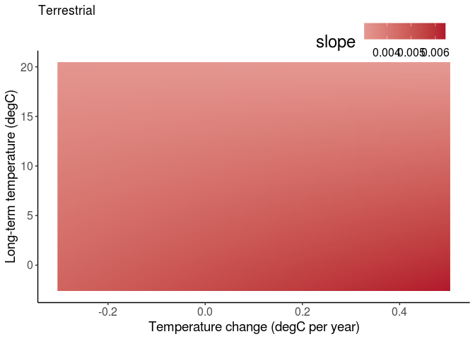<!-- -->
\#\# abs(temptrend) AIC selects abs(temptrend) by deltaAIC 8. Results
are now quite different from the richness model:

  - less turnover at higher temperatures in marine (warming or cooling)
  - less turnover at faster temperature change in marine (temperatures
    \> 17degC)
  - less turnover at higher temperatures per unit temperature change
    (interaction)

<!-- end list -->

``` r
# realm-specific intercept. Simplify REs that were near zero.
modJtuAll1 <- glmmTMB(disstrend ~ 0 + REALM + new_sTempYear:REALM + abs(TempGAMCoef):REALM + abs(TempGAMCoef):new_sTempYear:REALM
                +(0 + abs(TempGAMCoef)|REALM/taxa_mod1) +(1|taxa_mod1/STUDY_ID),
                disp = ~trendse*REALM,
                data = comb[measure == 'Jtu' & model_id == 'logS_lm',])


summary(modJtuAll1)
```

    ##  Family: gaussian  ( identity )
    ## Formula:          
    ## disstrend ~ 0 + REALM + new_sTempYear:REALM + abs(TempGAMCoef):REALM +  
    ##     abs(TempGAMCoef):new_sTempYear:REALM + (0 + abs(TempGAMCoef) |  
    ##     REALM/taxa_mod1) + (1 | taxa_mod1/STUDY_ID)
    ## Dispersion:                 ~trendse * REALM
    ## Data: comb[measure == "Jtu" & model_id == "logS_lm", ]
    ## 
    ##      AIC      BIC   logLik deviance df.resid 
    ## -97076.8 -96949.3  48554.4 -97108.8    21415 
    ## 
    ## Random effects:
    ## 
    ## Conditional model:
    ##  Groups             Name             Variance  Std.Dev. 
    ##  taxa_mod1:REALM    abs(TempGAMCoef) 1.517e-03 3.895e-02
    ##  REALM              abs(TempGAMCoef) 1.410e-09 3.755e-05
    ##  STUDY_ID:taxa_mod1 (Intercept)      4.920e-05 7.014e-03
    ##  taxa_mod1          (Intercept)      1.657e-06 1.287e-03
    ##  Residual                                   NA        NA
    ## Number of obs: 21431, groups:  
    ## taxa_mod1:REALM, 12; REALM, 2; STUDY_ID:taxa_mod1, 156; taxa_mod1, 9
    ## 
    ## Conditional model:
    ##                                                   Estimate Std. Error z value
    ## REALMMarine                                      0.0040229  0.0013390   3.004
    ## REALMTerrestrial                                 0.0036259  0.0018737   1.935
    ## REALMMarine:new_sTempYear                       -0.0012752  0.0003836  -3.324
    ## REALMTerrestrial:new_sTempYear                  -0.0002853  0.0004512  -0.632
    ## REALMMarine:abs(TempGAMCoef)                    -0.0014064  0.0240361  -0.059
    ## REALMTerrestrial:abs(TempGAMCoef)                0.0049309  0.0231818   0.213
    ## REALMMarine:new_sTempYear:abs(TempGAMCoef)      -0.0223005  0.0086699  -2.572
    ## REALMTerrestrial:new_sTempYear:abs(TempGAMCoef) -0.0033484  0.0076569  -0.437
    ##                                                 Pr(>|z|)    
    ## REALMMarine                                     0.002661 ** 
    ## REALMTerrestrial                                0.052974 .  
    ## REALMMarine:new_sTempYear                       0.000888 ***
    ## REALMTerrestrial:new_sTempYear                  0.527288    
    ## REALMMarine:abs(TempGAMCoef)                    0.953341    
    ## REALMTerrestrial:abs(TempGAMCoef)               0.831556    
    ## REALMMarine:new_sTempYear:abs(TempGAMCoef)      0.010106 *  
    ## REALMTerrestrial:new_sTempYear:abs(TempGAMCoef) 0.661892    
    ## ---
    ## Signif. codes:  0 '***' 0.001 '**' 0.01 '*' 0.05 '.' 0.1 ' ' 1
    ## 
    ## Dispersion model:
    ##                          Estimate Std. Error z value Pr(>|z|)    
    ## (Intercept)              -8.66249    0.01779  -486.8   <2e-16 ***
    ## trendse                  57.98815    0.63570    91.2   <2e-16 ***
    ## REALMTerrestrial         -0.90139    0.06810   -13.2   <2e-16 ***
    ## trendse:REALMTerrestrial 40.98344    3.57399    11.5   <2e-16 ***
    ## ---
    ## Signif. codes:  0 '***' 0.001 '**' 0.01 '*' 0.05 '.' 0.1 ' ' 1

``` r
AIC(modJtuAll0)
```

    ## [1] -97068.15

``` r
AIC(modJtuAll1)
```

    ## [1] -97076.85

``` r
AIC(modJtuAll0) - AIC(modJtuAll1)
```

    ## [1] 8.699537

### Plot

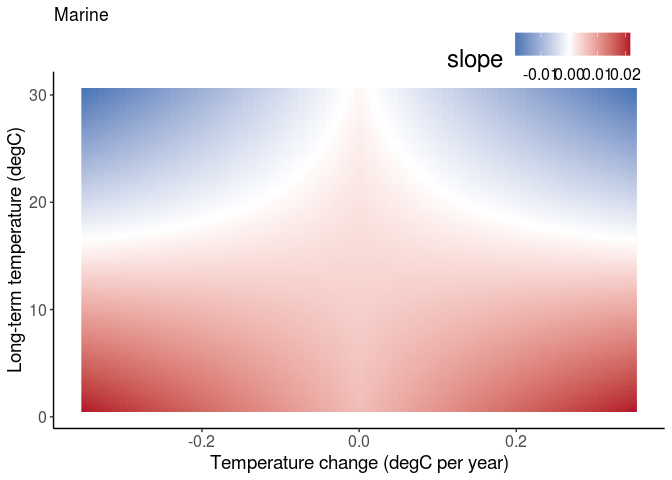<!-- -->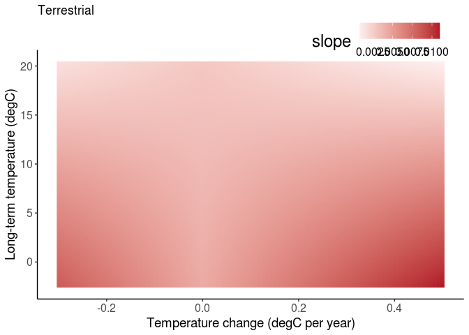<!-- -->

## 5-year standardized duration

  - Only for datasets of exactly 5 consecutive years
  - Only realm intercepts are significantly different from zero

<!-- end list -->

``` r
modJtu5 <- glmmTMB(disstrend ~ 0 + REALM + new_sTempYear:REALM + TempGAMCoef:REALM + TempGAMCoef:new_sTempYear:REALM
                +(0 + TempGAMCoef|REALM/taxa_mod1) +(1|taxa_mod1/STUDY_ID),
                disp = ~trendse*REALM,
                data = comb5[measure == 'Jtu',])


summary(modJtu5)
```

    ##  Family: gaussian  ( identity )
    ## Formula:          
    ## disstrend ~ 0 + REALM + new_sTempYear:REALM + TempGAMCoef:REALM +  
    ##     TempGAMCoef:new_sTempYear:REALM + (0 + TempGAMCoef | REALM/taxa_mod1) +  
    ##     (1 | taxa_mod1/STUDY_ID)
    ## Dispersion:                 ~trendse * REALM
    ## Data: comb5[measure == "Jtu", ]
    ## 
    ##      AIC      BIC   logLik deviance df.resid 
    ## -15382.0 -15277.1   7707.0 -15414.0     5190 
    ## 
    ## Random effects:
    ## 
    ## Conditional model:
    ##  Groups             Name        Variance  Std.Dev. 
    ##  taxa_mod1:REALM    TempGAMCoef 3.218e-10 1.794e-05
    ##  REALM              TempGAMCoef 8.022e-13 8.957e-07
    ##  STUDY_ID:taxa_mod1 (Intercept) 2.592e-05 5.091e-03
    ##  taxa_mod1          (Intercept) 1.016e-12 1.008e-06
    ##  Residual                              NA        NA
    ## Number of obs: 5206, groups:  
    ## taxa_mod1:REALM, 12; REALM, 2; STUDY_ID:taxa_mod1, 118; taxa_mod1, 9
    ## 
    ## Conditional model:
    ##                                              Estimate Std. Error z value
    ## REALMMarine                                 0.0089692  0.0014916   6.013
    ## REALMTerrestrial                            0.0060183  0.0021027   2.862
    ## REALMMarine:new_sTempYear                  -0.0014879  0.0015672  -0.949
    ## REALMTerrestrial:new_sTempYear             -0.0007052  0.0009760  -0.723
    ## REALMMarine:TempGAMCoef                     0.0208189  0.0246711   0.844
    ## REALMTerrestrial:TempGAMCoef                0.0278346  0.0195401   1.424
    ## REALMMarine:new_sTempYear:TempGAMCoef      -0.0219895  0.0298209  -0.737
    ## REALMTerrestrial:new_sTempYear:TempGAMCoef -0.0068996  0.0181757  -0.380
    ##                                            Pr(>|z|)    
    ## REALMMarine                                1.82e-09 ***
    ## REALMTerrestrial                            0.00421 ** 
    ## REALMMarine:new_sTempYear                   0.34240    
    ## REALMTerrestrial:new_sTempYear              0.46998    
    ## REALMMarine:TempGAMCoef                     0.39875    
    ## REALMTerrestrial:TempGAMCoef                0.15431    
    ## REALMMarine:new_sTempYear:TempGAMCoef       0.46089    
    ## REALMTerrestrial:new_sTempYear:TempGAMCoef  0.70424    
    ## ---
    ## Signif. codes:  0 '***' 0.001 '**' 0.01 '*' 0.05 '.' 0.1 ' ' 1
    ## 
    ## Dispersion model:
    ##                          Estimate Std. Error z value Pr(>|z|)    
    ## (Intercept)              -7.17822    0.05146 -139.48   <2e-16 ***
    ## trendse                  25.94403    0.73595   35.25   <2e-16 ***
    ## REALMTerrestrial         -1.33907    0.09990  -13.40   <2e-16 ***
    ## trendse:REALMTerrestrial 24.11937    2.53954    9.50   <2e-16 ***
    ## ---
    ## Signif. codes:  0 '***' 0.001 '**' 0.01 '*' 0.05 '.' 0.1 ' ' 1

### Plot

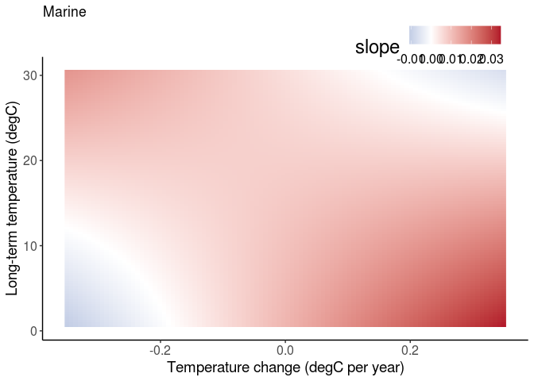<!-- -->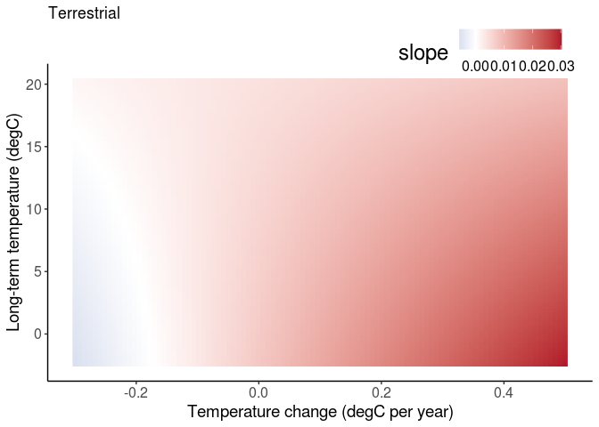<!-- -->

# Fit a Jbeta model

## Original

  - Much like the richness model, using Antao predictors, but with Jbeta
    slope as the response. Dropped the REALM random slope to allow
    convergence.
  - Positive temp:temptrend interaction, just like richness and gains
    models.

<!-- end list -->

``` r
# realm-specific intercept. Simplify REs that were near zero.
modJbetaAll0 <- glmmTMB(disstrend ~ 0 + REALM + new_sTempYear:REALM + TempGAMCoef:REALM + TempGAMCoef:new_sTempYear:REALM
                +(0 + TempGAMCoef|REALM:taxa_mod1) +(1|taxa_mod1/STUDY_ID),
                disp = ~trendse*REALM,
                data = comb[measure == 'Jbeta' & model_id == 'logS_lm',])

summary(modJbetaAll0)
```

    ##  Family: gaussian  ( identity )
    ## Formula:          
    ## disstrend ~ 0 + REALM + new_sTempYear:REALM + TempGAMCoef:REALM +  
    ##     TempGAMCoef:new_sTempYear:REALM + (0 + TempGAMCoef | REALM:taxa_mod1) +  
    ##     (1 | taxa_mod1/STUDY_ID)
    ## Dispersion:                 ~trendse * REALM
    ## Data: comb[measure == "Jbeta" & model_id == "logS_lm", ]
    ## 
    ##       AIC       BIC    logLik  deviance  df.resid 
    ## -117555.1 -117435.5   58792.5 -117585.1     21416 
    ## 
    ## Random effects:
    ## 
    ## Conditional model:
    ##  Groups             Name        Variance  Std.Dev.
    ##  REALM:taxa_mod1    TempGAMCoef 2.581e-04 0.016065
    ##  STUDY_ID:taxa_mod1 (Intercept) 2.311e-05 0.004807
    ##  taxa_mod1          (Intercept) 1.029e-06 0.001014
    ##  Residual                              NA       NA
    ## Number of obs: 21431, groups:  
    ## REALM:taxa_mod1, 12; STUDY_ID:taxa_mod1, 156; taxa_mod1, 9
    ## 
    ## Conditional model:
    ##                                              Estimate Std. Error z value
    ## REALMMarine                                 0.0041589  0.0009746   4.267
    ## REALMTerrestrial                            0.0042168  0.0011563   3.647
    ## REALMMarine:new_sTempYear                  -0.0024359  0.0002200 -11.070
    ## REALMTerrestrial:new_sTempYear              0.0001468  0.0003610   0.407
    ## REALMMarine:TempGAMCoef                     0.0018585  0.0097071   0.191
    ## REALMTerrestrial:TempGAMCoef               -0.0071382  0.0127562  -0.560
    ## REALMMarine:new_sTempYear:TempGAMCoef       0.0192254  0.0043702   4.399
    ## REALMTerrestrial:new_sTempYear:TempGAMCoef -0.0066322  0.0072044  -0.921
    ##                                            Pr(>|z|)    
    ## REALMMarine                                1.98e-05 ***
    ## REALMTerrestrial                           0.000266 ***
    ## REALMMarine:new_sTempYear                   < 2e-16 ***
    ## REALMTerrestrial:new_sTempYear             0.684280    
    ## REALMMarine:TempGAMCoef                    0.848170    
    ## REALMTerrestrial:TempGAMCoef               0.575762    
    ## REALMMarine:new_sTempYear:TempGAMCoef      1.09e-05 ***
    ## REALMTerrestrial:new_sTempYear:TempGAMCoef 0.357269    
    ## ---
    ## Signif. codes:  0 '***' 0.001 '**' 0.01 '*' 0.05 '.' 0.1 ' ' 1
    ## 
    ## Dispersion model:
    ##                          Estimate Std. Error z value Pr(>|z|)    
    ## (Intercept)              -9.65776    0.01792  -539.1  < 2e-16 ***
    ## trendse                  96.86530    1.07482    90.1  < 2e-16 ***
    ## REALMTerrestrial         -0.27353    0.06760    -4.0 5.20e-05 ***
    ## trendse:REALMTerrestrial 29.92835    4.70782     6.4 2.06e-10 ***
    ## ---
    ## Signif. codes:  0 '***' 0.001 '**' 0.01 '*' 0.05 '.' 0.1 ' ' 1

### Plot

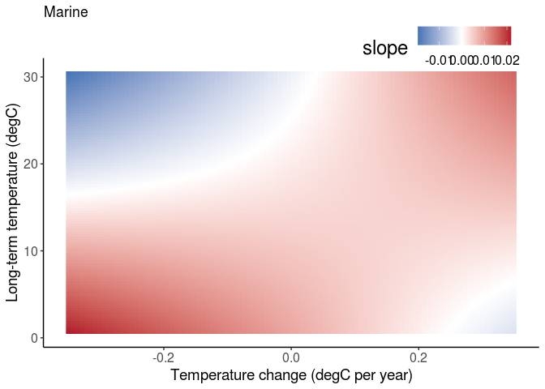<!-- -->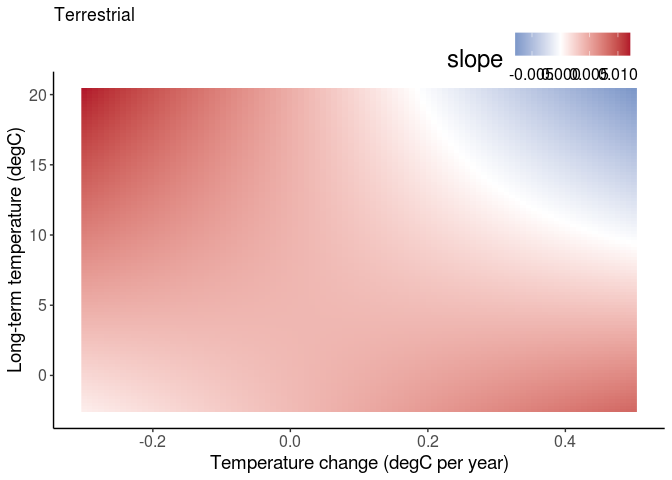<!-- -->

## abs(temptrend)

Results are now entirely different than richness model:

  - Strongly selects abs(temptrend) over temptrend
  - less turnover at higher temperatures in marine
  - less turnover at faster temperature change in marine
  - less turnover at higher temperatures per unit temperature change
    (interaction)

<!-- end list -->

``` r
# realm-specific intercept. Simplify REs that were near zero.
modJbetaAll1 <- glmmTMB(disstrend ~ 0 + REALM + new_sTempYear:REALM + abs(TempGAMCoef):REALM + abs(TempGAMCoef):new_sTempYear:REALM
                +(0 + abs(TempGAMCoef)|REALM:taxa_mod1) +(1|taxa_mod1/STUDY_ID),
                disp = ~trendse*REALM,
                data = comb[measure == 'Jbeta' & model_id == 'logS_lm',])


summary(modJbetaAll1)
```

    ##  Family: gaussian  ( identity )
    ## Formula:          
    ## disstrend ~ 0 + REALM + new_sTempYear:REALM + abs(TempGAMCoef):REALM +  
    ##     abs(TempGAMCoef):new_sTempYear:REALM + (0 + abs(TempGAMCoef) |  
    ##     REALM:taxa_mod1) + (1 | taxa_mod1/STUDY_ID)
    ## Dispersion:                 ~trendse * REALM
    ## Data: comb[measure == "Jbeta" & model_id == "logS_lm", ]
    ## 
    ##       AIC       BIC    logLik  deviance  df.resid 
    ## -117590.6 -117471.0   58810.3 -117620.6     21416 
    ## 
    ## Random effects:
    ## 
    ## Conditional model:
    ##  Groups             Name             Variance  Std.Dev. 
    ##  REALM:taxa_mod1    abs(TempGAMCoef) 3.050e-04 0.0174654
    ##  STUDY_ID:taxa_mod1 (Intercept)      2.126e-05 0.0046108
    ##  taxa_mod1          (Intercept)      5.136e-07 0.0007167
    ##  Residual                                   NA        NA
    ## Number of obs: 21431, groups:  
    ## REALM:taxa_mod1, 12; STUDY_ID:taxa_mod1, 156; taxa_mod1, 9
    ## 
    ## Conditional model:
    ##                                                   Estimate Std. Error z value
    ## REALMMarine                                      0.0040586  0.0008518   4.765
    ## REALMTerrestrial                                 0.0032818  0.0012725   2.579
    ## REALMMarine:new_sTempYear                       -0.0014424  0.0002530  -5.701
    ## REALMTerrestrial:new_sTempYear                   0.0002049  0.0004230   0.485
    ## REALMMarine:abs(TempGAMCoef)                    -0.0052449  0.0117942  -0.445
    ## REALMTerrestrial:abs(TempGAMCoef)                0.0179275  0.0143518   1.249
    ## REALMMarine:new_sTempYear:abs(TempGAMCoef)      -0.0298987  0.0057680  -5.184
    ## REALMTerrestrial:new_sTempYear:abs(TempGAMCoef) -0.0037502  0.0086606  -0.433
    ##                                                 Pr(>|z|)    
    ## REALMMarine                                     1.89e-06 ***
    ## REALMTerrestrial                                 0.00991 ** 
    ## REALMMarine:new_sTempYear                       1.19e-08 ***
    ## REALMTerrestrial:new_sTempYear                   0.62800    
    ## REALMMarine:abs(TempGAMCoef)                     0.65654    
    ## REALMTerrestrial:abs(TempGAMCoef)                0.21161    
    ## REALMMarine:new_sTempYear:abs(TempGAMCoef)      2.18e-07 ***
    ## REALMTerrestrial:new_sTempYear:abs(TempGAMCoef)  0.66500    
    ## ---
    ## Signif. codes:  0 '***' 0.001 '**' 0.01 '*' 0.05 '.' 0.1 ' ' 1
    ## 
    ## Dispersion model:
    ##                          Estimate Std. Error z value Pr(>|z|)    
    ## (Intercept)              -9.65953    0.01791  -539.3  < 2e-16 ***
    ## trendse                  96.88782    1.07455    90.2  < 2e-16 ***
    ## REALMTerrestrial         -0.26815    0.06750    -4.0 7.11e-05 ***
    ## trendse:REALMTerrestrial 29.66472    4.70044     6.3 2.77e-10 ***
    ## ---
    ## Signif. codes:  0 '***' 0.001 '**' 0.01 '*' 0.05 '.' 0.1 ' ' 1

``` r
AIC(modJbetaAll0)
```

    ## [1] -117555.1

``` r
AIC(modJbetaAll1)
```

    ## [1] -117590.6

## 5-year duration, annual samples

  - Only for datasets of exactly 5 consecutive years
  - Had to drop the random slopes to allow convergence (were very close
    to 0)
  - Only realm intercepts are significantly different from zero

<!-- end list -->

``` r
modJbeta5 <- glmmTMB(disstrend ~ 0 + REALM + new_sTempYear:REALM + TempGAMCoef:REALM + TempGAMCoef:new_sTempYear:REALM
                 +(1|taxa_mod1/STUDY_ID),
                disp = ~trendse*REALM,
                data = comb5[measure == 'Jbeta',])


summary(modJbeta5)
```

    ##  Family: gaussian  ( identity )
    ## Formula:          
    ## disstrend ~ 0 + REALM + new_sTempYear:REALM + TempGAMCoef:REALM +  
    ##     TempGAMCoef:new_sTempYear:REALM + (1 | taxa_mod1/STUDY_ID)
    ## Dispersion:                 ~trendse * REALM
    ## Data: comb5[measure == "Jbeta", ]
    ## 
    ##      AIC      BIC   logLik deviance df.resid 
    ## -18332.0 -18240.2   9180.0 -18360.0     5192 
    ## 
    ## Random effects:
    ## 
    ## Conditional model:
    ##  Groups             Name        Variance  Std.Dev. 
    ##  STUDY_ID:taxa_mod1 (Intercept) 4.922e-05 7.016e-03
    ##  taxa_mod1          (Intercept) 4.125e-12 2.031e-06
    ##  Residual                              NA        NA
    ## Number of obs: 5206, groups:  STUDY_ID:taxa_mod1, 118; taxa_mod1, 9
    ## 
    ## Conditional model:
    ##                                              Estimate Std. Error z value
    ## REALMMarine                                 0.0112185  0.0015447   7.263
    ## REALMTerrestrial                            0.0153595  0.0022571   6.805
    ## REALMMarine:new_sTempYear                   0.0005050  0.0014314   0.353
    ## REALMTerrestrial:new_sTempYear             -0.0008311  0.0008320  -0.999
    ## REALMMarine:TempGAMCoef                    -0.0190415  0.0193450  -0.984
    ## REALMTerrestrial:TempGAMCoef                0.0078781  0.0188401   0.418
    ## REALMMarine:new_sTempYear:TempGAMCoef      -0.0282676  0.0247224  -1.143
    ## REALMTerrestrial:new_sTempYear:TempGAMCoef  0.0029120  0.0152813   0.191
    ##                                            Pr(>|z|)    
    ## REALMMarine                                3.80e-13 ***
    ## REALMTerrestrial                           1.01e-11 ***
    ## REALMMarine:new_sTempYear                     0.724    
    ## REALMTerrestrial:new_sTempYear                0.318    
    ## REALMMarine:TempGAMCoef                       0.325    
    ## REALMTerrestrial:TempGAMCoef                  0.676    
    ## REALMMarine:new_sTempYear:TempGAMCoef         0.253    
    ## REALMTerrestrial:new_sTempYear:TempGAMCoef    0.849    
    ## ---
    ## Signif. codes:  0 '***' 0.001 '**' 0.01 '*' 0.05 '.' 0.1 ' ' 1
    ## 
    ## Dispersion model:
    ##                          Estimate Std. Error z value Pr(>|z|)    
    ## (Intercept)              -7.70755    0.05465 -141.02  < 2e-16 ***
    ## trendse                  34.03862    1.10082   30.92  < 2e-16 ***
    ## REALMTerrestrial         -1.14642    0.10462  -10.96  < 2e-16 ***
    ## trendse:REALMTerrestrial 24.37130    3.18445    7.65 1.96e-14 ***
    ## ---
    ## Signif. codes:  0 '***' 0.001 '**' 0.01 '*' 0.05 '.' 0.1 ' ' 1

### Plot

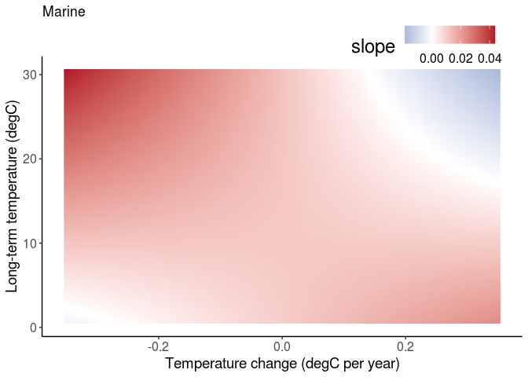<!-- -->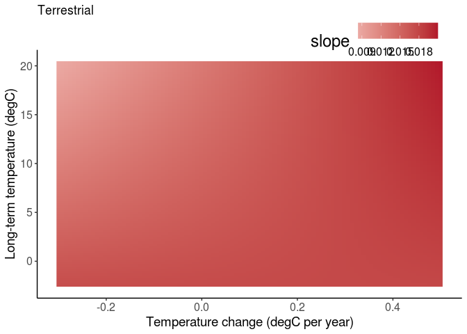<!-- -->

## 5-year duration, min3 samples

  - Only for datasets of exactly 5 year duration with at least 3 samples
  - Effect is now the opposite of non-standardized (see interaction term
    for marine)

<!-- end list -->

``` r
modJbeta5min3 <- glmmTMB(disstrend ~ 0 + REALM + new_sTempYear:REALM + TempGAMCoef:REALM + TempGAMCoef:new_sTempYear:REALM
                 +(1|taxa_mod1/STUDY_ID),
                disp = ~trendse*REALM,
                data = comb5min3[measure == 'Jbeta',])


summary(modJbeta5min3)
```

    ##  Family: gaussian  ( identity )
    ## Formula:          
    ## disstrend ~ 0 + REALM + new_sTempYear:REALM + TempGAMCoef:REALM +  
    ##     TempGAMCoef:new_sTempYear:REALM + (1 | taxa_mod1/STUDY_ID)
    ## Dispersion:                 ~trendse * REALM
    ## Data: comb5min3[measure == "Jbeta", ]
    ## 
    ##      AIC      BIC   logLik deviance df.resid 
    ## -43120.7 -43012.7  21574.3 -43148.7    16492 
    ## 
    ## Random effects:
    ## 
    ## Conditional model:
    ##  Groups             Name        Variance  Std.Dev.
    ##  STUDY_ID:taxa_mod1 (Intercept) 6.352e-05 7.97e-03
    ##  taxa_mod1          (Intercept) 1.037e-11 3.22e-06
    ##  Residual                              NA       NA
    ## Number of obs: 16506, groups:  STUDY_ID:taxa_mod1, 153; taxa_mod1, 9
    ## 
    ## Conditional model:
    ##                                              Estimate Std. Error z value
    ## REALMMarine                                 1.022e-02  1.671e-03   6.114
    ## REALMTerrestrial                            1.387e-02  2.512e-03   5.524
    ## REALMMarine:new_sTempYear                  -1.164e-03  1.147e-03  -1.015
    ## REALMTerrestrial:new_sTempYear              5.861e-05  1.356e-03   0.043
    ## REALMMarine:TempGAMCoef                    -2.441e-02  1.406e-02  -1.737
    ## REALMTerrestrial:TempGAMCoef                7.236e-03  1.716e-02   0.422
    ## REALMMarine:new_sTempYear:TempGAMCoef      -3.630e-02  1.778e-02  -2.041
    ## REALMTerrestrial:new_sTempYear:TempGAMCoef  9.160e-03  1.731e-02   0.529
    ##                                            Pr(>|z|)    
    ## REALMMarine                                9.73e-10 ***
    ## REALMTerrestrial                           3.32e-08 ***
    ## REALMMarine:new_sTempYear                    0.3102    
    ## REALMTerrestrial:new_sTempYear               0.9655    
    ## REALMMarine:TempGAMCoef                      0.0824 .  
    ## REALMTerrestrial:TempGAMCoef                 0.6733    
    ## REALMMarine:new_sTempYear:TempGAMCoef        0.0412 *  
    ## REALMTerrestrial:new_sTempYear:TempGAMCoef   0.5967    
    ## ---
    ## Signif. codes:  0 '***' 0.001 '**' 0.01 '*' 0.05 '.' 0.1 ' ' 1
    ## 
    ## Dispersion model:
    ##                          Estimate Std. Error z value Pr(>|z|)    
    ## (Intercept)              -5.83741    0.01732  -337.0  < 2e-16 ***
    ## trendse                   8.88243    0.24467    36.3  < 2e-16 ***
    ## REALMTerrestrial         -0.99711    0.05562   -17.9  < 2e-16 ***
    ## trendse:REALMTerrestrial  7.80925    1.21552     6.4 1.32e-10 ***
    ## ---
    ## Signif. codes:  0 '***' 0.001 '**' 0.01 '*' 0.05 '.' 0.1 ' ' 1

### Plot

<!-- -->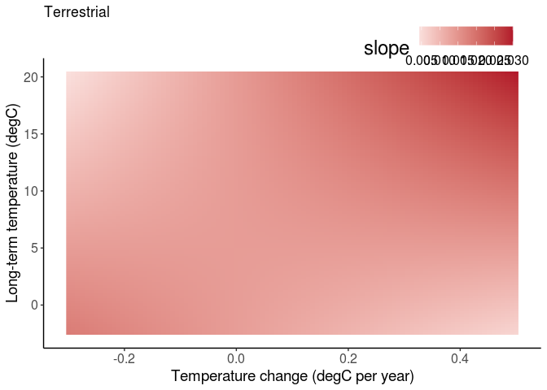<!-- -->

## 10-year duration, min3 samples

  - Only for datasets of exactly 10 year duration with at least 3
    samples
  - Had to drop the random slopes to allow convergence (were very close
    to 0)
  - Only realm intercepts are significantly different from zero

<!-- end list -->

``` r
modJbeta10min3 <- glmmTMB(disstrend ~ 0 + REALM + new_sTempYear:REALM + TempGAMCoef:REALM + TempGAMCoef:new_sTempYear:REALM
                 +(1|taxa_mod1/STUDY_ID),
                disp = ~trendse*REALM,
                data = comb10min3[measure == 'Jbeta',])


summary(modJbeta10min3)
```

    ##  Family: gaussian  ( identity )
    ## Formula:          
    ## disstrend ~ 0 + REALM + new_sTempYear:REALM + TempGAMCoef:REALM +  
    ##     TempGAMCoef:new_sTempYear:REALM + (1 | taxa_mod1/STUDY_ID)
    ## Dispersion:                 ~trendse * REALM
    ## Data: comb10min3[measure == "Jbeta", ]
    ## 
    ##      AIC      BIC   logLik deviance df.resid 
    ## -72713.6 -72607.6  36370.8 -72741.6    14356 
    ## 
    ## Random effects:
    ## 
    ## Conditional model:
    ##  Groups             Name        Variance  Std.Dev. 
    ##  STUDY_ID:taxa_mod1 (Intercept) 3.471e-05 5.892e-03
    ##  taxa_mod1          (Intercept) 7.527e-12 2.743e-06
    ##  Residual                              NA        NA
    ## Number of obs: 14370, groups:  STUDY_ID:taxa_mod1, 115; taxa_mod1, 9
    ## 
    ## Conditional model:
    ##                                              Estimate Std. Error z value
    ## REALMMarine                                 9.532e-03  1.029e-03   9.259
    ## REALMTerrestrial                            9.028e-03  1.271e-03   7.106
    ## REALMMarine:new_sTempYear                  -6.761e-04  3.994e-04  -1.693
    ## REALMTerrestrial:new_sTempYear              4.942e-05  4.112e-04   0.120
    ## REALMMarine:TempGAMCoef                    -2.087e-03  7.053e-03  -0.296
    ## REALMTerrestrial:TempGAMCoef               -4.117e-03  9.666e-03  -0.426
    ## REALMMarine:new_sTempYear:TempGAMCoef       2.150e-02  7.908e-03   2.719
    ## REALMTerrestrial:new_sTempYear:TempGAMCoef  1.407e-02  1.006e-02   1.398
    ##                                            Pr(>|z|)    
    ## REALMMarine                                 < 2e-16 ***
    ## REALMTerrestrial                            1.2e-12 ***
    ## REALMMarine:new_sTempYear                   0.09046 .  
    ## REALMTerrestrial:new_sTempYear              0.90434    
    ## REALMMarine:TempGAMCoef                     0.76726    
    ## REALMTerrestrial:TempGAMCoef                0.67015    
    ## REALMMarine:new_sTempYear:TempGAMCoef       0.00656 ** 
    ## REALMTerrestrial:new_sTempYear:TempGAMCoef  0.16208    
    ## ---
    ## Signif. codes:  0 '***' 0.001 '**' 0.01 '*' 0.05 '.' 0.1 ' ' 1
    ## 
    ## Dispersion model:
    ##                          Estimate Std. Error z value Pr(>|z|)    
    ## (Intercept)              -8.78295    0.02352  -373.4   <2e-16 ***
    ## trendse                  60.58465    1.23630    49.0   <2e-16 ***
    ## REALMTerrestrial         -1.69731    0.08677   -19.6   <2e-16 ***
    ## trendse:REALMTerrestrial 95.66251    8.36546    11.4   <2e-16 ***
    ## ---
    ## Signif. codes:  0 '***' 0.001 '**' 0.01 '*' 0.05 '.' 0.1 ' ' 1

### Plot

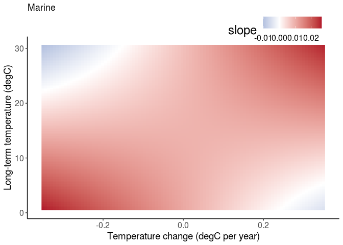<!-- -->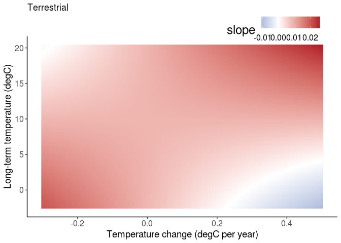<!-- -->

## All durations of min3 samples

  - All durations in one model, but allow slopes to differ by duration
  - Converges for durations \< 11. Doesn’t converge for \<21.

<!-- end list -->

``` r
modJbetaXmin3 <- glmmTMB(disstrend ~ 0 + duration_factor + REALM:duration_factor + 
                             new_sTempYear:REALM:duration_factor + 
                             TempGAMCoef:REALM:duration_factor + 
                             TempGAMCoef:new_sTempYear:REALM:duration_factor +
                         (1|duration_factor/taxa_mod1/STUDY_ID),
                         disp = ~trendse*REALM + REALM*duration_factor,
                         data = combXmin3[measure == 'Jbeta' & duration < 11,],
                         control = glmmTMBControl(optCtrl=list(iter.max=1e3,eval.max=1e3)))


summary(modJbetaXmin3)
```

    ##  Family: gaussian  ( identity )
    ## Formula:          
    ## disstrend ~ 0 + duration_factor + REALM:duration_factor + new_sTempYear:REALM:duration_factor +  
    ##     TempGAMCoef:REALM:duration_factor + TempGAMCoef:new_sTempYear:REALM:duration_factor +  
    ##     (1 | duration_factor/taxa_mod1/STUDY_ID)
    ## Dispersion:                 ~trendse * REALM + REALM * duration_factor
    ## Data: combXmin3[measure == "Jbeta" & duration < 11, ]
    ## 
    ##       AIC       BIC    logLik  deviance  df.resid 
    ## -394114.4 -393287.3  197142.2 -394284.4    124174 
    ## 
    ## Random effects:
    ## 
    ## Conditional model:
    ##  Groups                               Name        Variance  Std.Dev. 
    ##  STUDY_ID:(taxa_mod1:duration_factor) (Intercept) 6.653e-05 8.157e-03
    ##  taxa_mod1:duration_factor            (Intercept) 5.822e-12 2.413e-06
    ##  duration_factor                      (Intercept) 2.440e-12 1.562e-06
    ##  Residual                                                NA        NA
    ## Number of obs: 124259, groups:  
    ## STUDY_ID:(taxa_mod1:duration_factor), 1084; taxa_mod1:duration_factor, 72; duration_factor, 8
    ## 
    ## Conditional model:
    ##                                                                Estimate
    ## duration_factor3                                             -0.0379863
    ## duration_factor4                                              0.0118715
    ## duration_factor5                                              0.0102990
    ## duration_factor6                                              0.0098424
    ## duration_factor7                                              0.0096925
    ## duration_factor8                                              0.0089077
    ## duration_factor9                                              0.0090725
    ## duration_factor10                                             0.0097537
    ## duration_factor3:REALMTerrestrial                             0.0191896
    ## duration_factor4:REALMTerrestrial                             0.0030613
    ## duration_factor5:REALMTerrestrial                             0.0039991
    ## duration_factor6:REALMTerrestrial                             0.0003293
    ## duration_factor7:REALMTerrestrial                             0.0017609
    ## duration_factor8:REALMTerrestrial                             0.0039960
    ## duration_factor9:REALMTerrestrial                             0.0016690
    ## duration_factor10:REALMTerrestrial                            0.0008202
    ## duration_factor3:REALMMarine:new_sTempYear                   -0.0069867
    ## duration_factor4:REALMMarine:new_sTempYear                    0.0008244
    ## duration_factor5:REALMMarine:new_sTempYear                   -0.0011516
    ## duration_factor6:REALMMarine:new_sTempYear                   -0.0016282
    ## duration_factor7:REALMMarine:new_sTempYear                   -0.0011779
    ## duration_factor8:REALMMarine:new_sTempYear                   -0.0014174
    ## duration_factor9:REALMMarine:new_sTempYear                   -0.0012633
    ## duration_factor10:REALMMarine:new_sTempYear                  -0.0005797
    ## duration_factor3:REALMTerrestrial:new_sTempYear               0.0036673
    ## duration_factor4:REALMTerrestrial:new_sTempYear              -0.0017257
    ## duration_factor5:REALMTerrestrial:new_sTempYear               0.0001188
    ## duration_factor6:REALMTerrestrial:new_sTempYear               0.0001870
    ## duration_factor7:REALMTerrestrial:new_sTempYear              -0.0008702
    ## duration_factor8:REALMTerrestrial:new_sTempYear              -0.0001427
    ## duration_factor9:REALMTerrestrial:new_sTempYear               0.0003000
    ## duration_factor10:REALMTerrestrial:new_sTempYear              0.0002465
    ## duration_factor3:REALMMarine:TempGAMCoef                      0.0384413
    ## duration_factor4:REALMMarine:TempGAMCoef                     -0.0326006
    ## duration_factor5:REALMMarine:TempGAMCoef                     -0.0253172
    ## duration_factor6:REALMMarine:TempGAMCoef                     -0.0267058
    ## duration_factor7:REALMMarine:TempGAMCoef                     -0.0216756
    ## duration_factor8:REALMMarine:TempGAMCoef                     -0.0274243
    ## duration_factor9:REALMMarine:TempGAMCoef                     -0.0024233
    ## duration_factor10:REALMMarine:TempGAMCoef                    -0.0086419
    ## duration_factor3:REALMTerrestrial:TempGAMCoef                -0.1977369
    ## duration_factor4:REALMTerrestrial:TempGAMCoef                -0.0049024
    ## duration_factor5:REALMTerrestrial:TempGAMCoef                 0.0068415
    ## duration_factor6:REALMTerrestrial:TempGAMCoef                 0.0092862
    ## duration_factor7:REALMTerrestrial:TempGAMCoef                 0.0212751
    ## duration_factor8:REALMTerrestrial:TempGAMCoef                 0.0256100
    ## duration_factor9:REALMTerrestrial:TempGAMCoef                 0.0110589
    ## duration_factor10:REALMTerrestrial:TempGAMCoef                0.0042959
    ## duration_factor3:REALMMarine:new_sTempYear:TempGAMCoef        0.1150865
    ## duration_factor4:REALMMarine:new_sTempYear:TempGAMCoef       -0.0128800
    ## duration_factor5:REALMMarine:new_sTempYear:TempGAMCoef       -0.0362463
    ## duration_factor6:REALMMarine:new_sTempYear:TempGAMCoef       -0.0131547
    ## duration_factor7:REALMMarine:new_sTempYear:TempGAMCoef       -0.0014673
    ## duration_factor8:REALMMarine:new_sTempYear:TempGAMCoef        0.0067058
    ## duration_factor9:REALMMarine:new_sTempYear:TempGAMCoef        0.0201005
    ## duration_factor10:REALMMarine:new_sTempYear:TempGAMCoef       0.0276520
    ## duration_factor3:REALMTerrestrial:new_sTempYear:TempGAMCoef  -0.1481683
    ## duration_factor4:REALMTerrestrial:new_sTempYear:TempGAMCoef  -0.0052984
    ## duration_factor5:REALMTerrestrial:new_sTempYear:TempGAMCoef   0.0079418
    ## duration_factor6:REALMTerrestrial:new_sTempYear:TempGAMCoef   0.0251594
    ## duration_factor7:REALMTerrestrial:new_sTempYear:TempGAMCoef   0.0508889
    ## duration_factor8:REALMTerrestrial:new_sTempYear:TempGAMCoef   0.0303414
    ## duration_factor9:REALMTerrestrial:new_sTempYear:TempGAMCoef   0.0237664
    ## duration_factor10:REALMTerrestrial:new_sTempYear:TempGAMCoef  0.0174694
    ##                                                              Std. Error z value
    ## duration_factor3                                              0.0029206 -13.006
    ## duration_factor4                                              0.0018901   6.281
    ## duration_factor5                                              0.0017027   6.049
    ## duration_factor6                                              0.0015398   6.392
    ## duration_factor7                                              0.0014738   6.577
    ## duration_factor8                                              0.0014070   6.331
    ## duration_factor9                                              0.0013971   6.494
    ## duration_factor10                                             0.0013863   7.036
    ## duration_factor3:REALMTerrestrial                             0.0052286   3.670
    ## duration_factor4:REALMTerrestrial                             0.0032897   0.931
    ## duration_factor5:REALMTerrestrial                             0.0030056   1.331
    ## duration_factor6:REALMTerrestrial                             0.0027857   0.118
    ## duration_factor7:REALMTerrestrial                             0.0026559   0.663
    ## duration_factor8:REALMTerrestrial                             0.0024790   1.612
    ## duration_factor9:REALMTerrestrial                             0.0023734   0.703
    ## duration_factor10:REALMTerrestrial                            0.0022656   0.362
    ## duration_factor3:REALMMarine:new_sTempYear                    0.0029271  -2.387
    ## duration_factor4:REALMMarine:new_sTempYear                    0.0014865   0.555
    ## duration_factor5:REALMMarine:new_sTempYear                    0.0011520  -1.000
    ## duration_factor6:REALMMarine:new_sTempYear                    0.0008756  -1.859
    ## duration_factor7:REALMMarine:new_sTempYear                    0.0007268  -1.621
    ## duration_factor8:REALMMarine:new_sTempYear                    0.0006162  -2.300
    ## duration_factor9:REALMMarine:new_sTempYear                    0.0005388  -2.345
    ## duration_factor10:REALMMarine:new_sTempYear                   0.0004773  -1.215
    ## duration_factor3:REALMTerrestrial:new_sTempYear               0.0033573   1.092
    ## duration_factor4:REALMTerrestrial:new_sTempYear               0.0015464  -1.116
    ## duration_factor5:REALMTerrestrial:new_sTempYear               0.0013541   0.088
    ## duration_factor6:REALMTerrestrial:new_sTempYear               0.0010234   0.183
    ## duration_factor7:REALMTerrestrial:new_sTempYear               0.0009602  -0.906
    ## duration_factor8:REALMTerrestrial:new_sTempYear               0.0008330  -0.171
    ## duration_factor9:REALMTerrestrial:new_sTempYear               0.0007341   0.409
    ## duration_factor10:REALMTerrestrial:new_sTempYear              0.0006486   0.380
    ## duration_factor3:REALMMarine:TempGAMCoef                      0.0430407   0.893
    ## duration_factor4:REALMMarine:TempGAMCoef                      0.0186415  -1.749
    ## duration_factor5:REALMMarine:TempGAMCoef                      0.0141179  -1.793
    ## duration_factor6:REALMMarine:TempGAMCoef                      0.0110276  -2.422
    ## duration_factor7:REALMMarine:TempGAMCoef                      0.0101315  -2.139
    ## duration_factor8:REALMMarine:TempGAMCoef                      0.0093877  -2.921
    ## duration_factor9:REALMMarine:TempGAMCoef                      0.0091719  -0.264
    ## duration_factor10:REALMMarine:TempGAMCoef                     0.0085032  -1.016
    ## duration_factor3:REALMTerrestrial:TempGAMCoef                 0.0442952  -4.464
    ## duration_factor4:REALMTerrestrial:TempGAMCoef                 0.0208768  -0.235
    ## duration_factor5:REALMTerrestrial:TempGAMCoef                 0.0169934   0.403
    ## duration_factor6:REALMTerrestrial:TempGAMCoef                 0.0152104   0.611
    ## duration_factor7:REALMTerrestrial:TempGAMCoef                 0.0155124   1.371
    ## duration_factor8:REALMTerrestrial:TempGAMCoef                 0.0153974   1.663
    ## duration_factor9:REALMTerrestrial:TempGAMCoef                 0.0145421   0.760
    ## duration_factor10:REALMTerrestrial:TempGAMCoef                0.0136652   0.314
    ## duration_factor3:REALMMarine:new_sTempYear:TempGAMCoef        0.0568017   2.026
    ## duration_factor4:REALMMarine:new_sTempYear:TempGAMCoef        0.0241050  -0.534
    ## duration_factor5:REALMMarine:new_sTempYear:TempGAMCoef        0.0178588  -2.030
    ## duration_factor6:REALMMarine:new_sTempYear:TempGAMCoef        0.0137742  -0.955
    ## duration_factor7:REALMMarine:new_sTempYear:TempGAMCoef        0.0121408  -0.121
    ## duration_factor8:REALMMarine:new_sTempYear:TempGAMCoef        0.0105778   0.634
    ## duration_factor9:REALMMarine:new_sTempYear:TempGAMCoef        0.0097694   2.057
    ## duration_factor10:REALMMarine:new_sTempYear:TempGAMCoef       0.0090228   3.065
    ## duration_factor3:REALMTerrestrial:new_sTempYear:TempGAMCoef   0.0462728  -3.202
    ## duration_factor4:REALMTerrestrial:new_sTempYear:TempGAMCoef   0.0206568  -0.256
    ## duration_factor5:REALMTerrestrial:new_sTempYear:TempGAMCoef   0.0173142   0.459
    ## duration_factor6:REALMTerrestrial:new_sTempYear:TempGAMCoef   0.0156795   1.605
    ## duration_factor7:REALMTerrestrial:new_sTempYear:TempGAMCoef   0.0183248   2.777
    ## duration_factor8:REALMTerrestrial:new_sTempYear:TempGAMCoef   0.0180135   1.684
    ## duration_factor9:REALMTerrestrial:new_sTempYear:TempGAMCoef   0.0157561   1.508
    ## duration_factor10:REALMTerrestrial:new_sTempYear:TempGAMCoef  0.0142389   1.227
    ##                                                              Pr(>|z|)    
    ## duration_factor3                                              < 2e-16 ***
    ## duration_factor4                                             3.37e-10 ***
    ## duration_factor5                                             1.46e-09 ***
    ## duration_factor6                                             1.64e-10 ***
    ## duration_factor7                                             4.81e-11 ***
    ## duration_factor8                                             2.44e-10 ***
    ## duration_factor9                                             8.36e-11 ***
    ## duration_factor10                                            1.98e-12 ***
    ## duration_factor3:REALMTerrestrial                            0.000242 ***
    ## duration_factor4:REALMTerrestrial                            0.352071    
    ## duration_factor5:REALMTerrestrial                            0.183340    
    ## duration_factor6:REALMTerrestrial                            0.905913    
    ## duration_factor7:REALMTerrestrial                            0.507332    
    ## duration_factor8:REALMTerrestrial                            0.106975    
    ## duration_factor9:REALMTerrestrial                            0.481933    
    ## duration_factor10:REALMTerrestrial                           0.717326    
    ## duration_factor3:REALMMarine:new_sTempYear                   0.016993 *  
    ## duration_factor4:REALMMarine:new_sTempYear                   0.579156    
    ## duration_factor5:REALMMarine:new_sTempYear                   0.317458    
    ## duration_factor6:REALMMarine:new_sTempYear                   0.062960 .  
    ## duration_factor7:REALMMarine:new_sTempYear                   0.105082    
    ## duration_factor8:REALMMarine:new_sTempYear                   0.021439 *  
    ## duration_factor9:REALMMarine:new_sTempYear                   0.019045 *  
    ## duration_factor10:REALMMarine:new_sTempYear                  0.224539    
    ## duration_factor3:REALMTerrestrial:new_sTempYear              0.274692    
    ## duration_factor4:REALMTerrestrial:new_sTempYear              0.264463    
    ## duration_factor5:REALMTerrestrial:new_sTempYear              0.930111    
    ## duration_factor6:REALMTerrestrial:new_sTempYear              0.855016    
    ## duration_factor7:REALMTerrestrial:new_sTempYear              0.364807    
    ## duration_factor8:REALMTerrestrial:new_sTempYear              0.864033    
    ## duration_factor9:REALMTerrestrial:new_sTempYear              0.682785    
    ## duration_factor10:REALMTerrestrial:new_sTempYear             0.703909    
    ## duration_factor3:REALMMarine:TempGAMCoef                     0.371783    
    ## duration_factor4:REALMMarine:TempGAMCoef                     0.080322 .  
    ## duration_factor5:REALMMarine:TempGAMCoef                     0.072931 .  
    ## duration_factor6:REALMMarine:TempGAMCoef                     0.015447 *  
    ## duration_factor7:REALMMarine:TempGAMCoef                     0.032401 *  
    ## duration_factor8:REALMMarine:TempGAMCoef                     0.003486 ** 
    ## duration_factor9:REALMMarine:TempGAMCoef                     0.791617    
    ## duration_factor10:REALMMarine:TempGAMCoef                    0.309478    
    ## duration_factor3:REALMTerrestrial:TempGAMCoef                8.04e-06 ***
    ## duration_factor4:REALMTerrestrial:TempGAMCoef                0.814345    
    ## duration_factor5:REALMTerrestrial:TempGAMCoef                0.687245    
    ## duration_factor6:REALMTerrestrial:TempGAMCoef                0.541522    
    ## duration_factor7:REALMTerrestrial:TempGAMCoef                0.170224    
    ## duration_factor8:REALMTerrestrial:TempGAMCoef                0.096259 .  
    ## duration_factor9:REALMTerrestrial:TempGAMCoef                0.446970    
    ## duration_factor10:REALMTerrestrial:TempGAMCoef               0.753244    
    ## duration_factor3:REALMMarine:new_sTempYear:TempGAMCoef       0.042754 *  
    ## duration_factor4:REALMMarine:new_sTempYear:TempGAMCoef       0.593115    
    ## duration_factor5:REALMMarine:new_sTempYear:TempGAMCoef       0.042397 *  
    ## duration_factor6:REALMMarine:new_sTempYear:TempGAMCoef       0.339567    
    ## duration_factor7:REALMMarine:new_sTempYear:TempGAMCoef       0.903802    
    ## duration_factor8:REALMMarine:new_sTempYear:TempGAMCoef       0.526113    
    ## duration_factor9:REALMMarine:new_sTempYear:TempGAMCoef       0.039639 *  
    ## duration_factor10:REALMMarine:new_sTempYear:TempGAMCoef      0.002179 ** 
    ## duration_factor3:REALMTerrestrial:new_sTempYear:TempGAMCoef  0.001364 ** 
    ## duration_factor4:REALMTerrestrial:new_sTempYear:TempGAMCoef  0.797569    
    ## duration_factor5:REALMTerrestrial:new_sTempYear:TempGAMCoef  0.646458    
    ## duration_factor6:REALMTerrestrial:new_sTempYear:TempGAMCoef  0.108580    
    ## duration_factor7:REALMTerrestrial:new_sTempYear:TempGAMCoef  0.005486 ** 
    ## duration_factor8:REALMTerrestrial:new_sTempYear:TempGAMCoef  0.092111 .  
    ## duration_factor9:REALMTerrestrial:new_sTempYear:TempGAMCoef  0.131454    
    ## duration_factor10:REALMTerrestrial:new_sTempYear:TempGAMCoef 0.219869    
    ## ---
    ## Signif. codes:  0 '***' 0.001 '**' 0.01 '*' 0.05 '.' 0.1 ' ' 1
    ## 
    ## Dispersion model:
    ##                                    Estimate Std. Error z value Pr(>|z|)    
    ## (Intercept)                        -3.85331    0.01318 -292.29  < 2e-16 ***
    ## trendse                             7.70906    0.09197   83.82  < 2e-16 ***
    ## REALMTerrestrial                   -1.33011    0.04248  -31.31  < 2e-16 ***
    ## duration_factor4                   -1.52962    0.01820  -84.06  < 2e-16 ***
    ## duration_factor5                   -1.92072    0.01726 -111.31  < 2e-16 ***
    ## duration_factor6                   -2.47908    0.01723 -143.91  < 2e-16 ***
    ## duration_factor7                   -2.88257    0.01723 -167.31  < 2e-16 ***
    ## duration_factor8                   -3.26013    0.01730 -188.44  < 2e-16 ***
    ## duration_factor9                   -3.54100    0.01745 -202.96  < 2e-16 ***
    ## duration_factor10                  -3.85682    0.01772 -217.66  < 2e-16 ***
    ## trendse:REALMTerrestrial            7.18095    0.46286   15.51  < 2e-16 ***
    ## REALMTerrestrial:duration_factor4   0.07729    0.05614    1.38  0.16861    
    ## REALMTerrestrial:duration_factor5   0.32855    0.05487    5.99 2.13e-09 ***
    ## REALMTerrestrial:duration_factor6   0.18490    0.05647    3.27  0.00106 ** 
    ## REALMTerrestrial:duration_factor7   0.25656    0.05682    4.52 6.33e-06 ***
    ## REALMTerrestrial:duration_factor8   0.24470    0.05832    4.20 2.72e-05 ***
    ## REALMTerrestrial:duration_factor9   0.25504    0.05865    4.35 1.37e-05 ***
    ## REALMTerrestrial:duration_factor10  0.25849    0.05965    4.33 1.47e-05 ***
    ## ---
    ## Signif. codes:  0 '***' 0.001 '**' 0.01 '*' 0.05 '.' 0.1 ' ' 1

### Plot coefficients

``` r
coefs <- fixef(modJbetaXmin3)$cond
iM <- grep('REALMMarine:new_sTempYear:TempGAMCoef', names(coefs))
dursM <- as.numeric(gsub('duration_factor|:REALMMarine:new_sTempYear:TempGAMCoef', '', names(coefs)[iM]))
iT <- grep('REALMTerrestrial:new_sTempYear:TempGAMCoef', names(coefs))
dursT <- as.numeric(gsub('duration_factor|:REALMTerrestrial:new_sTempYear:TempGAMCoef', '', names(coefs)[iT]))
par(mfrow=c(1,2))
plot(dursM, coefs[iM], type = 'l', xlab = 'Time series duration', ylab = 'AveTemp:TempTrend interaction', main = "Marine")
abline(h =0, lty = 2)
plot(dursT, coefs[iT], type = 'l', xlab = 'Time series duration', ylab = 'AveTemp:TempTrend interaction', main = 'Terrestrial')
abline(h =0, lty = 2)
```

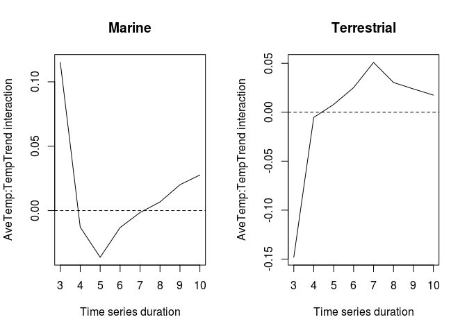<!-- -->

## All durations min3 abs(temptrend)

  - All durations in one model, but allow slopes to differ by duration.
    Uses abs(temptrend)
  - Converges for durations \< 11

<!-- end list -->

``` r
modJbetaXmin3abs <- glmmTMB(disstrend ~ 0 + duration_factor + REALM:duration_factor + 
                             new_sTempYear:REALM:duration_factor + 
                             abs(TempGAMCoef):REALM:duration_factor + 
                             abs(TempGAMCoef):new_sTempYear:REALM:duration_factor +
                         (1|duration_factor/taxa_mod1/STUDY_ID),
                         disp = ~trendse*REALM + REALM*duration_factor,
                         data = combXmin3[measure == 'Jbeta' & duration < 11,],
                         control = glmmTMBControl(optCtrl=list(iter.max=1e3,eval.max=1e3)))


AIC(modJbetaXmin3) - AIC(modJbetaXmin3abs)
```

    ## [1] 22.44947

``` r
summary(modJbetaXmin3abs)
```

    ##  Family: gaussian  ( identity )
    ## Formula:          
    ## disstrend ~ 0 + duration_factor + REALM:duration_factor + new_sTempYear:REALM:duration_factor +  
    ##     abs(TempGAMCoef):REALM:duration_factor + abs(TempGAMCoef):new_sTempYear:REALM:duration_factor +  
    ##     (1 | duration_factor/taxa_mod1/STUDY_ID)
    ## Dispersion:                 ~trendse * REALM + REALM * duration_factor
    ## Data: combXmin3[measure == "Jbeta" & duration < 11, ]
    ## 
    ##       AIC       BIC    logLik  deviance  df.resid 
    ## -394136.8 -393309.8  197153.4 -394306.8    124174 
    ## 
    ## Random effects:
    ## 
    ## Conditional model:
    ##  Groups                               Name        Variance  Std.Dev. 
    ##  STUDY_ID:(taxa_mod1:duration_factor) (Intercept) 6.113e-05 7.819e-03
    ##  taxa_mod1:duration_factor            (Intercept) 1.484e-11 3.852e-06
    ##  duration_factor                      (Intercept) 1.537e-12 1.240e-06
    ##  Residual                                                NA        NA
    ## Number of obs: 124259, groups:  
    ## STUDY_ID:(taxa_mod1:duration_factor), 1084; taxa_mod1:duration_factor, 72; duration_factor, 8
    ## 
    ## Conditional model:
    ##                                                                     Estimate
    ## duration_factor3                                                  -3.477e-02
    ## duration_factor4                                                   1.280e-02
    ## duration_factor5                                                   1.064e-02
    ## duration_factor6                                                   1.059e-02
    ## duration_factor7                                                   1.009e-02
    ## duration_factor8                                                   8.812e-03
    ## duration_factor9                                                   8.131e-03
    ## duration_factor10                                                  9.448e-03
    ## duration_factor3:REALMTerrestrial                                  2.715e-02
    ## duration_factor4:REALMTerrestrial                                  4.349e-03
    ## duration_factor5:REALMTerrestrial                                 -3.421e-04
    ## duration_factor6:REALMTerrestrial                                 -7.346e-04
    ## duration_factor7:REALMTerrestrial                                 -3.800e-04
    ## duration_factor8:REALMTerrestrial                                  3.204e-03
    ## duration_factor9:REALMTerrestrial                                  1.887e-03
    ## duration_factor10:REALMTerrestrial                                 5.939e-04
    ## duration_factor3:REALMMarine:new_sTempYear                        -2.298e-03
    ## duration_factor4:REALMMarine:new_sTempYear                         2.070e-03
    ## duration_factor5:REALMMarine:new_sTempYear                        -8.570e-04
    ## duration_factor6:REALMMarine:new_sTempYear                        -4.833e-04
    ## duration_factor7:REALMMarine:new_sTempYear                        -8.602e-04
    ## duration_factor8:REALMMarine:new_sTempYear                        -1.390e-03
    ## duration_factor9:REALMMarine:new_sTempYear                        -1.463e-03
    ## duration_factor10:REALMMarine:new_sTempYear                       -5.562e-04
    ## duration_factor3:REALMTerrestrial:new_sTempYear                    8.651e-03
    ## duration_factor4:REALMTerrestrial:new_sTempYear                   -7.649e-05
    ## duration_factor5:REALMTerrestrial:new_sTempYear                   -7.434e-04
    ## duration_factor6:REALMTerrestrial:new_sTempYear                   -9.517e-04
    ## duration_factor7:REALMTerrestrial:new_sTempYear                   -2.190e-03
    ## duration_factor8:REALMTerrestrial:new_sTempYear                   -1.008e-03
    ## duration_factor9:REALMTerrestrial:new_sTempYear                   -2.091e-04
    ## duration_factor10:REALMTerrestrial:new_sTempYear                  -7.575e-04
    ## duration_factor3:REALMMarine:abs(TempGAMCoef)                     -9.070e-02
    ## duration_factor4:REALMMarine:abs(TempGAMCoef)                     -3.874e-02
    ## duration_factor5:REALMMarine:abs(TempGAMCoef)                     -1.673e-02
    ## duration_factor6:REALMMarine:abs(TempGAMCoef)                     -2.919e-02
    ## duration_factor7:REALMMarine:abs(TempGAMCoef)                     -1.880e-02
    ## duration_factor8:REALMMarine:abs(TempGAMCoef)                     -5.349e-03
    ## duration_factor9:REALMMarine:abs(TempGAMCoef)                      2.926e-02
    ## duration_factor10:REALMMarine:abs(TempGAMCoef)                     7.422e-03
    ## duration_factor3:REALMTerrestrial:abs(TempGAMCoef)                -2.775e-01
    ## duration_factor4:REALMTerrestrial:abs(TempGAMCoef)                -4.300e-02
    ## duration_factor5:REALMTerrestrial:abs(TempGAMCoef)                 6.596e-02
    ## duration_factor6:REALMTerrestrial:abs(TempGAMCoef)                 2.049e-02
    ## duration_factor7:REALMTerrestrial:abs(TempGAMCoef)                 5.889e-02
    ## duration_factor8:REALMTerrestrial:abs(TempGAMCoef)                 4.059e-02
    ## duration_factor9:REALMTerrestrial:abs(TempGAMCoef)                 2.808e-02
    ## duration_factor10:REALMTerrestrial:abs(TempGAMCoef)                1.519e-02
    ## duration_factor3:REALMMarine:new_sTempYear:abs(TempGAMCoef)       -1.331e-01
    ## duration_factor4:REALMMarine:new_sTempYear:abs(TempGAMCoef)       -5.521e-02
    ## duration_factor5:REALMMarine:new_sTempYear:abs(TempGAMCoef)       -2.825e-02
    ## duration_factor6:REALMMarine:new_sTempYear:abs(TempGAMCoef)       -5.235e-02
    ## duration_factor7:REALMMarine:new_sTempYear:abs(TempGAMCoef)       -1.810e-02
    ## duration_factor8:REALMMarine:new_sTempYear:abs(TempGAMCoef)       -1.650e-03
    ## duration_factor9:REALMMarine:new_sTempYear:abs(TempGAMCoef)        2.286e-02
    ## duration_factor10:REALMMarine:new_sTempYear:abs(TempGAMCoef)       1.212e-02
    ## duration_factor3:REALMTerrestrial:new_sTempYear:abs(TempGAMCoef)  -2.190e-01
    ## duration_factor4:REALMTerrestrial:new_sTempYear:abs(TempGAMCoef)  -4.436e-02
    ## duration_factor5:REALMTerrestrial:new_sTempYear:abs(TempGAMCoef)   3.392e-02
    ## duration_factor6:REALMTerrestrial:new_sTempYear:abs(TempGAMCoef)   4.626e-02
    ## duration_factor7:REALMTerrestrial:new_sTempYear:abs(TempGAMCoef)   8.528e-02
    ## duration_factor8:REALMTerrestrial:new_sTempYear:abs(TempGAMCoef)   5.335e-02
    ## duration_factor9:REALMTerrestrial:new_sTempYear:abs(TempGAMCoef)   3.798e-02
    ## duration_factor10:REALMTerrestrial:new_sTempYear:abs(TempGAMCoef)  4.752e-02
    ##                                                                   Std. Error
    ## duration_factor3                                                   3.424e-03
    ## duration_factor4                                                   2.059e-03
    ## duration_factor5                                                   1.801e-03
    ## duration_factor6                                                   1.593e-03
    ## duration_factor7                                                   1.507e-03
    ## duration_factor8                                                   1.427e-03
    ## duration_factor9                                                   1.408e-03
    ## duration_factor10                                                  1.389e-03
    ## duration_factor3:REALMTerrestrial                                  6.333e-03
    ## duration_factor4:REALMTerrestrial                                  3.712e-03
    ## duration_factor5:REALMTerrestrial                                  3.288e-03
    ## duration_factor6:REALMTerrestrial                                  2.883e-03
    ## duration_factor7:REALMTerrestrial                                  2.714e-03
    ## duration_factor8:REALMTerrestrial                                  2.527e-03
    ## duration_factor9:REALMTerrestrial                                  2.408e-03
    ## duration_factor10:REALMTerrestrial                                 2.296e-03
    ## duration_factor3:REALMMarine:new_sTempYear                         3.470e-03
    ## duration_factor4:REALMMarine:new_sTempYear                         1.714e-03
    ## duration_factor5:REALMMarine:new_sTempYear                         1.311e-03
    ## duration_factor6:REALMMarine:new_sTempYear                         9.980e-04
    ## duration_factor7:REALMMarine:new_sTempYear                         8.277e-04
    ## duration_factor8:REALMMarine:new_sTempYear                         7.022e-04
    ## duration_factor9:REALMMarine:new_sTempYear                         6.184e-04
    ## duration_factor10:REALMMarine:new_sTempYear                        5.540e-04
    ## duration_factor3:REALMTerrestrial:new_sTempYear                    4.173e-03
    ## duration_factor4:REALMTerrestrial:new_sTempYear                    1.902e-03
    ## duration_factor5:REALMTerrestrial:new_sTempYear                    1.623e-03
    ## duration_factor6:REALMTerrestrial:new_sTempYear                    1.205e-03
    ## duration_factor7:REALMTerrestrial:new_sTempYear                    1.111e-03
    ## duration_factor8:REALMTerrestrial:new_sTempYear                    1.005e-03
    ## duration_factor9:REALMTerrestrial:new_sTempYear                    8.593e-04
    ## duration_factor10:REALMTerrestrial:new_sTempYear                   7.641e-04
    ## duration_factor3:REALMMarine:abs(TempGAMCoef)                      5.582e-02
    ## duration_factor4:REALMMarine:abs(TempGAMCoef)                      2.444e-02
    ## duration_factor5:REALMMarine:abs(TempGAMCoef)                      1.839e-02
    ## duration_factor6:REALMMarine:abs(TempGAMCoef)                      1.431e-02
    ## duration_factor7:REALMMarine:abs(TempGAMCoef)                      1.290e-02
    ## duration_factor8:REALMMarine:abs(TempGAMCoef)                      1.191e-02
    ## duration_factor9:REALMMarine:abs(TempGAMCoef)                      1.192e-02
    ## duration_factor10:REALMMarine:abs(TempGAMCoef)                     1.113e-02
    ## duration_factor3:REALMTerrestrial:abs(TempGAMCoef)                 5.814e-02
    ## duration_factor4:REALMTerrestrial:abs(TempGAMCoef)                 2.698e-02
    ## duration_factor5:REALMTerrestrial:abs(TempGAMCoef)                 2.139e-02
    ## duration_factor6:REALMTerrestrial:abs(TempGAMCoef)                 1.910e-02
    ## duration_factor7:REALMTerrestrial:abs(TempGAMCoef)                 1.929e-02
    ## duration_factor8:REALMTerrestrial:abs(TempGAMCoef)                 1.953e-02
    ## duration_factor9:REALMTerrestrial:abs(TempGAMCoef)                 1.869e-02
    ## duration_factor10:REALMTerrestrial:abs(TempGAMCoef)                1.767e-02
    ## duration_factor3:REALMMarine:new_sTempYear:abs(TempGAMCoef)        7.470e-02
    ## duration_factor4:REALMMarine:new_sTempYear:abs(TempGAMCoef)        3.187e-02
    ## duration_factor5:REALMMarine:new_sTempYear:abs(TempGAMCoef)        2.353e-02
    ## duration_factor6:REALMMarine:new_sTempYear:abs(TempGAMCoef)        1.838e-02
    ## duration_factor7:REALMMarine:new_sTempYear:abs(TempGAMCoef)        1.632e-02
    ## duration_factor8:REALMMarine:new_sTempYear:abs(TempGAMCoef)        1.441e-02
    ## duration_factor9:REALMMarine:new_sTempYear:abs(TempGAMCoef)        1.352e-02
    ## duration_factor10:REALMMarine:new_sTempYear:abs(TempGAMCoef)       1.273e-02
    ## duration_factor3:REALMTerrestrial:new_sTempYear:abs(TempGAMCoef)   5.858e-02
    ## duration_factor4:REALMTerrestrial:new_sTempYear:abs(TempGAMCoef)   2.617e-02
    ## duration_factor5:REALMTerrestrial:new_sTempYear:abs(TempGAMCoef)   2.131e-02
    ## duration_factor6:REALMTerrestrial:new_sTempYear:abs(TempGAMCoef)   1.907e-02
    ## duration_factor7:REALMTerrestrial:new_sTempYear:abs(TempGAMCoef)   2.223e-02
    ## duration_factor8:REALMTerrestrial:new_sTempYear:abs(TempGAMCoef)   2.300e-02
    ## duration_factor9:REALMTerrestrial:new_sTempYear:abs(TempGAMCoef)   1.966e-02
    ## duration_factor10:REALMTerrestrial:new_sTempYear:abs(TempGAMCoef)  1.785e-02
    ##                                                                   z value
    ## duration_factor3                                                  -10.156
    ## duration_factor4                                                    6.217
    ## duration_factor5                                                    5.910
    ## duration_factor6                                                    6.646
    ## duration_factor7                                                    6.697
    ## duration_factor8                                                    6.174
    ## duration_factor9                                                    5.774
    ## duration_factor10                                                   6.802
    ## duration_factor3:REALMTerrestrial                                   4.288
    ## duration_factor4:REALMTerrestrial                                   1.172
    ## duration_factor5:REALMTerrestrial                                  -0.104
    ## duration_factor6:REALMTerrestrial                                  -0.255
    ## duration_factor7:REALMTerrestrial                                  -0.140
    ## duration_factor8:REALMTerrestrial                                   1.268
    ## duration_factor9:REALMTerrestrial                                   0.784
    ## duration_factor10:REALMTerrestrial                                  0.259
    ## duration_factor3:REALMMarine:new_sTempYear                         -0.662
    ## duration_factor4:REALMMarine:new_sTempYear                          1.208
    ## duration_factor5:REALMMarine:new_sTempYear                         -0.654
    ## duration_factor6:REALMMarine:new_sTempYear                         -0.484
    ## duration_factor7:REALMMarine:new_sTempYear                         -1.039
    ## duration_factor8:REALMMarine:new_sTempYear                         -1.980
    ## duration_factor9:REALMMarine:new_sTempYear                         -2.365
    ## duration_factor10:REALMMarine:new_sTempYear                        -1.004
    ## duration_factor3:REALMTerrestrial:new_sTempYear                     2.073
    ## duration_factor4:REALMTerrestrial:new_sTempYear                    -0.040
    ## duration_factor5:REALMTerrestrial:new_sTempYear                    -0.458
    ## duration_factor6:REALMTerrestrial:new_sTempYear                    -0.790
    ## duration_factor7:REALMTerrestrial:new_sTempYear                    -1.971
    ## duration_factor8:REALMTerrestrial:new_sTempYear                    -1.003
    ## duration_factor9:REALMTerrestrial:new_sTempYear                    -0.243
    ## duration_factor10:REALMTerrestrial:new_sTempYear                   -0.991
    ## duration_factor3:REALMMarine:abs(TempGAMCoef)                      -1.625
    ## duration_factor4:REALMMarine:abs(TempGAMCoef)                      -1.585
    ## duration_factor5:REALMMarine:abs(TempGAMCoef)                      -0.910
    ## duration_factor6:REALMMarine:abs(TempGAMCoef)                      -2.040
    ## duration_factor7:REALMMarine:abs(TempGAMCoef)                      -1.457
    ## duration_factor8:REALMMarine:abs(TempGAMCoef)                      -0.449
    ## duration_factor9:REALMMarine:abs(TempGAMCoef)                       2.454
    ## duration_factor10:REALMMarine:abs(TempGAMCoef)                      0.667
    ## duration_factor3:REALMTerrestrial:abs(TempGAMCoef)                 -4.773
    ## duration_factor4:REALMTerrestrial:abs(TempGAMCoef)                 -1.594
    ## duration_factor5:REALMTerrestrial:abs(TempGAMCoef)                  3.083
    ## duration_factor6:REALMTerrestrial:abs(TempGAMCoef)                  1.073
    ## duration_factor7:REALMTerrestrial:abs(TempGAMCoef)                  3.053
    ## duration_factor8:REALMTerrestrial:abs(TempGAMCoef)                  2.079
    ## duration_factor9:REALMTerrestrial:abs(TempGAMCoef)                  1.503
    ## duration_factor10:REALMTerrestrial:abs(TempGAMCoef)                 0.860
    ## duration_factor3:REALMMarine:new_sTempYear:abs(TempGAMCoef)        -1.782
    ## duration_factor4:REALMMarine:new_sTempYear:abs(TempGAMCoef)        -1.733
    ## duration_factor5:REALMMarine:new_sTempYear:abs(TempGAMCoef)        -1.201
    ## duration_factor6:REALMMarine:new_sTempYear:abs(TempGAMCoef)        -2.848
    ## duration_factor7:REALMMarine:new_sTempYear:abs(TempGAMCoef)        -1.110
    ## duration_factor8:REALMMarine:new_sTempYear:abs(TempGAMCoef)        -0.114
    ## duration_factor9:REALMMarine:new_sTempYear:abs(TempGAMCoef)         1.691
    ## duration_factor10:REALMMarine:new_sTempYear:abs(TempGAMCoef)        0.952
    ## duration_factor3:REALMTerrestrial:new_sTempYear:abs(TempGAMCoef)   -3.738
    ## duration_factor4:REALMTerrestrial:new_sTempYear:abs(TempGAMCoef)   -1.695
    ## duration_factor5:REALMTerrestrial:new_sTempYear:abs(TempGAMCoef)    1.592
    ## duration_factor6:REALMTerrestrial:new_sTempYear:abs(TempGAMCoef)    2.425
    ## duration_factor7:REALMTerrestrial:new_sTempYear:abs(TempGAMCoef)    3.837
    ## duration_factor8:REALMTerrestrial:new_sTempYear:abs(TempGAMCoef)    2.319
    ## duration_factor9:REALMTerrestrial:new_sTempYear:abs(TempGAMCoef)    1.932
    ## duration_factor10:REALMTerrestrial:new_sTempYear:abs(TempGAMCoef)   2.662
    ##                                                                   Pr(>|z|)    
    ## duration_factor3                                                   < 2e-16 ***
    ## duration_factor4                                                  5.08e-10 ***
    ## duration_factor5                                                  3.43e-09 ***
    ## duration_factor6                                                  3.01e-11 ***
    ## duration_factor7                                                  2.12e-11 ***
    ## duration_factor8                                                  6.65e-10 ***
    ## duration_factor9                                                  7.75e-09 ***
    ## duration_factor10                                                 1.03e-11 ***
    ## duration_factor3:REALMTerrestrial                                 1.80e-05 ***
    ## duration_factor4:REALMTerrestrial                                 0.241271    
    ## duration_factor5:REALMTerrestrial                                 0.917149    
    ## duration_factor6:REALMTerrestrial                                 0.798857    
    ## duration_factor7:REALMTerrestrial                                 0.888670    
    ## duration_factor8:REALMTerrestrial                                 0.204857    
    ## duration_factor9:REALMTerrestrial                                 0.433263    
    ## duration_factor10:REALMTerrestrial                                0.795837    
    ## duration_factor3:REALMMarine:new_sTempYear                        0.507863    
    ## duration_factor4:REALMMarine:new_sTempYear                        0.227188    
    ## duration_factor5:REALMMarine:new_sTempYear                        0.513296    
    ## duration_factor6:REALMMarine:new_sTempYear                        0.628213    
    ## duration_factor7:REALMMarine:new_sTempYear                        0.298688    
    ## duration_factor8:REALMMarine:new_sTempYear                        0.047738 *  
    ## duration_factor9:REALMMarine:new_sTempYear                        0.018006 *  
    ## duration_factor10:REALMMarine:new_sTempYear                       0.315338    
    ## duration_factor3:REALMTerrestrial:new_sTempYear                   0.038166 *  
    ## duration_factor4:REALMTerrestrial:new_sTempYear                   0.967923    
    ## duration_factor5:REALMTerrestrial:new_sTempYear                   0.646990    
    ## duration_factor6:REALMTerrestrial:new_sTempYear                   0.429697    
    ## duration_factor7:REALMTerrestrial:new_sTempYear                   0.048736 *  
    ## duration_factor8:REALMTerrestrial:new_sTempYear                   0.315652    
    ## duration_factor9:REALMTerrestrial:new_sTempYear                   0.807774    
    ## duration_factor10:REALMTerrestrial:new_sTempYear                  0.321510    
    ## duration_factor3:REALMMarine:abs(TempGAMCoef)                     0.104211    
    ## duration_factor4:REALMMarine:abs(TempGAMCoef)                     0.112937    
    ## duration_factor5:REALMMarine:abs(TempGAMCoef)                     0.363007    
    ## duration_factor6:REALMMarine:abs(TempGAMCoef)                     0.041375 *  
    ## duration_factor7:REALMMarine:abs(TempGAMCoef)                     0.145023    
    ## duration_factor8:REALMMarine:abs(TempGAMCoef)                     0.653380    
    ## duration_factor9:REALMMarine:abs(TempGAMCoef)                     0.014140 *  
    ## duration_factor10:REALMMarine:abs(TempGAMCoef)                    0.504788    
    ## duration_factor3:REALMTerrestrial:abs(TempGAMCoef)                1.82e-06 ***
    ## duration_factor4:REALMTerrestrial:abs(TempGAMCoef)                0.110954    
    ## duration_factor5:REALMTerrestrial:abs(TempGAMCoef)                0.002047 ** 
    ## duration_factor6:REALMTerrestrial:abs(TempGAMCoef)                0.283353    
    ## duration_factor7:REALMTerrestrial:abs(TempGAMCoef)                0.002269 ** 
    ## duration_factor8:REALMTerrestrial:abs(TempGAMCoef)                0.037661 *  
    ## duration_factor9:REALMTerrestrial:abs(TempGAMCoef)                0.132890    
    ## duration_factor10:REALMTerrestrial:abs(TempGAMCoef)               0.389799    
    ## duration_factor3:REALMMarine:new_sTempYear:abs(TempGAMCoef)       0.074701 .  
    ## duration_factor4:REALMMarine:new_sTempYear:abs(TempGAMCoef)       0.083170 .  
    ## duration_factor5:REALMMarine:new_sTempYear:abs(TempGAMCoef)       0.229751    
    ## duration_factor6:REALMMarine:new_sTempYear:abs(TempGAMCoef)       0.004397 ** 
    ## duration_factor7:REALMMarine:new_sTempYear:abs(TempGAMCoef)       0.267165    
    ## duration_factor8:REALMMarine:new_sTempYear:abs(TempGAMCoef)       0.908843    
    ## duration_factor9:REALMMarine:new_sTempYear:abs(TempGAMCoef)       0.090750 .  
    ## duration_factor10:REALMMarine:new_sTempYear:abs(TempGAMCoef)      0.341051    
    ## duration_factor3:REALMTerrestrial:new_sTempYear:abs(TempGAMCoef)  0.000185 ***
    ## duration_factor4:REALMTerrestrial:new_sTempYear:abs(TempGAMCoef)  0.090069 .  
    ## duration_factor5:REALMTerrestrial:new_sTempYear:abs(TempGAMCoef)  0.111495    
    ## duration_factor6:REALMTerrestrial:new_sTempYear:abs(TempGAMCoef)  0.015299 *  
    ## duration_factor7:REALMTerrestrial:new_sTempYear:abs(TempGAMCoef)  0.000125 ***
    ## duration_factor8:REALMTerrestrial:new_sTempYear:abs(TempGAMCoef)  0.020373 *  
    ## duration_factor9:REALMTerrestrial:new_sTempYear:abs(TempGAMCoef)  0.053385 .  
    ## duration_factor10:REALMTerrestrial:new_sTempYear:abs(TempGAMCoef) 0.007773 ** 
    ## ---
    ## Signif. codes:  0 '***' 0.001 '**' 0.01 '*' 0.05 '.' 0.1 ' ' 1
    ## 
    ## Dispersion model:
    ##                                    Estimate Std. Error z value Pr(>|z|)    
    ## (Intercept)                        -3.85294    0.01318 -292.25  < 2e-16 ***
    ## trendse                             7.70970    0.09199   83.81  < 2e-16 ***
    ## REALMTerrestrial                   -1.32771    0.04245  -31.27  < 2e-16 ***
    ## duration_factor4                   -1.53007    0.01820  -84.07  < 2e-16 ***
    ## duration_factor5                   -1.92078    0.01726 -111.31  < 2e-16 ***
    ## duration_factor6                   -2.47974    0.01723 -143.93  < 2e-16 ***
    ## duration_factor7                   -2.88277    0.01723 -167.31  < 2e-16 ***
    ## duration_factor8                   -3.25972    0.01730 -188.41  < 2e-16 ***
    ## duration_factor9                   -3.54154    0.01745 -202.98  < 2e-16 ***
    ## duration_factor10                  -3.85635    0.01772 -217.62  < 2e-16 ***
    ## trendse:REALMTerrestrial            7.11443    0.46332   15.36  < 2e-16 ***
    ## REALMTerrestrial:duration_factor4   0.07652    0.05613    1.36   0.1728    
    ## REALMTerrestrial:duration_factor5   0.32338    0.05485    5.90 3.72e-09 ***
    ## REALMTerrestrial:duration_factor6   0.18426    0.05645    3.26   0.0011 ** 
    ## REALMTerrestrial:duration_factor7   0.25068    0.05680    4.41 1.02e-05 ***
    ## REALMTerrestrial:duration_factor8   0.24162    0.05830    4.14 3.41e-05 ***
    ## REALMTerrestrial:duration_factor9   0.25333    0.05863    4.32 1.55e-05 ***
    ## REALMTerrestrial:duration_factor10  0.25266    0.05962    4.24 2.26e-05 ***
    ## ---
    ## Signif. codes:  0 '***' 0.001 '**' 0.01 '*' 0.05 '.' 0.1 ' ' 1

### Plot

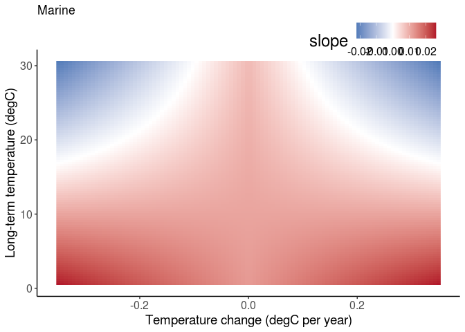<!-- -->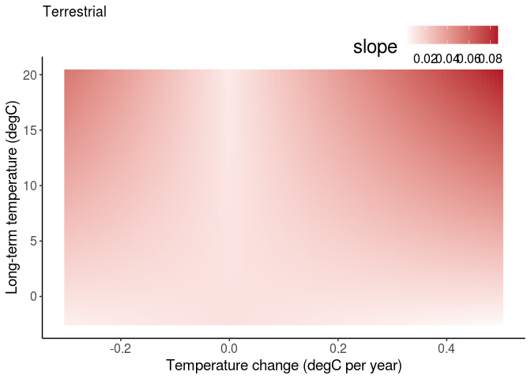<!-- -->

### Plot coefs by duration

``` r
coefs <- fixef(modJbetaXmin3abs)$cond
iM <- grep('REALMMarine:new_sTempYear:abs', names(coefs))
dursM <- as.numeric(gsub('duration_factor|:REALMMarine:new_sTempYear:abs\\(TempGAMCoef\\)', '', names(coefs)[iM]))
iT <- grep('REALMTerrestrial:new_sTempYear:abs', names(coefs))
dursT <- as.numeric(gsub('duration_factor|:REALMTerrestrial:new_sTempYear:abs\\(TempGAMCoef\\)', '', names(coefs)[iT]))
par(mfrow=c(1,2))
plot(dursM, coefs[iM], type = 'l', xlab = 'Time series duration', ylab = 'AveTemp:TempTrend interaction', main = "Marine")
abline(h =0, lty = 2)
plot(dursT, coefs[iT], type = 'l', xlab = 'Time series duration', ylab = 'AveTemp:TempTrend interaction', main = 'Terrestrial')
abline(h =0, lty = 2)
```

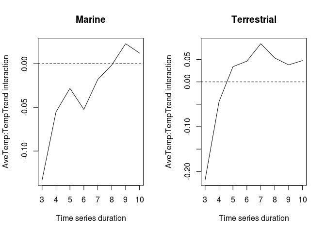<!-- -->

```` 


# Fit a Horn model
## Original

- Like the richness model, using Antao predictors, but with Horn slope as the response. Had to drop the REALM random slope to allow convergence.
- Now find LESS turnover at higher temperature in marine (opposite of richness and gains slope models).
- Find more turnover with changing temperatures at higher average temperatures in TERRESTRIAL (the interaction), not marine. Not like the richness and gains models.


```r
# realm-specific intercept. Simplify REs that were near zero.
modHornAll0 <- glmmTMB(disstrend ~ 0 + REALM + new_sTempYear:REALM + TempGAMCoef:REALM + TempGAMCoef:new_sTempYear:REALM
                +(0 + TempGAMCoef|taxa_mod1) +(1|taxa_mod1/STUDY_ID),
                disp = ~trendse*REALM,
                data = comb[measure == 'Horn' & model_id == 'logS_lm',])


summary(modHornAll0)
````

    ##  Family: gaussian  ( identity )
    ## Formula:          
    ## disstrend ~ 0 + REALM + new_sTempYear:REALM + TempGAMCoef:REALM +  
    ##     TempGAMCoef:new_sTempYear:REALM + (0 + TempGAMCoef | taxa_mod1) +  
    ##     (1 | taxa_mod1/STUDY_ID)
    ## Dispersion:                 ~trendse * REALM
    ## Data: comb[measure == "Horn" & model_id == "logS_lm", ]
    ## 
    ##       AIC       BIC    logLik  deviance  df.resid 
    ## -100473.3 -100353.7   50251.6 -100503.3     21416 
    ## 
    ## Random effects:
    ## 
    ## Conditional model:
    ##  Groups             Name        Variance  Std.Dev. 
    ##  taxa_mod1          TempGAMCoef 8.691e-03 9.323e-02
    ##  STUDY_ID.taxa_mod1 (Intercept) 4.971e-05 7.050e-03
    ##  taxa_mod1.1        (Intercept) 1.543e-10 1.242e-05
    ##  Residual                              NA        NA
    ## Number of obs: 21431, groups:  taxa_mod1, 9; STUDY_ID:taxa_mod1, 156
    ## 
    ## Conditional model:
    ##                                              Estimate Std. Error z value
    ## REALMMarine                                 0.0069144  0.0010682   6.473
    ## REALMTerrestrial                            0.0093270  0.0013926   6.698
    ## REALMMarine:new_sTempYear                  -0.0024405  0.0002924  -8.346
    ## REALMTerrestrial:new_sTempYear              0.0002686  0.0004691   0.573
    ## REALMMarine:TempGAMCoef                    -0.0208165  0.0335391  -0.621
    ## REALMTerrestrial:TempGAMCoef               -0.0295028  0.0337101  -0.875
    ## REALMMarine:new_sTempYear:TempGAMCoef       0.0066097  0.0056677   1.166
    ## REALMTerrestrial:new_sTempYear:TempGAMCoef  0.0226276  0.0082169   2.754
    ##                                            Pr(>|z|)    
    ## REALMMarine                                9.61e-11 ***
    ## REALMTerrestrial                           2.12e-11 ***
    ## REALMMarine:new_sTempYear                   < 2e-16 ***
    ## REALMTerrestrial:new_sTempYear              0.56693    
    ## REALMMarine:TempGAMCoef                     0.53482    
    ## REALMTerrestrial:TempGAMCoef                0.38147    
    ## REALMMarine:new_sTempYear:TempGAMCoef       0.24353    
    ## REALMTerrestrial:new_sTempYear:TempGAMCoef  0.00589 ** 
    ## ---
    ## Signif. codes:  0 '***' 0.001 '**' 0.01 '*' 0.05 '.' 0.1 ' ' 1
    ## 
    ## Dispersion model:
    ##                          Estimate Std. Error z value Pr(>|z|)    
    ## (Intercept)              -8.92534    0.01862  -479.3  < 2e-16 ***
    ## trendse                  69.41509    0.76785    90.4  < 2e-16 ***
    ## REALMTerrestrial         -0.33615    0.06649    -5.1 4.29e-07 ***
    ## trendse:REALMTerrestrial 15.45761    3.26776     4.7 2.24e-06 ***
    ## ---
    ## Signif. codes:  0 '***' 0.001 '**' 0.01 '*' 0.05 '.' 0.1 ' ' 1

## abs(temptrend)

AIC selects temptrend instead of abs(temptrend). Results are entirely
different than richness model:

  - LESS turnover at higher temperatures in marine
  - LESS turnover at higher temperatures per unit temperature change in
    marine (interaction)
  - more turnover per unit temperature change in TERRESTRIAL

<!-- end list -->

``` r
# realm-specific intercept. Simplify REs that were near zero.
modHornAll1 <- glmmTMB(disstrend ~ 0 + REALM + new_sTempYear:REALM + abs(TempGAMCoef):REALM + abs(TempGAMCoef):new_sTempYear:REALM
                +(0 + abs(TempGAMCoef)|taxa_mod1) +(1|taxa_mod1/STUDY_ID),
                disp = ~trendse*REALM,
                data = comb[measure == 'Horn' & model_id == 'logS_lm',])


summary(modHornAll1)
```

    ##  Family: gaussian  ( identity )
    ## Formula:          
    ## disstrend ~ 0 + REALM + new_sTempYear:REALM + abs(TempGAMCoef):REALM +  
    ##     abs(TempGAMCoef):new_sTempYear:REALM + (0 + abs(TempGAMCoef) |  
    ##     taxa_mod1) + (1 | taxa_mod1/STUDY_ID)
    ## Dispersion:                 ~trendse * REALM
    ## Data: comb[measure == "Horn" & model_id == "logS_lm", ]
    ## 
    ##       AIC       BIC    logLik  deviance  df.resid 
    ## -100453.8 -100334.2   50241.9 -100483.8     21416 
    ## 
    ## Random effects:
    ## 
    ## Conditional model:
    ##  Groups             Name             Variance  Std.Dev. 
    ##  taxa_mod1          abs(TempGAMCoef) 1.950e-10 1.397e-05
    ##  STUDY_ID.taxa_mod1 (Intercept)      4.752e-05 6.893e-03
    ##  taxa_mod1.1        (Intercept)      1.401e-11 3.743e-06
    ##  Residual                                   NA        NA
    ## Number of obs: 21431, groups:  taxa_mod1, 9; STUDY_ID:taxa_mod1, 156
    ## 
    ## Conditional model:
    ##                                                   Estimate Std. Error z value
    ## REALMMarine                                      0.0066964  0.0010680   6.270
    ## REALMTerrestrial                                 0.0079134  0.0014667   5.395
    ## REALMMarine:new_sTempYear                       -0.0019012  0.0003312  -5.741
    ## REALMTerrestrial:new_sTempYear                   0.0007071  0.0005482   1.290
    ## REALMMarine:abs(TempGAMCoef)                    -0.0035350  0.0051827  -0.682
    ## REALMTerrestrial:abs(TempGAMCoef)                0.0251862  0.0104743   2.405
    ## REALMMarine:new_sTempYear:abs(TempGAMCoef)      -0.0180142  0.0068669  -2.623
    ## REALMTerrestrial:new_sTempYear:abs(TempGAMCoef)  0.0035964  0.0095985   0.375
    ##                                                 Pr(>|z|)    
    ## REALMMarine                                     3.62e-10 ***
    ## REALMTerrestrial                                6.83e-08 ***
    ## REALMMarine:new_sTempYear                       9.43e-09 ***
    ## REALMTerrestrial:new_sTempYear                   0.19705    
    ## REALMMarine:abs(TempGAMCoef)                     0.49520    
    ## REALMTerrestrial:abs(TempGAMCoef)                0.01619 *  
    ## REALMMarine:new_sTempYear:abs(TempGAMCoef)       0.00871 ** 
    ## REALMTerrestrial:new_sTempYear:abs(TempGAMCoef)  0.70790    
    ## ---
    ## Signif. codes:  0 '***' 0.001 '**' 0.01 '*' 0.05 '.' 0.1 ' ' 1
    ## 
    ## Dispersion model:
    ##                          Estimate Std. Error z value Pr(>|z|)    
    ## (Intercept)              -8.92372    0.01861  -479.4  < 2e-16 ***
    ## trendse                  69.39584    0.76750    90.4  < 2e-16 ***
    ## REALMTerrestrial         -0.31049    0.06671    -4.7 3.25e-06 ***
    ## trendse:REALMTerrestrial 14.85867    3.26613     4.5 5.38e-06 ***
    ## ---
    ## Signif. codes:  0 '***' 0.001 '**' 0.01 '*' 0.05 '.' 0.1 ' ' 1

``` r
AIC(modHornAll0)
```

    ## [1] -100473.3

``` r
AIC(modHornAll1)
```

    ## [1] -100453.8

## 5-year standardized duration

  - Only for datasets of exactly 5 consecutive years. Removed random
    slope to allow convergence (was close to 0)
  - Only realm intercepts are significantly different from zero

<!-- end list -->

``` r
modHorn5 <- glmmTMB(disstrend ~ 0 + REALM + new_sTempYear:REALM + TempGAMCoef:REALM + TempGAMCoef:new_sTempYear:REALM
                +(1|taxa_mod1/STUDY_ID),
                disp = ~trendse*REALM,
                data = comb5[measure == 'Horn',])


summary(modHorn5)
```

    ##  Family: gaussian  ( identity )
    ## Formula:          
    ## disstrend ~ 0 + REALM + new_sTempYear:REALM + TempGAMCoef:REALM +  
    ##     TempGAMCoef:new_sTempYear:REALM + (1 | taxa_mod1/STUDY_ID)
    ## Dispersion:                 ~trendse * REALM
    ## Data: comb5[measure == "Horn", ]
    ## 
    ##      AIC      BIC   logLik deviance df.resid 
    ## -15330.1 -15238.3   7679.1 -15358.1     5192 
    ## 
    ## Random effects:
    ## 
    ## Conditional model:
    ##  Groups             Name        Variance  Std.Dev. 
    ##  STUDY_ID:taxa_mod1 (Intercept) 3.304e-05 5.748e-03
    ##  taxa_mod1          (Intercept) 1.699e-11 4.122e-06
    ##  Residual                              NA        NA
    ## Number of obs: 5206, groups:  STUDY_ID:taxa_mod1, 118; taxa_mod1, 9
    ## 
    ## Conditional model:
    ##                                              Estimate Std. Error z value
    ## REALMMarine                                 1.053e-02  1.619e-03   6.502
    ## REALMTerrestrial                            9.426e-03  1.842e-03   5.116
    ## REALMMarine:new_sTempYear                  -6.407e-05  1.434e-03  -0.045
    ## REALMTerrestrial:new_sTempYear             -3.843e-04  6.748e-04  -0.570
    ## REALMMarine:TempGAMCoef                     3.592e-03  2.535e-02   0.142
    ## REALMTerrestrial:TempGAMCoef               -1.039e-02  1.510e-02  -0.688
    ## REALMMarine:new_sTempYear:TempGAMCoef      -4.331e-02  2.786e-02  -1.554
    ## REALMTerrestrial:new_sTempYear:TempGAMCoef  1.235e-02  1.164e-02   1.061
    ##                                            Pr(>|z|)    
    ## REALMMarine                                7.92e-11 ***
    ## REALMTerrestrial                           3.11e-07 ***
    ## REALMMarine:new_sTempYear                     0.964    
    ## REALMTerrestrial:new_sTempYear                0.569    
    ## REALMMarine:TempGAMCoef                       0.887    
    ## REALMTerrestrial:TempGAMCoef                  0.492    
    ## REALMMarine:new_sTempYear:TempGAMCoef         0.120    
    ## REALMTerrestrial:new_sTempYear:TempGAMCoef    0.289    
    ## ---
    ## Signif. codes:  0 '***' 0.001 '**' 0.01 '*' 0.05 '.' 0.1 ' ' 1
    ## 
    ## Dispersion model:
    ##                          Estimate Std. Error z value Pr(>|z|)    
    ## (Intercept)              -7.37527    0.05116 -144.16   <2e-16 ***
    ## trendse                  29.25825    0.70189   41.68   <2e-16 ***
    ## REALMTerrestrial         -1.71438    0.10100  -16.97   <2e-16 ***
    ## trendse:REALMTerrestrial 34.30838    2.89280   11.86   <2e-16 ***
    ## ---
    ## Signif. codes:  0 '***' 0.001 '**' 0.01 '*' 0.05 '.' 0.1 ' ' 1
