Replicate and extend analyses from Antao et al. 2020
================

# Load data

    ## here() starts at /local/home/malinp/climate_community_crossrealm

    ## Warning: NAs introduced by coercion

# Compare datasets

## Trends included

``` r
# how many ts missing?
length(setdiff(dat$rarefyID, bt$rarefyID))
```

    ## [1] 0

``` r
length(missing <- setdiff(dat$rarefyID, trends$rarefyID))
```

    ## [1] 69

``` r
length(setdiff(bt$rarefyID, trends$rarefyID))
```

    ## [1] 20294

``` r
length(setdiff(dat$rarefyID, rich$rarefyID))
```

    ## [1] 0

``` r
#richness of missing ts
rich[rarefyID %in% missing, summary(Nspp)]
```

    ##    Min. 1st Qu.  Median    Mean 3rd Qu.    Max. 
    ##   1.000   2.000   2.000   1.768   2.000   2.000

``` r
rich[rarefyID %in% missing & Nspp < 3, .N] # only 69 fail because too few species
```

    ## [1] 69

``` r
# years in missing ts
nyrs <- bt[, .(nyrBT = length(unique(c(year1, year2)))), by = rarefyID]
nyrs[rarefyID %in% missing, summary(nyrBT)]
```

    ##    Min. 1st Qu.  Median    Mean 3rd Qu.    Max. 
    ##   5.000   5.000   6.000   6.377   7.000  13.000

``` r
nyrs[rarefyID %in% missing & nyrBT < 5, .N] # none fail because too few years
```

    ## [1] 0

``` r
# Full Antao vs. Antao now with human and mass
length(setdiff(dat$rarefyID, combMHlogS$rarefyID)) # only missing 92 ts
```

    ## [1] 92

## Response variables

### Plots

``` r
col = '#00000033'
# compare
comb[, plot(startYear, year1)]
```

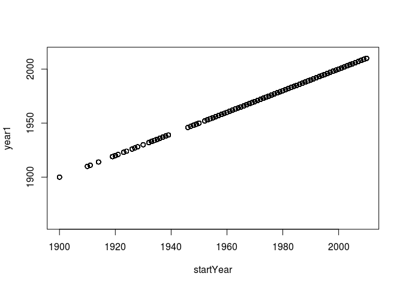<!-- -->

    ## NULL

``` r
comb[, plot(endYear, year2)]
```

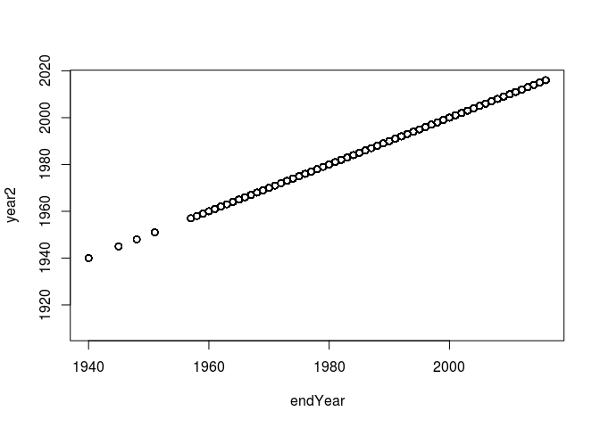<!-- -->

    ## NULL

``` r
comb[, plot(TempGAMCoef, temptrend)]; abline(0,1)
```

    ## NULL

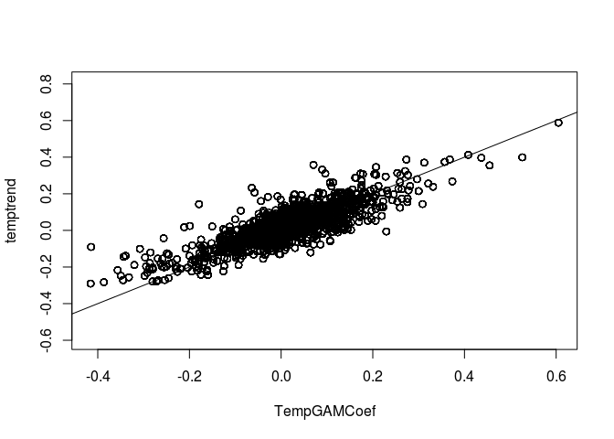<!-- -->

``` r
comb[, plot(new_sTempYear, tempave.sc, col = c('green', 'blue')[(REALM=='Marine')+1])]; abline(0,1)
```

    ## NULL

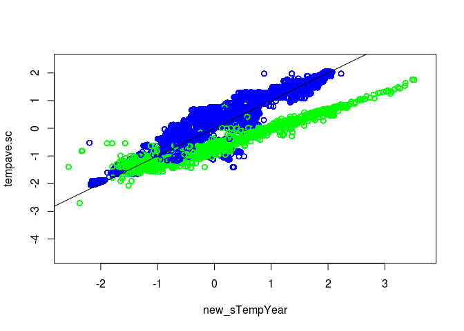<!-- -->

``` r
comb[model_id == 'logS_lm' & measure == 'Jtu', plot(slope, disstrend, xlab = 'logS slope', ylab = 'Jtu slope', col = col)]
```

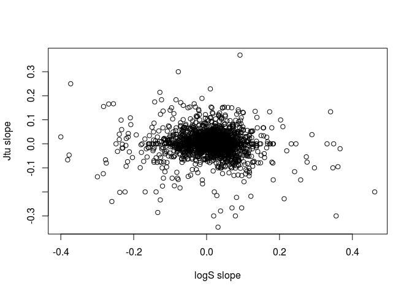<!-- -->

    ## NULL

``` r
comb[model_id == 'Gains_lm' & measure == 'Jtu', plot(slope, disstrend, xlab = 'Gains slope', ylab = 'Jtu slope', col = col)]
```

<!-- -->

    ## NULL

``` r
comb[model_id == 'Losses_lm' & measure == 'Jtu', plot(slope, disstrend, xlab = 'Losses slope', ylab = 'Jtu slope', col = col)]
```

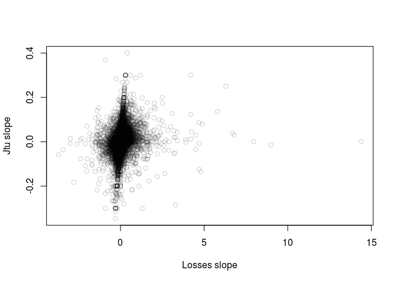<!-- -->

    ## NULL

``` r
comb[model_id == 'logS_lm' & measure == 'Jbeta', plot(slope, disstrend, xlab = 'logS slope', ylab = 'Jbeta slope', col = col)]
```

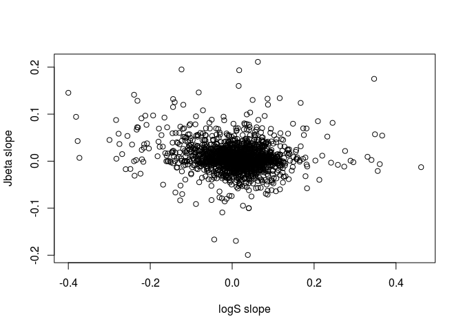<!-- -->

    ## NULL

``` r
comb[model_id == 'Gains_lm' & measure == 'Jbeta', plot(slope, disstrend, xlab = 'Gains slope', ylab = 'Jbeta slope', col = col)]
```

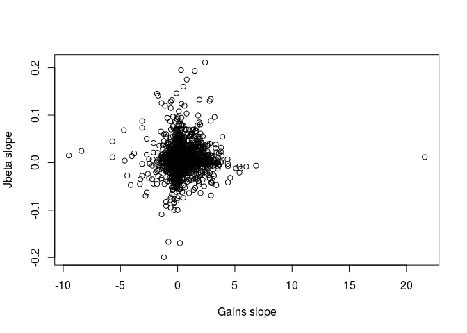<!-- -->

    ## NULL

``` r
comb[model_id == 'Losses_lm' & measure == 'Jbeta', plot(slope, disstrend, xlab = 'Losses slope', ylab = 'Jbeta slope', col = col)]
```

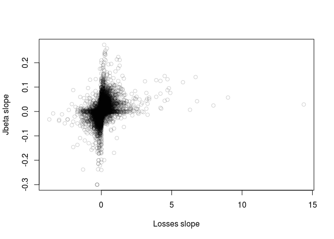<!-- -->

    ## NULL

``` r
comb[model_id == 'logS_lm' & measure == 'Horn', plot(slope, disstrend, xlab = 'logS slope', ylab = 'Horn slope', col = col)]
```

<!-- -->

    ## NULL

``` r
comb[model_id == 'logN_lm' & measure == 'Horn', plot(slope, disstrend, xlab = 'logN slope', ylab = 'Horn slope', col = col)]
```

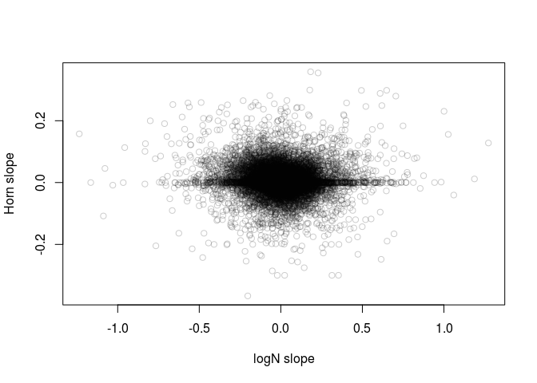<!-- -->

    ## NULL

``` r
comb[model_id == 'Gains_lm' & measure == 'Horn', plot(slope, disstrend, xlab = 'Gains slope', ylab = 'Horn slope', col = col)]
```

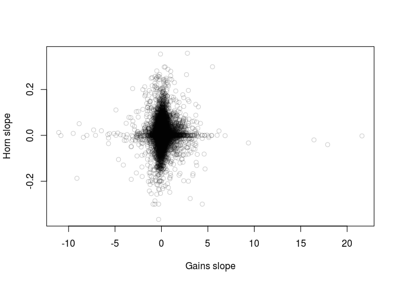<!-- -->

    ## NULL

``` r
comb[model_id == 'Losses_lm' & measure == 'Horn', plot(slope, disstrend, xlab = 'Losses slope', ylab = 'Horn slope', col = col)]
```

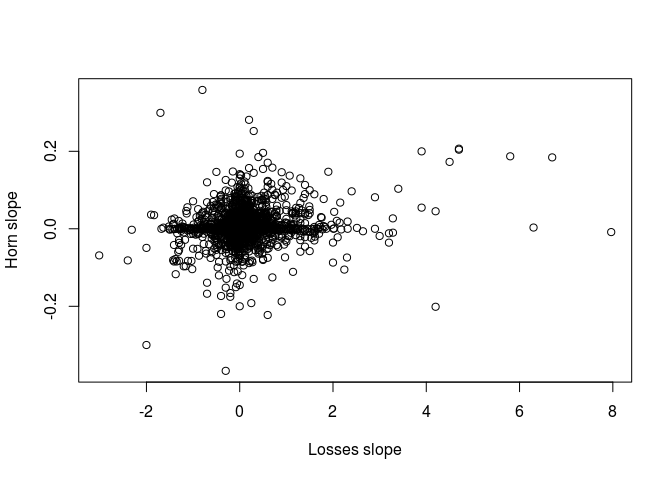<!-- -->

    ## NULL

### Correlations

``` r
comb[model_id == 'logS_lm' & measure == 'Jtu', cor(slope, disstrend)]
```

    ## [1] -0.07323631

``` r
comb[model_id == 'Gains_lm' & measure == 'Jtu', cor(slope, disstrend)]
```

    ## [1] -0.009094795

``` r
comb[model_id == 'Losses_lm' & measure == 'Jtu', cor(slope, disstrend)]
```

    ## [1] 0.2258978

``` r
comb[model_id == 'logS_lm' & measure == 'Jbeta', cor(slope, disstrend)]
```

    ## [1] -0.0934493

``` r
comb[model_id == 'Gains_lm' & measure == 'Jbeta', cor(slope, disstrend)]
```

    ## [1] 0.1089186

``` r
comb[model_id == 'Losses_lm' & measure == 'Jbeta', cor(slope, disstrend)]
```

    ## [1] 0.3434489

``` r
comb[model_id == 'logS_lm' & measure == 'Horn', cor(slope, disstrend)]
```

    ## [1] -0.06057827

``` r
comb[model_id == 'logN_lm' & measure == 'Horn', cor(slope, disstrend)]
```

    ## [1] -0.05549073

``` r
comb[model_id == 'Gains_lm' & measure == 'Horn', cor(slope, disstrend)]
```

    ## [1] 0.02256426

``` r
comb[model_id == 'Losses_lm' & measure == 'Horn', cor(slope, disstrend)]
```

    ## [1] 0.1837287

# Fit richness model

## Original model with glmmTMB

The richness (logS) model fit with glmmTMB as a single model matches the
published results (realm-specific models fit with brms) if the error and
RE terms are realm-specific.

``` r
# published model
mod0 <- glmmTMB(slope ~ 0 + new_sTempYear:REALM + TempGAMCoef:REALM + TempGAMCoef:new_sTempYear:REALM
                +(0 + TempGAMCoef|REALM/taxa_mod1) +(1|REALM/taxa_mod1/STUDY_ID), 
                disp = ~std.error*REALM,
                data = datS)

summary(mod0)
```

    ##  Family: gaussian  ( identity )
    ## Formula:          
    ## slope ~ 0 + new_sTempYear:REALM + TempGAMCoef:REALM + TempGAMCoef:new_sTempYear:REALM +  
    ##     (0 + TempGAMCoef | REALM/taxa_mod1) + (1 | REALM/taxa_mod1/STUDY_ID)
    ## Dispersion:             ~std.error * REALM
    ## Data: datS
    ## 
    ##      AIC      BIC   logLik deviance df.resid 
    ## -80528.1 -80408.4  40279.0 -80558.1    21485 
    ## 
    ## Random effects:
    ## 
    ## Conditional model:
    ##  Groups                     Name        Variance  Std.Dev. 
    ##  taxa_mod1.REALM            TempGAMCoef 4.220e-03 0.0649587
    ##  REALM                      TempGAMCoef 4.028e-07 0.0006347
    ##  STUDY_ID..taxa_mod1.REALM. (Intercept) 3.035e-04 0.0174222
    ##  taxa_mod1.REALM.1          (Intercept) 2.012e-05 0.0044856
    ##  REALM.1                    (Intercept) 1.188e-05 0.0034464
    ##  Residual                                      NA        NA
    ## Number of obs: 21500, groups:  
    ## taxa_mod1:REALM, 12; REALM, 2; STUDY_ID:(taxa_mod1:REALM), 156
    ## 
    ## Conditional model:
    ##                                              Estimate Std. Error z value
    ## new_sTempYear:REALMMarine                   0.0029022  0.0005907   4.913
    ## new_sTempYear:REALMTerrestrial              0.0011181  0.0007450   1.501
    ## REALMMarine:TempGAMCoef                     0.0938505  0.0331252   2.833
    ## REALMTerrestrial:TempGAMCoef               -0.0091852  0.0398106  -0.231
    ## new_sTempYear:REALMMarine:TempGAMCoef       0.0848609  0.0117952   7.195
    ## new_sTempYear:REALMTerrestrial:TempGAMCoef -0.0140901  0.0132704  -1.062
    ##                                            Pr(>|z|)    
    ## new_sTempYear:REALMMarine                  8.96e-07 ***
    ## new_sTempYear:REALMTerrestrial              0.13342    
    ## REALMMarine:TempGAMCoef                     0.00461 ** 
    ## REALMTerrestrial:TempGAMCoef                0.81753    
    ## new_sTempYear:REALMMarine:TempGAMCoef      6.27e-13 ***
    ## new_sTempYear:REALMTerrestrial:TempGAMCoef  0.28834    
    ## ---
    ## Signif. codes:  0 '***' 0.001 '**' 0.01 '*' 0.05 '.' 0.1 ' ' 1
    ## 
    ## Dispersion model:
    ##                            Estimate Std. Error z value Pr(>|z|)    
    ## (Intercept)                -7.87426    0.01876  -419.8   <2e-16 ***
    ## std.error                  39.41112    0.47960    82.2   <2e-16 ***
    ## REALMTerrestrial           -0.60158    0.07103    -8.5   <2e-16 ***
    ## std.error:REALMTerrestrial 27.14306    2.46121    11.0   <2e-16 ***
    ## ---
    ## Signif. codes:  0 '***' 0.001 '**' 0.01 '*' 0.05 '.' 0.1 ' ' 1

### Plot

``` r
# set up prediction frame
newdatM <- expand.grid(new_sTempYear = seq(-2, 2.5, length.out = 100), TempGAMCoef = seq(-0.35, 0.35, length.out = 100))
newdatM$REALM <- 'Marine'
newdatM$taxa_mod1 <- 'All'
newdatM$STUDY_ID <- 33
newdatM$std.error <- 0.03
sdTM <- sd(datS$newtempvalues[datS$REALM == 'Marine'])
meanTM <- mean(datS$newtempvalues[datS$REALM == 'Marine'])
newdatM$newtempvalues <- newdatM$new_sTempYear * sdTM + meanTM

newdatT <- expand.grid(new_sTempYear = seq(-2.5, 2.7, length.out = 100), TempGAMCoef = seq(-0.3, 0.5, length.out = 100))
newdatT$REALM <- 'Terrestrial'
newdatT$taxa_mod1 <- 'Terrestrial plants'
newdatT$STUDY_ID <- 18
newdatT$std.error <- 0.03
sdTT <- sd(datS$newtempvalues[datS$REALM == 'Terrestrial'])
meanTT <- mean(datS$newtempvalues[datS$REALM == 'Terrestrial'])
newdatT$newtempvalues <- newdatT$new_sTempYear * sdTT + meanTT

# predict
newdatM$slope <- predict(mod0, newdata = newdatM, se.fit = FALSE, re.form = NA)
newdatT$slope <- predict(mod0, newdata = newdatT, se.fit = FALSE, re.form = NA)

# plot
p1 <- ggplot(newdatM, aes(TempGAMCoef, newtempvalues, z = slope)) +
    geom_raster(aes(fill = slope)) +
    labs(x = 'Temperature change (degC per year)', y = 'Long-term temperature (degC)', title = 'Marine') +
    scale_fill_gradient2(high= "#B2182B", mid = "white", low= "#2166AC", midpoint = 0) +
    theme(axis.text = element_text(size = 12), 
          axis.title = element_text(size = 14),
          panel.background = element_blank(),
          axis.line = element_line(colour = "black"),
          legend.position = "top",
          legend.margin = margin(c(0, 0.1, -20, 0)),
          legend.justification = c(0.92, 0.9),
          legend.text=element_text(size= 12),
          legend.title=element_text(size= 18),
          legend.title.align = 1)
p2 <- ggplot(newdatT, aes(TempGAMCoef, newtempvalues, z = slope)) +
    geom_raster(aes(fill = slope)) +
    labs(x = 'Temperature change (degC per year)', y = 'Long-term temperature (degC)', title = 'Terrestrial') +
    scale_fill_gradient2(high= "#B2182B", mid = "white", low= "#2166AC", midpoint = 0) +
    theme(axis.text = element_text(size = 12), 
          axis.title = element_text(size = 14),
          panel.background = element_blank(),
          axis.line = element_line(colour = "black"),
          legend.position = "top",
          legend.margin = margin(c(0, 0.1, -20, 0)),
          legend.justification = c(0.92, 0.9),
          legend.text=element_text(size= 12),
          legend.title=element_text(size= 18),
          legend.title.align = 1)

p1
```

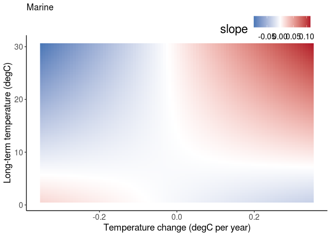<!-- -->

``` r
p2
```

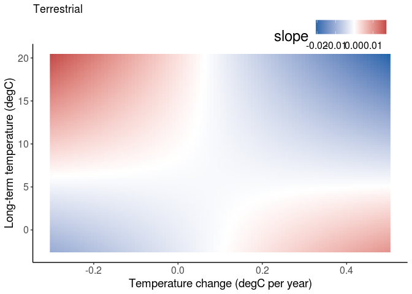<!-- -->

## With an intercept

Adding an intercept to allow turnover at 0 temperature change doesn’t
alter the results

``` r
# add an intercept to allow some turnover at 0 temperature change and ave temp. wouldn't converge with realm-specific intercept.
mod1 <- glmmTMB(slope ~ 1 + new_sTempYear:REALM + TempGAMCoef:REALM + TempGAMCoef:new_sTempYear:REALM
                +(0 + TempGAMCoef|REALM/taxa_mod1) +(1|REALM/taxa_mod1/STUDY_ID), 
                disp = ~std.error*REALM,
                data = datS)
summary(mod1)
```

    ##  Family: gaussian  ( identity )
    ## Formula:          
    ## slope ~ 1 + new_sTempYear:REALM + TempGAMCoef:REALM + TempGAMCoef:new_sTempYear:REALM +  
    ##     (0 + TempGAMCoef | REALM/taxa_mod1) + (1 | REALM/taxa_mod1/STUDY_ID)
    ## Dispersion:             ~std.error * REALM
    ## Data: datS
    ## 
    ##      AIC      BIC   logLik deviance df.resid 
    ## -80528.9 -80401.3  40280.5 -80560.9    21484 
    ## 
    ## Random effects:
    ## 
    ## Conditional model:
    ##  Groups                     Name        Variance  Std.Dev. 
    ##  taxa_mod1.REALM            TempGAMCoef 4.318e-03 6.571e-02
    ##  REALM                      TempGAMCoef 3.485e-11 5.903e-06
    ##  STUDY_ID..taxa_mod1.REALM. (Intercept) 3.150e-04 1.775e-02
    ##  taxa_mod1.REALM.1          (Intercept) 5.152e-09 7.178e-05
    ##  REALM.1                    (Intercept) 5.311e-11 7.288e-06
    ##  Residual                                      NA        NA
    ## Number of obs: 21500, groups:  
    ## taxa_mod1:REALM, 12; REALM, 2; STUDY_ID:(taxa_mod1:REALM), 156
    ## 
    ## Conditional model:
    ##                                              Estimate Std. Error z value
    ## (Intercept)                                 0.0040889  0.0019096   2.141
    ## new_sTempYear:REALMMarine                   0.0029077  0.0005906   4.923
    ## new_sTempYear:REALMTerrestrial              0.0010934  0.0007454   1.467
    ## REALMMarine:TempGAMCoef                     0.0949346  0.0333564   2.846
    ## REALMTerrestrial:TempGAMCoef               -0.0108016  0.0400265  -0.270
    ## new_sTempYear:REALMMarine:TempGAMCoef       0.0850749  0.0117844   7.219
    ## new_sTempYear:REALMTerrestrial:TempGAMCoef -0.0149665  0.0132720  -1.128
    ##                                            Pr(>|z|)    
    ## (Intercept)                                 0.03226 *  
    ## new_sTempYear:REALMMarine                  8.52e-07 ***
    ## new_sTempYear:REALMTerrestrial              0.14242    
    ## REALMMarine:TempGAMCoef                     0.00443 ** 
    ## REALMTerrestrial:TempGAMCoef                0.78727    
    ## new_sTempYear:REALMMarine:TempGAMCoef      5.23e-13 ***
    ## new_sTempYear:REALMTerrestrial:TempGAMCoef  0.25946    
    ## ---
    ## Signif. codes:  0 '***' 0.001 '**' 0.01 '*' 0.05 '.' 0.1 ' ' 1
    ## 
    ## Dispersion model:
    ##                            Estimate Std. Error z value Pr(>|z|)    
    ## (Intercept)                -7.87424    0.01876  -419.8   <2e-16 ***
    ## std.error                  39.41027    0.47961    82.2   <2e-16 ***
    ## REALMTerrestrial           -0.60133    0.07103    -8.5   <2e-16 ***
    ## std.error:REALMTerrestrial 27.12098    2.46098    11.0   <2e-16 ***
    ## ---
    ## Signif. codes:  0 '***' 0.001 '**' 0.01 '*' 0.05 '.' 0.1 ' ' 1

Another approach to adding an intercept: realm-specific, but with
simpler REs. This model but also with REALM-specific RE intercepts won’t
converge.

``` r
# realm-specific intercept. Simplify REs that were near zero.
mod2 <- glmmTMB(slope ~ 0 + REALM + new_sTempYear:REALM + TempGAMCoef:REALM + TempGAMCoef:new_sTempYear:REALM
                +(0 + TempGAMCoef|REALM/taxa_mod1) +(1|taxa_mod1/STUDY_ID), 
                disp = ~std.error*REALM,
                data = datS)


summary(mod2)
```

    ##  Family: gaussian  ( identity )
    ## Formula:          
    ## slope ~ 0 + REALM + new_sTempYear:REALM + TempGAMCoef:REALM +  
    ##     TempGAMCoef:new_sTempYear:REALM + (0 + TempGAMCoef | REALM/taxa_mod1) +  
    ##     (1 | taxa_mod1/STUDY_ID)
    ## Dispersion:             ~std.error * REALM
    ## Data: datS
    ## 
    ##      AIC      BIC   logLik deviance df.resid 
    ## -80529.7 -80402.0  40280.8 -80561.7    21484 
    ## 
    ## Random effects:
    ## 
    ## Conditional model:
    ##  Groups             Name        Variance  Std.Dev. 
    ##  taxa_mod1:REALM    TempGAMCoef 4.258e-03 6.525e-02
    ##  REALM              TempGAMCoef 6.337e-09 7.961e-05
    ##  STUDY_ID:taxa_mod1 (Intercept) 3.059e-04 1.749e-02
    ##  taxa_mod1          (Intercept) 3.225e-06 1.796e-03
    ##  Residual                              NA        NA
    ## Number of obs: 21500, groups:  
    ## taxa_mod1:REALM, 12; REALM, 2; STUDY_ID:taxa_mod1, 156; taxa_mod1, 9
    ## 
    ## Conditional model:
    ##                                              Estimate Std. Error z value
    ## REALMMarine                                 0.0056594  0.0028452   1.989
    ## REALMTerrestrial                            0.0025707  0.0034766   0.739
    ## REALMMarine:new_sTempYear                   0.0029074  0.0005905   4.924
    ## REALMTerrestrial:new_sTempYear              0.0011078  0.0007452   1.487
    ## REALMMarine:TempGAMCoef                     0.0938602  0.0331841   2.828
    ## REALMTerrestrial:TempGAMCoef               -0.0104593  0.0402199  -0.260
    ## REALMMarine:new_sTempYear:TempGAMCoef       0.0848073  0.0117877   7.195
    ## REALMTerrestrial:new_sTempYear:TempGAMCoef -0.0144800  0.0132750  -1.091
    ##                                            Pr(>|z|)    
    ## REALMMarine                                 0.04669 *  
    ## REALMTerrestrial                            0.45965    
    ## REALMMarine:new_sTempYear                  8.48e-07 ***
    ## REALMTerrestrial:new_sTempYear              0.13711    
    ## REALMMarine:TempGAMCoef                     0.00468 ** 
    ## REALMTerrestrial:TempGAMCoef                0.79482    
    ## REALMMarine:new_sTempYear:TempGAMCoef      6.27e-13 ***
    ## REALMTerrestrial:new_sTempYear:TempGAMCoef  0.27537    
    ## ---
    ## Signif. codes:  0 '***' 0.001 '**' 0.01 '*' 0.05 '.' 0.1 ' ' 1
    ## 
    ## Dispersion model:
    ##                            Estimate Std. Error z value Pr(>|z|)    
    ## (Intercept)                -7.87418    0.01876  -419.8   <2e-16 ***
    ## std.error                  39.41033    0.47963    82.2   <2e-16 ***
    ## REALMTerrestrial           -0.60187    0.07102    -8.5   <2e-16 ***
    ## std.error:REALMTerrestrial 27.13924    2.46101    11.0   <2e-16 ***
    ## ---
    ## Signif. codes:  0 '***' 0.001 '**' 0.01 '*' 0.05 '.' 0.1 ' ' 1

## With my temperature data

``` r
# 
mod0alt_tempdata <- glmmTMB(slope ~ 0 + tempave.sc:REALM + temptrend.sc:REALM + temptrend.sc:tempave.sc:REALM
                +(0 + temptrend.sc|REALM/taxa_mod1) +(1|REALM/taxa_mod1/STUDY_ID), 
                disp = ~std.error*REALM,
                data = comb[!duplicated(rarefyID) & model_id == 'logS_lm',])

summary(mod0alt_tempdata)
```

    ##  Family: gaussian  ( identity )
    ## Formula:          
    ## slope ~ 0 + tempave.sc:REALM + temptrend.sc:REALM + temptrend.sc:tempave.sc:REALM +  
    ##     (0 + temptrend.sc | REALM/taxa_mod1) + (1 | REALM/taxa_mod1/STUDY_ID)
    ## Dispersion:             ~std.error * REALM
    ## Data: comb[!duplicated(rarefyID) & model_id == "logS_lm", ]
    ## 
    ##      AIC      BIC   logLik deviance df.resid 
    ## -33301.2 -33193.9  16665.6 -33331.2     9405 
    ## 
    ## Random effects:
    ## 
    ## Conditional model:
    ##  Groups                     Name         Variance  Std.Dev. 
    ##  taxa_mod1.REALM            temptrend.sc 5.564e-04 2.359e-02
    ##  REALM                      temptrend.sc 1.598e-10 1.264e-05
    ##  STUDY_ID..taxa_mod1.REALM. (Intercept)  3.672e-04 1.916e-02
    ##  taxa_mod1.REALM.1          (Intercept)  1.010e-09 3.179e-05
    ##  REALM.1                    (Intercept)  3.250e-05 5.701e-03
    ##  Residual                                       NA        NA
    ## Number of obs: 9420, groups:  
    ## taxa_mod1:REALM, 12; REALM, 2; STUDY_ID:(taxa_mod1:REALM), 142
    ## 
    ## Conditional model:
    ##                                           Estimate Std. Error z value Pr(>|z|)
    ## tempave.sc:REALMMarine                    0.009656   0.001188   8.129 4.33e-16
    ## tempave.sc:REALMTerrestrial               0.000648   0.001017   0.637   0.5240
    ## REALMMarine:temptrend.sc                  0.027036   0.011292   2.394   0.0167
    ## REALMTerrestrial:temptrend.sc            -0.004342   0.012443  -0.349   0.7271
    ## tempave.sc:REALMMarine:temptrend.sc       0.017550   0.003624   4.842 1.28e-06
    ## tempave.sc:REALMTerrestrial:temptrend.sc  0.005331   0.005542   0.962   0.3361
    ##                                             
    ## tempave.sc:REALMMarine                   ***
    ## tempave.sc:REALMTerrestrial                 
    ## REALMMarine:temptrend.sc                 *  
    ## REALMTerrestrial:temptrend.sc               
    ## tempave.sc:REALMMarine:temptrend.sc      ***
    ## tempave.sc:REALMTerrestrial:temptrend.sc    
    ## ---
    ## Signif. codes:  0 '***' 0.001 '**' 0.01 '*' 0.05 '.' 0.1 ' ' 1
    ## 
    ## Dispersion model:
    ##                            Estimate Std. Error z value Pr(>|z|)    
    ## (Intercept)                -7.58207    0.02949 -257.13   <2e-16 ***
    ## std.error                  34.92753    0.68286   51.15   <2e-16 ***
    ## REALMTerrestrial           -1.05422    0.08177  -12.89   <2e-16 ***
    ## std.error:REALMTerrestrial 32.86006    2.71900   12.09   <2e-16 ***
    ## ---
    ## Signif. codes:  0 '***' 0.001 '**' 0.01 '*' 0.05 '.' 0.1 ' ' 1

### Plot

``` r
# set up prediction frame
newdatM <- expand.grid(tempave.sc = seq(-2, 1.8, length.out = 100), temptrend.sc = seq(-1.8, 1.8, length.out = 100))
newdatM$REALM <- 'Marine'
newdatM$taxa_mod1 <- 'All'
newdatM$STUDY_ID <- 33
newdatM$std.error <- 0.03
newdatM$tempave <- newdatM$tempave.sc * scaling[var == 'tempave.sc', scale] + scaling[var == 'tempave.sc', center]
newdatM$temptrend <- newdatM$temptrend.sc * scaling[var == 'temptrend.sc', scale] + scaling[var == 'temptrend.sc', center]

newdatT <- expand.grid(tempave.sc = seq(-2.2, 1.3, length.out = 100), temptrend.sc = seq(-1.8, 3, length.out = 100))
newdatT$REALM <- 'Terrestrial'
newdatT$taxa_mod1 <- 'Terrestrial plants'
newdatT$STUDY_ID <- 18
newdatT$std.error <- 0.03
newdatT$tempave <- newdatT$tempave.sc * scaling[var == 'tempave.sc', scale] + scaling[var == 'tempave.sc', center]
newdatT$temptrend <- newdatT$temptrend.sc * scaling[var == 'temptrend.sc', scale] + scaling[var == 'temptrend.sc', center]

# predict
newdatM$slope <- predict(mod0alt_tempdata, newdata = newdatM, se.fit = FALSE, re.form = NA)
newdatT$slope <- predict(mod0alt_tempdata, newdata = newdatT, se.fit = FALSE, re.form = NA)

# plot
p1 <- ggplot(newdatM, aes(temptrend, tempave, z = slope)) +
    geom_raster(aes(fill = slope)) +
    labs(x = 'Temperature change (degC per year)', y = 'Long-term temperature (degC)', title = 'Marine') +
    scale_fill_gradient2(high= "#B2182B", mid = "white", low= "#2166AC", midpoint = 0) +
    theme(axis.text = element_text(size = 12), 
          axis.title = element_text(size = 14),
          panel.background = element_blank(),
          axis.line = element_line(colour = "black"),
          legend.position = "top",
          legend.margin = margin(c(0, 0.1, -20, 0)),
          legend.justification = c(0.92, 0.9),
          legend.text=element_text(size= 12),
          legend.title=element_text(size= 18),
          legend.title.align = 1)
p2 <- ggplot(newdatT, aes(temptrend, tempave, z = slope)) +
    geom_raster(aes(fill = slope)) +
    labs(x = 'Temperature change (degC per year)', y = 'Long-term temperature (degC)', title = 'Terrestrial') +
    scale_fill_gradient2(high= "#B2182B", mid = "white", low= "#2166AC", midpoint = 0) +
    theme(axis.text = element_text(size = 12), 
          axis.title = element_text(size = 14),
          panel.background = element_blank(),
          axis.line = element_line(colour = "black"),
          legend.position = "top",
          legend.margin = margin(c(0, 0.1, -20, 0)),
          legend.justification = c(0.92, 0.9),
          legend.text=element_text(size= 12),
          legend.title=element_text(size= 18),
          legend.title.align = 1)

p1
```

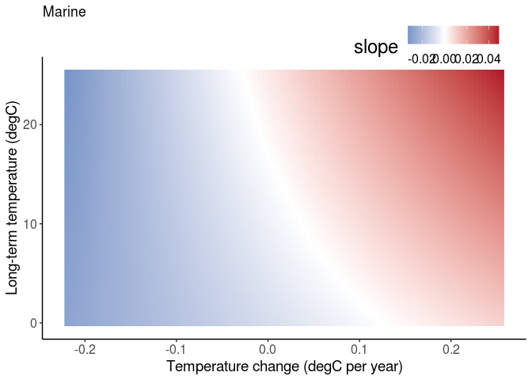<!-- -->

``` r
p2
```

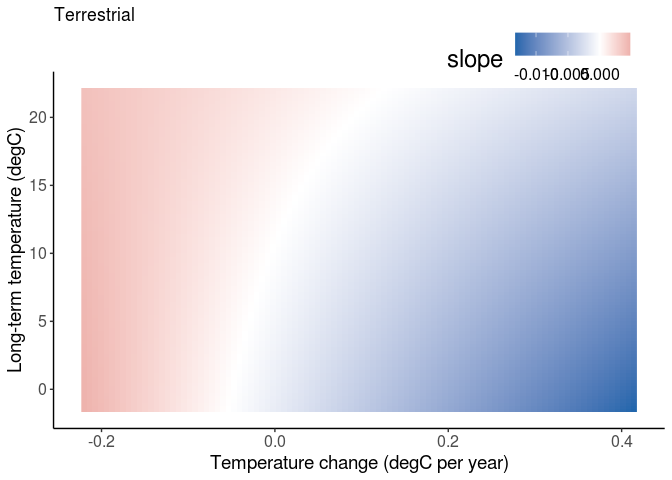<!-- --> \#\#
With abs(tempchange) abs(tempchange) is favored substantially (deltaAIC
70) over tempchange. Coefficients are largely the same other than this
major changw.

``` r
# realm-specific intercept. Simplify REs that were near zero.
mod3 <- glmmTMB(slope ~ 0 + REALM + new_sTempYear:REALM + abs(TempGAMCoef):REALM + abs(TempGAMCoef):new_sTempYear:REALM
                +(0 + abs(TempGAMCoef)|REALM/taxa_mod1) +(1|taxa_mod1/STUDY_ID), 
                disp = ~std.error*REALM,
                data = datS)


summary(mod3)
```

    ##  Family: gaussian  ( identity )
    ## Formula:          
    ## slope ~ 0 + REALM + new_sTempYear:REALM + abs(TempGAMCoef):REALM +  
    ##     abs(TempGAMCoef):new_sTempYear:REALM + (0 + abs(TempGAMCoef) |  
    ##     REALM/taxa_mod1) + (1 | taxa_mod1/STUDY_ID)
    ## Dispersion:             ~std.error * REALM
    ## Data: datS
    ## 
    ##      AIC      BIC   logLik deviance df.resid 
    ## -80601.2 -80473.6  40316.6 -80633.2    21484 
    ## 
    ## Random effects:
    ## 
    ## Conditional model:
    ##  Groups             Name             Variance  Std.Dev. 
    ##  taxa_mod1:REALM    abs(TempGAMCoef) 6.824e-04 2.612e-02
    ##  REALM              abs(TempGAMCoef) 5.157e-10 2.271e-05
    ##  STUDY_ID:taxa_mod1 (Intercept)      3.282e-04 1.811e-02
    ##  taxa_mod1          (Intercept)      9.919e-06 3.149e-03
    ##  Residual                                   NA        NA
    ## Number of obs: 21500, groups:  
    ## taxa_mod1:REALM, 12; REALM, 2; STUDY_ID:taxa_mod1, 156; taxa_mod1, 9
    ## 
    ## Conditional model:
    ##                                                   Estimate Std. Error z value
    ## REALMMarine                                      0.0040706  0.0032324   1.259
    ## REALMTerrestrial                                 0.0023082  0.0038618   0.598
    ## REALMMarine:new_sTempYear                       -0.0007299  0.0006993  -1.044
    ## REALMTerrestrial:new_sTempYear                   0.0014073  0.0008563   1.643
    ## REALMMarine:abs(TempGAMCoef)                     0.1027262  0.0214164   4.797
    ## REALMTerrestrial:abs(TempGAMCoef)               -0.0002230  0.0338216  -0.007
    ## REALMMarine:new_sTempYear:abs(TempGAMCoef)       0.2184038  0.0170037  12.845
    ## REALMTerrestrial:new_sTempYear:abs(TempGAMCoef) -0.0219843  0.0167266  -1.314
    ##                                                 Pr(>|z|)    
    ## REALMMarine                                        0.208    
    ## REALMTerrestrial                                   0.550    
    ## REALMMarine:new_sTempYear                          0.297    
    ## REALMTerrestrial:new_sTempYear                     0.100    
    ## REALMMarine:abs(TempGAMCoef)                    1.61e-06 ***
    ## REALMTerrestrial:abs(TempGAMCoef)                  0.995    
    ## REALMMarine:new_sTempYear:abs(TempGAMCoef)       < 2e-16 ***
    ## REALMTerrestrial:new_sTempYear:abs(TempGAMCoef)    0.189    
    ## ---
    ## Signif. codes:  0 '***' 0.001 '**' 0.01 '*' 0.05 '.' 0.1 ' ' 1
    ## 
    ## Dispersion model:
    ##                            Estimate Std. Error z value Pr(>|z|)    
    ## (Intercept)                -7.87909    0.01887  -417.6   <2e-16 ***
    ## std.error                  39.45033    0.48283    81.7   <2e-16 ***
    ## REALMTerrestrial           -0.59852    0.07126    -8.4   <2e-16 ***
    ## std.error:REALMTerrestrial 27.23366    2.47236    11.0   <2e-16 ***
    ## ---
    ## Signif. codes:  0 '***' 0.001 '**' 0.01 '*' 0.05 '.' 0.1 ' ' 1

``` r
AIC(mod2)
```

    ## [1] -80529.65

``` r
AIC(mod3)
```

    ## [1] -80601.24

``` r
AIC(mod2) - AIC(mod3)
```

    ## [1] 71.59227

### Plot abs(tempchange) effects

``` r
# set up prediction frame
newdatM <- expand.grid(new_sTempYear = seq(-2, 2.5, length.out = 100), TempGAMCoef = seq(-0.35, 0.35, length.out = 100))
newdatM$REALM <- 'Marine'
newdatM$taxa_mod1 <- 'All'
newdatM$STUDY_ID <- 33
newdatM$std.error <- 0.03
sdTM <- sd(datS$newtempvalues[datS$REALM == 'Marine'])
meanTM <- mean(datS$newtempvalues[datS$REALM == 'Marine'])
newdatM$newtempvalues <- newdatM$new_sTempYear * sdTM + meanTM

newdatT <- expand.grid(new_sTempYear = seq(-2.5, 2.7, length.out = 100), TempGAMCoef = seq(-0.3, 0.5, length.out = 100))
newdatT$REALM <- 'Terrestrial'
newdatT$taxa_mod1 <- 'Terrestrial plants'
newdatT$STUDY_ID <- 18
newdatT$std.error <- 0.03
sdTT <- sd(datS$newtempvalues[datS$REALM == 'Terrestrial'])
meanTT <- mean(datS$newtempvalues[datS$REALM == 'Terrestrial'])
newdatT$newtempvalues <- newdatT$new_sTempYear * sdTT + meanTT

# predict
newdatM$slope <- predict(mod3, newdata = newdatM, se.fit = FALSE, re.form = NA)
newdatT$slope <- predict(mod3, newdata = newdatT, se.fit = FALSE, re.form = NA)

# plot
p1 <- ggplot(newdatM, aes(TempGAMCoef, newtempvalues, z = slope)) +
    geom_raster(aes(fill = slope)) +
    labs(x = 'Temperature change (degC per year)', y = 'Long-term temperature (degC)', title = 'Marine') +
    scale_fill_gradient2(high= "#B2182B", mid = "white", low= "#2166AC", midpoint = 0) +
    theme(axis.text = element_text(size = 12), 
          axis.title = element_text(size = 14),
          panel.background = element_blank(),
          axis.line = element_line(colour = "black"),
          legend.position = "top",
          legend.margin = margin(c(0, 0.1, -20, 0)),
          legend.justification = c(0.92, 0.9),
          legend.text=element_text(size= 12),
          legend.title=element_text(size= 18),
          legend.title.align = 1)
p2 <- ggplot(newdatT, aes(TempGAMCoef, newtempvalues, z = slope)) +
    geom_raster(aes(fill = slope)) +
    labs(x = 'Temperature change (degC per year)', y = 'Long-term temperature (degC)', title = 'Terrestrial') +
    scale_fill_gradient2(high= "#B2182B", mid = "white", low= "#2166AC", midpoint = 0) +
    theme(axis.text = element_text(size = 12), 
          axis.title = element_text(size = 14),
          panel.background = element_blank(),
          axis.line = element_line(colour = "black"),
          legend.position = "top",
          legend.margin = margin(c(0, 0.1, -20, 0)),
          legend.justification = c(0.92, 0.9),
          legend.text=element_text(size= 12),
          legend.title=element_text(size= 18),
          legend.title.align = 1)

p1
```

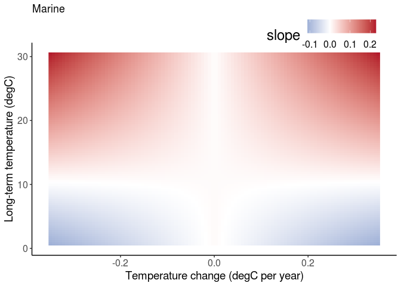<!-- -->

``` r
p2
```

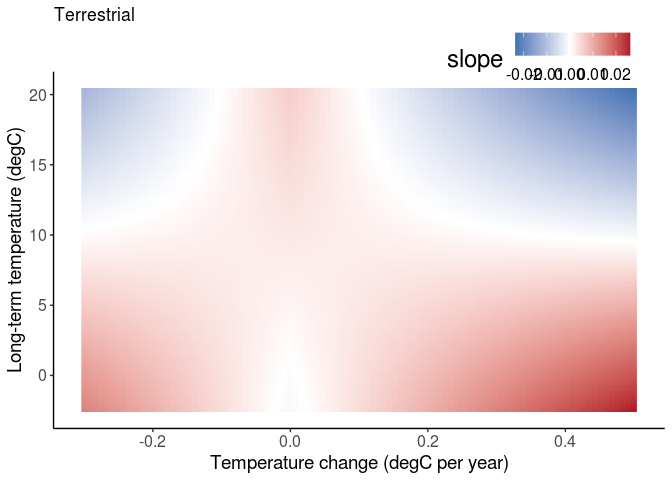<!-- -->

## Fit richness model with mass and human

``` r
modMH0 <- glmmTMB(slope ~ 0 + REALM + mass.sc + human_bowler.sc:REALM 
                 + new_sTempYear:REALM + TempGAMCoef:REALM + TempGAMCoef:new_sTempYear:REALM
                +(0 + TempGAMCoef|REALM/taxa_mod1) +(1|taxa_mod1/STUDY_ID), 
                disp = ~std.error*REALM,
                data = combMHlogS)

summary(modMH0)
```

    ##  Family: gaussian  ( identity )
    ## Formula:          
    ## slope ~ 0 + REALM + mass.sc + human_bowler.sc:REALM + new_sTempYear:REALM +  
    ##     TempGAMCoef:REALM + TempGAMCoef:new_sTempYear:REALM + (0 +  
    ##     TempGAMCoef | REALM/taxa_mod1) + (1 | taxa_mod1/STUDY_ID)
    ## Dispersion:             ~std.error * REALM
    ## Data: combMHlogS
    ## 
    ##       AIC       BIC    logLik  deviance  df.resid 
    ## -241270.7 -241098.3  120654.3 -241308.7     64205 
    ## 
    ## Random effects:
    ## 
    ## Conditional model:
    ##  Groups             Name        Variance  Std.Dev. 
    ##  taxa_mod1:REALM    TempGAMCoef 5.612e-03 0.0749147
    ##  REALM              TempGAMCoef 1.863e-08 0.0001365
    ##  STUDY_ID:taxa_mod1 (Intercept) 6.747e-04 0.0259751
    ##  taxa_mod1          (Intercept) 2.813e-05 0.0053036
    ##  Residual                              NA        NA
    ## Number of obs: 64224, groups:  
    ## taxa_mod1:REALM, 12; REALM, 2; STUDY_ID:taxa_mod1, 150; taxa_mod1, 9
    ## 
    ## Conditional model:
    ##                                              Estimate Std. Error z value
    ## REALMMarine                                 0.0080587  0.0041901   1.923
    ## REALMTerrestrial                            0.0071146  0.0045349   1.569
    ## mass.sc                                     0.0021871  0.0003160   6.922
    ## REALMMarine:human_bowler.sc                -0.0021801  0.0001961 -11.118
    ## REALMTerrestrial:human_bowler.sc            0.0002971  0.0004197   0.708
    ## REALMMarine:new_sTempYear                   0.0035026  0.0003505   9.992
    ## REALMTerrestrial:new_sTempYear              0.0012874  0.0004701   2.739
    ## REALMMarine:TempGAMCoef                     0.1140021  0.0352687   3.232
    ## REALMTerrestrial:TempGAMCoef               -0.0148753  0.0429362  -0.346
    ## REALMMarine:new_sTempYear:TempGAMCoef       0.0821839  0.0068431  12.010
    ## REALMTerrestrial:new_sTempYear:TempGAMCoef -0.0214610  0.0093221  -2.302
    ##                                            Pr(>|z|)    
    ## REALMMarine                                 0.05444 .  
    ## REALMTerrestrial                            0.11668    
    ## mass.sc                                    4.46e-12 ***
    ## REALMMarine:human_bowler.sc                 < 2e-16 ***
    ## REALMTerrestrial:human_bowler.sc            0.47891    
    ## REALMMarine:new_sTempYear                   < 2e-16 ***
    ## REALMTerrestrial:new_sTempYear              0.00617 ** 
    ## REALMMarine:TempGAMCoef                     0.00123 ** 
    ## REALMTerrestrial:TempGAMCoef                0.72900    
    ## REALMMarine:new_sTempYear:TempGAMCoef       < 2e-16 ***
    ## REALMTerrestrial:new_sTempYear:TempGAMCoef  0.02133 *  
    ## ---
    ## Signif. codes:  0 '***' 0.001 '**' 0.01 '*' 0.05 '.' 0.1 ' ' 1
    ## 
    ## Dispersion model:
    ##                            Estimate Std. Error z value Pr(>|z|)    
    ## (Intercept)                -7.88048    0.01082  -728.2   <2e-16 ***
    ## std.error                  39.36340    0.27644   142.4   <2e-16 ***
    ## REALMTerrestrial           -0.62239    0.04176   -14.9   <2e-16 ***
    ## std.error:REALMTerrestrial 27.88436    1.45721    19.1   <2e-16 ***
    ## ---
    ## Signif. codes:  0 '***' 0.001 '**' 0.01 '*' 0.05 '.' 0.1 ' ' 1

``` r
modMHFull <- glmmTMB(slope ~ 0 + REALM + mass.sc + human_bowler.sc:REALM +
                         new_sTempYear:REALM + new_sTempYear:mass.sc + new_sTempYear:human_bowler.sc:REALM + 
                         new_sTempYear:mass.sc:REALM + 
                         TempGAMCoef:REALM + TempGAMCoef:mass.sc + TempGAMCoef:human_bowler.sc:REALM + 
                         TempGAMCoef:mass.sc:REALM + 
                         TempGAMCoef:new_sTempYear:REALM
                     +(0 + TempGAMCoef|REALM/taxa_mod1) +(1|taxa_mod1/STUDY_ID), 
                     disp = ~std.error*REALM,
                     data = combMHlogS)

# modevalsMH <- dredge(modMHFull, evaluate = FALSE) # get the model calls
# length(modevalsMH) # how many to fit?
# modsMH <- mclapply(modevalsMH, eval, mc.cores = 25) # call in parallel
# #saveRDS(modsMH, file = here('temp', 'modsdredgeAntaoMH.rds'))
# 
# cl <- sapply(modsMH, class)
# keep <- which(cl == 'glmmTMB') # those that didn't throw an error
# sum(cl != 'glmmTMB') # 158
# ll <- sapply(modsMH[keep], logLik)
# sum(is.na(ll)) # number that didn't converge. 38
# keep2 <- keep[!is.na(ll)] # find models that converged (non-NA logLik)
# ai <- sapply(modsMH[keep2], AIC)
# sum(is.na(ai)) # no AIC value (0)
# keep3 <- keep2[!is.na(ai)]
# length(keep3)
# 
# modselMH <- model.sel(modsMH[keep3], rank = 'AIC', fit = FALSE)
# modselMH[modselMH$delta < 4,]
# 
# modavgMH <- model.avg(modsMH[keep3])
# summary(modavgMH)
# confint(modavgMH, full = TRUE)
# coefTable(modselMH[1,]) # coefficients from the top model
# importance(modavgMH) # relative variable importance

# a simpler model to capture the main effects
modMH1 <- glmmTMB(slope ~ 0 + REALM + mass.sc:REALM + human_bowler.sc:REALM +
                         new_sTempYear:REALM + new_sTempYear:human_bowler.sc:REALM + 
                         new_sTempYear:mass.sc:REALM + 
                         TempGAMCoef:REALM + TempGAMCoef:human_bowler.sc:REALM + 
                         TempGAMCoef:new_sTempYear:REALM
                     +(0 + TempGAMCoef|REALM/taxa_mod1) +(1|taxa_mod1/STUDY_ID), 
                     disp = ~std.error*REALM,
                     data = combMHlogS)

summary(modMH1)
```

    ##  Family: gaussian  ( identity )
    ## Formula:          
    ## slope ~ 0 + REALM + mass.sc:REALM + human_bowler.sc:REALM + new_sTempYear:REALM +  
    ##     new_sTempYear:human_bowler.sc:REALM + new_sTempYear:mass.sc:REALM +  
    ##     TempGAMCoef:REALM + TempGAMCoef:human_bowler.sc:REALM + TempGAMCoef:new_sTempYear:REALM +  
    ##     (0 + TempGAMCoef | REALM/taxa_mod1) + (1 | taxa_mod1/STUDY_ID)
    ## Dispersion:             ~std.error * REALM
    ## Data: combMHlogS
    ## 
    ##       AIC       BIC    logLik  deviance  df.resid 
    ## -242430.3 -242194.5  121241.2 -242482.3     64198 
    ## 
    ## Random effects:
    ## 
    ## Conditional model:
    ##  Groups             Name        Variance  Std.Dev. 
    ##  taxa_mod1:REALM    TempGAMCoef 7.877e-03 0.0887548
    ##  REALM              TempGAMCoef 2.136e-08 0.0001462
    ##  STUDY_ID:taxa_mod1 (Intercept) 7.544e-04 0.0274655
    ##  taxa_mod1          (Intercept) 2.210e-05 0.0047013
    ##  Residual                              NA        NA
    ## Number of obs: 64224, groups:  
    ## taxa_mod1:REALM, 12; REALM, 2; STUDY_ID:taxa_mod1, 150; taxa_mod1, 9
    ## 
    ## Conditional model:
    ##                                                  Estimate Std. Error z value
    ## REALMMarine                                     7.302e-03  4.251e-03   1.718
    ## REALMTerrestrial                                5.998e-03  5.171e-03   1.160
    ## REALMMarine:mass.sc                             9.419e-04  3.172e-04   2.969
    ## REALMTerrestrial:mass.sc                        2.724e-03  1.975e-03   1.379
    ## REALMMarine:human_bowler.sc                    -1.806e-03  1.962e-04  -9.204
    ## REALMTerrestrial:human_bowler.sc                1.631e-03  5.003e-04   3.260
    ## REALMMarine:new_sTempYear                      -8.824e-05  3.675e-04  -0.240
    ## REALMTerrestrial:new_sTempYear                 -2.648e-03  1.232e-03  -2.148
    ## REALMMarine:TempGAMCoef                         1.255e-01  4.085e-02   3.072
    ## REALMTerrestrial:TempGAMCoef                   -1.155e-02  4.841e-02  -0.239
    ## REALMMarine:human_bowler.sc:new_sTempYear      -3.187e-03  2.038e-04 -15.639
    ## REALMTerrestrial:human_bowler.sc:new_sTempYear  7.555e-04  4.254e-04   1.776
    ## REALMMarine:mass.sc:new_sTempYear               1.050e-02  4.362e-04  24.064
    ## REALMTerrestrial:mass.sc:new_sTempYear         -2.673e-03  9.958e-04  -2.684
    ## REALMMarine:human_bowler.sc:TempGAMCoef        -4.953e-02  4.952e-03 -10.003
    ## REALMTerrestrial:human_bowler.sc:TempGAMCoef   -4.368e-02  8.153e-03  -5.357
    ## REALMMarine:new_sTempYear:TempGAMCoef           5.694e-02  6.884e-03   8.271
    ## REALMTerrestrial:new_sTempYear:TempGAMCoef      2.544e-03  1.039e-02   0.245
    ##                                                Pr(>|z|)    
    ## REALMMarine                                     0.08583 .  
    ## REALMTerrestrial                                0.24605    
    ## REALMMarine:mass.sc                             0.00299 ** 
    ## REALMTerrestrial:mass.sc                        0.16791    
    ## REALMMarine:human_bowler.sc                     < 2e-16 ***
    ## REALMTerrestrial:human_bowler.sc                0.00111 ** 
    ## REALMMarine:new_sTempYear                       0.81023    
    ## REALMTerrestrial:new_sTempYear                  0.03168 *  
    ## REALMMarine:TempGAMCoef                         0.00213 ** 
    ## REALMTerrestrial:TempGAMCoef                    0.81140    
    ## REALMMarine:human_bowler.sc:new_sTempYear       < 2e-16 ***
    ## REALMTerrestrial:human_bowler.sc:new_sTempYear  0.07573 .  
    ## REALMMarine:mass.sc:new_sTempYear               < 2e-16 ***
    ## REALMTerrestrial:mass.sc:new_sTempYear          0.00728 ** 
    ## REALMMarine:human_bowler.sc:TempGAMCoef         < 2e-16 ***
    ## REALMTerrestrial:human_bowler.sc:TempGAMCoef   8.47e-08 ***
    ## REALMMarine:new_sTempYear:TempGAMCoef           < 2e-16 ***
    ## REALMTerrestrial:new_sTempYear:TempGAMCoef      0.80645    
    ## ---
    ## Signif. codes:  0 '***' 0.001 '**' 0.01 '*' 0.05 '.' 0.1 ' ' 1
    ## 
    ## Dispersion model:
    ##                            Estimate Std. Error z value Pr(>|z|)    
    ## (Intercept)                -7.92027    0.01084  -730.7   <2e-16 ***
    ## std.error                  39.98343    0.27705   144.3   <2e-16 ***
    ## REALMTerrestrial           -0.58864    0.04164   -14.1   <2e-16 ***
    ## std.error:REALMTerrestrial 27.14260    1.45125    18.7   <2e-16 ***
    ## ---
    ## Signif. codes:  0 '***' 0.001 '**' 0.01 '*' 0.05 '.' 0.1 ' ' 1

# Fit a Jtu model

## Original

  - Just like the richness model, using Antao predictors, but with Jtu
    slope as the response.
  - Now find LESS turnover at higher temperature in marine (opposite of
    richness and gains slope models).
  - But continue to find MORE turnover with changing temperatures at
    higher average temperatures in marine (the interaction), like the
    richness and gains models.

<!-- end list -->

``` r
# realm-specific intercept. Simplify REs that were near zero.
modJtuAll0 <- glmmTMB(disstrend ~ 0 + REALM + new_sTempYear:REALM + TempGAMCoef:REALM + TempGAMCoef:new_sTempYear:REALM
                +(0 + TempGAMCoef|REALM/taxa_mod1) +(1|taxa_mod1/STUDY_ID),
                disp = ~trendse*REALM,
                data = comb[measure == 'Jtu' & model_id == 'logS_lm',])


summary(modJtuAll0)
```

    ##  Family: gaussian  ( identity )
    ## Formula:          
    ## disstrend ~ 0 + REALM + new_sTempYear:REALM + TempGAMCoef:REALM +  
    ##     TempGAMCoef:new_sTempYear:REALM + (0 + TempGAMCoef | REALM/taxa_mod1) +  
    ##     (1 | taxa_mod1/STUDY_ID)
    ## Dispersion:                 ~trendse * REALM
    ## Data: comb[measure == "Jtu" & model_id == "logS_lm", ]
    ## 
    ##      AIC      BIC   logLik deviance df.resid 
    ## -97068.1 -96940.6  48550.1 -97100.1    21415 
    ## 
    ## Random effects:
    ## 
    ## Conditional model:
    ##  Groups             Name        Variance  Std.Dev. 
    ##  taxa_mod1:REALM    TempGAMCoef 5.580e-04 2.362e-02
    ##  REALM              TempGAMCoef 3.796e-11 6.161e-06
    ##  STUDY_ID:taxa_mod1 (Intercept) 4.732e-05 6.879e-03
    ##  taxa_mod1          (Intercept) 1.318e-10 1.148e-05
    ##  Residual                              NA        NA
    ## Number of obs: 21431, groups:  
    ## taxa_mod1:REALM, 12; REALM, 2; STUDY_ID:taxa_mod1, 156; taxa_mod1, 9
    ## 
    ## Conditional model:
    ##                                              Estimate Std. Error z value
    ## REALMMarine                                 0.0045035  0.0010680   4.217
    ## REALMTerrestrial                            0.0042673  0.0012742   3.349
    ## REALMMarine:new_sTempYear                  -0.0022575  0.0003284  -6.875
    ## REALMTerrestrial:new_sTempYear             -0.0004196  0.0004011  -1.046
    ## REALMMarine:TempGAMCoef                     0.0063384  0.0167759   0.378
    ## REALMTerrestrial:TempGAMCoef                0.0010783  0.0153788   0.070
    ## REALMMarine:new_sTempYear:TempGAMCoef       0.0249304  0.0063157   3.947
    ## REALMTerrestrial:new_sTempYear:TempGAMCoef -0.0004450  0.0062520  -0.071
    ##                                            Pr(>|z|)    
    ## REALMMarine                                2.48e-05 ***
    ## REALMTerrestrial                           0.000811 ***
    ## REALMMarine:new_sTempYear                  6.19e-12 ***
    ## REALMTerrestrial:new_sTempYear             0.295424    
    ## REALMMarine:TempGAMCoef                    0.705560    
    ## REALMTerrestrial:TempGAMCoef               0.944103    
    ## REALMMarine:new_sTempYear:TempGAMCoef      7.90e-05 ***
    ## REALMTerrestrial:new_sTempYear:TempGAMCoef 0.943258    
    ## ---
    ## Signif. codes:  0 '***' 0.001 '**' 0.01 '*' 0.05 '.' 0.1 ' ' 1
    ## 
    ## Dispersion model:
    ##                          Estimate Std. Error z value Pr(>|z|)    
    ## (Intercept)              -8.66309    0.01781  -486.5   <2e-16 ***
    ## trendse                  58.04735    0.63616    91.2   <2e-16 ***
    ## REALMTerrestrial         -0.89936    0.06816   -13.2   <2e-16 ***
    ## trendse:REALMTerrestrial 40.95091    3.58038    11.4   <2e-16 ***
    ## ---
    ## Signif. codes:  0 '***' 0.001 '**' 0.01 '*' 0.05 '.' 0.1 ' ' 1

## abs(temptrend)

AIC selects abs(temptrend). Results are now entirely different than
richness model:

  - less turnover at higher temperatures in marine
  - less turnover at faster temperature change in marine
  - less turnover at higher temperatures per unit temperature change
    (interaction)

<!-- end list -->

``` r
# realm-specific intercept. Simplify REs that were near zero.
modJtuAll1 <- glmmTMB(disstrend ~ 0 + REALM + new_sTempYear:REALM + abs(TempGAMCoef):REALM + abs(TempGAMCoef):new_sTempYear:REALM
                +(0 + abs(TempGAMCoef)|REALM/taxa_mod1) +(1|taxa_mod1/STUDY_ID),
                disp = ~trendse*REALM,
                data = comb[measure == 'Jtu' & model_id == 'logS_lm',])


summary(modJtuAll1)
```

    ##  Family: gaussian  ( identity )
    ## Formula:          
    ## disstrend ~ 0 + REALM + new_sTempYear:REALM + abs(TempGAMCoef):REALM +  
    ##     abs(TempGAMCoef):new_sTempYear:REALM + (0 + abs(TempGAMCoef) |  
    ##     REALM/taxa_mod1) + (1 | taxa_mod1/STUDY_ID)
    ## Dispersion:                 ~trendse * REALM
    ## Data: comb[measure == "Jtu" & model_id == "logS_lm", ]
    ## 
    ##      AIC      BIC   logLik deviance df.resid 
    ## -97076.8 -96949.3  48554.4 -97108.8    21415 
    ## 
    ## Random effects:
    ## 
    ## Conditional model:
    ##  Groups             Name             Variance  Std.Dev. 
    ##  taxa_mod1:REALM    abs(TempGAMCoef) 1.517e-03 3.895e-02
    ##  REALM              abs(TempGAMCoef) 1.410e-09 3.755e-05
    ##  STUDY_ID:taxa_mod1 (Intercept)      4.920e-05 7.014e-03
    ##  taxa_mod1          (Intercept)      1.657e-06 1.287e-03
    ##  Residual                                   NA        NA
    ## Number of obs: 21431, groups:  
    ## taxa_mod1:REALM, 12; REALM, 2; STUDY_ID:taxa_mod1, 156; taxa_mod1, 9
    ## 
    ## Conditional model:
    ##                                                   Estimate Std. Error z value
    ## REALMMarine                                      0.0040229  0.0013390   3.004
    ## REALMTerrestrial                                 0.0036259  0.0018737   1.935
    ## REALMMarine:new_sTempYear                       -0.0012752  0.0003836  -3.324
    ## REALMTerrestrial:new_sTempYear                  -0.0002853  0.0004512  -0.632
    ## REALMMarine:abs(TempGAMCoef)                    -0.0014064  0.0240361  -0.059
    ## REALMTerrestrial:abs(TempGAMCoef)                0.0049309  0.0231818   0.213
    ## REALMMarine:new_sTempYear:abs(TempGAMCoef)      -0.0223005  0.0086699  -2.572
    ## REALMTerrestrial:new_sTempYear:abs(TempGAMCoef) -0.0033484  0.0076569  -0.437
    ##                                                 Pr(>|z|)    
    ## REALMMarine                                     0.002661 ** 
    ## REALMTerrestrial                                0.052974 .  
    ## REALMMarine:new_sTempYear                       0.000888 ***
    ## REALMTerrestrial:new_sTempYear                  0.527288    
    ## REALMMarine:abs(TempGAMCoef)                    0.953341    
    ## REALMTerrestrial:abs(TempGAMCoef)               0.831556    
    ## REALMMarine:new_sTempYear:abs(TempGAMCoef)      0.010106 *  
    ## REALMTerrestrial:new_sTempYear:abs(TempGAMCoef) 0.661892    
    ## ---
    ## Signif. codes:  0 '***' 0.001 '**' 0.01 '*' 0.05 '.' 0.1 ' ' 1
    ## 
    ## Dispersion model:
    ##                          Estimate Std. Error z value Pr(>|z|)    
    ## (Intercept)              -8.66249    0.01779  -486.8   <2e-16 ***
    ## trendse                  57.98815    0.63570    91.2   <2e-16 ***
    ## REALMTerrestrial         -0.90139    0.06810   -13.2   <2e-16 ***
    ## trendse:REALMTerrestrial 40.98344    3.57399    11.5   <2e-16 ***
    ## ---
    ## Signif. codes:  0 '***' 0.001 '**' 0.01 '*' 0.05 '.' 0.1 ' ' 1

``` r
AIC(modJtuAll0)
```

    ## [1] -97068.15

``` r
AIC(modJtuAll1)
```

    ## [1] -97076.85

## 5-year standardized duration

  - Only for datasets of exactly 5 consecutive years
  - Only realm intercepts are significantly different from zero

<!-- end list -->

``` r
modJtu5 <- glmmTMB(disstrend ~ 0 + REALM + new_sTempYear:REALM + TempGAMCoef:REALM + TempGAMCoef:new_sTempYear:REALM
                +(0 + TempGAMCoef|REALM/taxa_mod1) +(1|taxa_mod1/STUDY_ID),
                disp = ~trendse*REALM,
                data = comb5[measure == 'Jtu',])


summary(modJtu5)
```

    ##  Family: gaussian  ( identity )
    ## Formula:          
    ## disstrend ~ 0 + REALM + new_sTempYear:REALM + TempGAMCoef:REALM +  
    ##     TempGAMCoef:new_sTempYear:REALM + (0 + TempGAMCoef | REALM/taxa_mod1) +  
    ##     (1 | taxa_mod1/STUDY_ID)
    ## Dispersion:                 ~trendse * REALM
    ## Data: comb5[measure == "Jtu", ]
    ## 
    ##      AIC      BIC   logLik deviance df.resid 
    ## -15382.0 -15277.1   7707.0 -15414.0     5190 
    ## 
    ## Random effects:
    ## 
    ## Conditional model:
    ##  Groups             Name        Variance  Std.Dev. 
    ##  taxa_mod1:REALM    TempGAMCoef 3.218e-10 1.794e-05
    ##  REALM              TempGAMCoef 8.022e-13 8.957e-07
    ##  STUDY_ID:taxa_mod1 (Intercept) 2.592e-05 5.091e-03
    ##  taxa_mod1          (Intercept) 1.016e-12 1.008e-06
    ##  Residual                              NA        NA
    ## Number of obs: 5206, groups:  
    ## taxa_mod1:REALM, 12; REALM, 2; STUDY_ID:taxa_mod1, 118; taxa_mod1, 9
    ## 
    ## Conditional model:
    ##                                              Estimate Std. Error z value
    ## REALMMarine                                 0.0089692  0.0014916   6.013
    ## REALMTerrestrial                            0.0060183  0.0021027   2.862
    ## REALMMarine:new_sTempYear                  -0.0014879  0.0015672  -0.949
    ## REALMTerrestrial:new_sTempYear             -0.0007052  0.0009760  -0.723
    ## REALMMarine:TempGAMCoef                     0.0208189  0.0246711   0.844
    ## REALMTerrestrial:TempGAMCoef                0.0278346  0.0195401   1.424
    ## REALMMarine:new_sTempYear:TempGAMCoef      -0.0219895  0.0298209  -0.737
    ## REALMTerrestrial:new_sTempYear:TempGAMCoef -0.0068996  0.0181757  -0.380
    ##                                            Pr(>|z|)    
    ## REALMMarine                                1.82e-09 ***
    ## REALMTerrestrial                            0.00421 ** 
    ## REALMMarine:new_sTempYear                   0.34240    
    ## REALMTerrestrial:new_sTempYear              0.46998    
    ## REALMMarine:TempGAMCoef                     0.39875    
    ## REALMTerrestrial:TempGAMCoef                0.15431    
    ## REALMMarine:new_sTempYear:TempGAMCoef       0.46089    
    ## REALMTerrestrial:new_sTempYear:TempGAMCoef  0.70424    
    ## ---
    ## Signif. codes:  0 '***' 0.001 '**' 0.01 '*' 0.05 '.' 0.1 ' ' 1
    ## 
    ## Dispersion model:
    ##                          Estimate Std. Error z value Pr(>|z|)    
    ## (Intercept)              -7.17822    0.05146 -139.48   <2e-16 ***
    ## trendse                  25.94403    0.73595   35.25   <2e-16 ***
    ## REALMTerrestrial         -1.33907    0.09990  -13.40   <2e-16 ***
    ## trendse:REALMTerrestrial 24.11937    2.53954    9.50   <2e-16 ***
    ## ---
    ## Signif. codes:  0 '***' 0.001 '**' 0.01 '*' 0.05 '.' 0.1 ' ' 1

# Fit a Jbeta model

## Original

  - Much like the richness model, using Antao predictors, but with Jbeta
    slope as the response. Dropped the REALM random slope to allow
    convergence.
  - Positive temp:temptrend interaction, just like richness and gains
    models.

<!-- end list -->

``` r
# realm-specific intercept. Simplify REs that were near zero.
modJbetaAll0 <- glmmTMB(disstrend ~ 0 + REALM + new_sTempYear:REALM + TempGAMCoef:REALM + TempGAMCoef:new_sTempYear:REALM
                +(0 + TempGAMCoef|REALM:taxa_mod1) +(1|taxa_mod1/STUDY_ID),
                disp = ~trendse*REALM,
                data = comb[measure == 'Jbeta' & model_id == 'logS_lm',])


summary(modJbetaAll0)
```

    ##  Family: gaussian  ( identity )
    ## Formula:          
    ## disstrend ~ 0 + REALM + new_sTempYear:REALM + TempGAMCoef:REALM +  
    ##     TempGAMCoef:new_sTempYear:REALM + (0 + TempGAMCoef | REALM:taxa_mod1) +  
    ##     (1 | taxa_mod1/STUDY_ID)
    ## Dispersion:                 ~trendse * REALM
    ## Data: comb[measure == "Jbeta" & model_id == "logS_lm", ]
    ## 
    ##       AIC       BIC    logLik  deviance  df.resid 
    ## -117555.1 -117435.5   58792.5 -117585.1     21416 
    ## 
    ## Random effects:
    ## 
    ## Conditional model:
    ##  Groups             Name        Variance  Std.Dev.
    ##  REALM:taxa_mod1    TempGAMCoef 2.581e-04 0.016065
    ##  STUDY_ID:taxa_mod1 (Intercept) 2.311e-05 0.004807
    ##  taxa_mod1          (Intercept) 1.029e-06 0.001014
    ##  Residual                              NA       NA
    ## Number of obs: 21431, groups:  
    ## REALM:taxa_mod1, 12; STUDY_ID:taxa_mod1, 156; taxa_mod1, 9
    ## 
    ## Conditional model:
    ##                                              Estimate Std. Error z value
    ## REALMMarine                                 0.0041589  0.0009746   4.267
    ## REALMTerrestrial                            0.0042168  0.0011563   3.647
    ## REALMMarine:new_sTempYear                  -0.0024359  0.0002200 -11.070
    ## REALMTerrestrial:new_sTempYear              0.0001468  0.0003610   0.407
    ## REALMMarine:TempGAMCoef                     0.0018585  0.0097071   0.191
    ## REALMTerrestrial:TempGAMCoef               -0.0071382  0.0127562  -0.560
    ## REALMMarine:new_sTempYear:TempGAMCoef       0.0192254  0.0043702   4.399
    ## REALMTerrestrial:new_sTempYear:TempGAMCoef -0.0066322  0.0072044  -0.921
    ##                                            Pr(>|z|)    
    ## REALMMarine                                1.98e-05 ***
    ## REALMTerrestrial                           0.000266 ***
    ## REALMMarine:new_sTempYear                   < 2e-16 ***
    ## REALMTerrestrial:new_sTempYear             0.684280    
    ## REALMMarine:TempGAMCoef                    0.848170    
    ## REALMTerrestrial:TempGAMCoef               0.575762    
    ## REALMMarine:new_sTempYear:TempGAMCoef      1.09e-05 ***
    ## REALMTerrestrial:new_sTempYear:TempGAMCoef 0.357269    
    ## ---
    ## Signif. codes:  0 '***' 0.001 '**' 0.01 '*' 0.05 '.' 0.1 ' ' 1
    ## 
    ## Dispersion model:
    ##                          Estimate Std. Error z value Pr(>|z|)    
    ## (Intercept)              -9.65776    0.01792  -539.1  < 2e-16 ***
    ## trendse                  96.86530    1.07482    90.1  < 2e-16 ***
    ## REALMTerrestrial         -0.27353    0.06760    -4.0 5.20e-05 ***
    ## trendse:REALMTerrestrial 29.92835    4.70782     6.4 2.06e-10 ***
    ## ---
    ## Signif. codes:  0 '***' 0.001 '**' 0.01 '*' 0.05 '.' 0.1 ' ' 1

## abs(temptrend)

Results are now entirely different than richness model:

  - Strongly selects abs(temptrend) over temptrend
  - less turnover at higher temperatures in marine
  - less turnover at faster temperature change in marine
  - less turnover at higher temperatures per unit temperature change
    (interaction)

<!-- end list -->

``` r
# realm-specific intercept. Simplify REs that were near zero.
modJbetaAll1 <- glmmTMB(disstrend ~ 0 + REALM + new_sTempYear:REALM + abs(TempGAMCoef):REALM + abs(TempGAMCoef):new_sTempYear:REALM
                +(0 + abs(TempGAMCoef)|REALM:taxa_mod1) +(1|taxa_mod1/STUDY_ID),
                disp = ~trendse*REALM,
                data = comb[measure == 'Jbeta' & model_id == 'logS_lm',])


summary(modJbetaAll1)
```

    ##  Family: gaussian  ( identity )
    ## Formula:          
    ## disstrend ~ 0 + REALM + new_sTempYear:REALM + abs(TempGAMCoef):REALM +  
    ##     abs(TempGAMCoef):new_sTempYear:REALM + (0 + abs(TempGAMCoef) |  
    ##     REALM:taxa_mod1) + (1 | taxa_mod1/STUDY_ID)
    ## Dispersion:                 ~trendse * REALM
    ## Data: comb[measure == "Jbeta" & model_id == "logS_lm", ]
    ## 
    ##       AIC       BIC    logLik  deviance  df.resid 
    ## -117590.6 -117471.0   58810.3 -117620.6     21416 
    ## 
    ## Random effects:
    ## 
    ## Conditional model:
    ##  Groups             Name             Variance  Std.Dev. 
    ##  REALM:taxa_mod1    abs(TempGAMCoef) 3.050e-04 0.0174654
    ##  STUDY_ID:taxa_mod1 (Intercept)      2.126e-05 0.0046108
    ##  taxa_mod1          (Intercept)      5.136e-07 0.0007167
    ##  Residual                                   NA        NA
    ## Number of obs: 21431, groups:  
    ## REALM:taxa_mod1, 12; STUDY_ID:taxa_mod1, 156; taxa_mod1, 9
    ## 
    ## Conditional model:
    ##                                                   Estimate Std. Error z value
    ## REALMMarine                                      0.0040586  0.0008518   4.765
    ## REALMTerrestrial                                 0.0032818  0.0012725   2.579
    ## REALMMarine:new_sTempYear                       -0.0014424  0.0002530  -5.701
    ## REALMTerrestrial:new_sTempYear                   0.0002049  0.0004230   0.485
    ## REALMMarine:abs(TempGAMCoef)                    -0.0052449  0.0117942  -0.445
    ## REALMTerrestrial:abs(TempGAMCoef)                0.0179275  0.0143518   1.249
    ## REALMMarine:new_sTempYear:abs(TempGAMCoef)      -0.0298987  0.0057680  -5.184
    ## REALMTerrestrial:new_sTempYear:abs(TempGAMCoef) -0.0037502  0.0086606  -0.433
    ##                                                 Pr(>|z|)    
    ## REALMMarine                                     1.89e-06 ***
    ## REALMTerrestrial                                 0.00991 ** 
    ## REALMMarine:new_sTempYear                       1.19e-08 ***
    ## REALMTerrestrial:new_sTempYear                   0.62800    
    ## REALMMarine:abs(TempGAMCoef)                     0.65654    
    ## REALMTerrestrial:abs(TempGAMCoef)                0.21161    
    ## REALMMarine:new_sTempYear:abs(TempGAMCoef)      2.18e-07 ***
    ## REALMTerrestrial:new_sTempYear:abs(TempGAMCoef)  0.66500    
    ## ---
    ## Signif. codes:  0 '***' 0.001 '**' 0.01 '*' 0.05 '.' 0.1 ' ' 1
    ## 
    ## Dispersion model:
    ##                          Estimate Std. Error z value Pr(>|z|)    
    ## (Intercept)              -9.65953    0.01791  -539.3  < 2e-16 ***
    ## trendse                  96.88782    1.07455    90.2  < 2e-16 ***
    ## REALMTerrestrial         -0.26815    0.06750    -4.0 7.11e-05 ***
    ## trendse:REALMTerrestrial 29.66472    4.70044     6.3 2.77e-10 ***
    ## ---
    ## Signif. codes:  0 '***' 0.001 '**' 0.01 '*' 0.05 '.' 0.1 ' ' 1

``` r
AIC(modJbetaAll0)
```

    ## [1] -117555.1

``` r
AIC(modJbetaAll1)
```

    ## [1] -117590.6

## 5-year standardized duration

  - Only for datasets of exactly 5 consecutive years
  - Had to drop the random slopes to allow convergence (were very close
    to 0)
  - Only realm intercepts are significantly different from zero

<!-- end list -->

``` r
modJbeta5 <- glmmTMB(disstrend ~ 0 + REALM + new_sTempYear:REALM + TempGAMCoef:REALM + TempGAMCoef:new_sTempYear:REALM
                 +(1|taxa_mod1/STUDY_ID),
                disp = ~trendse*REALM,
                data = comb5[measure == 'Jbeta',])


summary(modJbeta5)
```

    ##  Family: gaussian  ( identity )
    ## Formula:          
    ## disstrend ~ 0 + REALM + new_sTempYear:REALM + TempGAMCoef:REALM +  
    ##     TempGAMCoef:new_sTempYear:REALM + (1 | taxa_mod1/STUDY_ID)
    ## Dispersion:                 ~trendse * REALM
    ## Data: comb5[measure == "Jbeta", ]
    ## 
    ##      AIC      BIC   logLik deviance df.resid 
    ## -18332.0 -18240.2   9180.0 -18360.0     5192 
    ## 
    ## Random effects:
    ## 
    ## Conditional model:
    ##  Groups             Name        Variance  Std.Dev. 
    ##  STUDY_ID:taxa_mod1 (Intercept) 4.922e-05 7.016e-03
    ##  taxa_mod1          (Intercept) 4.125e-12 2.031e-06
    ##  Residual                              NA        NA
    ## Number of obs: 5206, groups:  STUDY_ID:taxa_mod1, 118; taxa_mod1, 9
    ## 
    ## Conditional model:
    ##                                              Estimate Std. Error z value
    ## REALMMarine                                 0.0112185  0.0015447   7.263
    ## REALMTerrestrial                            0.0153595  0.0022571   6.805
    ## REALMMarine:new_sTempYear                   0.0005050  0.0014314   0.353
    ## REALMTerrestrial:new_sTempYear             -0.0008311  0.0008320  -0.999
    ## REALMMarine:TempGAMCoef                    -0.0190415  0.0193450  -0.984
    ## REALMTerrestrial:TempGAMCoef                0.0078781  0.0188401   0.418
    ## REALMMarine:new_sTempYear:TempGAMCoef      -0.0282676  0.0247224  -1.143
    ## REALMTerrestrial:new_sTempYear:TempGAMCoef  0.0029120  0.0152813   0.191
    ##                                            Pr(>|z|)    
    ## REALMMarine                                3.80e-13 ***
    ## REALMTerrestrial                           1.01e-11 ***
    ## REALMMarine:new_sTempYear                     0.724    
    ## REALMTerrestrial:new_sTempYear                0.318    
    ## REALMMarine:TempGAMCoef                       0.325    
    ## REALMTerrestrial:TempGAMCoef                  0.676    
    ## REALMMarine:new_sTempYear:TempGAMCoef         0.253    
    ## REALMTerrestrial:new_sTempYear:TempGAMCoef    0.849    
    ## ---
    ## Signif. codes:  0 '***' 0.001 '**' 0.01 '*' 0.05 '.' 0.1 ' ' 1
    ## 
    ## Dispersion model:
    ##                          Estimate Std. Error z value Pr(>|z|)    
    ## (Intercept)              -7.70755    0.05465 -141.02  < 2e-16 ***
    ## trendse                  34.03862    1.10082   30.92  < 2e-16 ***
    ## REALMTerrestrial         -1.14642    0.10462  -10.96  < 2e-16 ***
    ## trendse:REALMTerrestrial 24.37130    3.18445    7.65 1.96e-14 ***
    ## ---
    ## Signif. codes:  0 '***' 0.001 '**' 0.01 '*' 0.05 '.' 0.1 ' ' 1

# Fit a Horn model

## Original

  - Like the richness model, using Antao predictors, but with Horn slope
    as the response. Had to drop the REALM random slope to allow
    convergence.
  - Now find LESS turnover at higher temperature in marine (opposite of
    richness and gains slope models).
  - Find more turnover with changing temperatures at higher average
    temperatures in TERRESTRIAL (the interaction), not marine. Not like
    the richness and gains models.

<!-- end list -->

``` r
# realm-specific intercept. Simplify REs that were near zero.
modHornAll0 <- glmmTMB(disstrend ~ 0 + REALM + new_sTempYear:REALM + TempGAMCoef:REALM + TempGAMCoef:new_sTempYear:REALM
                +(0 + TempGAMCoef|taxa_mod1) +(1|taxa_mod1/STUDY_ID),
                disp = ~trendse*REALM,
                data = comb[measure == 'Horn' & model_id == 'logS_lm',])


summary(modHornAll0)
```

    ##  Family: gaussian  ( identity )
    ## Formula:          
    ## disstrend ~ 0 + REALM + new_sTempYear:REALM + TempGAMCoef:REALM +  
    ##     TempGAMCoef:new_sTempYear:REALM + (0 + TempGAMCoef | taxa_mod1) +  
    ##     (1 | taxa_mod1/STUDY_ID)
    ## Dispersion:                 ~trendse * REALM
    ## Data: comb[measure == "Horn" & model_id == "logS_lm", ]
    ## 
    ##       AIC       BIC    logLik  deviance  df.resid 
    ## -100473.3 -100353.7   50251.6 -100503.3     21416 
    ## 
    ## Random effects:
    ## 
    ## Conditional model:
    ##  Groups             Name        Variance  Std.Dev. 
    ##  taxa_mod1          TempGAMCoef 8.691e-03 9.323e-02
    ##  STUDY_ID.taxa_mod1 (Intercept) 4.971e-05 7.050e-03
    ##  taxa_mod1.1        (Intercept) 1.543e-10 1.242e-05
    ##  Residual                              NA        NA
    ## Number of obs: 21431, groups:  taxa_mod1, 9; STUDY_ID:taxa_mod1, 156
    ## 
    ## Conditional model:
    ##                                              Estimate Std. Error z value
    ## REALMMarine                                 0.0069144  0.0010682   6.473
    ## REALMTerrestrial                            0.0093270  0.0013926   6.698
    ## REALMMarine:new_sTempYear                  -0.0024405  0.0002924  -8.346
    ## REALMTerrestrial:new_sTempYear              0.0002686  0.0004691   0.573
    ## REALMMarine:TempGAMCoef                    -0.0208165  0.0335391  -0.621
    ## REALMTerrestrial:TempGAMCoef               -0.0295028  0.0337101  -0.875
    ## REALMMarine:new_sTempYear:TempGAMCoef       0.0066097  0.0056677   1.166
    ## REALMTerrestrial:new_sTempYear:TempGAMCoef  0.0226276  0.0082169   2.754
    ##                                            Pr(>|z|)    
    ## REALMMarine                                9.61e-11 ***
    ## REALMTerrestrial                           2.12e-11 ***
    ## REALMMarine:new_sTempYear                   < 2e-16 ***
    ## REALMTerrestrial:new_sTempYear              0.56693    
    ## REALMMarine:TempGAMCoef                     0.53482    
    ## REALMTerrestrial:TempGAMCoef                0.38147    
    ## REALMMarine:new_sTempYear:TempGAMCoef       0.24353    
    ## REALMTerrestrial:new_sTempYear:TempGAMCoef  0.00589 ** 
    ## ---
    ## Signif. codes:  0 '***' 0.001 '**' 0.01 '*' 0.05 '.' 0.1 ' ' 1
    ## 
    ## Dispersion model:
    ##                          Estimate Std. Error z value Pr(>|z|)    
    ## (Intercept)              -8.92534    0.01862  -479.3  < 2e-16 ***
    ## trendse                  69.41509    0.76785    90.4  < 2e-16 ***
    ## REALMTerrestrial         -0.33615    0.06649    -5.1 4.29e-07 ***
    ## trendse:REALMTerrestrial 15.45761    3.26776     4.7 2.24e-06 ***
    ## ---
    ## Signif. codes:  0 '***' 0.001 '**' 0.01 '*' 0.05 '.' 0.1 ' ' 1

## abs(temptrend)

AIC selects temptrend instead of abs(temptrend). Results are entirely
different than richness model:

  - LESS turnover at higher temperatures in marine
  - LESS turnover at higher temperatures per unit temperature change in
    marine (interaction)
  - more turnover per unit temperature change in TERRESTRIAL

<!-- end list -->

``` r
# realm-specific intercept. Simplify REs that were near zero.
modHornAll1 <- glmmTMB(disstrend ~ 0 + REALM + new_sTempYear:REALM + abs(TempGAMCoef):REALM + abs(TempGAMCoef):new_sTempYear:REALM
                +(0 + abs(TempGAMCoef)|taxa_mod1) +(1|taxa_mod1/STUDY_ID),
                disp = ~trendse*REALM,
                data = comb[measure == 'Horn' & model_id == 'logS_lm',])


summary(modHornAll1)
```

    ##  Family: gaussian  ( identity )
    ## Formula:          
    ## disstrend ~ 0 + REALM + new_sTempYear:REALM + abs(TempGAMCoef):REALM +  
    ##     abs(TempGAMCoef):new_sTempYear:REALM + (0 + abs(TempGAMCoef) |  
    ##     taxa_mod1) + (1 | taxa_mod1/STUDY_ID)
    ## Dispersion:                 ~trendse * REALM
    ## Data: comb[measure == "Horn" & model_id == "logS_lm", ]
    ## 
    ##       AIC       BIC    logLik  deviance  df.resid 
    ## -100453.8 -100334.2   50241.9 -100483.8     21416 
    ## 
    ## Random effects:
    ## 
    ## Conditional model:
    ##  Groups             Name             Variance  Std.Dev. 
    ##  taxa_mod1          abs(TempGAMCoef) 1.950e-10 1.397e-05
    ##  STUDY_ID.taxa_mod1 (Intercept)      4.752e-05 6.893e-03
    ##  taxa_mod1.1        (Intercept)      1.401e-11 3.743e-06
    ##  Residual                                   NA        NA
    ## Number of obs: 21431, groups:  taxa_mod1, 9; STUDY_ID:taxa_mod1, 156
    ## 
    ## Conditional model:
    ##                                                   Estimate Std. Error z value
    ## REALMMarine                                      0.0066964  0.0010680   6.270
    ## REALMTerrestrial                                 0.0079134  0.0014667   5.395
    ## REALMMarine:new_sTempYear                       -0.0019012  0.0003312  -5.741
    ## REALMTerrestrial:new_sTempYear                   0.0007071  0.0005482   1.290
    ## REALMMarine:abs(TempGAMCoef)                    -0.0035350  0.0051827  -0.682
    ## REALMTerrestrial:abs(TempGAMCoef)                0.0251862  0.0104743   2.405
    ## REALMMarine:new_sTempYear:abs(TempGAMCoef)      -0.0180142  0.0068669  -2.623
    ## REALMTerrestrial:new_sTempYear:abs(TempGAMCoef)  0.0035964  0.0095985   0.375
    ##                                                 Pr(>|z|)    
    ## REALMMarine                                     3.62e-10 ***
    ## REALMTerrestrial                                6.83e-08 ***
    ## REALMMarine:new_sTempYear                       9.43e-09 ***
    ## REALMTerrestrial:new_sTempYear                   0.19705    
    ## REALMMarine:abs(TempGAMCoef)                     0.49520    
    ## REALMTerrestrial:abs(TempGAMCoef)                0.01619 *  
    ## REALMMarine:new_sTempYear:abs(TempGAMCoef)       0.00871 ** 
    ## REALMTerrestrial:new_sTempYear:abs(TempGAMCoef)  0.70790    
    ## ---
    ## Signif. codes:  0 '***' 0.001 '**' 0.01 '*' 0.05 '.' 0.1 ' ' 1
    ## 
    ## Dispersion model:
    ##                          Estimate Std. Error z value Pr(>|z|)    
    ## (Intercept)              -8.92372    0.01861  -479.4  < 2e-16 ***
    ## trendse                  69.39584    0.76750    90.4  < 2e-16 ***
    ## REALMTerrestrial         -0.31049    0.06671    -4.7 3.25e-06 ***
    ## trendse:REALMTerrestrial 14.85867    3.26613     4.5 5.38e-06 ***
    ## ---
    ## Signif. codes:  0 '***' 0.001 '**' 0.01 '*' 0.05 '.' 0.1 ' ' 1

``` r
AIC(modHornAll0)
```

    ## [1] -100473.3

``` r
AIC(modHornAll1)
```

    ## [1] -100453.8

## 5-year standardized duration

  - Only for datasets of exactly 5 consecutive years. Removed random
    slope to allow convergence (was close to 0)
  - Only realm intercepts are significantly different from zero

<!-- end list -->

``` r
modHorn5 <- glmmTMB(disstrend ~ 0 + REALM + new_sTempYear:REALM + TempGAMCoef:REALM + TempGAMCoef:new_sTempYear:REALM
                +(1|taxa_mod1/STUDY_ID),
                disp = ~trendse*REALM,
                data = comb5[measure == 'Horn',])


summary(modHorn5)
```

    ##  Family: gaussian  ( identity )
    ## Formula:          
    ## disstrend ~ 0 + REALM + new_sTempYear:REALM + TempGAMCoef:REALM +  
    ##     TempGAMCoef:new_sTempYear:REALM + (1 | taxa_mod1/STUDY_ID)
    ## Dispersion:                 ~trendse * REALM
    ## Data: comb5[measure == "Horn", ]
    ## 
    ##      AIC      BIC   logLik deviance df.resid 
    ## -15330.1 -15238.3   7679.1 -15358.1     5192 
    ## 
    ## Random effects:
    ## 
    ## Conditional model:
    ##  Groups             Name        Variance  Std.Dev. 
    ##  STUDY_ID:taxa_mod1 (Intercept) 3.304e-05 5.748e-03
    ##  taxa_mod1          (Intercept) 1.699e-11 4.122e-06
    ##  Residual                              NA        NA
    ## Number of obs: 5206, groups:  STUDY_ID:taxa_mod1, 118; taxa_mod1, 9
    ## 
    ## Conditional model:
    ##                                              Estimate Std. Error z value
    ## REALMMarine                                 1.053e-02  1.619e-03   6.502
    ## REALMTerrestrial                            9.426e-03  1.842e-03   5.116
    ## REALMMarine:new_sTempYear                  -6.407e-05  1.434e-03  -0.045
    ## REALMTerrestrial:new_sTempYear             -3.843e-04  6.748e-04  -0.570
    ## REALMMarine:TempGAMCoef                     3.592e-03  2.535e-02   0.142
    ## REALMTerrestrial:TempGAMCoef               -1.039e-02  1.510e-02  -0.688
    ## REALMMarine:new_sTempYear:TempGAMCoef      -4.331e-02  2.786e-02  -1.554
    ## REALMTerrestrial:new_sTempYear:TempGAMCoef  1.235e-02  1.164e-02   1.061
    ##                                            Pr(>|z|)    
    ## REALMMarine                                7.92e-11 ***
    ## REALMTerrestrial                           3.11e-07 ***
    ## REALMMarine:new_sTempYear                     0.964    
    ## REALMTerrestrial:new_sTempYear                0.569    
    ## REALMMarine:TempGAMCoef                       0.887    
    ## REALMTerrestrial:TempGAMCoef                  0.492    
    ## REALMMarine:new_sTempYear:TempGAMCoef         0.120    
    ## REALMTerrestrial:new_sTempYear:TempGAMCoef    0.289    
    ## ---
    ## Signif. codes:  0 '***' 0.001 '**' 0.01 '*' 0.05 '.' 0.1 ' ' 1
    ## 
    ## Dispersion model:
    ##                          Estimate Std. Error z value Pr(>|z|)    
    ## (Intercept)              -7.37527    0.05116 -144.16   <2e-16 ***
    ## trendse                  29.25825    0.70189   41.68   <2e-16 ***
    ## REALMTerrestrial         -1.71438    0.10100  -16.97   <2e-16 ***
    ## trendse:REALMTerrestrial 34.30838    2.89280   11.86   <2e-16 ***
    ## ---
    ## Signif. codes:  0 '***' 0.001 '**' 0.01 '*' 0.05 '.' 0.1 ' ' 1
