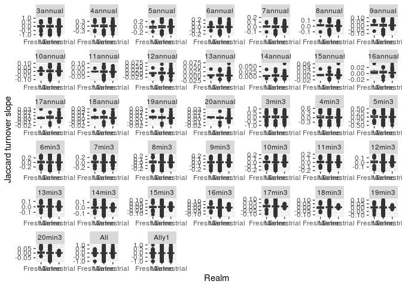

Dissimilarity slope covariate data prep and visualization
================

Uses slope of dissimilarity vs. time from calc\_turnover.Rmd.

``` r
if(Sys.info()['nodename'] == 'annotate.sebs.rutgers.edu'){
  library('mgcv', lib.loc = '/usr/lib64/R/library') # when running on Annotate. Need to load 1.8-26, not 1.8-33.
} else {
  library('mgcv')
}
```

    ## Loading required package: nlme

    ## This is mgcv 1.8-26. For overview type 'help("mgcv-package")'.

``` r
library(data.table)
library(ggplot2)
library(beanplot) # for beanplots
library(gridExtra) # to combine ggplots together
library(grid) # to combine ggplots together
require(scales) # for custom axis scales
```

    ## Loading required package: scales

``` r
require(here)
```

    ## Loading required package: here

    ## here() starts at /local/home/malinp/climate_community_crossrealm

``` r
#knitr::opts_knit$set(root.dir = rprojroot::find_rstudio_root_file()) # tell RStudio to use project root directory as the root for this notebook. Needed since we are storing code in a separate directory.

signedsqrt_trans <- function() trans_new('signedsqrt', 
                                         transform = function(x) sign(x)*sqrt(abs(x)), 
                                         inverse = function(x) sign(x)*x^2)
```

# Load data

## Add covariates to BT data

## Set up useful variables and transformations

## Write out

Only if file doesn’t yet exist

# Check variable distributions

## Response variables

``` r
bt[measure =='Jbeta' & duration_group == '3annual', summary(disstrend)]
```

    ##     Min.  1st Qu.   Median     Mean  3rd Qu.     Max. 
    ## -1.00000 -0.05281  0.01686  0.01593  0.12500  0.65233

``` r
bt[measure =='Jtu' & duration_group == '3annual', summary(disstrend)]
```

    ##      Min.   1st Qu.    Median      Mean   3rd Qu.      Max. 
    ## -1.000000 -0.090909  0.000000  0.009279  0.125000  1.000000

``` r
bt[measure =='Horn' & duration_group == '3annual', summary(disstrend)]
```

    ##      Min.   1st Qu.    Median      Mean   3rd Qu.      Max. 
    ## -1.000000 -0.053038  0.008022  0.013440  0.146263  0.999840

``` r
bt[measure =='Jbeta' & duration_group == '5annual', summary(disstrend)]
```

    ##      Min.   1st Qu.    Median      Mean   3rd Qu.      Max. 
    ## -0.200000 -0.012143  0.009675  0.011777  0.040000  0.225000

``` r
bt[measure =='Jtu' & duration_group == '5annual', summary(disstrend)]
```

    ##      Min.   1st Qu.    Median      Mean   3rd Qu.      Max. 
    ## -0.285000 -0.025573  0.001921  0.008937  0.044046  0.321702

``` r
bt[measure =='Horn' & duration_group == '5annual', summary(disstrend)]
```

    ##      Min.   1st Qu.    Median      Mean   3rd Qu.      Max. 
    ## -0.299190 -0.022781  0.002998  0.012476  0.044678  0.289490

``` r
bt[measure =='Jbeta' & duration_group == '10annual', summary(disstrend)]
```

    ##       Min.    1st Qu.     Median       Mean    3rd Qu.       Max. 
    ## -0.0318462  0.0002437  0.0061117  0.0080019  0.0141771  0.0958410

``` r
bt[measure =='Jtu' & duration_group == '10annual', summary(disstrend)]
```

    ##      Min.   1st Qu.    Median      Mean   3rd Qu.      Max. 
    ## -0.106219 -0.003764  0.003557  0.004156  0.013030  0.097424

``` r
bt[measure =='Horn' & duration_group == '10annual', summary(disstrend)]
```

    ##      Min.   1st Qu.    Median      Mean   3rd Qu.      Max. 
    ## -0.050177 -0.001272  0.005535  0.009390  0.017276  0.140489

``` r
bt[measure =='Jbeta' & duration_group == '20annual', summary(disstrend)]
```

    ##      Min.   1st Qu.    Median      Mean   3rd Qu.      Max. 
    ## -0.005446  0.002778  0.003940  0.004663  0.005774  0.028083

``` r
bt[measure =='Jtu' & duration_group == '20annual', summary(disstrend)]
```

    ##      Min.   1st Qu.    Median      Mean   3rd Qu.      Max. 
    ## -0.019038  0.001051  0.002664  0.002816  0.004436  0.031571

``` r
bt[measure =='Horn' & duration_group == '20annual', summary(disstrend)]
```

    ##      Min.   1st Qu.    Median      Mean   3rd Qu.      Max. 
    ## -0.007307  0.002772  0.004881  0.006182  0.008285  0.033522

``` r
bt[measure =='Jbeta' & duration_group == 'All', summary(disstrend)]
```

    ##      Min.   1st Qu.    Median      Mean   3rd Qu.      Max. 
    ## -1.000000 -0.002218  0.003672  0.007347  0.016129  0.500000

``` r
bt[measure =='Jtu' & duration_group == 'All', summary(disstrend)]
```

    ##      Min.   1st Qu.    Median      Mean   3rd Qu.      Max. 
    ## -1.000000 -0.006872  0.001608  0.006639  0.018254  1.000000

``` r
bt[measure =='Horn' & duration_group == 'All', summary(disstrend)]
```

    ##      Min.   1st Qu.    Median      Mean   3rd Qu.      Max. 
    ## -1.000000 -0.004410  0.002531  0.010023  0.021040  0.851382

<!-- --><!-- --><!-- --><!-- --><!-- --><!-- --><!-- --><!-- --><!-- --><!-- --><!-- --><!-- --><!-- --><!-- --><!-- --><!-- --><!-- --><!-- --><!-- --><!-- --><!-- --><!-- --><!-- --><!-- --><!-- --><!-- --><!-- -->

## Unscaled covariates

<!-- -->

## Scaled covariates

<!-- -->

# Response variable SE

``` r
ggplot(bt, aes(disstrend, trendse)) + geom_point() + facet_wrap(vars(duration_group, measure), scales = 'free', ncol = 3)
```

    ## Warning: Removed 27653 rows containing missing values (geom_point).

<!-- -->

# Check correlations among variables

Pearson’s r is in the lower triangle
<!-- -->

# Compare covariates across realms

    ## [1] 4514

    ## log="y" selected
    ## log="y" selected

<!-- -->

  - Marine are in generally warmer locations (seawater doesn’t freeze)
  - Marine have much lower seasonality.
  - Marine and freshwater have some very small masses (plankton), but
    much of dataset is similar to terrestrial.
  - Marine has a lot of slow, crawling organisms, but land has plants.
    Land also has birds (fast).

# Plot dissimilarity vs. explanatory variables

Lines are ggplot smoother fits

## Jtu

### Realm

<!-- -->

### Temperature trend

<!-- -->

### abs(Temperature trend)

<!-- -->

### Temperature

<!-- -->

### Metabolic temperature

<!-- -->

### Seasonality

<!-- -->

### Microclimates

<!-- -->

### Mass

<!-- -->

### Endotherms

<!-- -->

### Richness

<!-- -->

### Thermal bias

<!-- -->

### NPP

<!-- -->

### Human

<!-- -->

## Jbeta (total)

### Realm

<!-- -->

### Temperature trend

<!-- -->

### abs(Temperature trend)

<!-- -->

### Temperature

<!-- -->

### Metabolic temperature

<!-- -->

### Seasonality

<!-- -->

### Microclimate

<!-- -->

### Mass

<!-- -->

### Endotherms

<!-- -->

### Richness

<!-- -->

### Thermal bias

<!-- -->

### NPP

<!-- -->

### Human

<!-- -->

## Horn

### Realm

<!-- -->

### Temperature trend

<!-- -->

### abs(Temperature trend)

<!-- -->

### Temperature

<!-- -->

### Metabolic temperature

<!-- -->

### Seasonality

<!-- -->

### Microclimates

<!-- -->

### Mass

<!-- -->

### Endotherms

<!-- -->

### Richness

<!-- -->

### Thermal bias

<!-- -->

### NPP

<!-- -->

### Human

<!-- -->
