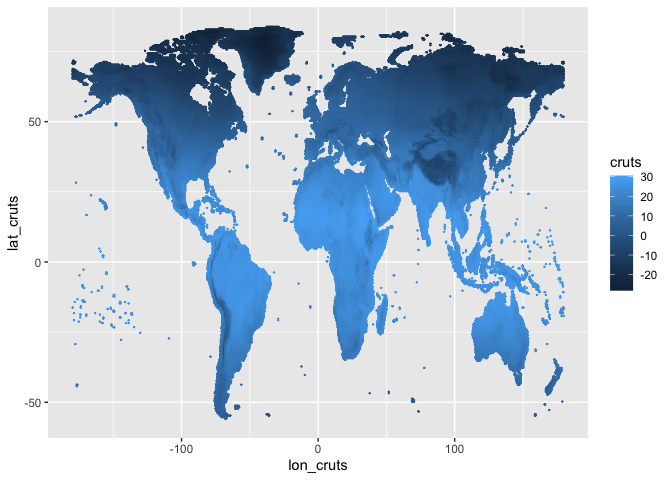
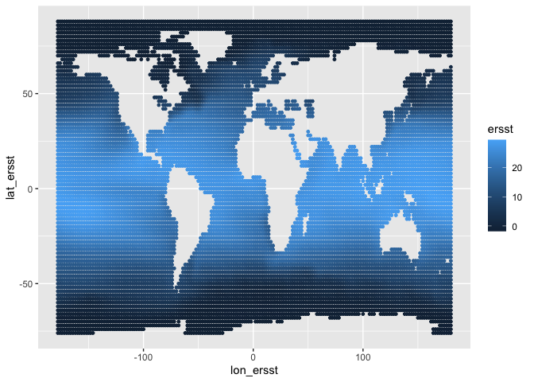
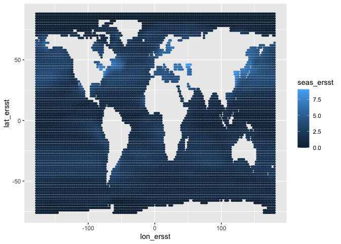

Assemble temperature dataset (average, difference, and seasonality) to
match with dissimilarity slope. Also consider ecto vs. endotherms.
================

``` r
require(data.table)
```

    ## Loading required package: data.table

``` r
require(ncdf4)
```

    ## Loading required package: ncdf4

``` r
require(ggplot2)
```

    ## Loading required package: ggplot2

``` r
require(here)
```

    ## Loading required package: here

    ## here() starts at /Users/mpinsky/Documents/Rutgers/Community_and_climate/crossrealm/climate_community_crossrealm

``` r
knitr::opts_knit$set(root.dir = rprojroot::find_rstudio_root_file()) # tell RStudio to use project root directory as the root for this notebook. Needed since we are storing code in a separate directory.
```

# Read in BioTime and temperature data

Using average daily temperature by month from CRU TS Using average
temperature by month from ERSST. NOAA\_ERSST\_V5 data provided by the
NOAA/OAR/ESRL PSD, Boulder, Colorado, USA, from their Web site at
<https://www.esrl.noaa.gov/psd/>

``` r
# biotime community similarity data
bt <- readRDS(here('temp', 'trendstemp.rds'))

# convert biotime to long format
btlong <- melt(bt, id.vars = c('rarefyID', 'REALM', 'Biome', 'taxa_mod', 'STUDY_ID', 'rarefyID_x', 'rarefyID_y'),
               measure.vars = list(c('Jtutrend3', 'Jbetatrend3', 'Horntrend3', 'Jtutrend5', 'Jbetatrend5', 'Horntrend5', 
                                     'Jtutrend10', 'Jbetatrend10', 'Horntrend10', 'Jtutrend20', 'Jbetatrend20', 'Horntrend20'),
                                     c('Jtutrend3_se', 'Jbetatrend3_se', 'Horntrend3_se', 'Jtutrend5_se', 'Jbetatrend5_se',
                                       'Horntrend5_se', 'Jtutrend10_se', 'Jbetatrend10_se', 'Horntrend10_se', 'Jtutrend20_se',
                                       'Jbetatrend20_se', 'Horntrend20_se'),
                                     c('Jtutrend3_y1', 'Jbetatrend3_y1', 'Horntrend3_y1', 'Jtutrend5_y1', 'Jbetatrend5_y1',
                                       'Horntrend5_y1', 'Jtutrend10_y1', 'Jbetatrend10_y1', 'Horntrend10_y1', 'Jtutrend20_y1',
                                       'Jbetatrend20_y1', 'Horntrend20_y1'),
                                     c('Jtutrend3_y2', 'Jbetatrend3_y2', 'Horntrend3_y2', 'Jtutrend5_y2', 'Jbetatrend5_y2',
                                       'Horntrend5_y2', 'Jtutrend10_y2', 'Jbetatrend10_y2', 'Horntrend10_y2', 'Jtutrend20_y2',
                                       'Jbetatrend20_y2','Horntrend20_y2')),
                                value.name = c('disstrend', 'trendse', 'year1', 'year2'))
btlong[, measure := rep(c('Jtu', 'Jbeta', 'Horn'), 4)[variable]] # extract Jtu, Jbeta, or Horn
btlong[, variable := NULL]
btlong <- btlong[!is.na(year1) & !is.na(year2) & !is.na(disstrend), ] # trim out missing
btlong <- btlong[!duplicated(cbind(rarefyID, year1, year2)), ] # trim out duplicated lat/lon/years

# biotime species lists
load('data/biotime_blowes/bt_grid_spp_list.Rdata') # loads bt_grid_spp_list. this has some studies not in bt.
btspp <- data.table(bt_grid_spp_list); rm(bt_grid_spp_list) # rename to btspp
btspp <- merge(btspp, bt[, .(rarefyID, taxa_mod)], by = 'rarefyID') # add taxa_mod to spp list

btspp[, length(unique(Species))] # 16315 species
```

    ## [1] 16315

``` r
# endo vs. ectotherm classifications by species
endo <- fread('output/metab_feed_byspecies.csv.gz')

# CRU TS mean temp by year
n = nc_open('dataDL/cruts/cru_ts4.03.1901.2018.tmp.dat.nc') # Open the netCDF file. Won't work on .gz for some reason
# print(n) # get information about the file format
cruts = ncvar_get(n, 'tmp') # dim order: 720 lon x 360 lat x 1416 time (observations are month, time measured in days since Jan 1, 1900). 0 lon is at date line.
dim(cruts)
```

    ## [1]  720  360 1416

``` r
dates <- format(as.Date(as.numeric(ncvar_get(n, 'time')), origin=as.Date('1900-01-01')), format = '%Y%m')
dimnames(cruts) <- list(lon_cruts = ncvar_get(n, 'lon'), lat_cruts = ncvar_get(n, 'lat'), time = dates)
nc_close(n)

# ERSST temp by month
n = nc_open('dataDL/ersst/sst.mnmean.nc') # Open the netCDF file
# print(n) # get information about the file format
ersst = ncvar_get(n, 'sst') # dim order: 180 lon x 89 lat x 1994 time (observations are month, time measured in days since Jan 1, 1800). 0 lon is at greenwhich mean.
dim(ersst)
```

    ## [1]  180   89 1997

``` r
dates <- format(as.Date(as.numeric(ncvar_get(n, 'time')), origin = as.Date('1800-01-01')), format = '%Y%m')
dimnames(ersst) <- list(lon_ersst = ncvar_get(n, 'lon'), lat_ersst = ncvar_get(n, 'lat'), time = dates)
nc_close(n)
```

Check the temperature data read in correctly

``` r
# CTU TS
head(dimnames(cruts)[[3]]) # 190101: good
```

    ## [1] "190101" "190102" "190103" "190104" "190105" "190106"

``` r
tail(dimnames(cruts)[[3]]) # should be Dec. 2018: good
```

    ## [1] "201807" "201808" "201809" "201810" "201811" "201812"

``` r
# ERSST
head(dimnames(ersst)[[3]]) # should be Jan. 1854: good
```

    ## [1] "185401" "185402" "185403" "185404" "185405" "185406"

``` r
tail(dimnames(ersst)[[3]]) # should be 2020: good
```

    ## [1] "201912" "202001" "202002" "202003" "202004" "202005"

# Average temperature by year

``` r
# CRU TS
crutsmelt <- as.data.table(cruts, value.name='cruts') # reshape to long format
crutsmelt[, YEAR := as.numeric(substr(time, 1,4))] # extract year
crutsyr <- crutsmelt[, .(cruts = mean(cruts, na.rm=TRUE)), by = .(lat_cruts = as.numeric(lat_cruts), lon_cruts = as.numeric(lon_cruts), YEAR)]

# ERSST
ersstmelt <- as.data.table(ersst, value.name = 'ersst')
ersstmelt[, YEAR := as.numeric(substr(time, 1,4))]
ersstyr <- ersstmelt[, .(ersst = mean(ersst, na.rm=TRUE)), by = .(lat_ersst = as.numeric(lat_ersst), lon_ersst = as.numeric(lon_ersst), YEAR)]
ersstyr[lon_ersst > 180, lon_ersst := lon_ersst - 360] # convert to -180 to 180
```

## Plot CRU TS to make sure it worked

``` r
ggplot(crutsyr[YEAR == 1901,], aes(lon_cruts, lat_cruts, color = cruts)) + geom_point(size = 0.1)
```

<!-- -->
\#\# Plot ERSST to make sure it worked

``` r
ggplot(ersstyr[YEAR == 1901,], aes(lon_ersst, lat_ersst, color = ersst)) + geom_point(size = 1) # plot to make sure it worked
```

<!-- -->

# Calculate seasonality by year (SD)

``` r
# CRU TS
crutsmelt[, mo := as.numeric(substr(time, 5,6))] # extract month
crutsmo <- crutsmelt[, .(cruts = mean(cruts, na.rm = TRUE)), by = .(lat_cruts = as.numeric(lat_cruts), lon_cruts = as.numeric(lon_cruts), mo)] # average by month
crutsseas <- crutsmo[, .(seas_cruts = sd(cruts, na.rm = TRUE)), by = .(lat_cruts, lon_cruts)]

# ERSST
ersstmelt[, mo := as.numeric(substr(time, 5,6))] # extract month
ersstmo <- ersstmelt[, .(ersst = mean(ersst, na.rm = TRUE)), by = .(lat_ersst = as.numeric(lat_ersst), lon_ersst = as.numeric(lon_ersst), mo)] # average by month
ersstmo[lon_ersst > 180, lon_ersst := lon_ersst - 360] # convert to -180 to 180
ersstseas <- ersstmo[, .(seas_ersst = sd(ersst, na.rm = TRUE)), by = .(lat_ersst, lon_ersst)]
```

## Plot CRU TS to make sure seasonality worked

``` r
ggplot(crutsseas, aes(lon_cruts, lat_cruts, color = seas_cruts)) + geom_point(size = 0.1) # plot to make sure it worked
```

<!-- -->
\#\# Plot ERSST to make sure seasonality worked

``` r
ggplot(ersstseas, aes(lon_ersst, lat_ersst, color = seas_ersst)) + geom_point(size = 1) # plot to make sure it worked
```

<!-- -->

# Calculate temperature change slope based on biotime year pair/lat/lon

``` r
# Set up lat/lon grid in bt
btlong[, lat_cruts := floor(rarefyID_y*2)/2 + 0.25] # find nearest CRU TS lat and lon grid values (0.5)
btlong[, lon_cruts := floor(rarefyID_x*2)/2 + 0.25]

btlong[, lat_ersst := floor((rarefyID_y - 1)*0.5 + 1)/0.5] # find nearest ERSST lat and lon grid values (2).
btlong[, lon_ersst := floor((rarefyID_x + 1)*0.5 + 1)/0.5]

# dataframe with all years
btlongallyrs <- btlong[, .(year = seq(year1, year2)), by = .(rarefyID, year1, year2, lat_cruts, lon_cruts, lat_ersst, lon_ersst, REALM)]
btlongallyrs <- merge(btlongallyrs, crutsyr[, .(year = YEAR, lat_cruts, lon_cruts, cruts)], all.x = TRUE)
btlongallyrs <- merge(btlongallyrs, ersstyr[, .(year = YEAR, lat_ersst, lon_ersst, ersst)], all.x = TRUE, by = c('lon_ersst', 'lat_ersst', 'year'))

# slopes
tslopes_cruts <- btlongallyrs[!is.na(cruts), .(trend_cruts = coef(lm(cruts ~ year))[2]), by = .(rarefyID, year1, year2, lat_cruts, lon_cruts, REALM)]
tslopes_ersst <- btlongallyrs[!is.na(ersst), .(trend_ersst = coef(lm(ersst ~ year))[2]), by = .(rarefyID, year1, year2, lat_ersst, lon_ersst, REALM)]
tslopes <- merge(tslopes_cruts, tslopes_ersst, all = TRUE)
```

# Calculations by rarefyID

Find fraction ectotherm vs. mammal vs. bird by rarefyID

``` r
# summarize by rarefyID
endofrac <- endo[, .(mammfrac = sum(metab == 'mamm')/.N, birdfrac = sum(metab == 'bird')/.N, ectofrac = sum(metab == 'ecto')/.N),
                 by = .(rarefyID)]

# check
endofrac[, all(rowSums(cbind(mammfrac, birdfrac, ectofrac)) == 1)] # TRUE, good
```

    ## [1] TRUE

``` r
invisible(endofrac[mammfrac != 0, hist(mammfrac)])
```

<!-- -->

``` r
invisible(endofrac[birdfrac != 0, hist(birdfrac)])
```

<!-- -->

``` r
invisible(endofrac[ectofrac != 0, hist(ectofrac)])
```

<!-- -->

## Average temperature and average metabolic temperature (choose body temperature for endotherms)

``` r
# CTU TS
avecruts <- btlongallyrs[, .(ave_cruts = mean(cruts, na.rm = TRUE)), 
          by = .(rarefyID, year1,  year2, lat_cruts, lon_cruts, REALM)] # calculate ave for each pairwise comparison of years
avecruts <- merge(avecruts, endofrac, all.x = TRUE)
avecruts[, ave_metab_cruts := ave_cruts * ectofrac + 38 * mammfrac + 40 * birdfrac] # average temperature, considering endotherm body temps (latter from McCoy & Gillooly 2008 Ecology Letters)

# ERSST
aveersst <- btlongallyrs[, .(ave_ersst = mean(ersst, na.rm = TRUE)), 
          by = .(rarefyID, year1, year2, lat_ersst, lon_ersst, REALM)] # calculate ave
aveersst <- merge(aveersst, endofrac, all.x = TRUE)
aveersst[, ave_metab_ersst := ave_ersst * ectofrac + 38 * mammfrac + 40 * birdfrac]

# examine
avecruts[, plot(ave_metab_cruts ~ ectofrac)]
```

<!-- -->

    ## NULL

``` r
aveersst[, plot(ave_metab_ersst ~ ectofrac)]
```

<!-- -->

    ## NULL

## Merge ave, change, and seasonality with bt by rarefyID, year1, year2

``` r
# merge seasonality with BT by lat/lon
btsum <- merge(btlong[, .(rarefyID, year1, year2, REALM, lat_cruts, lon_cruts, lat_ersst, lon_ersst)], crutsseas, by = c('lat_cruts', 'lon_cruts'), all.x = TRUE) # CRU TS
btsum <- merge(btsum, ersstseas, by = c('lat_ersst', 'lon_ersst'), all.x = TRUE) # ERSST

# merge in average temperature and metabolically corrected ave temp
btsum <- merge(btsum, avecruts[, .(rarefyID, year1, year2, ave_cruts, ave_metab_cruts)], all.x = TRUE, by = c('rarefyID', 'year1', 'year2'))
btsum <- merge(btsum, aveersst[, .(rarefyID, year1, year2, ave_ersst, ave_metab_ersst)], all.x = TRUE, by = c('rarefyID', 'year1', 'year2'))

# merge in temperature tredd
btsum <- merge(btsum, tslopes[, .(rarefyID, year1, year2, trend_cruts, trend_ersst)], all.x = TRUE, by = c('rarefyID', 'year1', 'year2'))
```

# Examine CRUTS vs. ERSST

Temperature trends are correlated, though non-linear for seasonality (at
the poles, low in the ocean and high on land)

``` r
# compare temperature trends from CRU TS vs ERSST
ggplot(btsum, aes(trend_cruts, trend_ersst)) + # ERSST more muted at fastest rates of change in CRU TS
    geom_point() +
    geom_smooth()
```

    ## `geom_smooth()` using method = 'gam' and formula 'y ~ s(x, bs = "cs")'

    ## Warning: Removed 14490 rows containing non-finite values (stat_smooth).

    ## Warning: Removed 14490 rows containing missing values (geom_point).

<!-- -->

``` r
# average temperature from CRU TS and ERSST
ggplot(btsum, aes(ave_cruts, ave_ersst, color = lat_cruts)) + # ERSST more muted at fastest rates of change in CRU TS
    geom_point() +
    geom_smooth()
```

    ## `geom_smooth()` using method = 'gam' and formula 'y ~ s(x, bs = "cs")'

    ## Warning: Removed 14490 rows containing non-finite values (stat_smooth).
    
    ## Warning: Removed 14490 rows containing missing values (geom_point).

<!-- -->

``` r
# compare seasonality from CRU TS and ERSST
ggplot(btsum, aes(seas_cruts, seas_ersst, color = lat_cruts)) + # ERSST more muted at fastest rates of change in CRU TS
    geom_point() +
    geom_smooth()
```

    ## `geom_smooth()` using method = 'gam' and formula 'y ~ s(x, bs = "cs")'

    ## Warning: Removed 14490 rows containing non-finite values (stat_smooth).
    
    ## Warning: Removed 14490 rows containing missing values (geom_point).

<!-- -->

# Choose CRU TS vs. ERSST

Use CRUTS in general, except ERSST in marine realm

``` r
# average temperature and metabolically corrected ave temp
btsum[, ':='(tempave = ave_cruts, tempave_metab = ave_metab_cruts)]
btsum[REALM == 'Marine', ':='(tempave = ave_ersst, tempave_metab = ave_metab_ersst)]
btsum[REALM == 'Marine' & is.na(ave_ersst), ':='(tempave = ave_cruts, tempave_metab = ave_metab_cruts)] # fill missing marine with CRU TS
btsum[REALM != 'Marine' & is.na(ave_cruts), ':='(tempave = ave_ersst, tempave_metab = ave_metab_ersst)] # fill missing non-marine with ERSST

# temperature change
btsum[ , temptrend := trend_cruts] # CRU TS for land and freshwater
btsum[REALM == 'Marine', temptrend := trend_ersst] # ERSST for marine
btsum[REALM == 'Marine' & is.na(trend_ersst), ':='(temptrend = trend_cruts)]
btsum[REALM != 'Marine' & is.na(trend_cruts), ':='(temptrend = trend_ersst)]

# seasonality
btsum[, seas := seas_cruts]
btsum[REALM == 'Marine', seas := seas_ersst]
btsum[REALM == 'Marine' & is.na(seas_ersst), ':='(seas = seas_cruts)]
btsum[REALM != 'Marine' & is.na(seas_cruts), ':='(seas = seas_ersst)]

# set column order and remove columns
out <- btsum[, .(rarefyID, year1, year2, tempave, tempave_metab, temptrend, seas)]

# trim to unique rarefyID, year1, year2, combinations
out <- out[!duplicated(out), ]

# check
dim(btlong)
```

    ## [1] 19025    16

``` r
dim(out)
```

    ## [1] 19025     7

``` r
out
```

    ##          rarefyID year1 year2   tempave tempave_metab   temptrend     seas
    ##     1: 100_606491  1992  2011 12.306673      12.30667  0.02737355 3.076098
    ##     2: 100_606491  2002  2011 12.462563      12.46256 -0.03539498 3.076098
    ##     3: 100_606491  2007  2011 12.404275      12.40427 -0.20098979 3.076098
    ##     4: 100_606491  2009  2011 12.186802      12.18680 -0.09047373 3.076098
    ##     5: 101_606491  1992  2011 12.306673      12.30667  0.02737355 3.076098
    ##    ---                                                                    
    ## 19021: 91_1619799  1995  1999  8.901419      40.00000  0.17698372 5.740345
    ## 19022: 91_1619799  1997  1999  9.147174      40.00000  0.17531361 5.740345
    ## 19023: 91_1620530  1993  1995  8.722970      40.00000  0.27726352 5.740345
    ## 19024: 91_1620531  1993  1995  8.722970      40.00000  0.27726352 5.740345
    ## 19025: 91_1624191  1993  1995  8.278022      40.00000  0.24033413 5.753974

# Checking missing

``` r
out[!duplicated(rarefyID) & is.na(tempave), .N]
```

    ## [1] 161

``` r
out[!duplicated(rarefyID) & is.na(tempave_metab), .N]
```

    ## [1] 161

``` r
out[!duplicated(rarefyID) & is.na(temptrend), .N]
```

    ## [1] 161

``` r
out[!duplicated(rarefyID) & is.na(seas), .N]
```

    ## [1] 161

``` r
ggplot(btsum, aes(lon_cruts, lat_cruts, color = is.na(tempave))) + geom_point(size=0.2)
```

<!-- -->

``` r
ggplot(btsum, aes(lon_cruts, lat_cruts, color = is.na(tempave_metab))) + geom_point(size=0.2)
```

<!-- -->

``` r
ggplot(btsum, aes(lon_cruts, lat_cruts, color = is.na(temptrend))) + geom_point(size=0.2)
```

<!-- -->

``` r
ggplot(btsum, aes(lon_cruts, lat_cruts, color = is.na(seas))) + geom_point(size=0.2)
```

<!-- -->

# Write out

``` r
write.csv(out, file = gzfile('output/temperaturetrend_byrarefyID_by_year1_year2.csv.gz'), row.names = FALSE)
```
