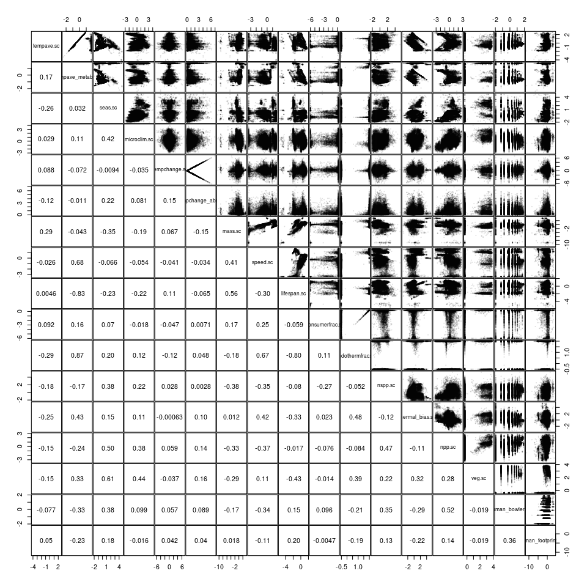

Turnover covariate data prep
================

``` r
library(data.table)
library(ggplot2)
library(beanplot) # for beanplots
library(gridExtra) # to combine ggplots together
library(grid) # to combine ggplots together


knitr::opts_knit$set(root.dir = rprojroot::find_rstudio_root_file()) # tell RStudio to use project root directory as the root for this notebook. Needed since we are storing code in a separate directory.
```

### Load data

``` r
# BioTime
load('data/biotime_blowes/bt_malin.Rdata')
bt <- data.table(bt_malin); rm(bt_malin)

# Temperature average, trends, and seasonality
temperature <- fread('output/temperature_byrarefyID.csv.gz')

# microclimates
microclim <- fread('output/microclimates.csv.gz', drop = 1)

# NPP
npp <- fread('output/npplandocean.csv.gz')

# Body size
bs <- fread('output/mass_byrarefyid.csv.gz', drop = 1)
bs[, ':='(STUDY_ID = NULL, REALM = NULL, taxa_mod = NULL)] # remove unnecessary columns 

# Mobility
speed <- fread('output/speed_byrarefyID.csv.gz', drop = 1)
speed[, ':='(STUDY_ID = NULL, REALM = NULL, taxa_mod = NULL)] # remove unnecessary columns 

# Lifespan
lsp <- fread('output/lifespan_byrarefyID.csv.gz')

# CTI
cti <- fread('output/cti_byrarefyID.csv.gz')
    
# consumer vs. producer
cons <- fread('output/metab_feed_byspecies.csv.gz')
consfrac <- cons[, .(consfrac = sum(feeding == 'consumer')/.N), by = rarefyID] # fraction of species in each study that are consumers

# richness
rich <- fread('output/richness_by_rarefyID.csv.gz') # number of species

# endotherm vs. ectotherm
endo <- fread('output/metab_feed_byspecies.csv.gz') # endotherm vs. ectotherm classifications
endofrac <- endo[, .(endofrac = sum(metab != 'ecto')/.N), by = rarefyID]
rm(endo)

# human impact
human <- fread('output/humanimpact_by_rarefyID.csv.gz')

# %veg
veg <- as.data.table(readRDS('output/vct_by_rarefyID.rds'))
veg[, veg := (`tree cover % (mean)` + 0.5 * `non-tree veg. % (mean)`)/100] # veg index from 0 (all non-veg) to 1 (all tree). Non-tree veg counts as 0.5.
```

### Plot a turnover example

``` r
#bt[, .(n = .N), by = rarefyID][n > 50,]

ggplot(bt[rarefyID == '339_1085477'], aes(YEAR, Jtu_base)) +
    geom_point() +
    geom_smooth(method = 'lm') +
    xlab('Year') + ylab('Jaccard dissimilarity')
```

<!-- -->

### Assemble dataset of beta diversity trends (temporal turnover) and covariates

``` r
# calculate temporal turnover
calctrend <- function(y, YEAR, nm = 'y'){ # function to calc trends
  # turn off warnings for the following
  defaultW <- getOption("warn")
  options(warn = -1)
  
  mod <- lm(y ~ YEAR)
  out <- list(y = coef(mod)[2], # coef for the slope
              y_se = sqrt(diag(vcov(mod)))[2]) # SE
  names(out) <- c(nm, paste0(nm, '_se'))
  options(warn = defaultW)
  return(out)
}

# function to calc trends, removing first year with 0
calctrendrem0 <- function(y, YEAR, nm = 'y'){
  # turn off warnings for the following
  defaultW <- getOption("warn")
  options(warn = -1)
  
  if(length(YEAR)>2){
    o <- order(YEAR)
    YEAR2 <- YEAR[o][2:length(YEAR)]
    y2 <- y[o][2:length(y)]
    
    if(sum(!is.na(y2)) >= 2){ # make sure enough values to fit a line
      mod <- lm(y2 ~ YEAR2)
      out <- list(y = coef(mod)[2], # coef for the slope
                  y_se = sqrt(diag(vcov(mod)))[2]) # SE
      names(out) <- c(nm, paste0(nm, '_se'))
      options(warn = defaultW)
      return(out)
      
    } else {
      out <- list(y = NA_real_, y_se = NA_real_)
      names(out) <- c(nm, paste0(nm, '_se'))
      
      options(warn = defaultW)
      return(out)
    }
    
  } else {
    out <- list(y = NA_real_, y_se = NA_real_)
    names(out) <- c(nm, paste0(nm, '_se'))
  
    options(warn = defaultW)
    return(out)
  }
  

}


setkey(bt, STUDY_ID, rarefyID, YEAR)


trends <- bt[, calctrend(Jtu_base, YEAR, 'Jtutrend'), 
    by = .(REALM, Biome, taxa_mod, STUDY_ID, rarefyID, rarefyID_x, rarefyID_y)] # calculate trend in Jaccard turnover from first year, plus SEs
trends2 <- bt[, calctrend(Jbeta_base, YEAR, 'Jbetatrend'), 
    by = .(rarefyID)] # calculate trend in total Jaccard' beta diversity's from first year, 
trends3 <- bt[, calctrend(1-Horn_base, YEAR, 'Horntrend'), 
    by = .(rarefyID)] # calculate trend in Horn-Morisita from first year. Convert to dissimilarity.
#trends4 <- bt[, .(Strend = coef(lm(I(log(S)) ~ YEAR))[2]), by = .(rarefyID)] # trend in log(S)

trends5 <- bt[, calctrendrem0(Jtu_base, YEAR, 'Jtutrendrem0'), 
    by = .(rarefyID)] # calculate trend in Jaccard turnover without first year
trends6 <- bt[, calctrendrem0(Jbeta_base, YEAR, 'Jbetatrendrem0'), 
    by = .(rarefyID)]
trends7 <- bt[, calctrendrem0(1-Horn_base, YEAR, 'Horntrendrem0'), 
    by = .(rarefyID)]


nyrBT <-  bt[, .(nyrBT = length(YEAR), 
                 minyrBT = min(YEAR), 
                 maxyrBT = max(YEAR),
                 medianyrBT = median(YEAR),
                 meanyrBT = mean(YEAR)), 
             by = .(rarefyID)] # number of years in time-series

trends <- merge(trends, trends2) # merge in total J and Horn-Morisita
trends <- merge(trends, trends3)
trends <- merge(trends, trends5)
trends <- merge(trends, trends6)
trends <- merge(trends, trends7)
trends <- merge(trends, nyrBT)
```

Add covariates

``` r
# add covariates
trends <- merge(trends, temperature[, .(rarefyID, tempave, tempave_metab, temptrend, seas)], all.x = TRUE, by = 'rarefyID') # temperature ave, ave metabolic, trend, and seasonality
trends <- merge(trends, microclim[, .(rarefyID, microclim = Temp_sd20km)], all.x = TRUE, by = 'rarefyID') # microclimates
trends <- merge(trends, npp, all.x = TRUE, by = 'rarefyID') # npp
trends <- merge(trends, bs[, .(rarefyID, mass_mean_weight, mass_sd_weight)], all.x = TRUE) # body size mass (g)
trends <- merge(trends, speed[, .(rarefyID, speed_mean_weight, speed_sd_weight)], all.x = TRUE) # speed (km/hr)
trends <- merge(trends, lsp[, .(rarefyID, lifespan_mean_weight, lifespan_sd_weight)], all.x = TRUE) # lifespan (yr)
trends <- merge(trends, cti[, .(rarefyID, thermal_bias)], all.x = TRUE) # thermal bias (degC)
trends <- merge(trends, consfrac, all.x = TRUE) # fraction consumers
trends <- merge(trends, rich, all.x = TRUE) # species richness
trends <- merge(trends, endofrac, all.x = TRUE) # endotherm vs. ectotherm
trends <- merge(trends, human[, .(rarefyID, human_bowler = atc, human_venter = hfp, human_halpern = himp)], all.x = TRUE) # human impact
trends <- merge(trends, veg[, .(rarefyID, veg = veg)], all.x = TRUE) # vegetation index
trends[REALM == 'Marine', veg := 0] # veg index is 0 at sea
```

Do some basic checks of the turnover calculations

``` r
# basic checks
trends
```

    ##           rarefyID  REALM                      Biome      taxa_mod
    ##     1:  100_606491 Marine     Northern_European_Seas          Fish
    ##     2:  101_606491 Marine     Northern_European_Seas Invertebrates
    ##     3: 108_3933165 Marine Continental_High_Antarctic         Birds
    ##     4: 108_3941181 Marine Continental_High_Antarctic         Birds
    ##     5: 108_3941182 Marine Continental_High_Antarctic         Birds
    ##    ---                                                            
    ## 53463:  99_4377155 Marine Northwest_Australian_Shelf          Fish
    ## 53464:  99_4383724 Marine Northwest_Australian_Shelf          Fish
    ## 53465:  99_4386651 Marine Northwest_Australian_Shelf          Fish
    ## 53466:  99_4390299 Marine Northwest_Australian_Shelf          Fish
    ## 53467:  99_4394671 Marine Northwest_Australian_Shelf          Fish
    ##        STUDY_ID rarefyID_x rarefyID_y     Jtutrend Jtutrend_se  Jbetatrend
    ##     1:      100    -3.0800   51.14000  0.004763952 0.001601483 0.004886186
    ##     2:      101    -3.0800   51.14000  0.000000000 0.000000000 0.005573571
    ##     3:      108    57.9650  -65.28500  0.071428571         NaN 0.071428571
    ##     4:      108    59.9275  -66.29250  0.100000000         NaN 0.107142857
    ##     5:      108    59.9700  -66.19500  0.062500000         NaN 0.089285714
    ##    ---                                                                    
    ## 53463:       99   116.8010  -19.84227 -0.010268562 0.020521929 0.043500339
    ## 53464:       99   117.5515  -19.61040  0.000000000         NaN 0.000000000
    ## 53465:       99   117.8600  -18.80625  0.000000000         NaN 0.250000000
    ## 53466:       99   118.3213  -18.79645  0.088888889 0.071860741 0.092380952
    ## 53467:       99   118.8110  -19.35420  0.000000000         NaN 0.080000000
    ##        Jbetatrend_se    Horntrend Horntrend_se Jtutrendrem0
    ##     1:   0.001622134 0.0031009875 0.0015680649   0.00297623
    ##     2:   0.002121344 0.0004638415 0.0008664591   0.00000000
    ##     3:           NaN 0.0714285714          NaN           NA
    ##     4:           NaN 0.1147144190          NaN           NA
    ##     5:           NaN 0.0878275862          NaN           NA
    ##    ---                                                     
    ## 53463:   0.027264849           NA           NA  -0.02380952
    ## 53464:           NaN           NA           NA           NA
    ## 53465:           NaN           NA           NA           NA
    ## 53466:   0.072315133           NA           NA   0.01388889
    ## 53467:           NaN           NA           NA           NA
    ##        Jtutrendrem0_se Jbetatrendrem0 Jbetatrendrem0_se Horntrendrem0
    ##     1:     0.001309059    0.002587992      0.0009975709  0.0023147105
    ##     2:     0.000000000    0.002208307      0.0009103225  0.0001735803
    ##     3:              NA             NA                NA            NA
    ##     4:              NA             NA                NA            NA
    ##     5:              NA             NA                NA            NA
    ##    ---                                                               
    ## 53463:             NaN    0.025510204               NaN            NA
    ## 53464:              NA             NA                NA            NA
    ## 53465:              NA             NA                NA            NA
    ## 53466:     0.056131276    0.014285714      0.0467378789            NA
    ## 53467:              NA             NA                NA            NA
    ##        Horntrendrem0_se nyrBT minyrBT maxyrBT medianyrBT meanyrBT
    ##     1:     0.0016045472    31    1981    2011     1996.0 1996.000
    ##     2:     0.0009087936    31    1981    2011     1996.0 1996.000
    ##     3:               NA     2    1985    1999     1992.0 1992.000
    ##     4:               NA     2    1985    1993     1989.0 1989.000
    ##     5:               NA     2    1985    1993     1989.0 1989.000
    ##    ---                                                           
    ## 53463:               NA     3    1982    1997     1983.0 1987.333
    ## 53464:               NA     2    1982    1990     1986.0 1986.000
    ## 53465:               NA     2    1986    1988     1987.0 1987.000
    ## 53466:               NA     4    1982    1989     1984.5 1985.000
    ## 53467:               NA     2    1982    1987     1984.5 1984.500
    ##          tempave tempave_metab    temptrend      seas  microclim       npp
    ##     1: 12.051350      12.05135  0.041129329 3.0760983 0.23603834 1685.9467
    ##     2: 12.051350      12.05135  0.041129329 3.0760983 0.23603834 1685.9467
    ##     3: -1.320041      40.00000 -0.006945833 0.4808712 0.03647966  126.3856
    ##     4: -1.271692      40.00000 -0.004529737 0.5261527 0.01186496  152.3814
    ##     5: -1.271692      40.00000 -0.004529737 0.5261527 0.01315645  150.4591
    ##    ---                                                                    
    ## 53463: 26.938956      26.93896 -0.003552321 2.0045745 0.04537952  552.9129
    ## 53464:        NA            NA           NA        NA 0.03587447  543.8439
    ## 53465: 27.370296      27.37030  0.620516857 1.8875665 0.03082215  366.2237
    ## 53466: 27.549504      27.54950 -0.002693142 1.8875665 0.05193555  384.6634
    ## 53467:        NA            NA           NA        NA 0.04392091  694.7807
    ##        mass_mean_weight mass_sd_weight speed_mean_weight speed_sd_weight
    ##     1:       4576.35361    16081.00494         12.020663        9.883453
    ##     2:         15.46288       65.75757          5.701894        6.033516
    ##     3:       1011.72769      662.44697        126.528799        7.027091
    ##     4:        380.26044      360.69826        106.398871       18.543573
    ##     5:       2559.31968     2480.08226         73.390318       57.378463
    ##    ---                                                                  
    ## 53463:      11098.73495    17185.06309         21.061352       10.977955
    ## 53464:       4376.39609     9104.03188         14.427234        8.894618
    ## 53465:       4546.03260    12646.27215         12.384251        9.922576
    ## 53466:      15949.56141    49280.74146         15.765330       11.647149
    ## 53467:       6295.59279     9783.92682         17.989658        8.753660
    ##        lifespan_mean_weight lifespan_sd_weight thermal_bias consfrac Nspp
    ##     1:            24.368790         13.8561561   -0.1166378        1   83
    ##     2:             6.855411          5.5954324   -1.3322161        1   15
    ##     3:             2.322789          0.2962608    5.8210833        1    4
    ##     4:             1.835437          0.3587385    5.5271034        1    7
    ##     5:             2.628751          0.8313121    3.0517163        1    7
    ##    ---                                                                   
    ## 53463:             9.477088          3.5699526    0.8561218        1   37
    ## 53464:                   NA                 NA           NA        1   23
    ## 53465:             6.184025          3.6468843    0.4429424        1   46
    ## 53466:             7.722453          4.3764322    0.1860061        1   50
    ## 53467:                   NA                 NA           NA        1   36
    ##        endofrac human_bowler human_venter human_halpern veg
    ##     1:        0            6     33.00286            NA   0
    ##     2:        0            6     33.00286            NA   0
    ##     3:        1            0           NA      6.875259   0
    ##     4:        1            0           NA      1.041834   0
    ##     5:        1            0           NA      1.091445   0
    ##    ---                                                     
    ## 53463:        0            2           NA      6.855058   0
    ## 53464:        0            2           NA      1.672769   0
    ## 53465:        0            1           NA      8.710693   0
    ## 53466:        0            1           NA      8.704291   0
    ## 53467:        0            1           NA      7.336845   0

``` r
trends[, .(minJtu = min(Jtutrend), maxJtu = max(Jtutrend), minJbe = min(Jbetatrend), maxJbe = max(Jbetatrend), 
           minHo = min(Horntrend, na.rm = TRUE), maxHo = max(Horntrend, na.rm = TRUE)), by = REALM]
```

    ##          REALM      minJtu maxJtu      minJbe maxJbe       minHo maxHo
    ## 1:      Marine -0.10000000    0.5 -0.08000000    0.5 -0.09421855   0.5
    ## 2: Terrestrial -0.10000000    0.5 -0.07142857    0.5 -0.09373434   0.5
    ## 3:  Freshwater -0.06666667    0.5 -0.04166667    0.5 -0.06129032   0.5

``` r
trends[, .(nJtu = sum(Jtutrend < 0)), by = REALM] # why are some turnover trends < 0? first year more diverged than future years
```

    ##          REALM nJtu
    ## 1:      Marine 2891
    ## 2: Terrestrial  223
    ## 3:  Freshwater   71

``` r
trends[, .(nJ = sum(Jtutrend > 0)), by = REALM]
```

    ##          REALM    nJ
    ## 1:      Marine 39219
    ## 2: Terrestrial  2854
    ## 3:  Freshwater   693

``` r
# number of species
trends[, summary(Nspp)]
```

    ##    Min. 1st Qu.  Median    Mean 3rd Qu.    Max. 
    ##    1.00    6.00   11.00   19.35   24.00 1427.00

``` r
trends[, plot(Nspp, Jtutrend, log = 'x')]
```

<!-- -->

    ## NULL

Remove studies with only 1 species

``` r
nrow(trends)
```

    ## [1] 53467

``` r
trends <- trends[Nspp > 1, ]
nrow(trends)
```

    ## [1] 53013

Turnover calculations are correlated, though less so for Horn

``` r
# are turnover calculations correlated?
ggplot(trends, aes(Jbetatrend, Jtutrend)) +
    geom_point(alpha = 0.3) +
    geom_smooth()
```

    ## `geom_smooth()` using method = 'gam' and formula 'y ~ s(x, bs = "cs")'

<!-- -->

``` r
ggplot(trends, aes(Jbetatrend, Horntrend)) +
    geom_point(alpha = 0.3) +
    geom_smooth()
```

    ## `geom_smooth()` using method = 'gam' and formula 'y ~ s(x, bs = "cs")'

    ## Warning: Removed 1435 rows containing non-finite values (stat_smooth).

    ## Warning: Removed 1435 rows containing missing values (geom_point).

<!-- -->
Temporal turnover is not all that correlated between including first
year or not.

``` r
ggplot(trends, aes(Jtutrend, Jtutrendrem0)) +
  geom_point(alpha = 0.3) +
  geom_smooth() +
  geom_abline(a = 0, b = 1)
```

    ## Warning: Ignoring unknown parameters: a, b

    ## `geom_smooth()` using method = 'gam' and formula 'y ~ s(x, bs = "cs")'

    ## Warning: Removed 13818 rows containing non-finite values (stat_smooth).

    ## Warning: Removed 13818 rows containing missing values (geom_point).

<!-- -->

``` r
ggplot(trends, aes(Jbetatrend, Jbetatrendrem0)) +
  geom_point(alpha = 0.3) +
  geom_smooth() +
  geom_abline(a = 0, b = 1)
```

    ## Warning: Ignoring unknown parameters: a, b

    ## `geom_smooth()` using method = 'gam' and formula 'y ~ s(x, bs = "cs")'

    ## Warning: Removed 13818 rows containing non-finite values (stat_smooth).
    
    ## Warning: Removed 13818 rows containing missing values (geom_point).

<!-- -->

``` r
ggplot(trends, aes(Horntrend, Horntrendrem0)) +
  geom_point(alpha = 0.3) +
  geom_smooth() +
  geom_abline(a = 0, b = 1)
```

    ## Warning: Ignoring unknown parameters: a, b

    ## `geom_smooth()` using method = 'gam' and formula 'y ~ s(x, bs = "cs")'

    ## Warning: Removed 14825 rows containing non-finite values (stat_smooth).

    ## Warning: Removed 14825 rows containing missing values (geom_point).

<!-- -->

## Compare covariates across realms

``` r
i <- trends[, !duplicated(rarefyID)]; sum(i)
```

    ## [1] 53013

``` r
par(mfrow=c(5,3))
beanplot(rarefyID_y ~ REALM, data = trends[i,], what = c(1,1,1,1), col = c("#CAB2D6", "#33A02C", "#B2DF8A"), border = "#CAB2D6", ylab = 'Latitude (degN)', ll = 0.05)
beanplot(tempave ~ REALM, data = trends[i,], what = c(1,1,1,1), col = c("#CAB2D6", "#33A02C", "#B2DF8A"), border = "#CAB2D6", ylab = 'Temperature (degC)', ll = 0.05)
beanplot(tempave_metab ~ REALM, data = trends[i,], what = c(1,1,1,1), col = c("#CAB2D6", "#33A02C", "#B2DF8A"), border = "#CAB2D6", ylab = 'Metabolic Temperature (degC)', ll = 0.05, bw = 'nrd0') # nrd0 bandwidth to calculation gap
beanplot(seas ~ REALM, data = trends[i,], what = c(1,1,1,1), col = c("#CAB2D6", "#33A02C", "#B2DF8A"), border = "#CAB2D6", ylab = 'Seasonality (degC)', ll = 0.05)
beanplot(microclim ~ REALM, data = trends[i,], what = c(1,1,1,1), col = c("#CAB2D6", "#33A02C", "#B2DF8A"), border = "#CAB2D6", ylab = 'Microclimates (degC)', ll = 0.05)
```

    ## log="y" selected

``` r
beanplot(temptrend ~ REALM, data = trends[i,], what = c(1,1,1,1), col = c("#CAB2D6", "#33A02C", "#B2DF8A"), border = "#CAB2D6", ylab = 'Temperature trend (degC/yr)', ll = 0.05)
beanplot(mass_mean_weight ~ REALM, data = trends[i,], what = c(1,1,1,1), col = c("#CAB2D6", "#33A02C", "#B2DF8A"), border = "#CAB2D6", ylab = 'Mass (g)', ll = 0.05, log = 'y')
beanplot(speed_mean_weight +1 ~ REALM, data = trends[i,], what = c(1,1,1,1), col = c("#CAB2D6", "#33A02C", "#B2DF8A"), border = "#CAB2D6", ylab = 'Speed (km/hr)', ll = 0.05, log = 'y')
beanplot(lifespan_mean_weight ~ REALM, data = trends[i,], what = c(1,1,1,1), col = c("#CAB2D6", "#33A02C", "#B2DF8A"), border = "#CAB2D6", ylab = 'Lifespan (yr)', ll = 0.05, log = 'y')
#beanplot(consfrac ~ REALM, data = trends[i,], what = c(1,1,1,1), col = c("#CAB2D6", "#33A02C", "#B2DF8A"), border = "#CAB2D6", ylab = 'Consumers (fraction)', ll = 0.05, log = '') # too sparse
#beanplot(endofrac ~ REALM, data = trends[i,], what = c(1,1,1,1), col = c("#CAB2D6", "#33A02C", "#B2DF8A"), border = "#CAB2D6", ylab = 'Endotherms (fraction)', ll = 0.05, log = '') # too sparse
beanplot(Nspp ~ REALM, data = trends[i,], what = c(1,1,1,1), col = c("#CAB2D6", "#33A02C", "#B2DF8A"), border = "#CAB2D6", ylab = 'Number of species', ll = 0.05, log = 'y')
beanplot(thermal_bias ~ REALM, data = trends[i & !is.na(thermal_bias),], what = c(1,1,1,1), col = c("#CAB2D6", "#33A02C", "#B2DF8A"), border = "#CAB2D6", ylab = 'Thermal bias (degC)', ll = 0.05)
beanplot(npp ~ REALM, data = trends[i,], what = c(1,1,1,1), col = c("#CAB2D6", "#33A02C", "#B2DF8A"), border = "#CAB2D6", ylab = 'NPP', ll = 0.05)
```

    ## log="y" selected

``` r
beanplot(veg ~ REALM, data = trends[i & REALM !='Marine',], what = c(1,1,1,1), col = c("#CAB2D6", "#33A02C", "#B2DF8A"), border = "#CAB2D6", ylab = 'NPP', ll = 0.05)
```

<!-- -->

Marine are in generally warmer locations (seawater doesn’t freeze)
Marine have much lower seasonality. Marine and freshwater have some very
small masses (plankton), but much of dataset is similar to terrestrial.
Marine has a lot of slow, crawling organisms, but land has plants. Land
also has birds (fast).

## Plot turnover vs. explanatory variables

Lines are ggplot smoother fits.
<!-- -->

Strong trends with temperature change, but trends are pretty symmetric
around no trend in temperature, which implies warming or cooling drives
similar degree of community turnover. Some indication of less turnover
for larger organisms (mass) Higher turnover on land with higher
seasonality? More turnover for shorter-lived organisms? No really clear
differences among realms.

### Write out

``` r
write.csv(trends, gzfile('output/turnover_w_covariates.csv.gz'), row.names = FALSE)
```

### Useful variables

``` r
# realm that combined Terrestrial and Freshwater, for interacting with human impact
trends[, REALM2 := REALM]
levels(trends$REALM2) = list(TerrFresh = "Freshwater", TerrFresh = "Terrestrial", Marine = "Marine")

# group Marine invertebrates/plants in with All
trends[, taxa_mod2 := taxa_mod]
trends[taxa_mod == 'Marine invertebrates/plants', taxa_mod2 := 'All']
```

### Log-transform some variables, then center and scale.

``` r
trends[, tempave.sc := scale(tempave)]
trends[, tempave_metab.sc := scale(tempave_metab)]
trends[, seas.sc := scale(seas)]
trends[, microclim.sc := scale(log(microclim))]
trends[, temptrend.sc := scale(temptrend, center = FALSE)]
trends[, temptrend_abs.sc := scale(abs(temptrend), center = FALSE)] # do not center, so that 0 is still 0 temperature change
trends[, mass.sc := scale(log(mass_mean_weight))]
trends[, speed.sc := scale(log(speed_mean_weight+1))]
trends[, lifespan.sc := scale(log(lifespan_mean_weight))]
trends[, consumerfrac.sc := scale(consfrac)]
trends[, endothermfrac.sc := scale(endofrac)]
trends[, nspp.sc := scale(log(Nspp))]
trends[, thermal_bias.sc := scale(thermal_bias)]
trends[, npp.sc := scale(log(npp))]
trends[, veg.sc := scale(log(veg+1))]
trends[, human_bowler.sc := scale(log(human_bowler+1)), by = REALM2] # separate scaling by realm
trends[REALM2 == 'TerrFresh', human_footprint.sc := scale(log(human_venter+1))]
trends[REALM2 == 'Marine', human_footprint.sc := scale(log(human_halpern))]
```

### Do the variables look ok?

#### Unscaled

``` r
# histograms to examine
cexmain = 0.6
par(mfrow = c(5,4))
invisible(trends[, hist(minyrBT, main = 'Start year', cex.main = cexmain)])
invisible(trends[, hist(maxyrBT - minyrBT, main = 'Duration (years)', cex.main = cexmain)])
invisible(trends[, hist(nyrBT, main = 'Number of sampled years', cex.main = cexmain)])
invisible(trends[, hist(mass_mean_weight, main = 'Mass (g)', cex.main = cexmain)])
invisible(trends[, hist(speed_mean_weight, main = 'Speed (km/hr)', cex.main = cexmain)])
invisible(trends[, hist(lifespan_mean_weight, main = 'Lifespan (yr)', cex.main = cexmain)])
invisible(trends[, hist(tempave_metab, main = 'Metabolic temperature (°C)', cex.main = cexmain)])
invisible(trends[, hist(consfrac, main = 'Consumers (fraction)', cex.main = cexmain)])
invisible(trends[, hist(endofrac, main = 'Endotherms (fraction)', cex.main = cexmain)])
invisible(trends[, hist(tempave, main = 'Environmental temperature (°C)', cex.main = cexmain)])
invisible(trends[, hist(temptrend, main = 'Temperature trend (°C/yr)', cex.main = cexmain)])
invisible(trends[, hist(seas, main = 'Seasonality (°C)', cex.main = cexmain)])
invisible(trends[, hist(microclim, main = 'Microclimates (°C)', cex.main = cexmain)])
invisible(trends[, hist(Nspp, main = 'Species richness', cex.main = cexmain)])
invisible(trends[, hist(thermal_bias, main = 'Thermal bias (°C)', cex.main = cexmain)])
invisible(trends[, hist(npp, main = 'Net primary productivity', cex.main = cexmain)])
invisible(trends[, hist(veg, main = 'Vegetation index', cex.main = cexmain)])
invisible(trends[, hist(human_bowler, main = 'Human impact score (Bowler)', cex.main = cexmain)])
invisible(trends[, hist(human_venter, main = 'Human impact score (Venter)', cex.main = cexmain)])
invisible(trends[, hist(human_halpern, main = 'Human impact score (Halpern)', cex.main = cexmain)])
```

<!-- -->

#### Scaled

``` r
# histograms to examine
cexmain = 0.6
par(mfrow = c(5,4))
invisible(trends[, hist(tempave.sc, main = 'Environmental temperature (°C)', cex.main = cexmain)])
invisible(trends[, hist(tempave_metab.sc, main = 'Metabolic temperature (°C)', cex.main = cexmain)])
invisible(trends[, hist(seas.sc, main = 'Seasonality (°C)', cex.main = cexmain)])
invisible(trends[, hist(microclim.sc, main = 'log Microclimates (°C)', cex.main = cexmain)])
invisible(trends[, hist(temptrend.sc, main = 'Temperature trend (°C/yr)', cex.main = cexmain)])
invisible(trends[, hist(temptrend_abs.sc, main = 'abs(Temperature trend) (°C/yr)', cex.main = cexmain)])
invisible(trends[, hist(mass.sc, main = 'log Mass (g)', cex.main = cexmain)])
invisible(trends[, hist(speed.sc, main = 'log Speed (km/hr)', cex.main = cexmain)])
invisible(trends[, hist(lifespan.sc, main = 'log Lifespan (yr)', cex.main = cexmain)])
invisible(trends[, hist(consumerfrac.sc, main = 'Consumers (fraction)', cex.main = cexmain)])
invisible(trends[, hist(endothermfrac.sc, main = 'Endotherms (fraction)', cex.main = cexmain)])
invisible(trends[, hist(nspp.sc, main = 'log Species richness', cex.main = cexmain)])
invisible(trends[, hist(thermal_bias.sc, main = 'Thermal bias (°C)', cex.main = cexmain)])
invisible(trends[, hist(npp.sc, main = 'log Net primary productivity', cex.main = cexmain)])
invisible(trends[, hist(veg.sc, main = 'log Vegetation index', cex.main = cexmain)])
invisible(trends[, hist(human_bowler.sc, main = 'log Human impact score (Bowler)', cex.main = cexmain)])
invisible(trends[, hist(human_footprint.sc, main = 'log Human impact score (Venter & Halpern)', cex.main = cexmain)])
```

<!-- -->

### Check correlations among variables. Pearson’s r is on the lower diagonal.

``` r
panel.cor <- function(x, y, digits = 2, prefix = "", cex.cor, ...)
{
    usr <- par("usr"); on.exit(par(usr))
    par(usr = c(0, 1, 0, 1))
    r <- cor(x, y, use = 'pairwise.complete.obs')
    txt <- format(c(r, 0.123456789), digits = digits)[1]
    txt <- paste0(prefix, txt)
    if(missing(cex.cor)) cex.cor <- 0.8/strwidth(txt)
    text(0.5, 0.5, txt) #, cex = cex.cor * r)
}
pairs(formula = ~ tempave.sc + tempave_metab.sc + seas.sc + microclim.sc + temptrend.sc + temptrend_abs.sc + mass.sc + speed.sc + lifespan.sc + consumerfrac.sc + endothermfrac.sc + nspp.sc + thermal_bias.sc + npp.sc + veg.sc + human_bowler.sc + human_footprint.sc, data = trends, gap = 1/10, cex = 0.2, col = '#00000022', lower.panel = panel.cor)
```

<!-- -->

Mass and lifespan look tightly correlated, but r only 0.56…?
Tempave\_metab and lifespan don’t look tightly correlated, but r= -0.81
Tempave\_metab and speed don’t look tightly correlated, but r= -0.83
Lifespan and speed don’t look tightly correlated, but r = 0.73
