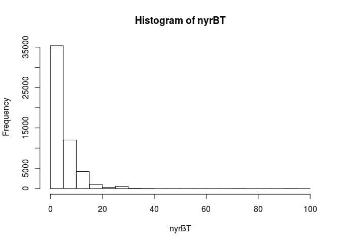
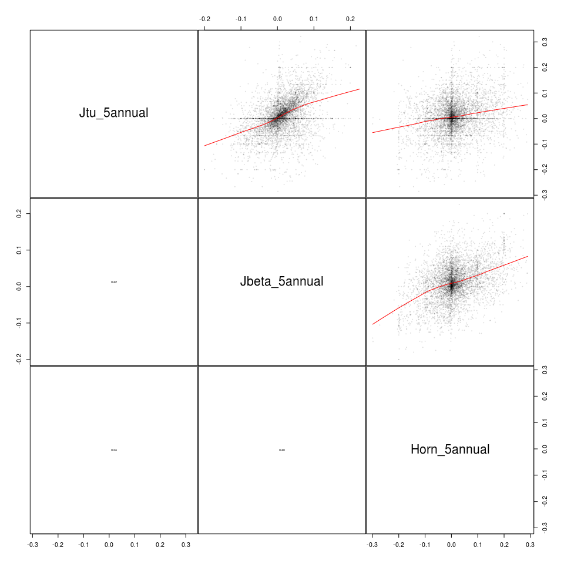
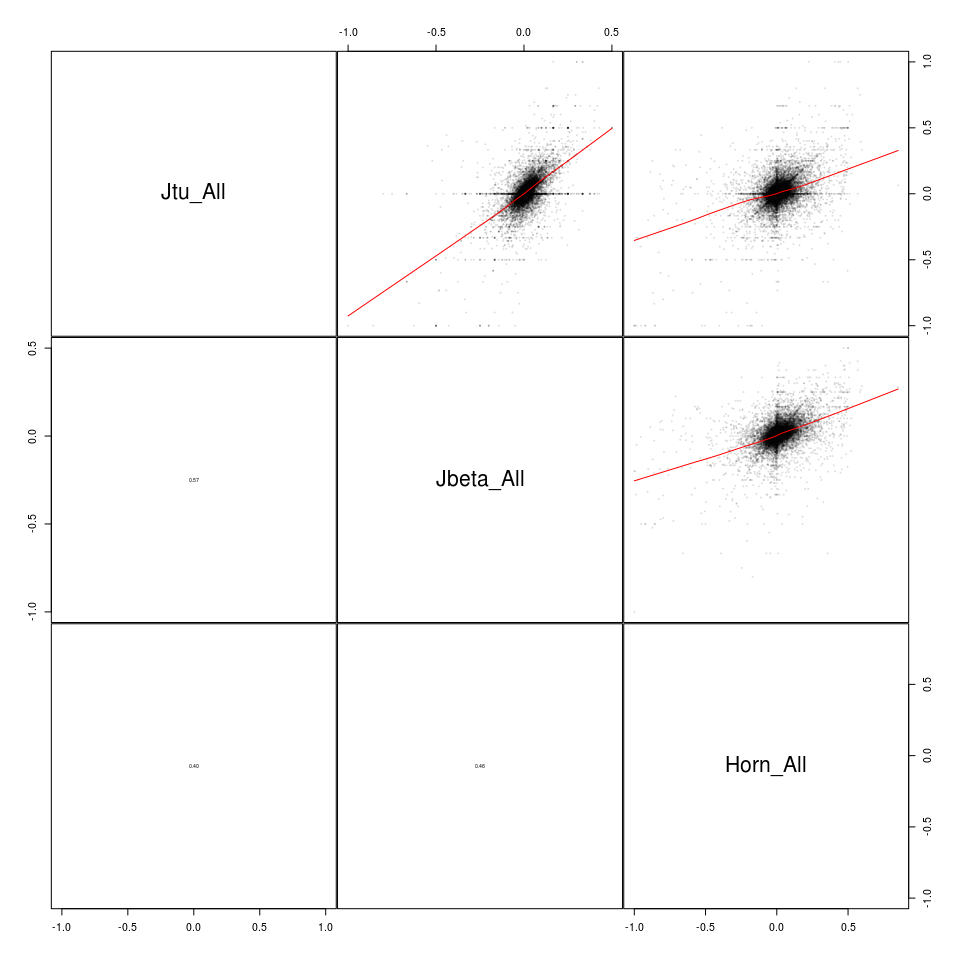

Calculate biodiversity turnover as slope of dissimilarity vs. time
================

# Set up

# Load data

``` r
# BioTime
# biotime community dissimilarity data
load(here::here('data', 'biotime_blowes', 'all_pairs_beta.Rdata')) # load rarefied_beta_medians, which has all pairwise dissimilarities
bt <- data.table(rarefied_beta_medians); rm(rarefied_beta_medians)
bt[, year1 := as.numeric(year1)] # not sure why it gets read in as character
bt[, year2 := as.numeric(year2)]
bt[, Horn := 1-Hornsim] # convert similarity to dissimilarity
bt[, Hornsim := NULL]

# BioTime data type
load(here('data', 'biotime_blowes', 'time_series_data_type.Rdata')) # loads rarefyID_type
bt <- merge(bt, rarefyID_type, by = 'rarefyID', all.x = TRUE) # merge with biotime

# biotime taxa category and other info
load(here::here('data', 'biotime_blowes', 'bt_malin.Rdata')) # load bt_malin
btinfo <- data.table(bt_malin); rm(bt_malin)
btinfo2 <- btinfo[!duplicated(rarefyID), .(rarefyID, rarefyID_x, rarefyID_y, Biome, taxa_mod, REALM, STUDY_ID)]
bt <- merge(bt, btinfo2, by = 'rarefyID') # trims out rarefyIDs not in bt_malin

# richness
rich <- fread(here('output','richness_by_rarefyID.csv.gz')) # number of species
```

## Examine number of species and individuals per sample

``` r
hist(log10(btinfo$N))
```

<!-- -->

``` r
hist(log10(btinfo$S)); abline(v = log10(2), col = 'red') # line at 2 species
```

<!-- -->

``` r
nrow(btinfo)
```

    ## [1] 295095

``` r
btinfo[S == 1, .N]
```

    ## [1] 37212

## Remove studies that don’t meet quality thresholds

Keep studies with: - \>2 species - \>2 years

``` r
length(unique(bt$rarefyID))
```

    ## [1] 53467

``` r
length(setdiff(bt$rarefyID, rich$rarefyID))
```

    ## [1] 0

``` r
# number of years per study (in remaining samples)
nyrs <- bt[, .(nyrBT = length(unique(c(year1, year2)))), by = rarefyID]
length(setdiff(bt$rarefyID, nyrs$rarefyID))
```

    ## [1] 0

``` r
invisible(nyrs[, hist(nyrBT)])
```

<!-- -->

``` r
nyrs[nyrBT < 3, .N]
```

    ## [1] 14157

``` r
# >2 species, >2 yrs
bt <- bt[rarefyID %in% rich[Nspp > 2, rarefyID], ]
length(unique(bt$rarefyID))
```

    ## [1] 50790

``` r
bt <- bt[rarefyID %in% nyrs[nyrBT > 2, rarefyID], ]
length(unique(bt$rarefyID))
```

    ## [1] 38732

# Plot turnover example

``` r
test <- bt[rarefyID == '339_1085477',]
test[, dY := year2 - year1]
ggplot(test, aes(dY, Jtu)) +
    geom_point(alpha = 0.5) +
    geom_smooth(data = test, 
                method = 'lm') + # a straight line fit
    labs(x = 'Year', y = 'Jaccard turnover')
```

    ## `geom_smooth()` using formula 'y ~ x'

<!-- -->

``` r
# a declining 3-year slope
test <- bt[rarefyID == '112_529867' & year1>= 2002 & year2 <= 2004, ]
test[, dY := year2 - year1]
ggplot(test, aes(dY, Jtu)) +
    geom_point(alpha = 0.5) +
    geom_smooth(data = test, 
                method = 'lm') + # a straight line fit
    labs(x = 'Difference in years', y = 'Jaccard turnover')
```

    ## `geom_smooth()` using formula 'y ~ x'

<!-- -->

``` r
# a declining 20-year slope
test <- bt[rarefyID == '213_435199' & year1>= 1987 & year2 <= 2006, ]
test[, dY := year2 - year1]
ggplot(test, aes(dY, Jtu)) +
    geom_point(alpha = 0.5) +
    geom_smooth(data = test, 
                method = 'lm') + # a straight line fit
    labs(x = 'Difference in years', y = 'Jaccard turnover')
```

    ## `geom_smooth()` using formula 'y ~ x'

<!-- -->

# Calculate temporal trends (temporal turnover)

This only recalculates from scratch if temp/trendstemp.rds is not
available. \#\# Set up functions

``` r
# function to calc linear trend from all year pairs of the time-series
calctrend <- function(y, year1, year2, measure = 'y', duration_group = NA_character_){
  yrs <- sort(unique(c(year1, year2)))
  dy <- year2 - year1
  if(length(dy)>1){
    mod <- lm(y ~ dy) # fit line
    se <- suppressWarnings(sqrt(diag(vcov(mod)))[2])
    out <- list(disstrend = coef(mod)[2], # coef for the slope
                trendse = se,
                year1 = min(year1), 
                year2 = max(year2),
                measure = measure,
                duration_group = duration_group,
                nsamps = length(yrs))
    return(out)
  } else{
    out <- list(disstrend = NA_real_, trendse = NA_real_, year1 = NA_real_, year2 = NA_real_,
                measure = measure, duration_group = duration_group, nsamps = NA_integer_)
    return(out)
  }
}

# function to calc linear trend from all years of the time-series
# only comparing back to the first year
calctrendy1 <- function(y, year1, year2, measure = 'y', duration_group = NA_character_){
  yrs <- sort(unique(c(year1, year2)))
  startyear = min(year1)
  dy <- year2 - year1
  keep = year1 == startyear
  if(sum(keep)>1){
    y2 <- y[keep]
    dy2 <- dy[keep]
    mod <- lm(y2 ~ dy2) # fit line
    se <- suppressWarnings(sqrt(diag(vcov(mod)))[2])
    out <- list(disstrend = coef(mod)[2], # coef for the slope
                trendse = se,
                year1 = min(year1), 
                year2 = max(year2),
                measure = measure, 
                duration_group = duration_group,
                nsamps = length(yrs))
    return(out)
  } else{
    out <- list(disstrend = NA_real_, trendse = NA_real_, year1 = NA_real_, year2 = NA_real_,
                measure = measure, duration_group = duration_group, nsamps = NA_integer_)
    return(out)
  }
}

# function to calc linear trend from all pairs
# only using a sequence of annual samples that is numyrs long
# use the most recent sequence that fits this criterion
calctrendlast <- function(y, year1, year2, numyrs, measure = 'y', duration_group = NA_character_){
  yrs <- sort(unique(c(year1, year2)))
  dy <- diff(yrs) # find intervals between years
  rl <- rle(dy) # run length encoding
  end = cumsum(rl$lengths) # find ends of runs
  start = c(1, head(end, -1) + 1) # find starts of runs
  rlkeep <- which(rl$lengths >= numyrs & rl$values == 1) # find runs with desired length and 1 year intervals
  if(length(rlkeep)>0){
    rlkeep <- max(rlkeep) # find the latest run that meets our criteria
    start <- start[rlkeep] # start of this run
    end <- end[rlkeep] # end of this run
    dykeep <- rep(FALSE, length(dy)) # year intervals to keep
    dykeep[start:end] <- TRUE
    yrs2 <- yrs[c(dykeep, FALSE) | c(FALSE, dykeep)] # keep years involved in at least one interval to keep
    maxyr <- max(yrs2)
    yrs3 <- yrs2[yrs2 > maxyr - numyrs] # only last numyrs years
    ykeep <- year1 %in% yrs3 & year2 %in% yrs3 # keep values in pairwise comparisons for the years we want
    y <- y[ykeep] # trim the timeseries
    year1 <- year1[ykeep]
    year2 <- year2[ykeep]
    run <- TRUE
  } else{
    run <- FALSE
  }
  
  if(run){
    dy <- year2 - year1
    yrs <- sort(unique(c(year1, year2)))
    
    mod <- invisible(lm(y ~ dy)) # fit line
    se <- suppressWarnings(sqrt(diag(vcov(mod)))[2])
    out <- list(disstrend = coef(mod)[2], # coef for the slope
                trendse = se,
                year1 = min(yrs3), 
                year2 = max(yrs3),
                measure = measure, 
                duration_group = duration_group,
                nsamps = length(yrs))
    return(out)

  } else {
    out <- list(disstrend = NA_real_, trendse = NA_real_, year1 = NA_real_, year2 = NA_real_,
                measure = measure, duration_group = duration_group, nsamps = NA_integer_)
    return(out)
  }
}

# function to calc linear trend from all pairs
# only using a sequence of samples that is numyrs samples long and has nsamps samples
# not necessarily annual samples
# use the most recent sequence that fits this criterion
calctrendnsamps <- function(y, year1, year2, numyrs, nsamps, 
                            measure = 'y', duration_group = NA_character_){
  if(nsamps > numyrs) stop('nsamps must be <= numyrs')
  if(length(y) != length(year1) | length(y) != length(year2)) stop('y, year1, and year2 must be the same length')
  yrs <- sort(unique(c(year1, year2)))
  
  # brute force search for a sequence of samples that match criteria
  i = length(yrs) # index for finding a suitable sequence of samples. start at the end.
  run <- FALSE # flag for whether we have found a suitable sequence of samples
  while(i > 0 & !run){ 
    dys <- yrs[i] - yrs
    j <- which(dys == numyrs-1)
    if(length(j) >0){
      proposedset <- yrs[j:i]
      if(length(proposedset) >= nsamps){
        ykeep <- year1 %in% proposedset & year2 %in% proposedset # keep values in pairwise comparisons for the years we want
        y <- y[ykeep] # trim the timeseries
        year1 <- year1[ykeep] # trim the initial years
        year2 <- year2[ykeep] # trim the final years
        run <- TRUE # mark that we should run the calcs
      }
    }
    if(run == FALSE){
      i <- i - 1 # try the next earliest sample
    }
  }
  
  if(run){
    dy <- year2 - year1
    yrs <- sort(unique(c(year1, year2)))
    
    mod <- lm(y ~ dy) # fit line
    se <- suppressWarnings(sqrt(diag(vcov(mod)))[2]) # standard error
    out <- list(disstrend = coef(mod)[2], # coef for the slope
                trendse = se, 
                year1 = min(proposedset), 
                year2 = max(proposedset),
                measure = measure, 
                duration_group = duration_group,
                nsamps = length(yrs)) # SE
    return(out)

  } else {
    out <- list(disstrend = NA_real_, trendse = NA_real_, year1 = NA_real_, year2 = NA_real_,
                measure = measure, duration_group = duration_group, nsamps = NA_integer_)
    return(out)
  }
}
```

## Do calculations

And write out trendstemp.rds

``` r
setkey(bt, STUDY_ID, rarefyID, year1,  year2)

if(file.exists('temp/trendstemp.rds')){
    print('File already exists. Will not do calculations')
    trends <- readRDS('temp/trendstemp.rds')
} else {
  print('Calculating from scratch')
  
  ## Trends of standardized length and annual sampling frequency
  yrslist <- 3:20
  for(yr in yrslist){
    print(yr)
    temp <- bt[, calctrendlast(Jtu, year1, year2, numyrs = yr, measure = 'Jtu', 
                               duration_group = paste0(yr, 'annual')), by = .(rarefyID)]
    if(yr == min(yrslist)) trends = temp[!is.na(disstrend), ]
    if(yr > min(yrslist)) trends = rbind(trends,temp[!is.na(disstrend), ])
    
    temp <- bt[, calctrendlast(Jbeta, year1, year2, numyrs = yr, measure = 'Jbeta',
                               duration_group = paste0(yr, 'annual')), by = .(rarefyID)]
    trends = rbind(trends, temp[!is.na(disstrend), ])
    temp <- bt[!is.na(Horn), calctrendlast(Horn, year1, year2, numyrs = yr, measure = 'Horn',
                                           duration_group = paste0(yr, 'annual')), by = .(rarefyID)]
    trends = rbind(trends, temp[!is.na(disstrend), ])
  }
  
  ## Trends of standardized length and at least 3 years sampled
  yrslist <- 3:20
  for(yr in yrslist){
    print(yr)
    temp <- bt[, calctrendnsamps(Jtu, year1, year2, numyrs = yr, nsamps = 3, measure = 'Jtu', 
                               duration_group = paste0(yr, 'min3')), by = .(rarefyID)]
    trends = rbind(trends,temp[!is.na(disstrend), ])
    
    temp <- bt[, calctrendnsamps(Jbeta, year1, year2, numyrs = yr, nsamps = 3, measure = 'Jbeta',
                               duration_group = paste0(yr, 'min3')), by = .(rarefyID)]
    trends = rbind(trends, temp[!is.na(disstrend), ])
    temp <- bt[!is.na(Horn), calctrendnsamps(Horn, year1, year2, numyrs = yr, nsamps = 3, measure = 'Horn',
                                           duration_group = paste0(yr, 'min3')), by = .(rarefyID)]
    trends = rbind(trends, temp[!is.na(disstrend), ])
  }
  
  # All years available using all year pairs
  temp <- bt[, calctrend(Jtu, year1, year2, measure = 'Jtu', duration_group = 'All'), by = .(rarefyID)]
  trends = rbind(trends, temp[!is.na(disstrend), ])
  temp <- bt[, calctrend(Jbeta, year1, year2, measure = 'Jbeta', duration_group = 'All'), by = .(rarefyID)]
  trends = rbind(trends, temp[!is.na(disstrend), ])
  temp <- bt[!is.na(Horn), calctrend(Horn, year1, year2, measure = 'Horn', duration_group = 'All'), by = .(rarefyID)]
  trends = rbind(trends, temp[!is.na(disstrend), ])

  # All years available using first year comparisons
  temp <- bt[, calctrendy1(Jtu, year1, year2, measure = 'Jtu', duration_group = 'Ally1'), by = .(rarefyID)]
  trends = rbind(trends, temp[!is.na(disstrend), ])
  temp <- bt[, calctrendy1(Jbeta, year1, year2, measure = 'Jbeta', duration_group = 'Ally1'), by = .(rarefyID)]
  trends = rbind(trends, temp[!is.na(disstrend), ])
  temp <- bt[!is.na(Horn), calctrendy1(Horn, year1, year2, measure = 'Horn', duration_group = 'Ally1'), by = .(rarefyID)]
  trends = rbind(trends, temp[!is.na(disstrend), ])
  

  saveRDS(trends, file = here('temp', 'trendstemp.rds'))
  
}
```

    ## [1] "File already exists. Will not do calculations"

``` r
nrow(trends)
```

    ## [1] 1125828

## Add species richness and realm to trends for plotting

``` r
trends <- merge(trends, rich, all.x = TRUE) # species richness
realms <- bt[, .(REALM = unique(REALM)), by = rarefyID]
trends <- merge(trends, realms, all.x = TRUE)
```

## Plot every Jtu timeseries (a lot\!)

Not run during knitting. Not yet updated to new format and content of
trends data.table

# Examine the turnover calculations

## How many values?

### print

``` r
trends[, .N, by = c('measure', 'duration_group')]
```

    ##      measure duration_group     N
    ##   1:     Jtu        3annual 10881
    ##   2:   Jbeta        3annual 10881
    ##   3:    Horn        3annual 10492
    ##   4:     Jtu        4annual  7511
    ##   5:   Jbeta        4annual  7511
    ##  ---                             
    ## 110:   Jbeta            All 38732
    ## 111:    Horn            All 37728
    ## 112:     Jtu          Ally1 38732
    ## 113:   Jbeta          Ally1 38732
    ## 114:    Horn          Ally1 37728

### plot

``` r
counts <- trends[, .N, by = c('measure', 'duration_group')]
counts[!(duration_group %in% c('All', 'Ally1')), duration := as.numeric(gsub('annual|min3', '', duration_group))]
counts[!(duration_group %in% c('All', 'Ally1')), group := sub('^[[:digit:]]+', '', duration_group)]
counts[(duration_group %in% c('All', 'Ally1')), group := duration_group]
counts[!is.na(duration), duration_string := as.character(duration)]
counts[is.na(duration), duration_string := group]
counts[, duration_string := factor(duration_string, levels = c('3', '4', '5', '6', '7', '8', '9', '10', '11', '12', '13', '14', '15', '16', '17', '18', '19', '20', 'All', 'Ally1'))]

ggplot(counts, aes(duration_string, N, fill = group)) +
  geom_bar(stat = 'identity', position=position_dodge())
```

<!-- -->

## Do some basic checks of the turnover calculations

``` r
# basic checks
trends
```

    ##            rarefyID   disstrend    trendse year1 year2 measure duration_group
    ##       1: 100_606491  0.06031746 0.10447291  2009  2011     Jtu        3annual
    ##       2: 100_606491  0.03419901 0.13594270  2009  2011   Jbeta        3annual
    ##       3: 100_606491  0.15866541 0.07938981  2009  2011    Horn        3annual
    ##       4: 100_606491  0.01728716 0.04431576  2008  2011     Jtu        4annual
    ##       5: 100_606491  0.04961328 0.03113838  2008  2011   Jbeta        4annual
    ##      ---                                                                     
    ## 1125824: 99_4390299 -0.01011905 0.03486369  1982  1989   Jbeta          8min3
    ## 1125825: 99_4390299 -0.01875000 0.05617171  1982  1989     Jtu            All
    ## 1125826: 99_4390299 -0.01011905 0.03486369  1982  1989   Jbeta            All
    ## 1125827: 99_4390299  0.01388889 0.05613128  1982  1989     Jtu          Ally1
    ## 1125828: 99_4390299  0.01428571 0.04673788  1982  1989   Jbeta          Ally1
    ##          nsamps Nspp NsppNAorNonZero NsppNonZero  REALM
    ##       1:      3   83              83          83 Marine
    ##       2:      3   83              83          83 Marine
    ##       3:      3   83              83          83 Marine
    ##       4:      4   83              83          83 Marine
    ##       5:      4   83              83          83 Marine
    ##      ---                                               
    ## 1125824:      4   50               0           0 Marine
    ## 1125825:      4   50               0           0 Marine
    ## 1125826:      4   50               0           0 Marine
    ## 1125827:      4   50               0           0 Marine
    ## 1125828:      4   50               0           0 Marine

``` r
trends[measure == 'Jtu', summary(disstrend)]
```

    ##       Min.    1st Qu.     Median       Mean    3rd Qu.       Max. 
    ## -1.0000000 -0.0104020  0.0004856  0.0060619  0.0223810  1.0000000

``` r
trends[measure == 'Jbeta', summary(disstrend)]
```

    ##      Min.   1st Qu.    Median      Mean   3rd Qu.      Max. 
    ## -1.000000 -0.004400  0.003846  0.008194  0.020900  1.000000

``` r
trends[measure == 'Horn', summary(disstrend)]
```

    ##      Min.   1st Qu.    Median      Mean   3rd Qu.      Max. 
    ## -1.000000 -0.007548  0.001960  0.009682  0.025767  1.000000

## Histograms of temporal change

Standardized slopes have very large and small values

``` r
x <- trends[measure == 'Jtu' & duration_group == '3annual', hist(disstrend)]
```

<!-- -->

``` r
x <- trends[measure == 'Jbeta' & duration_group == '3annual', hist(disstrend)]
```

<!-- -->

``` r
x <- trends[measure == 'Horn' & duration_group == '3annual', hist(disstrend)]
```

<!-- -->

``` r
x <- trends[measure == 'Jtu' & duration_group == '5annual', hist(disstrend)]
```

<!-- -->

``` r
x <- trends[measure == 'Jbeta' & duration_group == '5annual', hist(disstrend)]
```

<!-- -->

``` r
x <- trends[measure == 'Horn' & duration_group == '5annual', hist(disstrend)]
```

<!-- -->

``` r
x <- trends[measure == 'Jtu' & duration_group == '10annual', hist(disstrend)]
```

<!-- -->

``` r
x <- trends[measure == 'Jbeta' & duration_group == '10annual', hist(disstrend)]
```

<!-- -->

``` r
x <- trends[measure == 'Horn' & duration_group == '10annual', hist(disstrend)]
```

<!-- -->

``` r
x <- trends[measure == 'Jtu' & duration_group == '20annual', hist(disstrend)]
```

<!-- -->

``` r
x <- trends[measure == 'Jbeta' & duration_group == '20annual', hist(disstrend)]
```

<!-- -->

``` r
x <- trends[measure == 'Horn' & duration_group == '20annual', hist(disstrend)]
```

<!-- -->

``` r
x <- trends[measure == 'Jtu' & duration_group == 'All', hist(disstrend)]
```

<!-- -->

``` r
x <- trends[measure == 'Jbeta' & duration_group == 'All', hist(disstrend)]
```

<!-- -->

``` r
x <- trends[measure == 'Horn' & duration_group == 'All', hist(disstrend)]
```

<!-- -->

## Pairs plots

Turnover calculations are correlated, though less so for Horn
<!-- --><!-- --><!-- -->

# Change compared to time-series characteristics

## Duration

Use the slopes with unstandardized durations

    ## `geom_smooth()` using method = 'gam' and formula 'y ~ s(x, bs = "cs")'
    ## `geom_smooth()` using method = 'gam' and formula 'y ~ s(x, bs = "cs")'
    ## `geom_smooth()` using method = 'gam' and formula 'y ~ s(x, bs = "cs")'
    ## `geom_smooth()` using method = 'gam' and formula 'y ~ s(x, bs = "cs")'
    ## `geom_smooth()` using method = 'gam' and formula 'y ~ s(x, bs = "cs")'
    ## `geom_smooth()` using method = 'gam' and formula 'y ~ s(x, bs = "cs")'

<!-- -->

## Number of samples

Use the slopes with standardized durations to avoid confounding with
duration \#\#\# Up to 20 years

    ## `geom_smooth()` using method = 'gam' and formula 'y ~ s(x, bs = "cs")'
    ## `geom_smooth()` using method = 'gam' and formula 'y ~ s(x, bs = "cs")'
    ## `geom_smooth()` using method = 'gam' and formula 'y ~ s(x, bs = "cs")'
    ## `geom_smooth()` using method = 'gam' and formula 'y ~ s(x, bs = "cs")'
    ## `geom_smooth()` using method = 'gam' and formula 'y ~ s(x, bs = "cs")'
    ## `geom_smooth()` using method = 'gam' and formula 'y ~ s(x, bs = "cs")'
    ## `geom_smooth()` using method = 'gam' and formula 'y ~ s(x, bs = "cs")'
    ## `geom_smooth()` using method = 'gam' and formula 'y ~ s(x, bs = "cs")'
    ## `geom_smooth()` using method = 'gam' and formula 'y ~ s(x, bs = "cs")'

<!-- -->

### Up to 10 years

    ## `geom_smooth()` using formula 'y ~ x'
    ## `geom_smooth()` using formula 'y ~ x'
    ## `geom_smooth()` using formula 'y ~ x'
    ## `geom_smooth()` using formula 'y ~ x'
    ## `geom_smooth()` using formula 'y ~ x'
    ## `geom_smooth()` using formula 'y ~ x'

<!-- -->

## Number of species

    ## NULL

    ## NULL

    ## NULL

    ## NULL

    ## NULL

    ## NULL

    ## NULL

    ## NULL

    ## NULL

    ## NULL

    ## NULL

    ## NULL

<!-- -->

    ## NULL

    ## NULL

    ## NULL

<!-- -->

## Average change compared to \#species

``` r
trendswide <- dcast(trends[duration_group %in% c('3annual', '5annual', '10annual', '20annual', 
                                                 '3min3', '5min3', '10min3', '20min3', 'All', 'Ally1')], 
                    rarefyID + Nspp ~ measure + duration_group, value.var = 'disstrend')

ggplot(trendswide, aes(Nspp, Jtu_3annual, color = 'Jtu trend3')) +
  geom_smooth() +
  geom_smooth(aes(y = Jbeta_3annual, color = 'Jbeta trend3')) +
  geom_smooth(aes(y = Horn_3annual, color = 'Horn trend3')) +
  geom_smooth(aes(y = Jtu_5annual, color = 'Jtu trend5')) +
  geom_smooth(aes(y = Jbeta_5annual, color = 'Jbeta trend5')) +
  geom_smooth(aes(y = Horn_5annual, color = 'Horn trend5')) +
  geom_smooth(aes(y = Jtu_10annual, color = 'Jtu trend10')) +
  geom_smooth(aes(y = Jbeta_10annual, color = 'Jbeta trend10')) +
  geom_smooth(aes(y = Horn_10annual, color = 'Horn trend10')) +
  geom_smooth(aes(y = Jtu_20annual, color = 'Jtu trend20')) +
  geom_smooth(aes(y = Jbeta_20annual, color = 'Jbeta trend20')) +
  geom_smooth(aes(y = Horn_20annual, color = 'Horn trend20')) +
  geom_smooth(aes(y = Jtu_All, color = 'Jtu trendAll')) +
  geom_smooth(aes(y = Jbeta_All, color = 'Jbeta trendAll')) +
  geom_smooth(aes(y = Horn_All, color = 'Horn trendAll')) +
  scale_x_log10() +
  labs(y = 'Slope') +
  geom_abline(intercept = 0, slope = 0)
```

<!-- -->
