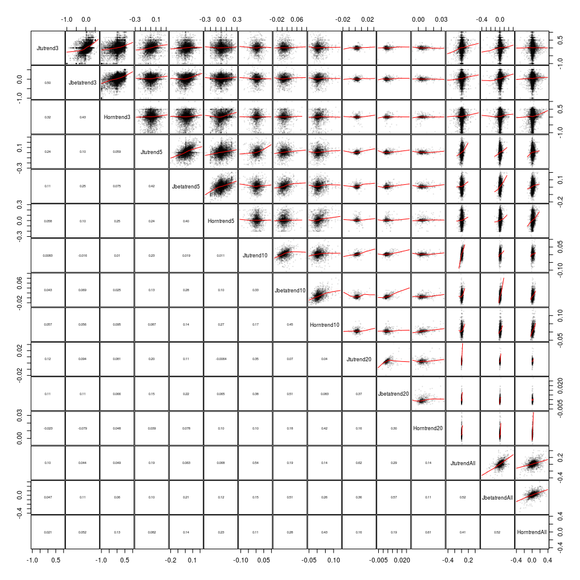

Calculate biodiversity urnover
================

# Load data

``` r
# BioTime
load('data/biotime_blowes/bt_malin.Rdata') # loads bt_malin
bt <- data.table(bt_malin); rm(bt_malin) # rename

# BioTime data type
load('data/biotime_blowes/time_series_data_type.Rdata') # loads rarefyID_type
bt <- merge(bt, rarefyID_type, by = 'rarefyID', all.x = TRUE) # merge with biotime

# BioTime temporal turnover null model
load('data/biotime_blowes/z_scores_SAD.Rdata') # loads sim_summary

# richness
rich <- fread('output/richness_by_rarefyID.csv.gz') # number of species
```

Remove studies with only 1 species and trim to count data

``` r
length(unique(bt$rarefyID))
```

    ## [1] 53467

``` r
bt <- bt[rarefyID %in% rich[Nspp > 1, rarefyID] & BROAD_TYPE == 'count', ]
length(unique(bt$rarefyID))
```

    ## [1] 51578

# Plot turnover example

Michaelis-Menton or Exponential fits (2- or 3-parameter).

``` r
test <- bt[rarefyID == '339_1085477',]
test[, YEAR0 := YEAR - min(YEAR)]

# fit a 2- or 3-parameter Michaelis-Menton curve (latter includes an intercept)
modmm2 <- nls(Jtu_base ~ Vm * YEAR0/(K + YEAR0), data = test[YEAR0 != 0, ], 
              start = list(K = mean(test$YEAR0), Vm = 1),
              algorithm = 'port', # to allow bounds to be set
              lower = c(0, 0),
              upper = c(max(test$YEAR0), 1))
modmm3 <- nls(Jtu_base ~ c + Vm * YEAR0/(K + YEAR0), 
              data = test[YEAR0 != 0, ], 
              start = list(c = 0, K = mean(test$YEAR0), Vm = 1),
              algorithm = 'port',
              lower = c(0, 0, 0),
              upper = c(1, max(test$YEAR0), 1))

# fit a 2- or 3-parameter exponential decay
modexp2 <- nls(Jtu_base ~ Vm - exp(a * YEAR0)*Vm, data = test[YEAR0 != 0, ], 
              start = list(a = -0.5, Vm = 1),
              algorithm = 'port',
              lower = c(-Inf, 0),
              upper = c(0, 1))
modexp3 <- nls(Jtu_base ~ Vm - exp(a * (YEAR0 + o))*Vm, data = test[YEAR0 != 0, ], 
              start = list(a = -0.5, Vm = 1, o = 0),
              algorithm = 'port',
              lower = c(-Inf, 0, -Inf),
              upper = c(Inf, 1, Inf))

# make predictions
mml <- data.frame(YEAR0 = seq(0, diff(range(test$YEAR)), length.out = 100))
mml$YEAR <- mml$YEAR0 + min(test$YEAR)
mml$Jtu_base.mm2 <- predict(modmm2, newdata = mml)
mml$Jtu_base.mm3 <- predict(modmm3, newdata = mml)
mml$Jtu_base.exp2 <- predict(modexp2, newdata = mml)
mml$Jtu_base.exp3 <- predict(modexp3, newdata = mml)

# calc half-saturations
cmm2 <- coef(modmm2)
cmm3 <- coef(modmm3)
cexp2 <- coef(modexp2)
cexp3 <- coef(modexp3)

hsmm2 <- cmm2[['K']] + min(test$YEAR)
hsmm3 <- with(as.data.frame(t(cmm3)), K*(Vm-c)/(Vm+c)) + min(test$YEAR)
hsexp2 <- with(as.data.frame(t(cexp2)), log(1/2)/a) + min(test$YEAR)
hsexp3 <- with(as.data.frame(t(cexp3)), log(exp(a*o)/2)/a - o) + min(test$YEAR)

# get colors to match ggplot
hues = seq(15, 375, length = 5 + 1)
cols <- hcl(h = hues, l = 65, c = 100)[1:5]

# make plot
ggplot(test, aes(YEAR, Jtu_base, color = 'Linear')) +
    geom_point() +
    geom_smooth(data = test[YEAR != min(YEAR), ], 
                method = 'lm') + # a straight line fit
    geom_line(data = mml, aes(YEAR, Jtu_base.mm2, color = 'Michaelis-Menton 2-param')) + # MM
    geom_line(data = mml, aes(YEAR, Jtu_base.mm3, color = 'Michaelis-Menton 3-param'), linetype = 'dashed', size = 1) +
    geom_line(data = mml, aes(YEAR, Jtu_base.exp2, color = 'Exponential 2-param')) +
    geom_line(data = mml, aes(YEAR, Jtu_base.exp3, color = 'Exponential 3-param'), linetype = 'dashed', size = 1) +
    geom_vline(xintercept = c(hsmm2, hsmm3, hsexp2, hsexp3), color = cols[c(4,5,1,2)], size = c(0.5, 1, 0.5, 1), 
               linetype = c('solid', 'dashed', 'solid', 'dashed')) +
    labs(x = 'Year', y = 'Jaccard dissimilarity', color = 'Functional form')
```

<!-- -->

Vertical lines are the half-saturations.

# Calculate temporal trends (temporal turnover)

``` r
# function to calc linear trend, removing first year with 0
calctrendrem0 <- function(y, YEAR, nm = 'y'){
  if(length(YEAR)>2){
     # remove year 1 comparison
    o <- order(YEAR)
    YEAR2 <- YEAR[o][2:length(YEAR)]
    y2 <- y[o][2:length(y)]
    
    if(sum(!is.na(y2)) >= 2){ # make sure enough values to fit a line
      mod <- lm(y2 ~ YEAR2) # fit line
      out <- list(y = coef(mod)[2], # coef for the slope
                  y_se = sqrt(diag(vcov(mod)))[2]) # SE
      names(out) <- c(nm, paste0(nm, '_se'))
      return(out)
      
    } else {
      out <- list(y = NA_real_, y_se = NA_real_)
      names(out) <- c(nm, paste0(nm, '_se'))
      return(out)
    }
    
  } else {
    out <- list(y = NA_real_, y_se = NA_real_)
    names(out) <- c(nm, paste0(nm, '_se'))
    return(out)
  }
  

}

# function to get distance from last to first year
calcfirstlast <- function(y, YEAR, nm = 'y'){
  if(length(YEAR)>1){
    o <- order(YEAR)
    YEAR2 <- YEAR[o][2:length(YEAR)]
    y2 <- y[o][2:length(y)]
    
    out <- list(y = y2[length(y2)], # dissimilarity for last year
                y_se = NA_real_)
  } else {
    out <- list(y = NA_real_, y_se = NA_real_)
  }

  names(out) <- c(nm, paste0(nm, '_se'))
  return(out)
}

# calc half-saturation constant from exponential fit
calcexp <- function(y, YEAR, nm = 'y'){
    if(length(YEAR)>2){
        o <- order(YEAR)
        YEAR2 <- YEAR[o][2:length(YEAR)] - YEAR[1]
        y2 <- y[o][2:length(y)]
        
        if(sum(!is.na(y2)) >= 1){ # make sure enough values to fit
            
            out <- tryCatch({
                
                modexp <- nls(y2 ~ Vm - Vm*exp(a * YEAR2), 
                              start = list(a = -0.5, Vm = 1),
                              algorithm = 'port',
                              lower = c(-Inf, 0),
                              upper = c(0, 1))
                
                # calc half-saturations
                cexp <- coef(modexp)
                hsexp <- with(as.data.frame(t(cexp)), log(1/2)/a)
                
                out <- list(y = hsexp) # half-saturation
                names(out) <- nm
                out
                
            }, warning = function(w) {
                #print('warning')
                out <- list(y = NA_real_)
                names(out) <- nm
                return(out)
            }, error = function(e) {
                #print('error')
                out <- list(y = NA_real_)
                names(out) <- nm
                return(out)
            })
            return(out)
            
        } else {
            out <- list(y = NA_real_)
            names(out) <- nm
            return(out)
        }
        
    } else {
        out <- list(y = NA_real_)
        names(out) <- nm
        return(out)
    }
}

# do calculations
setkey(bt, STUDY_ID, rarefyID, YEAR)

if(file.exists('temp/trendstemp.rds')){
    print('File already exists. Will not do calculations')
    trends <- readRDS('temp/trendstemp.rds')
} else {
    print('Calculating from scratch')
    
    trends1 <- bt[, calctrendrem0(Jtu_base, YEAR, 'Jtutrendrem0'), 
                  by = .(REALM, Biome, taxa_mod, STUDY_ID, 
                         rarefyID, rarefyID_x, rarefyID_y)] # calculate trend in Jaccard turnover without first year
    trends2 <- bt[, calctrendrem0(Jbeta_base, YEAR, 'Jbetatrendrem0'),
                  by = .(rarefyID)]
    trends3 <- bt[, calctrendrem0(1-Horn_base, YEAR, 'Horntrendrem0'),
                  by = .(rarefyID)]
    
    trends4 <- bt[, calcfirstlast(Jtu_base, YEAR, 'Jtulast'),
                  by = .(rarefyID)]
    trends5 <- bt[, calcfirstlast(Jbeta_base, YEAR, 'Jbetalast'),
                  by = .(rarefyID)]
    trends6 <- bt[, calcfirstlast(1-Horn_base, YEAR, 'Hornlast'),
                   by = .(rarefyID)]
    
    trends7 <- bt[, calcexp(Jtu_base, YEAR, 'Jtuexp'),
                  by = .(rarefyID)]
    trends8 <- bt[, calcexp(Jbeta_base, YEAR, 'Jbetaexp'),
                  by = .(rarefyID)]
    trends9 <- bt[, calcexp(1-Horn_base, YEAR, 'Hornexp'),
                   by = .(rarefyID)]
    
    nyrBT <-  bt[, .(nyrBT = length(YEAR),
                     minyrBT = min(YEAR),
                     maxyrBT = max(YEAR),
                     medianyrBT = median(YEAR),
                     meanyrBT = mean(YEAR)),
                 by = .(rarefyID)] # number of years in time-series
    
    trends <- merge(trends1, trends2)
    trends <- merge(trends, trends3)
    trends <- merge(trends, trends4)
    trends <- merge(trends, trends5)
    trends <- merge(trends, trends6)
    trends <- merge(trends, trends7)
    trends <- merge(trends, trends8)
    trends <- merge(trends, trends9)
    trends <- merge(trends, nyrBT)
    
    saveRDS(trends, file = 'temp/trendstemp.rds')
    
}
```

    ## [1] "File already exists. Will not do calculations"

``` r
nrow(trends)
```

    ## [1] 51578

Add species richness

``` r
trends <- merge(trends, rich, all.x = TRUE) # species richness
```

## Output a file with plots of every Jtu timeseries (a lot\!)

Not run during knitting

``` r
rids <- trends[nyrBT > 2, sort(unique(rarefyID))]
setkey(bt, rarefyID, YEAR)
print(paste(length(rids), ' rarefyIDs'))
filenum <- 1
plotnum <- 1
for(i in 1:length(rids)){
  jtutrendrem0 <- trends[rarefyID == rids[i], Jtutrendrem0]
  jtuexp <- trends[rarefyID == rids[i], Jtuexp]
  nspp <- trends[rarefyID == rids[i], Nspp]
  x <- bt[rarefyID == rids[i], YEAR]
  y <- bt[rarefyID == rids[i], Jtu_base]
  
  if(length(x) > 2 & nspp > 1){
    if(plotnum %% 400 == 1){
      if(plotnum >1) dev.off()
      png(file = paste0('figures/jtu_plots/jtu_plots', formatC(filenum, width = 3, format = 'd', flag = '0'), '.png'), 
          width = 36, height = 36, units = 'in', res = 100)
      par(mfrow=c(20,20), mai = c(0.4, 0.5, 0.5, 0.1))
      filenum <- filenum + 1
    }
    plot(x, y, main = paste('Jtu rem0:', signif(jtutrendrem0, 3), 'Jtu exp:', signif(jtuexp, 3), '\nNspp:', nspp, '\nrID:', rids[i]), xlab = '', ylab = 'Jtu',
         cex.main = 0.7)
    abline(lm(y ~ x))
    
    x2 <- x[2:length(x)]
    y2 <- y[2:length(y)]
    abline(lm(y2 ~ x2), col = 'red')
    
    plotnum <- plotnum + 1
  }
}
  
dev.off()
```

### Standardize slope values against null model simulations

``` r
# remove some duplicates
sim_summary <- as.data.table(sim_summary)
sim_summary <- sim_summary[!duplicated(sim_summary), ]

# hist
hist(sim_summary[metric == 'Jaccard (total)', sd], breaks = 200, col = 'grey')
```

<!-- -->

``` r
hist(sim_summary[metric == 'Nestedness', sd], breaks = 200, col = 'grey')
```

<!-- -->

``` r
hist(sim_summary[metric == 'Morisita-Horn', sd], breaks = 200, col = 'grey')
```

<!-- -->

``` r
# plot
sim_summary[metric == 'Jaccard (total)', plot(expected, log10(sd+1))]
```

    ## NULL

``` r
abline(h = 0, col = 'red')
```

<!-- -->

``` r
sim_summary[metric == 'Nestedness', plot(expected, log10(sd+1))]
```

    ## NULL

``` r
abline(h = 0, col = 'red')
```

<!-- -->

``` r
sim_summary[metric == 'Morisita-Horn', plot(expected, log10(sd+1))]
```

    ## NULL

``` r
abline(h = 0, col = 'red')
```

<!-- -->

``` r
# vs #yrs
sim_summary[metric == 'Jaccard (total)', plot(Nyrs, sd+0.001, log = 'y', main = 'Null SD declines with #yrs')]
```

    ## NULL

``` r
abline(h = 0.001, col = 'red')
abline(h = 0.001+0.001, col = 'green')
abline(h = 0.01+0.001, col = 'grey')
```

<!-- -->

``` r
# vs #spp
sim_summary[metric == 'Jaccard (total)', plot(Nspp, sd+0.001, log = 'y')]
```

    ## NULL

``` r
abline(h = 0.001, col = 'red')
abline(h = 0.001+0.001, col = 'green')
abline(h = 0.01+0.001, col = 'grey')
```

<!-- -->

Merge null model

``` r
# merge
trends <- merge(trends, sim_summary[metric == 'Jaccard (total)', .(Jbeta_exp = expected, Jbeta_sd = sd, rarefyID)], by = 'rarefyID', all.x = TRUE)
trends <- merge(trends, sim_summary[metric == 'Nestedness', .(Jtu_exp = expected, Jtu_sd = sd, rarefyID)], by = 'rarefyID', all.x = TRUE)
trends <- merge(trends, sim_summary[metric == 'Morisita-Horn', .(Horn_exp = expected, Horn_sd = sd, rarefyID)], by = 'rarefyID', all.x = TRUE)
```

Set a threshold and only standardize those timeseries with SD \> 0.001

``` r
# standardize, only where sd >0
trends[, Jtutrendz := NA_real_]
trends[, Jbetatrendz := NA_real_]
trends[, Horntrendz := NA_real_]

trends[Jtu_sd > 0.001, Jtutrendz := (Jtutrendrem0 - Jtu_exp)/Jtu_sd]
trends[Jbeta_sd > 0.001, Jbetatrendz := (Jbetatrendrem0 - Jbeta_exp)/Jbeta_sd]
trends[Horn_sd > 0.001, Horntrendz := (Horntrendrem0 - Horn_exp)/Horn_sd]

nrow(trends)
```

    ## [1] 51578

### Do some basic checks of the turnover calculations

``` r
# basic checks
trends
```

    ##           rarefyID  REALM                      Biome      taxa_mod
    ##     1:  100_606491 Marine     Northern_European_Seas          Fish
    ##     2:  101_606491 Marine     Northern_European_Seas Invertebrates
    ##     3: 108_3933165 Marine Continental_High_Antarctic         Birds
    ##     4: 108_3941181 Marine Continental_High_Antarctic         Birds
    ##     5: 108_3941182 Marine Continental_High_Antarctic         Birds
    ##    ---                                                            
    ## 51574:  97_2204414 Marine     Northern_European_Seas Invertebrates
    ## 51575:  97_2273557 Marine                     Arctic Invertebrates
    ## 51576:    98_88435 Marine                     Arctic       Benthos
    ## 51577:    98_93555 Marine                     Arctic       Benthos
    ## 51578:    98_97933 Marine                     Arctic       Benthos
    ##        STUDY_ID rarefyID_x rarefyID_y Jtutrendrem0 Jtutrendrem0_se
    ##     1:      100   -3.08000   51.14000   0.00297623     0.001309059
    ##     2:      101   -3.08000   51.14000   0.00000000     0.000000000
    ##     3:      108   57.96500  -65.28500           NA              NA
    ##     4:      108   59.92750  -66.29250           NA              NA
    ##     5:      108   59.97000  -66.19500           NA              NA
    ##    ---                                                            
    ## 51574:       97   33.50280   69.51390  -0.50000000             NaN
    ## 51575:       97   82.69667   71.84167           NA              NA
    ## 51576:       98 -137.25567   68.99443           NA              NA
    ## 51577:       98 -133.90000   69.65420           NA              NA
    ## 51578:       98 -132.98750   69.40090           NA              NA
    ##        Jbetatrendrem0 Jbetatrendrem0_se Horntrendrem0 Horntrendrem0_se
    ##     1:    0.002587992      0.0009975709  0.0023147105     0.0016045472
    ##     2:    0.002208307      0.0009103225  0.0001735803     0.0009087936
    ##     3:             NA                NA            NA               NA
    ##     4:             NA                NA            NA               NA
    ##     5:             NA                NA            NA               NA
    ##    ---                                                                
    ## 51574:   -0.035714286               NaN -0.0271517119              NaN
    ## 51575:             NA                NA            NA               NA
    ## 51576:             NA                NA            NA               NA
    ## 51577:             NA                NA            NA               NA
    ## 51578:             NA                NA            NA               NA
    ##          Jtulast Jtulast_se Jbetalast Jbetalast_se  Hornlast Hornlast_se
    ##     1: 0.4324324         NA 0.5000000           NA 0.3642417          NA
    ##     2: 0.0000000         NA 0.5000000           NA 0.1541960          NA
    ##     3: 1.0000000         NA 1.0000000           NA 1.0000000          NA
    ##     4: 0.8000000         NA 0.8571429           NA 0.9177154          NA
    ##     5: 0.5000000         NA 0.7142857           NA 0.7026207          NA
    ##    ---                                                                  
    ## 51574: 0.0000000         NA 0.9285714           NA 0.9456966          NA
    ## 51575: 1.0000000         NA 1.0000000           NA 1.0000000          NA
    ## 51576: 0.6666667         NA 0.7500000           NA 0.3265231          NA
    ## 51577: 0.4000000         NA 0.8571429           NA 0.9516536          NA
    ## 51578: 0.0000000         NA 0.8750000           NA 0.8025743          NA
    ##            Jtuexp  Jbetaexp Hornexp nyrBT minyrBT maxyrBT medianyrBT
    ##     1: 0.02709627 0.2524249 1.22328    31    1981    2011     1996.0
    ##     2: 1.38629436 0.2599677      NA    31    1981    2011     1996.0
    ##     3:         NA        NA      NA     2    1985    1999     1992.0
    ##     4:         NA        NA      NA     2    1985    1993     1989.0
    ##     5:         NA        NA      NA     2    1985    1993     1989.0
    ##    ---                                                              
    ## 51574:         NA        NA      NA     3    1934    1952     1950.0
    ## 51575:         NA        NA      NA     2    1934    1955     1944.5
    ## 51576:         NA        NA      NA     2    1973    1975     1974.0
    ## 51577:         NA        NA      NA     2    1973    1975     1974.0
    ## 51578:         NA        NA      NA     2    1971    1973     1972.0
    ##        meanyrBT Nspp     Jbeta_exp     Jbeta_sd       Jtu_exp       Jtu_sd
    ##     1: 1996.000   83  4.991765e-05 0.0008978943 -2.209763e-05 0.0006692022
    ##     2: 1996.000   15 -5.224876e-05 0.0014642102 -1.270871e-05 0.0012548416
    ##     3: 1992.000    4           NaN           NA           NaN           NA
    ##     4: 1989.000    7           NaN           NA           NaN           NA
    ##     5: 1989.000    7           NaN           NA           NaN           NA
    ##    ---                                                                    
    ## 51574: 1945.333   42            NA           NA            NA           NA
    ## 51575: 1944.500   37            NA           NA            NA           NA
    ## 51576: 1974.000    9            NA           NA            NA           NA
    ## 51577: 1974.000   23            NA           NA            NA           NA
    ## 51578: 1972.000   17            NA           NA            NA           NA
    ##             Horn_exp      Horn_sd  Jtutrendz Jbetatrendz Horntrendz
    ##     1:  3.092595e-05 0.0006016976         NA          NA         NA
    ##     2: -3.276256e-05 0.0008557850 0.01012774    1.543874         NA
    ##     3:           NaN           NA         NA          NA         NA
    ##     4:           NaN           NA         NA          NA         NA
    ##     5:           NaN           NA         NA          NA         NA
    ##    ---                                                             
    ## 51574:            NA           NA         NA          NA         NA
    ## 51575:            NA           NA         NA          NA         NA
    ## 51576:            NA           NA         NA          NA         NA
    ## 51577:            NA           NA         NA          NA         NA
    ## 51578:            NA           NA         NA          NA         NA

``` r
summary(trends$Jtutrendrem0)
```

    ##    Min. 1st Qu.  Median    Mean 3rd Qu.    Max.    NA's 
    ##  -1.000  -0.005   0.000   0.007   0.020   1.000   13390

``` r
summary(trends$Jbetatrendrem0)
```

    ##    Min. 1st Qu.  Median    Mean 3rd Qu.    Max.    NA's 
    ##  -1.000  -0.004   0.003   0.007   0.017   1.000   13390

``` r
summary(trends$Horntrendrem0)
```

    ##    Min. 1st Qu.  Median    Mean 3rd Qu.    Max.    NA's 
    ##  -1.000  -0.008   0.002   0.009   0.023   1.000   13390

``` r
summary(trends$Jtutrendz)
```

    ##    Min. 1st Qu.  Median    Mean 3rd Qu.    Max.    NA's 
    ## -44.240  -0.281   0.039   0.323   0.884  53.387   18197

``` r
summary(trends$Jbetatrendz)
```

    ##    Min. 1st Qu.  Median    Mean 3rd Qu.    Max.    NA's 
    ## -31.591  -0.146   0.077   0.264   0.552  84.690   16894

``` r
summary(trends$Horntrendz)
```

    ##    Min. 1st Qu.  Median    Mean 3rd Qu.    Max.    NA's 
    ## -74.446  -0.310   0.051   0.516   1.073 104.775   16994

``` r
summary(trends$Jtulast)
```

    ##    Min. 1st Qu.  Median    Mean 3rd Qu.    Max. 
    ##  0.0000  0.2000  0.5000  0.4958  0.8000  1.0000

``` r
summary(trends$Jbetalast)
```

    ##    Min. 1st Qu.  Median    Mean 3rd Qu.    Max. 
    ##  0.0000  0.5000  0.6667  0.6757  0.8571  1.0000

``` r
summary(trends$Hornlast)
```

    ##    Min. 1st Qu.  Median    Mean 3rd Qu.    Max. 
    ##  0.0000  0.2039  0.6378  0.5791  0.9816  1.0000

``` r
summary(trends$Jtuexp)
```

    ##    Min. 1st Qu.  Median    Mean 3rd Qu.    Max.    NA's 
    ##   0.002   0.394   1.386   5.011   3.889 648.434   25028

``` r
summary(trends$Jbetaexp)
```

    ##    Min. 1st Qu.  Median    Mean 3rd Qu.    Max.    NA's 
    ##   0.002   0.269   0.674   1.989   1.935 363.489   25654

``` r
summary(trends$Hornexp)
```

    ##     Min.  1st Qu.   Median     Mean  3rd Qu.     Max.     NA's 
    ##    0.002    0.355    1.346    6.712    4.626 1683.947    26809

#### Histograms of temporal change

Standardized slopes have very large and small values

``` r
x <- trends[, hist(Jtutrendrem0)]
```

<!-- -->

``` r
x <- trends[, hist(Jbetatrendrem0)]
```

<!-- -->

``` r
x <- trends[, hist(Horntrendrem0)]
```

<!-- -->

``` r
x <- trends[, hist(Jtutrendz, breaks = 100)]
```

<!-- -->

``` r
x <- trends[, hist(Jbetatrendz, breaks = 100)]
```

<!-- -->

``` r
x <- trends[, hist(Horntrendz, breaks = 100)]
```

<!-- -->

``` r
x <- trends[, hist(Jtulast)]
```

<!-- -->

``` r
x <- trends[, hist(Jbetalast)]
```

<!-- -->

``` r
x <- trends[, hist(Hornlast)]
```

<!-- -->

``` r
x <- trends[, hist(log10(Jtuexp))]
```

<!-- -->

``` r
x <- trends[, hist(log10(Jbetaexp))]
```

<!-- -->

``` r
x <- trends[, hist(log10(Hornexp))]
```

<!-- -->

#### Turnover calculations are correlated, though less so for Horn

``` r
panel.cor <- function(x, y, digits = 2, prefix = "", cex.cor, ...)
{
    usr <- par("usr"); on.exit(par(usr))
    par(usr = c(0, 1, 0, 1))
    r <- cor(x, y, use = 'pairwise.complete.obs')
    txt <- format(c(r, 0.123456789), digits = digits)[1]
    txt <- paste0(prefix, txt)
    if(missing(cex.cor)) cex.cor <- 0.8/strwidth(txt)
    text(0.5, 0.5, txt, cex = 0.5) #, cex = cex.cor * r)
}
pairs(formula = ~ Jtutrendrem0 + Jbetatrendrem0 + Horntrendrem0 + Jtutrendz + Jbetatrendz + Horntrendz + 
          Jtulast + Jbetalast + Hornlast + log10(Jtuexp) + log10(Jbetaexp) + log10(Hornexp), 
      data = trends, gap = 1/10, cex = 0.2, col = '#00000022', 
      lower.panel = panel.cor,
      upper.panel = panel.smooth)
```

<!-- --> Standardization
has the effect of up-weighting some of the smaller trends, as expected
Strange that Jbetatrendz and Jtutrendz are not really correlated \*last
correlated to \*trendrem0. Also constrained to a parallelogram Jtulast
is lower diagonal of Jbetalast, which makes sense Hornlast correlated
but with lots of scatter to Jbetalast

#### Change compared to number of years in time-series

``` r
# number of year
trends[, summary(nyrBT)]
```

    ##    Min. 1st Qu.  Median    Mean 3rd Qu.    Max. 
    ##   2.000   2.000   4.000   5.538   7.000  97.000

``` r
x <- trends[, hist(nyrBT)]
```

<!-- -->

``` r
par(mfrow=c(1,3))
trends[, plot(nyrBT, Jtutrendrem0, log = 'x', col = '#00000033')]; abline(h = 0)
```

    ## NULL

``` r
trends[, plot(nyrBT, Jbetatrendrem0, log = 'x', col = '#00000033')]; abline(h = 0)
```

    ## NULL

``` r
trends[, plot(nyrBT, Horntrendrem0, log = 'x', col = '#00000033')]; abline(h = 0)
```

    ## NULL

<!-- -->

``` r
trends[, plot(nyrBT, Jtutrendz, log = 'x', col = '#00000033')]; abline(h = 0)
```

    ## NULL

``` r
trends[, plot(nyrBT, Jbetatrendz, log = 'x', col = '#00000033')]; abline(h = 0)
```

    ## NULL

``` r
trends[, plot(nyrBT, Horntrendz, log = 'x', col = '#00000033')]; abline(h = 0)
```

    ## NULL

<!-- -->

``` r
trends[, plot(nyrBT, Jtulast, log = 'x', col = '#00000033')]; abline(h = 0)
```

    ## NULL

``` r
trends[, plot(nyrBT, Jbetalast, log = 'x', col = '#00000033')]; abline(h = 0)
```

    ## NULL

``` r
trends[, plot(nyrBT, Hornlast, log = 'x', col = '#00000033')]; abline(h = 0)
```

    ## NULL

<!-- -->

``` r
trends[, plot(nyrBT, Jtuexp, log = 'xy', col = '#00000033')]; abline(h = 0)
```

    ## NULL

``` r
trends[, plot(nyrBT, Jbetaexp, log = 'xy', col = '#00000033')]; abline(h = 0)
```

    ## NULL

``` r
trends[, plot(nyrBT, Hornexp, log = 'xy', col = '#00000033')]; abline(h = 0)
```

    ## NULL

<!-- -->

#### Change compared to number of species in time-series

``` r
# number of species
trends[, summary(Nspp)]
```

    ##    Min. 1st Qu.  Median    Mean 3rd Qu.    Max. 
    ##     2.0     6.0    11.0    19.1    24.0  1427.0

``` r
x <- trends[, hist(Nspp)]
```

<!-- -->

``` r
par(mfrow=c(1,3))
trends[, plot(Nspp, Jtutrendrem0, log = 'x', col = '#00000033')]; abline(h=0)
```

    ## NULL

``` r
trends[, plot(Nspp, Jbetatrendrem0, log = 'x', col = '#00000033')]; abline(h=0)
```

    ## NULL

``` r
trends[, plot(Nspp, Horntrendrem0, log = 'x', col = '#00000033')]; abline(h=0)
```

    ## NULL

<!-- -->

``` r
trends[, plot(Nspp, Jtutrendz, log = 'x', col = '#00000033')]; abline(h=0)
```

    ## NULL

``` r
trends[, plot(Nspp, Jbetatrendz, log = 'x', col = '#00000033')]; abline(h=0)
```

    ## NULL

``` r
trends[, plot(Nspp, Horntrendz, log = 'x', col = '#00000033')]; abline(h=0)
```

    ## NULL

<!-- -->

``` r
trends[, plot(Nspp, Jtulast, log = 'x', col = '#00000033')]
```

    ## NULL

``` r
trends[, plot(Nspp, Jbetalast, log = 'x', col = '#00000033')]
```

    ## NULL

``` r
trends[, plot(Nspp, Hornlast, log = 'x', col = '#00000033')]
```

<!-- -->

    ## NULL

``` r
trends[, plot(Nspp, Jtuexp, log = 'xy', col = '#00000033')]
```

    ## NULL

``` r
trends[, plot(Nspp, Jbetaexp, log = 'xy', col = '#00000033')]
```

    ## NULL

``` r
trends[, plot(Nspp, Hornexp, log = 'xy', col = '#00000033')]
```

<!-- -->

    ## NULL

#### Average change compared to \#years, \#species in time-series

``` r
# number of years
ggplot(trends, aes(nyrBT, Jtutrendrem0, color = 'Jtu trend')) +
    geom_smooth() +
    geom_smooth(aes(y = Jbetatrendrem0, color = 'Jbeta trend')) +
    geom_smooth(aes(y = Horntrendrem0, color = 'Horn trend')) +
    scale_x_log10() +
    labs(y = 'Slope') +
    geom_abline(intercept = 0, slope = 0)
```

    ## `geom_smooth()` using method = 'gam' and formula 'y ~ s(x, bs = "cs")'
    ## `geom_smooth()` using method = 'gam' and formula 'y ~ s(x, bs = "cs")'
    ## `geom_smooth()` using method = 'gam' and formula 'y ~ s(x, bs = "cs")'

<!-- -->

``` r
ggplot(trends, aes(nyrBT, Jtutrendz, color = 'Jtu z')) +
    geom_smooth() +
    geom_smooth(aes(y = Jbetatrendz, color = 'Jbeta z')) +
    geom_smooth(aes(y = Horntrendz, color = 'Horn z')) +
    scale_x_log10() +
    labs(y = 'Standardize slope') +
    geom_abline(intercept = 0, slope = 0)
```

    ## `geom_smooth()` using method = 'gam' and formula 'y ~ s(x, bs = "cs")'
    ## `geom_smooth()` using method = 'gam' and formula 'y ~ s(x, bs = "cs")'
    ## `geom_smooth()` using method = 'gam' and formula 'y ~ s(x, bs = "cs")'

<!-- -->

``` r
ggplot(trends, aes(nyrBT, Jtulast, color = 'Jtu last')) +
    geom_smooth() +
    geom_smooth(aes(y = Jbetalast, color = 'Jbeta last')) +
    geom_smooth(aes(y = Hornlast, color = 'Horn last')) +
    scale_x_log10() +
    labs(y = 'Dissimilarity') +
    geom_abline(intercept = 0, slope = 0)
```

    ## `geom_smooth()` using method = 'gam' and formula 'y ~ s(x, bs = "cs")'
    ## `geom_smooth()` using method = 'gam' and formula 'y ~ s(x, bs = "cs")'
    ## `geom_smooth()` using method = 'gam' and formula 'y ~ s(x, bs = "cs")'

<!-- -->

``` r
ggplot(trends, aes(nyrBT, Jtuexp, color = 'Jtu exp')) +
    geom_smooth() +
    geom_smooth(aes(y = Jbetaexp, color = 'Jbeta exp')) +
    geom_smooth(aes(y = Hornexp, color = 'Horn exp')) +
    scale_x_log10() +
    scale_y_log10() +
    labs(y = 'Half-saturation year') +
    geom_abline(intercept = 0, slope = 0)
```

    ## `geom_smooth()` using method = 'gam' and formula 'y ~ s(x, bs = "cs")'
    ## `geom_smooth()` using method = 'gam' and formula 'y ~ s(x, bs = "cs")'
    ## `geom_smooth()` using method = 'gam' and formula 'y ~ s(x, bs = "cs")'

<!-- -->

``` r
# number of species
ggplot(trends, aes(Nspp, Jtutrendrem0, color = 'Jtu trend')) +
    geom_smooth() +
    geom_smooth(aes(y = Jbetatrendrem0, color = 'Jbeta trend')) +
    geom_smooth(aes(y = Horntrendrem0, color = 'Horn trend')) +
    scale_x_log10() +
    labs(y = 'Slope') +
    geom_abline(intercept = 0, slope = 0)
```

    ## `geom_smooth()` using method = 'gam' and formula 'y ~ s(x, bs = "cs")'
    ## `geom_smooth()` using method = 'gam' and formula 'y ~ s(x, bs = "cs")'
    ## `geom_smooth()` using method = 'gam' and formula 'y ~ s(x, bs = "cs")'

<!-- -->

``` r
ggplot(trends, aes(Nspp, Jtutrendz, color = 'Jtu z')) +
    geom_smooth() +
    geom_smooth(aes(y = Jbetatrendz, color = 'Jbeta z')) +
    geom_smooth(aes(y = Horntrendz, color = 'Horn z')) +
    scale_x_log10() +
    labs(y = 'Slope') +
    geom_abline(intercept = 0, slope = 0)
```

    ## `geom_smooth()` using method = 'gam' and formula 'y ~ s(x, bs = "cs")'
    ## `geom_smooth()` using method = 'gam' and formula 'y ~ s(x, bs = "cs")'
    ## `geom_smooth()` using method = 'gam' and formula 'y ~ s(x, bs = "cs")'

<!-- -->

``` r
ggplot(trends, aes(Nspp, Jtulast, color = 'Jtu last')) +
    geom_smooth() +
    geom_smooth(aes(y = Jbetalast, color = 'Jbeta last')) +
    geom_smooth(aes(y = Hornlast, color = 'Horn last')) +
    scale_x_log10() +
    labs(y = 'Dissimilarity') +
    geom_abline(intercept = 0, slope = 0)
```

    ## `geom_smooth()` using method = 'gam' and formula 'y ~ s(x, bs = "cs")'
    ## `geom_smooth()` using method = 'gam' and formula 'y ~ s(x, bs = "cs")'
    ## `geom_smooth()` using method = 'gam' and formula 'y ~ s(x, bs = "cs")'

<!-- -->

``` r
ggplot(trends, aes(Nspp, Jtuexp, color = 'Jtu exp')) +
    geom_smooth() +
    geom_smooth(aes(y = Jbetaexp, color = 'Jbeta exp')) +
    geom_smooth(aes(y = Hornexp, color = 'Horn exp')) +
    scale_x_log10() +
    scale_y_log10() +
    labs(y = 'Half-saturation year') +
    geom_abline(intercept = 0, slope = 0)
```

    ## `geom_smooth()` using method = 'gam' and formula 'y ~ s(x, bs = "cs")'
    ## `geom_smooth()` using method = 'gam' and formula 'y ~ s(x, bs = "cs")'
    ## `geom_smooth()` using method = 'gam' and formula 'y ~ s(x, bs = "cs")'

<!-- -->
