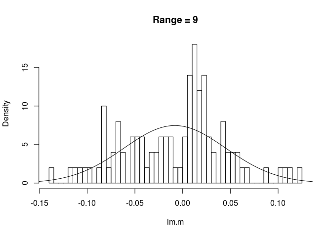
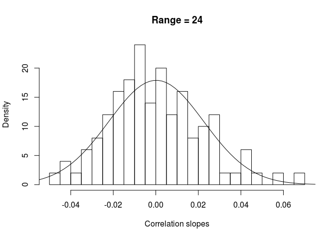
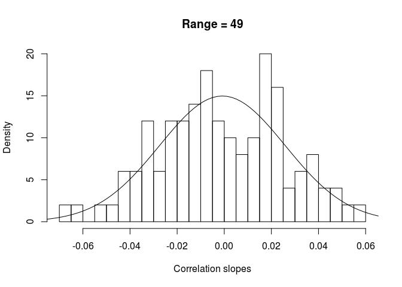
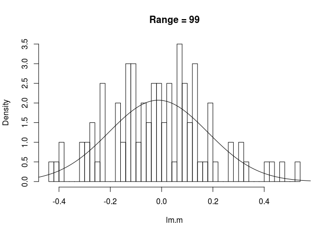
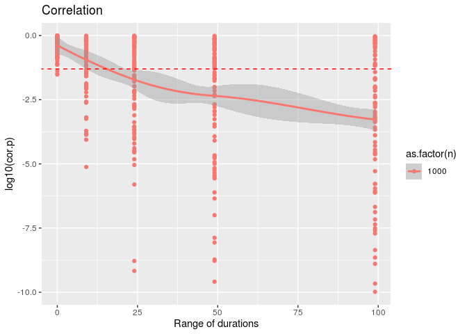
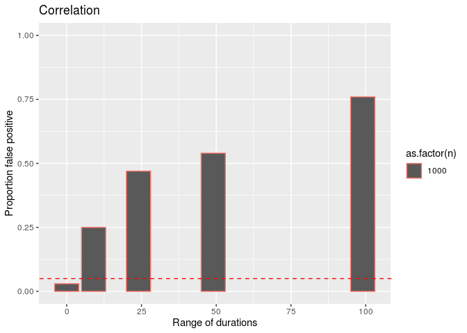
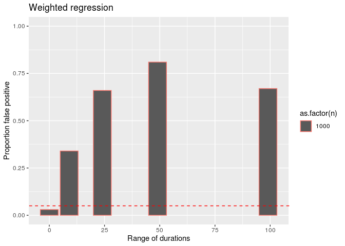
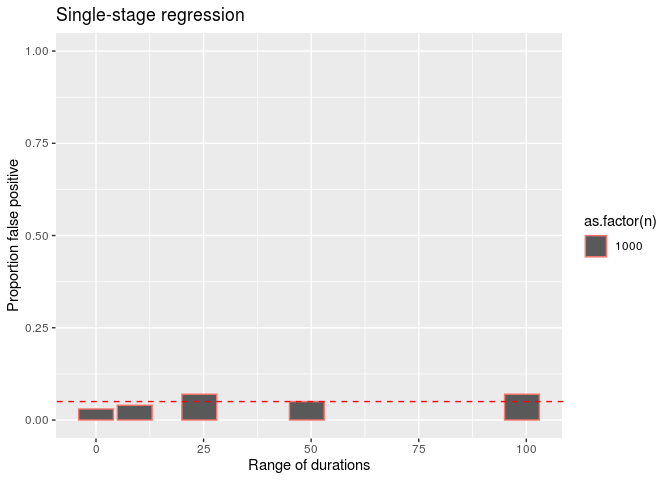

Demonstration of the correlation generated by similar durations
================

    ## Loading required package: data.table

    ## Loading required package: ggplot2

    ## Loading required package: ggpubr

    ## here() starts at /local/home/malinp/climate_community_crossrealm

# Plot an example

``` r
set.seed(5)
slope <- function(x){
    mod <- lm(x ~ I(1:length(x)))
    return(as.numeric(coef(mod)[2]))
}
slopese <- function(x){
    mod <- lm(x ~ I(1:length(x)))
    return(as.numeric(sqrt(diag(vcov(mod)))[2]))
}

dat <- data.table(tsid = rep(1:1000, rep(3:102, 1000/100)))
dat[, ':='(value1 = rnorm(.N), value2 = rnorm(.N))]
dat[, ':='(slope1 = slope(value1), slope2 = slope(value2),
                  se1 = slopese(value1), se2 = slopese(value2)), by = tsid]
slopes <- dat[, .(slope1 = slope(value1), slope2 = slope(value2),
                  se1 = slopese(value1), se2 = slopese(value2)), by = tsid]

slopes[, cor.test(slope1, slope2)] # a problem with simple correlation
```

    ## 
    ##  Pearson's product-moment correlation
    ## 
    ## data:  slope1 and slope2
    ## t = -4.5746, df = 998, p-value = 5.37e-06
    ## alternative hypothesis: true correlation is not equal to 0
    ## 95 percent confidence interval:
    ##  -0.20349773 -0.08204847
    ## sample estimates:
    ##        cor 
    ## -0.1433126

``` r
slopes[, summary(lm(slope1 ~ slope2, weights = 1/se1))] # not solved by weighting (though p is marginal)
```

    ## 
    ## Call:
    ## lm(formula = slope1 ~ slope2, weights = 1/se1)
    ## 
    ## Weighted Residuals:
    ##     Min      1Q  Median      3Q     Max 
    ## -2.7917 -0.0779 -0.0029  0.0699  3.5912 
    ## 
    ## Coefficients:
    ##               Estimate Std. Error t value Pr(>|t|)  
    ## (Intercept) -0.0005493  0.0007188  -0.764   0.4449  
    ## slope2      -0.0601872  0.0314494  -1.914   0.0559 .
    ## ---
    ## Signif. codes:  0 '***' 0.001 '**' 0.01 '*' 0.05 '.' 0.1 ' ' 1
    ## 
    ## Residual standard error: 0.2526 on 998 degrees of freedom
    ## Multiple R-squared:  0.003656,   Adjusted R-squared:  0.002658 
    ## F-statistic: 3.663 on 1 and 998 DF,  p-value: 0.05593

``` r
slopes[, summary(glmmTMB(slope1 ~ slope2, disp=~se1))] # not solved by glmmTMB and dispersion
```

    ##  Family: gaussian  ( identity )
    ## Formula:          slope1 ~ slope2
    ## Dispersion:              ~se1
    ## 
    ##      AIC      BIC   logLik deviance df.resid 
    ##  -4046.4  -4026.8   2027.2  -4054.4      996 
    ## 
    ## 
    ## Conditional model:
    ##               Estimate Std. Error z value Pr(>|z|)    
    ## (Intercept) -0.0007022  0.0006432  -1.092    0.275    
    ## slope2       0.1511925  0.0318564   4.746 2.07e-06 ***
    ## ---
    ## Signif. codes:  0 '***' 0.001 '**' 0.01 '*' 0.05 '.' 0.1 ' ' 1
    ## 
    ## Dispersion model:
    ##             Estimate Std. Error z value Pr(>|z|)    
    ## (Intercept) -8.34157    0.07535  -110.7   <2e-16 ***
    ## se1         40.42136    1.69152    23.9   <2e-16 ***
    ## ---
    ## Signif. codes:  0 '***' 0.001 '**' 0.01 '*' 0.05 '.' 0.1 ' ' 1

``` r
dat[, summary(glmmTMB(value1 ~ slope2 + (1|tsid)))] # maybe addressed by a one-stage model
```

    ##  Family: gaussian  ( identity )
    ## Formula:          value1 ~ slope2 + (1 | tsid)
    ## 
    ##      AIC      BIC   logLik deviance df.resid 
    ## 149951.2 149986.7 -74971.6 149943.2    52496 
    ## 
    ## Random effects:
    ## 
    ## Conditional model:
    ##  Groups   Name        Variance  Std.Dev. 
    ##  tsid     (Intercept) 9.210e-09 9.597e-05
    ##  Residual             1.018e+00 1.009e+00
    ## Number of obs: 52500, groups:  tsid, 1000
    ## 
    ## Dispersion estimate for gaussian family (sigma^2): 1.02 
    ## 
    ## Conditional model:
    ##              Estimate Std. Error z value Pr(>|z|)
    ## (Intercept) -0.002778   0.004404  -0.631    0.528
    ## slope2      -0.055135   0.145438  -0.379    0.705

``` r
slopes[, plot(slope1, slope2)]
```

<!-- -->

    ## NULL

# False positive analysis

Generate pairs of random time-series and correlate the slopes.
Time-series have a fixed length or a variety of lengths from 3 to 100
steps. Do this many times to check for false-positive correlations using
cor.test and a one-stage mixed-effects analysis.

``` r
if(file.exists(here('output', 'simulated_ts.csv.gz'))){
    cors <- fread(here('output', 'simulated_ts.csv.gz'))
} else {
    set.seed(5)
    nreps <- 100 # number of datasets
    
    cors <- data.table(n = 1000, minduration = rep(c(10,3,3,3,3), nreps), maxduration = rep(c(10, 12, 27, 52, 102), nreps), cor.p = NA_real_, cor.cor = NA_real_, lm.m = NA_real_,
                       glmmwgt.p = NA_real_, glmmwgt.beta = NA_real_, glmmone.p = NA_real_, glmmone.beta = NA_real_) # holds the summaries from each dataset. use n = 1000 timeseries per dataset.
    #cors2 <- copy(cors)
    #cors2[, n:=10000] # add another run with 10k timeseries per dataset
    #cors <- rbind(cors, cors2) 
    #rm(cors2)
    
    pb <- txtProgressBar(min = 0, max = nrow(cors), style = 3) # progress bar
    
    for(i in 1:nrow(cors)){
        # make datasets with timeseries of all the same length
        if(cors[i, minduration == maxduration]){
            len <- cors[i, minduration]
            dat <- data.table(tsid = rep(1:cors[i,n], rep(len, cors[i,n])), index = rep(1:len, cors[i,n]), value1 = rnorm(len*cors[i,n]), value2 = rnorm(len*cors[i,n]))
        }
        
        # variable length timeseries
        if(cors[i, minduration != maxduration]){
            mind <- cors[i, minduration]
            maxd <- cors[i, maxduration]
            ndur <- maxd - mind + 1
            dat <- data.table(tsid = rep(1:cors[i,n], rep(mind:maxd, cors[i,n]/ndur)))
            dat[, ':='(value1 = rnorm(.N), value2 = rnorm(.N))]
        }
        
        # calc slopes
        dat[, slope2 := slope(value2), by = tsid]
        slopes <- dat[, .(slope1 = slope(value1), slope2 = slope(value2), se1 = slopese(value1)), by = tsid]
        
        # statistical tests
        test <- slopes[, cor.test(slope1, slope2)] # a pearson correlation
        test2 <- slopes[, coef(lm(slope1 ~ slope2))[2]] # a simple regression
        test3 <- slopes[, summary(glmmTMB(slope1 ~ slope2, disp=~se1))$coefficients$cond] # glmmTMB and dispersion
        test4 <- dat[, summary(glmmTMB(value1 ~ value2 + (1|tsid)))$coefficients$cond] # the coef summary from a one-stage model
        cors[i, ':='(cor.p = test$p.value, cor.cor = test$estimate, lm.m = test2, glmmwgt.p = test3[2,4], glmmwgt.beta = test3[2,1], glmmone.p = test4[2,4], glmmone.beta = test4[2,1])]    
        setTxtProgressBar(pb, i)
    }
    close(pb)
    
    cors[, name := paste0(minduration, '-', maxduration)]
    cors[, range := maxduration - minduration]
    
    write.csv(cors, gzfile(here('output', 'simulated_ts.csv.gz')), row.names = FALSE)
}
```

# Plot the results

Only the one-stage regression appears to have a reasonable
false-positive rate.

``` r
ylims = c(-10, 0)
normparms <- cors[, .(mean = mean(lm.m), sd = sd(lm.m)), by = range] # parameters for Gaussian curves on each histogram
x <- seq(-1,1,length.out = 1000)

cors[range == 0, hist(lm.m, breaks = 40, main = 'Range = 0', freq = FALSE)]; normparms[range == 0, lines(x, dnorm(x,mean, sd))]
```

    ## $breaks
    ##  [1] -0.075 -0.070 -0.065 -0.060 -0.055 -0.050 -0.045 -0.040 -0.035 -0.030
    ## [11] -0.025 -0.020 -0.015 -0.010 -0.005  0.000  0.005  0.010  0.015  0.020
    ## [21]  0.025  0.030  0.035  0.040  0.045  0.050  0.055  0.060  0.065  0.070
    ## 
    ## $counts
    ##  [1]  1  1  1  0  1  3  2  3  3  2  7  5  4  2  8  9 10  7  8  2  6  3  2  2  5
    ## [26]  1  0  1  1
    ## 
    ## $density
    ##  [1]  2  2  2  0  2  6  4  6  6  4 14 10  8  4 16 18 20 14 16  4 12  6  4  4 10
    ## [26]  2  0  2  2
    ## 
    ## $mids
    ##  [1] -0.0725 -0.0675 -0.0625 -0.0575 -0.0525 -0.0475 -0.0425 -0.0375 -0.0325
    ## [10] -0.0275 -0.0225 -0.0175 -0.0125 -0.0075 -0.0025  0.0025  0.0075  0.0125
    ## [19]  0.0175  0.0225  0.0275  0.0325  0.0375  0.0425  0.0475  0.0525  0.0575
    ## [28]  0.0625  0.0675
    ## 
    ## $xname
    ## [1] "lm.m"
    ## 
    ## $equidist
    ## [1] TRUE
    ## 
    ## attr(,"class")
    ## [1] "histogram"

<!-- -->

    ## NULL

``` r
cors[range == 9, hist(lm.m, breaks = 40, main = 'Range = 9', freq = FALSE)]; normparms[range == 9, lines(x, dnorm(x,mean, sd))]
```

    ## $breaks
    ##  [1] -0.140 -0.135 -0.130 -0.125 -0.120 -0.115 -0.110 -0.105 -0.100 -0.095
    ## [11] -0.090 -0.085 -0.080 -0.075 -0.070 -0.065 -0.060 -0.055 -0.050 -0.045
    ## [21] -0.040 -0.035 -0.030 -0.025 -0.020 -0.015 -0.010 -0.005  0.000  0.005
    ## [31]  0.010  0.015  0.020  0.025  0.030  0.035  0.040  0.045  0.050  0.055
    ## [41]  0.060  0.065  0.070  0.075  0.080  0.085  0.090  0.095  0.100  0.105
    ## [51]  0.110  0.115  0.120  0.125
    ## 
    ## $counts
    ##  [1] 1 0 0 0 1 1 1 1 1 0 1 5 1 2 4 2 0 3 3 3 1 2 2 3 3 3 1 1 3 7 9 6 7 3 2 0 4 2
    ## [39] 2 2 1 1 0 0 0 1 0 0 1 1 1 0 1
    ## 
    ## $density
    ##  [1]  2  0  0  0  2  2  2  2  2  0  2 10  2  4  8  4  0  6  6  6  2  4  4  6  6
    ## [26]  6  2  2  6 14 18 12 14  6  4  0  8  4  4  4  2  2  0  0  0  2  0  0  2  2
    ## [51]  2  0  2
    ## 
    ## $mids
    ##  [1] -0.1375 -0.1325 -0.1275 -0.1225 -0.1175 -0.1125 -0.1075 -0.1025 -0.0975
    ## [10] -0.0925 -0.0875 -0.0825 -0.0775 -0.0725 -0.0675 -0.0625 -0.0575 -0.0525
    ## [19] -0.0475 -0.0425 -0.0375 -0.0325 -0.0275 -0.0225 -0.0175 -0.0125 -0.0075
    ## [28] -0.0025  0.0025  0.0075  0.0125  0.0175  0.0225  0.0275  0.0325  0.0375
    ## [37]  0.0425  0.0475  0.0525  0.0575  0.0625  0.0675  0.0725  0.0775  0.0825
    ## [46]  0.0875  0.0925  0.0975  0.1025  0.1075  0.1125  0.1175  0.1225
    ## 
    ## $xname
    ## [1] "lm.m"
    ## 
    ## $equidist
    ## [1] TRUE
    ## 
    ## attr(,"class")
    ## [1] "histogram"

<!-- -->

    ## NULL

``` r
cors[range == 24, hist(lm.m, breaks = 40, main = 'Range = 24', freq = FALSE)]; normparms[range == 24, lines(x, dnorm(x,mean, sd))]
```

    ## $breaks
    ##  [1] -0.19 -0.18 -0.17 -0.16 -0.15 -0.14 -0.13 -0.12 -0.11 -0.10 -0.09 -0.08
    ## [13] -0.07 -0.06 -0.05 -0.04 -0.03 -0.02 -0.01  0.00  0.01  0.02  0.03  0.04
    ## [25]  0.05  0.06  0.07  0.08  0.09  0.10  0.11  0.12  0.13  0.14  0.15  0.16
    ## [37]  0.17  0.18  0.19  0.20
    ## 
    ## $counts
    ##  [1] 2 0 1 0 1 2 1 3 2 4 2 2 2 7 2 2 5 5 8 5 6 3 5 3 2 3 4 4 3 1 2 1 3 1 0 0 2 0
    ## [39] 1
    ## 
    ## $density
    ##  [1] 2 0 1 0 1 2 1 3 2 4 2 2 2 7 2 2 5 5 8 5 6 3 5 3 2 3 4 4 3 1 2 1 3 1 0 0 2 0
    ## [39] 1
    ## 
    ## $mids
    ##  [1] -0.185 -0.175 -0.165 -0.155 -0.145 -0.135 -0.125 -0.115 -0.105 -0.095
    ## [11] -0.085 -0.075 -0.065 -0.055 -0.045 -0.035 -0.025 -0.015 -0.005  0.005
    ## [21]  0.015  0.025  0.035  0.045  0.055  0.065  0.075  0.085  0.095  0.105
    ## [31]  0.115  0.125  0.135  0.145  0.155  0.165  0.175  0.185  0.195
    ## 
    ## $xname
    ## [1] "lm.m"
    ## 
    ## $equidist
    ## [1] TRUE
    ## 
    ## attr(,"class")
    ## [1] "histogram"

<!-- -->

    ## NULL

``` r
cors[range == 49, hist(lm.m, breaks = 40, main = 'Range = 49', freq = FALSE)]; normparms[range == 49, lines(x, dnorm(x,mean, sd))]
```

    ## $breaks
    ##  [1] -0.34 -0.32 -0.30 -0.28 -0.26 -0.24 -0.22 -0.20 -0.18 -0.16 -0.14 -0.12
    ## [13] -0.10 -0.08 -0.06 -0.04 -0.02  0.00  0.02  0.04  0.06  0.08  0.10  0.12
    ## [25]  0.14  0.16  0.18  0.20  0.22  0.24  0.26  0.28
    ## 
    ## $counts
    ##  [1]  1  1  0  0  0  0  1  0  2  6  0  4  3  5  8  4  5  8 10 10  4  2  3  6  2
    ## [26]  2  8  2  1  1  1
    ## 
    ## $density
    ##  [1] 0.5 0.5 0.0 0.0 0.0 0.0 0.5 0.0 1.0 3.0 0.0 2.0 1.5 2.5 4.0 2.0 2.5 4.0 5.0
    ## [20] 5.0 2.0 1.0 1.5 3.0 1.0 1.0 4.0 1.0 0.5 0.5 0.5
    ## 
    ## $mids
    ##  [1] -0.33 -0.31 -0.29 -0.27 -0.25 -0.23 -0.21 -0.19 -0.17 -0.15 -0.13 -0.11
    ## [13] -0.09 -0.07 -0.05 -0.03 -0.01  0.01  0.03  0.05  0.07  0.09  0.11  0.13
    ## [25]  0.15  0.17  0.19  0.21  0.23  0.25  0.27
    ## 
    ## $xname
    ## [1] "lm.m"
    ## 
    ## $equidist
    ## [1] TRUE
    ## 
    ## attr(,"class")
    ## [1] "histogram"

<!-- -->

    ## NULL

``` r
cors[range == 99, hist(lm.m, breaks = 40, main = 'Range = 99', freq = FALSE)]; normparms[range == 99, lines(x, dnorm(x,mean, sd))]
```

    ## $breaks
    ##  [1] -0.44 -0.42 -0.40 -0.38 -0.36 -0.34 -0.32 -0.30 -0.28 -0.26 -0.24 -0.22
    ## [13] -0.20 -0.18 -0.16 -0.14 -0.12 -0.10 -0.08 -0.06 -0.04 -0.02  0.00  0.02
    ## [25]  0.04  0.06  0.08  0.10  0.12  0.14  0.16  0.18  0.20  0.22  0.24  0.26
    ## [37]  0.28  0.30  0.32  0.34  0.36  0.38  0.40  0.42  0.44  0.46  0.48  0.50
    ## [49]  0.52  0.54
    ## 
    ## $counts
    ##  [1] 1 1 2 0 0 0 2 2 3 1 5 0 0 4 2 6 6 2 4 3 5 5 3 5 1 7 5 3 6 1 1 4 1 0 0 2 0 2
    ## [39] 1 0 0 0 1 1 0 1 0 0 1
    ## 
    ## $density
    ##  [1] 0.5 0.5 1.0 0.0 0.0 0.0 1.0 1.0 1.5 0.5 2.5 0.0 0.0 2.0 1.0 3.0 3.0 1.0 2.0
    ## [20] 1.5 2.5 2.5 1.5 2.5 0.5 3.5 2.5 1.5 3.0 0.5 0.5 2.0 0.5 0.0 0.0 1.0 0.0 1.0
    ## [39] 0.5 0.0 0.0 0.0 0.5 0.5 0.0 0.5 0.0 0.0 0.5
    ## 
    ## $mids
    ##  [1] -0.43 -0.41 -0.39 -0.37 -0.35 -0.33 -0.31 -0.29 -0.27 -0.25 -0.23 -0.21
    ## [13] -0.19 -0.17 -0.15 -0.13 -0.11 -0.09 -0.07 -0.05 -0.03 -0.01  0.01  0.03
    ## [25]  0.05  0.07  0.09  0.11  0.13  0.15  0.17  0.19  0.21  0.23  0.25  0.27
    ## [37]  0.29  0.31  0.33  0.35  0.37  0.39  0.41  0.43  0.45  0.47  0.49  0.51
    ## [49]  0.53
    ## 
    ## $xname
    ## [1] "lm.m"
    ## 
    ## $equidist
    ## [1] TRUE
    ## 
    ## attr(,"class")
    ## [1] "histogram"

<!-- -->

    ## NULL

``` r
ggplot(cors, aes(range, log10(cor.p), group = as.factor(n), color = as.factor(n))) +
           geom_point() +
           geom_smooth() +
           labs(x = 'Range of durations', title = 'Correlation') +
           lims(y = ylims) +
           geom_abline(intercept = log10(0.05), slope = 0, linetype = 'dashed', color = 'red')
```

    ## `geom_smooth()` using method = 'loess' and formula 'y ~ x'

    ## Warning: Removed 36 rows containing non-finite values (stat_smooth).

    ## Warning: Removed 36 rows containing missing values (geom_point).

<!-- -->

``` r
ggplot(cors[, .(prop = sum(cor.p < 0.05)/length(cor.p)), by = c("range", "n")], 
             aes(range, prop, group = as.factor(n), color = as.factor(n))) +
    geom_col(position = "dodge") +
    labs(x = 'Range of durations', title = 'Correlation', y = 'Proportion false positive') +
    lims(y = c(0,1)) +
    geom_abline(intercept = 0.05, slope = 0, linetype = 'dashed', color = 'red')
```

<!-- -->

``` r
ggplot(cors[, .(prop = sum(glmmwgt.p < 0.05)/length(glmmwgt.p)), by = c("range", "n")], 
             aes(range, prop, group = as.factor(n), color = as.factor(n))) +
    geom_col(position = "dodge") +
    labs(x = 'Range of durations', title = 'Weighted regression', y = 'Proportion false positive') +
    lims(y = c(0,1)) +
    geom_abline(intercept = 0.05, slope = 0, linetype = 'dashed', color = 'red')
```

<!-- -->

``` r
ggplot(cors[, .(prop = sum(glmmone.p < 0.05)/length(glmmone.p)), by = c("range", "n")], 
             aes(range, prop, group = as.factor(n), color = as.factor(n))) +
    geom_col(position = "dodge") +
    labs(x = 'Range of durations', title = 'Single-stage regression', y = 'Proportion false positive') +
    lims(y = c(0,1)) +
    geom_abline(intercept = 0.05, slope = 0, linetype = 'dashed', color = 'red')
```

<!-- -->
