Demonstration of the correlation generated by similar durations
================

    ## Loading required package: data.table

    ## Loading required package: ggplot2

    ## Loading required package: ggpubr

    ## here() starts at /local/home/malinp/climate_community_crossrealm

    ## Loading required package: nlme

    ## This is mgcv 1.8-26. For overview type 'help("mgcv-package")'.

# Plot an example of false positives

Dataset is 1000 timeseries of differing durations from 3 to 102
observations through time. The response variable is positively related
to time (random slope 0.005 to 0.01) with Gaussian noise and an
inverse-logit transform to constrain it to 0-1. The explanatory
variables are time and the slope of a Gaussian time-series of the same
durations. Time but not the slope should be related to the response.  
Two-stage regressions have a false positive.  
One-stage regression may as well.  
The shorter response time-series have steeper slopes (2nd to last
graph), probably because the slope of the response vs. time is great
enough to hit 1 often in longer ts. Shorter time-series do have steeper
slopes if the response hits 1 less often (e.g., if random slopes only go
up to 0.01).  
The shorter explanatory time-series have steeper abs(slopes), also as
expected (last graph).

``` r
set.seed(5)
slope <- function(x){
    mod <- lm(x ~ I(1:length(x)))
    return(as.numeric(coef(mod)[2]))
}
slopese <- function(x){
    mod <- lm(x ~ I(1:length(x)))
    return(as.numeric(sqrt(diag(vcov(mod)))[2]))
}

dat <- data.table(tsid = rep(1:1000, rep(3:102, 1000/100)))
dat[, ':='(obsid = 1:.N, tslope = runif(1, 0.005, 0.1)), by = tsid] # add time counter and a random slope for each tsid
dat[, ':='(value1.logit = obsid*tslope + rnorm(.N), value2 = rnorm(.N))] # create random ts. value1 has a positive slope like dissimilarites and is on a logit scale.
dat[, value1 := exp(value1.logit)/(exp(value1.logit)+1)] # inverse-logit for value 1
dat[, ':='(slope2_abs = abs(slope(value2)), duration = .N), by = tsid] # explanatory slopes for one-stage model
slopes <- dat[, .(slope1 = slope(value1), slope2_abs = abs(slope(value2)),
                  se1 = slopese(value1), duration = .N), by = tsid]

print('CORRELATION TEST')
```

    ## [1] "CORRELATION TEST"

``` r
slopes[, cor.test(slope1, slope2_abs)] # a problem with simple correlation in this example
```

    ## 
    ##  Pearson's product-moment correlation
    ## 
    ## data:  slope1 and slope2_abs
    ## t = 0.97629, df = 998, p-value = 0.3292
    ## alternative hypothesis: true correlation is not equal to 0
    ## 95 percent confidence interval:
    ##  -0.03116360  0.09270472
    ## sample estimates:
    ##        cor 
    ## 0.03088916

``` r
print('WEIGHTED REGRESSION')
```

    ## [1] "WEIGHTED REGRESSION"

``` r
slopes[, summary(lm(slope1 ~ slope2_abs, weights = 1/se1))] # problem not solved by weighting
```

    ## 
    ## Call:
    ## lm(formula = slope1 ~ slope2_abs, weights = 1/se1)
    ## 
    ## Weighted Residuals:
    ##      Min       1Q   Median       3Q      Max 
    ## -2.50426 -0.04760  0.00592  0.06928  1.06554 
    ## 
    ## Coefficients:
    ##              Estimate Std. Error t value Pr(>|t|)    
    ## (Intercept) 0.0053075  0.0001703  31.161  < 2e-16 ***
    ## slope2_abs  0.0314444  0.0062528   5.029 5.85e-07 ***
    ## ---
    ## Signif. codes:  0 '***' 0.001 '**' 0.01 '*' 0.05 '.' 0.1 ' ' 1
    ## 
    ## Residual standard error: 0.1523 on 998 degrees of freedom
    ## Multiple R-squared:  0.02471,    Adjusted R-squared:  0.02374 
    ## F-statistic: 25.29 on 1 and 998 DF,  p-value: 5.847e-07

``` r
print('WEIGHTED GLMM')
```

    ## [1] "WEIGHTED GLMM"

``` r
slopes[, summary(glmmTMB(slope1 ~ slope2_abs, disp=~se1))] # not solved by glmmTMB and dispersion
```

    ##  Family: gaussian  ( identity )
    ## Formula:          slope1 ~ slope2_abs
    ## Dispersion:              ~se1
    ## 
    ##      AIC      BIC   logLik deviance df.resid 
    ##  -6775.6  -6756.0   3391.8  -6783.6      996 
    ## 
    ## 
    ## Conditional model:
    ##              Estimate Std. Error z value Pr(>|z|)    
    ## (Intercept) 0.0055794  0.0001524   36.61   <2e-16 ***
    ## slope2_abs  0.0512453  0.0049206   10.41   <2e-16 ***
    ## ---
    ## Signif. codes:  0 '***' 0.001 '**' 0.01 '*' 0.05 '.' 0.1 ' ' 1
    ## 
    ## Dispersion model:
    ##              Estimate Std. Error z value Pr(>|z|)    
    ## (Intercept) -11.31682    0.09252 -122.32   <2e-16 ***
    ## se1         256.91214   12.27397   20.93   <2e-16 ***
    ## ---
    ## Signif. codes:  0 '***' 0.001 '**' 0.01 '*' 0.05 '.' 0.1 ' ' 1

``` r
print('ONE-STAGE GLMM')
```

    ## [1] "ONE-STAGE GLMM"

``` r
dat[, summary(glmmTMB(value1 ~ obsid + obsid:slope2_abs + (obsid|tsid)))] # maybe addressed by a one-stage model
```

    ##  Family: gaussian  ( identity )
    ## Formula:          value1 ~ obsid + obsid:slope2_abs + (obsid | tsid)
    ## 
    ##      AIC      BIC   logLik deviance df.resid 
    ## -39390.1 -39328.0  19702.0 -39404.1    52493 
    ## 
    ## Random effects:
    ## 
    ## Conditional model:
    ##  Groups   Name        Variance  Std.Dev. Corr 
    ##  tsid     (Intercept) 4.775e-03 0.069099      
    ##           obsid       4.824e-06 0.002196 0.09 
    ##  Residual             2.581e-02 0.160659      
    ## Number of obs: 52500, groups:  tsid, 1000
    ## 
    ## Dispersion estimate for gaussian family (sigma^2): 0.0258 
    ## 
    ## Conditional model:
    ##                   Estimate Std. Error z value Pr(>|z|)    
    ## (Intercept)      0.5642604  0.0027000  208.99   <2e-16 ***
    ## obsid            0.0055032  0.0001089   50.54   <2e-16 ***
    ## obsid:slope2_abs 0.0165039  0.0075413    2.19   0.0286 *  
    ## ---
    ## Signif. codes:  0 '***' 0.001 '**' 0.01 '*' 0.05 '.' 0.1 ' ' 1

``` r
slopes[, plot(slope2_abs, slope1, main = 'Induced correlation of the slopes')]
```

<!-- -->

    ## NULL

``` r
dat[, .(max = max(value1), duration = duration), by = tsid][, plot(duration, max, main = 'Maximum value asymptote')]
```

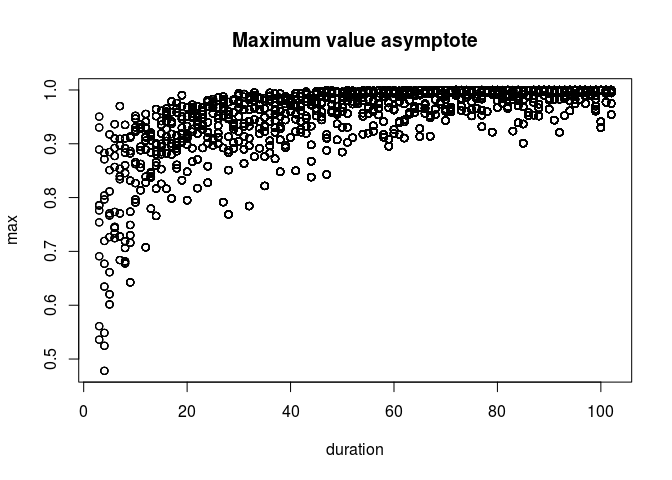<!-- -->

    ## NULL

``` r
ggplot(slopes, aes(duration, slope1)) +
    geom_point() +
    geom_smooth() +
    labs(title = 'Variance in slopes declines with duration')
```

    ## `geom_smooth()` using method = 'gam' and formula 'y ~ s(x, bs = "cs")'

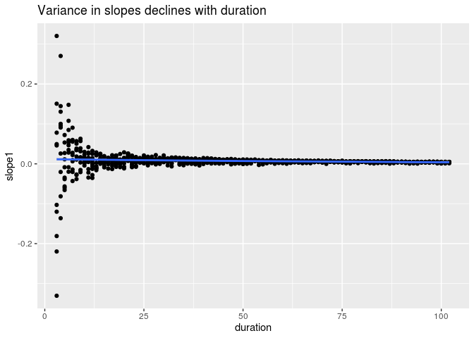<!-- -->

``` r
ggplot(slopes, aes(duration, slope1)) +
    geom_smooth() +
    labs(title = 'Average slope declines with duration (response variable)')
```

    ## `geom_smooth()` using method = 'gam' and formula 'y ~ s(x, bs = "cs")'

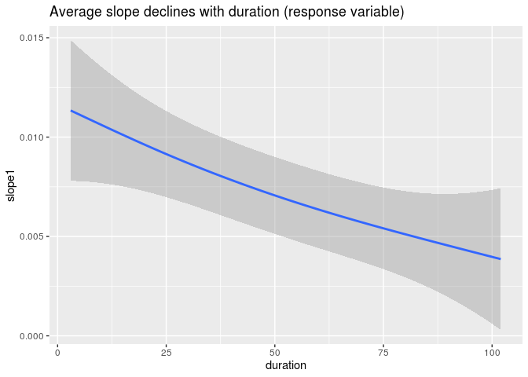<!-- -->

``` r
ggplot(slopes, aes(duration, slope2_abs)) +
    geom_smooth() +
    labs(title = 'Average slope declines with duration (explanatory variable')
```

    ## `geom_smooth()` using method = 'gam' and formula 'y ~ s(x, bs = "cs")'

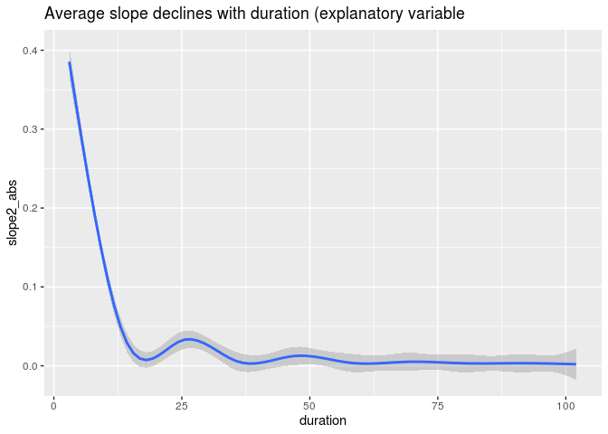<!-- -->

# Plot an example of true positives

Dataset is 1000 timeseries of differing durations from 3 to 102
observations through time. The response variable is positively related
to time (random slope 0.005 to 0.01) AND the explanatory variable (abs
value of Gaussian) with Gaussian noise and an inverse-logit transform to
constrain it to 0-1. The explanatory variables are time and the slope of
a Gaussian time-series of the same durations. Time and explanatory
variable should be related to the response.  
Two-stage regressions have a false positive.  
One-stage regression does not.

``` r
set.seed(5)
slope <- function(x){
    mod <- lm(x ~ I(1:length(x)))
    return(as.numeric(coef(mod)[2]))
}
slopese <- function(x){
    mod <- lm(x ~ I(1:length(x)))
    return(as.numeric(sqrt(diag(vcov(mod)))[2]))
}

dat <- data.table(tsid = rep(1:1000, rep(3:102, 1000/100)))
dat[, ':='(obsid = 1:.N, tslope = runif(1, 0.005, 0.1), value2 = rnorm(.N), duration = .N), by = tsid] # add time counter, a random temporal slope for each tsid, and a random explanatory slope
dat[, slope2_abs := abs(slope(value2)), by = tsid]
dat[, ':='(value1.logit = obsid*tslope + 0.5*tslope*obsid*slope2_abs + rnorm(.N))] # value1 has a positive slope like dissimilarites and is on a logit scale. Positively related to slope2.
dat[, value1 := exp(value1.logit)/(exp(value1.logit)+1)] # inverse-logit for value 1
slopes <- dat[, .(slope1 = slope(value1), slope2_abs = unique(slope2_abs),
                  se1 = slopese(value1), duration = .N), by = tsid]

print('CORRELATION TEST')
```

    ## [1] "CORRELATION TEST"

``` r
slopes[, cor.test(slope1, slope2_abs)] # a problem with simple correlation in this example
```

    ## 
    ##  Pearson's product-moment correlation
    ## 
    ## data:  slope1 and slope2_abs
    ## t = 7.2432, df = 998, p-value = 8.754e-13
    ## alternative hypothesis: true correlation is not equal to 0
    ## 95 percent confidence interval:
    ##  0.1637551 0.2815716
    ## sample estimates:
    ##       cor 
    ## 0.2234795

``` r
print('WEIGHTED REGRESSION')
```

    ## [1] "WEIGHTED REGRESSION"

``` r
slopes[, summary(lm(slope1 ~ slope2_abs, weights = 1/se1))] # problem not solved by weighting
```

    ## 
    ## Call:
    ## lm(formula = slope1 ~ slope2_abs, weights = 1/se1)
    ## 
    ## Weighted Residuals:
    ##      Min       1Q   Median       3Q      Max 
    ## -0.98411 -0.05209  0.00345  0.06051  1.08268 
    ## 
    ## Coefficients:
    ##             Estimate Std. Error t value Pr(>|t|)    
    ## (Intercept) 0.004775   0.000141   33.86   <2e-16 ***
    ## slope2_abs  0.128657   0.007430   17.32   <2e-16 ***
    ## ---
    ## Signif. codes:  0 '***' 0.001 '**' 0.01 '*' 0.05 '.' 0.1 ' ' 1
    ## 
    ## Residual standard error: 0.121 on 998 degrees of freedom
    ## Multiple R-squared:  0.231,  Adjusted R-squared:  0.2303 
    ## F-statistic: 299.9 on 1 and 998 DF,  p-value: < 2.2e-16

``` r
print('WEIGHTED GLMM')
```

    ## [1] "WEIGHTED GLMM"

``` r
slopes[, summary(glmmTMB(slope1 ~ slope2_abs, disp=~se1))] # not solved by glmmTMB and dispersion
```

    ##  Family: gaussian  ( identity )
    ## Formula:          slope1 ~ slope2_abs
    ## Dispersion:              ~se1
    ## 
    ##      AIC      BIC   logLik deviance df.resid 
    ##  -7270.6  -7251.0   3639.3  -7278.6      996 
    ## 
    ## 
    ## Conditional model:
    ##              Estimate Std. Error z value Pr(>|z|)    
    ## (Intercept) 0.0047281  0.0001429   33.08   <2e-16 ***
    ## slope2_abs  0.1829179  0.0078415   23.33   <2e-16 ***
    ## ---
    ## Signif. codes:  0 '***' 0.001 '**' 0.01 '*' 0.05 '.' 0.1 ' ' 1
    ## 
    ## Dispersion model:
    ##              Estimate Std. Error z value Pr(>|z|)    
    ## (Intercept) -11.49421    0.06727 -170.86   <2e-16 ***
    ## se1         192.27289    7.01364   27.41   <2e-16 ***
    ## ---
    ## Signif. codes:  0 '***' 0.001 '**' 0.01 '*' 0.05 '.' 0.1 ' ' 1

``` r
print('ONE-STAGE GLMM')
```

    ## [1] "ONE-STAGE GLMM"

``` r
dat[, summary(glmmTMB(value1 ~ obsid + obsid:slope2_abs + (obsid|tsid)))] # maybe addressed by a one-stage model
```

    ##  Family: gaussian  ( identity )
    ## Formula:          value1 ~ obsid + obsid:slope2_abs + (obsid | tsid)
    ## 
    ##      AIC      BIC   logLik deviance df.resid 
    ## -38119.5 -38057.4  19066.7 -38133.5    52493 
    ## 
    ## Random effects:
    ## 
    ## Conditional model:
    ##  Groups   Name        Variance  Std.Dev. Corr 
    ##  tsid     (Intercept) 4.586e-03 0.067716      
    ##           obsid       4.454e-06 0.002111 0.11 
    ##  Residual             2.650e-02 0.162782      
    ## Number of obs: 52500, groups:  tsid, 1000
    ## 
    ## Dispersion estimate for gaussian family (sigma^2): 0.0265 
    ## 
    ## Conditional model:
    ##                   Estimate Std. Error z value Pr(>|z|)    
    ## (Intercept)      0.5597352  0.0026743  209.30  < 2e-16 ***
    ## obsid            0.0055201  0.0001084   50.90  < 2e-16 ***
    ## obsid:slope2_abs 0.0213788  0.0073540    2.91  0.00365 ** 
    ## ---
    ## Signif. codes:  0 '***' 0.001 '**' 0.01 '*' 0.05 '.' 0.1 ' ' 1

``` r
ggplot(slopes, aes(slope2_abs, slope1, color = duration)) + geom_point() + geom_smooth()
```

    ## `geom_smooth()` using method = 'gam' and formula 'y ~ s(x, bs = "cs")'

<!-- -->

``` r
dat[, .(max = max(value1), duration = duration), by = tsid][, plot(duration, max)]
```

<!-- -->

    ## NULL

# False positive analysis

Generate pairs of random time-series and correlate the slopes.
Time-series have a fixed length or a variety of lengths from 3 to 102
steps. The response time-series is constrained 0-1. Do this many times
to check for false-positive correlations using cor.test, a weighted
linear regression, and a one-stage mixed-effects analysis with Gaussian
or Beta errors.

``` r
if(file.exists(here('output', 'simulated_ts.csv.gz'))){
    #cors <- fread(here('temp', 'simulated_ts_temp.csv.gz')) # the in-progress analysis
    cors <- fread(here('output', 'simulated_ts.csv.gz')) # the full analysis
} else {
    stop('Need to run duration_sim.R first.')
}
```

## Plot the results

Only the one-stage regression with beta errors appears to have a
reasonable false-positive rate.
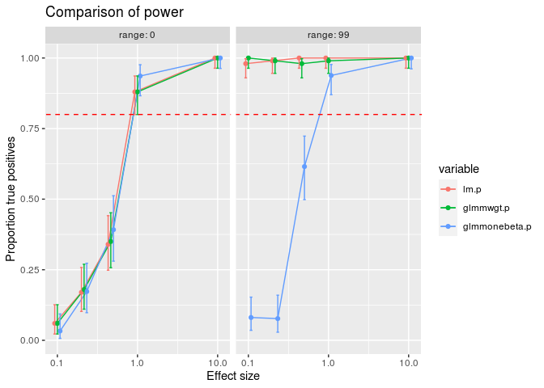<!-- -->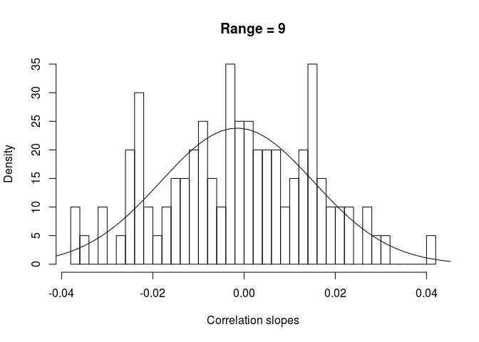<!-- -->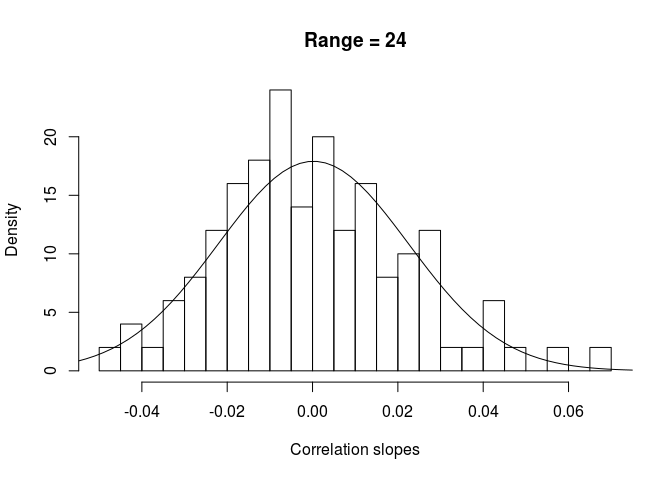<!-- -->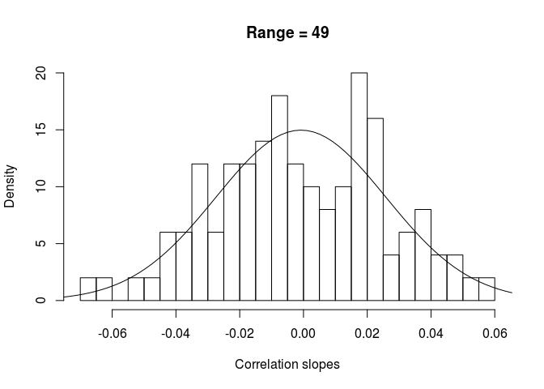<!-- -->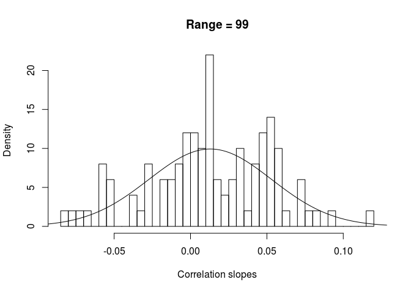<!-- -->

    ## Warning: Removed 44 rows containing non-finite values (stat_smooth).

    ## Warning: Removed 44 rows containing missing values (geom_point).

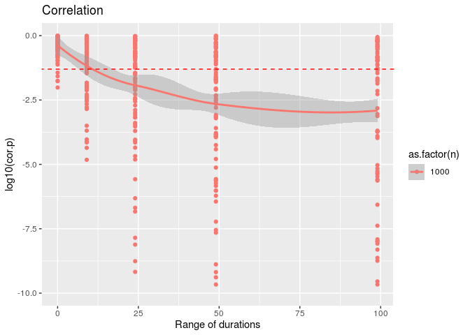<!-- -->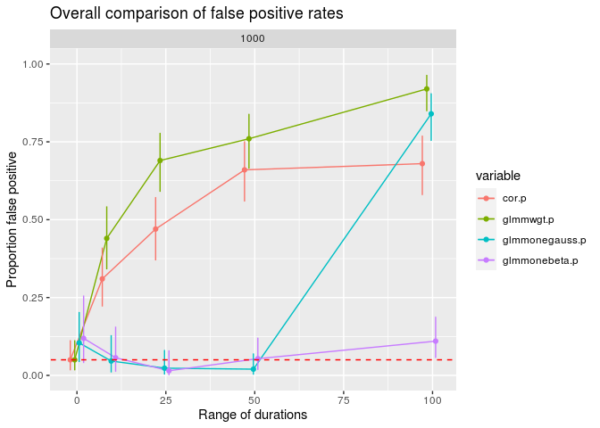<!-- -->

# Power analysis

NOT FINISHED  
and not evaluated

Generate pairs of correlated time-series with error and correlate the
slopes. Time-series have a fixed length or a variety of lengths from 3
to 102 steps. Do this many times to check for true positive rate with a
one-stage mixed-effects analysis.

``` r
if(file.exists(here('output', 'simulated_ts_power.csv.gz'))){
    corspower <- fread(here('output', 'simulated_ts_power.csv.gz'))
} else {
    set.seed(5)
    nreps <- 100 # number of datasets
    
    corspower <- data.table(n = 1000, minduration = rep(c(10,3), nreps), maxduration = rep(c(10, 102), nreps), beta = runif(2*nreps), glmmone.p = NA_real_, glmmone.beta = NA_real_) # holds the summaries from each dataset. use n = 1000 timeseries per dataset. beta is the true effect of slope2 on the response.
    #corspower2 <- copy(corspower)
    #corspower2[, n:=10000] # add another run with 10k timeseries per dataset
    #corspower <- rbind(corspower, corspower2) 
    #rm(corspower2)
    
    pb <- txtProgressBar(min = 0, max = nrow(corspower), style = 3) # progress bar
    
    for(i in 1:nrow(corspower)){
        # make datasets with timeseries of all the same length
        if(corspower[i, minduration == maxduration]){
            len <- corspower[i, minduration]
            dat <- data.table(tsid = rep(1:corspower[i,n], rep(len, corspower[i,n])), beta = corspower[i, beta])
        }
        
        # variable length timeseries
        if(corspower[i, minduration != maxduration]){
            mind <- corspower[i, minduration]
            maxd <- corspower[i, maxduration]
            ndur <- maxd - mind + 1
            dat <- data.table(tsid = rep(1:corspower[i,n], rep(mind:maxd, corspower[i,n]/ndur)))
        }

        # add response and explanatory variables
        dat[, ':='(obsid = 1:.N, tslope = runif(1, 0.005, 0.1), value2 = rnorm(.N), duration = .N), by = tsid] # add time counter, a random temporal slope for each tsid, and a random explanatory slope
        dat[, slope2_abs := abs(slope(value2)), by = tsid]
        dat[, ':='(value1.logit = obsid*tslope + beta*tslope*obsid*slope2_abs + rnorm(.N))] # value1 has a positive slope like dissimilarities and is on a logit scale. Positively related to slope2.
        dat[, value1 := exp(value1.logit)/(exp(value1.logit)+1)] # inverse logit-transform
        dat[, value1 := exp(value1.logit)/(exp(value1.logit)+1)] # inverse-logit for value 1

        # calc slopes
        dat[, slope2_abs := abs(slope(value2)), by = tsid]
        slopes <- dat[, .(slope1 = slope(value1), slope2_abs = unique(slope2_abs), se1 = slopese(value1)), by = tsid]
        
        # statistical tests
        test <- slopes[, cor.test(slope1, slope2_abs)] # a pearson correlation
        test2 <- slopes[, coef(lm(slope1 ~ slope2_abs))[2]] # a simple regression
        test3 <- slopes[, summary(glmmTMB(slope1 ~ slope2_abs, disp=~se1))$coefficients$cond] # glmmTMB and dispersion
        mod4 <- dat[, glmmTMB(value1 ~ obsid + obsid:slope2_abs + (obsid|tsid))] # the coef summary from a one-stage model
        if(mod4$fit$convergence==0){ # if the one-stage model converged
            test4 <- summary(mod4)$coefficients$cond
            corspower[i, ':='(cor.p = test$p.value, cor.cor = test$estimate, lm.m = test2, glmmwgt.p = test3[2,4], glmmwgt.beta = test3[2,1], glmmone.p = test4[3,4], glmmone.beta = test4[3,1])]    
        } else {  # if not converged
            corspower[i, ':='(cor.p = test$p.value, cor.cor = test$estimate, lm.m = test2, glmmwgt.p = test3[2,4], glmmwgt.beta = test3[2,1], glmmone.p = NA, glmmone.beta = NA)]    
        }
        
        setTxtProgressBar(pb, i)
    }
    close(pb)
    
    corspower[, name := paste0(minduration, '-', maxduration)]
    corspower[, range := maxduration - minduration]
    
    write.csv(corspower, gzfile(here('output', 'simulated_ts_power.csv.gz')), row.names = FALSE)
}
```
