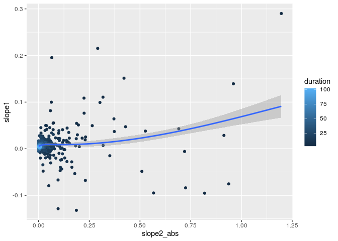
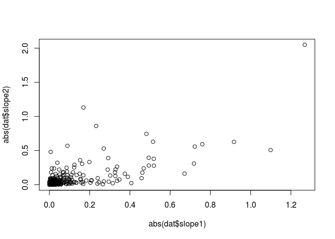
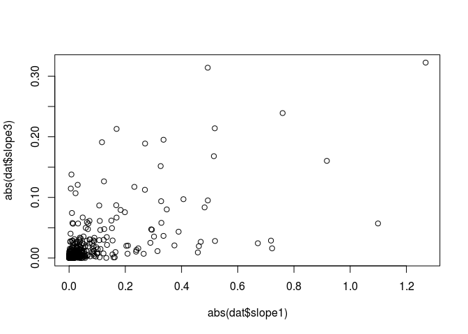
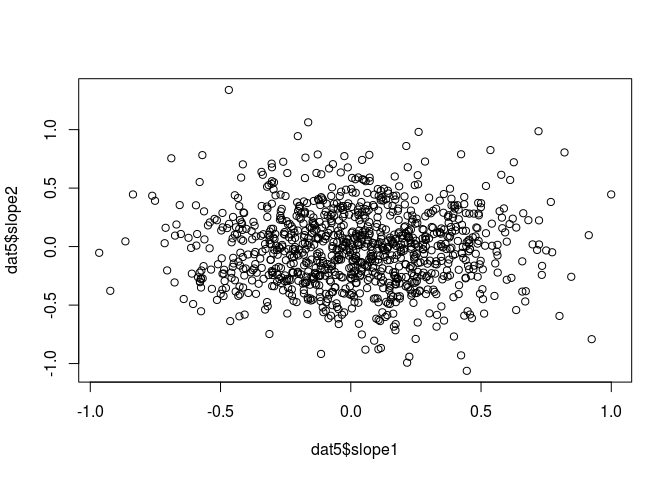
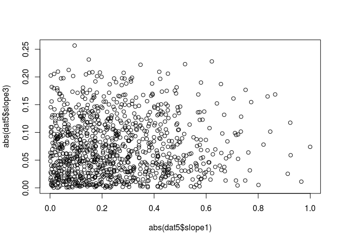
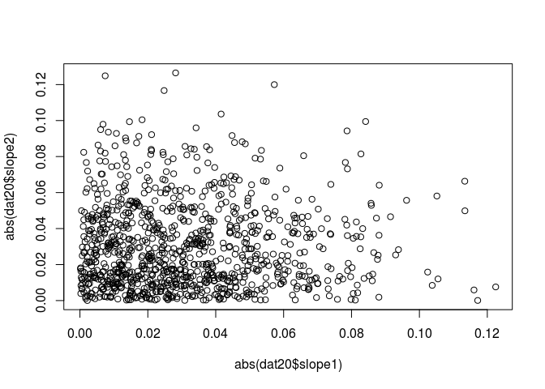

Demonstration of the correlation generated by similar durations
================

Generate pairs of random time-series and correlate the abs(slope).
Time-series have a random length 3 to 100 steps.

``` r
n <- 1000
dat <- data.frame(duration = sample(3:100, n, replace=TRUE), slope1 = NA_real_, slope2 = NA_real_)
dat5 <- data.frame(duration = rep(5, n), slope1 = NA_real_, slope2 = NA_real_) # fixed length
dat20 <- data.frame(duration = rep(20, n), slope1 = NA_real_, slope2 = NA_real_) # fixed length
for(i in 1:n){
    dat$slope1[i] <- coef(lm(I(rnorm(dat$duration[i])) ~ I(1:dat$duration[i])))[2]
    dat$slope2[i] <- coef(lm(I(rnorm(dat$duration[i])) ~ I(1:dat$duration[i])))[2]
    dat$slope3[i] <- coef(lm(I(runif(dat$duration[i])) ~ I(1:dat$duration[i])))[2] # draw from uniform 0-1

    dat5$slope1[i] <- coef(lm(I(rnorm(dat5$duration[i])) ~ I(1:dat5$duration[i])))[2]
    dat5$slope2[i] <- coef(lm(I(rnorm(dat5$duration[i])) ~ I(1:dat5$duration[i])))[2]
    dat5$slope3[i] <- coef(lm(I(runif(dat5$duration[i])) ~ I(1:dat5$duration[i])))[2] # draw from uniform 0-1

    dat20$slope1[i] <- coef(lm(I(rnorm(dat20$duration[i])) ~ I(1:dat20$duration[i])))[2]
    dat20$slope2[i] <- coef(lm(I(rnorm(dat20$duration[i])) ~ I(1:dat20$duration[i])))[2]
    dat20$slope3[i] <- coef(lm(I(runif(dat20$duration[i])) ~ I(1:dat20$duration[i])))[2] # draw from uniform 0-1
}
```

# Plot the slopes

``` r
plot(dat$slope1, dat$slope2)
```

<!-- -->

``` r
plot(abs(dat$slope1), abs(dat$slope2))
```

<!-- -->

``` r
plot(abs(dat$slope1), abs(dat$slope3))
```

<!-- -->

``` r
plot(dat5$slope1, dat5$slope2)
```

<!-- -->

``` r
plot(abs(dat5$slope1), abs(dat5$slope2))
```

<!-- -->

``` r
plot(abs(dat5$slope1), abs(dat5$slope3))
```

<!-- -->

``` r
plot(dat20$slope1, dat20$slope2)
```

<!-- -->

``` r
plot(abs(dat20$slope1), abs(dat20$slope2))
```

<!-- -->

``` r
plot(abs(dat20$slope1), abs(dat20$slope3))
```

<!-- -->

# Correlation of variable durations

Notice the strongly significant correlation when taking the absolute
value of the slope

``` r
cor.test(dat$slope1, dat$slope2)
```

    ## 
    ##  Pearson's product-moment correlation
    ## 
    ## data:  dat$slope1 and dat$slope2
    ## t = 9.1133, df = 998, p-value < 2.2e-16
    ## alternative hypothesis: true correlation is not equal to 0
    ## 95 percent confidence interval:
    ##  0.2189441 0.3334387
    ## sample estimates:
    ##       cor 
    ## 0.2771751

``` r
cor.test(abs(dat$slope1), abs(dat$slope2))
```

    ## 
    ##  Pearson's product-moment correlation
    ## 
    ## data:  abs(dat$slope1) and abs(dat$slope2)
    ## t = 33.647, df = 998, p-value < 2.2e-16
    ## alternative hypothesis: true correlation is not equal to 0
    ## 95 percent confidence interval:
    ##  0.6986068 0.7568157
    ## sample estimates:
    ##       cor 
    ## 0.7290266

``` r
cor.test(abs(dat$slope1), abs(dat$slope2))
```

    ## 
    ##  Pearson's product-moment correlation
    ## 
    ## data:  abs(dat$slope1) and abs(dat$slope2)
    ## t = 33.647, df = 998, p-value < 2.2e-16
    ## alternative hypothesis: true correlation is not equal to 0
    ## 95 percent confidence interval:
    ##  0.6986068 0.7568157
    ## sample estimates:
    ##       cor 
    ## 0.7290266

# Correlation of 5-step durations

Notice the induced correlation goes away.

``` r
cor.test(dat5$slope1, dat5$slope2)
```

    ## 
    ##  Pearson's product-moment correlation
    ## 
    ## data:  dat5$slope1 and dat5$slope2
    ## t = -0.25057, df = 998, p-value = 0.8022
    ## alternative hypothesis: true correlation is not equal to 0
    ## 95 percent confidence interval:
    ##  -0.06989005  0.05408835
    ## sample estimates:
    ##          cor 
    ## -0.007931328

``` r
cor.test(abs(dat5$slope1), abs(dat5$slope2))
```

    ## 
    ##  Pearson's product-moment correlation
    ## 
    ## data:  abs(dat5$slope1) and abs(dat5$slope2)
    ## t = 0.46278, df = 998, p-value = 0.6436
    ## alternative hypothesis: true correlation is not equal to 0
    ## 95 percent confidence interval:
    ##  -0.04738850  0.07657117
    ## sample estimates:
    ##        cor 
    ## 0.01464762

``` r
cor.test(abs(dat5$slope1), abs(dat5$slope2))
```

    ## 
    ##  Pearson's product-moment correlation
    ## 
    ## data:  abs(dat5$slope1) and abs(dat5$slope2)
    ## t = 0.46278, df = 998, p-value = 0.6436
    ## alternative hypothesis: true correlation is not equal to 0
    ## 95 percent confidence interval:
    ##  -0.04738850  0.07657117
    ## sample estimates:
    ##        cor 
    ## 0.01464762

# Correlation of 20-step durations

Notice the induced correlation goes away.

``` r
cor.test(dat20$slope1, dat20$slope2)
```

    ## 
    ##  Pearson's product-moment correlation
    ## 
    ## data:  dat20$slope1 and dat20$slope2
    ## t = -0.15482, df = 998, p-value = 0.877
    ## alternative hypothesis: true correlation is not equal to 0
    ## 95 percent confidence interval:
    ##  -0.06687351  0.05710968
    ## sample estimates:
    ##          cor 
    ## -0.004900748

``` r
cor.test(abs(dat20$slope1), abs(dat20$slope2))
```

    ## 
    ##  Pearson's product-moment correlation
    ## 
    ## data:  abs(dat20$slope1) and abs(dat20$slope2)
    ## t = -0.32744, df = 998, p-value = 0.7434
    ## alternative hypothesis: true correlation is not equal to 0
    ## 95 percent confidence interval:
    ##  -0.0723110  0.0516619
    ## sample estimates:
    ##         cor 
    ## -0.01036438

``` r
cor.test(abs(dat20$slope1), abs(dat20$slope2))
```

    ## 
    ##  Pearson's product-moment correlation
    ## 
    ## data:  abs(dat20$slope1) and abs(dat20$slope2)
    ## t = -0.32744, df = 998, p-value = 0.7434
    ## alternative hypothesis: true correlation is not equal to 0
    ## 95 percent confidence interval:
    ##  -0.0723110  0.0516619
    ## sample estimates:
    ##         cor 
    ## -0.01036438
