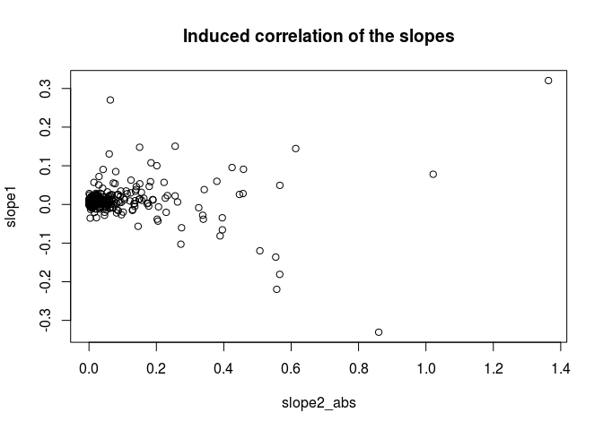
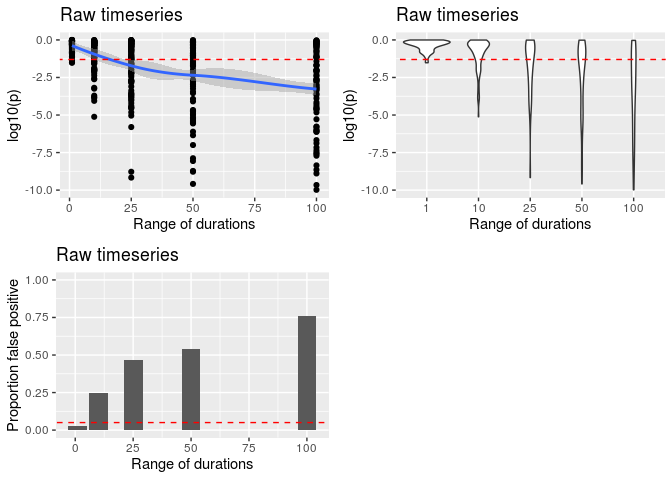

Demonstration of the correlation generated by similar durations
================

    ## Loading required package: data.table

    ## Loading required package: ggplot2

    ## Loading required package: ggpubr

    ## here() starts at /local/home/malinp/climate_community_crossrealm

# Plot an example

``` r
set.seed(5)
dat <- data.table(tsid = rep(1:1000, rep(3:102, 1000/100)))
dat[, ':='(value1 = rnorm(.N), value2 = rnorm(.N))]
slopes <- dat[, .(slope1 = as.numeric(coef(lm(value1 ~ I(1:length(value1)))))[2], slope2 = as.numeric(coef(lm(value2 ~ I(1:length(value2)))))[2]), by = tsid]

slopes[, cor.test(slope1, slope2)]
```

    ## 
    ##  Pearson's product-moment correlation
    ## 
    ## data:  slope1 and slope2
    ## t = -4.5746, df = 998, p-value = 5.37e-06
    ## alternative hypothesis: true correlation is not equal to 0
    ## 95 percent confidence interval:
    ##  -0.20349773 -0.08204847
    ## sample estimates:
    ##        cor 
    ## -0.1433126

``` r
slopes[, plot(slope1, slope2)]
```

<!-- -->

    ## NULL

# False positive analysis

Generate pairs of random time-series and correlate the slopes.
Time-series have a random length 3 to 100 steps.

``` r
if(file.exists(here('output', 'simulated_ts.csv.gz'))){
    cors <- fread(here('output', 'simulated_ts.csv.gz'))
} else {
    set.seed(5)
    n<- 1000 # number of timeseries per dataset
    nreps <- 100 # number of datasets
    
    cors <- data.table(minduration = rep(c(10,3,3,3,3), nreps), maxduration = rep(c(10, 12, 27, 52, 102), nreps), p = NA_real_, cor = NA_real_) # holds the summaries from each dataset
    pb <- txtProgressBar(min = 0, max = nrow(cors), style = 3) # progress bar
    
    for(i in 1:nrow(cors)){
        # make datasets with timeseries of all the same length
        if(cors[i, minduration == maxduration]){
            len <- cors[i, minduration]
            dat <- data.table(tsid = rep(1:n, rep(len, n)), index = rep(1:len, n), value1 = rnorm(len*n), value2 = rnorm(len*n))
        }
        
        # variable length timeseries
        if(cors[i, minduration != maxduration]){
            mind <- cors[i, minduration]
            maxd <- cors[i, maxduration]
            ndur <- maxd - mind + 1
            dat <- data.table(tsid = rep(1:n, rep(mind:maxd, n/ndur)))
            dat[, ':='(value1 = rnorm(.N), value2 = rnorm(.N))]
        }
        
        # calc slopes
        slopes <- dat[, .(slope1 = as.numeric(coef(lm(value1 ~ I(1:length(value1)))))[2], slope2 = as.numeric(coef(lm(value2 ~ I(1:length(value2)))))[2]), by = tsid]
        
        test <- slopes[, cor.test(slope1, slope2)]
        cors[i, ':='(p = test$p.value, cor = test$estimate)]    
        setTxtProgressBar(pb, i)
    }
    close(pb)
    
    cors[, name := paste0(minduration, '-', maxduration)]
    cors[, range := maxduration - minduration + 1]
    
    write.csv(cors, gzfile(here('output', 'simulated_ts.csv.gz')), row.names = FALSE)
}
```

# Plot the results

``` r
ylims = c(-10, 0)
p1 <- ggplot(cors, aes(range, log10(p))) +
           geom_point() +
           geom_smooth() +
           labs(x = 'Range of durations', title = 'Raw timeseries') +
           lims(y = ylims) +
           geom_abline(intercept = log10(0.05), slope = 0, linetype = 'dashed', color = 'red')

p2 <- ggplot(cors, aes(as.factor(range), log10(p))) +
           geom_violin() +
           labs(x = 'Range of durations', title = 'Raw timeseries') +
           lims(y = ylims) +
           geom_abline(intercept = log10(0.05), slope = 0, linetype = 'dashed', color = 'red')

p3 <- ggplot(cors[, .(prop = sum(p < 0.05)/length(p)), by = range], aes(range, prop)) +
    geom_col() +
    labs(x = 'Range of durations', title = 'Raw timeseries', y = 'Proportion false positive') +
    lims(y = c(0,1)) +
    geom_abline(intercept = 0.05, slope = 0, linetype = 'dashed', color = 'red')

ggarrange(p1, p2, p3, ncol = 2, nrow = 2)
```

    ## `geom_smooth()` using method = 'loess' and formula 'y ~ x'

    ## Warning: Removed 36 rows containing non-finite values (stat_smooth).

    ## Warning: Removed 36 rows containing missing values (geom_point).

    ## Warning: Removed 36 rows containing non-finite values (stat_ydensity).

<!-- -->
