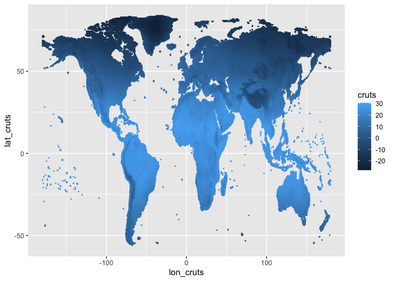
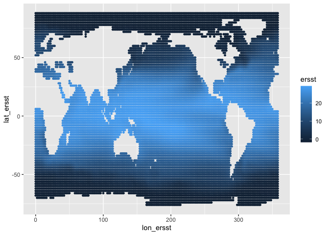
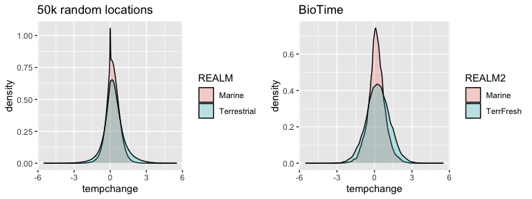

Sample global temperature dataset trends
================

``` r
require(data.table)
```

    ## Loading required package: data.table

``` r
require(ncdf4)
```

    ## Loading required package: ncdf4

``` r
require(ggplot2)
```

    ## Loading required package: ggplot2

``` r
require(gridExtra)
```

    ## Loading required package: gridExtra

``` r
knitr::opts_knit$set(root.dir = rprojroot::find_rstudio_root_file()) # tell RStudio to use project root directory as the root for this notebook. Needed since we are storing code in a separate directory.
```

# Read in BioTime and temperature data

Using average daily temperature by month from CRU TS Using average
temperature by month from ERSST. NOAA\_ERSST\_V5 data provided by the
NOAA/OAR/ESRL PSD, Boulder, Colorado, USA, from their Web site at
<https://www.esrl.noaa.gov/psd/>

``` r
# biotime covariate data, including temperature trends
trends <- fread('output/turnover_w_covariates.csv.gz')
trends[, REALM2 := as.character(REALM)] # group terrestrial and freshwater
trends[REALM %in% c('Terrestrial', 'Freshwater'), REALM2 := 'TerrFresh']

# CRU TS mean temp by year
n = nc_open('dataDL/cruts/cru_ts4.03.1901.2018.tmp.dat.nc') # Open the netCDF file. Won't work on .gz for some reason
# print(n) # get information about the file format
cruts = ncvar_get(n, 'tmp') # dim order: 720 lon x 360 lat x 1416 time (observations are month, time measured in days since Jan 1, 1900). 0 lon is at date line.
dim(cruts)
```

    ## [1]  720  360 1416

``` r
dates <- format(as.Date(as.numeric(ncvar_get(n, 'time')), origin=as.Date('1900-01-01')), format = '%Y%m')
dimnames(cruts) <- list(lon_cruts = ncvar_get(n, 'lon'), lat_cruts = ncvar_get(n, 'lat'), time = dates)
nc_close(n)

# ERSST temp by month
n = nc_open('dataDL/ersst/sst.mnmean.nc') # Open the netCDF file
# print(n) # get information about the file format
ersst = ncvar_get(n, 'sst') # dim order: 180 lon x 89 lat x 1994 time (observations are month, time measured in days since Jan 1, 1800). 0 lon is at greenwhich mean.
dim(ersst)
```

    ## [1]  180   89 1997

``` r
dates <- format(as.Date(as.numeric(ncvar_get(n, 'time')), origin = as.Date('1800-01-01')), format = '%Y%m')
dimnames(ersst) <- list(lon_ersst = ncvar_get(n, 'lon'), lat_ersst = ncvar_get(n, 'lat'), time = dates)
nc_close(n)
```

Check the temperature data read in correctly

``` r
# CTU TS
head(dimnames(cruts)[[3]]) # 190101: good
```

    ## [1] "190101" "190102" "190103" "190104" "190105" "190106"

``` r
tail(dimnames(cruts)[[3]]) # should be Dec. 2018: good
```

    ## [1] "201807" "201808" "201809" "201810" "201811" "201812"

``` r
# ERSST
head(dimnames(ersst)[[3]]) # should be Jan. 1854: good
```

    ## [1] "185401" "185402" "185403" "185404" "185405" "185406"

``` r
tail(dimnames(ersst)[[3]]) # should be 2020: good
```

    ## [1] "201912" "202001" "202002" "202003" "202004" "202005"

# Average temperature by year

``` r
# CRU TS
crutsmelt <- as.data.table(cruts, value.name='cruts') # reshape to long format
crutsmelt[, YEAR := as.numeric(substr(time, 1,4))] # extract year
crutsyr <- crutsmelt[, .(cruts = mean(cruts, na.rm=TRUE)), by = .(lat_cruts = as.numeric(lat_cruts), lon_cruts = as.numeric(lon_cruts), YEAR)]

# ERSST
ersstmelt <- as.data.table(ersst, value.name = 'ersst')
ersstmelt[, YEAR := as.numeric(substr(time, 1,4))]
ersstyr <- ersstmelt[, .(ersst = mean(ersst, na.rm=TRUE)), by = .(lat_ersst = as.numeric(lat_ersst), lon_ersst = as.numeric(lon_ersst), YEAR)]
```

## Plot CRU TS to make sure it worked

``` r
ggplot(crutsyr[YEAR == 1901,], aes(lon_cruts, lat_cruts, color = cruts)) + geom_point(size = 0.1)
```

<!-- -->
\#\# Plot ERSST to make sure it worked

``` r
ggplot(ersstyr[YEAR == 1901,], aes(lon_ersst, lat_ersst, color = ersst)) + geom_point(size = 1) # plot to make sure it worked
```

<!-- -->

# Pick 50000 locations globally and assign sets of years

``` r
n = 50000 # number of locations to pick

# function to calculate lat/lon grid area. size is in degrees (length of one side)
llgridarea <- function(lat, lon, size){
    R <- 6371 # earth's radius
    lat1 <- (lat - size/2)*pi/180 # in rads
    lat2 <- (lat + size/2)*pi/180
    lon1 <- (lon - size/2)*pi/180
    lon2 <- (lon + size/2)*pi/180
    
    # https://www.pmel.noaa.gov/maillists/tmap/ferret_users/fu_2004/msg00023.html
    A = 2 * pi * R^2 * abs(sin(lat1) - sin(lat2)) * abs(lon1 - lon2)/2/pi
    return(A)
}

# Pick locations weighted by area and assign a rarefyID/year1/year2 randomly
crutslls <- crutsyr[!duplicated(cbind(lat_cruts, lon_cruts)), .(lat_cruts, lon_cruts)] # slow
crutslls[, area := llgridarea(lat_cruts, lon_cruts, 0.5)] # calculate grid area
crutslls <- crutslls[sample(1:.N, n, replace = TRUE, prob = area), ] # pick locations weighted by area
crutslls <- cbind(crutslls, trends[REALM %in% c('Terrestrial', 'Freshwater'), 
                                  ][sample(1:.N, n, replace = TRUE), .(rarefyID)])  # randomly assign rarefyIDs
crutsallyrs <- merge(crutslls, trends[, .(rarefyID, year1, year2)], by = 'rarefyID', allow.cartesian = TRUE) # merge in all the years for each rarefyID

ersstllsall <- ersstyr[!duplicated(cbind(lat_ersst, lon_ersst)), .(lat_ersst, lon_ersst)]
ersstllsall[, area := llgridarea(lat_ersst, lon_ersst, 2)]
ersstlls <- ersstllsall[sample(1:.N, n, replace = TRUE, prob = area), ]
ersstlls <- cbind(ersstlls, trends[REALM == 'Marine', 
                                  ][sample(1:.N, n, replace = TRUE), .(rarefyID)])  # randomly assign rarefyIDs
ersstallyrs <- merge(ersstlls, trends[, .(rarefyID, year1, year2)], by = 'rarefyID', allow.cartesian = TRUE) # merge in all the years for each rarefyID

# Fill out with temperature
crutsallyrs <- merge(crutsallyrs, crutsyr[, .(lat_cruts, lon_cruts, year1 = YEAR, cruts1 = cruts)], by = c('lat_cruts', 'lon_cruts', 'year1'), all.x = TRUE) # merge the data.table with cruts values for first year
crutsallyrs <- merge(crutsallyrs, crutsyr[, .(lat_cruts, lon_cruts, year2 = YEAR, cruts2 = cruts)], by = c('lat_cruts', 'lon_cruts', 'year2'), all.x = TRUE) # merge the data.table with cruts values for 2nd year

ersstallyrs <- merge(ersstallyrs, ersstyr[, .(lat_ersst, lon_ersst, year1 = YEAR, ersst1 = ersst)], by = c('lat_ersst', 'lon_ersst', 'year1'), all.x = TRUE)
ersstallyrs <- merge(ersstallyrs, ersstyr[, .(lat_ersst, lon_ersst, year2 = YEAR, ersst2 = ersst)], by = c('lat_ersst', 'lon_ersst', 'year2'), all.x = TRUE)
```

## Temperature change

``` r
# CRU TS
crutsallyrs[, dcruts := cruts2 - cruts1]

# ERSST
ersstallyrs[, dersst := ersst2 - ersst1]
```

## Check zeros

``` r
ersstallyrs[(ersst1 < -1.79 & ersst2 < -1.79), .N]/nrow(ersstallyrs) # fraction of values that are always frozen
```

    ## [1] 0.01427964

``` r
ersstallyrs[dersst == 0, summary(ersst1)] # temperatures of locations that have no change in temperature
```

    ##    Min. 1st Qu.  Median    Mean 3rd Qu.    Max. 
    ##    -1.8    -1.8    -1.8    -1.8    -1.8    -1.8

``` r
# remove comparisons that are frozen all the time?
#ersstallyrs <- ersstallyrs[!(ersst1 < -1.79 & ersst2 < -1.79),]
```

## Merge

``` r
tempchange <- rbind(crutsallyrs[, .(lat = lat_cruts, lon = lon_cruts, REALM = 'Terrestrial', tempchange = dcruts, year1, year2)],
                    ersstallyrs[, .(lat = lat_ersst, lon = lon_ersst, REALM = 'Marine', tempchange = dersst, year1, year2)])

tempchange[is.na(tempchange), .N] # some NA values
```

    ## [1] 5160

``` r
tempchange <- tempchange[!is.na(tempchange), ] # remove them
```

# Summaries

``` r
# degC/year
tempchange[, .(mean = mean(tempchange/(year2 - year1)), se = sd(tempchange/(year2 - year1))/sqrt(.N)), by = REALM]
```

    ##          REALM        mean           se
    ## 1: Terrestrial 0.027474449 5.766445e-05
    ## 2:      Marine 0.008697421 2.339284e-05

``` r
trends[!is.na(tempchange), .(mean = mean(tempchange/(year2 - year1)), se = sd(tempchange/(year2 - year1))/sqrt(.N)), by = REALM2]
```

    ##       REALM2       mean           se
    ## 1:    Marine 0.01984333 0.0002011485
    ## 2: TerrFresh 0.02905946 0.0006314371

# Plot

``` r
p1 <- ggplot(tempchange, aes(x = tempchange, fill = REALM)) +
    geom_density(alpha = 0.25) +
    scale_x_continuous(limits = c(-5.5, 5.5)) +
    ggtitle('50k random locations')

p2 <- ggplot(trends[!is.na(tempchange), ], aes(x = tempchange, fill = REALM2)) +
    geom_density(alpha = 0.25) +
    scale_x_continuous(limits = c(-5.5, 5.5)) +
    ggtitle('BioTime')

grid.arrange(p1, p2, nrow = 1)
```

    ## Warning: Removed 88 rows containing non-finite values (stat_density).

<!-- -->

# Write out

``` r
write.csv(tempchange, file = gzfile('output/temperature_trends_sampled.csv.gz'), row.names = FALSE)
```
