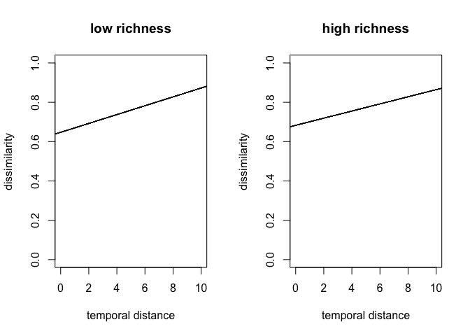

simulations to test effects of random sampling and species richness
interactions
================

``` r
# set parameters for simulations
require(vegan)
```

    ## Loading required package: vegan

    ## Loading required package: permute

    ## Loading required package: lattice

    ## This is vegan 2.6-4

``` r
require(reshape2)
```

    ## Loading required package: reshape2

``` r
require(data.table)
```

    ## Loading required package: data.table

    ## 
    ## Attaching package: 'data.table'

    ## The following objects are masked from 'package:reshape2':
    ## 
    ##     dcast, melt

``` r
lown <- 100 # number of species in low richness treatment
highn <- 1000 # number of species in high richness treatment
ngen <- 10 # number of sampling periods
frac <- 0.05 # fraction of species added and removed each sampling period
prob <- 0.5 # probability of seeing a species that is present
reps <- 1000 # number of times to repeat the sampling
set.seed(1001)
```

# simple scenario of species turnover

Add 5% new species and remove 5% of existing species each time step. A
high and a low richness treatment

## 100% of species sampled

Results don’t depend on species richness.

``` r
# make the communities
low <- matrix(c(rep(1, lown), rep(0, 2*lown*ngen - lown)), nrow=2*lown, ncol = ngen) # rows are species. in first time step, half are present
high <- matrix(c(rep(1, highn), rep(0, 2*highn*ngen - highn)), nrow = 2*highn, ncol = ngen)
for(i in 2:10){
    low[,i] <- low[,i-1] * c(rep(0, (i-1)*frac*lown), rep(1, 2*lown - (i-1)*frac*lown)) + c(rep(0, lown + (i-2)*frac*lown), rep(1, frac*lown), rep(0, lown - (i-1)*frac*lown)) # remove frac existing species and add frac new species
    high[,i] <- high[,i-1] * c(rep(0, (i-1)*frac*highn), rep(1, 2*highn - (i-1)*frac*highn)) + c(rep(0, highn + (i-2)*frac*highn), rep(1, frac*highn), rep(0, highn - (i-1)*frac*highn))
}

# calculate dissimilarities
lowdist <- vegdist(t(low), method='jaccard', binary=TRUE) # vegan expects spp in columns
highdist <- vegdist(t(high), method='jaccard', binary=TRUE)

# examine distances
print('low species richness')
```

    ## [1] "low species richness"

``` r
lowdist
```

    ##            1         2         3         4         5         6         7
    ## 2  0.0952381                                                            
    ## 3  0.1818182 0.0952381                                                  
    ## 4  0.2608696 0.1818182 0.0952381                                        
    ## 5  0.3333333 0.2608696 0.1818182 0.0952381                              
    ## 6  0.4000000 0.3333333 0.2608696 0.1818182 0.0952381                    
    ## 7  0.4615385 0.4000000 0.3333333 0.2608696 0.1818182 0.0952381          
    ## 8  0.5185185 0.4615385 0.4000000 0.3333333 0.2608696 0.1818182 0.0952381
    ## 9  0.5714286 0.5185185 0.4615385 0.4000000 0.3333333 0.2608696 0.1818182
    ## 10 0.6206897 0.5714286 0.5185185 0.4615385 0.4000000 0.3333333 0.2608696
    ##            8         9
    ## 2                     
    ## 3                     
    ## 4                     
    ## 5                     
    ## 6                     
    ## 7                     
    ## 8                     
    ## 9  0.0952381          
    ## 10 0.1818182 0.0952381

``` r
print('high species richness')
```

    ## [1] "high species richness"

``` r
highdist
```

    ##            1         2         3         4         5         6         7
    ## 2  0.0952381                                                            
    ## 3  0.1818182 0.0952381                                                  
    ## 4  0.2608696 0.1818182 0.0952381                                        
    ## 5  0.3333333 0.2608696 0.1818182 0.0952381                              
    ## 6  0.4000000 0.3333333 0.2608696 0.1818182 0.0952381                    
    ## 7  0.4615385 0.4000000 0.3333333 0.2608696 0.1818182 0.0952381          
    ## 8  0.5185185 0.4615385 0.4000000 0.3333333 0.2608696 0.1818182 0.0952381
    ## 9  0.5714286 0.5185185 0.4615385 0.4000000 0.3333333 0.2608696 0.1818182
    ## 10 0.6206897 0.5714286 0.5185185 0.4615385 0.4000000 0.3333333 0.2608696
    ##            8         9
    ## 2                     
    ## 3                     
    ## 4                     
    ## 5                     
    ## 6                     
    ## 7                     
    ## 8                     
    ## 9  0.0952381          
    ## 10 0.1818182 0.0952381

## 50% of species sampled

This adds sampling noise

``` r
for(i in 1:reps){
    if(i %% 50 == 0) cat(paste0('#', i, " "))
    # make the observed communities with only X% of species observed
    lowobs <- low * sample(c(rep(1, prob*2*lown*ngen), rep(0, (1-prob)*2*lown*ngen)), 2*lown*ngen, replace=FALSE) # turn X% of obs to absent, randomly
    highobs <- high * sample(c(rep(1, prob*2*highn*ngen), rep(0, (1-prob)*2*highn*ngen)), 2*highn*ngen, replace=FALSE)
    
    
    # calculate dissimilarities
    lowobsdist <- as.matrix(vegdist(t(lowobs), method='jaccard', binary=TRUE)) # vegan expects spp in columns
    highobsdist <- as.matrix(vegdist(t(highobs), method='jaccard', binary=TRUE))
    
    # examine distances (first example only)
    if(i == 1){
        print('low species richness with obs error')
        print(lowobsdist)
        print('high species richness')
        print(highobsdist)
    }
    
    # convert to long format (only one triangle)
    dimnames(lowobsdist) <- list(1:ngen, 1:ngen)
    lownms <- t(combn(colnames(lowobsdist), 2))
    thislowobslong <- data.frame(lownms, dist=lowobsdist[lownms])
    thislowobslong$rep <- i
    
    dimnames(highobsdist) <- list(1:ngen, 1:ngen)
    highnms <- t(combn(colnames(highobsdist), 2))
    thishighobslong <- data.frame(highnms, dist=highobsdist[highnms])
    thishighobslong$rep <- i
    
    if(i == 1){
        lowobslong <- thislowobslong
        highobslong <- thishighobslong
    } else {
        lowobslong <- rbind(lowobslong, thislowobslong)
        highobslong <- rbind(highobslong, thishighobslong)
    }
}
```

    ## [1] "low species richness with obs error"
    ##            1         2         3         4         5         6         7
    ## 1  0.0000000 0.7619048 0.6621622 0.7710843 0.7640449 0.7701149 0.8414634
    ## 2  0.7619048 0.0000000 0.6621622 0.6923077 0.7209302 0.8111111 0.7820513
    ## 3  0.6621622 0.6621622 0.0000000 0.7721519 0.7349398 0.6400000 0.7837838
    ## 4  0.7710843 0.6923077 0.7721519 0.0000000 0.6153846 0.6708861 0.8076923
    ## 5  0.7640449 0.7209302 0.7349398 0.6153846 0.0000000 0.5875000 0.7051282
    ## 6  0.7701149 0.8111111 0.6400000 0.6708861 0.5875000 0.0000000 0.6575342
    ## 7  0.8414634 0.7820513 0.7837838 0.8076923 0.7051282 0.6575342 0.0000000
    ## 8  0.7901235 0.7901235 0.8518519 0.7532468 0.6315789 0.6710526 0.7101449
    ## 9  0.8372093 0.8235294 0.8271605 0.7594937 0.6913580 0.7125000 0.7534247
    ## 10 0.8620690 0.6973684 0.8101266 0.7564103 0.7195122 0.7710843 0.7142857
    ##            8         9        10
    ## 1  0.7901235 0.8372093 0.8620690
    ## 2  0.7901235 0.8235294 0.6973684
    ## 3  0.8518519 0.8271605 0.8101266
    ## 4  0.7532468 0.7594937 0.7564103
    ## 5  0.6315789 0.6913580 0.7195122
    ## 6  0.6710526 0.7125000 0.7710843
    ## 7  0.7101449 0.7534247 0.7142857
    ## 8  0.0000000 0.7297297 0.7432432
    ## 9  0.7297297 0.0000000 0.6619718
    ## 10 0.7432432 0.6619718 0.0000000
    ## [1] "high species richness"
    ##            1         2         3         4         5         6         7
    ## 1  0.0000000 0.6611675 0.7326478 0.7306733 0.7506266 0.7647059 0.7909739
    ## 2  0.6611675 0.0000000 0.7046036 0.6888331 0.7135678 0.7269373 0.7662338
    ## 3  0.7326478 0.7046036 0.0000000 0.7072848 0.7283622 0.7615385 0.7341115
    ## 4  0.7306733 0.6888331 0.7072848 0.0000000 0.6996047 0.6954248 0.7509294
    ## 5  0.7506266 0.7135678 0.7283622 0.6996047 0.0000000 0.6973333 0.7148438
    ## 6  0.7647059 0.7269373 0.7615385 0.6954248 0.6973333 0.0000000 0.7089263
    ## 7  0.7909739 0.7662338 0.7341115 0.7509294 0.7148438 0.7089263 0.0000000
    ## 8  0.8000000 0.7965116 0.7909887 0.7493734 0.7195282 0.7202073 0.6920052
    ## 9  0.8172293 0.7815421 0.8078335 0.7701711 0.7656642 0.7392405 0.6985770
    ## 10 0.8337156 0.8109339 0.8210399 0.7983294 0.7534766 0.7537500 0.7253165
    ##            8         9        10
    ## 1  0.8000000 0.8172293 0.8337156
    ## 2  0.7965116 0.7815421 0.8109339
    ## 3  0.7909887 0.8078335 0.8210399
    ## 4  0.7493734 0.7701711 0.7983294
    ## 5  0.7195282 0.7656642 0.7534766
    ## 6  0.7202073 0.7392405 0.7537500
    ## 7  0.6920052 0.6985770 0.7253165
    ## 8  0.0000000 0.6946265 0.7201540
    ## 9  0.6946265 0.0000000 0.6793693
    ## 10 0.7201540 0.6793693 0.0000000
    ## #50 #100 #150 #200 #250 #300 #350 #400 #450 #500 #550 #600 #650 #700 #750 #800 #850 #900 #950 #1000

``` r
lowobslong$X1 <- as.numeric(lowobslong$X1)
lowobslong$X2 <- as.numeric(lowobslong$X2)

highobslong$X1 <- as.numeric(highobslong$X1)
highobslong$X2 <- as.numeric(highobslong$X2)

lowobslong <- data.table(lowobslong)
highobslong <- data.table(highobslong)
```

# calc turnover rates

same central tendencies in both high and low species richness scenarios

``` r
lowslopes <- lowobslong[, as.list(coef(lm(dist ~ I(X2-X1)))), by=rep]
highslopes <- highobslong[, as.list(coef(lm(dist ~ I(X2-X1)))), by=rep]
setnames(lowslopes, c('rep', 'int', 'slope'))
setnames(highslopes, c('rep', 'int', 'slope'))

print('low richness slopes')
```

    ## [1] "low richness slopes"

``` r
lowslopes[, summary(slope)]
```

    ##      Min.   1st Qu.    Median      Mean   3rd Qu.      Max. 
    ## -0.004760  0.001912  0.003810  0.003699  0.005450  0.013818

``` r
print('high richness slopes')
```

    ## [1] "high richness slopes"

``` r
highslopes[, summary(slope)]
```

    ##     Min.  1st Qu.   Median     Mean  3rd Qu.     Max. 
    ## 0.001273 0.003236 0.003807 0.003782 0.004315 0.006207

# plot turnover rates as lines

More variance in turnover rates for the lower richness scenario. This
doesn’t plot correctly in the github document.

``` r
par(mfrow=c(1,2))
plot(c(0,10), c(0,1), col='white', xlab = 'temporal distance', ylab='dissimilarity', main = 'low richness')
lowslopes[, abline(a = int, b = slope, col = '#00000033'), by = rep]
```

    ## Empty data.table (0 rows and 1 cols): rep

``` r
plot(c(0,10), c(0,1), col='white', xlab = 'temporal distance', ylab='dissimilarity', main = 'high richness')
highslopes[, abline(a = int, b = slope, col = '#00000033'), by = rep]
```

<!-- -->

    ## Empty data.table (0 rows and 1 cols): rep

# plot turnover rates as densities

More variance in turnover rates for the lower richness scenario

``` r
lowslopes[, plot(density(slope), ylim =c(0,500))]
```

    ## NULL

``` r
highslopes[, lines(density(slope), col='red')]
```

<!-- -->

    ## NULL
