Turnover simulations to test effect of duration
================

  - [Basic settings](#basic-settings)
  - [Neutral simulation with an even
    metacommunity](#neutral-simulation-with-an-even-metacommunity)
  - [Neutral simulation with an uneven
    metacommunity](#neutral-simulation-with-an-uneven-metacommunity)
  - [Plot slope vs. duration](#plot-slope-vs.-duration)

# Basic settings

``` r
## Basic settings
nburn = 1000 # length of burnin
ngen = 100 # number of simulated generations
nrep = 100 # number of replicates
```

# Neutral simulation with an even metacommunity

Each replicate has a burnin and then a simulation period. Do many
replicates. Plot dynamics from the first replicate.

``` r
set.seed(6)
metaeven = rep(1:100, 100) # metacommunity of 100 evenly distributed species

simburnineven <- vector('list', nrep)
simeven <- vector('list', nrep)
names(simeven) <- 1:nrep
for(i in 1:nrep){
    simburnineven[[i]] <- untb(start = sample(metaeven, 100), prob = 0.1, D = 1, gens = nburn, keep = TRUE, meta = metaeven) # burnin
    simeven[[i]] <- untb(start = simburnineven[[i]][nburn,], prob = 0.1, D=1, gens = ngen, keep = TRUE, meta = metaeven) # simulation
}

# plot an example from the first
plot(species.count(simburnineven[[1]]), type = 'b', main = 'Burnin: num spp through time') # evaluate burnin
```

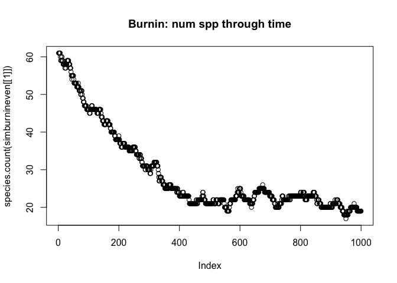<!-- -->

``` r
matplot(species.table(simburnineven[[1]]), type='l', lty=1, main = 'Burnin: spp dynamics')
```

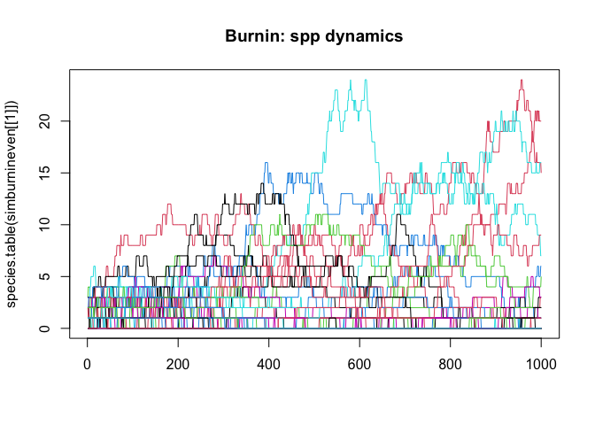<!-- -->

``` r
plot(count(simburnineven[[1]][1,]), main = 'Burnin: Initial SAD')
```

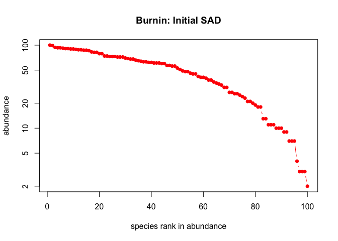<!-- -->

``` r
plot(count(simburnineven[[1]][1000,]), main = 'Burnin: Final SAD')
```

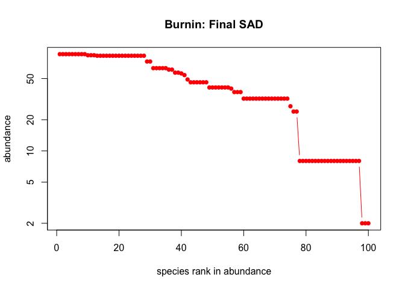<!-- -->

``` r
plot(species.count(simeven[[1]]), type = 'b', main = 'Sim: num spp through time')
```

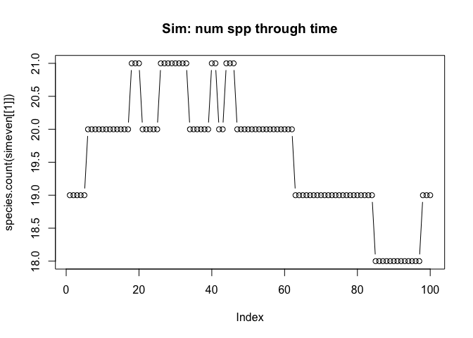<!-- -->

``` r
matplot(species.table(simeven[[1]]), type='l', lty=1, main = 'Sim: spp dynamics')
```

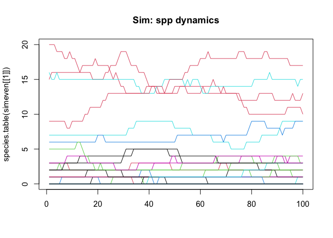<!-- -->

``` r
plot(count(simeven[[1]][100,]), main = 'Sim: Final SAD')
```

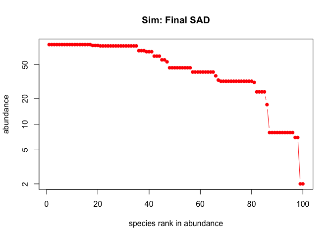<!-- -->

Sample from each annual community and calculate slope of Jaccard
dissimilarity among pairs of years for timeseries of 3:20 years.

``` r
# sample from the community
nsamp = 20 # number of individuals sampled
sampeven = lapply(simeven, FUN = function(x) t(apply(x, MARGIN = 1, FUN = sample, size = nsamp)))

# calculate dissimilarity
disteven <- lapply(sampeven, FUN = function(x) as.matrix(vegdist(tocommat(x), method='jaccard', binary=TRUE)))

# convert to long format
for(i in 1:length(disteven)){
    dimnames(disteven[[i]]) <- list(1:ngen, 1:ngen)
    xy <- t(combn(colnames(disteven[[i]]), 2))
    temp <- data.table(year1 = as.numeric(xy[,1]), year2 = as.numeric(xy[,2]), dist = as.numeric(disteven[[i]][xy]), rarefyID = i)
    if(i == 1){
        distlongeven <- temp
    } else {
        distlongeven <- rbind(distlongeven, temp)
    }
}

# calculate slopes. slow.
yrslist <- 3:20
for(yr in yrslist){
    temp <- distlongeven[, calctrendnsampsall(dist, year1, year2, numyrs = yr, nsamps = 3, 
                                              measure = 'Jtu', duration_group = paste0(yr, 'min3')), by = rarefyID]
    if(yr == min(yrslist)) trendseven = temp[!is.na(disstrend), ] # make a new dataset if first iteration through
    if(yr > min(yrslist)) trendseven = rbind(trendseven,temp[!is.na(disstrend), ]) # otherwise append
    
}
```

Plot all pairwise dissimilarities and dissimilarities vs. year 1 for an
example

    ## `geom_smooth()` using method = 'gam' and formula 'y ~ s(x, bs = "cs")'

    ## `geom_smooth()` using method = 'loess' and formula 'y ~ x'

<!-- -->

# Neutral simulation with an uneven metacommunity

Use BCI data as the metacommunity.
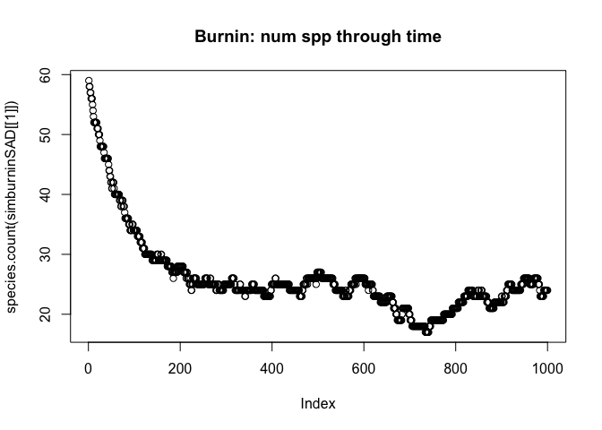<!-- -->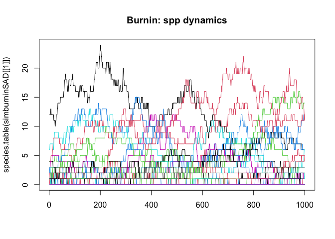<!-- -->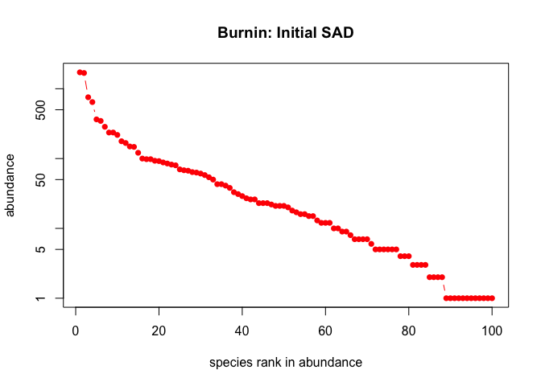<!-- -->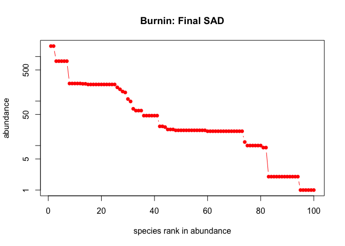<!-- -->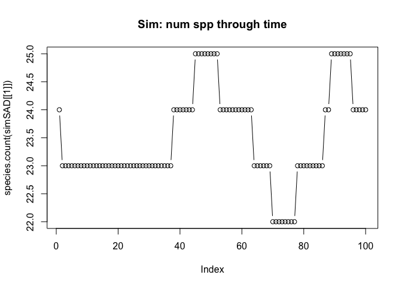<!-- -->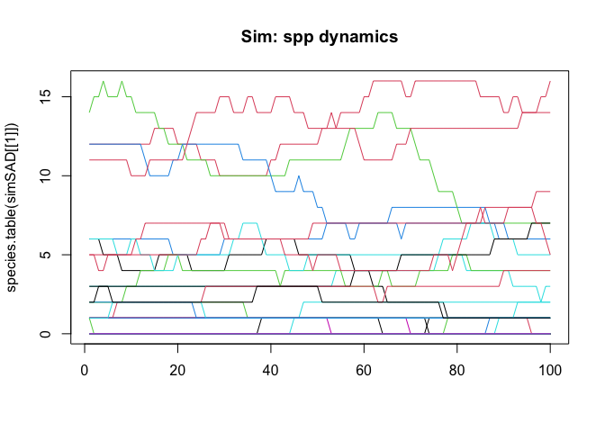<!-- -->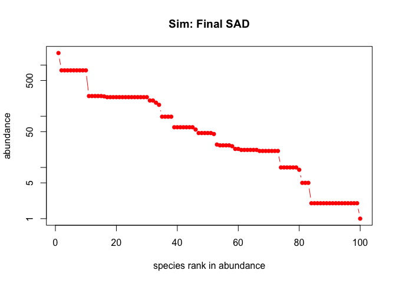<!-- -->

Sample from them and calculate Jaccard dissimilarity among pairs of
years

Plot all dissimilarities for an example

    ## `geom_smooth()` using method = 'gam' and formula 'y ~ s(x, bs = "cs")'

    ## `geom_smooth()` using method = 'loess' and formula 'y ~ x'

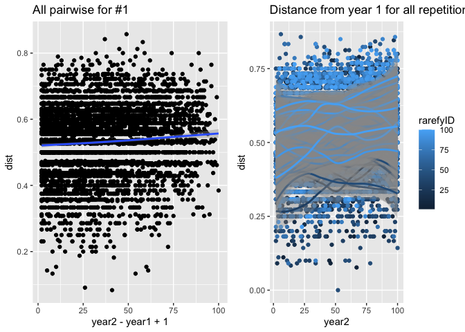<!-- -->

# Plot slope vs. duration

Top row has an example from one replicate. Middle row shows slopes from
all replicates. Bottom row is the average across all replicates. Left
column is even metacommunity, right column is BCI metacommunity (a
skewed SAD).  
Notice that declining slope with duration *only* appears in the skewed
SAD.

    ## `geom_smooth()` using method = 'gam' and formula 'y ~ s(x, bs = "cs")'
    ## `geom_smooth()` using method = 'gam' and formula 'y ~ s(x, bs = "cs")'
    ## `geom_smooth()` using method = 'gam' and formula 'y ~ s(x, bs = "cs")'
    ## `geom_smooth()` using method = 'gam' and formula 'y ~ s(x, bs = "cs")'
    ## `geom_smooth()` using method = 'gam' and formula 'y ~ s(x, bs = "cs")'
    ## `geom_smooth()` using method = 'gam' and formula 'y ~ s(x, bs = "cs")'

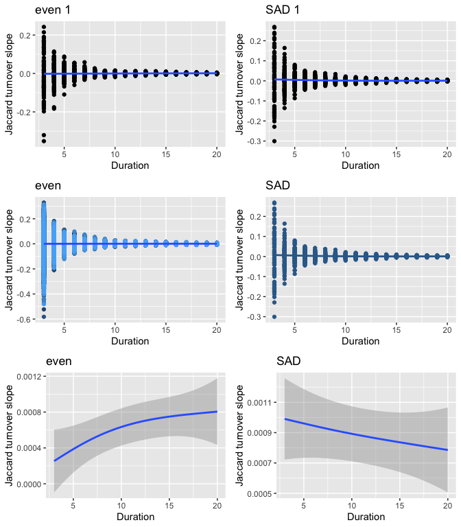<!-- -->
