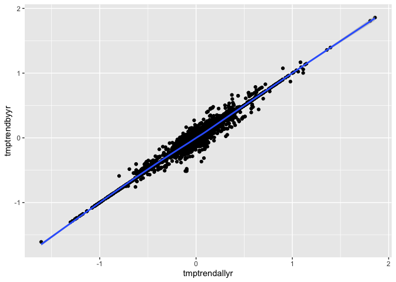
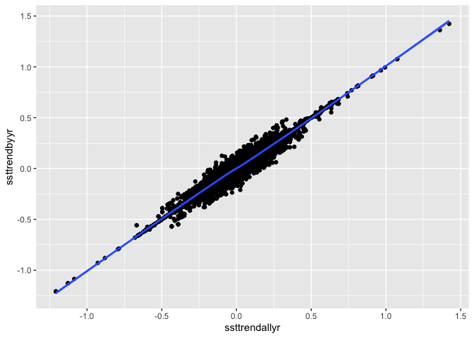
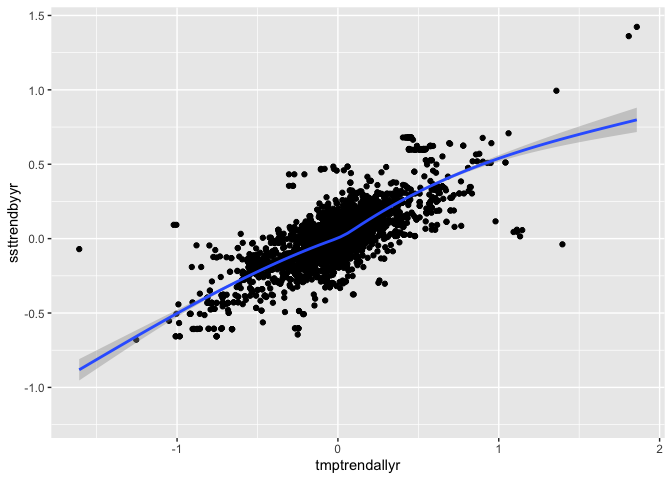
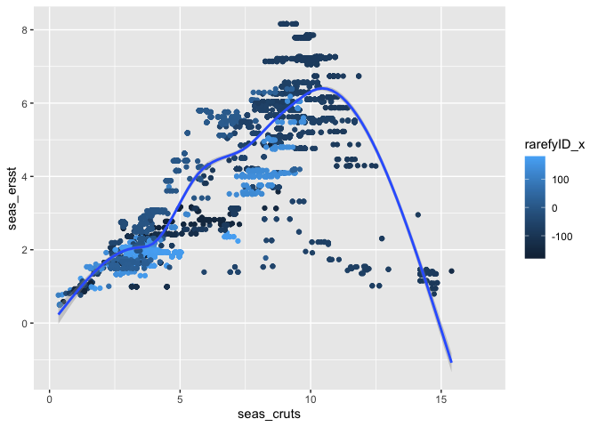
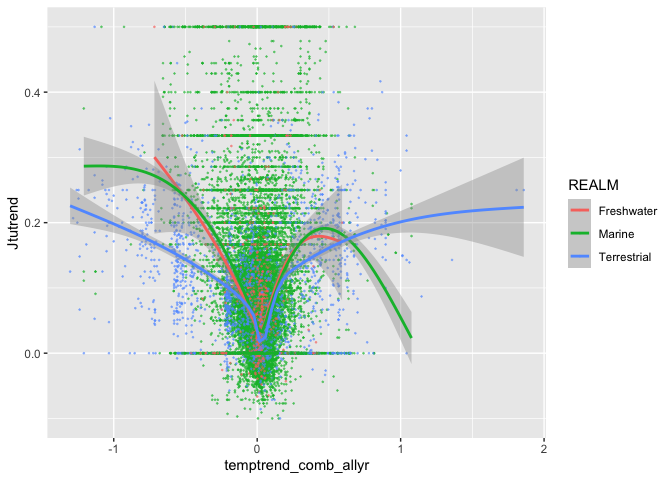
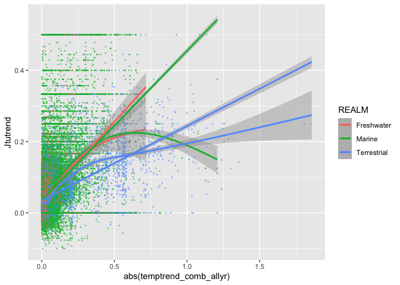
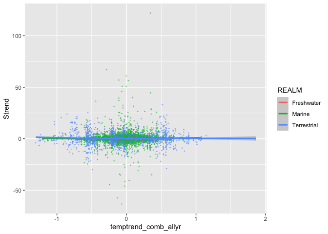
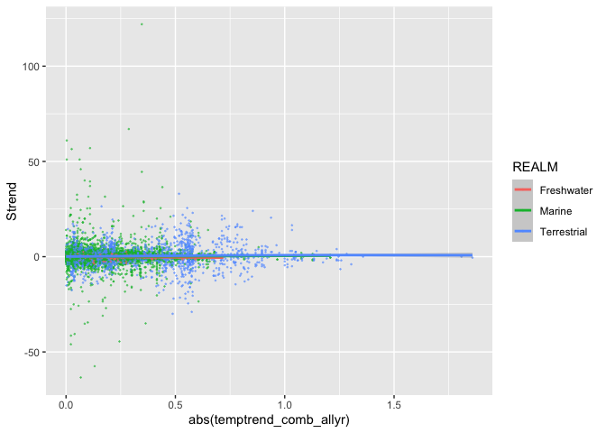

Turnover vs. temperature exploration
================

``` r
library(data.table)
library(ggplot2)

knitr::opts_knit$set(root.dir = rprojroot::find_rstudio_root_file()) # tell RStudio to use project root directory as the root for this notebook. Needed since we are storing code in a separate directory.
```

### Load libraries and data

``` r
# BioTime
load('data/biotime_blowes/bt.Rdata')
bt <- data.table(bt_malin); rm(bt_malin)

# Temperature trends from CRU TS (on land)
tmptrendbyyr <- fread('output/cruts_tmptrend_byyear.csv.gz', drop = 1)
tmptrendallyr <- fread('output/cruts_tmptrend_allyear.csv.gz', drop = 1)

# Temperature trends from ERSST (ocean)
ssttrendbyyr <- fread('output/ersst_ssttrend_byyear.csv.gz', drop = 1)
ssttrendallyr <- fread('output/ersst_ssttrend_allyear.csv.gz', drop = 1)

# Seasonality
seascru <- fread('output/cruts_seas.csv.gz', drop = 1)
seasersst <- fread('output/ersst_seas.csv.gz', drop = 1)

# NPP
npp <- fread('output/npplandocean.csv.gz')
```

### Assemble dataset of trends (turnover and temperature) and covariates

``` r
# calculate temporal turnover
trends <- bt[, .(Jtutrend = coef(lm(Jtu_base ~ YEAR))[2], Strend = coef(lm(S ~ YEAR))[2], nyrBT = length(YEAR)), by = .(REALM, Biome, taxa_mod, STUDY_ID, rarefyID, rarefyID_x, rarefyID_y)] # calculate trend in Jaccard turnover from first year

# add temperature trends
trends <- merge(trends, tmptrendbyyr, all.x = TRUE, by = 'rarefyID') # add temperature trend (years that match biotime)
trends <- merge(trends, tmptrendallyr[, .(rarefyID, tmptrendallyr)], all.x = TRUE, by = 'rarefyID') # add temperature trend (all years from first to last of each time-series)
trends <- merge(trends, ssttrendbyyr[, .(rarefyID, ssttrendbyyr)], all.x = TRUE, by = 'rarefyID') # sst
trends <- merge(trends, ssttrendallyr[, .(rarefyID, ssttrendallyr)], all.x = TRUE, by = 'rarefyID')

# add covariates
trends <- merge(trends, seascru[, .(rarefyID, seas_cruts)], all.x = TRUE, by = 'rarefyID') # seasonality from CRU TS
trends <- merge(trends, seasersst[, .(rarefyID, seas_ersst)], all.x = TRUE, by = 'rarefyID') # seasonality from ERSST
trends <- merge(trends, npp, all.x = TRUE, by = 'rarefyID')
```

Do some basic checks

``` r
# basic checks
trends
```

    ##           rarefyID  REALM                      Biome      taxa_mod
    ##     1:  100_606491 Marine     Northern_European_Seas          Fish
    ##     2:  101_606491 Marine     Northern_European_Seas Invertebrates
    ##     3: 108_3933165 Marine Continental_High_Antarctic         Birds
    ##     4: 108_3941181 Marine Continental_High_Antarctic         Birds
    ##     5: 108_3941182 Marine Continental_High_Antarctic         Birds
    ##    ---                                                            
    ## 53463:  99_4377155 Marine Northwest_Australian_Shelf          Fish
    ## 53464:  99_4383724 Marine Northwest_Australian_Shelf          Fish
    ## 53465:  99_4386651 Marine Northwest_Australian_Shelf          Fish
    ## 53466:  99_4390299 Marine Northwest_Australian_Shelf          Fish
    ## 53467:  99_4394671 Marine Northwest_Australian_Shelf          Fish
    ##        STUDY_ID rarefyID_x rarefyID_y     Jtutrend        Strend nyrBT
    ##     1:      100    -3.0800   51.14000  0.004763952  5.766129e-02    31
    ##     2:      101    -3.0800   51.14000  0.000000000  9.032258e-02    31
    ##     3:      108    57.9650  -65.28500  0.071428571 -1.428571e-01     2
    ##     4:      108    59.9275  -66.29250  0.100000000  2.500000e-01     2
    ##     5:      108    59.9700  -66.19500  0.062500000 -3.750000e-01     2
    ##    ---                                                                
    ## 53463:       99   116.8010  -19.84227 -0.010268562 -3.507109e-01     3
    ## 53464:       99   117.5515  -19.61040  0.000000000  3.925231e-17     2
    ## 53465:       99   117.8600  -18.80625  0.000000000 -5.000000e-01     2
    ## 53466:       99   118.3213  -18.79645  0.088888889  2.666667e-01     4
    ## 53467:       99   118.8110  -19.35420  0.000000000 -4.000000e-01     2
    ##        tmptrendbyyr YEAR_min YEAR_max tmptrendallyr ssttrendbyyr
    ##     1:    0.0252789     1981     2011     0.0252789  0.041039992
    ##     2:    0.0252789     1981     2011     0.0252789  0.041039992
    ##     3:           NA       NA       NA            NA -0.013489248
    ##     4:           NA       NA       NA            NA -0.009487191
    ##     5:           NA       NA       NA            NA -0.009487191
    ##    ---                                                          
    ## 53463:           NA       NA       NA            NA -0.006082084
    ## 53464:           NA       NA       NA            NA           NA
    ## 53465:           NA       NA       NA            NA  0.620516857
    ## 53466:           NA       NA       NA            NA -0.018872044
    ## 53467:           NA       NA       NA            NA           NA
    ##        ssttrendallyr seas_cruts seas_ersst       npp
    ##     1:   0.041039992   4.308796  3.0779262 1685.9467
    ##     2:   0.041039992   4.308796  3.0779262 1685.9467
    ##     3:  -0.006945833         NA  0.4781110  126.3856
    ##     4:  -0.004529737         NA  0.5235794  152.3814
    ##     5:  -0.004529737         NA  0.5235794  150.4591
    ##    ---                                              
    ## 53463:  -0.003552321         NA  2.0016941  552.9129
    ## 53464:            NA         NA         NA  543.8439
    ## 53465:   0.620516857         NA  1.8848515  366.2237
    ## 53466:  -0.002693142         NA  1.8848515  384.6634
    ## 53467:            NA         NA         NA  694.7807

``` r
trends[, .(minJ = min(Jtutrend), maxJ = max(Jtutrend), minS = min(Strend), maxS = max(Strend)), by = REALM]
```

    ##          REALM        minJ maxJ       minS  maxS
    ## 1:      Marine -0.10000000  0.5 -63.400000 122.0
    ## 2: Terrestrial -0.10000000  0.5 -30.000000  33.0
    ## 3:  Freshwater -0.06666667  0.5  -3.657143   2.5

``` r
trends[, .(nJ = sum(Jtutrend < 0), nS = sum(Strend < 0)), by = REALM] # why are some turnover trends < 0?
```

    ##          REALM   nJ    nS
    ## 1:      Marine 2891 19973
    ## 2: Terrestrial  223  1528
    ## 3:  Freshwater   71   453

``` r
trends[, .(nJ = sum(Jtutrend > 0), nS = sum(Strend > 0)), by = REALM]
```

    ##          REALM    nJ    nS
    ## 1:      Marine 39219 27301
    ## 2: Terrestrial  2854  1785
    ## 3:  Freshwater   693   579

``` r
# are the temperature trends correlated?
# compare trends calculated from all sampled years in BioTime vs. all years from min to max year in BioTime
ggplot(trends, aes(tmptrendallyr, tmptrendbyyr)) +
    geom_point() +
    geom_smooth()
```

    ## `geom_smooth()` using method = 'gam' and formula 'y ~ s(x, bs = "cs")'

    ## Warning: Removed 40885 rows containing non-finite values (stat_smooth).

    ## Warning: Removed 40885 rows containing missing values (geom_point).

<!-- -->

``` r
ggplot(trends, aes(ssttrendallyr, ssttrendbyyr)) +
    geom_point() +
    geom_smooth()
```

    ## `geom_smooth()` using method = 'gam' and formula 'y ~ s(x, bs = "cs")'

    ## Warning: Removed 5199 rows containing non-finite values (stat_smooth).

    ## Warning: Removed 5199 rows containing missing values (geom_point).

<!-- -->

``` r
# compare temperature trends from CRU TS vs ERSST
ggplot(trends, aes(tmptrendallyr, ssttrendbyyr)) + # ERSST more muted at fastest rates of change in CRU TS
    geom_point() +
    geom_smooth()
```

    ## `geom_smooth()` using method = 'gam' and formula 'y ~ s(x, bs = "cs")'

    ## Warning: Removed 45240 rows containing non-finite values (stat_smooth).

    ## Warning: Removed 45240 rows containing missing values (geom_point).

<!-- -->

``` r
# compare seasonality from CRU TS and ERSST
ggplot(trends, aes(seas_cruts, seas_ersst, color = rarefyID_x)) + # ERSST more muted at fastest rates of change in CRU TS
    geom_point() +
    geom_smooth()
```

    ## `geom_smooth()` using method = 'gam' and formula 'y ~ s(x, bs = "cs")'

    ## Warning: Removed 45240 rows containing non-finite values (stat_smooth).
    
    ## Warning: Removed 45240 rows containing missing values (geom_point).

<!-- -->

### Combine CRU TS and ERSST

``` r
# temperature trend
trends[ , temptrend_comb_allyr := tmptrendallyr] # CRU TS for land and freshwater
trends[REALM == 'Marine', temptrend_comb_allyr := ssttrendallyr] # ERSST for marine

# seasonality
trends[, seas_comb := seas_cruts]
trends[REALM == 'Marine', seas_comb := seas_ersst]
```

### Plot turnover vs. temperature trends

Trends are impressively symmetric around no trend in temperature.
Instead, abs(trend) looks better. There are very odd values for marine
at 0, making me think the Jtu\_base values are incorrect there.

``` r
# Jaccard turnover trend vs. temperature trend (across all years)
ggplot(trends, aes(temptrend_comb_allyr, Jtutrend, color = REALM)) +
    geom_point(size = 0.2, alpha = 0.5) + 
    geom_smooth()
```

    ## `geom_smooth()` using method = 'gam' and formula 'y ~ s(x, bs = "cs")'

    ## Warning: Removed 3132 rows containing non-finite values (stat_smooth).

    ## Warning: Removed 3132 rows containing missing values (geom_point).

<!-- -->

``` r
# Jaccard turnover trend vs. abs temperature trend (across all years)
ggplot(trends, aes(abs(temptrend_comb_allyr), Jtutrend, group = REALM, color = REALM)) +
    geom_point(size = 0.2, alpha = 0.5) + 
    geom_smooth() +
    geom_smooth(method = 'lm')
```

    ## `geom_smooth()` using method = 'gam' and formula 'y ~ s(x, bs = "cs")'

    ## Warning: Removed 3132 rows containing non-finite values (stat_smooth).

    ## `geom_smooth()` using formula 'y ~ x'

    ## Warning: Removed 3132 rows containing non-finite values (stat_smooth).
    
    ## Warning: Removed 3132 rows containing missing values (geom_point).

<!-- -->

### Plot Richness trend vs. temperature trends

``` r
# Richness trend vs. temperature trend (across all years)
ggplot(trends, aes(temptrend_comb_allyr, Strend, color = REALM)) +
    geom_point(size = 0.2, alpha = 0.5) + 
    geom_smooth()
```

    ## `geom_smooth()` using method = 'gam' and formula 'y ~ s(x, bs = "cs")'

    ## Warning: Removed 3132 rows containing non-finite values (stat_smooth).

    ## Warning: Removed 3132 rows containing missing values (geom_point).

<!-- -->

``` r
# Richness trend vs. abs temperature trend (across all years)
ggplot(trends, aes(abs(temptrend_comb_allyr), Strend, group = REALM, color = REALM)) +
    geom_point(size = 0.2, alpha = 0.5) + 
    geom_smooth()
```

    ## `geom_smooth()` using method = 'gam' and formula 'y ~ s(x, bs = "cs")'

    ## Warning: Removed 3132 rows containing non-finite values (stat_smooth).
    
    ## Warning: Removed 3132 rows containing missing values (geom_point).

<!-- -->

### Model choice

Realm interaction is strongly supported Baseline turnover is slowest in
freshwater, fastest in marine Freshwater turnover is fastest with
temperature, terrestrial slowest

``` r
# Jaccard turnover trend vs. temperature trend (across all years)
mods <- vector('list', 0)
mods[[1]] <- lm(Jtutrend ~ abs(temptrend_comb_allyr) + REALM, data = trends)
mods[[2]] <- lm(Jtutrend ~ abs(temptrend_comb_allyr)*REALM, data = trends)
mods[[3]] <- lm(Jtutrend ~ abs(temptrend_comb_allyr)*seas_comb, data = trends)
mods[[4]] <- lm(Jtutrend ~ abs(temptrend_comb_allyr)*npp, data = trends)

lapply(mods, summary)
```

    ## [[1]]
    ## 
    ## Call:
    ## lm(formula = Jtutrend ~ abs(temptrend_comb_allyr) + REALM, data = trends)
    ## 
    ## Residuals:
    ##      Min       1Q   Median       3Q      Max 
    ## -0.41786 -0.04297 -0.02058  0.01813  0.48227 
    ## 
    ## Coefficients:
    ##                            Estimate Std. Error t value Pr(>|t|)    
    ## (Intercept)                0.036949   0.002610  14.157   <2e-16 ***
    ## abs(temptrend_comb_allyr)  0.338138   0.003568  94.768   <2e-16 ***
    ## REALMMarine                0.003140   0.002632   1.193    0.233    
    ## REALMTerrestrial          -0.027671   0.003019  -9.164   <2e-16 ***
    ## ---
    ## Signif. codes:  0 '***' 0.001 '**' 0.01 '*' 0.05 '.' 0.1 ' ' 1
    ## 
    ## Residual standard error: 0.084 on 50331 degrees of freedom
    ##   (3132 observations deleted due to missingness)
    ## Multiple R-squared:  0.1529, Adjusted R-squared:  0.1529 
    ## F-statistic:  3028 on 3 and 50331 DF,  p-value: < 2.2e-16
    ## 
    ## 
    ## [[2]]
    ## 
    ## Call:
    ## lm(formula = Jtutrend ~ abs(temptrend_comb_allyr) * REALM, data = trends)
    ## 
    ## Residuals:
    ##      Min       1Q   Median       3Q      Max 
    ## -0.43122 -0.04075 -0.01988  0.01891  0.46489 
    ## 
    ## Coefficients:
    ##                                             Estimate Std. Error t value
    ## (Intercept)                                 0.030585   0.003168   9.655
    ## abs(temptrend_comb_allyr)                   0.450159   0.032335  13.922
    ## REALMMarine                                 0.004433   0.003204   1.384
    ## REALMTerrestrial                            0.004142   0.003653   1.134
    ## abs(temptrend_comb_allyr):REALMMarine      -0.030400   0.032657  -0.931
    ## abs(temptrend_comb_allyr):REALMTerrestrial -0.240979   0.032828  -7.341
    ##                                            Pr(>|t|)    
    ## (Intercept)                                 < 2e-16 ***
    ## abs(temptrend_comb_allyr)                   < 2e-16 ***
    ## REALMMarine                                   0.167    
    ## REALMTerrestrial                              0.257    
    ## abs(temptrend_comb_allyr):REALMMarine         0.352    
    ## abs(temptrend_comb_allyr):REALMTerrestrial 2.16e-13 ***
    ## ---
    ## Signif. codes:  0 '***' 0.001 '**' 0.01 '*' 0.05 '.' 0.1 ' ' 1
    ## 
    ## Residual standard error: 0.0833 on 50329 degrees of freedom
    ##   (3132 observations deleted due to missingness)
    ## Multiple R-squared:  0.1669, Adjusted R-squared:  0.1669 
    ## F-statistic:  2017 on 5 and 50329 DF,  p-value: < 2.2e-16
    ## 
    ## 
    ## [[3]]
    ## 
    ## Call:
    ## lm(formula = Jtutrend ~ abs(temptrend_comb_allyr) * seas_comb, 
    ##     data = trends)
    ## 
    ## Residuals:
    ##      Min       1Q   Median       3Q      Max 
    ## -0.45600 -0.04156 -0.01858  0.01822  0.46948 
    ## 
    ## Coefficients:
    ##                                       Estimate Std. Error t value Pr(>|t|)
    ## (Intercept)                          0.0463822  0.0009437   49.15   <2e-16
    ## abs(temptrend_comb_allyr)            0.4917691  0.0073963   66.49   <2e-16
    ## seas_comb                           -0.0028670  0.0002066  -13.87   <2e-16
    ## abs(temptrend_comb_allyr):seas_comb -0.0226191  0.0010015  -22.59   <2e-16
    ##                                        
    ## (Intercept)                         ***
    ## abs(temptrend_comb_allyr)           ***
    ## seas_comb                           ***
    ## abs(temptrend_comb_allyr):seas_comb ***
    ## ---
    ## Signif. codes:  0 '***' 0.001 '**' 0.01 '*' 0.05 '.' 0.1 ' ' 1
    ## 
    ## Residual standard error: 0.0832 on 50331 degrees of freedom
    ##   (3132 observations deleted due to missingness)
    ## Multiple R-squared:  0.1688, Adjusted R-squared:  0.1688 
    ## F-statistic:  3408 on 3 and 50331 DF,  p-value: < 2.2e-16
    ## 
    ## 
    ## [[4]]
    ## 
    ## Call:
    ## lm(formula = Jtutrend ~ abs(temptrend_comb_allyr) * npp, data = trends)
    ## 
    ## Residuals:
    ##      Min       1Q   Median       3Q      Max 
    ## -0.41535 -0.04258 -0.02099  0.01731  0.47724 
    ## 
    ## Coefficients:
    ##                                 Estimate Std. Error t value Pr(>|t|)    
    ## (Intercept)                    4.625e-02  8.011e-04   57.73  < 2e-16 ***
    ## abs(temptrend_comb_allyr)      3.361e-01  7.363e-03   45.65  < 2e-16 ***
    ## npp                           -6.976e-06  6.443e-07  -10.83  < 2e-16 ***
    ## abs(temptrend_comb_allyr):npp -1.450e-05  5.369e-06   -2.70  0.00693 ** 
    ## ---
    ## Signif. codes:  0 '***' 0.001 '**' 0.01 '*' 0.05 '.' 0.1 ' ' 1
    ## 
    ## Residual standard error: 0.08385 on 50222 degrees of freedom
    ##   (3241 observations deleted due to missingness)
    ## Multiple R-squared:  0.1484, Adjusted R-squared:  0.1484 
    ## F-statistic:  2918 on 3 and 50222 DF,  p-value: < 2.2e-16

``` r
sapply(mods, AIC) - min(sapply(mods, AIC))
```

    ## [1]  956.294  119.597    0.000 1017.304
