Community dissimilarity through time using beta models: Evaluate and
plot models
================

  - [Prep](#prep)
  - [Summary stats](#summary-stats)
      - [Examine how many data points are
        available](#examine-how-many-data-points-are-available)
          - [Just turnover and non-zero
            tempchange](#just-turnover-and-non-zero-tempchange)
          - [With all covariates](#with-all-covariates)
  - [Models](#models)
      - [Choose the variance structure](#choose-the-variance-structure)
          - [10-years](#years)
          - [Summary of the chosen model](#summary-of-the-chosen-model)
          - [Plot random effects](#plot-random-effects)
          - [DHARMa model evaluation](#dharma-model-evaluation)
      - [Realm x duration](#realm-x-duration)
      - [Temperature x temperature slope x REALM x
        duration](#temperature-x-temperature-slope-x-realm-x-duration)
          - [AIC](#aic)
          - [Metabolic temperature](#metabolic-temperature)
          - [Environmental temperature](#environmental-temperature)
      - [Latitude or temperature?](#latitude-or-temperature)
          - [AIC](#aic-1)
      - [Covariate x Temperature x temperature slope x REALM x
        duration](#covariate-x-temperature-x-temperature-slope-x-realm-x-duration)
          - [Tsign effects](#tsign-effects)
          - [AIC among covariate models](#aic-among-covariate-models)
          - [Microclimate summary](#microclimate-summary)
          - [Seasonality summary](#seasonality-summary)
      - [Thermal bias test](#thermal-bias-test)
          - [Thermal bias coefs](#thermal-bias-coefs)
          - [Make or load thermal bias
            effect](#make-or-load-thermal-bias-effect)
          - [Plot thermal bias effects](#plot-thermal-bias-effects)

# Prep

First run turnover\_vs\_temperature\_GLMM\_fit.R to fit the models.

    ## Loading required package: Matrix

    ## Loading required package: stats4

    ## This is DHARMa 0.3.3.0. For overview type '?DHARMa'. For recent changes, type news(package = 'DHARMa') Note: Syntax of plotResiduals has changed in 0.3.0, see ?plotResiduals for details

    ## here() starts at /local/home/malinp/climate_community_crossrealm

    ## This is lavaan 0.6-9
    ## lavaan is FREE software! Please report any bugs.

# Summary stats

## Examine how many data points are available

### Just turnover and non-zero tempchange

``` r
cat('Overall # dissimilarities: ', nrow(trendsall), '\n')
```

    ## Overall # dissimilarities:  1236276

``` r
cat('# studies: ', trendsall[, length(unique(STUDY_ID))], '\n')
```

    ## # studies:  319

``` r
cat('# timeseries: ', trendsall[, length(unique(rarefyID))], '\n')
```

    ## # timeseries:  42255

``` r
trendsall[!duplicated(rarefyID), table(REALM)]
```

    ## REALM
    ##  Freshwater      Marine Terrestrial 
    ##         645       38451        3159

``` r
trendsall[!duplicated(rarefyID), table(taxa_mod)]
```

    ## taxa_mod
    ##                         All                  Amphibians                     Benthos                       Birds                        Fish               Invertebrates                     Mammals Marine invertebrates/plants                       Plant                    Reptiles 
    ##                        1230                         337                        4669                        8356                       24334                        2577                         259                         206                         285                           2

``` r
trendsall[!duplicated(rarefyID), table(taxa_mod, REALM)]
```

    ##                              REALM
    ## taxa_mod                      Freshwater Marine Terrestrial
    ##   All                                  0   1227           3
    ##   Amphibians                           2      0         335
    ##   Benthos                              0   4669           0
    ##   Birds                                0   5831        2525
    ##   Fish                               628  23706           0
    ##   Invertebrates                       14   2485          78
    ##   Mammals                              0    215          44
    ##   Marine invertebrates/plants          0    206           0
    ##   Plant                                1    112         172
    ##   Reptiles                             0      0           2

### With all covariates

Use Bowler for human impact

``` r
# the cases we can compare
apply(trendsall[, .(Jtu.sc, REALM, tempave_metab.sc, seas.sc, microclim.sc, tempchange.sc, mass.sc, speed.sc, consumerfrac.sc, endothermfrac.sc, nspp.sc, thermal_bias.sc, npp.sc, veg.sc, human_bowler.sc)], MARGIN = 2, FUN = function(x) sum(!is.na(x)))
```

    ##           Jtu.sc            REALM tempave_metab.sc          seas.sc     microclim.sc    tempchange.sc          mass.sc         speed.sc  consumerfrac.sc endothermfrac.sc          nspp.sc  thermal_bias.sc           npp.sc           veg.sc  human_bowler.sc 
    ##          1236276          1236276          1221072          1221072          1230052          1221072          1234678          1235179          1236276          1236276          1236276          1121476          1232803          1224994          1236276

``` r
i <- trendsall[, complete.cases(Jtu.sc, tempave_metab.sc, seas.sc, microclim.sc, tempchange.sc, mass.sc, speed.sc, consumerfrac.sc, nspp.sc, thermal_bias.sc, npp.sc, veg.sc, human_bowler.sc)]
cat('Overall # dissimilarities: ', sum(i), '\n')
```

    ## Overall # dissimilarities:  1109590

``` r
cat('# studies: ', trendsall[i, length(unique(STUDY_ID))], '\n')
```

    ## # studies:  245

``` r
cat('# timeseries: ', trendsall[i, length(unique(rarefyID))], '\n')
```

    ## # timeseries:  39691

``` r
trendsall[i & !duplicated(rarefyID), table(REALM)]
```

    ## REALM
    ##  Freshwater      Marine Terrestrial 
    ##         613       36404        2674

``` r
trendsall[i & !duplicated(rarefyID), table(taxa_mod)]
```

    ## taxa_mod
    ##                         All                  Amphibians                     Benthos                       Birds                        Fish               Invertebrates                     Mammals Marine invertebrates/plants                       Plant                    Reptiles 
    ##                        1204                          12                        4633                        7622                       23330                        2247                         253                         206                         182                           2

``` r
trendsall[i & !duplicated(rarefyID), table(taxa_mod, REALM)]
```

    ##                              REALM
    ## taxa_mod                      Freshwater Marine Terrestrial
    ##   All                                  0   1202           2
    ##   Amphibians                           2      0          10
    ##   Benthos                              0   4633           0
    ##   Birds                                0   5182        2440
    ##   Fish                               602  22728           0
    ##   Invertebrates                        8   2173          66
    ##   Mammals                              0    215          38
    ##   Marine invertebrates/plants          0    206           0
    ##   Plant                                1     65         116
    ##   Reptiles                             0      0           2

# Models

## Choose the variance structure

Try combinations of

  - beta errors
  - variance scaled to Nspp or to Nspp + REALM
  - random intercept for taxa\_mod2, STUDY\_ID, rarefyID
  - random slopes for duration

Did not try random intercept for compID (for overdispersion), since had
trouble converging. Use a full set of fixed effects and choose the RE
with lowest AIC. Many of the 3- and 5-year models with random slopes had
singular convergence issues.

### 10-years

This chooses beta errors, random slopes (duration.sc) & intercepts for
STUDY\_ID and rarefyID, and variance scaled to nspp + realm. We haven’t
dealt with potential testing on the boundary issues here.

    ##                      modRFgauss10                       modRFbeta10                        modRFrID10                       modRF2lev10                   modRFnestedRE10                    modRFslopeRE10                modRFslopeRE2lev10                       modRFdisp10            modRFslopeRE2levdisp10                modRFslopeREdisp10              modRF2levdisprealm10       modRFslopeRE2levdisprealm10             modRFdurlog2levdisp10      modRFdurlogslopeRE2levdisp10 
    ##                       423241.4256                        76342.5908                        34951.7438                        32559.7846                        32559.6788                        32033.8836                        32030.8909                        71694.5661                        31976.0899                        31979.3091                          815.0234                            0.0000                        32508.1272                        32235.2454 
    ##        modRFdurlog2levdisprealm10 modRFdurlogslopeRE2levdisprealm10 
    ##                          819.9359                          232.2940

### Summary of the chosen model

    ##  Family: beta  ( logit )
    ## Formula:          Jtu.sc ~ duration.sc + REALM:duration.sc + tempchange_abs.sc:duration.sc +      tempave_metab.sc:duration.sc + mass.sc:duration.sc + nspp.sc:duration.sc +      seas.sc:duration.sc + microclim.sc:duration.sc + npp.sc:duration.sc +      human_bowler.sc:REALM2:duration.sc + (duration.sc | STUDY_ID/rarefyID)
    ## Dispersion:              ~nspp.sc + REALM
    ## Data: trends10[i10, ]
    ## 
    ##       AIC       BIC    logLik  deviance  df.resid 
    ## -401074.3 -400856.5  200560.2 -401120.3     96052 
    ## 
    ## Random effects:
    ## 
    ## Conditional model:
    ##  Groups            Name        Variance Std.Dev. Corr  
    ##  rarefyID:STUDY_ID (Intercept) 0.20063  0.4479         
    ##                    duration.sc 0.01506  0.1227   0.21  
    ##  STUDY_ID          (Intercept) 2.51288  1.5852         
    ##                    duration.sc 0.07554  0.2748   -0.11 
    ## Number of obs: 96075, groups:  rarefyID:STUDY_ID, 2135; STUDY_ID, 98
    ## 
    ## Conditional model:
    ##                                               Estimate Std. Error z value Pr(>|z|)    
    ## (Intercept)                                 -0.8458633  0.1647461  -5.134 2.83e-07 ***
    ## duration.sc                                  0.0842237  0.1191296   0.707   0.4796    
    ## duration.sc:REALMMarine                     -0.0411013  0.1267972  -0.324   0.7458    
    ## duration.sc:REALMTerrestrial                 0.1143903  0.1266378   0.903   0.3664    
    ## duration.sc:tempchange_abs.sc               -0.0099670  0.0055865  -1.784   0.0744 .  
    ## duration.sc:tempave_metab.sc                -0.0117817  0.0303050  -0.389   0.6974    
    ## duration.sc:mass.sc                          0.0003737  0.0153689   0.024   0.9806    
    ## duration.sc:nspp.sc                         -0.0296981  0.0176051  -1.687   0.0916 .  
    ## duration.sc:seas.sc                         -0.0027868  0.0117482  -0.237   0.8125    
    ## duration.sc:microclim.sc                     0.0026454  0.0064350   0.411   0.6810    
    ## duration.sc:npp.sc                           0.0006566  0.0087874   0.075   0.9404    
    ## duration.sc:human_bowler.sc:REALM2Marine     0.0007141  0.0086173   0.083   0.9340    
    ## duration.sc:human_bowler.sc:REALM2TerrFresh  0.0034071  0.0082741   0.412   0.6805    
    ## ---
    ## Signif. codes:  0 '***' 0.001 '**' 0.01 '*' 0.05 '.' 0.1 ' ' 1
    ## 
    ## Dispersion model:
    ##                   Estimate Std. Error z value Pr(>|z|)    
    ## (Intercept)       0.896912   0.059503   15.07   <2e-16 ***
    ## nspp.sc           0.099365   0.004305   23.08   <2e-16 ***
    ## REALMMarine      -1.268900   0.059693  -21.26   <2e-16 ***
    ## REALMTerrestrial  0.918195   0.060203   15.25   <2e-16 ***
    ## ---
    ## Signif. codes:  0 '***' 0.001 '**' 0.01 '*' 0.05 '.' 0.1 ' ' 1

### Plot random effects

No clear discontinuities. Looks ok.

    ## $`rarefyID:STUDY_ID`

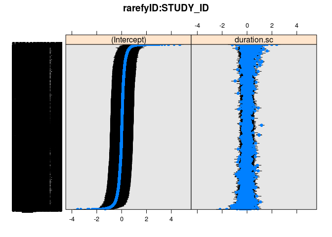<!-- -->

    ## 
    ## $STUDY_ID

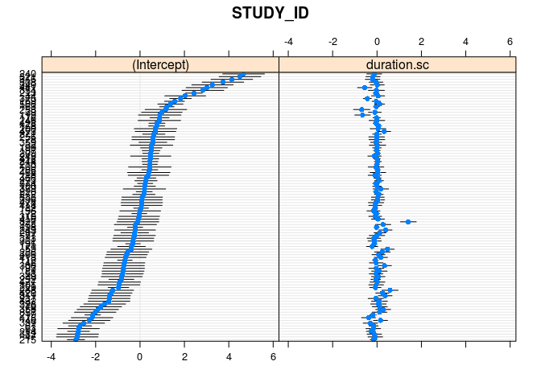<!-- -->

### DHARMa model evaluation

#### Plot residuals for model fit to all data

There are many outliers and signs of underdispersion, but this is
probably ok.

#### Overdispersion

There is underdispersion.

#### Near-zero-inflation

(Zero values have been transformed to slightly \>0, so can’t test
zero-inflation directly)

Near-zero values are not inflated.

``` r
countNearZero <- function(x) sum(x < 0.0001)
testGeneric(res_RFslopeRE2levdisprealm10, summary = countNearZero, alternative = 'greater')
```

#### Near-one-inflation

Near-one values are not inflated.

``` r
countNearOne <- function(x) sum(x > 0.9999)
testGeneric(res_RFslopeRE2levdisprealm10, summary = countNearOne, alternative = 'greater')
```

## Realm x duration

Compare very basic models w/ and w/out realm as an explanatory factor
for differences in turnover (proportion species/yr)

``` r
modAllJtu <- readRDS('temp/modAllJtu.rds')
modRealmAllJtu <- readRDS('temp/modRealmAllJtu.rds')
```

A model with REALM is worse than a model without (just looking at
average slopes, no other covariates)

``` r
aics <- AIC(modAllJtu, modRealmAllJtu)
aics$dAIC <- aics$AIC - min(aics$AIC)
aics
```

    ##                df      AIC     dAIC
    ## modAllJtu      11 -7181509 0.000000
    ## modRealmAllJtu 13 -7181506 3.187901

## Temperature x temperature slope x REALM x duration

Compare with duration scaled vs. not, with abs(tempchange)
vs. tempchange, and with metabolic vs. environmental temperature

``` r
modTdTTRealmAllJtu <- readRDS('temp/modTdTTRealmAllJtu.rds') # uses duration and tempchange
modTdTTRealmDurscAllJtu <- readRDS('temp/modTdTTRealmDurscAllJtu.rds') # uses duration.sc and tempchange
modTsdTTRealmAllJtu <- readRDS('temp/modTsdTTRealmAllJtu.rds') # uses duration and abs(tempchange)
modTsdTTRealmDurscAllJtu <- readRDS('temp/modTsdTTRealmDurscAllJtu.rds') # uses duration.sc and abs(tempchange)
modrawTsdTTRealmAllJtu <- readRDS('temp/modrawTsdTTRealmAllJtu.rds') # uses environmental temperature (duration and abs)
```

### AIC

Clearly chooses un-scaled duration and abs(tempchange). Also prefers
environmental over metabolic temperature.

``` r
aics <- AIC(modTdTTRealmAllJtu, modTdTTRealmDurscAllJtu, modTsdTTRealmAllJtu, modTsdTTRealmDurscAllJtu, modrawTsdTTRealmAllJtu)
aics$dAIC <- aics$AIC - min(aics$AIC)
aics
```

    ##                          df      AIC      dAIC
    ## modTdTTRealmAllJtu       22 -7181690  88.56782
    ## modTdTTRealmDurscAllJtu  22 -7181534 244.40917
    ## modTsdTTRealmAllJtu      22 -7181748  30.93794
    ## modTsdTTRealmDurscAllJtu 22 -7181552 226.71149
    ## modrawTsdTTRealmAllJtu   22 -7181779   0.00000

### Metabolic temperature

#### Make/load prediction

Uses output from pred\_GLMMmodTsdTTRealmAllJtu.R.

    ## [1] "Loaded predictions from file"

#### Plot the interaction

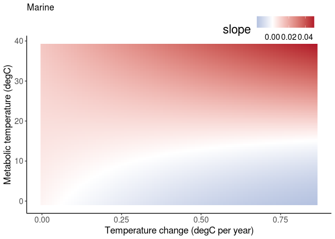<!-- -->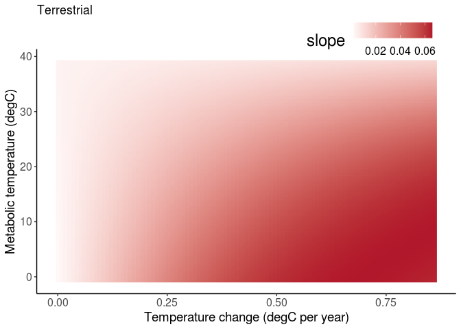<!-- -->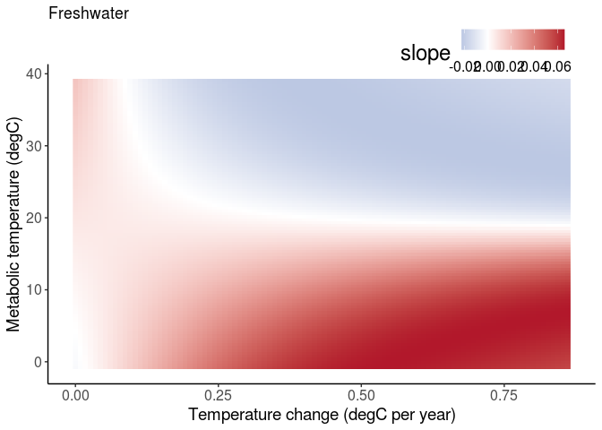<!-- -->

#### Plot confidence bounds

CIs are from a SEM fit to the trends.

``` r
ggplot(slopes[round(tempave_metab,1) %in% c(10.1, 30.2),], aes(tempchange_abs, slope, color = factor(round(tempave_metab)), group = tempave_metab)) +
    geom_line() +
    geom_pointrange(aes(ymin=slope-1.96*slope.se, ymax=slope+1.96*slope.se), alpha = 0.25) + 
    facet_grid(cols = vars(REALM))  +
    labs(x = '|dT|') +
    theme(panel.grid.major = element_blank(), panel.grid.minor = element_blank(),
          panel.background = element_blank(), axis.line = element_line(colour = "black"),
          legend.key=element_blank(),
          axis.text=element_text(size=8),
          axis.title=element_text(size=8),
          plot.title=element_text(size=8))  
```

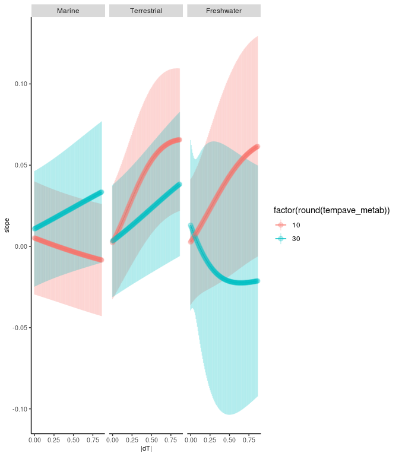<!-- -->

#### Are endotherms common at high tempave\_metab on land?

Endotherms are very common at higher temperatures on land.

    ##          REALM tempG20 mean      sd
    ## 1:  Freshwater   FALSE 0.00 0.0e+00
    ## 2:  Freshwater    TRUE 0.00 0.0e+00
    ## 3:      Marine   FALSE 0.00 7.6e-04
    ## 4:      Marine    TRUE 0.50 4.9e-01
    ## 5: Terrestrial   FALSE 0.00 9.2e-10
    ## 6: Terrestrial    TRUE 0.98 1.3e-01

#### Which species are common in each quadrant?

FALSE is less than 20degC, TRUE is greater than.

``` r
trendsall[!is.na(tempave_metab.sc) & !duplicated(rarefyID), table(taxa_mod2, REALM, unscaleme(tempave_metab.sc, 'tempave_metab.sc') > 20)]
```

    ## , ,  = FALSE
    ## 
    ##                REALM
    ## taxa_mod2       Freshwater Marine Terrestrial
    ##   All                    0    624           2
    ##   Amphibians             1      0         327
    ##   Benthos                0   4211           0
    ##   Birds                  0      0           0
    ##   Fish                 625  17537           0
    ##   Invertebrates         12   2068          74
    ##   Mammals                0      0           0
    ##   Plant                  1     69         136
    ##   Reptiles               0      0           2
    ## 
    ## , ,  = TRUE
    ## 
    ##                REALM
    ## taxa_mod2       Freshwater Marine Terrestrial
    ##   All                    0    809           1
    ##   Amphibians             1      0           8
    ##   Benthos                0    451           0
    ##   Birds                  0   5661        2524
    ##   Fish                   3   5768           0
    ##   Invertebrates          0    317           4
    ##   Mammals                0    215          44
    ##   Plant                  0     40          36
    ##   Reptiles               0      0           0

``` r
trendsall[!is.na(tempave_metab.sc) & !duplicated(rarefyID), round(prop.table(table(taxa_mod2, unscaleme(tempave_metab.sc, 'tempave_metab.sc') > 20, REALM), margin = c(2,3)),2)]
```

    ## , , REALM = Freshwater
    ## 
    ##                
    ## taxa_mod2       FALSE TRUE
    ##   All            0.00 0.00
    ##   Amphibians     0.00 0.25
    ##   Benthos        0.00 0.00
    ##   Birds          0.00 0.00
    ##   Fish           0.98 0.75
    ##   Invertebrates  0.02 0.00
    ##   Mammals        0.00 0.00
    ##   Plant          0.00 0.00
    ##   Reptiles       0.00 0.00
    ## 
    ## , , REALM = Marine
    ## 
    ##                
    ## taxa_mod2       FALSE TRUE
    ##   All            0.03 0.06
    ##   Amphibians     0.00 0.00
    ##   Benthos        0.17 0.03
    ##   Birds          0.00 0.43
    ##   Fish           0.72 0.43
    ##   Invertebrates  0.08 0.02
    ##   Mammals        0.00 0.02
    ##   Plant          0.00 0.00
    ##   Reptiles       0.00 0.00
    ## 
    ## , , REALM = Terrestrial
    ## 
    ##                
    ## taxa_mod2       FALSE TRUE
    ##   All            0.00 0.00
    ##   Amphibians     0.60 0.00
    ##   Benthos        0.00 0.00
    ##   Birds          0.00 0.96
    ##   Fish           0.00 0.00
    ##   Invertebrates  0.14 0.00
    ##   Mammals        0.00 0.02
    ##   Plant          0.25 0.01
    ##   Reptiles       0.00 0.00

### Environmental temperature

#### Make/load prediction

    ## [1] "Loaded predictions from file"

#### Plot the interaction

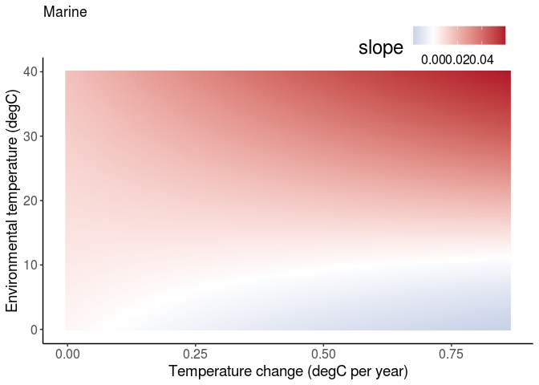<!-- -->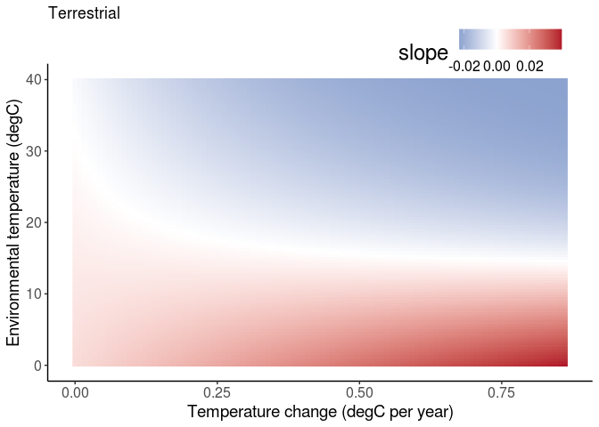<!-- -->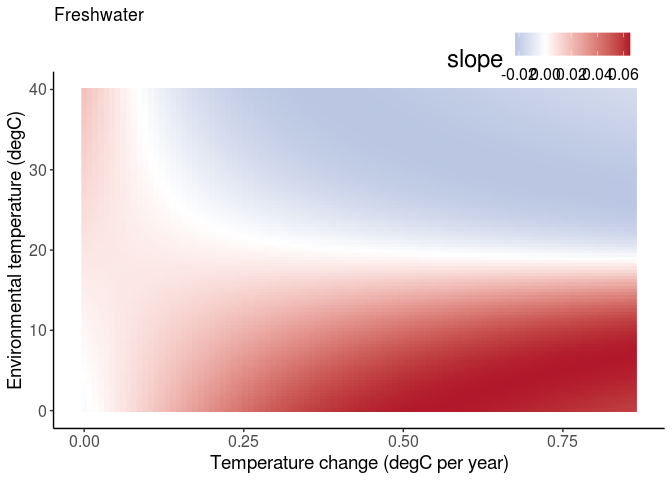<!-- -->
\#\#\#\# Are endotherms common at high tempave on land? tempG20 means
temperature \> 20degC. Endotherms are common at all environmental
temperatures on land, not just high temperatures.

    ##          REALM tempG20 mean   sd
    ## 1:  Freshwater   FALSE 0.00 0.00
    ## 2:  Freshwater    TRUE 0.00 0.00
    ## 3:      Marine   FALSE 0.21 0.40
    ## 4:      Marine    TRUE 0.03 0.17
    ## 5: Terrestrial   FALSE 0.82 0.38
    ## 6: Terrestrial    TRUE 0.39 0.49

#### Which species are common in each quadrant?

FALSE is less than 20degC, TRUE is greater than.

``` r
trendsall[!is.na(tempave.sc) & !duplicated(rarefyID), table(taxa_mod2, unscaleme(tempave.sc, 'tempave.sc') > 20, REALM)]
```

    ## , , REALM = Freshwater
    ## 
    ##                
    ## taxa_mod2       FALSE  TRUE
    ##   All               0     0
    ##   Amphibians        1     1
    ##   Benthos           0     0
    ##   Birds             0     0
    ##   Fish            625     3
    ##   Invertebrates    12     0
    ##   Mammals           0     0
    ##   Plant             1     0
    ##   Reptiles          0     0
    ## 
    ## , , REALM = Marine
    ## 
    ##                
    ## taxa_mod2       FALSE  TRUE
    ##   All            1398    35
    ##   Amphibians        0     0
    ##   Benthos        4211   451
    ##   Birds          5487   174
    ##   Fish          17537  5768
    ##   Invertebrates  2068   317
    ##   Mammals         200    15
    ##   Plant            69    40
    ##   Reptiles          0     0
    ## 
    ## , , REALM = Terrestrial
    ## 
    ##                
    ## taxa_mod2       FALSE  TRUE
    ##   All               3     0
    ##   Amphibians      327     8
    ##   Benthos           0     0
    ##   Birds          2495    29
    ##   Fish              0     0
    ##   Invertebrates    74     4
    ##   Mammals          42     2
    ##   Plant           136    36
    ##   Reptiles          2     0

``` r
trendsall[!is.na(tempave.sc) & !duplicated(rarefyID), round(prop.table(table(taxa_mod2, unscaleme(tempave.sc, 'tempave.sc') > 20, REALM), margin = c(2,3)),2)]
```

    ## , , REALM = Freshwater
    ## 
    ##                
    ## taxa_mod2       FALSE TRUE
    ##   All            0.00 0.00
    ##   Amphibians     0.00 0.25
    ##   Benthos        0.00 0.00
    ##   Birds          0.00 0.00
    ##   Fish           0.98 0.75
    ##   Invertebrates  0.02 0.00
    ##   Mammals        0.00 0.00
    ##   Plant          0.00 0.00
    ##   Reptiles       0.00 0.00
    ## 
    ## , , REALM = Marine
    ## 
    ##                
    ## taxa_mod2       FALSE TRUE
    ##   All            0.05 0.01
    ##   Amphibians     0.00 0.00
    ##   Benthos        0.14 0.07
    ##   Birds          0.18 0.03
    ##   Fish           0.57 0.85
    ##   Invertebrates  0.07 0.05
    ##   Mammals        0.01 0.00
    ##   Plant          0.00 0.01
    ##   Reptiles       0.00 0.00
    ## 
    ## , , REALM = Terrestrial
    ## 
    ##                
    ## taxa_mod2       FALSE TRUE
    ##   All            0.00 0.00
    ##   Amphibians     0.11 0.10
    ##   Benthos        0.00 0.00
    ##   Birds          0.81 0.37
    ##   Fish           0.00 0.00
    ##   Invertebrates  0.02 0.05
    ##   Mammals        0.01 0.03
    ##   Plant          0.04 0.46
    ##   Reptiles       0.00 0.00

## Latitude or temperature?

Compare temperature vs. latitude in an interaction with abs(tempchange).
Not very useful until we fit abs(latitude) model so that effects are
mirrored at each pole.

``` r
modTsdTTRealmAllJtu <- readRDS('temp/modTsdTTRealmAllJtu.rds') # uses temperature
modLatsdTTRealmAllJtu <- readRDS('temp/modLatsdTTRealmAllJtu.rds') # uses latitude
```

### AIC

Clearly chooses temperature.

``` r
aics <- AIC(modTsdTTRealmAllJtu, modLatsdTTRealmAllJtu)
aics$dAIC <- aics$AIC - min(aics$AIC)
aics
```

    ##                       df      AIC     dAIC
    ## modTsdTTRealmAllJtu   22 -7181748     0.00
    ## modLatsdTTRealmAllJtu 22 -7166112 15635.54

## Covariate x Temperature x temperature slope x REALM x duration

### Tsign effects

``` r
fixef(modTsdTTRealmtsignAllJtu)
```

    ## 
    ## Conditional model:
    ##                                                          (Intercept)                                                              duration                                                  duration:REALMMarine                                             duration:REALMTerrestrial                    duration:REALMFreshwater:tsign-1:tempchange_abs.sc                        duration:REALMMarine:tsign-1:tempchange_abs.sc                   duration:REALMTerrestrial:tsign-1:tempchange_abs.sc  
    ##                                                           -0.9174471                                                             0.0262046                                                             0.0094828                                                            -0.0024008                                                            -0.0385159                                                            -0.0003553                                                             0.0268388  
    ##                    duration:REALMFreshwater:tsign1:tempchange_abs.sc                         duration:REALMMarine:tsign1:tempchange_abs.sc                    duration:REALMTerrestrial:tsign1:tempchange_abs.sc                     duration:REALMFreshwater:tsign-1:tempave_metab.sc                         duration:REALMMarine:tsign-1:tempave_metab.sc                    duration:REALMTerrestrial:tsign-1:tempave_metab.sc                      duration:REALMFreshwater:tsign1:tempave_metab.sc  
    ##                                                           -0.0041815                                                             0.0010415                                                             0.0077472                                                            -0.0279352                                                             0.0197212                                                            -0.0039353                                                             0.0059966  
    ##                         duration:REALMMarine:tsign1:tempave_metab.sc                     duration:REALMTerrestrial:tsign1:tempave_metab.sc   duration:REALMFreshwater:tsign-1:tempchange_abs.sc:tempave_metab.sc       duration:REALMMarine:tsign-1:tempchange_abs.sc:tempave_metab.sc  duration:REALMTerrestrial:tsign-1:tempchange_abs.sc:tempave_metab.sc    duration:REALMFreshwater:tsign1:tempchange_abs.sc:tempave_metab.sc        duration:REALMMarine:tsign1:tempchange_abs.sc:tempave_metab.sc  
    ##                                                            0.0192950                                                            -0.0029813                                                            -0.1052246                                                             0.0037098                                                            -0.0165310                                                            -0.0129347                                                             0.0061924  
    ##  duration:REALMTerrestrial:tsign1:tempchange_abs.sc:tempave_metab.sc  
    ##                                                           -0.0037210  
    ## 
    ## Dispersion model:
    ##      (Intercept)       REALMMarine  REALMTerrestrial  
    ##          -0.7886            0.2093            2.6672

#### Make or load temperature sign effect

    ## [1] "Loaded tsign predictions from file"

#### Plot tsign effects

Overall, the effects of warming and cooling at nearly equivalent.  
More biodiversity change with warming in the ocean, consistent with the
temperature effect (more change at higher temperatures).  
More biodiversity change with cooling on land, consistent with the
temperature effect (more change at lower tempeartures).  
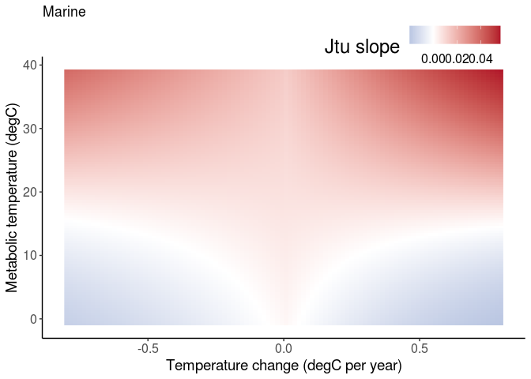<!-- -->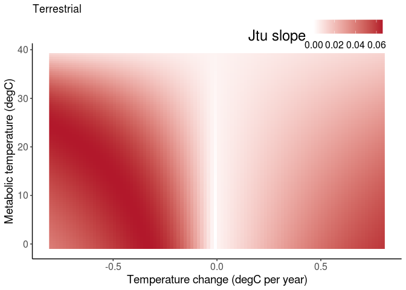<!-- -->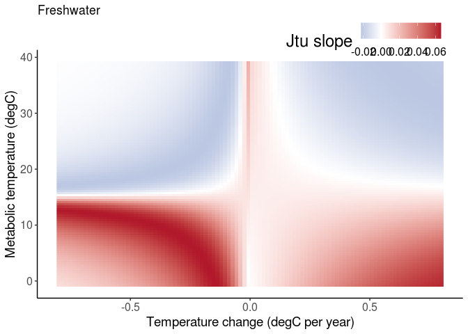<!-- -->

#### Difference in slopes

These plots subtract the cooling slopes from the warming slopes.  
Plots need to be improved, I think because pixel spacing isn’t even.
Getting strange patterns near 0 temperature change.

    ## Warning: Raster pixels are placed at uneven horizontal intervals and will be shifted. Consider using geom_tile() instead.

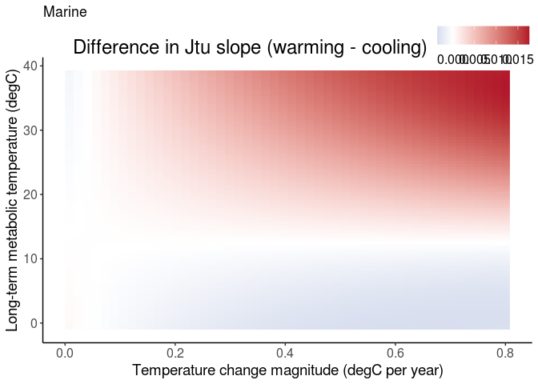<!-- -->

    ## Warning: Raster pixels are placed at uneven horizontal intervals and will be shifted. Consider using geom_tile() instead.

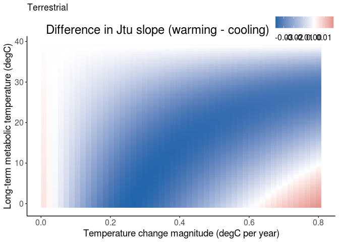<!-- -->

    ## Warning: Raster pixels are placed at uneven horizontal intervals and will be shifted. Consider using geom_tile() instead.

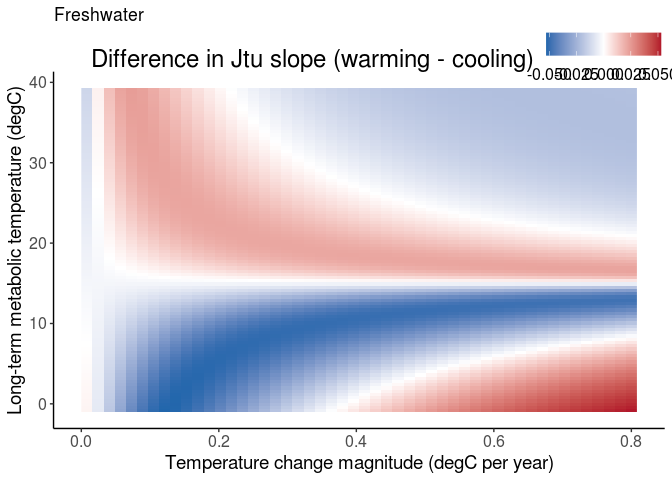<!-- -->

### AIC among covariate models

All covariate models are preferred over the baseline model.  
Microclimates and mass are the preferred covariates.

``` r
aics <- AIC(modTsdTTRealmAllJtu, modTsdTTRealmtsignAllJtu, modTsdTTRealmnppAllJtu, 
            modTsdTTRealmseasAllJtu, modTsdTTRealmmicroclimAllJtu,
            modTsdTTRealmhumanAllJtu, modTsdTTRealmmassAllJtu)
aics$dAIC <- aics$AIC - min(aics$AIC)
aics
```

    ##                              df      AIC      dAIC
    ## modTsdTTRealmAllJtu          22 -7181748 133.30912
    ## modTsdTTRealmtsignAllJtu     31 -7181780 100.99589
    ## modTsdTTRealmnppAllJtu       34 -7181798  83.21126
    ## modTsdTTRealmseasAllJtu      34 -7181827  54.07032
    ## modTsdTTRealmmicroclimAllJtu 34 -7181869  11.40815
    ## modTsdTTRealmhumanAllJtu     34 -7181851  29.59103
    ## modTsdTTRealmmassAllJtu      34 -7181881   0.00000

### Microclimate summary

``` r
fixef(modTsdTTRealmmicroclimAllJtu)
```

    ## 
    ## Conditional model:
    ##                                                               (Intercept)                                                                   duration                                                       duration:REALMMarine                                                  duration:REALMTerrestrial                                 duration:REALMFreshwater:tempchange_abs.sc                                     duration:REALMMarine:tempchange_abs.sc  
    ##                                                                -0.9077240                                                                  0.0313326                                                                  0.0054096                                                                 -0.0200637                                                                 -0.0346547                                                                 -0.0002941  
    ##                               duration:REALMTerrestrial:tempchange_abs.sc                                  duration:REALMFreshwater:tempave_metab.sc                                      duration:REALMMarine:tempave_metab.sc                                 duration:REALMTerrestrial:tempave_metab.sc                                      duration:REALMFreshwater:microclim.sc                                          duration:REALMMarine:microclim.sc  
    ##                                                                 0.0137909                                                                  0.0029521                                                                  0.0185662                                                                  0.0027693                                                                 -0.0063190                                                                  0.0054869  
    ##                                    duration:REALMTerrestrial:microclim.sc                duration:REALMFreshwater:tempchange_abs.sc:tempave_metab.sc                    duration:REALMMarine:tempchange_abs.sc:tempave_metab.sc               duration:REALMTerrestrial:tempchange_abs.sc:tempave_metab.sc                    duration:REALMFreshwater:tempchange_abs.sc:microclim.sc                        duration:REALMMarine:tempchange_abs.sc:microclim.sc  
    ##                                                                 0.0104035                                                                 -0.0696977                                                                  0.0054035                                                                 -0.0077571                                                                  0.0264926                                                                 -0.0017757  
    ##                  duration:REALMTerrestrial:tempchange_abs.sc:microclim.sc                     duration:REALMFreshwater:tempave_metab.sc:microclim.sc                         duration:REALMMarine:tempave_metab.sc:microclim.sc                    duration:REALMTerrestrial:tempave_metab.sc:microclim.sc   duration:REALMFreshwater:tempchange_abs.sc:tempave_metab.sc:microclim.sc       duration:REALMMarine:tempchange_abs.sc:tempave_metab.sc:microclim.sc  
    ##                                                                -0.0020246                                                                  0.0007071                                                                  0.0060166                                                                 -0.0045235                                                                  0.0374298                                                                  0.0005987  
    ## duration:REALMTerrestrial:tempchange_abs.sc:tempave_metab.sc:microclim.sc  
    ##                                                                 0.0011799  
    ## 
    ## Dispersion model:
    ##      (Intercept)       REALMMarine  REALMTerrestrial  
    ##          -0.7906            0.2113            2.6689

#### Make or load the microclimate interaction

    ## [1] "Loaded microclim predictions from file"

#### Plot the temperature interaction by realm for the microclimate model

Microclimates affect the overall magnitude of change, but not the
relationship between change and temperature.
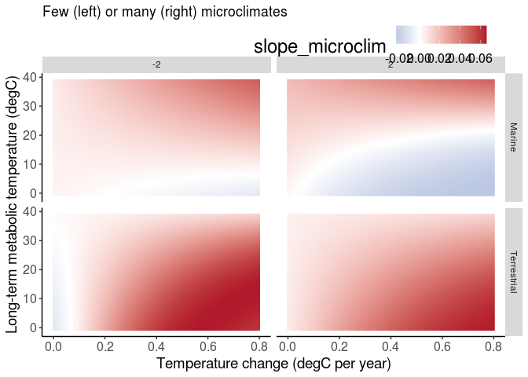<!-- -->

### Seasonality summary

#### Make or load the seasonality interaction

    ## [1] "Loaded seas predictions from file"

#### Plot the temperature interaction by realm for the seasonality model

Seasonality affects the overall magnitude of change, but not the
relationship between change and temperature.
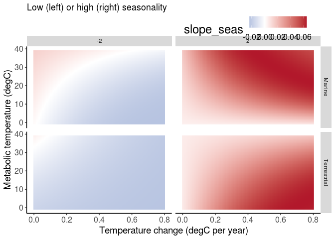<!-- -->
\#\#\# Mass summary

#### Make or load the mass interaction

    ## [1] "Loaded mass predictions from file"

#### Plot the temperature interaction by realm for the mass model

Mass affect the overall magnitude of change, but not the relationship
between change and temperature.
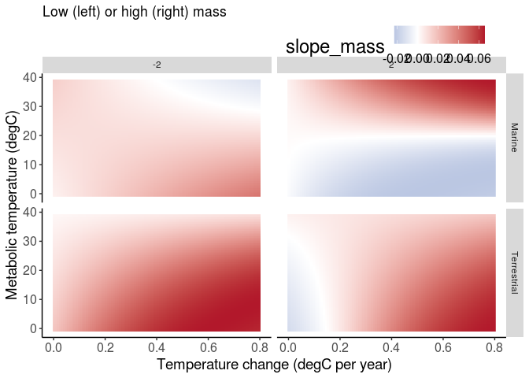<!-- -->
\#\#\# Interactions as lines \#\#\#\# Make the interaction effects

    ## [1] "Loaded interaction predictions from file"

#### Plot the interactions (raw)

More response to changing temperatures with - less microclimate
availability: thermal refugia are absent - more seasonality: may
indicate that phenological shifts are common and easier - more human
impacts on land: suggests cumulative effects of humans - higher NPP (or
less response with low NPP) in the ocean - smaller body size in cold
marine environments

Error bars are 95% CIs
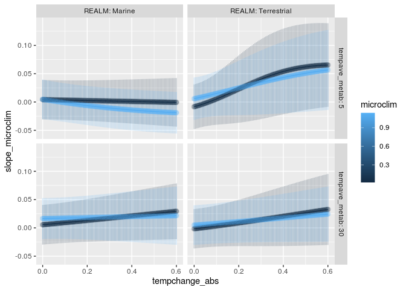<!-- -->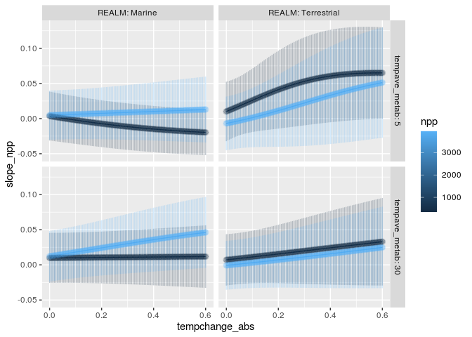<!-- -->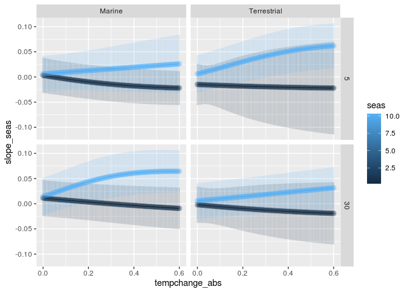<!-- -->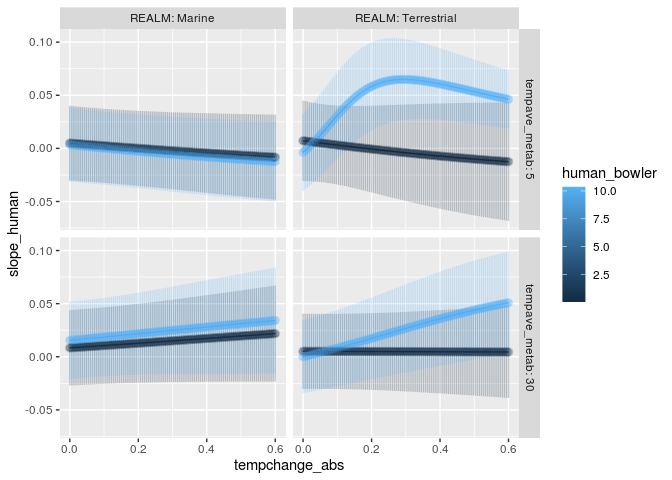<!-- -->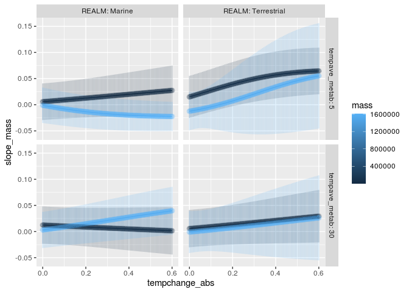<!-- -->

## Thermal bias test

Does the thermal bias of a community explain the proponsity to change
when temperature changes?

    ##                                                  df      AIC     dAIC
    ## modTsdTTRealmAllJtu_thermal_biasdata             22 -7008368 217.8451
    ## modTsdTTRealmthermal_biasAllJtu_thermal_biasdata 46 -7008586   0.0000

#### Thermal bias coefs

    ## 
    ## Conditional model:
    ##                                                                          (Intercept)                                                                              duration                                                                  duration:REALMMarine                                                             duration:REALMTerrestrial                                            duration:REALMFreshwater:tempchange_abs.sc  
    ##                                                                           -7.156e-01                                                                             6.635e-02                                                                            -2.817e-02                                                                            -4.067e-02                                                                             2.152e-03  
    ##                                               duration:REALMMarine:tempchange_abs.sc                                           duration:REALMTerrestrial:tempchange_abs.sc                                             duration:REALMFreshwater:tempave_metab.sc                                                 duration:REALMMarine:tempave_metab.sc                                            duration:REALMTerrestrial:tempave_metab.sc  
    ##                                                                            6.601e-04                                                                             1.273e-02                                                                             4.639e-02                                                                             1.693e-02                                                                            -7.157e-03  
    ##                          duration:REALMFreshwater:tempchange_abs.sc:tempave_metab.sc                               duration:REALMMarine:tempchange_abs.sc:tempave_metab.sc                          duration:REALMTerrestrial:tempchange_abs.sc:tempave_metab.sc                                      duration:REALMFreshwater:thermal_bias.sc:tsign-1                                          duration:REALMMarine:thermal_bias.sc:tsign-1  
    ##                                                                           -2.159e-02                                                                             4.038e-03                                                                            -8.070e-03                                                                            -1.049e-02                                                                            -3.328e-03  
    ##                                    duration:REALMTerrestrial:thermal_bias.sc:tsign-1                                       duration:REALMFreshwater:thermal_bias.sc:tsign1                                           duration:REALMMarine:thermal_bias.sc:tsign1                                      duration:REALMTerrestrial:thermal_bias.sc:tsign1                    duration:REALMFreshwater:tempchange_abs.sc:thermal_bias.sc:tsign-1  
    ##                                                                            2.288e-02                                                                             7.694e-03                                                                            -1.944e-03                                                                             9.640e-03                                                                             2.597e-02  
    ##                       duration:REALMMarine:tempchange_abs.sc:thermal_bias.sc:tsign-1                   duration:REALMTerrestrial:tempchange_abs.sc:thermal_bias.sc:tsign-1                     duration:REALMFreshwater:tempchange_abs.sc:thermal_bias.sc:tsign1                         duration:REALMMarine:tempchange_abs.sc:thermal_bias.sc:tsign1                    duration:REALMTerrestrial:tempchange_abs.sc:thermal_bias.sc:tsign1  
    ##                                                                            2.621e-04                                                                             3.058e-03                                                                             4.928e-02                                                                            -1.868e-03                                                                             8.025e-05  
    ##                    duration:REALMFreshwater:tempave_metab.sc:thermal_bias.sc:tsign-1                         duration:REALMMarine:tempave_metab.sc:thermal_bias.sc:tsign-1                    duration:REALMTerrestrial:tempave_metab.sc:thermal_bias.sc:tsign-1                      duration:REALMFreshwater:tempave_metab.sc:thermal_bias.sc:tsign1                          duration:REALMMarine:tempave_metab.sc:thermal_bias.sc:tsign1  
    ##                                                                           -4.996e-02                                                                            -1.300e-02                                                                            -9.891e-03                                                                            -1.553e-02                                                                            -9.754e-03  
    ##                    duration:REALMTerrestrial:tempave_metab.sc:thermal_bias.sc:tsign1   duration:REALMFreshwater:tempchange_abs.sc:tempave_metab.sc:thermal_bias.sc:tsign-1       duration:REALMMarine:tempchange_abs.sc:tempave_metab.sc:thermal_bias.sc:tsign-1  duration:REALMTerrestrial:tempchange_abs.sc:tempave_metab.sc:thermal_bias.sc:tsign-1    duration:REALMFreshwater:tempchange_abs.sc:tempave_metab.sc:thermal_bias.sc:tsign1  
    ##                                                                           -4.222e-03                                                                             4.174e-02                                                                            -3.221e-03                                                                            -1.150e-03                                                                             8.446e-02  
    ##       duration:REALMMarine:tempchange_abs.sc:tempave_metab.sc:thermal_bias.sc:tsign1   duration:REALMTerrestrial:tempchange_abs.sc:tempave_metab.sc:thermal_bias.sc:tsign1  
    ##                                                                           -4.351e-03                                                                             7.949e-04  
    ## 
    ## Dispersion model:
    ##      (Intercept)       REALMMarine  REALMTerrestrial  
    ##          -0.7771            0.1349            2.9553

#### Make or load thermal bias effect

    ## [1] "Loaded thermal bias predictions from file"

#### Plot thermal bias effects

Thermal bias is the Community Temperature Index minus the environmental
temperature. Positive means that the species are adapted to warmer
conditions than they are experiencing (and presumably are more tolerant
of warming but less tolerant of cooling).
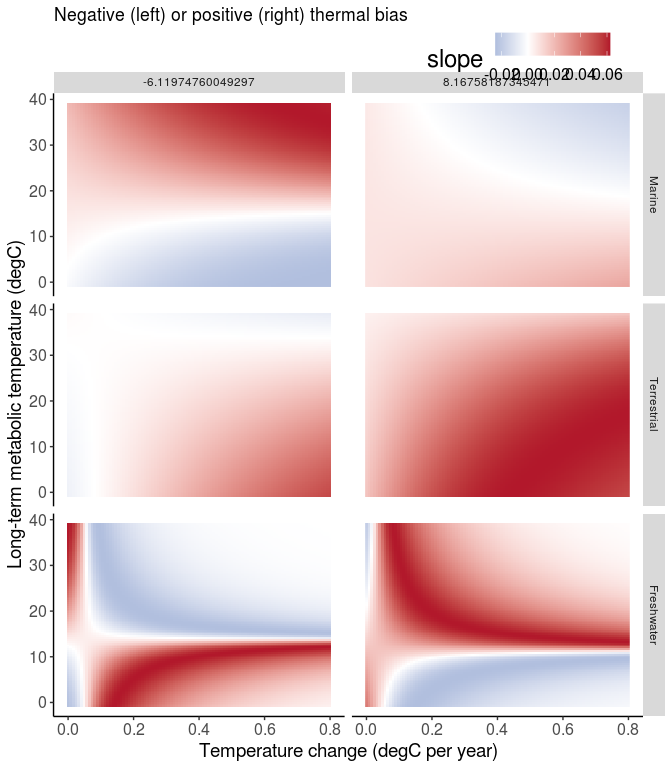<!-- -->
