Temperature change and the community response to temperature change
across realms using beta models
================

# Prep

First run turnover\_vs\_temperature\_GLMM\_fit.R to fit the models.

``` r
library(data.table) # for handling large datasets
library(ggplot2) # for some plotting
library(glmmTMB) # for ME models
library(lme4) # for plotting random effects dotplot
```

    ## Loading required package: Matrix

``` r
library(bbmle) # for AICtab
```

    ## Loading required package: stats4

``` r
library(gridExtra) # to combine ggplots together
library(grid) # to combine ggplots together
library(RColorBrewer)
library(scales) # for defining custom scales in ggplot
library(DHARMa) # for model diagnostics
```

    ## This is DHARMa 0.3.3.0. For overview type '?DHARMa'. For recent changes, type news(package = 'DHARMa') Note: Syntax of plotResiduals has changed in 0.3.0, see ?plotResiduals for details

``` r
library(here) # for relative paths
```

    ## here() starts at /local/home/malinp/climate_community_crossrealm

``` r
options(width=500) # turn off most text wrapping

signedsqrt = function(x) sign(x)*sqrt(abs(x))
signedsq = function(x) sign(x) * x^2
signedsqrttrans <- trans_new(name = 'signedsqrt', transform = signedsqrt, inverse = signedsq)


# tell RStudio to use project root directory as the root for this notebook. Needed since we are storing code in a separate directory.
knitr::opts_knit$set(root.dir = rprojroot::find_rstudio_root_file()) 

# Turnover and covariates assembled by turnover_vs_temperature_prep.Rmd
trends <- fread(here('output', 'turnover_w_covariates.csv.gz'))
```

# Summary stats

## Examine how many data points are available

### Just turnover and non-zero tempchange

``` r
cat('Overall # dissimilarities: ', nrow(trends), '\n')
```

    ## Overall # dissimilarities:  1288067

``` r
cat('# studies: ', trends[, length(unique(STUDY_ID))], '\n')
```

    ## # studies:  330

``` r
cat('# timeseries: ', trends[, length(unique(rarefyID))], '\n')
```

    ## # timeseries:  52623

``` r
trends[!duplicated(rarefyID), table(REALM)]
```

    ## REALM
    ##  Freshwater      Marine Terrestrial 
    ##        1054       48195        3374

``` r
trends[!duplicated(rarefyID), table(taxa_mod)]
```

    ## taxa_mod
    ##                         All                  Amphibians                     Benthos                       Birds                        Fish               Invertebrates                     Mammals Marine invertebrates/plants                       Plant                    Reptiles 
    ##                        1715                         381                        4672                       13617                       28276                        2906                         543                         206                         303                           4

``` r
trends[!duplicated(rarefyID), table(taxa_mod, REALM)]
```

    ##                              REALM
    ## taxa_mod                      Freshwater Marine Terrestrial
    ##   All                                  0   1712           3
    ##   Amphibians                           2      0         379
    ##   Benthos                              0   4672           0
    ##   Birds                                0  10945        2672
    ##   Fish                              1037  27239           0
    ##   Invertebrates                       13   2813          80
    ##   Mammals                              0    496          47
    ##   Marine invertebrates/plants          0    206           0
    ##   Plant                                1    112         190
    ##   Reptiles                             1      0           3

### With all covariates

Use Bowler for human impact

``` r
# the cases we can compare
apply(trends[, .(Jtu.sc, REALM, tempave_metab.sc, seas.sc, microclim.sc, tempchange.sc, mass.sc, speed.sc, consumerfrac.sc, endothermfrac.sc, nspp.sc, thermal_bias.sc, npp.sc, veg.sc, human_bowler.sc)], MARGIN = 2, FUN = function(x) sum(!is.na(x)))
```

    ##           Jtu.sc            REALM tempave_metab.sc          seas.sc     microclim.sc    tempchange.sc          mass.sc         speed.sc  consumerfrac.sc endothermfrac.sc          nspp.sc  thermal_bias.sc           npp.sc           veg.sc  human_bowler.sc 
    ##          1288067          1288067          1288067          1288067          1274691          1288067          1285632          1285874          1288067          1288067          1277351          1178645          1284409          1276521          1288067

``` r
i <- trends[, complete.cases(Jtu.sc, tempave_metab.sc, seas.sc, microclim.sc, tempchange.sc, mass.sc, speed.sc, consumerfrac.sc, nspp.sc, thermal_bias.sc, npp.sc, veg.sc, human_bowler.sc)]
cat('Overall # dissimilarities: ', sum(i), '\n')
```

    ## Overall # dissimilarities:  1160127

``` r
cat('# studies: ', trends[i, length(unique(STUDY_ID))], '\n')
```

    ## # studies:  231

``` r
cat('# timeseries: ', trends[i, length(unique(rarefyID))], '\n')
```

    ## # timeseries:  48863

``` r
trends[i & !duplicated(rarefyID), table(REALM)]
```

    ## REALM
    ##  Freshwater      Marine Terrestrial 
    ##         996       45083        2784

``` r
trends[i & !duplicated(rarefyID), table(taxa_mod)]
```

    ## taxa_mod
    ##                         All                  Amphibians                     Benthos                       Birds                        Fish               Invertebrates                     Mammals Marine invertebrates/plants                       Plant                    Reptiles 
    ##                        1683                          12                        4643                       11888                       27152                        2569                         533                         206                         175                           2

``` r
trends[i & !duplicated(rarefyID), table(taxa_mod, REALM)]
```

    ##                              REALM
    ## taxa_mod                      Freshwater Marine Terrestrial
    ##   All                                  0   1681           2
    ##   Amphibians                           2      0          10
    ##   Benthos                              0   4643           0
    ##   Birds                                0   9338        2550
    ##   Fish                               984  26168           0
    ##   Invertebrates                        9   2494          66
    ##   Mammals                              0    495          38
    ##   Marine invertebrates/plants          0    206           0
    ##   Plant                                1     58         116
    ##   Reptiles                             0      0           2

# Models

## Choose the variance structure

Try combinations of

  - beta errors
  - variance scaled to Nspp or to Nspp + REALM
  - random intercept for taxa\_mod2, STUDY\_ID, rarefyID
  - random slopes for (abs temperature trend) or for duration

Did not try random intercept for compID (for overdispersion), since had
trouble converging. Use a full set of fixed effects and choose the RE
with lowest AIC.

This chooses beta errors, random slopes (duration.sc) & intercepts for
STUDY\_ID and rarefyID, and variance scaled to nspp + realm. We haven’t
dealt with potential testing on the boundary issues here.

``` r
if(file.exists('temp/modRFgauss.rds')) modRFgauss <- readRDS('temp/modRFgauss.rds')
if(file.exists('temp/modRFbeta.rds')) modRFbeta <- readRDS('temp/modRFbeta.rds')
if(file.exists('temp/modRFrID.rds')) modRFrID <- readRDS('temp/modRFrID.rds')
if(file.exists('temp/modRF2lev.rds')) modRF2lev <- readRDS('temp/modRF2lev.rds')
if(file.exists('temp/modRFnestedRE.rds')) modRFnestedRE <- readRDS('temp/modRFnestedRE.rds')
#if(file.exists('temp/modRFslopeRE.rds')) modRFslopeRE <- readRDS('temp/modRFslopeRE.rds') # too complex to fit
if(file.exists('temp/modRFdisp.rds')) modRFdisp <- readRDS('temp/modRFdisp.rds')
if(file.exists('temp/modRFdisp2lev.rds')) modRFdisp2lev <- readRDS('temp/modRFdisp2lev.rds')
if(file.exists('temp/modRFdisp2levOnlyint.rds')) modRFdisp2levOnlyint <- readRDS('temp/modRFdisp2levOnlyint.rds')
if(file.exists('temp/modRFdurslope2lev.rds')) modRFdurslope2lev <- readRDS('temp/modRFdurslope2lev.rds')
if(file.exists('temp/modRFdurslope2levdisp.rds')) modRFdurslope2levdisp <- readRDS('temp/modRFdurslope2levdisp.rds')
if(file.exists('temp/modRFdurslope2levdisprealm.rds')) modRFdurslope2levdisprealm <- readRDS('temp/modRFdurslope2levdisprealm.rds')


AICtab(modRFgauss, modRFbeta, modRFrID, modRF2lev, modRFnestedRE, modRFdisp, modRFdisp2lev, modRFdisp2levOnlyint, modRFdurslope2lev, modRFdurslope2levdisp, modRFdurslope2levdisprealm)
```

    ##                            dAIC      df
    ## modRFdurslope2levdisprealm       0.0 32
    ## modRFdurslope2levdisp       343447.8 30
    ## modRFdisp2lev               362733.5 30
    ## modRFdisp                   362734.2 33
    ## modRFdisp2levOnlyint        372171.1 26
    ## modRFdurslope2lev           586830.7 29
    ## modRF2lev                   624617.1 25
    ## modRFnestedRE               624619.1 26
    ## modRFrID                    654571.4 24
    ## modRFbeta                  1095169.1 23
    ## modRFgauss                 8953261.0 23

### Summary

``` r
summary(modRFdurslope2levdisprealm)
```

    ##  Family: beta  ( logit )
    ## Formula:          Jtu.sc ~ tempchange_abs.sc * REALM + tempchange_abs.sc * tempave_metab.sc +      tempchange_abs.sc * duration.sc + tempchange_abs.sc * mass.sc +      tempchange_abs.sc * endothermfrac.sc + tempchange_abs.sc *      microclim.sc + tempchange_abs.sc * npp.sc + tempchange_abs.sc *      human_bowler.sc:REALM2 + (duration.sc | STUDY_ID/rarefyID)
    ## Dispersion:              ~nspp.sc + REALM
    ## Data: trends[i, ]
    ## 
    ##      AIC      BIC   logLik deviance df.resid 
    ## -8377142 -8376756  4188603 -8377206  1258784 
    ## 
    ## Random effects:
    ## 
    ## Conditional model:
    ##  Groups            Name        Variance Std.Dev. Corr  
    ##  rarefyID:STUDY_ID (Intercept) 0.23147  0.4811         
    ##                    duration.sc 0.05529  0.2351   0.32  
    ##  STUDY_ID          (Intercept) 2.76858  1.6639         
    ##                    duration.sc 0.10567  0.3251   -0.06 
    ## Number of obs: 1258816, groups:  rarefyID:STUDY_ID, 50637; STUDY_ID, 285
    ## 
    ## Conditional model:
    ##                                                     Estimate Std. Error z value Pr(>|z|)    
    ## (Intercept)                                       -0.2325202  0.3866849  -0.601 0.547629    
    ## tempchange_abs.sc                                  0.0421376  0.0132944   3.170 0.001527 ** 
    ## REALMMarine                                        0.2868689  0.4152730   0.691 0.489694    
    ## REALMTerrestrial                                  -1.1357116  0.4156768  -2.732 0.006291 ** 
    ## tempave_metab.sc                                   0.1667049  0.0139387  11.960  < 2e-16 ***
    ## duration.sc                                        0.1440513  0.0261094   5.517 3.44e-08 ***
    ## mass.sc                                           -0.0062390  0.0069460  -0.898 0.369070    
    ## endothermfrac.sc                                   0.0607137  0.0530511   1.144 0.252442    
    ## microclim.sc                                       0.0274998  0.0046677   5.891 3.83e-09 ***
    ## npp.sc                                             0.0444184  0.0056907   7.805 5.93e-15 ***
    ## tempchange_abs.sc:REALMMarine                     -0.0374660  0.0134637  -2.783 0.005390 ** 
    ## tempchange_abs.sc:REALMTerrestrial                -0.0484449  0.0133116  -3.639 0.000273 ***
    ## tempchange_abs.sc:tempave_metab.sc                 0.0206525  0.0045968   4.493 7.03e-06 ***
    ## tempchange_abs.sc:duration.sc                      0.0042907  0.0010113   4.243 2.21e-05 ***
    ## tempchange_abs.sc:mass.sc                          0.0021186  0.0018408   1.151 0.249769    
    ## tempchange_abs.sc:endothermfrac.sc                -0.0149381  0.0049941  -2.991 0.002779 ** 
    ## tempchange_abs.sc:microclim.sc                     0.0002156  0.0011809   0.183 0.855119    
    ## tempchange_abs.sc:npp.sc                           0.0032412  0.0015339   2.113 0.034598 *  
    ## human_bowler.sc:REALM2Marine                       0.0068522  0.0051160   1.339 0.180451    
    ## human_bowler.sc:REALM2TerrFresh                   -0.1022305  0.0103795  -9.849  < 2e-16 ***
    ## tempchange_abs.sc:human_bowler.sc:REALM2Marine    -0.0045353  0.0019049  -2.381 0.017270 *  
    ## tempchange_abs.sc:human_bowler.sc:REALM2TerrFresh -0.0020172  0.0013043  -1.547 0.121975    
    ## ---
    ## Signif. codes:  0 '***' 0.001 '**' 0.01 '*' 0.05 '.' 0.1 ' ' 1
    ## 
    ## Dispersion model:
    ##                   Estimate Std. Error z value Pr(>|z|)    
    ## (Intercept)      -0.396689   0.011264   -35.2   <2e-16 ***
    ## nspp.sc           0.512791   0.001147   447.2   <2e-16 ***
    ## REALMMarine      -0.167458   0.011320   -14.8   <2e-16 ***
    ## REALMTerrestrial  2.153035   0.011662   184.6   <2e-16 ***
    ## ---
    ## Signif. codes:  0 '***' 0.001 '**' 0.01 '*' 0.05 '.' 0.1 ' ' 1

### Plot random effects

No clear discontinuities. Looks ok.

``` r
lme4:::dotplot.ranef.mer(ranef(modRFdurslope2levdisprealm)$cond)
```

    ## $`rarefyID:STUDY_ID`

<!-- -->

    ## 
    ## $STUDY_ID

<!-- -->

### DHARMa simulate residuals

``` r
## run the top part by hand if needed. takes ~3 hrs
if(FALSE) {
  i <- trends[, complete.cases(Jtu.sc, tempchange_abs.sc, REALM, tempave_metab.sc, duration.sc, mass.sc, 
                               endothermfrac.sc, microclim.sc, npp.sc, human_bowler.sc, nspp.sc)]
  
  res_RFdurslope2levdisprealm <- simulateResiduals(modRFdurslope2levdisprealm, n = 250)
  
  saveRDS(res_RFdurslope2levdisprealm, file = 'temp/res_RFdurslope2levdisprealm.rds')
} else {
  if(file.exists('temp/res_RFdurslope2levdisprealm.rds')) res_RFdurslope2levdisprealm <- readRDS('temp/res_RFdurslope2levdisprealm.rds')
}
```

#### Plot residuals for model fit to all data

There are many outliers and signs of underdispersion, but this is
probably ok.

``` r
if(exists('res_RFdurslope2levdisprealm')){
  i <- trends[, complete.cases(Jtu.sc, tempchange_abs.sc, REALM, tempave_metab.sc, duration.sc, mass.sc, endothermfrac.sc,
                               microclim.sc, npp.sc, human_bowler.sc, nspp.sc)]
  plot(res_RFdurslope2levdisprealm)
  plotResiduals(res_RFdurslope2levdisprealm, form=trends$tempchange_abs.sc[i], xlab = 'tempchange_abs.sc', main = '')
  plotResiduals(res_RFdurslope2levdisprealm, form=trends$REALM[i], xlab = 'REALM', main = '')
  plotResiduals(res_RFdurslope2levdisprealm, trends$tempave_metab.sc[i], xlab = 'tempave_metab.sc', main = '')
  plotResiduals(res_RFdurslope2levdisprealm, trends$duration.sc[i], xlab = 'duration.sc', main = '')
  plotResiduals(res_RFdurslope2levdisprealm, trends$mass.sc[i], xlab = 'mass.sc', main = '')
  plotResiduals(res_RFdurslope2levdisprealm, trends$endothermfrac.sc[i], xlab = 'endothermfrac.sc', main = '')
  plotResiduals(res_RFdurslope2levdisprealm, trends$microclim.sc[i], xlab = 'microclim.sc', main = '')
  plotResiduals(res_RFdurslope2levdisprealm, trends$npp.sc[i], xlab = 'npp.sc', main = '')
  plotResiduals(res_RFdurslope2levdisprealm, form=trends$human_bowler.sc[i], xlab = 'human_bowler.sc', main = '')
}
```

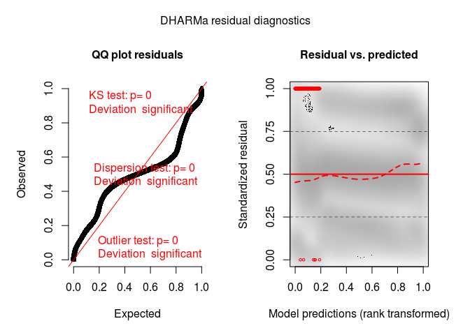<!-- -->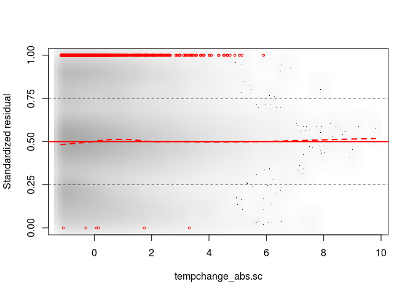<!-- -->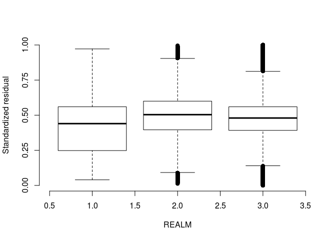<!-- -->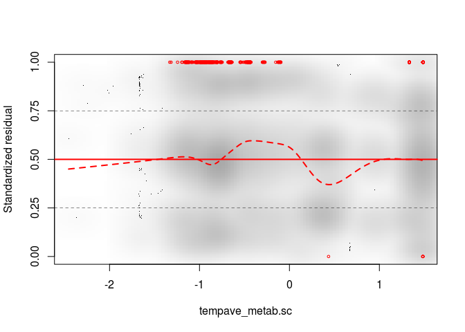<!-- -->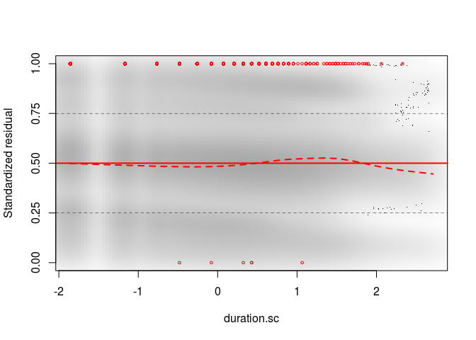<!-- -->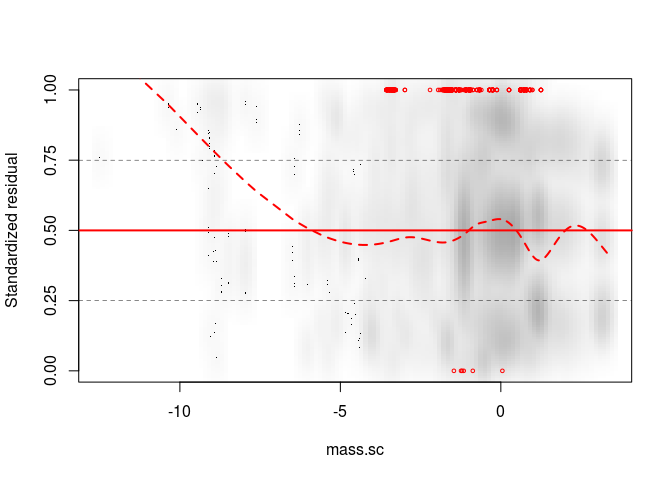<!-- -->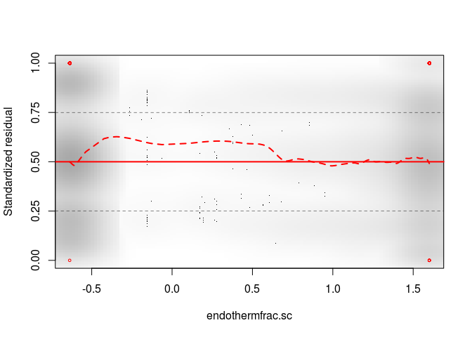<!-- -->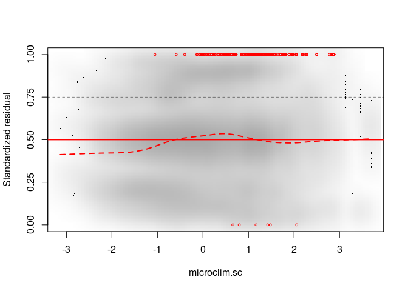<!-- -->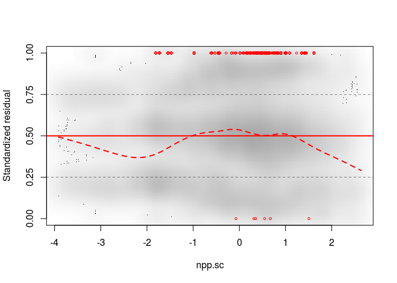<!-- -->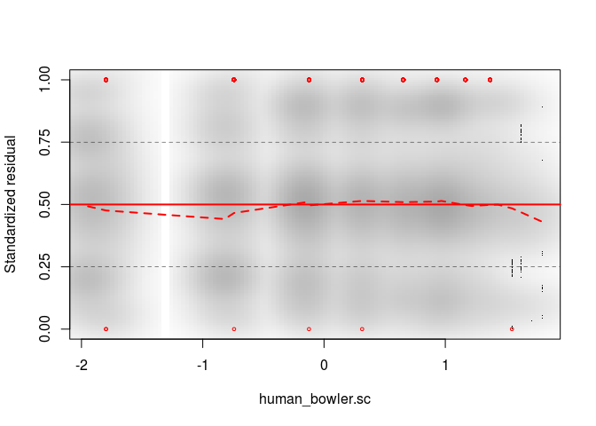<!-- -->

#### Overdispersion

There is underdispersion.

``` r
i <- trends[, complete.cases(Jtu.sc, tempchange_abs.sc, REALM, tempave_metab.sc, duration.sc, mass.sc, endothermfrac.sc,
                             microclim.sc, npp.sc, human_bowler.sc, nspp.sc)]
testDispersion(res_RFdurslope2levdisprealm)
```

<!-- -->

    ## 
    ##  DHARMa nonparametric dispersion test via sd of residuals fitted vs. simulated
    ## 
    ## data:  simulationOutput
    ## ratioObsSim = 0.7724, p-value < 2.2e-16
    ## alternative hypothesis: two.sided

#### Near-zero-inflation

(Zero values have been transformed to slightly \>0, so can’t test
zero-inflation directly)

Near-zero values are not inflated.

``` r
countNearZero <- function(x) sum(x < 0.0001)
i <- trends[, complete.cases(Jtu.sc, tempchange_abs.sc, REALM, tempave_metab.sc, duration.sc, mass.sc, endothermfrac.sc,
                             microclim.sc, npp.sc, human_bowler.sc, nspp.sc)]
testGeneric(res_RFdurslope2levdisprealm, summary = countNearZero, alternative = 'greater')
```

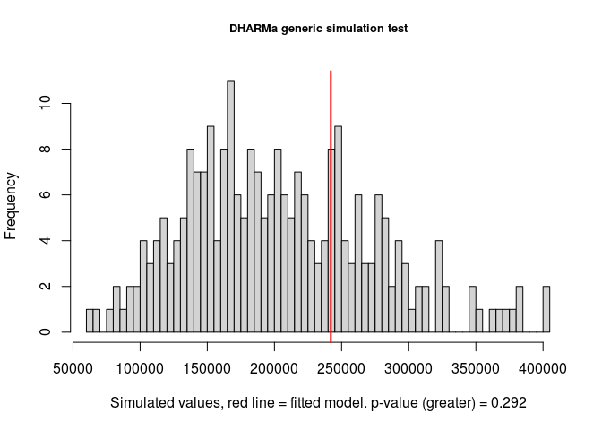<!-- -->

    ## 
    ##  DHARMa generic simulation test
    ## 
    ## data:  res_RFdurslope2levdisprealm
    ## ratioObsSim = 1.1861, p-value = 0.292
    ## alternative hypothesis: greater

#### Near-one-inflation

Near-one values are not inflated.

``` r
countNearOne <- function(x) sum(x > 0.9999)
i <- trends[, complete.cases(Jtu.sc, tempchange_abs.sc, REALM, tempave_metab.sc, duration.sc, mass.sc, endothermfrac.sc,
                             microclim.sc, npp.sc, human_bowler.sc, nspp.sc)]
testGeneric(res_RFdurslope2levdisprealm, summary = countNearOne, alternative = 'greater')
```

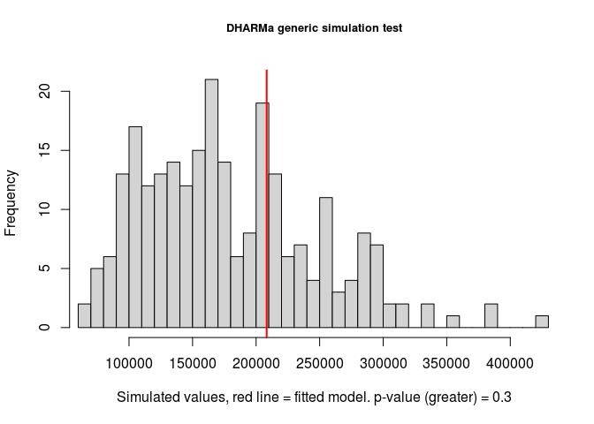<!-- -->

    ## 
    ##  DHARMa generic simulation test
    ## 
    ## data:  res_RFdurslope2levdisprealm
    ## ratioObsSim = 1.1629, p-value = 0.3
    ## alternative hypothesis: greater

## Temperature-change-only models

Not run right now

### Load the models

``` r
# all years
modonlyTchangeJtu <- readRDS('temp/modonlyTchangeJtu.rds')
modonlyTchangeJbeta <- readRDS('temp/modonlyTchangeJbeta.rds')
modonlyTchangeHorn <- readRDS('temp/modonlyTchangeHorn.rds')

# 1 year
modonlyTchange1yrJtu <- readRDS('temp/modonlyTchange1yrJtu.rds')
modonlyTchange1yrJbeta <- readRDS('temp/modonlyTchange1yrJbeta.rds')
modonlyTchange1yrHorn <- readRDS('temp/modonlyTchange1yrHorn.rds')

# 10 year
modonlyTchange10yrJtu <- readRDS('temp/modonlyTchange10yrJtu.rds')
modonlyTchange10yrJbeta <- readRDS('temp/modonlyTchange10yrJbeta.rds')
modonlyTchange10yrHorn <- readRDS('temp/modonlyTchange10yrHorn.rds')
```

### Summary (all years)

``` r
summary(modonlyTchangeJtu)
summary(modonlyTchangeJbeta)
summary(modonlyTchangeHorn)
```

### Summary (1 year)

``` r
summary(modonlyTchange1yrJtu)
summary(modonlyTchange1yrJbeta)
summary(modonlyTchange1yrHorn)
```

### Summary (10 year)

``` r
summary(modonlyTchange10yrJtu)
summary(modonlyTchange10yrJbeta)
summary(modonlyTchange10yrHorn)
```

### Plot the temp-only coefficients

``` r
# make table of coefficients
coefs1 <- as.data.frame(summary(modonlyTchangeJtu)$coefficients$cond)
coefs2 <- as.data.frame(summary(modonlyTchangeJbeta)$coefficients$cond)
coefs3 <- as.data.frame(summary(modonlyTchangeHorn)$coefficients$cond)
coefs4 <- as.data.frame(summary(modonlyTchange1yrJtu)$coefficients$cond)
coefs5 <- as.data.frame(summary(modonlyTchange1yrJbeta)$coefficients$cond)
coefs6 <- as.data.frame(summary(modonlyTchange1yrHorn)$coefficients$cond)
coefs7 <- as.data.frame(summary(modonlyTchange10yrJtu)$coefficients$cond)
coefs8 <- as.data.frame(summary(modonlyTchange10yrJbeta)$coefficients$cond)
coefs9 <- as.data.frame(summary(modonlyTchange10yrHorn)$coefficients$cond)
coefs1$response <- coefs4$response <- coefs7$response <- 'Jtu'
coefs2$response <- coefs5$response <- coefs8$response <- 'Jbeta'
coefs3$response <- coefs6$response <- coefs9$response <- 'Horn'
coefs1$fit <- coefs2$fit <- coefs3$fit <- 'all'
coefs4$fit <- coefs5$fit <- coefs6$fit <- '1yr'
coefs7$fit <- coefs8$fit <- coefs9$fit <- '10yr'
rows1 <- which(grepl('tempchange', rownames(coefs1))) # extract temperature effect
cols <- c('Estimate', 'Std. Error', 'response', 'fit')
allcoefs <- rbind(coefs1[rows1, cols], coefs2[rows1, cols], coefs3[rows1, cols],
                  coefs4[rows1, cols], coefs5[rows1, cols], coefs6[rows1, cols],
                  coefs7[rows1, cols], coefs8[rows1, cols], coefs9[rows1, cols])

allcoefs$lCI <- allcoefs$Estimate - 1.96 * allcoefs$`Std. Error` # lower confidence interval
allcoefs$uCI <- allcoefs$Estimate + 1.96 * allcoefs$`Std. Error`
allcoefs$y <- c(3, 2, 1) + rep(c(0, -0.1, -0.2), c(3, 3, 3)) # y-values
allcoefs$group <- paste0(allcoefs$response, allcoefs$fit)

pd <- position_dodge(width = 0.5)
ggplot(allcoefs, aes(x = response, y = Estimate, color = fit, group = group)) +
  geom_point(position = pd) + 
  geom_errorbar(aes(ymin=lCI, ymax=uCI), width=.1, position = pd) +
  labs(y = 'Dissimilarity per |°C change|') #+ 
  #coord_cartesian(ylim = c(-0.01, 0.05))
```

CIs are 1.96\*SE

## Temperature-change\&duration models

Not run right now

### Load the models

``` r
# all years
modTDJtu <- readRDS('temp/modTDJtu.rds')
modTDJbeta <- readRDS('temp/modTDJbeta.rds')
modTDHorn <- readRDS('temp/modTDHorn.rds')
```

### Summary

``` r
summary(modTDJtu)
summary(modTDJbeta)
summary(modTDHorn)
```

### Plot the coefficients

``` r
coefs1 <- summary(modTDJtu)$coefficients$cond
coefs2 <- summary(modTDJbeta)$coefficients$cond
coefs3 <- summary(modTDHorn)$coefficients$cond

varstoplot <- unique(c(rownames(coefs1), rownames(coefs2), rownames(coefs3)))
varstoplot <- varstoplot[which(!grepl('Intercept', varstoplot) | grepl(':', varstoplot))] # vars to plot

rows1_1 <- which(rownames(coefs1) %in% varstoplot) # rows in coefs
rows1_2 <- which(rownames(coefs2) %in% varstoplot)
rows1_3 <- which(rownames(coefs3) %in% varstoplot)
xlims <- range(c(coefs1[rows1_1,1] - 1.96*coefs1[rows1_1,2], coefs1[rows1_1,1] + 1.96*coefs1[rows1_1,2], 
                  coefs2[rows1_2,1] - 1.96*coefs2[rows1_2,2], coefs2[rows1_2,1] + 1.96*coefs2[rows1_2,2], 
                  coefs3[rows1_3,1] - 1.96*coefs3[rows1_3,2], coefs3[rows1_3,1] + 1.96*coefs3[rows1_3,2]))

cols <- brewer.pal(3, 'Dark2') # for Jtu, Jbeta and Horn models
pchs <- c(16, 16, 16)
offs <- c(0.1, 0, -0.1) # offset vertically for each model

par(las = 1, mai = c(0.5, 4, 0.1, 0.1))

plot(0,0, col = 'white', xlim = xlims, ylim = c(0.9,length(varstoplot)+0.1), yaxt='n', xlab = '', ylab ='')
axis(2, at = length(varstoplot):1, labels = varstoplot, cex.axis = 0.7)
abline(v = 0, col = 'grey', lty = 2)
abline(h = 1:length(varstoplot), col = 'grey', lty = 3)
for(i in 1:length(varstoplot)){
  if(varstoplot[i] %in% rownames(coefs1)){
    x = coefs1[rownames(coefs1) == varstoplot[i], 1] # the coef in col 1
    se = coefs1[rownames(coefs1) == varstoplot[i], 2] # the SE in col 2
    points(x, length(varstoplot) + 1 - i + offs[1], pch = pchs[1], col = cols[1])
    lines(x = c(x-1.96*se, x+1.96*se), y = c(length(varstoplot) + 1 - i + offs[1], length(varstoplot) + 1 - i + offs[1]), col = cols[1])
  }
  if(varstoplot[i] %in% rownames(coefs2)){
    x = coefs2[rownames(coefs2) == varstoplot[i], 1]
    se = coefs2[rownames(coefs2) == varstoplot[i], 2]
    points(x, length(varstoplot) + 1 - i + offs[2], pch = pchs[2], col = cols[2])
    lines(x = c(x-1.96*se, x+1.96*se), y = c(length(varstoplot) + 1 - i + offs[2], length(varstoplot) + 1 - i + offs[2]), col = cols[2])
  }
  if(varstoplot[i] %in% rownames(coefs3)){
    x = coefs3[rownames(coefs3) == varstoplot[i], 1]
    se = coefs3[rownames(coefs3) == varstoplot[i], 2]
    points(x, length(varstoplot) + 1 - i + offs[3], pch = pchs[3], col = cols[3])
    lines(x = c(x-1.96*se, x+1.96*se), y = c(length(varstoplot) + 1 - i + offs[3], length(varstoplot) + 1 - i + offs[3]), col = cols[3])
  }
}
legend('bottomright', col = cols, pch = 16, lwd = 1, legend = c('Jtu', 'Jbeta', 'Horn'), cex = 0.5)
```

abs(tempchange) is in degC

duration is in years

### Plot the response

``` r
if(!file.exists('temp/modTDJtu_preds.rds')) {
  newdat <- expand.grid(duration = c(1, 50), tempchange = seq(0.01, 5, length.out = 5), 
                      taxa_mod2 = NA, STUDY_ID = NA, rarefyID = NA,
                      Nspp = 60) # no REs, ave number of species
  scaling <- fread('output/turnover_w_covariates_scaling.csv')
  cent <- scaling$center[scaling$var == 'tempchange_abs.sc'] # centering
  scl <- scaling$scale[scaling$var == 'tempchange_abs.sc'] # scaling factor for tempchange
  newdat$tempchange_abs.sc <- (abs(newdat$tempchange)-cent)/scl
  cent <- scaling$center[scaling$var == 'nspp.sc'] # centering
  scl <- scaling$scale[scaling$var == 'nspp.sc'] # scaling factor for tempchange
  newdat$nspp.sc <- (log(newdat$Nspp) - cent)/scl
  Jtu <- predict(modTDJtu, newdata = newdat, se.fit = TRUE, re.form = NA, type = 'response')
  newdat$durationfac <- as.factor(newdat$duration)
  newdat$Jtu <- Jtu$fit
  newdat$Jtu.se <- Jtu$se.fit
  
  saveRDS(newdat, file = 'temp/modTDJtu_preds.rds')
} else {
  newdat <- readRDS('temp/modTDJtu_preds.rds')
}

ggplot(newdat, aes(tempchange, Jtu, color = durationfac, group = durationfac)) +
  geom_line() +
  geom_ribbon(aes(ymin=Jtu - 1.96*Jtu.se, ymax=Jtu + 1.96*Jtu.se), alpha = 0.1, linetype = 'blank')
```

## Temperature-change and duration by REALM

These don’t seem the most informative right now, since they lack many of
the other factors that are likely important, like average temperature.
\#\#\# Load the models

``` r
# all years
if(file.exists('temp/modTDrealmJtu.rds')) modTDrealmJtu <- readRDS('temp/modTDrealmJtu.rds')
if(file.exists('temp/modTDrealmJbeta.rds')) modTDrealmJbeta <- readRDS('temp/modTDrealmJbeta.rds')
if(file.exists('temp/modTDrealmHorn.rds')) modTDrealmHorn <- readRDS('temp/modTDrealmHorn.rds')

# 1 year
if(file.exists('temp/modTrealm1yrJtu.rds')) modTrealm1yrJtu <- readRDS('temp/modTrealm1yrJtu.rds')
if(file.exists('temp/modTrealm1yrJbeta.rds')) modTrealm1yrJbeta <- readRDS('temp/modTrealm1yrJbeta.rds')
if(file.exists('temp/modTrealm1yrHorn.rds')) modTrealm1yrHorn <- readRDS('temp/modTrealm1yrHorn.rds')

# 10 year
if(file.exists('temp/modTrealm10yrJtu.rds')) modTrealm10yrJtu <- readRDS('temp/modTrealm10yrJtu.rds')
if(file.exists('temp/modTrealm10yrJbeta.rds')) modTrealm10yrJbeta <- readRDS('temp/modTrealm10yrJbeta.rds')
if(file.exists('temp/modTrealm10yrHorn.rds')) modTrealm10yrHorn <- readRDS('temp/modTrealm10yrHorn.rds')
```

### Summary

``` r
if(exists('modTDrealmJtu')) summary(modTDrealmJtu)
```

    ##  Family: beta  ( logit )
    ## Formula:          Jtu.sc ~ abs(tempchange) * duration + abs(tempchange) * REALM +      (duration.sc | STUDY_ID/rarefyID)
    ## Dispersion:              ~nspp.sc + REALM
    ## Data: trends[i, ]
    ## 
    ##      AIC      BIC   logLik deviance df.resid 
    ## -8675720 -8675503  4337878 -8675756  1277333 
    ## 
    ## Random effects:
    ## 
    ## Conditional model:
    ##  Groups            Name        Variance Std.Dev. Corr  
    ##  rarefyID:STUDY_ID (Intercept) 0.23119  0.4808         
    ##                    duration.sc 0.05379  0.2319   0.32  
    ##  STUDY_ID          (Intercept) 2.68752  1.6394         
    ##                    duration.sc 0.14591  0.3820   -0.02 
    ## Number of obs: 1277351, groups:  rarefyID:STUDY_ID, 52322; STUDY_ID, 305
    ## 
    ## Conditional model:
    ##                                    Estimate Std. Error z value Pr(>|z|)    
    ## (Intercept)                      -0.4303837  0.3737520  -1.152  0.24952    
    ## abs(tempchange)                   0.0603276  0.0250581   2.408  0.01606 *  
    ## duration                         -0.0029585  0.0003236  -9.143  < 2e-16 ***
    ## REALMMarine                       0.4141390  0.4020033   1.030  0.30292    
    ## REALMTerrestrial                 -0.8393297  0.3976593  -2.111  0.03480 *  
    ## abs(tempchange):duration          0.0008374  0.0001739   4.814 1.48e-06 ***
    ## abs(tempchange):REALMMarine      -0.0695000  0.0252085  -2.757  0.00583 ** 
    ## abs(tempchange):REALMTerrestrial -0.0697287  0.0251154  -2.776  0.00550 ** 
    ## ---
    ## Signif. codes:  0 '***' 0.001 '**' 0.01 '*' 0.05 '.' 0.1 ' ' 1
    ## 
    ## Dispersion model:
    ##                   Estimate Std. Error z value Pr(>|z|)    
    ## (Intercept)      -0.386470   0.011218   -34.5   <2e-16 ***
    ## nspp.sc           0.517466   0.001133   456.8   <2e-16 ***
    ## REALMMarine      -0.179269   0.011271   -15.9   <2e-16 ***
    ## REALMTerrestrial  2.116082   0.011612   182.2   <2e-16 ***
    ## ---
    ## Signif. codes:  0 '***' 0.001 '**' 0.01 '*' 0.05 '.' 0.1 ' ' 1

``` r
if(exists('modTDrealmJbeta')) summary(modTDrealmJbeta)
```

    ##  Family: beta  ( logit )
    ## Formula:          Jbeta.sc ~ abs(tempchange) * duration + abs(tempchange) * REALM +      (tempchange_abs.sc | STUDY_ID/rarefyID)
    ## Dispersion:                ~nspp.sc
    ## Data: trends[i, ]
    ## 
    ##      AIC      BIC   logLik deviance df.resid 
    ## -5472808 -5472615  2736420 -5472840  1277335 
    ## 
    ## Random effects:
    ## 
    ## Conditional model:
    ##  Groups            Name              Variance Std.Dev. Corr  
    ##  rarefyID:STUDY_ID (Intercept)       0.32783  0.5726         
    ##                    tempchange_abs.sc 0.07957  0.2821   -0.27 
    ##  STUDY_ID          (Intercept)       2.29755  1.5158         
    ##                    tempchange_abs.sc 0.03415  0.1848   -0.14 
    ## Number of obs: 1277351, groups:  rarefyID:STUDY_ID, 52322; STUDY_ID, 305
    ## 
    ## Conditional model:
    ##                                    Estimate Std. Error z value Pr(>|z|)    
    ## (Intercept)                       0.1025741  0.3496384    0.29   0.7692    
    ## abs(tempchange)                   0.1326239  0.0903329    1.47   0.1421    
    ## duration                          0.0141599  0.0001303  108.67   <2e-16 ***
    ## REALMMarine                       0.6683325  0.3764163    1.78   0.0758 .  
    ## REALMTerrestrial                 -0.3493221  0.3736778   -0.93   0.3499    
    ## abs(tempchange):duration         -0.0014928  0.0001311  -11.38   <2e-16 ***
    ## abs(tempchange):REALMMarine      -0.0427631  0.0956490   -0.45   0.6548    
    ## abs(tempchange):REALMTerrestrial -0.1385311  0.0995466   -1.39   0.1640    
    ## ---
    ## Signif. codes:  0 '***' 0.001 '**' 0.01 '*' 0.05 '.' 0.1 ' ' 1
    ## 
    ## Dispersion model:
    ##             Estimate Std. Error z value Pr(>|z|)    
    ## (Intercept) 1.477624   0.001304  1133.3   <2e-16 ***
    ## nspp.sc     1.039132   0.001151   903.2   <2e-16 ***
    ## ---
    ## Signif. codes:  0 '***' 0.001 '**' 0.01 '*' 0.05 '.' 0.1 ' ' 1

``` r
if(exists('modTDrealmHorn')) summary(modTDrealmHorn)
```

    ##  Family: beta  ( logit )
    ## Formula:          Horn.sc ~ abs(tempchange) * duration + abs(tempchange) * REALM +      (duration.sc | STUDY_ID/rarefyID)
    ## Dispersion:               ~nspp.sc + REALM
    ## Data: trends[i, ]
    ## 
    ##      AIC      BIC   logLik deviance df.resid 
    ## -5707558 -5707341  2853797 -5707594  1248243 
    ## 
    ## Random effects:
    ## 
    ## Conditional model:
    ##  Groups            Name        Variance Std.Dev. Corr  
    ##  rarefyID:STUDY_ID (Intercept) 0.31142  0.5581         
    ##                    duration.sc 0.03127  0.1768   0.11  
    ##  STUDY_ID          (Intercept) 3.27650  1.8101         
    ##                    duration.sc 0.16702  0.4087   -0.04 
    ## Number of obs: 1248261, groups:  rarefyID:STUDY_ID, 51273; STUDY_ID, 285
    ## 
    ## Conditional model:
    ##                                    Estimate Std. Error z value Pr(>|z|)    
    ## (Intercept)                       0.2005832  0.4127947   0.486   0.6270    
    ## abs(tempchange)                   0.0203508  0.0224670   0.906   0.3650    
    ## duration                          0.0085557  0.0002923  29.268  < 2e-16 ***
    ## REALMMarine                       0.4062522  0.4463564   0.910   0.3627    
    ## REALMTerrestrial                 -0.8118263  0.4371280  -1.857   0.0633 .  
    ## abs(tempchange):duration          0.0012318  0.0001563   7.882 3.22e-15 ***
    ## abs(tempchange):REALMMarine      -0.0179733  0.0226059  -0.795   0.4266    
    ## abs(tempchange):REALMTerrestrial -0.0281321  0.0225341  -1.248   0.2119    
    ## ---
    ## Signif. codes:  0 '***' 0.001 '**' 0.01 '*' 0.05 '.' 0.1 ' ' 1
    ## 
    ## Dispersion model:
    ##                   Estimate Std. Error z value Pr(>|z|)    
    ## (Intercept)       0.434962   0.011683    37.2  < 2e-16 ***
    ## nspp.sc           0.463157   0.001159   399.8  < 2e-16 ***
    ## REALMMarine      -0.070563   0.011730    -6.0 1.79e-09 ***
    ## REALMTerrestrial  1.692746   0.012082   140.1  < 2e-16 ***
    ## ---
    ## Signif. codes:  0 '***' 0.001 '**' 0.01 '*' 0.05 '.' 0.1 ' ' 1

### Summary (1 yr)

``` r
if(exists('modTrealm1yrJtu')) summary(modTrealm1yrJtu)
```

    ##  Family: beta  ( logit )
    ## Formula:          Jtu.sc ~ abs(tempchange) * REALM + (1 | STUDY_ID/rarefyID)
    ## Dispersion:              ~nspp.sc + REALM
    ## Data: trends[i, ]
    ## 
    ##       AIC       BIC    logLik  deviance  df.resid 
    ## -962802.7 -962685.8  481413.3 -962826.7    125574 
    ## 
    ## Random effects:
    ## 
    ## Conditional model:
    ##  Groups            Name        Variance Std.Dev.
    ##  rarefyID:STUDY_ID (Intercept) 0.1629   0.4036  
    ##  STUDY_ID          (Intercept) 2.2154   1.4884  
    ## Number of obs: 125586, groups:  rarefyID:STUDY_ID, 30311; STUDY_ID, 249
    ## 
    ## Conditional model:
    ##                                  Estimate Std. Error z value Pr(>|z|)  
    ## (Intercept)                      -0.78129    0.36337  -2.150   0.0315 *
    ## abs(tempchange)                   0.10123    0.09322   1.086   0.2776  
    ## REALMMarine                       0.62122    0.39006   1.593   0.1112  
    ## REALMTerrestrial                 -0.21457    0.39263  -0.546   0.5847  
    ## abs(tempchange):REALMMarine      -0.14511    0.09417  -1.541   0.1233  
    ## abs(tempchange):REALMTerrestrial -0.09808    0.09393  -1.044   0.2964  
    ## ---
    ## Signif. codes:  0 '***' 0.001 '**' 0.01 '*' 0.05 '.' 0.1 ' ' 1
    ## 
    ## Dispersion model:
    ##                  Estimate Std. Error z value Pr(>|z|)    
    ## (Intercept)      -0.52032    0.03565  -14.60   <2e-16 ***
    ## nspp.sc           0.39707    0.00335  118.51   <2e-16 ***
    ## REALMMarine      -0.08498    0.03575   -2.38   0.0175 *  
    ## REALMTerrestrial  1.84309    0.03708   49.70   <2e-16 ***
    ## ---
    ## Signif. codes:  0 '***' 0.001 '**' 0.01 '*' 0.05 '.' 0.1 ' ' 1

``` r
if(exists('modTrealm1yrJbeta')) summary(modTrealm1yrJbeta)
```

    ##  Family: beta  ( logit )
    ## Formula:          Jbeta.sc ~ abs(tempchange) * REALM + (tempchange_abs.sc | STUDY_ID/rarefyID)
    ## Dispersion:                ~nspp.sc
    ## Data: trends[i, ]
    ## 
    ##      AIC      BIC   logLik deviance df.resid 
    ##       NA       NA       NA       NA   125572 
    ## 
    ## Random effects:
    ## 
    ## Conditional model:
    ##  Groups            Name              Variance Std.Dev. Corr  
    ##  rarefyID:STUDY_ID (Intercept)       0.260705 0.51059        
    ##                    tempchange_abs.sc 0.002686 0.05182  -1.00 
    ##  STUDY_ID          (Intercept)       2.271280 1.50708        
    ##                    tempchange_abs.sc 0.039906 0.19976  -0.25 
    ## Number of obs: 125586, groups:  rarefyID:STUDY_ID, 30311; STUDY_ID, 249
    ## 
    ## Conditional model:
    ##                                  Estimate Std. Error z value Pr(>|z|)   
    ## (Intercept)                      -0.39965    0.36843  -1.085  0.27804   
    ## abs(tempchange)                   0.07941    0.10672   0.744  0.45682   
    ## REALMMarine                       1.06870    0.39525   2.704  0.00685 **
    ## REALMTerrestrial                  0.31823    0.39945   0.797  0.42564   
    ## abs(tempchange):REALMMarine      -0.09320    0.11440  -0.815  0.41529   
    ## abs(tempchange):REALMTerrestrial -0.08352    0.11826  -0.706  0.48004   
    ## ---
    ## Signif. codes:  0 '***' 0.001 '**' 0.01 '*' 0.05 '.' 0.1 ' ' 1
    ## 
    ## Dispersion model:
    ##             Estimate Std. Error z value Pr(>|z|)    
    ## (Intercept) 1.220386   0.004477   272.6   <2e-16 ***
    ## nspp.sc     0.822607   0.003526   233.3   <2e-16 ***
    ## ---
    ## Signif. codes:  0 '***' 0.001 '**' 0.01 '*' 0.05 '.' 0.1 ' ' 1

``` r
if(exists('modTrealm1yrHorn')) summary(modTrealm1yrHorn)
```

    ##  Family: beta  ( logit )
    ## Formula:          Horn.sc ~ abs(tempchange) * REALM + (1 | STUDY_ID/rarefyID)
    ## Dispersion:               ~nspp.sc + REALM
    ## Data: trends[i, ]
    ## 
    ##       AIC       BIC    logLik  deviance  df.resid 
    ## -475045.3 -474928.7  237534.7 -475069.3    122717 
    ## 
    ## Random effects:
    ## 
    ## Conditional model:
    ##  Groups            Name        Variance Std.Dev.
    ##  rarefyID:STUDY_ID (Intercept) 0.2134   0.462   
    ##  STUDY_ID          (Intercept) 2.8833   1.698   
    ## Number of obs: 122729, groups:  rarefyID:STUDY_ID, 29717; STUDY_ID, 232
    ## 
    ## Conditional model:
    ##                                  Estimate Std. Error z value Pr(>|z|)
    ## (Intercept)                      -0.30581    0.41043  -0.745    0.456
    ## abs(tempchange)                   0.02172    0.08896   0.244    0.807
    ## REALMMarine                       0.55453    0.44492   1.246    0.213
    ## REALMTerrestrial                 -0.22254    0.44414  -0.501    0.616
    ## abs(tempchange):REALMMarine      -0.06341    0.08987  -0.706    0.481
    ## abs(tempchange):REALMTerrestrial -0.02328    0.08960  -0.260    0.795
    ## 
    ## Dispersion model:
    ##                  Estimate Std. Error z value Pr(>|z|)    
    ## (Intercept)      0.028799   0.034489    0.84  0.40371    
    ## nspp.sc          0.301012   0.003453   87.16  < 2e-16 ***
    ## REALMMarine      0.102754   0.034526    2.98  0.00292 ** 
    ## REALMTerrestrial 1.896259   0.036008   52.66  < 2e-16 ***
    ## ---
    ## Signif. codes:  0 '***' 0.001 '**' 0.01 '*' 0.05 '.' 0.1 ' ' 1

### Summary (10 yr)

``` r
if(exists('modTrealm10yrJtu')) summary(modTrealm10yrJtu)
```

    ##  Family: beta  ( logit )
    ## Formula:          Jtu.sc ~ abs(tempchange) * REALM + (1 | STUDY_ID/rarefyID)
    ## Dispersion:              ~nspp.sc + REALM
    ## Data: trends[i, ]
    ## 
    ##       AIC       BIC    logLik  deviance  df.resid 
    ## -334326.2 -334220.5  167175.1 -334350.2     49462 
    ## 
    ## Random effects:
    ## 
    ## Conditional model:
    ##  Groups            Name        Variance Std.Dev.
    ##  rarefyID:STUDY_ID (Intercept) 0.2798   0.529   
    ##  STUDY_ID          (Intercept) 3.1839   1.784   
    ## Number of obs: 49474, groups:  rarefyID:STUDY_ID, 17246; STUDY_ID, 156
    ## 
    ## Conditional model:
    ##                                   Estimate Std. Error z value Pr(>|z|)
    ## (Intercept)                      -0.486560   0.485602  -1.002    0.316
    ## abs(tempchange)                  -0.069174   0.116491  -0.594    0.553
    ## REALMMarine                       0.455924   0.537287   0.849    0.396
    ## REALMTerrestrial                 -0.496257   0.532090  -0.933    0.351
    ## abs(tempchange):REALMMarine      -0.008919   0.117550  -0.076    0.940
    ## abs(tempchange):REALMTerrestrial  0.066917   0.116876   0.573    0.567
    ## 
    ## Dispersion model:
    ##                   Estimate Std. Error z value Pr(>|z|)    
    ## (Intercept)      -0.294554   0.051737   -5.69 1.25e-08 ***
    ## nspp.sc           0.594553   0.006247   95.18  < 2e-16 ***
    ## REALMMarine      -0.180564   0.051933   -3.48 0.000507 ***
    ## REALMTerrestrial  2.280556   0.054052   42.19  < 2e-16 ***
    ## ---
    ## Signif. codes:  0 '***' 0.001 '**' 0.01 '*' 0.05 '.' 0.1 ' ' 1

``` r
if(exists('modTrealm10yrJbeta')) summary(modTrealm10yrJbeta)
```

    ##  Family: beta  ( logit )
    ## Formula:          Jbeta.sc ~ abs(tempchange) * REALM + (tempchange_abs.sc | STUDY_ID/rarefyID)
    ## Dispersion:                ~nspp.sc
    ## Data: trends[i, ]
    ## 
    ##       AIC       BIC    logLik  deviance  df.resid 
    ## -226935.4 -226812.1  113481.7 -226963.4     49460 
    ## 
    ## Random effects:
    ## 
    ## Conditional model:
    ##  Groups            Name              Variance  Std.Dev.  Corr  
    ##  rarefyID:STUDY_ID (Intercept)       2.462e-01 0.4962001       
    ##                    tempchange_abs.sc 2.650e-07 0.0005148 0.88  
    ##  STUDY_ID          (Intercept)       2.724e+00 1.6505116       
    ##                    tempchange_abs.sc 2.536e-02 0.1592479 -0.14 
    ## Number of obs: 49474, groups:  rarefyID:STUDY_ID, 17246; STUDY_ID, 156
    ## 
    ## Conditional model:
    ##                                  Estimate Std. Error z value Pr(>|z|)
    ## (Intercept)                       0.47841    0.44155   1.083    0.279
    ## abs(tempchange)                  -0.13038    0.09804  -1.330    0.184
    ## REALMMarine                       0.37353    0.48969   0.763    0.446
    ## REALMTerrestrial                 -0.23126    0.48691  -0.475    0.635
    ## abs(tempchange):REALMMarine       0.16386    0.10624   1.542    0.123
    ## abs(tempchange):REALMTerrestrial  0.16953    0.11043   1.535    0.125
    ## 
    ## Dispersion model:
    ##             Estimate Std. Error z value Pr(>|z|)    
    ## (Intercept) 1.670875   0.007822   213.6   <2e-16 ***
    ## nspp.sc     1.141075   0.006260   182.3   <2e-16 ***
    ## ---
    ## Signif. codes:  0 '***' 0.001 '**' 0.01 '*' 0.05 '.' 0.1 ' ' 1

``` r
if(exists('modTrealm10yrHorn')) summary(modTrealm10yrHorn)
```

    ##  Family: beta  ( logit )
    ## Formula:          Horn.sc ~ abs(tempchange) * REALM + (1 | STUDY_ID/rarefyID)
    ## Dispersion:               ~nspp.sc + REALM
    ## Data: trends[i, ]
    ## 
    ##       AIC       BIC    logLik  deviance  df.resid 
    ## -230642.9 -230537.4  115333.4 -230666.9     48430 
    ## 
    ## Random effects:
    ## 
    ## Conditional model:
    ##  Groups            Name        Variance Std.Dev.
    ##  rarefyID:STUDY_ID (Intercept) 0.1301   0.3608  
    ##  STUDY_ID          (Intercept) 3.2300   1.7972  
    ## Number of obs: 48442, groups:  rarefyID:STUDY_ID, 17015; STUDY_ID, 148
    ## 
    ## Conditional model:
    ##                                   Estimate Std. Error z value Pr(>|z|)
    ## (Intercept)                       0.142228   0.478792   0.297    0.766
    ## abs(tempchange)                   0.023639   0.107016   0.221    0.825
    ## REALMMarine                       0.312218   0.535801   0.583    0.560
    ## REALMTerrestrial                 -0.327173   0.525988  -0.622    0.534
    ## abs(tempchange):REALMMarine      -0.042590   0.107963  -0.394    0.693
    ## abs(tempchange):REALMTerrestrial -0.003458   0.107517  -0.032    0.974
    ## 
    ## Dispersion model:
    ##                  Estimate Std. Error z value Pr(>|z|)    
    ## (Intercept)       0.37734    0.05329    7.08 1.43e-12 ***
    ## nspp.sc           0.47335    0.00617   76.72  < 2e-16 ***
    ## REALMMarine      -0.09952    0.05343   -1.86   0.0625 .  
    ## REALMTerrestrial  1.74992    0.05586   31.33  < 2e-16 ***
    ## ---
    ## Signif. codes:  0 '***' 0.001 '**' 0.01 '*' 0.05 '.' 0.1 ' ' 1

### DHARMa simulate residuals

#### Simulate residuals

``` r
if(FALSE) {
  i <- trends[, complete.cases(Jtu.sc, tempchange, REALM, duration.sc, nspp.sc)] # needed because model fit with trends[i,]
  res_modTDrealmJtu <- simulateResiduals(modTDrealmJtu, n = 250)
  saveRDS(res_modTDrealmJtu, file = 'temp/res_modTDrealmJtu.rds')
} else {
  if(file.exists('temp/res_modTDrealmJtu.rds')) res_modTDrealmJtu <- readRDS('temp/res_modTDrealmJtu.rds')
}

if(FALSE) {
  i <- trends[, complete.cases(Jtu.sc, tempchange, REALM, nspp.sc) &
                duration == 1] # needed because model fit with trends[i,]
  res_modTrealm1yrJtu <- simulateResiduals(modTrealm1yrJtu, n = 250)
  saveRDS(res_modTrealm1yrJtu, file = 'temp/res_modTrealm1yrJtu.rds')
} else {
  if(file.exists('temp/res_modTrealm1yrJtu.rds')) res_modTrealm1yrJtu <- readRDS('temp/res_modTrealm1yrJtu.rds')
}


if(FALSE) {
  i <- trends[, complete.cases(Jtu.sc, tempchange, REALM, nspp.sc) &
                duration == 10] # needed because model fit with trends[i,]
  res_modTrealm10yrJtu <- simulateResiduals(modTrealm10yrJtu, n = 250)
  saveRDS(res_modTrealm10yrJtu, file = 'temp/res_modTrealm10yrJtu.rds')
} else {
  if(file.exists('temp/res_modTrealm10yrJtu.rds')) res_modTrealm10yrJtu <- readRDS('temp/res_modTrealm10yrJtu.rds')
}
```

#### Plot residuals

All data

``` r
if(exists('res_modTDrealmJtu')){
  i <- trends[, complete.cases(Jtu.sc, tempchange, REALM, duration.sc, nspp.sc)] # needed because model fit with trends[i,]
  plot(res_modTDrealmJtu)
  plotResiduals(res_modTDrealmJtu, form=trends$tempchange[i], xlab = 'tempchange', main = '')
  plotResiduals(res_modTDrealmJtu, form=trends$REALM[i], xlab = 'REALM', main = '')
  plotResiduals(res_modTDrealmJtu, trends$duration[i], xlab = 'duration', main = '')
}
```

1yr data

``` r
if(exists('res_modTDrealm1yrJtu')){
  i <- trends[, complete.cases(Jtu.sc, tempchange, REALM, nspp.sc) &
              duration == 1] # needed because model fit with trends[i,]
  plot(res_modTrealm1yrJtu)
  plotResiduals(res_modTrealm1yrJtu, form=trends$tempchange[i], xlab = 'tempchange', main = '')
  plotResiduals(res_modTrealm1yrJtu, form=trends$REALM[i], xlab = 'REALM', main = '')
}
```

10yr data

``` r
if(exists('res_modTDrealm10yrJtu')){
  i <- trends[, complete.cases(Jtu.sc, tempchange, REALM, nspp.sc) &
              duration == 10]
  plot(res_modTrealm10yrJtu)
  plotResiduals(res_modTrealm10yrJtu, form=trends$tempchange[i], xlab = 'tempchange', main = '')
  plotResiduals(res_modTrealm10yrJtu, form=as.factor(trends$REALM[i]), xlab = 'REALM', main = '') # Freshwater, Marine, Terrestrial
}
```

### Plot the temp coefficients from TD realm models

``` r
if(exists('modTDrealmJtu') & exists('modTDrealmJbeta') & exists('modTDrealmHorn')){
  coefs1 <- summary(modTDrealmJtu)$coefficients$cond
  coefs2 <- summary(modTDrealmJbeta)$coefficients$cond
  coefs3 <- summary(modTDrealmHorn)$coefficients$cond
  
  varstoplot <- unique(c(rownames(coefs1), rownames(coefs2), rownames(coefs3)))
  varstoplot <- varstoplot[which(!grepl('Intercept', varstoplot) | grepl(':', varstoplot))] # vars to plot
  
  rows1_1 <- which(rownames(coefs1) %in% varstoplot) # rows in coefs
  rows1_2 <- which(rownames(coefs2) %in% varstoplot)
  rows1_3 <- which(rownames(coefs3) %in% varstoplot)
  xlims <- range(c(coefs1[rows1_1,1] - 1.96*coefs1[rows1_1,2], coefs1[rows1_1,1] + 1.96*coefs1[rows1_1,2], 
                   coefs2[rows1_2,1] - 1.96*coefs2[rows1_2,2], coefs2[rows1_2,1] + 1.96*coefs2[rows1_2,2], 
                   coefs3[rows1_3,1] - 1.96*coefs3[rows1_3,2], coefs3[rows1_3,1] + 1.96*coefs3[rows1_3,2]))
  
  cols <- brewer.pal(3, 'Dark2') # for Jtu, Jbeta and Horn models
  pchs <- c(16, 16, 16)
  offs <- c(0.1, 0, -0.1) # offset vertically for each model
  
  par(las = 1, mai = c(0.5, 4, 0.1, 0.1))
  
  plot(0,0, col = 'white', xlim = xlims, ylim = c(1,length(varstoplot)), yaxt='n', xlab = '', ylab ='')
  axis(2, at = length(varstoplot):1, labels = varstoplot, cex.axis = 0.7)
  abline(v = 0, col = 'grey', lty = 2)
  abline(h = 1:length(varstoplot), col = 'grey', lty = 3)
  for(i in 1:length(varstoplot)){
    if(varstoplot[i] %in% rownames(coefs1)){
      x = coefs1[rownames(coefs1) == varstoplot[i], 1]
      se = coefs1[rownames(coefs1) == varstoplot[i], 2]
      points(x, length(varstoplot) + 1 - i + offs[1], pch = pchs[1], col = cols[1])
      lines(x = c(x-1.96*se, x+1.96*se), y = c(length(varstoplot) + 1 - i + offs[1], length(varstoplot) + 1 - i + offs[1]), col = cols[1])
    }
    if(varstoplot[i] %in% rownames(coefs2)){
      x = coefs2[rownames(coefs2) == varstoplot[i], 1]
      se = coefs2[rownames(coefs2) == varstoplot[i], 2]
      points(x, length(varstoplot) + 1 - i + offs[2], pch = pchs[2], col = cols[2])
      lines(x = c(x-1.96*se, x+1.96*se), y = c(length(varstoplot) + 1 - i + offs[2], length(varstoplot) + 1 - i + offs[2]), col = cols[2])
    }
    if(varstoplot[i] %in% rownames(coefs3)){
      x = coefs3[rownames(coefs3) == varstoplot[i], 1]
      se = coefs3[rownames(coefs3) == varstoplot[i], 2]
      points(x, length(varstoplot) + 1 - i + offs[3], pch = pchs[3], col = cols[3])
      lines(x = c(x-1.96*se, x+1.96*se), y = c(length(varstoplot) + 1 - i + offs[3], length(varstoplot) + 1 - i + offs[3]), col = cols[3])
    }
  }
  legend('topleft', col = cols, pch = 16, lwd = 1, legend = c('Jtu', 'Jbeta', 'Horn'), cex = 0.5)
}
```

<!-- -->

## Full models w/ only main effects

### Load the models

``` r
# all years
if(file.exists('temp/modMainMaEnMiNPHuJtu.rds')) modMainMaEnMiNPHuJtu <- readRDS('temp/modMainMaEnMiNPHuJtu.rds') # mass, endoecto, microclimate, NPP, humans
if(file.exists('temp/modMainMaEnMiNPHu1yrJtu.rds')) modMainMaEnMiNPHu1yrJtu <- readRDS('temp/modMainMaEnMiNPHu1yrJtu.rds')
if(file.exists('temp/modMainMaEnMiNPHu5yrJtu.rds')) modMainMaEnMiNPHu5yrJtu <- readRDS('temp/modMainMaEnMiNPHu5yrJtu.rds')
if(file.exists('temp/modMainMaEnMiNPHu10yrJtu.rds')) modMainMaEnMiNPHu10yrJtu <- readRDS('temp/modMainMaEnMiNPHu10yrJtu.rds')

if(file.exists('temp/modMainMaEnMiNPHuJbeta.rds')) modMainMaEnMiNPHuJbeta <- readRDS('temp/modMainMaEnMiNPHuJbeta.rds')
if(file.exists('temp/modMainMaEnMiNPHu1yrJbeta.rds')) modMainMaEnMiNPHu1yrJbeta <- readRDS('temp/modMainMaEnMiNPHu1yrJbeta.rds')
if(file.exists('temp/modMainMaEnMiNPHu5yrJbeta.rds')) modMainMaEnMiNPHu5yrJbeta <- readRDS('temp/modMainMaEnMiNPHu5yrJbeta.rds')

if(file.exists('temp/modMainMaEnMiNPHuHorn.rds')) modMainMaEnMiNPHuHorn <- readRDS('temp/modMainMaEnMiNPHuHorn.rds')
if(file.exists('temp/modMainMaEnMiNPHu1yrHorn.rds')) modMainMaEnMiNPHu1yrHorn <- readRDS('temp/modMainMaEnMiNPHu1yrHorn.rds')
if(file.exists('temp/modMainMaEnMiNPHu10yrHorn.rds')) modMainMaEnMiNPHu10yrHorn <- readRDS('temp/modMainMaEnMiNPHu10yrHorn.rds')
```

### Summary

#### Jtu

##### All

``` r
if(exists('modMainMaEnMiNPHuJtu')) summary(modMainMaEnMiNPHuJtu)
```

    ##  Family: beta  ( logit )
    ## Formula:          Jtu.sc ~ tempchange_abs.sc + REALM + tempave_metab.sc + duration.sc +      mass.sc + endothermfrac.sc + microclim.sc + npp.sc + human_bowler.sc:REALM2 +      (duration.sc | STUDY_ID/rarefyID)
    ## Dispersion:              ~nspp.sc + REALM
    ## Data: trends[i, ]
    ## 
    ##      AIC      BIC   logLik deviance df.resid 
    ## -8377092 -8376827  4188568 -8377136  1258794 
    ## 
    ## Random effects:
    ## 
    ## Conditional model:
    ##  Groups            Name        Variance Std.Dev. Corr  
    ##  rarefyID:STUDY_ID (Intercept) 0.23152  0.4812         
    ##                    duration.sc 0.05531  0.2352   0.32  
    ##  STUDY_ID          (Intercept) 2.77279  1.6652         
    ##                    duration.sc 0.10561  0.3250   -0.06 
    ## Number of obs: 1258816, groups:  rarefyID:STUDY_ID, 50637; STUDY_ID, 285
    ## 
    ## Conditional model:
    ##                                   Estimate Std. Error z value Pr(>|z|)    
    ## (Intercept)                     -0.2239350  0.3868561  -0.579  0.56268    
    ## tempchange_abs.sc                0.0003509  0.0009518   0.369  0.71236    
    ## REALMMarine                      0.2764678  0.4155660   0.665  0.50587    
    ## REALMTerrestrial                -1.1476358  0.4158267  -2.760  0.00578 ** 
    ## tempave_metab.sc                 0.1587361  0.0137520  11.543  < 2e-16 ***
    ## duration.sc                      0.1436783  0.0261029   5.504 3.71e-08 ***
    ## mass.sc                         -0.0064644  0.0069402  -0.931  0.35162    
    ## endothermfrac.sc                 0.0676433  0.0530119   1.276  0.20195    
    ## microclim.sc                     0.0281412  0.0046478   6.055 1.41e-09 ***
    ## npp.sc                           0.0447176  0.0056758   7.879 3.31e-15 ***
    ## human_bowler.sc:REALM2Marine     0.0080688  0.0050905   1.585  0.11295    
    ## human_bowler.sc:REALM2TerrFresh -0.1023482  0.0103614  -9.878  < 2e-16 ***
    ## ---
    ## Signif. codes:  0 '***' 0.001 '**' 0.01 '*' 0.05 '.' 0.1 ' ' 1
    ## 
    ## Dispersion model:
    ##                   Estimate Std. Error z value Pr(>|z|)    
    ## (Intercept)      -0.397335   0.011263   -35.3   <2e-16 ***
    ## nspp.sc           0.512811   0.001147   447.3   <2e-16 ***
    ## REALMMarine      -0.166849   0.011318   -14.7   <2e-16 ***
    ## REALMTerrestrial  2.153632   0.011660   184.7   <2e-16 ***
    ## ---
    ## Signif. codes:  0 '***' 0.001 '**' 0.01 '*' 0.05 '.' 0.1 ' ' 1

##### 1 yr

``` r
if(exists('modMainMaEnMiNPHu1yrJtu')) summary(modMainMaEnMiNPHu1yrJtu)
```

    ##  Family: beta  ( logit )
    ## Formula:          Jtu.sc ~ tempchange_abs.sc + REALM + tempave_metab.sc + mass.sc +      endothermfrac.sc + microclim.sc + npp.sc + human_bowler.sc:REALM2 +      (1 | STUDY_ID/rarefyID)
    ## Dispersion:              ~nspp.sc + REALM
    ## Data: trends[i, ]
    ## 
    ##       AIC       BIC    logLik  deviance  df.resid 
    ## -930370.6 -930205.3  465202.3 -930404.6    123317 
    ## 
    ## Random effects:
    ## 
    ## Conditional model:
    ##  Groups            Name        Variance Std.Dev.
    ##  rarefyID:STUDY_ID (Intercept) 0.1639   0.4048  
    ##  STUDY_ID          (Intercept) 2.2262   1.4920  
    ## Number of obs: 123334, groups:  rarefyID:STUDY_ID, 29530; STUDY_ID, 229
    ## 
    ## Conditional model:
    ##                                  Estimate Std. Error z value Pr(>|z|)    
    ## (Intercept)                     -0.636541   0.372894  -1.707  0.08782 .  
    ## tempchange_abs.sc               -0.006871   0.004326  -1.588  0.11219    
    ## REALMMarine                      0.451603   0.396766   1.138  0.25503    
    ## REALMTerrestrial                -0.458325   0.411377  -1.114  0.26523    
    ## tempave_metab.sc                 0.156484   0.023779   6.581 4.68e-11 ***
    ## mass.sc                         -0.027595   0.011612  -2.376  0.01748 *  
    ## endothermfrac.sc                 0.004161   0.074552   0.056  0.95549    
    ## microclim.sc                     0.002586   0.007010   0.369  0.71221    
    ## npp.sc                           0.025571   0.009196   2.781  0.00542 ** 
    ## human_bowler.sc:REALM2Marine     0.008161   0.007926   1.030  0.30316    
    ## human_bowler.sc:REALM2TerrFresh -0.100907   0.012681  -7.957 1.76e-15 ***
    ## ---
    ## Signif. codes:  0 '***' 0.001 '**' 0.01 '*' 0.05 '.' 0.1 ' ' 1
    ## 
    ## Dispersion model:
    ##                   Estimate Std. Error z value Pr(>|z|)    
    ## (Intercept)      -0.534394   0.035784  -14.93   <2e-16 ***
    ## nspp.sc           0.389733   0.003389  115.01   <2e-16 ***
    ## REALMMarine      -0.068100   0.035896   -1.90   0.0578 .  
    ## REALMTerrestrial  1.884983   0.037237   50.62   <2e-16 ***
    ## ---
    ## Signif. codes:  0 '***' 0.001 '**' 0.01 '*' 0.05 '.' 0.1 ' ' 1

##### 10 yr

``` r
if(exists('modMainMaEnMiNPHu10yrJtu'))  summary(modMainMaEnMiNPHu10yrJtu)
```

    ##  Family: beta  ( logit )
    ## Formula:          Jtu.sc ~ tempchange_abs.sc + REALM + tempave_metab.sc + mass.sc +      endothermfrac.sc + microclim.sc + npp.sc + human_bowler.sc:REALM2 +      (1 | STUDY_ID/rarefyID)
    ## Dispersion:              ~nspp.sc + REALM
    ## Data: trends[i, ]
    ## 
    ##       AIC       BIC    logLik  deviance  df.resid 
    ## -319740.9 -319591.5  159887.5 -319774.9     48621 
    ## 
    ## Random effects:
    ## 
    ## Conditional model:
    ##  Groups            Name        Variance Std.Dev.
    ##  rarefyID:STUDY_ID (Intercept) 0.2812   0.5303  
    ##  STUDY_ID          (Intercept) 3.2136   1.7926  
    ## Number of obs: 48638, groups:  rarefyID:STUDY_ID, 16776; STUDY_ID, 147
    ## 
    ## Conditional model:
    ##                                  Estimate Std. Error z value Pr(>|z|)    
    ## (Intercept)                     -0.499774   0.501951  -0.996  0.31941    
    ## tempchange_abs.sc               -0.009806   0.004049  -2.422  0.01545 *  
    ## REALMMarine                      0.423065   0.547759   0.772  0.43990    
    ## REALMTerrestrial                -0.376472   0.563216  -0.668  0.50386    
    ## tempave_metab.sc                 0.203599   0.039420   5.165 2.41e-07 ***
    ## mass.sc                         -0.019200   0.021130  -0.909  0.36353    
    ## endothermfrac.sc                -0.144023   0.125426  -1.148  0.25086    
    ## microclim.sc                    -0.007176   0.012008  -0.598  0.55012    
    ## npp.sc                           0.046751   0.015380   3.040  0.00237 ** 
    ## human_bowler.sc:REALM2Marine    -0.032489   0.014096  -2.305  0.02117 *  
    ## human_bowler.sc:REALM2TerrFresh -0.114963   0.023123  -4.972 6.64e-07 ***
    ## ---
    ## Signif. codes:  0 '***' 0.001 '**' 0.01 '*' 0.05 '.' 0.1 ' ' 1
    ## 
    ## Dispersion model:
    ##                   Estimate Std. Error z value Pr(>|z|)    
    ## (Intercept)      -0.303259   0.051995   -5.83 5.46e-09 ***
    ## nspp.sc           0.589724   0.006348   92.89  < 2e-16 ***
    ## REALMMarine      -0.167490   0.052207   -3.21  0.00134 ** 
    ## REALMTerrestrial  2.316368   0.054328   42.64  < 2e-16 ***
    ## ---
    ## Signif. codes:  0 '***' 0.001 '**' 0.01 '*' 0.05 '.' 0.1 ' ' 1

#### Horn

##### All

``` r
if(exists('modMainMaEnMiNPHuHorn')) summary(modMainMaEnMiNPHuHorn)
```

    ##  Family: beta  ( logit )
    ## Formula:          Horn.sc ~ tempchange_abs.sc + REALM + tempave_metab.sc + duration.sc +      mass.sc + endothermfrac.sc + microclim.sc + npp.sc + human_bowler.sc:REALM2 +      (duration.sc | STUDY_ID/rarefyID)
    ## Dispersion:               ~nspp.sc + REALM
    ## Data: trends[i, ]
    ## 
    ##      AIC      BIC   logLik deviance df.resid 
    ## -5457714 -5457450  2728879 -5457758  1230065 
    ## 
    ## Random effects:
    ## 
    ## Conditional model:
    ##  Groups            Name        Variance Std.Dev. Corr  
    ##  rarefyID:STUDY_ID (Intercept) 0.29651  0.5445         
    ##                    duration.sc 0.03393  0.1842   0.10  
    ##  STUDY_ID          (Intercept) 3.63745  1.9072         
    ##                    duration.sc 0.10107  0.3179   -0.09 
    ## Number of obs: 1230087, groups:  rarefyID:STUDY_ID, 49635; STUDY_ID, 265
    ## 
    ## Conditional model:
    ##                                   Estimate Std. Error z value Pr(>|z|)    
    ## (Intercept)                      0.5769262  0.4380344   1.317 0.187812    
    ## tempchange_abs.sc                0.0079510  0.0008994   8.841  < 2e-16 ***
    ## REALMMarine                      0.1989103  0.4761401   0.418 0.676126    
    ## REALMTerrestrial                -1.3241403  0.4718070  -2.807 0.005008 ** 
    ## tempave_metab.sc                 0.3874056  0.0146629  26.421  < 2e-16 ***
    ## duration.sc                      0.2923217  0.0256957  11.376  < 2e-16 ***
    ## mass.sc                          0.0052436  0.0073551   0.713 0.475896    
    ## endothermfrac.sc                -0.0226685  0.0566395  -0.400 0.688991    
    ## microclim.sc                     0.0786250  0.0050942  15.434  < 2e-16 ***
    ## npp.sc                           0.1233544  0.0061632  20.015  < 2e-16 ***
    ## human_bowler.sc:REALM2Marine     0.0464631  0.0055926   8.308  < 2e-16 ***
    ## human_bowler.sc:REALM2TerrFresh -0.0405747  0.0113682  -3.569 0.000358 ***
    ## ---
    ## Signif. codes:  0 '***' 0.001 '**' 0.01 '*' 0.05 '.' 0.1 ' ' 1
    ## 
    ## Dispersion model:
    ##                   Estimate Std. Error z value Pr(>|z|)    
    ## (Intercept)       0.419311   0.011730    35.7  < 2e-16 ***
    ## nspp.sc           0.452435   0.001171   386.3  < 2e-16 ***
    ## REALMMarine      -0.049090   0.011778    -4.2 3.07e-05 ***
    ## REALMTerrestrial  1.728725   0.012134   142.5  < 2e-16 ***
    ## ---
    ## Signif. codes:  0 '***' 0.001 '**' 0.01 '*' 0.05 '.' 0.1 ' ' 1

##### 1 yr

``` r
if(exists('modMainMaEnMiNPHu1yrHorn')) summary(modMainMaEnMiNPHu1yrHorn)
```

    ##  Family: beta  ( logit )
    ## Formula:          Horn.sc ~ tempchange_abs.sc + REALM + tempave_metab.sc + mass.sc +      endothermfrac.sc + microclim.sc + npp.sc + human_bowler.sc:REALM2 +      (1 | STUDY_ID/rarefyID)
    ## Dispersion:               ~nspp.sc + REALM
    ## Data: trends[i, ]
    ## 
    ##       AIC       BIC    logLik  deviance  df.resid 
    ## -449329.1 -449164.3  224681.6 -449363.1    120528 
    ## 
    ## Random effects:
    ## 
    ## Conditional model:
    ##  Groups            Name        Variance Std.Dev.
    ##  rarefyID:STUDY_ID (Intercept) 0.220    0.469   
    ##  STUDY_ID          (Intercept) 3.092    1.759   
    ## Number of obs: 120545, groups:  rarefyID:STUDY_ID, 28955; STUDY_ID, 212
    ## 
    ## Conditional model:
    ##                                  Estimate Std. Error z value Pr(>|z|)    
    ## (Intercept)                     -0.025048   0.435552  -0.058 0.954139    
    ## tempchange_abs.sc               -0.007165   0.004137  -1.732 0.083276 .  
    ## REALMMarine                      0.363796   0.469035   0.776 0.437969    
    ## REALMTerrestrial                -0.786739   0.479734  -1.640 0.101016    
    ## tempave_metab.sc                 0.316483   0.024508  12.913  < 2e-16 ***
    ## mass.sc                         -0.002836   0.011689  -0.243 0.808335    
    ## endothermfrac.sc                 0.115794   0.078340   1.478 0.139381    
    ## microclim.sc                     0.056941   0.007393   7.702 1.34e-14 ***
    ## npp.sc                           0.086190   0.009653   8.929  < 2e-16 ***
    ## human_bowler.sc:REALM2Marine     0.023065   0.008360   2.759 0.005800 ** 
    ## human_bowler.sc:REALM2TerrFresh -0.047376   0.012867  -3.682 0.000231 ***
    ## ---
    ## Signif. codes:  0 '***' 0.001 '**' 0.01 '*' 0.05 '.' 0.1 ' ' 1
    ## 
    ## Dispersion model:
    ##                  Estimate Std. Error z value Pr(>|z|)    
    ## (Intercept)      0.017934   0.034650    0.52 0.604766    
    ## nspp.sc          0.289285   0.003501   82.63  < 2e-16 ***
    ## REALMMarine      0.124424   0.034694    3.59 0.000335 ***
    ## REALMTerrestrial 1.944902   0.036201   53.72  < 2e-16 ***
    ## ---
    ## Signif. codes:  0 '***' 0.001 '**' 0.01 '*' 0.05 '.' 0.1 ' ' 1

##### 10 yr

``` r
if(exists('modMainMaEnMiNPHu10yrHorn'))summary(modMainMaEnMiNPHu10yrHorn)
```

    ##  Family: beta  ( logit )
    ## Formula:          Horn.sc ~ tempchange_abs.sc + REALM + tempave_metab.sc + mass.sc +      endothermfrac.sc + microclim.sc + npp.sc + human_bowler.sc:REALM2 +      (1 | STUDY_ID/rarefyID)
    ## Dispersion:               ~nspp.sc + REALM
    ## Data: trends[i, ]
    ## 
    ##       AIC       BIC    logLik  deviance  df.resid 
    ## -218504.3 -218355.2  109269.2 -218538.3     47589 
    ## 
    ## Random effects:
    ## 
    ## Conditional model:
    ##  Groups            Name        Variance Std.Dev.
    ##  rarefyID:STUDY_ID (Intercept) 0.1242   0.3524  
    ##  STUDY_ID          (Intercept) 3.6017   1.8978  
    ## Number of obs: 47606, groups:  rarefyID:STUDY_ID, 16545; STUDY_ID, 139
    ## 
    ## Conditional model:
    ##                                  Estimate Std. Error z value Pr(>|z|)    
    ## (Intercept)                      0.294078   0.517474   0.568  0.56983    
    ## tempchange_abs.sc                0.006021   0.004191   1.437  0.15081    
    ## REALMMarine                      0.185440   0.573233   0.323  0.74632    
    ## REALMTerrestrial                -0.465234   0.579724  -0.803  0.42226    
    ## tempave_metab.sc                 0.442610   0.034117  12.973  < 2e-16 ***
    ## mass.sc                         -0.002410   0.018002  -0.134  0.89351    
    ## endothermfrac.sc                -0.272966   0.117259  -2.328  0.01992 *  
    ## microclim.sc                     0.030011   0.010055   2.985  0.00284 ** 
    ## npp.sc                           0.138928   0.012808  10.847  < 2e-16 ***
    ## human_bowler.sc:REALM2Marine     0.007231   0.012202   0.593  0.55347    
    ## human_bowler.sc:REALM2TerrFresh -0.073635   0.017041  -4.321 1.55e-05 ***
    ## ---
    ## Signif. codes:  0 '***' 0.001 '**' 0.01 '*' 0.05 '.' 0.1 ' ' 1
    ## 
    ## Dispersion model:
    ##                   Estimate Std. Error z value Pr(>|z|)    
    ## (Intercept)       0.376814   0.053485    7.05 1.85e-12 ***
    ## nspp.sc           0.471082   0.006284   74.97  < 2e-16 ***
    ## REALMMarine      -0.084981   0.053636   -1.58    0.113    
    ## REALMTerrestrial  1.767450   0.056128   31.49  < 2e-16 ***
    ## ---
    ## Signif. codes:  0 '***' 0.001 '**' 0.01 '*' 0.05 '.' 0.1 ' ' 1

## Full models w/ interactions

There are a number of different models here:

  - Three response variables (Jaccard turnover, Jaccard total, and
    Morisita-Horn)
  - Four subsets of the data: all, only 1-year time-steps, only 5-year
    time-steps, and only 10-year time-steps

Some take-aways for now:

  - Larger temperature-change is not consistently associated with
    greater community composition change through time. The strongest
    positive associations between temperature change and community
    change are usually for freshwater ecosystems and those with few
    available microclimates and low human impact. For the all data
    subset, the temperature-change effect is stronger for longer
    durations.
  - In contrast, greater community change through time is pretty
    consistently associated with
      - higher metabolic temperatures (tempave\_metab.sc)
      - higher NPP (npp.sc)
      - low human impacts on land/in freshwater
        (human\_bowler.sc:REALM2TerrFresh)

### Load the models

``` r
# all years
if(file.exists('temp/modFullendo.rds')) modFullendo <- readRDS('temp/modFullendo.rds')
if(file.exists('temp/modFullmass.rds')) modFullmass <- readRDS('temp/modFullmass.rds')

if(file.exists('temp/modFullMaEnMiNPHuJtu.rds')) modFullMaEnMiNPHuJtu <- readRDS('temp/modFullMaEnMiNPHuJtu.rds') # mass, endoecto, microclimate, NPP, humans
if(file.exists('temp/modFullMaEnMiNPHu1yrJtu.rds')) modFullMaEnMiNPHu1yrJtu <- readRDS('temp/modFullMaEnMiNPHu1yrJtu.rds')
if(file.exists('temp/modFullMaEnMiNPHu5yrJtu.rds')) modFullMaEnMiNPHu5yrJtu <- readRDS('temp/modFullMaEnMiNPHu5yrJtu.rds')
if(file.exists('temp/modFullMaEnMiNPHu10yrJtu.rds')) modFullMaEnMiNPHu10yrJtu <- readRDS('temp/modFullMaEnMiNPHu10yrJtu.rds')

if(file.exists('temp/modFullMaEnMiNPHuJbeta.rds')) modFullMaEnMiNPHuJbeta <- readRDS('temp/modFullMaEnMiNPHuJbeta.rds')
if(file.exists('temp/modFullMaEnMiNPHu1yrJbeta.rds')) modFullMaEnMiNPHu1yrJbeta <- readRDS('temp/modFullMaEnMiNPHu1yrJbeta.rds')
if(file.exists('temp/modFullMaEnMiNPHu5yrJbeta.rds')) modFullMaEnMiNPHu5yrJbeta <- readRDS('temp/modFullMaEnMiNPHu5yrJbeta.rds')

if(file.exists('temp/modFullMaEnMiNPHuHorn.rds')) modFullMaEnMiNPHuHorn <- readRDS('temp/modFullMaEnMiNPHuHorn.rds')
if(file.exists('temp/modFullMaEnMiNPHu1yrHorn.rds')) modFullMaEnMiNPHu1yrHorn <- readRDS('temp/modFullMaEnMiNPHu1yrHorn.rds')
if(file.exists('temp/modFullMaEnMiNPHu5yrHorn.rds')) modFullMaEnMiNPHu5yrHorn <- readRDS('temp/modFullMaEnMiNPHu5yrHorn.rds')
```

### Summary

#### endo and mass models

``` r
if(exists('modFullendo')) summary(modFullendo)
if(exists('modFullmass')) summary(modFullmass)
```

#### Mass, endo, microclimate, NPP, humans

##### Jtu

###### All

``` r
if(exists('modFullMaEnMiNPHuJtu')) summary(modFullMaEnMiNPHuJtu)
```

    ##  Family: beta  ( logit )
    ## Formula:          Jtu.sc ~ tempchange_abs.sc * REALM + tempchange_abs.sc * tempave_metab.sc +      tempchange_abs.sc * duration.sc + tempchange_abs.sc * mass.sc +      tempchange_abs.sc * endothermfrac.sc + tempchange_abs.sc *      microclim.sc + tempchange_abs.sc * npp.sc + tempchange_abs.sc *      human_bowler.sc:REALM2 + (duration.sc | STUDY_ID/rarefyID)
    ## Dispersion:              ~nspp.sc + REALM
    ## Data: trends[i, ]
    ## 
    ##      AIC      BIC   logLik deviance df.resid 
    ## -8377142 -8376756  4188603 -8377206  1258784 
    ## 
    ## Random effects:
    ## 
    ## Conditional model:
    ##  Groups            Name        Variance Std.Dev. Corr  
    ##  rarefyID:STUDY_ID (Intercept) 0.23147  0.4811         
    ##                    duration.sc 0.05529  0.2351   0.32  
    ##  STUDY_ID          (Intercept) 2.76858  1.6639         
    ##                    duration.sc 0.10567  0.3251   -0.06 
    ## Number of obs: 1258816, groups:  rarefyID:STUDY_ID, 50637; STUDY_ID, 285
    ## 
    ## Conditional model:
    ##                                                     Estimate Std. Error z value Pr(>|z|)    
    ## (Intercept)                                       -0.2325202  0.3866849  -0.601 0.547629    
    ## tempchange_abs.sc                                  0.0421376  0.0132944   3.170 0.001527 ** 
    ## REALMMarine                                        0.2868689  0.4152730   0.691 0.489694    
    ## REALMTerrestrial                                  -1.1357116  0.4156768  -2.732 0.006291 ** 
    ## tempave_metab.sc                                   0.1667049  0.0139387  11.960  < 2e-16 ***
    ## duration.sc                                        0.1440513  0.0261094   5.517 3.44e-08 ***
    ## mass.sc                                           -0.0062390  0.0069460  -0.898 0.369070    
    ## endothermfrac.sc                                   0.0607137  0.0530511   1.144 0.252442    
    ## microclim.sc                                       0.0274998  0.0046677   5.891 3.83e-09 ***
    ## npp.sc                                             0.0444184  0.0056907   7.805 5.93e-15 ***
    ## tempchange_abs.sc:REALMMarine                     -0.0374660  0.0134637  -2.783 0.005390 ** 
    ## tempchange_abs.sc:REALMTerrestrial                -0.0484449  0.0133116  -3.639 0.000273 ***
    ## tempchange_abs.sc:tempave_metab.sc                 0.0206525  0.0045968   4.493 7.03e-06 ***
    ## tempchange_abs.sc:duration.sc                      0.0042907  0.0010113   4.243 2.21e-05 ***
    ## tempchange_abs.sc:mass.sc                          0.0021186  0.0018408   1.151 0.249769    
    ## tempchange_abs.sc:endothermfrac.sc                -0.0149381  0.0049941  -2.991 0.002779 ** 
    ## tempchange_abs.sc:microclim.sc                     0.0002156  0.0011809   0.183 0.855119    
    ## tempchange_abs.sc:npp.sc                           0.0032412  0.0015339   2.113 0.034598 *  
    ## human_bowler.sc:REALM2Marine                       0.0068522  0.0051160   1.339 0.180451    
    ## human_bowler.sc:REALM2TerrFresh                   -0.1022305  0.0103795  -9.849  < 2e-16 ***
    ## tempchange_abs.sc:human_bowler.sc:REALM2Marine    -0.0045353  0.0019049  -2.381 0.017270 *  
    ## tempchange_abs.sc:human_bowler.sc:REALM2TerrFresh -0.0020172  0.0013043  -1.547 0.121975    
    ## ---
    ## Signif. codes:  0 '***' 0.001 '**' 0.01 '*' 0.05 '.' 0.1 ' ' 1
    ## 
    ## Dispersion model:
    ##                   Estimate Std. Error z value Pr(>|z|)    
    ## (Intercept)      -0.396689   0.011264   -35.2   <2e-16 ***
    ## nspp.sc           0.512791   0.001147   447.2   <2e-16 ***
    ## REALMMarine      -0.167458   0.011320   -14.8   <2e-16 ***
    ## REALMTerrestrial  2.153035   0.011662   184.6   <2e-16 ***
    ## ---
    ## Signif. codes:  0 '***' 0.001 '**' 0.01 '*' 0.05 '.' 0.1 ' ' 1

###### 1 yr

``` r
if(exists('modFullMaEnMiNPHu1yrJtu')) summary(modFullMaEnMiNPHu1yrJtu)
```

    ##  Family: beta  ( logit )
    ## Formula:          Jtu.sc ~ tempchange_abs.sc * REALM + tempchange_abs.sc * tempave_metab.sc +      tempchange_abs.sc * mass.sc + tempchange_abs.sc * endothermfrac.sc +      tempchange_abs.sc * microclim.sc + tempchange_abs.sc * npp.sc +      tempchange_abs.sc * human_bowler.sc:REALM2 + (1 | STUDY_ID/rarefyID)
    ## Dispersion:              ~nspp.sc + REALM
    ## Data: trends[i, ]
    ## 
    ##       AIC       BIC    logLik  deviance  df.resid 
    ## -930373.5 -930120.7  465212.8 -930425.5    123308 
    ## 
    ## Random effects:
    ## 
    ## Conditional model:
    ##  Groups            Name        Variance Std.Dev.
    ##  rarefyID:STUDY_ID (Intercept) 0.1638   0.4047  
    ##  STUDY_ID          (Intercept) 2.2221   1.4907  
    ## Number of obs: 123334, groups:  rarefyID:STUDY_ID, 29530; STUDY_ID, 229
    ## 
    ## Conditional model:
    ##                                                    Estimate Std. Error z value Pr(>|z|)    
    ## (Intercept)                                       -0.663890   0.372792  -1.781  0.07494 .  
    ## tempchange_abs.sc                                  0.022516   0.048719   0.462  0.64396    
    ## REALMMarine                                        0.470485   0.396641   1.186  0.23555    
    ## REALMTerrestrial                                  -0.439500   0.411153  -1.069  0.28509    
    ## tempave_metab.sc                                   0.127136   0.026135   4.865 1.15e-06 ***
    ## mass.sc                                           -0.029965   0.011787  -2.542  0.01102 *  
    ## endothermfrac.sc                                   0.027412   0.075184   0.365  0.71541    
    ## microclim.sc                                       0.009040   0.007404   1.221  0.22212    
    ## npp.sc                                             0.027515   0.009470   2.905  0.00367 ** 
    ## tempchange_abs.sc:REALMMarine                     -0.041211   0.049449  -0.833  0.40462    
    ## tempchange_abs.sc:REALMTerrestrial                -0.044442   0.048687  -0.913  0.36133    
    ## tempchange_abs.sc:tempave_metab.sc                -0.035093   0.017512  -2.004  0.04508 *  
    ## tempchange_abs.sc:mass.sc                         -0.005043   0.006380  -0.790  0.42926    
    ## tempchange_abs.sc:endothermfrac.sc                 0.039098   0.018539   2.109  0.03495 *  
    ## tempchange_abs.sc:microclim.sc                     0.010085   0.005421   1.860  0.06283 .  
    ## tempchange_abs.sc:npp.sc                           0.002971   0.006422   0.463  0.64367    
    ## human_bowler.sc:REALM2Marine                       0.011467   0.008580   1.337  0.18137    
    ## human_bowler.sc:REALM2TerrFresh                   -0.095814   0.012808  -7.481 7.38e-14 ***
    ## tempchange_abs.sc:human_bowler.sc:REALM2Marine     0.006253   0.007229   0.865  0.38706    
    ## tempchange_abs.sc:human_bowler.sc:REALM2TerrFresh -0.008071   0.005875  -1.374  0.16955    
    ## ---
    ## Signif. codes:  0 '***' 0.001 '**' 0.01 '*' 0.05 '.' 0.1 ' ' 1
    ## 
    ## Dispersion model:
    ##                   Estimate Std. Error z value Pr(>|z|)    
    ## (Intercept)      -0.533441   0.035782  -14.91   <2e-16 ***
    ## nspp.sc           0.389709   0.003389  115.00   <2e-16 ***
    ## REALMMarine      -0.068995   0.035894   -1.92   0.0546 .  
    ## REALMTerrestrial  1.884412   0.037235   50.61   <2e-16 ***
    ## ---
    ## Signif. codes:  0 '***' 0.001 '**' 0.01 '*' 0.05 '.' 0.1 ' ' 1

###### 5 yr

``` r
if(exists('modFullMaEnMiNPHu5yrJtu'))summary(modFullMaEnMiNPHu5yrJtu)
```

    ##  Family: beta  ( logit )
    ## Formula:          Jtu.sc ~ tempchange_abs.sc * REALM + tempchange_abs.sc * tempave_metab.sc +      tempchange_abs.sc * mass.sc + tempchange_abs.sc * endothermfrac.sc +      tempchange_abs.sc * microclim.sc + tempchange_abs.sc * npp.sc +      tempchange_abs.sc * human_bowler.sc:REALM2 + (1 | STUDY_ID/rarefyID)
    ## Dispersion:              ~nspp.sc + REALM
    ## Data: trends[i, ]
    ## 
    ##       AIC       BIC    logLik  deviance  df.resid 
    ## -597542.4 -597299.9  298797.2 -597594.4     82978 
    ## 
    ## Random effects:
    ## 
    ## Conditional model:
    ##  Groups            Name        Variance Std.Dev.
    ##  rarefyID:STUDY_ID (Intercept) 0.1592   0.399   
    ##  STUDY_ID          (Intercept) 2.3503   1.533   
    ## Number of obs: 83004, groups:  rarefyID:STUDY_ID, 24032; STUDY_ID, 197
    ## 
    ## Conditional model:
    ##                                                     Estimate Std. Error z value Pr(>|z|)    
    ## (Intercept)                                       -0.4829982  0.3993456  -1.209   0.2265    
    ## tempchange_abs.sc                                 -0.0354170  0.0550604  -0.643   0.5201    
    ## REALMMarine                                        0.3930505  0.4270983   0.920   0.3574    
    ## REALMTerrestrial                                  -0.6956326  0.4425717  -1.572   0.1160    
    ## tempave_metab.sc                                   0.1942196  0.0290580   6.684 2.33e-11 ***
    ## mass.sc                                           -0.0186070  0.0144652  -1.286   0.1983    
    ## endothermfrac.sc                                  -0.0846842  0.0846579  -1.000   0.3172    
    ## microclim.sc                                      -0.0015160  0.0085116  -0.178   0.8586    
    ## npp.sc                                             0.0208283  0.0111404   1.870   0.0615 .  
    ## tempchange_abs.sc:REALMMarine                      0.0384406  0.0558233   0.689   0.4911    
    ## tempchange_abs.sc:REALMTerrestrial                 0.0447483  0.0551633   0.811   0.4173    
    ## tempchange_abs.sc:tempave_metab.sc                 0.0246201  0.0180220   1.366   0.1719    
    ## tempchange_abs.sc:mass.sc                          0.0053636  0.0074521   0.720   0.4717    
    ## tempchange_abs.sc:endothermfrac.sc                -0.0201535  0.0192503  -1.047   0.2951    
    ## tempchange_abs.sc:microclim.sc                    -0.0003425  0.0054876  -0.062   0.9502    
    ## tempchange_abs.sc:npp.sc                          -0.0084199  0.0069084  -1.219   0.2229    
    ## human_bowler.sc:REALM2Marine                      -0.0085406  0.0096779  -0.882   0.3775    
    ## human_bowler.sc:REALM2TerrFresh                   -0.0761109  0.0172191  -4.420 9.86e-06 ***
    ## tempchange_abs.sc:human_bowler.sc:REALM2Marine    -0.0120458  0.0074554  -1.616   0.1062    
    ## tempchange_abs.sc:human_bowler.sc:REALM2TerrFresh -0.0104297  0.0061489  -1.696   0.0899 .  
    ## ---
    ## Signif. codes:  0 '***' 0.001 '**' 0.01 '*' 0.05 '.' 0.1 ' ' 1
    ## 
    ## Dispersion model:
    ##                   Estimate Std. Error z value Pr(>|z|)    
    ## (Intercept)      -0.543284   0.042709  -12.72   <2e-16 ***
    ## nspp.sc           0.432227   0.004117  104.98   <2e-16 ***
    ## REALMMarine      -0.055162   0.042869   -1.29    0.198    
    ## REALMTerrestrial  1.964519   0.044424   44.22   <2e-16 ***
    ## ---
    ## Signif. codes:  0 '***' 0.001 '**' 0.01 '*' 0.05 '.' 0.1 ' ' 1

###### 10 yr

``` r
if(exists('modFullMaEnMiNPHu10yrJtu'))summary(modFullMaEnMiNPHu10yrJtu)
```

    ##  Family: beta  ( logit )
    ## Formula:          Jtu.sc ~ tempchange_abs.sc * REALM + tempchange_abs.sc * tempave_metab.sc +      tempchange_abs.sc * mass.sc + tempchange_abs.sc * endothermfrac.sc +      tempchange_abs.sc * microclim.sc + tempchange_abs.sc * npp.sc +      tempchange_abs.sc * human_bowler.sc:REALM2 + (1 | STUDY_ID/rarefyID)
    ## Dispersion:              ~nspp.sc + REALM
    ## Data: trends[i, ]
    ## 
    ##       AIC       BIC    logLik  deviance  df.resid 
    ## -319750.8 -319522.2  159901.4 -319802.8     48612 
    ## 
    ## Random effects:
    ## 
    ## Conditional model:
    ##  Groups            Name        Variance Std.Dev.
    ##  rarefyID:STUDY_ID (Intercept) 0.2808   0.5299  
    ##  STUDY_ID          (Intercept) 3.2086   1.7913  
    ## Number of obs: 48638, groups:  rarefyID:STUDY_ID, 16776; STUDY_ID, 147
    ## 
    ## Conditional model:
    ##                                                     Estimate Std. Error z value Pr(>|z|)    
    ## (Intercept)                                       -0.4906542  0.5008100  -0.980  0.32722    
    ## tempchange_abs.sc                                 -0.0198844  0.0606004  -0.328  0.74282    
    ## REALMMarine                                        0.4141179  0.5466130   0.758  0.44869    
    ## REALMTerrestrial                                  -0.3777085  0.5615252  -0.673  0.50117    
    ## tempave_metab.sc                                   0.2051339  0.0392413   5.228 1.72e-07 ***
    ## mass.sc                                           -0.0196616  0.0206854  -0.951  0.34185    
    ## endothermfrac.sc                                  -0.1522419  0.1240207  -1.228  0.21961    
    ## microclim.sc                                      -0.0082096  0.0118194  -0.695  0.48732    
    ## npp.sc                                             0.0461010  0.0150844   3.056  0.00224 ** 
    ## tempchange_abs.sc:REALMMarine                     -0.0089319  0.0614848  -0.145  0.88450    
    ## tempchange_abs.sc:REALMTerrestrial                 0.0047402  0.0607586   0.078  0.93782    
    ## tempchange_abs.sc:tempave_metab.sc                 0.0368130  0.0216575   1.700  0.08917 .  
    ## tempchange_abs.sc:mass.sc                         -0.0009469  0.0082221  -0.115  0.90831    
    ## tempchange_abs.sc:endothermfrac.sc                -0.0227575  0.0228871  -0.994  0.32006    
    ## tempchange_abs.sc:microclim.sc                    -0.0084604  0.0050533  -1.674  0.09409 .  
    ## tempchange_abs.sc:npp.sc                           0.0063862  0.0064927   0.984  0.32531    
    ## human_bowler.sc:REALM2Marine                      -0.0360808  0.0138523  -2.605  0.00920 ** 
    ## human_bowler.sc:REALM2TerrFresh                   -0.1173247  0.0231951  -5.058 4.23e-07 ***
    ## tempchange_abs.sc:human_bowler.sc:REALM2Marine    -0.0103769  0.0091530  -1.134  0.25692    
    ## tempchange_abs.sc:human_bowler.sc:REALM2TerrFresh -0.0006215  0.0051972  -0.120  0.90481    
    ## ---
    ## Signif. codes:  0 '***' 0.001 '**' 0.01 '*' 0.05 '.' 0.1 ' ' 1
    ## 
    ## Dispersion model:
    ##                   Estimate Std. Error z value Pr(>|z|)    
    ## (Intercept)      -0.302664   0.052000   -5.82 5.87e-09 ***
    ## nspp.sc           0.589898   0.006348   92.92  < 2e-16 ***
    ## REALMMarine      -0.167564   0.052211   -3.21  0.00133 ** 
    ## REALMTerrestrial  2.315943   0.054332   42.63  < 2e-16 ***
    ## ---
    ## Signif. codes:  0 '***' 0.001 '**' 0.01 '*' 0.05 '.' 0.1 ' ' 1

##### Jbeta

###### All

``` r
if(exists('modFullMaEnMiNPHuJbeta'))summary(modFullMaEnMiNPHuJbeta)
```

    ##  Family: beta  ( logit )
    ## Formula:          Jbeta.sc ~ tempchange_abs.sc * REALM + tempchange_abs.sc * tempave_metab.sc +      tempchange_abs.sc * duration.sc + tempchange_abs.sc * mass.sc +      tempchange_abs.sc * endothermfrac.sc + tempchange_abs.sc *      microclim.sc + tempchange_abs.sc * npp.sc + tempchange_abs.sc *      human_bowler.sc:REALM2 + (duration.sc | STUDY_ID/rarefyID)
    ## Dispersion:                ~nspp.sc + REALM
    ## Data: trends[i, ]
    ## 
    ##      AIC      BIC   logLik deviance df.resid 
    ## -5369695 -5369309  2684880 -5369759  1258784 
    ## 
    ## Random effects:
    ## 
    ## Conditional model:
    ##  Groups            Name        Variance Std.Dev. Corr  
    ##  rarefyID:STUDY_ID (Intercept) 0.27787  0.5271         
    ##                    duration.sc 0.04121  0.2030   0.10  
    ##  STUDY_ID          (Intercept) 3.33911  1.8273         
    ##                    duration.sc 0.07090  0.2663   -0.28 
    ## Number of obs: 1258816, groups:  rarefyID:STUDY_ID, 50637; STUDY_ID, 285
    ## 
    ## Conditional model:
    ##                                                     Estimate Std. Error z value Pr(>|z|)    
    ## (Intercept)                                        0.7142224  0.4131885   1.729   0.0839 .  
    ## tempchange_abs.sc                                 -0.0036514  0.0087703  -0.416   0.6772    
    ## REALMMarine                                        0.3300177  0.4451651   0.741   0.4585    
    ## REALMTerrestrial                                  -0.8167239  0.4429057  -1.844   0.0652 .  
    ## tempave_metab.sc                                   0.2009915  0.0140719  14.283  < 2e-16 ***
    ## duration.sc                                        0.2541820  0.0210876  12.054  < 2e-16 ***
    ## mass.sc                                            0.0487861  0.0071458   6.827 8.66e-12 ***
    ## endothermfrac.sc                                  -0.0099185  0.0555537  -0.179   0.8583    
    ## microclim.sc                                       0.0464120  0.0048739   9.523  < 2e-16 ***
    ## npp.sc                                             0.1014973  0.0058468  17.360  < 2e-16 ***
    ## tempchange_abs.sc:REALMMarine                      0.0138906  0.0089059   1.560   0.1188    
    ## tempchange_abs.sc:REALMTerrestrial                 0.0036825  0.0087052   0.423   0.6723    
    ## tempchange_abs.sc:tempave_metab.sc                -0.0026179  0.0033882  -0.773   0.4397    
    ## tempchange_abs.sc:duration.sc                      0.0081468  0.0005882  13.852  < 2e-16 ***
    ## tempchange_abs.sc:mass.sc                         -0.0010427  0.0011279  -0.924   0.3552    
    ## tempchange_abs.sc:endothermfrac.sc                 0.0027309  0.0037131   0.735   0.4620    
    ## tempchange_abs.sc:microclim.sc                    -0.0014219  0.0006825  -2.083   0.0372 *  
    ## tempchange_abs.sc:npp.sc                           0.0010031  0.0009266   1.083   0.2790    
    ## human_bowler.sc:REALM2Marine                       0.0275964  0.0053321   5.176 2.27e-07 ***
    ## human_bowler.sc:REALM2TerrFresh                   -0.0512135  0.0108080  -4.738 2.15e-06 ***
    ## tempchange_abs.sc:human_bowler.sc:REALM2Marine    -0.0069130  0.0012515  -5.524 3.32e-08 ***
    ## tempchange_abs.sc:human_bowler.sc:REALM2TerrFresh -0.0008677  0.0006928  -1.252   0.2104    
    ## ---
    ## Signif. codes:  0 '***' 0.001 '**' 0.01 '*' 0.05 '.' 0.1 ' ' 1
    ## 
    ## Dispersion model:
    ##                  Estimate Std. Error z value Pr(>|z|)    
    ## (Intercept)      1.302373   0.012140   107.3  < 2e-16 ***
    ## nspp.sc          0.962192   0.001172   821.3  < 2e-16 ***
    ## REALMMarine      0.051468   0.012196     4.2 2.44e-05 ***
    ## REALMTerrestrial 1.287128   0.012520   102.8  < 2e-16 ***
    ## ---
    ## Signif. codes:  0 '***' 0.001 '**' 0.01 '*' 0.05 '.' 0.1 ' ' 1

###### 1 yr

``` r
if(exists('modFullMaEnMiNPHu1yrJbeta')) summary(modFullMaEnMiNPHu1yrJbeta)
```

    ##  Family: beta  ( logit )
    ## Formula:          Jbeta.sc ~ tempchange_abs.sc * REALM + tempchange_abs.sc * tempave_metab.sc +      tempchange_abs.sc * mass.sc + tempchange_abs.sc * endothermfrac.sc +      tempchange_abs.sc * microclim.sc + tempchange_abs.sc * npp.sc +      tempchange_abs.sc * human_bowler.sc:REALM2 + (1 | STUDY_ID/rarefyID)
    ## Dispersion:                ~nspp.sc + REALM
    ## Data: trends[i, ]
    ## 
    ##       AIC       BIC    logLik  deviance  df.resid 
    ## -428544.1 -428291.3  214298.0 -428596.1    123308 
    ## 
    ## Random effects:
    ## 
    ## Conditional model:
    ##  Groups            Name        Variance Std.Dev.
    ##  rarefyID:STUDY_ID (Intercept) 0.2417   0.4916  
    ##  STUDY_ID          (Intercept) 3.0878   1.7572  
    ## Number of obs: 123334, groups:  rarefyID:STUDY_ID, 29530; STUDY_ID, 229
    ## 
    ## Conditional model:
    ##                                                    Estimate Std. Error z value Pr(>|z|)    
    ## (Intercept)                                       -0.024262   0.434513  -0.056  0.95547    
    ## tempchange_abs.sc                                 -0.004448   0.040043  -0.111  0.91155    
    ## REALMMarine                                        0.729777   0.463122   1.576  0.11508    
    ## REALMTerrestrial                                  -0.162362   0.477853  -0.340  0.73403    
    ## tempave_metab.sc                                   0.284243   0.024805  11.459  < 2e-16 ***
    ## mass.sc                                            0.017040   0.011432   1.491  0.13608    
    ## endothermfrac.sc                                   0.020170   0.077621   0.260  0.79498    
    ## microclim.sc                                       0.022534   0.007212   3.125  0.00178 ** 
    ## npp.sc                                             0.052127   0.009234   5.645 1.65e-08 ***
    ## tempchange_abs.sc:REALMMarine                     -0.013156   0.040502  -0.325  0.74531    
    ## tempchange_abs.sc:REALMTerrestrial                 0.004357   0.039896   0.109  0.91304    
    ## tempchange_abs.sc:tempave_metab.sc                -0.019709   0.013962  -1.412  0.15807    
    ## tempchange_abs.sc:mass.sc                         -0.006758   0.004685  -1.442  0.14920    
    ## tempchange_abs.sc:endothermfrac.sc                 0.013722   0.014966   0.917  0.35921    
    ## tempchange_abs.sc:microclim.sc                     0.001840   0.003527   0.522  0.60182    
    ## tempchange_abs.sc:npp.sc                           0.001645   0.004378   0.376  0.70706    
    ## human_bowler.sc:REALM2Marine                       0.019529   0.008321   2.347  0.01892 *  
    ## human_bowler.sc:REALM2TerrFresh                   -0.060094   0.012408  -4.843 1.28e-06 ***
    ## tempchange_abs.sc:human_bowler.sc:REALM2Marine     0.014074   0.005573   2.525  0.01156 *  
    ## tempchange_abs.sc:human_bowler.sc:REALM2TerrFresh  0.001770   0.003460   0.512  0.60898    
    ## ---
    ## Signif. codes:  0 '***' 0.001 '**' 0.01 '*' 0.05 '.' 0.1 ' ' 1
    ## 
    ## Dispersion model:
    ##                  Estimate Std. Error z value Pr(>|z|)    
    ## (Intercept)      0.765425   0.035556   21.53   <2e-16 ***
    ## nspp.sc          0.777822   0.003583  217.07   <2e-16 ***
    ## REALMMarine      0.323242   0.035622    9.07   <2e-16 ***
    ## REALMTerrestrial 1.605021   0.036970   43.41   <2e-16 ***
    ## ---
    ## Signif. codes:  0 '***' 0.001 '**' 0.01 '*' 0.05 '.' 0.1 ' ' 1

###### 5 yr

``` r
if(exists('modFullMaEnMiNPHu5yrJbeta')) summary(modFullMaEnMiNPHu5yrJbeta)
```

    ##  Family: beta  ( logit )
    ## Formula:          Jbeta.sc ~ tempchange_abs.sc * REALM + tempchange_abs.sc * tempave_metab.sc +      tempchange_abs.sc * mass.sc + tempchange_abs.sc * endothermfrac.sc +      tempchange_abs.sc * microclim.sc + tempchange_abs.sc * npp.sc +      tempchange_abs.sc * human_bowler.sc:REALM2 + (1 | STUDY_ID/rarefyID)
    ## Dispersion:                ~nspp.sc + REALM
    ## Data: trends[i, ]
    ## 
    ##       AIC       BIC    logLik  deviance  df.resid 
    ## -318229.0 -317986.6  159140.5 -318281.0     82978 
    ## 
    ## Random effects:
    ## 
    ## Conditional model:
    ##  Groups            Name        Variance Std.Dev.
    ##  rarefyID:STUDY_ID (Intercept) 0.2262   0.4756  
    ##  STUDY_ID          (Intercept) 3.3722   1.8364  
    ## Number of obs: 83004, groups:  rarefyID:STUDY_ID, 24032; STUDY_ID, 197
    ## 
    ## Conditional model:
    ##                                                    Estimate Std. Error z value Pr(>|z|)    
    ## (Intercept)                                        0.485742   0.467853   1.038  0.29916    
    ## tempchange_abs.sc                                 -0.008533   0.041189  -0.207  0.83588    
    ## REALMMarine                                        0.514342   0.501698   1.025  0.30527    
    ## REALMTerrestrial                                  -0.506004   0.517414  -0.978  0.32810    
    ## tempave_metab.sc                                   0.403482   0.027224  14.821  < 2e-16 ***
    ## mass.sc                                            0.040737   0.013900   2.931  0.00338 ** 
    ## endothermfrac.sc                                  -0.065697   0.086266  -0.762  0.44632    
    ## microclim.sc                                      -0.001921   0.008224  -0.234  0.81529    
    ## npp.sc                                             0.084703   0.010647   7.956 1.78e-15 ***
    ## tempchange_abs.sc:REALMMarine                      0.023508   0.041704   0.564  0.57296    
    ## tempchange_abs.sc:REALMTerrestrial                -0.005255   0.041065  -0.128  0.89817    
    ## tempchange_abs.sc:tempave_metab.sc                -0.016657   0.014416  -1.155  0.24792    
    ## tempchange_abs.sc:mass.sc                         -0.004236   0.005072  -0.835  0.40368    
    ## tempchange_abs.sc:endothermfrac.sc                 0.024008   0.015473   1.552  0.12074    
    ## tempchange_abs.sc:microclim.sc                    -0.008023   0.003272  -2.452  0.01420 *  
    ## tempchange_abs.sc:npp.sc                          -0.006959   0.004326  -1.609  0.10767    
    ## human_bowler.sc:REALM2Marine                      -0.002140   0.009257  -0.231  0.81719    
    ## human_bowler.sc:REALM2TerrFresh                   -0.102343   0.017555  -5.830 5.55e-09 ***
    ## tempchange_abs.sc:human_bowler.sc:REALM2Marine    -0.001691   0.005577  -0.303  0.76180    
    ## tempchange_abs.sc:human_bowler.sc:REALM2TerrFresh -0.007896   0.003175  -2.487  0.01290 *  
    ## ---
    ## Signif. codes:  0 '***' 0.001 '**' 0.01 '*' 0.05 '.' 0.1 ' ' 1
    ## 
    ## Dispersion model:
    ##                  Estimate Std. Error z value Pr(>|z|)    
    ## (Intercept)      1.033682   0.046972   22.01  < 2e-16 ***
    ## nspp.sc          0.864556   0.004475  193.21  < 2e-16 ***
    ## REALMMarine      0.214734   0.047067    4.56 5.06e-06 ***
    ## REALMTerrestrial 1.470498   0.048593   30.26  < 2e-16 ***
    ## ---
    ## Signif. codes:  0 '***' 0.001 '**' 0.01 '*' 0.05 '.' 0.1 ' ' 1

##### Horn

###### All

``` r
if(exists('modFullMaEnMiNPHuHorn')) summary(modFullMaEnMiNPHuHorn)
```

    ##  Family: beta  ( logit )
    ## Formula:          Horn.sc ~ tempchange_abs.sc * REALM + tempchange_abs.sc * tempave_metab.sc +      tempchange_abs.sc * duration.sc + tempchange_abs.sc * mass.sc +      tempchange_abs.sc * endothermfrac.sc + tempchange_abs.sc *      microclim.sc + tempchange_abs.sc * npp.sc + tempchange_abs.sc *      human_bowler.sc:REALM2 + (duration.sc | STUDY_ID/rarefyID)
    ## Dispersion:               ~nspp.sc + REALM
    ## Data: trends[i, ]
    ## 
    ##      AIC      BIC   logLik deviance df.resid 
    ## -5457951 -5457566  2729007 -5458015  1230055 
    ## 
    ## Random effects:
    ## 
    ## Conditional model:
    ##  Groups            Name        Variance Std.Dev. Corr  
    ##  rarefyID:STUDY_ID (Intercept) 0.29652  0.5445         
    ##                    duration.sc 0.03393  0.1842   0.10  
    ##  STUDY_ID          (Intercept) 3.64033  1.9080         
    ##                    duration.sc 0.10183  0.3191   -0.09 
    ## Number of obs: 1230087, groups:  rarefyID:STUDY_ID, 49635; STUDY_ID, 265
    ## 
    ## Conditional model:
    ##                                                    Estimate Std. Error z value Pr(>|z|)    
    ## (Intercept)                                        0.568988   0.438274   1.298 0.194202    
    ## tempchange_abs.sc                                  0.015817   0.012056   1.312 0.189525    
    ## REALMMarine                                        0.207460   0.476192   0.436 0.663079    
    ## REALMTerrestrial                                  -1.315265   0.472065  -2.786 0.005333 ** 
    ## tempave_metab.sc                                   0.387182   0.014826  26.115  < 2e-16 ***
    ## duration.sc                                        0.293801   0.025770  11.401  < 2e-16 ***
    ## mass.sc                                            0.005489   0.007362   0.746 0.455853    
    ## endothermfrac.sc                                  -0.024118   0.056692  -0.425 0.670533    
    ## microclim.sc                                       0.078226   0.005111  15.306  < 2e-16 ***
    ## npp.sc                                             0.124293   0.006176  20.124  < 2e-16 ***
    ## tempchange_abs.sc:REALMMarine                     -0.007511   0.012212  -0.615 0.538539    
    ## tempchange_abs.sc:REALMTerrestrial                -0.009533   0.011976  -0.796 0.426047    
    ## tempchange_abs.sc:tempave_metab.sc                 0.003720   0.004380   0.849 0.395750    
    ## tempchange_abs.sc:duration.sc                      0.013641   0.000969  14.078  < 2e-16 ***
    ## tempchange_abs.sc:mass.sc                          0.002242   0.001688   1.328 0.184072    
    ## tempchange_abs.sc:endothermfrac.sc                -0.005518   0.004788  -1.152 0.249122    
    ## tempchange_abs.sc:microclim.sc                    -0.001259   0.001113  -1.131 0.258090    
    ## tempchange_abs.sc:npp.sc                           0.004265   0.001474   2.894 0.003804 ** 
    ## human_bowler.sc:REALM2Marine                       0.043986   0.005612   7.837 4.60e-15 ***
    ## human_bowler.sc:REALM2TerrFresh                   -0.039768   0.011388  -3.492 0.000479 ***
    ## tempchange_abs.sc:human_bowler.sc:REALM2Marine    -0.009689   0.001784  -5.431 5.59e-08 ***
    ## tempchange_abs.sc:human_bowler.sc:REALM2TerrFresh -0.004229   0.001272  -3.323 0.000889 ***
    ## ---
    ## Signif. codes:  0 '***' 0.001 '**' 0.01 '*' 0.05 '.' 0.1 ' ' 1
    ## 
    ## Dispersion model:
    ##                   Estimate Std. Error z value Pr(>|z|)    
    ## (Intercept)       0.419405   0.011730    35.8  < 2e-16 ***
    ## nspp.sc           0.452560   0.001171   386.4  < 2e-16 ***
    ## REALMMarine      -0.048909   0.011778    -4.2 3.29e-05 ***
    ## REALMTerrestrial  1.728983   0.012133   142.5  < 2e-16 ***
    ## ---
    ## Signif. codes:  0 '***' 0.001 '**' 0.01 '*' 0.05 '.' 0.1 ' ' 1

###### 1 yr

``` r
if(exists('modFullMaEnMiNPHu1yrHorn')) summary(modFullMaEnMiNPHu1yrHorn)
```

    ##  Family: beta  ( logit )
    ## Formula:          Horn.sc ~ tempchange_abs.sc * REALM + tempchange_abs.sc * tempave_metab.sc +      tempchange_abs.sc * mass.sc + tempchange_abs.sc * endothermfrac.sc +      tempchange_abs.sc * microclim.sc + tempchange_abs.sc * npp.sc +      tempchange_abs.sc * human_bowler.sc:REALM2 + (1 | STUDY_ID/rarefyID)
    ## Dispersion:               ~nspp.sc + REALM
    ## Data: trends[i, ]
    ## 
    ##       AIC       BIC    logLik  deviance  df.resid 
    ## -449325.5 -449073.4  224688.8 -449377.5    120519 
    ## 
    ## Random effects:
    ## 
    ## Conditional model:
    ##  Groups            Name        Variance Std.Dev.
    ##  rarefyID:STUDY_ID (Intercept) 0.220    0.4691  
    ##  STUDY_ID          (Intercept) 3.093    1.7587  
    ## Number of obs: 120545, groups:  rarefyID:STUDY_ID, 28955; STUDY_ID, 212
    ## 
    ## Conditional model:
    ##                                                     Estimate Std. Error z value Pr(>|z|)    
    ## (Intercept)                                       -0.0142686  0.4352550  -0.033 0.973848    
    ## tempchange_abs.sc                                  0.0214435  0.0463993   0.462 0.643973    
    ## REALMMarine                                        0.3475193  0.4687132   0.741 0.458431    
    ## REALMTerrestrial                                  -0.7932036  0.4791634  -1.655 0.097845 .  
    ## tempave_metab.sc                                   0.3274848  0.0264574  12.378  < 2e-16 ***
    ## mass.sc                                           -0.0014494  0.0117014  -0.124 0.901419    
    ## endothermfrac.sc                                   0.1032014  0.0780819   1.322 0.186266    
    ## microclim.sc                                       0.0592572  0.0076384   7.758 8.64e-15 ***
    ## npp.sc                                             0.0856124  0.0097706   8.762  < 2e-16 ***
    ## tempchange_abs.sc:REALMMarine                     -0.0374927  0.0471234  -0.796 0.426248    
    ## tempchange_abs.sc:REALMTerrestrial                -0.0095978  0.0459566  -0.209 0.834570    
    ## tempchange_abs.sc:tempave_metab.sc                 0.0242833  0.0176091   1.379 0.167889    
    ## tempchange_abs.sc:mass.sc                          0.0068682  0.0060732   1.131 0.258097    
    ## tempchange_abs.sc:endothermfrac.sc                -0.0283554  0.0188477  -1.504 0.132466    
    ## tempchange_abs.sc:microclim.sc                     0.0054327  0.0051599   1.053 0.292396    
    ## tempchange_abs.sc:npp.sc                           0.0015053  0.0063252   0.238 0.811897    
    ## human_bowler.sc:REALM2Marine                       0.0286376  0.0088647   3.231 0.001236 ** 
    ## human_bowler.sc:REALM2TerrFresh                   -0.0465212  0.0128444  -3.622 0.000292 ***
    ## tempchange_abs.sc:human_bowler.sc:REALM2Marine     0.0128484  0.0071780   1.790 0.073457 .  
    ## tempchange_abs.sc:human_bowler.sc:REALM2TerrFresh -0.0001908  0.0054261  -0.035 0.971954    
    ## ---
    ## Signif. codes:  0 '***' 0.001 '**' 0.01 '*' 0.05 '.' 0.1 ' ' 1
    ## 
    ## Dispersion model:
    ##                  Estimate Std. Error z value Pr(>|z|)    
    ## (Intercept)      0.017520   0.034649    0.51 0.613116    
    ## nspp.sc          0.289120   0.003502   82.57  < 2e-16 ***
    ## REALMMarine      0.124960   0.034693    3.60 0.000316 ***
    ## REALMTerrestrial 1.945281   0.036200   53.74  < 2e-16 ***
    ## ---
    ## Signif. codes:  0 '***' 0.001 '**' 0.01 '*' 0.05 '.' 0.1 ' ' 1

###### 5 yr

``` r
if(exists('modFullMaEnMiNPHu5yrHorn')) summary(modFullMaEnMiNPHu5yrHorn)
```

    ##  Family: beta  ( logit )
    ## Formula:          Horn.sc ~ tempchange_abs.sc * REALM + tempchange_abs.sc * tempave_metab.sc +      tempchange_abs.sc * mass.sc + tempchange_abs.sc * endothermfrac.sc +      tempchange_abs.sc * microclim.sc + tempchange_abs.sc * npp.sc +      tempchange_abs.sc * human_bowler.sc:REALM2 + (1 | STUDY_ID/rarefyID)
    ## Dispersion:               ~nspp.sc + REALM
    ## Data: trends[i, ]
    ## 
    ##       AIC       BIC    logLik  deviance  df.resid 
    ## -325967.9 -325726.0  163009.9 -326019.9     81118 
    ## 
    ## Random effects:
    ## 
    ## Conditional model:
    ##  Groups            Name        Variance Std.Dev.
    ##  rarefyID:STUDY_ID (Intercept) 0.1586   0.3982  
    ##  STUDY_ID          (Intercept) 3.2383   1.7995  
    ## Number of obs: 81144, groups:  rarefyID:STUDY_ID, 23590; STUDY_ID, 185
    ## 
    ## Conditional model:
    ##                                                     Estimate Std. Error z value Pr(>|z|)    
    ## (Intercept)                                        0.2479898  0.4587939   0.541 0.588835    
    ## tempchange_abs.sc                                  0.0009629  0.0521746   0.018 0.985276    
    ## REALMMarine                                        0.2831476  0.4961759   0.571 0.568230    
    ## REALMTerrestrial                                  -0.7970741  0.5078176  -1.570 0.116507    
    ## tempave_metab.sc                                   0.4164258  0.0279766  14.885  < 2e-16 ***
    ## mass.sc                                           -0.0098345  0.0137120  -0.717 0.473239    
    ## endothermfrac.sc                                  -0.0524702  0.0839344  -0.625 0.531884    
    ## microclim.sc                                       0.0363544  0.0082972   4.382 1.18e-05 ***
    ## npp.sc                                             0.1075176  0.0108131   9.943  < 2e-16 ***
    ## tempchange_abs.sc:REALMMarine                      0.0217935  0.0528967   0.412 0.680338    
    ## tempchange_abs.sc:REALMTerrestrial                 0.0341164  0.0518676   0.658 0.510693    
    ## tempchange_abs.sc:tempave_metab.sc                 0.0673938  0.0176244   3.824 0.000131 ***
    ## tempchange_abs.sc:mass.sc                         -0.0019350  0.0069577  -0.278 0.780925    
    ## tempchange_abs.sc:endothermfrac.sc                -0.0770859  0.0189102  -4.076 4.57e-05 ***
    ## tempchange_abs.sc:microclim.sc                    -0.0071268  0.0051404  -1.386 0.165615    
    ## tempchange_abs.sc:npp.sc                          -0.0125428  0.0065700  -1.909 0.056250 .  
    ## human_bowler.sc:REALM2Marine                       0.0074487  0.0094320   0.790 0.429688    
    ## human_bowler.sc:REALM2TerrFresh                   -0.0970585  0.0161512  -6.009 1.86e-09 ***
    ## tempchange_abs.sc:human_bowler.sc:REALM2Marine    -0.0066353  0.0071663  -0.926 0.354500    
    ## tempchange_abs.sc:human_bowler.sc:REALM2TerrFresh -0.0044813  0.0056545  -0.793 0.428058    
    ## ---
    ## Signif. codes:  0 '***' 0.001 '**' 0.01 '*' 0.05 '.' 0.1 ' ' 1
    ## 
    ## Dispersion model:
    ##                  Estimate Std. Error z value Pr(>|z|)    
    ## (Intercept)      0.150696   0.043633    3.45 0.000553 ***
    ## nspp.sc          0.389800   0.004365   89.31  < 2e-16 ***
    ## REALMMarine      0.073148   0.043704    1.67 0.094185 .  
    ## REALMTerrestrial 1.858857   0.045483   40.87  < 2e-16 ***
    ## ---
    ## Signif. codes:  0 '***' 0.001 '**' 0.01 '*' 0.05 '.' 0.1 ' ' 1

### DHARMa simulate residuals

#### Mass, endo, microclimate, NPP, humans

##### Simulate residuals

``` r
## run the top part (if(FALSE)) by hand if needed. takes ~3 hrs for all data
if(FALSE) {
  i <- trends[, complete.cases(Jtu.sc, tempchange_abs.sc, REALM, tempave_metab.sc, duration.sc, mass.sc, endothermfrac.sc,
                               microclim.sc, npp.sc, human_bowler.sc, nspp.sc)] # needed because model fit with trends[i,]

  res_MaEnMiNPHuJtu <- simulateResiduals(modFullMaEnMiNPHuJtu, n = 250)
  
  saveRDS(res_MaEnMiNPHuJtu, file = 'temp/res_MaEnMiNPHuJtu.rds')
} else {
  if(file.exists(here('temp', 'res_MaEnMiNPHuJtu.rds'))) res_MaEnMiNPHuJtu <- readRDS(here('temp', 'res_MaEnMiNPHuJtu.rds'))
}

if(FALSE) {
  i <- trends[, complete.cases(Jtu.sc, tempchange_abs.sc, REALM, tempave_metab.sc, duration.sc, mass.sc, endothermfrac.sc,
                               microclim.sc, npp.sc, human_bowler.sc, nspp.sc) &
                duration == 1] # needed because model fit with trends[i,]

  res_MaEnMiNPHu1yrJtu <- simulateResiduals(modFullMaEnMiNPHu1yrJtu, n = 250)
  
  saveRDS(res_MaEnMiNPHu1yrJtu, file = 'temp/res_MaEnMiNPHu1yrJtu.rds')
} else {
  if(file.exists(here('temp', 'res_MaEnMiNPHu1yrJtu.rds'))) res_MaEnMiNPHu1yrJtu <- readRDS(here('temp', 'res_MaEnMiNPHu1yrJtu.rds'))
}


if(FALSE) {
  i <- trends[, complete.cases(Jtu.sc, tempchange_abs.sc, REALM, tempave_metab.sc, duration.sc, mass.sc, endothermfrac.sc,
                               microclim.sc, npp.sc, human_bowler.sc, nspp.sc) &
                duration == 10] # needed because model fit with trends[i,]

  res_MaEnMiNPHu10yrJtu <- simulateResiduals(modFullMaEnMiNPHu10yrJtu, n = 250)
  
  saveRDS(res_MaEnMiNPHu10yrJtu, file = 'temp/res_MaEnMiNPHu10yrJtu.rds')
} else {
  if(file.exists(here('temp', 'res_MaEnMiNPHu10yrJtu.rds'))) res_MaEnMiNPHu10yrJtu <- readRDS(here('temp', 'res_MaEnMiNPHu10yrJtu.rds'))
}
```

##### Plot residuals

All data

``` r
if(exists('res_MaEnMiNPHuJtu')){
  i <- trends[, complete.cases(Jtu.sc, tempchange_abs.sc, REALM, tempave_metab.sc, duration.sc, mass.sc, endothermfrac.sc,
                               microclim.sc, npp.sc, human_bowler.sc, nspp.sc)]
  plot(res_MaEnMiNPHuJtu)
  plotResiduals(res_MaEnMiNPHuJtu, form=trends$tempchange_abs.sc[i], xlab = 'tempchange_abs.sc', main = '')
  plotResiduals(res_MaEnMiNPHuJtu, form=trends$REALM[i], xlab = 'REALM', main = '')
  plotResiduals(res_MaEnMiNPHuJtu, trends$tempave_metab.sc[i], xlab = 'tempave_metab.sc', main = '')
  plotResiduals(res_MaEnMiNPHuJtu, trends$duration.sc[i], xlab = 'duration.sc', main = '')
  plotResiduals(res_MaEnMiNPHuJtu, trends$mass.sc[i], xlab = 'mass.sc', main = '')
  plotResiduals(res_MaEnMiNPHuJtu, trends$endothermfrac.sc[i], xlab = 'endothermfrac.sc', main = '')
  plotResiduals(res_MaEnMiNPHuJtu, trends$microclim.sc[i], xlab = 'microclim.sc', main = '')
  plotResiduals(res_MaEnMiNPHuJtu, trends$npp.sc[i], xlab = 'npp.sc', main = '')
  plotResiduals(res_MaEnMiNPHuJtu, form=trends$human_bowler.sc[i], xlab = 'human_bowler.sc', main = '')
}
```

<!-- --><!-- --><!-- --><!-- --><!-- --><!-- --><!-- --><!-- --><!-- --><!-- -->

1yr data

``` r
if(exists('res_MaEnMiNPHu1yrJtu')){
  i <- trends[, complete.cases(Jtu.sc, tempchange_abs.sc, REALM, tempave_metab.sc, duration.sc, mass.sc, endothermfrac.sc,
                               microclim.sc, npp.sc, human_bowler.sc, nspp.sc) &
                duration == 1]
  plot(res_MaEnMiNPHu1yrJtu)
  plotResiduals(res_MaEnMiNPHu1yrJtu, form=trends$tempchange_abs.sc[i], xlab = 'tempchange_abs.sc', main = '')
  plotResiduals(res_MaEnMiNPHu1yrJtu, form=trends$REALM[i], xlab = 'REALM', main = '')
  plotResiduals(res_MaEnMiNPHu1yrJtu, trends$tempave_metab.sc[i], xlab = 'tempave_metab.sc', main = '')
  plotResiduals(res_MaEnMiNPHu1yrJtu, trends$mass.sc[i], xlab = 'mass.sc', main = '')
  plotResiduals(res_MaEnMiNPHu1yrJtu, trends$endothermfrac.sc[i], xlab = 'endothermfrac.sc', main = '')
  plotResiduals(res_MaEnMiNPHu1yrJtu, trends$microclim.sc[i], xlab = 'microclim.sc', main = '')
  plotResiduals(res_MaEnMiNPHu1yrJtu, trends$npp.sc[i], xlab = 'npp.sc', main = '')
  plotResiduals(res_MaEnMiNPHu1yrJtu, form=trends$human_bowler.sc[i], xlab = 'human_bowler.sc', main = '')
}
```

10yr data

``` r
if(exists('res_MaEnMiNPHu10yrJtu')){
  i <- trends[, complete.cases(Jtu.sc, tempchange_abs.sc, REALM, tempave_metab.sc, duration.sc, mass.sc, endothermfrac.sc,
                               microclim.sc, npp.sc, human_bowler.sc, nspp.sc) &
                duration == 10]
  plot(res_MaEnMiNPHu10yrJtu)
  plotResiduals(res_MaEnMiNPHu10yrJtu, form=trends$tempchange_abs.sc[i], xlab = 'tempchange_abs.sc', main = '')
  plotResiduals(res_MaEnMiNPHu10yrJtu, form=trends$REALM[i], xlab = 'REALM', main = '')
  plotResiduals(res_MaEnMiNPHu10yrJtu, trends$tempave_metab.sc[i], xlab = 'tempave_metab.sc', main = '')
  plotResiduals(res_MaEnMiNPHu10yrJtu, trends$mass.sc[i], xlab = 'mass.sc', main = '')
  plotResiduals(res_MaEnMiNPHu10yrJtu, trends$endothermfrac.sc[i], xlab = 'endothermfrac.sc', main = '')
  plotResiduals(res_MaEnMiNPHu10yrJtu, trends$microclim.sc[i], xlab = 'microclim.sc', main = '')
  plotResiduals(res_MaEnMiNPHu10yrJtu, trends$npp.sc[i], xlab = 'npp.sc', main = '')
  plotResiduals(res_MaEnMiNPHu10yrJtu, form=trends$human_bowler.sc[i], xlab = 'human_bowler.sc', main = '')
}
```

<!-- --><!-- --><!-- --><!-- --><!-- --><!-- --><!-- --><!-- --><!-- -->

##### Overdispersion

``` r
if(exists('res_MaEnMiNPHuJtu')){
  i <- trends[, complete.cases(Jtu.sc, tempchange_abs.sc, REALM, tempave_metab.sc, duration.sc, mass.sc, endothermfrac.sc,
                               microclim.sc, npp.sc, human_bowler.sc, nspp.sc)]
  testDispersion(res_MaEnMiNPHuJtu)
}
```

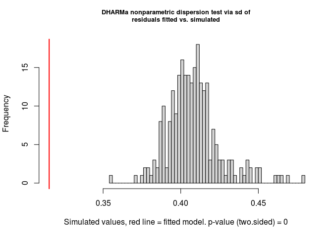<!-- -->

    ## 
    ##  DHARMa nonparametric dispersion test via sd of residuals fitted vs. simulated
    ## 
    ## data:  simulationOutput
    ## ratioObsSim = 0.7724, p-value < 2.2e-16
    ## alternative hypothesis: two.sided

``` r
if(exists('res_MaEnMiNPHu1yrJtu')){
  i <- trends[, complete.cases(Jtu.sc, tempchange_abs.sc, REALM, tempave_metab.sc, duration.sc, mass.sc, endothermfrac.sc,
                               microclim.sc, npp.sc, human_bowler.sc, nspp.sc) &
                duration == 1]
  testDispersion(res_MaEnMiNPHu1yrJtu)
}

if(exists('res_MaEnMiNPHu10yrJtu')){
  i <- trends[, complete.cases(Jtu.sc, tempchange_abs.sc, REALM, tempave_metab.sc, duration.sc, mass.sc, endothermfrac.sc,
                               microclim.sc, npp.sc, human_bowler.sc, nspp.sc) &
                duration == 10]
  testDispersion(res_MaEnMiNPHu10yrJtu)
}
```

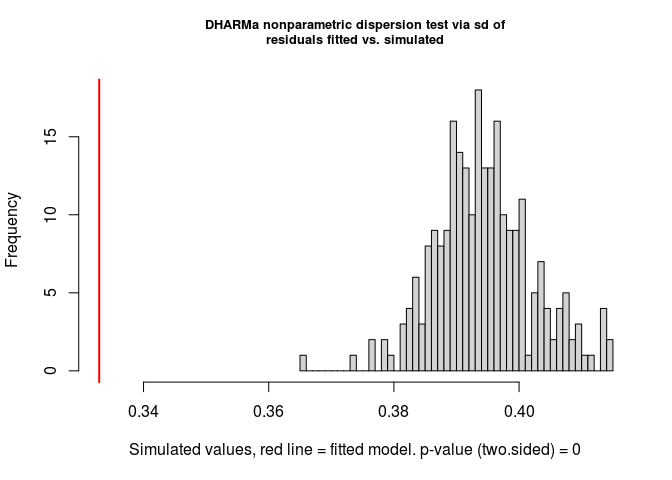<!-- -->

    ## 
    ##  DHARMa nonparametric dispersion test via sd of residuals fitted vs. simulated
    ## 
    ## data:  simulationOutput
    ## ratioObsSim = 0.84436, p-value < 2.2e-16
    ## alternative hypothesis: two.sided

##### Near-zero-inflation

Zero values have been transformed to slightly \>0, so can’t test
zero-inflation directly

``` r
countNearZero <- function(x) sum(x < 0.0001)

if(exists('res_MaEnMiNPHuJtu')){
  i <- trends[, complete.cases(Jtu.sc, tempchange_abs.sc, REALM, tempave_metab.sc, duration.sc, mass.sc, endothermfrac.sc,
                               microclim.sc, npp.sc, human_bowler.sc, nspp.sc)]
  testGeneric(res_MaEnMiNPHuJtu, summary = countNearZero, alternative = 'greater')
}
```

<!-- -->

    ## 
    ##  DHARMa generic simulation test
    ## 
    ## data:  res_MaEnMiNPHuJtu
    ## ratioObsSim = 1.1861, p-value = 0.292
    ## alternative hypothesis: greater

``` r
if(exists('res_MaEnMiNPHu1yrJtu')){
  i <- trends[, complete.cases(Jtu.sc, tempchange_abs.sc, REALM, tempave_metab.sc, duration.sc, mass.sc, endothermfrac.sc,
                               microclim.sc, npp.sc, human_bowler.sc, nspp.sc) &
                duration == 1]
  testGeneric(res_MaEnMiNPHu1yrJtu, summary = countNearZero, alternative = 'greater')
}

if(exists('res_MaEnMiNPHu10yrJtu')){
  i <- trends[, complete.cases(Jtu.sc, tempchange_abs.sc, REALM, tempave_metab.sc, duration.sc, mass.sc, endothermfrac.sc,
                               microclim.sc, npp.sc, human_bowler.sc, nspp.sc) &
                duration == 10]
  testGeneric(res_MaEnMiNPHu10yrJtu, summary = countNearZero, alternative = 'greater')
}
```

<!-- -->

    ## 
    ##  DHARMa generic simulation test
    ## 
    ## data:  res_MaEnMiNPHu10yrJtu
    ## ratioObsSim = 1.6762, p-value = 0.032
    ## alternative hypothesis: greater

##### Near-one-inflation

``` r
countNearOne <- function(x) sum(x > 0.9999)

if(exists('res_MaEnMiNPHuJtu')){
  i <- trends[, complete.cases(Jtu.sc, tempchange_abs.sc, REALM, tempave_metab.sc, duration.sc, mass.sc, endothermfrac.sc,
                               microclim.sc, npp.sc, human_bowler.sc, nspp.sc)]
  testGeneric(res_MaEnMiNPHuJtu, summary = countNearOne, alternative = 'greater')
}
```

<!-- -->

    ## 
    ##  DHARMa generic simulation test
    ## 
    ## data:  res_MaEnMiNPHuJtu
    ## ratioObsSim = 1.1629, p-value = 0.3
    ## alternative hypothesis: greater

``` r
if(exists('res_MaEnMiNPHu1yrJtu')){
  i <- trends[, complete.cases(Jtu.sc, tempchange_abs.sc, REALM, tempave_metab.sc, duration.sc, mass.sc, endothermfrac.sc,
                               microclim.sc, npp.sc, human_bowler.sc, nspp.sc) &
                duration == 1]
  testGeneric(res_MaEnMiNPHu1yrJtu, summary = countNearOne, alternative = 'greater')
}

if(exists('res_MaEnMiNPHu10yrJtu')){
  i <- trends[, complete.cases(Jtu.sc, tempchange_abs.sc, REALM, tempave_metab.sc, duration.sc, mass.sc, endothermfrac.sc,
                               microclim.sc, npp.sc, human_bowler.sc, nspp.sc) &
                duration == 10]
  testGeneric(res_MaEnMiNPHu10yrJtu, summary = countNearOne, alternative = 'greater')
}
```

<!-- -->

    ## 
    ##  DHARMa generic simulation test
    ## 
    ## data:  res_MaEnMiNPHu10yrJtu
    ## ratioObsSim = 2.3932, p-value = 0.004
    ## alternative hypothesis: greater

### Plot the response

#### Main effects

##### Set up and write to file

``` r
scaling <- fread('output/turnover_w_covariates_scaling.csv') # the scalings

# set up the variables to plot
# if variable is logged before scaling (see 'center and scale' above), then need to mark it here and express the limits on a log10 scale (even though log transforming is log)
vars <- data.frame(vars = c('tempchange_abs', 'tempchange_abs', 'tempchange_abs', 'tempave_metab', 'microclim', 'mass', 'npp', 'duration', 'endothermfrac', 'human_bowler', 'human_bowler'),
                   min =      c(0,    0,   0,   0,   0,   -1,  1.9, 0.5, 0,   0,   0), 
                   max =      c(4,    4,   4,   30,  0.8, 4,   3.7, 2,   1,   1,   1),
                   log =      c(F,    F,   F,   F,   T,   T,   T,   T,   F,   T,   T),
                   len =      c(100,  100, 100, 100, 100, 100, 100, 100, 100, 100, 100),
                   discrete = c(F,    F,   F,   F,   F,   F,   F,   F,   F,   F,   F),
                   plus =     c(0,    0,   0,   0,   0,   0,   0,   0,   0,   1,   1), # what to add before log-scaling
                   REALM = c('Freshwater', 'Marine', 'Terrestrial', rep('Terrestrial', 6), 'Terrestrial', 'Marine'),
                   REALM2 = c('TerrFresh', 'Marine', rep('TerrFresh', 8), 'Marine'),
                   stringsAsFactors = FALSE)
baseall <- trends[, .(type = 'all', 
                      tempchange = -0.0001,
                      tempchange_abs.sc = 0.0001,
                      tempave_metab.sc = mean(tempave_metab.sc, na.rm=TRUE), 
                      microclim.sc = mean(microclim.sc, na.rm=TRUE), 
                      mass.sc = mean(mass.sc, na.rm=TRUE), 
                      endothermfrac.sc = mean(endothermfrac.sc, na.rm=TRUE),
                      nspp.sc = 60, 
                      npp.sc = mean(npp.sc, na.rm=TRUE), 
                      human_bowler.sc = mean(human_bowler.sc, na.rm=TRUE))]
baseterr <- trends[REALM == 'Terrestrial', 
                   .(type = 'Terrestrial', 
                     tempchange = -0.0001,
                     tempchange_abs.sc = 0.0001,
                     tempave_metab.sc = mean(tempave_metab.sc, na.rm=TRUE), 
                     microclim.sc = mean(microclim.sc, na.rm=TRUE), 
                     mass.sc = mean(mass.sc, na.rm=TRUE), 
                     endothermfrac.sc = mean(endothermfrac.sc, na.rm=TRUE),
                     nspp.sc = 60, 
                     npp.sc = mean(npp.sc, na.rm=TRUE), 
                     human_bowler.sc = mean(human_bowler.sc, na.rm=TRUE))]
basemar <- trends[REALM == 'Marine', 
                  .(type = 'Marine',
                    tempchange = -0.0001,
                    tempchange_abs.sc = 0.0001,
                    tempave_metab.sc = mean(tempave_metab.sc, na.rm=TRUE), 
                    microclim.sc = mean(microclim.sc, na.rm=TRUE), 
                    mass.sc = mean(mass.sc, na.rm=TRUE), 
                    endothermfrac.sc = mean(endothermfrac.sc, na.rm=TRUE),
                    nspp.sc = 60, 
                    npp.sc = mean(npp.sc, na.rm=TRUE), 
                    human_bowler.sc = mean(human_bowler.sc, na.rm=TRUE))]
basetab <- rbind(baseall, baseterr, basemar)
basetab[, ':='(duration.sc = 0, nyrBT = 20, STUDY_ID = 127L, rarefyID = '127_514668')]

# make the data frames for each interaction to plot                
for(j in 1:nrow(vars)){
    # set up the main effects
    if(vars$log[j]){
        thisdat <- data.frame(new = 10^seq(vars$min[j], vars$max[j], length.out = vars$len[j]),
                              var = vars$vars[j], stringsAsFactors = FALSE)
    } 
    if(!vars$log[j]){
        thisdat <- data.frame(new = seq(vars$min[j], vars$max[j], length.out = vars$len[j]),
                              var = vars$vars[j], stringsAsFactors = FALSE)
    }
    names(thisdat) <- c(vars$vars[j], 'var')
    
    # scale the variable
    cent <- scaling$center[scaling$var == paste0(vars$vars[j], '.sc')]
    scl <- scaling$scale[scaling$var == paste0(vars$vars[j], '.sc')]
    if(is.null(cent)) cent <- 0
    if(!is.null(cent) & !is.null(scl)){
        if(vars$log[j]) thisdat[[paste0(vars$var[j], '.sc')]] <- (log(thisdat[[vars$vars[j]]] + vars$plus[j]) - cent)/scl
        if(!vars$log[j]) thisdat[[paste0(vars$var[j], '.sc')]] <- (thisdat[[vars$var[j]]] - cent)/scl
    }
    
    # merge with the rest of the columns
    # use realm-specific averages for human impacts
    colnamestouse <- setdiff(colnames(basetab), paste0(vars$vars[j], '.sc'))
    if(vars$vars[j] != 'human_bowler'){
        thisdat <- cbind(thisdat, basetab[type == 'all', ..colnamestouse])
    }
    if(vars$vars[j] == 'human_bowler' & vars$REALM[j] == 'Terrestrial'){
        thisdat <- cbind(thisdat, basetab[type == 'Terrestrial', ..colnamestouse])
    }
    if(vars$vars[j] == 'human_bowler' & vars$REALM[j] == 'Marine'){
        thisdat <- cbind(thisdat, basetab[type == 'Marine', ..colnamestouse])
    }
    
    # add realm
    thisdat$REALM <- vars$REALM[j]
    thisdat$REALM2 <- vars$REALM2[j]
    
    # merge with the previous iterations
    if(j == 1) newdat <- thisdat
    if(j > 1){
        colstoadd <- setdiff(colnames(thisdat), colnames(newdat))
        for(toadd in colstoadd){
            newdat[[toadd]] <- NA
        }
        
        colstoadd2 <- setdiff(colnames(newdat), colnames(thisdat))
        for(toadd in colstoadd2){
            thisdat[[toadd]] <- NA
        }
        
        newdat <- rbind(newdat, thisdat)
    } 
}

# character so that new levels can be added
newdat$REALM <- as.character(newdat$REALM)
newdat$REALM2 <- as.character(newdat$REALM2)

# add extra rows so that all factor levels are represented (for predict.lme to work)
newdat <- rbind(newdat[1:6, ], newdat)
newdat$REALM[1:6] <- c('Marine', 'Marine', 'Freshwater', 'Freshwater', 'Terrestrial', 'Terrestrial')
newdat$REALM2[1:6] <- c('Marine', 'Marine', 'TerrFresh', 'TerrFresh', 'TerrFresh', 'TerrFresh')
newdat$tempchange_abs.sc[1:6] <- rep(0.0001, 6)
newdat$tempchange[1:6] <- rep(c(0.0001, -0.0001), 3)
newdat$var[1:6] <- 'test'

# write out
write.csv(newdat, 'temp/newdata_main.csv', row.names = FALSE)
```

Now go run on the command line

    nohup code/turnover_vs_temperature_GLMM_pred.R temp/modFullMaEnMiNPHuJtu.rds temp/newdata_main.csv temp/modFullMaEnMiNPHuJtu_preds.rds >logs/turnover_vs_temperature_GLMMmodFullMaEnMiNPHuJtu_pred.Rout &

##### Load and plot

``` r
newdat <- readRDS(here('temp', 'modFullMaEnMiNPHuJtu_preds.rds'))
newdat[, REALM := factor(REALM, levels = c('Freshwater', 'Terrestrial', 'Marine'))] # set factor order
newdat[, REALM2 := factor(REALM2, levels = c('TerrFresh', 'Marine'))] # set factor order

p1 <- ggplot(newdat[var == 'tempchange_abs',], aes(tempchange_abs, pred, group = REALM, color = REALM, fill=REALM)) +
  geom_ribbon(aes(ymin=pred-1.96*pred.se, ymax=pred+1.96*pred.se), alpha = 0.1, linetype = 'blank') +
  geom_line() +
  labs(y = 'Jaccard turnover') +
  theme(legend.title = element_text(size = 6),legend.text = element_text(size = 6))
p2 <- ggplot(newdat[var == 'tempave_metab',], aes(tempave_metab, pred)) +
  geom_ribbon(aes(ymin=pred-1.96*pred.se, ymax=pred+1.96*pred.se), alpha = 0.1) +
  geom_line() +
  labs(y = 'Jaccard turnover')
p3 <- ggplot(newdat[var == 'microclim',], aes(microclim, pred)) +
  geom_ribbon(aes(ymin=pred-1.96*pred.se, ymax=pred+1.96*pred.se), alpha = 0.1) +
  geom_line() +
  labs(y = 'Jaccard turnover')
p4 <- ggplot(newdat[var == 'mass',], aes(mass, pred)) +
  geom_ribbon(aes(ymin=pred-1.96*pred.se, ymax=pred+1.96*pred.se), alpha = 0.1) +
  geom_line() +
  scale_x_log10() +
  labs(y = 'Jaccard turnover')
p5 <- ggplot(newdat[var == 'npp',], aes(npp, pred)) +
  geom_ribbon(aes(ymin=pred-1.96*pred.se, ymax=pred+1.96*pred.se), alpha = 0.1) +
  geom_line() +
  labs(y = 'Jaccard turnover')
p6 <- ggplot(newdat[var == 'endothermfrac',], aes(endothermfrac, pred)) +
  geom_ribbon(aes(ymin=pred-1.96*pred.se, ymax=pred+1.96*pred.se), alpha = 0.1) +
  geom_line() +
  labs(y = 'Jaccard turnover')
p7 <- ggplot(newdat[var == 'human_bowler',], aes(human_bowler, pred, group = REALM2, color = REALM2, fill = REALM2)) +
  geom_ribbon(aes(ymin=pred-1.96*pred.se, ymax=pred+1.96*pred.se), alpha = 0.1, linetype = 'blank') +
  geom_line() +
  labs(y = 'Jaccard turnover', x = 'Human impact') +
  theme(legend.title = element_text(size = 6),legend.text = element_text(size = 6))

grid.arrange(p1, p2, p3, p4, p5, p6, p7, ncol = 2)
```

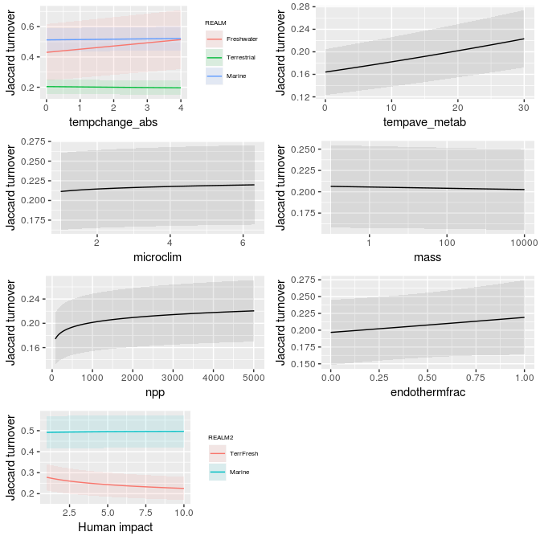<!-- -->

#### Interactions

##### Set up and write to file

``` r
scaling <- fread(here('output', 'turnover_w_covariates_scaling.csv')) # the scalings

# set up the interactions to plot
# if variable is logged before scaling (see assmble_turnover_covariates.Rmd), then need to mark it here and express the limits on a log10 scale (even though log transforming is log)
ints <- data.frame(vars = c('tempave_metab', 'microclim', 'mass',
                            'npp', 'duration', 'endothermfrac',
                            'human_bowler', 'human_bowler'),
                   min =      c(0,   -2,  0,   1.9, 0.5, 0,   0,   0), 
                   max =      c(30,  0.8, 8,   3.7, 2,   1,   1,   1),
                   log =      c(F,   T,   T,   T,   T,   F,   T,   T),
                   len =      c(100, 100, 100, 100, 100, 100, 100, 100),
                   discrete = c(F,   F,   F,   F,   F,   F,   F,   F),
                   plus =     c(0,   0,   0,   0,   0,   0,   1,   1), # what to add before log-scaling
                   REALM = c(rep('Freshwater', 6), 'Terrestrial', 'Marine'),
                   REALM2 = c(rep('TerrFresh', 7), 'Marine'),
                   stringsAsFactors = FALSE)
baseall <- trends[, .(type = 'all', tempave_metab.sc = mean(tempave_metab.sc, na.rm=TRUE), 
                      microclim.sc = mean(microclim.sc, na.rm=TRUE), 
                      mass.sc = mean(mass.sc, na.rm=TRUE), 
                      nspp.sc = 60,
                      npp.sc = mean(npp.sc, na.rm=TRUE), 
                      endothermfrac.sc = mean(endothermfrac.sc, na.rm=TRUE), 
                      human_bowler.sc = mean(human_bowler.sc, na.rm=TRUE))]
baseterr <- trends[REALM == 'Terrestrial', 
                   .(type = 'Terrestrial', 
                     tempave_metab.sc = mean(tempave_metab.sc, na.rm=TRUE),
                     microclim.sc = mean(microclim.sc, na.rm=TRUE),
                     mass.sc = mean(mass.sc, na.rm=TRUE), 
                     nspp.sc = 60, 
                     npp.sc = mean(npp.sc, na.rm=TRUE), 
                     endothermfrac.sc = mean(endothermfrac.sc, na.rm=TRUE), 
                     human_bowler.sc = mean(human_bowler.sc, na.rm=TRUE))]
basemar <- trends[REALM == 'Marine', 
                  .(type = 'Marine',
                    tempave_metab.sc = mean(tempave_metab.sc, na.rm=TRUE), 
                    microclim.sc = mean(microclim.sc, na.rm=TRUE), 
                    mass.sc = mean(mass.sc, na.rm=TRUE), 
                    nspp.sc = 60, 
                    npp.sc = mean(npp.sc, na.rm=TRUE), 
                    endothermfrac.sc = mean(endothermfrac.sc, na.rm=TRUE), 
                    human_bowler.sc = mean(human_bowler.sc, na.rm=TRUE))]
basetab <- rbind(baseall, baseterr, basemar)
basetab[, ':='(duration.sc = 0, nyrBT = 20, STUDY_ID = 127L, rarefyID = '127_514668')]

# make the data frames for each interaction to plot                
for(j in 1:nrow(ints)){
  # set up a grid of temperature trends and the interacting variable
  if(ints$log[j]) intvars <- list(tempchange = seq(0, 4, length.out = 100), 
                                  new = 10^seq(ints$min[j], ints$max[j], length.out = ints$len[j]),
                                  var = ints$vars[j])
  if(!ints$log[j]) intvars <- list(tempchange = seq(0, 4, length.out = 100), 
                                   new = seq(ints$min[j], ints$max[j], length.out = ints$len[j]),
                                   var = ints$vars[j])
  names(intvars) <- c('tempchange', ints$vars[j], 'var')
  thisdat <- expand.grid(intvars)
  
  # scale the interacting variable
  cent <- scaling$center[scaling$var == paste0(ints$vars[j], '.sc')]
  scl <- scaling$scale[scaling$var == paste0(ints$vars[j], '.sc')]
  if(ints$log[j]) thisdat[[paste0(ints$var[j], '.sc')]] <- (log(thisdat[[ints$vars[j]]] + ints$plus[j]) - cent)/scl
  if(!ints$log[j]) thisdat[[paste0(ints$var[j], '.sc')]] <- (thisdat[[ints$var[j]]] - cent)/scl
  
  # merge with the rest of the columns
  # use realm-specific averages for human impacts
  colnamestouse <- setdiff(colnames(basetab), paste0(ints$var[j], '.sc'))
  if(ints$vars[j] != 'human_bowler'){
    thisdat <- cbind(thisdat, basetab[type == 'all', ..colnamestouse])
  }
  if(ints$vars[j] == 'human_bowler' & ints$REALM[j] == 'Terrestrial'){
    thisdat <- cbind(thisdat, basetab[type == 'Terrestrial', ..colnamestouse])
  }
  if(ints$vars[j] == 'human_bowler' & ints$REALM[j] == 'Marine'){
    thisdat <- cbind(thisdat, basetab[type == 'Marine', ..colnamestouse])
  }
  
  # add realm
  thisdat$REALM <- ints$REALM[j]
  thisdat$REALM2 <- ints$REALM2[j]
  
  # add plotting information
  thisdat$log <- ints$log[j]
  thisdat$discrete <- ints$discrete[j]
  
  # merge with the previous iterations
  if(j == 1) newdat <- thisdat
  if(j > 1){
    colstoadd <- setdiff(colnames(thisdat), colnames(newdat))
    for(toadd in colstoadd){
      newdat[[toadd]] <- NA
    }
    
    colstoadd2 <- setdiff(colnames(newdat), colnames(thisdat))
    for(toadd in colstoadd2){
      thisdat[[toadd]] <- NA
    }
    
    newdat <- rbind(newdat, thisdat)
  } 
}

# character so that new levels can be added
newdat$REALM <- as.character(newdat$REALM)
newdat$REALM2 <- as.character(newdat$REALM2)

# add extra rows so that all factor levels are represented (for predict.lme to work, not sure about predict.glmmTMB)
newdat <- rbind(newdat[1:6, ], newdat)
newdat$REALM[1:6] <- c('Marine', 'Marine', 'Freshwater', 'Freshwater', 'Terrestrial', 'Terrestrial')
newdat$REALM2[1:6] <- c('Marine', 'Marine', 'TerrFresh', 'TerrFresh', 'TerrFresh', 'TerrFresh')
newdat$tempchange[1:6] <- c(-0.2, 0.2, -0.2, 0.2, -0.2, 0.2)
newdat$var[1:6] <- 'test'

# trim to at least some temperature change (so that tsign is -1 or 1)
newdat <- newdat[newdat$tempchange != 0,]

# scale the temperature vars
cent <- scaling$center[scaling$var == 'tempchange.sc']
scl <- scaling$scale[scaling$var == 'tempchange.sc']
newdat$tempchange.sc <- (newdat$tempchange-cent)/scl
newdat$tempchange_abs <- abs(newdat$tempchange)

cent <- scaling$center[scaling$var == 'tempchange_abs.sc']
scl <- scaling$scale[scaling$var == 'tempchange_abs.sc']
newdat$tempchange_abs.sc <- (newdat$tempchange_abs-cent)/scl

# write out
write.csv(newdat, 'temp/newdata_interactions.csv', row.names = FALSE)
```

Now go run on the command line

    nohup code/turnover_vs_temperature_GLMM_pred.R temp/modFullMaEnMiNPHuJtu.rds temp/newdata_interactions.csv temp/modFullMaEnMiNPHuJtu_preds_interactions.rds >logs/turnover_vs_temperature_GLMMmodFullMaEnMiNPHuJtu_pred_interactions.Rout &

##### Load and plot

``` r
newdatint <- readRDS(here('temp', 'modFullMaEnMiNPHuJtu_preds_interactions.rds'))
newdatint[, REALM := factor(REALM, levels = c('Freshwater', 'Terrestrial', 'Marine'))] # set factor order
newdatint[, REALM2 := factor(REALM2, levels = c('TerrFresh', 'Marine'))] # set factor order

ylims = c(0.2, 0.65)

# prep the plots
ints <- unique(newdatint[ ,.(var, REALM2, log, discrete)])
ints <- ints[ints$var != 'test', ] # remove the extra rows
intplots <- vector('list', nrow(ints))
for(j in 1:length(intplots)){
  subs <- newdatint$var == ints$var[j]
  xvar <- 'tempchange_abs'
  title <- ints$var[j]
  if(ints$var[j] %in% c('human_bowler')){
    subs <- newdatint$var == ints$var[j] & newdatint$tempchange > 0 & newdatint$REALM2 == ints$REALM2[j]
    title <- paste0('human:', ints$REALM2[j])
  } 
  
  thisplot <- ggplot(newdatint[subs, ], 
                     aes_string(x = xvar, y = 'pred', 
                                group = ints$var[j], 
                                color = ints$var[j])) +
    geom_line() +
    #coord_cartesian(ylim = ylims) +
    theme(legend.title = element_text(size = 8), 
          legend.text = element_text(size = 6),
          legend.key.width = unit(0.1, 'inch')) +
    labs(title = title)
  if(ints$log[j] & !ints$discrete[j]){
    intplots[[j]] <- thisplot + scale_color_distiller(palette = "YlGnBu", trans = 'log')
  }
  if(!ints$log[j] & !ints$discrete[j]){
    intplots[[j]] <- thisplot + scale_color_distiller(palette = "YlGnBu", trans = 'identity')
  }
  if(ints$discrete[j]){
    intplots[[j]] <- thisplot + scale_color_brewer(palette = "Dark2")
  }
}

grid.arrange(grobs = intplots, ncol = 3)
```

<!-- -->
