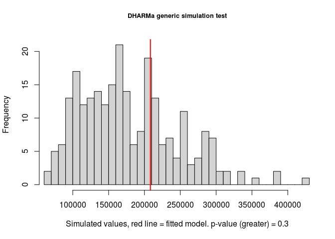
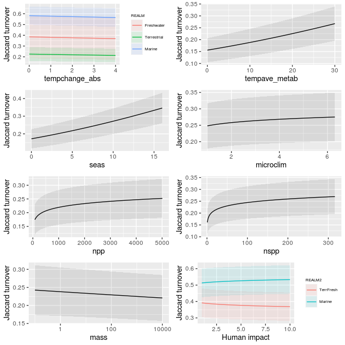
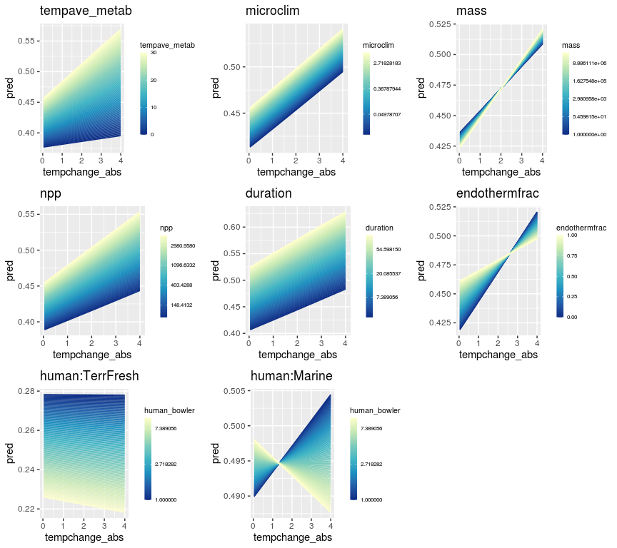

Community dissimilarity through time using beta models: Evaluate and
plot models
================

# Prep

First run turnover\_vs\_temperature\_GLMM\_fit.R to fit the models.

    ## Loading required package: Matrix

    ## Loading required package: stats4

    ## This is DHARMa 0.3.3.0. For overview type '?DHARMa'. For recent changes, type news(package = 'DHARMa') Note: Syntax of plotResiduals has changed in 0.3.0, see ?plotResiduals for details

    ## here() starts at /local/home/malinp/climate_community_crossrealm

# Summary stats

## Examine how many data points are available

### Just turnover and non-zero tempchange

``` r
cat('Overall # dissimilarities: ', nrow(trends), '\n')
```

    ## Overall # dissimilarities:  1246147

``` r
cat('# studies: ', trends[, length(unique(STUDY_ID))], '\n')
```

    ## # studies:  302

``` r
cat('# timeseries: ', trends[, length(unique(rarefyID))], '\n')
```

    ## # timeseries:  46178

``` r
trends[!duplicated(rarefyID), table(REALM)]
```

    ## REALM
    ##  Freshwater      Marine Terrestrial 
    ##         881       42113        3184

``` r
trends[!duplicated(rarefyID), table(taxa_mod)]
```

    ## taxa_mod
    ##                         All                  Amphibians                     Benthos                       Birds                        Fish               Invertebrates                     Mammals Marine invertebrates/plants                       Plant                    Reptiles 
    ##                        1461                         357                        4672                        9324                       26587                        2816                         477                         206                         274                           4

``` r
trends[!duplicated(rarefyID), table(taxa_mod, REALM)]
```

    ##                              REALM
    ## taxa_mod                      Freshwater Marine Terrestrial
    ##   All                                  0   1458           3
    ##   Amphibians                           2      0         355
    ##   Benthos                              0   4672           0
    ##   Birds                                0   6795        2529
    ##   Fish                               863  25724           0
    ##   Invertebrates                       14   2722          80
    ##   Mammals                              0    433          44
    ##   Marine invertebrates/plants          0    206           0
    ##   Plant                                1    103         170
    ##   Reptiles                             1      0           3

### With all covariates

Use Bowler for human impact

``` r
# the cases we can compare
apply(trends[, .(Jtu.sc, REALM, tempave_metab.sc, seas.sc, microclim.sc, tempchange.sc, mass.sc, speed.sc, consumerfrac.sc, endothermfrac.sc, nspp.sc, thermal_bias.sc, npp.sc, veg.sc, human_bowler.sc)], MARGIN = 2, FUN = function(x) sum(!is.na(x)))
```

    ##           Jtu.sc            REALM tempave_metab.sc          seas.sc     microclim.sc    tempchange.sc          mass.sc         speed.sc  consumerfrac.sc endothermfrac.sc          nspp.sc  thermal_bias.sc           npp.sc           veg.sc  human_bowler.sc 
    ##          1246147          1246147          1230831          1230831          1239639          1230831          1244555          1244508          1246147          1246147          1246147          1134826          1242667          1235029          1246147

``` r
i <- trends[, complete.cases(Jtu.sc, tempave_metab.sc, seas.sc, microclim.sc, tempchange.sc, mass.sc, speed.sc, consumerfrac.sc, nspp.sc, thermal_bias.sc, npp.sc, veg.sc, human_bowler.sc)]
cat('Overall # dissimilarities: ', sum(i), '\n')
```

    ## Overall # dissimilarities:  1123022

``` r
cat('# studies: ', trends[i, length(unique(STUDY_ID))], '\n')
```

    ## # studies:  229

``` r
cat('# timeseries: ', trends[i, length(unique(rarefyID))], '\n')
```

    ## # timeseries:  43407

``` r
trends[i & !duplicated(rarefyID), table(REALM)]
```

    ## REALM
    ##  Freshwater      Marine Terrestrial 
    ##         842       39888        2677

``` r
trends[i & !duplicated(rarefyID), table(taxa_mod)]
```

    ## taxa_mod
    ##                         All                  Amphibians                     Benthos                       Birds                        Fish               Invertebrates                     Mammals Marine invertebrates/plants                       Plant                    Reptiles 
    ##                        1435                          12                        4636                        8449                       25592                        2431                         471                         206                         173                           2

``` r
trends[i & !duplicated(rarefyID), table(taxa_mod, REALM)]
```

    ##                              REALM
    ## taxa_mod                      Freshwater Marine Terrestrial
    ##   All                                  0   1433           2
    ##   Amphibians                           2      0          10
    ##   Benthos                              0   4636           0
    ##   Birds                                0   6006        2443
    ##   Fish                               831  24761           0
    ##   Invertebrates                        8   2357          66
    ##   Mammals                              0    433          38
    ##   Marine invertebrates/plants          0    206           0
    ##   Plant                                1     56         116
    ##   Reptiles                             0      0           2

# Models

## Choose the variance structure

Try combinations of

  - beta errors
  - variance scaled to Nspp or to Nspp + REALM
  - random intercept for taxa\_mod2, STUDY\_ID, rarefyID
  - random slopes for (abs temperature trend) or for duration

Did not try random intercept for compID (for overdispersion), since had
trouble converging. Use a full set of fixed effects and choose the RE
with lowest AIC.

This chooses beta errors, random slopes (duration.sc) & intercepts for
STUDY\_ID and rarefyID, and variance scaled to nspp + realm. We haven’t
dealt with potential testing on the boundary issues here.

    ##                            dAIC      df
    ## modRFdurslope2levdisprealm       0.0 32
    ## modRFdurslope2levdisp       343447.8 30
    ## modRFdisp2lev               362733.5 30
    ## modRFdisp                   362734.2 33
    ## modRFdisp2levOnlyint        372171.1 26
    ## modRFdurslope2lev           586830.7 29
    ## modRF2lev                   624617.1 25
    ## modRFnestedRE               624619.1 26
    ## modRFrID                    654571.4 24
    ## modRFbeta                  1095169.1 23
    ## modRFgauss                 8953261.0 23

### Summary of the chosen model

    ##  Family: beta  ( logit )
    ## Formula:          Jtu.sc ~ tempchange_abs.sc * REALM + tempchange_abs.sc * tempave_metab.sc +      tempchange_abs.sc * duration.sc + tempchange_abs.sc * mass.sc +      tempchange_abs.sc * endothermfrac.sc + tempchange_abs.sc *      microclim.sc + tempchange_abs.sc * npp.sc + tempchange_abs.sc *      human_bowler.sc:REALM2 + (duration.sc | STUDY_ID/rarefyID)
    ## Dispersion:              ~nspp.sc + REALM
    ## Data: trends[i, ]
    ## 
    ##      AIC      BIC   logLik deviance df.resid 
    ## -8377142 -8376756  4188603 -8377206  1258784 
    ## 
    ## Random effects:
    ## 
    ## Conditional model:
    ##  Groups            Name        Variance Std.Dev. Corr  
    ##  rarefyID:STUDY_ID (Intercept) 0.23147  0.4811         
    ##                    duration.sc 0.05529  0.2351   0.32  
    ##  STUDY_ID          (Intercept) 2.76858  1.6639         
    ##                    duration.sc 0.10567  0.3251   -0.06 
    ## Number of obs: 1258816, groups:  rarefyID:STUDY_ID, 50637; STUDY_ID, 285
    ## 
    ## Conditional model:
    ##                                                     Estimate Std. Error z value Pr(>|z|)    
    ## (Intercept)                                       -0.2325202  0.3866849  -0.601 0.547629    
    ## tempchange_abs.sc                                  0.0421376  0.0132944   3.170 0.001527 ** 
    ## REALMMarine                                        0.2868689  0.4152730   0.691 0.489694    
    ## REALMTerrestrial                                  -1.1357116  0.4156768  -2.732 0.006291 ** 
    ## tempave_metab.sc                                   0.1667049  0.0139387  11.960  < 2e-16 ***
    ## duration.sc                                        0.1440513  0.0261094   5.517 3.44e-08 ***
    ## mass.sc                                           -0.0062390  0.0069460  -0.898 0.369070    
    ## endothermfrac.sc                                   0.0607137  0.0530511   1.144 0.252442    
    ## microclim.sc                                       0.0274998  0.0046677   5.891 3.83e-09 ***
    ## npp.sc                                             0.0444184  0.0056907   7.805 5.93e-15 ***
    ## tempchange_abs.sc:REALMMarine                     -0.0374660  0.0134637  -2.783 0.005390 ** 
    ## tempchange_abs.sc:REALMTerrestrial                -0.0484449  0.0133116  -3.639 0.000273 ***
    ## tempchange_abs.sc:tempave_metab.sc                 0.0206525  0.0045968   4.493 7.03e-06 ***
    ## tempchange_abs.sc:duration.sc                      0.0042907  0.0010113   4.243 2.21e-05 ***
    ## tempchange_abs.sc:mass.sc                          0.0021186  0.0018408   1.151 0.249769    
    ## tempchange_abs.sc:endothermfrac.sc                -0.0149381  0.0049941  -2.991 0.002779 ** 
    ## tempchange_abs.sc:microclim.sc                     0.0002156  0.0011809   0.183 0.855119    
    ## tempchange_abs.sc:npp.sc                           0.0032412  0.0015339   2.113 0.034598 *  
    ## human_bowler.sc:REALM2Marine                       0.0068522  0.0051160   1.339 0.180451    
    ## human_bowler.sc:REALM2TerrFresh                   -0.1022305  0.0103795  -9.849  < 2e-16 ***
    ## tempchange_abs.sc:human_bowler.sc:REALM2Marine    -0.0045353  0.0019049  -2.381 0.017270 *  
    ## tempchange_abs.sc:human_bowler.sc:REALM2TerrFresh -0.0020172  0.0013043  -1.547 0.121975    
    ## ---
    ## Signif. codes:  0 '***' 0.001 '**' 0.01 '*' 0.05 '.' 0.1 ' ' 1
    ## 
    ## Dispersion model:
    ##                   Estimate Std. Error z value Pr(>|z|)    
    ## (Intercept)      -0.396689   0.011264   -35.2   <2e-16 ***
    ## nspp.sc           0.512791   0.001147   447.2   <2e-16 ***
    ## REALMMarine      -0.167458   0.011320   -14.8   <2e-16 ***
    ## REALMTerrestrial  2.153035   0.011662   184.6   <2e-16 ***
    ## ---
    ## Signif. codes:  0 '***' 0.001 '**' 0.01 '*' 0.05 '.' 0.1 ' ' 1

### Plot random effects

No clear discontinuities. Looks ok.

    ## $`rarefyID:STUDY_ID`

<!-- -->

    ## 
    ## $STUDY_ID

<!-- -->

### DHARMa model evaluation

Need to re-run this with newly trimmed dataset (2021-04-05)

#### Plot residuals for model fit to all data

There are many outliers and signs of underdispersion, but this is
probably ok.

#### Overdispersion

There is underdispersion.

#### Near-zero-inflation

(Zero values have been transformed to slightly \>0, so can’t test
zero-inflation directly)

Near-zero values are not inflated.

``` r
countNearZero <- function(x) sum(x < 0.0001)
i <- trends[, complete.cases(Jtu.sc, tempchange_abs.sc, REALM, tempave_metab.sc, duration.sc, mass.sc, endothermfrac.sc,
                             microclim.sc, npp.sc, human_bowler.sc, nspp.sc)]
testGeneric(res_RFdurslope2levdisprealm, summary = countNearZero, alternative = 'greater')
```

#### Near-one-inflation

Near-one values are not inflated.

``` r
countNearOne <- function(x) sum(x > 0.9999)
i <- trends[, complete.cases(Jtu.sc, tempchange_abs.sc, REALM, tempave_metab.sc, duration.sc, mass.sc, endothermfrac.sc,
                             microclim.sc, npp.sc, human_bowler.sc, nspp.sc)]
testGeneric(res_RFdurslope2levdisprealm, summary = countNearOne, alternative = 'greater')
```

## Temperature-change-only models

Not run right now

### Load the models

### Summary (all years)

### Summary (1 year)

### Summary (10 year)

### Plot the temp-only coefficients

CIs are 1.96\*SE

## Temperature-change\&duration models

Not run right now

### Load the models

### Summary

### Plot the coefficients

abs(tempchange) is in degC

duration is in years

### Plot the response

## Temperature-change and duration by REALM

Not run. These don’t seem the most informative right now, since they
lack many of the other factors that are likely important, like average
temperature.

### Load the models

### Summary

### Summary (1 yr)

### Summary (10 yr)

### DHARMa model evaluation

Need to re-run this with newly trimmed dataset (2021-04-05)

#### Simulate residuals

#### Plot residuals

All data

1yr data

10yr data

### Plot the temp coefficients from TD realm models

## Full models w/ only main effects

These are a main focus right now, though the dissimilarities have not
been corrected for alpha & gamma diversity as in Chase et al Ecosphere.

### Load the models

### Summary

#### Jtu

##### All

    ##  Family: beta  ( logit )
    ## Formula:          Jtu.sc ~ tempchange_abs.sc + REALM + tempave_metab.sc + duration.sc +      seas.sc + microclim.sc + npp.sc + nspp.sc + mass.sc + human_bowler.sc:REALM2 +      (duration.sc | STUDY_ID/rarefyID)
    ## Dispersion:              ~nspp.sc + REALM
    ## Data: trends[i, ]
    ## 
    ##      AIC      BIC   logLik deviance df.resid 
    ## -7593495 -7593219  3796770 -7593541  1219799 
    ## 
    ## Random effects:
    ## 
    ## Conditional model:
    ##  Groups            Name        Variance Std.Dev. Corr  
    ##  rarefyID:STUDY_ID (Intercept) 0.22414  0.4734         
    ##                    duration.sc 0.05951  0.2440   0.33  
    ##  STUDY_ID          (Intercept) 2.80629  1.6752         
    ##                    duration.sc 0.09160  0.3027   -0.03 
    ## Number of obs: 1219822, groups:  rarefyID:STUDY_ID, 44926; STUDY_ID, 280
    ## 
    ## Conditional model:
    ##                                   Estimate Std. Error z value Pr(>|z|)    
    ## (Intercept)                     -0.4466336  0.3936365  -1.135   0.2565    
    ## tempchange_abs.sc                0.0003249  0.0009560   0.340   0.7340    
    ## REALMMarine                      0.4182501  0.4236158   0.987   0.3235    
    ## REALMTerrestrial                -1.0768473  0.4218432  -2.553   0.0107 *  
    ## tempave_metab.sc                 0.1086374  0.0142303   7.634 2.27e-14 ***
    ## duration.sc                      0.1590965  0.0250576   6.349 2.16e-10 ***
    ## seas.sc                          0.0606422  0.0104943   5.779 7.53e-09 ***
    ## microclim.sc                     0.0225172  0.0047416   4.749 2.05e-06 ***
    ## npp.sc                           0.0012426  0.0063755   0.195   0.8455    
    ## nspp.sc                          0.1739669  0.0074491  23.354  < 2e-16 ***
    ## mass.sc                         -0.0572440  0.0083233  -6.878 6.09e-12 ***
    ## human_bowler.sc:REALM2Marine    -0.0060634  0.0052071  -1.164   0.2442    
    ## human_bowler.sc:REALM2TerrFresh -0.0786665  0.0104606  -7.520 5.47e-14 ***
    ## ---
    ## Signif. codes:  0 '***' 0.001 '**' 0.01 '*' 0.05 '.' 0.1 ' ' 1
    ## 
    ## Dispersion model:
    ##                   Estimate Std. Error z value Pr(>|z|)    
    ## (Intercept)      -0.398327   0.011549   -34.5   <2e-16 ***
    ## nspp.sc           0.453435   0.001184   382.9   <2e-16 ***
    ## REALMMarine      -0.125549   0.011603   -10.8   <2e-16 ***
    ## REALMTerrestrial  2.255507   0.011948   188.8   <2e-16 ***
    ## ---
    ## Signif. codes:  0 '***' 0.001 '**' 0.01 '*' 0.05 '.' 0.1 ' ' 1

##### 1 yr

    ##  Family: beta  ( logit )
    ## Formula:          Jtu.sc ~ tempchange_abs.sc + REALM + tempave_metab.sc + seas.sc +      microclim.sc + npp.sc + nspp.sc + mass.sc + human_bowler.sc:REALM2 +      (1 | STUDY_ID/rarefyID)
    ## Dispersion:              ~nspp.sc + REALM
    ## Data: trends[i, ]
    ## 
    ##       AIC       BIC    logLik  deviance  df.resid 
    ## -843838.0 -843663.7  421937.0 -843874.0    118905 
    ## 
    ## Random effects:
    ## 
    ## Conditional model:
    ##  Groups            Name        Variance Std.Dev.
    ##  rarefyID:STUDY_ID (Intercept) 0.1615   0.4019  
    ##  STUDY_ID          (Intercept) 2.1340   1.4608  
    ## Number of obs: 118923, groups:  rarefyID:STUDY_ID, 27464; STUDY_ID, 224
    ## 
    ## Conditional model:
    ##                                  Estimate Std. Error z value Pr(>|z|)    
    ## (Intercept)                     -0.721101   0.363520  -1.984 0.047294 *  
    ## tempchange_abs.sc               -0.006890   0.004395  -1.568 0.116976    
    ## REALMMarine                      0.481129   0.389784   1.234 0.217073    
    ## REALMTerrestrial                -0.623880   0.395928  -1.576 0.115086    
    ## tempave_metab.sc                 0.110336   0.024688   4.469 7.85e-06 ***
    ## seas.sc                          0.057144   0.015175   3.766 0.000166 ***
    ## microclim.sc                    -0.003803   0.007133  -0.533 0.593945    
    ## npp.sc                          -0.010962   0.009960  -1.101 0.271063    
    ## nspp.sc                          0.177566   0.012052  14.733  < 2e-16 ***
    ## mass.sc                         -0.060547   0.013447  -4.503 6.71e-06 ***
    ## human_bowler.sc:REALM2Marine    -0.005041   0.007974  -0.632 0.527274    
    ## human_bowler.sc:REALM2TerrFresh -0.097199   0.012658  -7.679 1.60e-14 ***
    ## ---
    ## Signif. codes:  0 '***' 0.001 '**' 0.01 '*' 0.05 '.' 0.1 ' ' 1
    ## 
    ## Dispersion model:
    ##                   Estimate Std. Error z value Pr(>|z|)    
    ## (Intercept)      -0.554530   0.036883  -15.03   <2e-16 ***
    ## nspp.sc           0.312972   0.003514   89.06   <2e-16 ***
    ## REALMMarine      -0.008306   0.036992   -0.22    0.822    
    ## REALMTerrestrial  2.037390   0.038321   53.17   <2e-16 ***
    ## ---
    ## Signif. codes:  0 '***' 0.001 '**' 0.01 '*' 0.05 '.' 0.1 ' ' 1

##### 10 yr

    ##  Family: beta  ( logit )
    ## Formula:          Jtu.sc ~ tempchange_abs.sc + REALM + tempave_metab.sc + seas.sc +      microclim.sc + npp.sc + nspp.sc + mass.sc + human_bowler.sc:REALM2 +      (1 | STUDY_ID/rarefyID)
    ## Dispersion:              ~nspp.sc + REALM
    ## Data: trends[i, ]
    ## 
    ##       AIC       BIC    logLik  deviance  df.resid 
    ## -283091.1 -282933.6  141563.6 -283127.1     46774 
    ## 
    ## Random effects:
    ## 
    ## Conditional model:
    ##  Groups            Name        Variance Std.Dev.
    ##  rarefyID:STUDY_ID (Intercept) 0.2656   0.5154  
    ##  STUDY_ID          (Intercept) 3.2514   1.8032  
    ## Number of obs: 46792, groups:  rarefyID:STUDY_ID, 15519; STUDY_ID, 146
    ## 
    ## Conditional model:
    ##                                  Estimate Std. Error z value Pr(>|z|)    
    ## (Intercept)                     -0.570610   0.500126  -1.141 0.253897    
    ## tempchange_abs.sc               -0.010364   0.004072  -2.545 0.010928 *  
    ## REALMMarine                      0.502595   0.550541   0.913 0.361289    
    ## REALMTerrestrial                -0.508449   0.549126  -0.926 0.354485    
    ## tempave_metab.sc                 0.112540   0.040623   2.770 0.005600 ** 
    ## seas.sc                          0.056358   0.024364   2.313 0.020716 *  
    ## microclim.sc                    -0.014906   0.012149  -1.227 0.219861    
    ## npp.sc                          -0.016264   0.016585  -0.981 0.326783    
    ## nspp.sc                          0.207660   0.022807   9.105  < 2e-16 ***
    ## mass.sc                         -0.077814   0.026079  -2.984 0.002848 ** 
    ## human_bowler.sc:REALM2Marine    -0.054564   0.014307  -3.814 0.000137 ***
    ## human_bowler.sc:REALM2TerrFresh -0.099642   0.022847  -4.361 1.29e-05 ***
    ## ---
    ## Signif. codes:  0 '***' 0.001 '**' 0.01 '*' 0.05 '.' 0.1 ' ' 1
    ## 
    ## Dispersion model:
    ##                   Estimate Std. Error z value Pr(>|z|)    
    ## (Intercept)      -0.309961   0.053275   -5.82 5.95e-09 ***
    ## nspp.sc           0.530174   0.006571   80.68  < 2e-16 ***
    ## REALMMarine      -0.122189   0.053453   -2.29   0.0223 *  
    ## REALMTerrestrial  2.420599   0.055528   43.59  < 2e-16 ***
    ## ---
    ## Signif. codes:  0 '***' 0.001 '**' 0.01 '*' 0.05 '.' 0.1 ' ' 1

#### Horn

##### All

    ##  Family: beta  ( logit )
    ## Formula:          Horn.sc ~ tempchange_abs.sc + REALM + tempave_metab.sc + duration.sc +      seas.sc + microclim.sc + npp.sc + nspp.sc + mass.sc + human_bowler.sc:REALM2 +      (duration.sc | STUDY_ID/rarefyID)
    ## Dispersion:               ~nspp.sc + REALM
    ## Data: trends[i, ]
    ## 
    ##      AIC      BIC   logLik deviance df.resid 
    ## -4812723 -4812447  2406384 -4812769  1191074 
    ## 
    ## Random effects:
    ## 
    ## Conditional model:
    ##  Groups            Name        Variance Std.Dev. Corr  
    ##  rarefyID:STUDY_ID (Intercept) 0.30778  0.5548         
    ##                    duration.sc 0.03825  0.1956   0.09  
    ##  STUDY_ID          (Intercept) 3.52210  1.8767         
    ##                    duration.sc 0.09986  0.3160   -0.09 
    ## Number of obs: 1191097, groups:  rarefyID:STUDY_ID, 43938; STUDY_ID, 260
    ## 
    ## Conditional model:
    ##                                   Estimate Std. Error z value Pr(>|z|)    
    ## (Intercept)                      0.1863750  0.4394345   0.424  0.67147    
    ## tempchange_abs.sc                0.0083543  0.0009082   9.199  < 2e-16 ***
    ## REALMMarine                      0.6212052  0.4778090   1.300  0.19356    
    ## REALMTerrestrial                -1.2248140  0.4719801  -2.595  0.00946 ** 
    ## tempave_metab.sc                 0.3637730  0.0154027  23.618  < 2e-16 ***
    ## duration.sc                      0.3061959  0.0259364  11.806  < 2e-16 ***
    ## seas.sc                          0.1923224  0.0117723  16.337  < 2e-16 ***
    ## microclim.sc                     0.0817388  0.0053391  15.309  < 2e-16 ***
    ## npp.sc                           0.0543837  0.0071293   7.628 2.38e-14 ***
    ## nspp.sc                          0.1712428  0.0081796  20.935  < 2e-16 ***
    ## mass.sc                         -0.0671633  0.0090021  -7.461 8.60e-14 ***
    ## human_bowler.sc:REALM2Marine     0.0255084  0.0058969   4.326 1.52e-05 ***
    ## human_bowler.sc:REALM2TerrFresh -0.0098768  0.0118645  -0.832  0.40515    
    ## ---
    ## Signif. codes:  0 '***' 0.001 '**' 0.01 '*' 0.05 '.' 0.1 ' ' 1
    ## 
    ## Dispersion model:
    ##                  Estimate Std. Error z value Pr(>|z|)    
    ## (Intercept)      0.372859   0.012014   31.04  < 2e-16 ***
    ## nspp.sc          0.336000   0.001239  271.23  < 2e-16 ***
    ## REALMMarine      0.052548   0.012057    4.36 1.31e-05 ***
    ## REALMTerrestrial 1.909285   0.012424  153.68  < 2e-16 ***
    ## ---
    ## Signif. codes:  0 '***' 0.001 '**' 0.01 '*' 0.05 '.' 0.1 ' ' 1

##### 1 yr

    ##  Family: beta  ( logit )
    ## Formula:          Horn.sc ~ tempchange_abs.sc + REALM + tempave_metab.sc + seas.sc +      microclim.sc + npp.sc + nspp.sc + mass.sc + human_bowler.sc:REALM2 +      (1 | STUDY_ID/rarefyID)
    ## Dispersion:               ~nspp.sc + REALM
    ## Data: trends[i, ]
    ## 
    ##       AIC       BIC    logLik  deviance  df.resid 
    ## -382865.5 -382691.6  191450.8 -382901.5    116111 
    ## 
    ## Random effects:
    ## 
    ## Conditional model:
    ##  Groups            Name        Variance Std.Dev.
    ##  rarefyID:STUDY_ID (Intercept) 0.2347   0.4845  
    ##  STUDY_ID          (Intercept) 3.0145   1.7362  
    ## Number of obs: 116129, groups:  rarefyID:STUDY_ID, 26889; STUDY_ID, 207
    ## 
    ## Conditional model:
    ##                                  Estimate Std. Error z value Pr(>|z|)    
    ## (Intercept)                     -0.285861   0.429077  -0.666 0.505269    
    ## tempchange_abs.sc               -0.007343   0.004174  -1.759 0.078519 .  
    ## REALMMarine                      0.614777   0.465159   1.322 0.186285    
    ## REALMTerrestrial                -0.865880   0.468161  -1.850 0.064380 .  
    ## tempave_metab.sc                 0.340018   0.025559  13.303  < 2e-16 ***
    ## seas.sc                          0.156947   0.016605   9.452  < 2e-16 ***
    ## microclim.sc                     0.065395   0.007634   8.567  < 2e-16 ***
    ## npp.sc                           0.037245   0.010696   3.482 0.000497 ***
    ## nspp.sc                          0.086423   0.012655   6.829 8.54e-12 ***
    ## mass.sc                         -0.047217   0.013786  -3.425 0.000615 ***
    ## human_bowler.sc:REALM2Marine     0.009610   0.008559   1.123 0.261526    
    ## human_bowler.sc:REALM2TerrFresh -0.023363   0.013173  -1.774 0.076139 .  
    ## ---
    ## Signif. codes:  0 '***' 0.001 '**' 0.01 '*' 0.05 '.' 0.1 ' ' 1
    ## 
    ## Dispersion model:
    ##                   Estimate Std. Error z value Pr(>|z|)    
    ## (Intercept)      -0.063131   0.035684   -1.77   0.0769 .  
    ## nspp.sc           0.153204   0.003729   41.08  < 2e-16 ***
    ## REALMMarine       0.241344   0.035697    6.76 1.37e-11 ***
    ## REALMTerrestrial  2.211304   0.037195   59.45  < 2e-16 ***
    ## ---
    ## Signif. codes:  0 '***' 0.001 '**' 0.01 '*' 0.05 '.' 0.1 ' ' 1

##### 10 yr

    ##  Family: beta  ( logit )
    ## Formula:          Horn.sc ~ tempchange_abs.sc + REALM + tempave_metab.sc + seas.sc +      microclim.sc + npp.sc + nspp.sc + mass.sc + human_bowler.sc:REALM2 +      (1 | STUDY_ID/rarefyID)
    ## Dispersion:               ~nspp.sc + REALM
    ## Data: trends[i, ]
    ## 
    ##       AIC       BIC    logLik  deviance  df.resid 
    ## -186542.2 -186385.0   93289.1 -186578.2     45742 
    ## 
    ## Random effects:
    ## 
    ## Conditional model:
    ##  Groups            Name        Variance Std.Dev.
    ##  rarefyID:STUDY_ID (Intercept) 0.1293   0.3596  
    ##  STUDY_ID          (Intercept) 3.7294   1.9312  
    ## Number of obs: 45760, groups:  rarefyID:STUDY_ID, 15288; STUDY_ID, 138
    ## 
    ## Conditional model:
    ##                                  Estimate Std. Error z value Pr(>|z|)    
    ## (Intercept)                      0.297022   0.522533   0.568 0.569744    
    ## tempchange_abs.sc                0.005319   0.004251   1.251 0.210767    
    ## REALMMarine                      0.237401   0.582849   0.407 0.683779    
    ## REALMTerrestrial                -0.694297   0.575809  -1.206 0.227904    
    ## tempave_metab.sc                 0.393340   0.035468  11.090  < 2e-16 ***
    ## seas.sc                          0.056283   0.019498   2.887 0.003895 ** 
    ## microclim.sc                     0.029774   0.010315   2.886 0.003896 ** 
    ## npp.sc                           0.096567   0.013909   6.943 3.85e-12 ***
    ## nspp.sc                          0.076906   0.019979   3.849 0.000118 ***
    ## mass.sc                         -0.055070   0.022447  -2.453 0.014154 *  
    ## human_bowler.sc:REALM2Marine    -0.005494   0.012523  -0.439 0.660884    
    ## human_bowler.sc:REALM2TerrFresh -0.064133   0.017309  -3.705 0.000211 ***
    ## ---
    ## Signif. codes:  0 '***' 0.001 '**' 0.01 '*' 0.05 '.' 0.1 ' ' 1
    ## 
    ## Dispersion model:
    ##                  Estimate Std. Error z value Pr(>|z|)    
    ## (Intercept)      0.340611   0.055431    6.14 8.01e-10 ***
    ## nspp.sc          0.349799   0.006674   52.41  < 2e-16 ***
    ## REALMMarine      0.009283   0.055539    0.17    0.867    
    ## REALMTerrestrial 1.953484   0.057966   33.70  < 2e-16 ***
    ## ---
    ## Signif. codes:  0 '***' 0.001 '**' 0.01 '*' 0.05 '.' 0.1 ' ' 1

### Plot the response

#### Set up and write to file

Only run this once.

Now go run on the command line

    nohup code/turnover_vs_temperature_GLMM_pred.R temp/modMainTdTSeMiNPNspMaHu1yrJtu.rds temp/newdata_main_only.csv temp/modMainTdTSeMiNPNspMaHu1yrJtu_preds.rds >logs/turnover_vs_temperature_GLMMmodMainTdTSeMiNPNspMaHu1yrJtu_pred.Rout &
    
    nohup code/turnover_vs_temperature_GLMM_pred.R temp/modMainTdTSeMiNPNspMaHu1yrHorn.rds temp/newdata_main_only.csv temp/modMainTdTSeMiNPNspMaHu1yrHorn_preds.rds >logs/turnover_vs_temperature_GLMMmodMainTdTSeMiNPNspMaHu1yrHorn_pred.Rout &

#### Load and plot Jtu 1yr

<!-- -->

#### Load and plot Horn 1yr

<!-- -->

## Full models w/ only main effects, averaged by time-series (rarefyID)

### Load the models

### Summary

#### Jtu

##### 1 yr

    ##  Family: beta  ( logit )
    ## Formula:          Jtu.sc ~ tempchange_abs.sc + REALM + tempave_metab.sc + mass.sc +      endothermfrac.sc + microclim.sc + npp.sc + human_bowler.sc:REALM2 +      (1 | STUDY_ID/rarefyID)
    ## Dispersion:              ~nspp.sc + REALM
    ## Data: trendsave
    ## 
    ##       AIC       BIC    logLik  deviance  df.resid 
    ## -143837.7 -143696.7   71935.8 -143871.7     29513 
    ## 
    ## Random effects:
    ## 
    ## Conditional model:
    ##  Groups            Name        Variance Std.Dev.
    ##  rarefyID:STUDY_ID (Intercept) 0.8443   0.9189  
    ##  STUDY_ID          (Intercept) 1.9372   1.3918  
    ## Number of obs: 29530, groups:  rarefyID:STUDY_ID, 29530; STUDY_ID, 229
    ## 
    ## Conditional model:
    ##                                  Estimate Std. Error z value Pr(>|z|)    
    ## (Intercept)                     -0.787728   0.412049  -1.912 0.055910 .  
    ## tempchange_abs.sc               -0.052917   0.016011  -3.305 0.000950 ***
    ## REALMMarine                      0.575199   0.430417   1.336 0.181427    
    ## REALMTerrestrial                -0.112346   0.454025  -0.247 0.804564    
    ## tempave_metab.sc                 0.401655   0.035426  11.338  < 2e-16 ***
    ## mass.sc                         -0.001127   0.016834  -0.067 0.946633    
    ## endothermfrac.sc                -0.182609   0.099211  -1.841 0.065677 .  
    ## microclim.sc                     0.028235   0.011629   2.428 0.015181 *  
    ## npp.sc                           0.078107   0.014330   5.451 5.02e-08 ***
    ## human_bowler.sc:REALM2Marine     0.035730   0.012808   2.790 0.005277 ** 
    ## human_bowler.sc:REALM2TerrFresh -0.079099   0.021595  -3.663 0.000249 ***
    ## ---
    ## Signif. codes:  0 '***' 0.001 '**' 0.01 '*' 0.05 '.' 0.1 ' ' 1
    ## 
    ## Dispersion model:
    ##                  Estimate Std. Error z value Pr(>|z|)    
    ## (Intercept)       1.12689    0.07455   15.12  < 2e-16 ***
    ## nspp.sc           1.12963    0.01210   93.32  < 2e-16 ***
    ## REALMMarine       0.38245    0.07221    5.30 1.18e-07 ***
    ## REALMTerrestrial  1.70563    0.09049   18.85  < 2e-16 ***
    ## ---
    ## Signif. codes:  0 '***' 0.001 '**' 0.01 '*' 0.05 '.' 0.1 ' ' 1

##### 10 yr

    ##  Family: beta  ( logit )
    ## Formula:          Jtu.sc ~ tempchange_abs.sc + REALM + tempave_metab.sc + mass.sc +      endothermfrac.sc + microclim.sc + npp.sc + human_bowler.sc:REALM2 +      (1 | STUDY_ID/rarefyID)
    ## Dispersion:              ~nspp.sc + REALM
    ## Data: trendsave
    ## 
    ##       AIC       BIC    logLik  deviance  df.resid 
    ## -100534.6 -100403.2   50284.3 -100568.6     16759 
    ## 
    ## Random effects:
    ## 
    ## Conditional model:
    ##  Groups            Name        Variance Std.Dev.
    ##  rarefyID:STUDY_ID (Intercept) 1.354    1.163   
    ##  STUDY_ID          (Intercept) 2.011    1.418   
    ## Number of obs: 16776, groups:  rarefyID:STUDY_ID, 16776; STUDY_ID, 147
    ## 
    ## Conditional model:
    ##                                  Estimate Std. Error z value Pr(>|z|)    
    ## (Intercept)                     -0.426739   0.488655  -0.873 0.382503    
    ## tempchange_abs.sc               -0.055096   0.019122  -2.881 0.003961 ** 
    ## REALMMarine                      0.419188   0.519749   0.807 0.419943    
    ## REALMTerrestrial                -0.359062   0.548427  -0.655 0.512653    
    ## tempave_metab.sc                 0.335623   0.058308   5.756 8.61e-09 ***
    ## mass.sc                         -0.002453   0.029952  -0.082 0.934717    
    ## endothermfrac.sc                -0.179968   0.136725  -1.316 0.188081    
    ## microclim.sc                    -0.037538   0.019425  -1.932 0.053301 .  
    ## npp.sc                           0.087885   0.023982   3.665 0.000248 ***
    ## human_bowler.sc:REALM2Marine    -0.043080   0.021486  -2.005 0.044961 *  
    ## human_bowler.sc:REALM2TerrFresh -0.141007   0.046510  -3.032 0.002432 ** 
    ## ---
    ## Signif. codes:  0 '***' 0.001 '**' 0.01 '*' 0.05 '.' 0.1 ' ' 1
    ## 
    ## Dispersion model:
    ##                  Estimate Std. Error z value Pr(>|z|)    
    ## (Intercept)       0.73354    0.09815    7.47  7.8e-14 ***
    ## nspp.sc           0.91564    0.01612   56.79  < 2e-16 ***
    ## REALMMarine       0.27352    0.09515    2.87  0.00404 ** 
    ## REALMTerrestrial  1.64986    0.13130   12.57  < 2e-16 ***
    ## ---
    ## Signif. codes:  0 '***' 0.001 '**' 0.01 '*' 0.05 '.' 0.1 ' ' 1

#### Horn

##### 1 yr

    ##  Family: beta  ( logit )
    ## Formula:          Horn.sc ~ tempchange_abs.sc + REALM + tempave_metab.sc + mass.sc +      endothermfrac.sc + microclim.sc + npp.sc + human_bowler.sc:REALM2 +      (1 | STUDY_ID/rarefyID)
    ## Dispersion:               ~nspp.sc + REALM
    ## Data: trendsave
    ## 
    ##      AIC      BIC   logLik deviance df.resid 
    ## -81786.8 -81646.1  40910.4 -81820.8    28938 
    ## 
    ## Random effects:
    ## 
    ## Conditional model:
    ##  Groups            Name        Variance Std.Dev.
    ##  rarefyID:STUDY_ID (Intercept) 0.3007   0.5484  
    ##  STUDY_ID          (Intercept) 2.9678   1.7227  
    ## Number of obs: 28955, groups:  rarefyID:STUDY_ID, 28955; STUDY_ID, 212
    ## 
    ## Conditional model:
    ##                                 Estimate Std. Error z value Pr(>|z|)    
    ## (Intercept)                     -0.28011    0.47630  -0.588 0.556471    
    ## tempchange_abs.sc               -0.01796    0.01430  -1.256 0.209255    
    ## REALMMarine                      0.50441    0.50535   0.998 0.318209    
    ## REALMTerrestrial                -0.77762    0.52300  -1.487 0.137057    
    ## tempave_metab.sc                 0.61527    0.03296  18.667  < 2e-16 ***
    ## mass.sc                         -0.01769    0.01572  -1.125 0.260429    
    ## endothermfrac.sc                -0.12315    0.10529  -1.170 0.242122    
    ## microclim.sc                     0.08928    0.01078   8.285  < 2e-16 ***
    ## npp.sc                           0.10332    0.01345   7.685 1.53e-14 ***
    ## human_bowler.sc:REALM2Marine     0.04554    0.01203   3.785 0.000154 ***
    ## human_bowler.sc:REALM2TerrFresh -0.01843    0.01750  -1.053 0.292179    
    ## ---
    ## Signif. codes:  0 '***' 0.001 '**' 0.01 '*' 0.05 '.' 0.1 ' ' 1
    ## 
    ## Dispersion model:
    ##                  Estimate Std. Error z value Pr(>|z|)    
    ## (Intercept)      0.871082   0.065410   13.32  < 2e-16 ***
    ## nspp.sc          0.661158   0.009768   67.69  < 2e-16 ***
    ## REALMMarine      0.291924   0.061835    4.72 2.35e-06 ***
    ## REALMTerrestrial 1.482469   0.080166   18.49  < 2e-16 ***
    ## ---
    ## Signif. codes:  0 '***' 0.001 '**' 0.01 '*' 0.05 '.' 0.1 ' ' 1

##### 10 yr

    ##  Family: beta  ( logit )
    ## Formula:          Horn.sc ~ tempchange_abs.sc + REALM + tempave_metab.sc + mass.sc +      endothermfrac.sc + microclim.sc + npp.sc + human_bowler.sc:REALM2 +      (1 | STUDY_ID/rarefyID)
    ## Dispersion:               ~nspp.sc + REALM
    ## Data: trendsave
    ## 
    ##      AIC      BIC   logLik deviance df.resid 
    ## -71691.9 -71560.7  35862.9 -71725.9    16528 
    ## 
    ## Random effects:
    ## 
    ## Conditional model:
    ##  Groups            Name        Variance  Std.Dev. 
    ##  rarefyID:STUDY_ID (Intercept) 3.129e-09 5.593e-05
    ##  STUDY_ID          (Intercept) 2.521e+00 1.588e+00
    ## Number of obs: 16545, groups:  rarefyID:STUDY_ID, 16545; STUDY_ID, 139
    ## 
    ## Conditional model:
    ##                                 Estimate Std. Error z value Pr(>|z|)    
    ## (Intercept)                      0.32474    0.49218   0.660   0.5094    
    ## tempchange_abs.sc               -0.02281    0.01298  -1.758   0.0787 .  
    ## REALMMarine                      0.22207    0.53519   0.415   0.6782    
    ## REALMTerrestrial                -0.63935    0.54601  -1.171   0.2416    
    ## tempave_metab.sc                 0.48595    0.04115  11.809  < 2e-16 ***
    ## mass.sc                         -0.01219    0.02135  -0.571   0.5680    
    ## endothermfrac.sc                -0.30210    0.11849  -2.550   0.0108 *  
    ## microclim.sc                     0.02006    0.01375   1.458   0.1448    
    ## npp.sc                           0.11999    0.01708   7.026 2.13e-12 ***
    ## human_bowler.sc:REALM2Marine     0.01245    0.01532   0.813   0.4163    
    ## human_bowler.sc:REALM2TerrFresh -0.04556    0.02942  -1.549   0.1214    
    ## ---
    ## Signif. codes:  0 '***' 0.001 '**' 0.01 '*' 0.05 '.' 0.1 ' ' 1
    ## 
    ## Dispersion model:
    ##                  Estimate Std. Error z value Pr(>|z|)    
    ## (Intercept)      0.378647   0.073205    5.17 2.31e-07 ***
    ## nspp.sc          0.510150   0.009819   51.95  < 2e-16 ***
    ## REALMMarine      0.198060   0.072789    2.72  0.00651 ** 
    ## REALMTerrestrial 1.224127   0.083419   14.67  < 2e-16 ***
    ## ---
    ## Signif. codes:  0 '***' 0.001 '**' 0.01 '*' 0.05 '.' 0.1 ' ' 1

## Full models w/ temperature interactions

There are a number of different models here:

  - Three response variables (Jaccard turnover, Jaccard total, and
    Morisita-Horn)
  - Four subsets of the data: all, only 1-year time-steps, only 5-year
    time-steps, and only 10-year time-steps

Some take-aways for now:

  - Larger temperature-change is not consistently associated with
    greater community composition change through time. The strongest
    positive associations between temperature change and community
    change are usually for freshwater ecosystems and those with few
    available microclimates and low human impact. For the all data
    subset, the temperature-change effect is stronger for longer
    durations.
  - In contrast, greater community change through time is pretty
    consistently associated with
      - higher metabolic temperatures (tempave\_metab.sc)
      - higher NPP (npp.sc)
      - low human impacts on land/in freshwater
        (human\_bowler.sc:REALM2TerrFresh)

### Load the models

### Summary

#### endo and mass models

#### Mass, endo, microclimate, NPP, humans

##### Jtu

###### All

    ##  Family: beta  ( logit )
    ## Formula:          Jtu.sc ~ tempchange_abs.sc * REALM + tempchange_abs.sc * tempave_metab.sc +      tempchange_abs.sc * duration.sc + tempchange_abs.sc * mass.sc +      tempchange_abs.sc * endothermfrac.sc + tempchange_abs.sc *      microclim.sc + tempchange_abs.sc * npp.sc + tempchange_abs.sc *      human_bowler.sc:REALM2 + (duration.sc | STUDY_ID/rarefyID)
    ## Dispersion:              ~nspp.sc + REALM
    ## Data: trends[i, ]
    ## 
    ##      AIC      BIC   logLik deviance df.resid 
    ## -8377142 -8376756  4188603 -8377206  1258784 
    ## 
    ## Random effects:
    ## 
    ## Conditional model:
    ##  Groups            Name        Variance Std.Dev. Corr  
    ##  rarefyID:STUDY_ID (Intercept) 0.23147  0.4811         
    ##                    duration.sc 0.05529  0.2351   0.32  
    ##  STUDY_ID          (Intercept) 2.76858  1.6639         
    ##                    duration.sc 0.10567  0.3251   -0.06 
    ## Number of obs: 1258816, groups:  rarefyID:STUDY_ID, 50637; STUDY_ID, 285
    ## 
    ## Conditional model:
    ##                                                     Estimate Std. Error z value Pr(>|z|)    
    ## (Intercept)                                       -0.2325202  0.3866849  -0.601 0.547629    
    ## tempchange_abs.sc                                  0.0421376  0.0132944   3.170 0.001527 ** 
    ## REALMMarine                                        0.2868689  0.4152730   0.691 0.489694    
    ## REALMTerrestrial                                  -1.1357116  0.4156768  -2.732 0.006291 ** 
    ## tempave_metab.sc                                   0.1667049  0.0139387  11.960  < 2e-16 ***
    ## duration.sc                                        0.1440513  0.0261094   5.517 3.44e-08 ***
    ## mass.sc                                           -0.0062390  0.0069460  -0.898 0.369070    
    ## endothermfrac.sc                                   0.0607137  0.0530511   1.144 0.252442    
    ## microclim.sc                                       0.0274998  0.0046677   5.891 3.83e-09 ***
    ## npp.sc                                             0.0444184  0.0056907   7.805 5.93e-15 ***
    ## tempchange_abs.sc:REALMMarine                     -0.0374660  0.0134637  -2.783 0.005390 ** 
    ## tempchange_abs.sc:REALMTerrestrial                -0.0484449  0.0133116  -3.639 0.000273 ***
    ## tempchange_abs.sc:tempave_metab.sc                 0.0206525  0.0045968   4.493 7.03e-06 ***
    ## tempchange_abs.sc:duration.sc                      0.0042907  0.0010113   4.243 2.21e-05 ***
    ## tempchange_abs.sc:mass.sc                          0.0021186  0.0018408   1.151 0.249769    
    ## tempchange_abs.sc:endothermfrac.sc                -0.0149381  0.0049941  -2.991 0.002779 ** 
    ## tempchange_abs.sc:microclim.sc                     0.0002156  0.0011809   0.183 0.855119    
    ## tempchange_abs.sc:npp.sc                           0.0032412  0.0015339   2.113 0.034598 *  
    ## human_bowler.sc:REALM2Marine                       0.0068522  0.0051160   1.339 0.180451    
    ## human_bowler.sc:REALM2TerrFresh                   -0.1022305  0.0103795  -9.849  < 2e-16 ***
    ## tempchange_abs.sc:human_bowler.sc:REALM2Marine    -0.0045353  0.0019049  -2.381 0.017270 *  
    ## tempchange_abs.sc:human_bowler.sc:REALM2TerrFresh -0.0020172  0.0013043  -1.547 0.121975    
    ## ---
    ## Signif. codes:  0 '***' 0.001 '**' 0.01 '*' 0.05 '.' 0.1 ' ' 1
    ## 
    ## Dispersion model:
    ##                   Estimate Std. Error z value Pr(>|z|)    
    ## (Intercept)      -0.396689   0.011264   -35.2   <2e-16 ***
    ## nspp.sc           0.512791   0.001147   447.2   <2e-16 ***
    ## REALMMarine      -0.167458   0.011320   -14.8   <2e-16 ***
    ## REALMTerrestrial  2.153035   0.011662   184.6   <2e-16 ***
    ## ---
    ## Signif. codes:  0 '***' 0.001 '**' 0.01 '*' 0.05 '.' 0.1 ' ' 1

###### 1 yr

    ##  Family: beta  ( logit )
    ## Formula:          Jtu.sc ~ tempchange_abs.sc * REALM + tempchange_abs.sc * tempave_metab.sc +      tempchange_abs.sc * mass.sc + tempchange_abs.sc * endothermfrac.sc +      tempchange_abs.sc * microclim.sc + tempchange_abs.sc * npp.sc +      tempchange_abs.sc * human_bowler.sc:REALM2 + (1 | STUDY_ID/rarefyID)
    ## Dispersion:              ~nspp.sc + REALM
    ## Data: trends[i, ]
    ## 
    ##       AIC       BIC    logLik  deviance  df.resid 
    ## -930373.5 -930120.7  465212.8 -930425.5    123308 
    ## 
    ## Random effects:
    ## 
    ## Conditional model:
    ##  Groups            Name        Variance Std.Dev.
    ##  rarefyID:STUDY_ID (Intercept) 0.1638   0.4047  
    ##  STUDY_ID          (Intercept) 2.2221   1.4907  
    ## Number of obs: 123334, groups:  rarefyID:STUDY_ID, 29530; STUDY_ID, 229
    ## 
    ## Conditional model:
    ##                                                    Estimate Std. Error z value Pr(>|z|)    
    ## (Intercept)                                       -0.663890   0.372792  -1.781  0.07494 .  
    ## tempchange_abs.sc                                  0.022516   0.048719   0.462  0.64396    
    ## REALMMarine                                        0.470485   0.396641   1.186  0.23555    
    ## REALMTerrestrial                                  -0.439500   0.411153  -1.069  0.28509    
    ## tempave_metab.sc                                   0.127136   0.026135   4.865 1.15e-06 ***
    ## mass.sc                                           -0.029965   0.011787  -2.542  0.01102 *  
    ## endothermfrac.sc                                   0.027412   0.075184   0.365  0.71541    
    ## microclim.sc                                       0.009040   0.007404   1.221  0.22212    
    ## npp.sc                                             0.027515   0.009470   2.905  0.00367 ** 
    ## tempchange_abs.sc:REALMMarine                     -0.041211   0.049449  -0.833  0.40462    
    ## tempchange_abs.sc:REALMTerrestrial                -0.044442   0.048687  -0.913  0.36133    
    ## tempchange_abs.sc:tempave_metab.sc                -0.035093   0.017512  -2.004  0.04508 *  
    ## tempchange_abs.sc:mass.sc                         -0.005043   0.006380  -0.790  0.42926    
    ## tempchange_abs.sc:endothermfrac.sc                 0.039098   0.018539   2.109  0.03495 *  
    ## tempchange_abs.sc:microclim.sc                     0.010085   0.005421   1.860  0.06283 .  
    ## tempchange_abs.sc:npp.sc                           0.002971   0.006422   0.463  0.64367    
    ## human_bowler.sc:REALM2Marine                       0.011467   0.008580   1.337  0.18137    
    ## human_bowler.sc:REALM2TerrFresh                   -0.095814   0.012808  -7.481 7.38e-14 ***
    ## tempchange_abs.sc:human_bowler.sc:REALM2Marine     0.006253   0.007229   0.865  0.38706    
    ## tempchange_abs.sc:human_bowler.sc:REALM2TerrFresh -0.008071   0.005875  -1.374  0.16955    
    ## ---
    ## Signif. codes:  0 '***' 0.001 '**' 0.01 '*' 0.05 '.' 0.1 ' ' 1
    ## 
    ## Dispersion model:
    ##                   Estimate Std. Error z value Pr(>|z|)    
    ## (Intercept)      -0.533441   0.035782  -14.91   <2e-16 ***
    ## nspp.sc           0.389709   0.003389  115.00   <2e-16 ***
    ## REALMMarine      -0.068995   0.035894   -1.92   0.0546 .  
    ## REALMTerrestrial  1.884412   0.037235   50.61   <2e-16 ***
    ## ---
    ## Signif. codes:  0 '***' 0.001 '**' 0.01 '*' 0.05 '.' 0.1 ' ' 1

###### 5 yr

    ##  Family: beta  ( logit )
    ## Formula:          Jtu.sc ~ tempchange_abs.sc * REALM + tempchange_abs.sc * tempave_metab.sc +      tempchange_abs.sc * mass.sc + tempchange_abs.sc * endothermfrac.sc +      tempchange_abs.sc * microclim.sc + tempchange_abs.sc * npp.sc +      tempchange_abs.sc * human_bowler.sc:REALM2 + (1 | STUDY_ID/rarefyID)
    ## Dispersion:              ~nspp.sc + REALM
    ## Data: trends[i, ]
    ## 
    ##       AIC       BIC    logLik  deviance  df.resid 
    ## -597542.4 -597299.9  298797.2 -597594.4     82978 
    ## 
    ## Random effects:
    ## 
    ## Conditional model:
    ##  Groups            Name        Variance Std.Dev.
    ##  rarefyID:STUDY_ID (Intercept) 0.1592   0.399   
    ##  STUDY_ID          (Intercept) 2.3503   1.533   
    ## Number of obs: 83004, groups:  rarefyID:STUDY_ID, 24032; STUDY_ID, 197
    ## 
    ## Conditional model:
    ##                                                     Estimate Std. Error z value Pr(>|z|)    
    ## (Intercept)                                       -0.4829982  0.3993456  -1.209   0.2265    
    ## tempchange_abs.sc                                 -0.0354170  0.0550604  -0.643   0.5201    
    ## REALMMarine                                        0.3930505  0.4270983   0.920   0.3574    
    ## REALMTerrestrial                                  -0.6956326  0.4425717  -1.572   0.1160    
    ## tempave_metab.sc                                   0.1942196  0.0290580   6.684 2.33e-11 ***
    ## mass.sc                                           -0.0186070  0.0144652  -1.286   0.1983    
    ## endothermfrac.sc                                  -0.0846842  0.0846579  -1.000   0.3172    
    ## microclim.sc                                      -0.0015160  0.0085116  -0.178   0.8586    
    ## npp.sc                                             0.0208283  0.0111404   1.870   0.0615 .  
    ## tempchange_abs.sc:REALMMarine                      0.0384406  0.0558233   0.689   0.4911    
    ## tempchange_abs.sc:REALMTerrestrial                 0.0447483  0.0551633   0.811   0.4173    
    ## tempchange_abs.sc:tempave_metab.sc                 0.0246201  0.0180220   1.366   0.1719    
    ## tempchange_abs.sc:mass.sc                          0.0053636  0.0074521   0.720   0.4717    
    ## tempchange_abs.sc:endothermfrac.sc                -0.0201535  0.0192503  -1.047   0.2951    
    ## tempchange_abs.sc:microclim.sc                    -0.0003425  0.0054876  -0.062   0.9502    
    ## tempchange_abs.sc:npp.sc                          -0.0084199  0.0069084  -1.219   0.2229    
    ## human_bowler.sc:REALM2Marine                      -0.0085406  0.0096779  -0.882   0.3775    
    ## human_bowler.sc:REALM2TerrFresh                   -0.0761109  0.0172191  -4.420 9.86e-06 ***
    ## tempchange_abs.sc:human_bowler.sc:REALM2Marine    -0.0120458  0.0074554  -1.616   0.1062    
    ## tempchange_abs.sc:human_bowler.sc:REALM2TerrFresh -0.0104297  0.0061489  -1.696   0.0899 .  
    ## ---
    ## Signif. codes:  0 '***' 0.001 '**' 0.01 '*' 0.05 '.' 0.1 ' ' 1
    ## 
    ## Dispersion model:
    ##                   Estimate Std. Error z value Pr(>|z|)    
    ## (Intercept)      -0.543284   0.042709  -12.72   <2e-16 ***
    ## nspp.sc           0.432227   0.004117  104.98   <2e-16 ***
    ## REALMMarine      -0.055162   0.042869   -1.29    0.198    
    ## REALMTerrestrial  1.964519   0.044424   44.22   <2e-16 ***
    ## ---
    ## Signif. codes:  0 '***' 0.001 '**' 0.01 '*' 0.05 '.' 0.1 ' ' 1

###### 10 yr

    ##  Family: beta  ( logit )
    ## Formula:          Jtu.sc ~ tempchange_abs.sc * REALM + tempchange_abs.sc * tempave_metab.sc +      tempchange_abs.sc * mass.sc + tempchange_abs.sc * endothermfrac.sc +      tempchange_abs.sc * microclim.sc + tempchange_abs.sc * npp.sc +      tempchange_abs.sc * human_bowler.sc:REALM2 + (1 | STUDY_ID/rarefyID)
    ## Dispersion:              ~nspp.sc + REALM
    ## Data: trends[i, ]
    ## 
    ##       AIC       BIC    logLik  deviance  df.resid 
    ## -319750.8 -319522.2  159901.4 -319802.8     48612 
    ## 
    ## Random effects:
    ## 
    ## Conditional model:
    ##  Groups            Name        Variance Std.Dev.
    ##  rarefyID:STUDY_ID (Intercept) 0.2808   0.5299  
    ##  STUDY_ID          (Intercept) 3.2086   1.7913  
    ## Number of obs: 48638, groups:  rarefyID:STUDY_ID, 16776; STUDY_ID, 147
    ## 
    ## Conditional model:
    ##                                                     Estimate Std. Error z value Pr(>|z|)    
    ## (Intercept)                                       -0.4906542  0.5008100  -0.980  0.32722    
    ## tempchange_abs.sc                                 -0.0198844  0.0606004  -0.328  0.74282    
    ## REALMMarine                                        0.4141179  0.5466130   0.758  0.44869    
    ## REALMTerrestrial                                  -0.3777085  0.5615252  -0.673  0.50117    
    ## tempave_metab.sc                                   0.2051339  0.0392413   5.228 1.72e-07 ***
    ## mass.sc                                           -0.0196616  0.0206854  -0.951  0.34185    
    ## endothermfrac.sc                                  -0.1522419  0.1240207  -1.228  0.21961    
    ## microclim.sc                                      -0.0082096  0.0118194  -0.695  0.48732    
    ## npp.sc                                             0.0461010  0.0150844   3.056  0.00224 ** 
    ## tempchange_abs.sc:REALMMarine                     -0.0089319  0.0614848  -0.145  0.88450    
    ## tempchange_abs.sc:REALMTerrestrial                 0.0047402  0.0607586   0.078  0.93782    
    ## tempchange_abs.sc:tempave_metab.sc                 0.0368130  0.0216575   1.700  0.08917 .  
    ## tempchange_abs.sc:mass.sc                         -0.0009469  0.0082221  -0.115  0.90831    
    ## tempchange_abs.sc:endothermfrac.sc                -0.0227575  0.0228871  -0.994  0.32006    
    ## tempchange_abs.sc:microclim.sc                    -0.0084604  0.0050533  -1.674  0.09409 .  
    ## tempchange_abs.sc:npp.sc                           0.0063862  0.0064927   0.984  0.32531    
    ## human_bowler.sc:REALM2Marine                      -0.0360808  0.0138523  -2.605  0.00920 ** 
    ## human_bowler.sc:REALM2TerrFresh                   -0.1173247  0.0231951  -5.058 4.23e-07 ***
    ## tempchange_abs.sc:human_bowler.sc:REALM2Marine    -0.0103769  0.0091530  -1.134  0.25692    
    ## tempchange_abs.sc:human_bowler.sc:REALM2TerrFresh -0.0006215  0.0051972  -0.120  0.90481    
    ## ---
    ## Signif. codes:  0 '***' 0.001 '**' 0.01 '*' 0.05 '.' 0.1 ' ' 1
    ## 
    ## Dispersion model:
    ##                   Estimate Std. Error z value Pr(>|z|)    
    ## (Intercept)      -0.302664   0.052000   -5.82 5.87e-09 ***
    ## nspp.sc           0.589898   0.006348   92.92  < 2e-16 ***
    ## REALMMarine      -0.167564   0.052211   -3.21  0.00133 ** 
    ## REALMTerrestrial  2.315943   0.054332   42.63  < 2e-16 ***
    ## ---
    ## Signif. codes:  0 '***' 0.001 '**' 0.01 '*' 0.05 '.' 0.1 ' ' 1

##### Jbeta

###### All

    ##  Family: beta  ( logit )
    ## Formula:          Jbeta.sc ~ tempchange_abs.sc * REALM + tempchange_abs.sc * tempave_metab.sc +      tempchange_abs.sc * duration.sc + tempchange_abs.sc * mass.sc +      tempchange_abs.sc * endothermfrac.sc + tempchange_abs.sc *      microclim.sc + tempchange_abs.sc * npp.sc + tempchange_abs.sc *      human_bowler.sc:REALM2 + (duration.sc | STUDY_ID/rarefyID)
    ## Dispersion:                ~nspp.sc + REALM
    ## Data: trends[i, ]
    ## 
    ##      AIC      BIC   logLik deviance df.resid 
    ## -5369695 -5369309  2684880 -5369759  1258784 
    ## 
    ## Random effects:
    ## 
    ## Conditional model:
    ##  Groups            Name        Variance Std.Dev. Corr  
    ##  rarefyID:STUDY_ID (Intercept) 0.27787  0.5271         
    ##                    duration.sc 0.04121  0.2030   0.10  
    ##  STUDY_ID          (Intercept) 3.33911  1.8273         
    ##                    duration.sc 0.07090  0.2663   -0.28 
    ## Number of obs: 1258816, groups:  rarefyID:STUDY_ID, 50637; STUDY_ID, 285
    ## 
    ## Conditional model:
    ##                                                     Estimate Std. Error z value Pr(>|z|)    
    ## (Intercept)                                        0.7142224  0.4131885   1.729   0.0839 .  
    ## tempchange_abs.sc                                 -0.0036514  0.0087703  -0.416   0.6772    
    ## REALMMarine                                        0.3300177  0.4451651   0.741   0.4585    
    ## REALMTerrestrial                                  -0.8167239  0.4429057  -1.844   0.0652 .  
    ## tempave_metab.sc                                   0.2009915  0.0140719  14.283  < 2e-16 ***
    ## duration.sc                                        0.2541820  0.0210876  12.054  < 2e-16 ***
    ## mass.sc                                            0.0487861  0.0071458   6.827 8.66e-12 ***
    ## endothermfrac.sc                                  -0.0099185  0.0555537  -0.179   0.8583    
    ## microclim.sc                                       0.0464120  0.0048739   9.523  < 2e-16 ***
    ## npp.sc                                             0.1014973  0.0058468  17.360  < 2e-16 ***
    ## tempchange_abs.sc:REALMMarine                      0.0138906  0.0089059   1.560   0.1188    
    ## tempchange_abs.sc:REALMTerrestrial                 0.0036825  0.0087052   0.423   0.6723    
    ## tempchange_abs.sc:tempave_metab.sc                -0.0026179  0.0033882  -0.773   0.4397    
    ## tempchange_abs.sc:duration.sc                      0.0081468  0.0005882  13.852  < 2e-16 ***
    ## tempchange_abs.sc:mass.sc                         -0.0010427  0.0011279  -0.924   0.3552    
    ## tempchange_abs.sc:endothermfrac.sc                 0.0027309  0.0037131   0.735   0.4620    
    ## tempchange_abs.sc:microclim.sc                    -0.0014219  0.0006825  -2.083   0.0372 *  
    ## tempchange_abs.sc:npp.sc                           0.0010031  0.0009266   1.083   0.2790    
    ## human_bowler.sc:REALM2Marine                       0.0275964  0.0053321   5.176 2.27e-07 ***
    ## human_bowler.sc:REALM2TerrFresh                   -0.0512135  0.0108080  -4.738 2.15e-06 ***
    ## tempchange_abs.sc:human_bowler.sc:REALM2Marine    -0.0069130  0.0012515  -5.524 3.32e-08 ***
    ## tempchange_abs.sc:human_bowler.sc:REALM2TerrFresh -0.0008677  0.0006928  -1.252   0.2104    
    ## ---
    ## Signif. codes:  0 '***' 0.001 '**' 0.01 '*' 0.05 '.' 0.1 ' ' 1
    ## 
    ## Dispersion model:
    ##                  Estimate Std. Error z value Pr(>|z|)    
    ## (Intercept)      1.302373   0.012140   107.3  < 2e-16 ***
    ## nspp.sc          0.962192   0.001172   821.3  < 2e-16 ***
    ## REALMMarine      0.051468   0.012196     4.2 2.44e-05 ***
    ## REALMTerrestrial 1.287128   0.012520   102.8  < 2e-16 ***
    ## ---
    ## Signif. codes:  0 '***' 0.001 '**' 0.01 '*' 0.05 '.' 0.1 ' ' 1

###### 1 yr

    ##  Family: beta  ( logit )
    ## Formula:          Jbeta.sc ~ tempchange_abs.sc * REALM + tempchange_abs.sc * tempave_metab.sc +      tempchange_abs.sc * mass.sc + tempchange_abs.sc * endothermfrac.sc +      tempchange_abs.sc * microclim.sc + tempchange_abs.sc * npp.sc +      tempchange_abs.sc * human_bowler.sc:REALM2 + (1 | STUDY_ID/rarefyID)
    ## Dispersion:                ~nspp.sc + REALM
    ## Data: trends[i, ]
    ## 
    ##       AIC       BIC    logLik  deviance  df.resid 
    ## -428544.1 -428291.3  214298.0 -428596.1    123308 
    ## 
    ## Random effects:
    ## 
    ## Conditional model:
    ##  Groups            Name        Variance Std.Dev.
    ##  rarefyID:STUDY_ID (Intercept) 0.2417   0.4916  
    ##  STUDY_ID          (Intercept) 3.0878   1.7572  
    ## Number of obs: 123334, groups:  rarefyID:STUDY_ID, 29530; STUDY_ID, 229
    ## 
    ## Conditional model:
    ##                                                    Estimate Std. Error z value Pr(>|z|)    
    ## (Intercept)                                       -0.024262   0.434513  -0.056  0.95547    
    ## tempchange_abs.sc                                 -0.004448   0.040043  -0.111  0.91155    
    ## REALMMarine                                        0.729777   0.463122   1.576  0.11508    
    ## REALMTerrestrial                                  -0.162362   0.477853  -0.340  0.73403    
    ## tempave_metab.sc                                   0.284243   0.024805  11.459  < 2e-16 ***
    ## mass.sc                                            0.017040   0.011432   1.491  0.13608    
    ## endothermfrac.sc                                   0.020170   0.077621   0.260  0.79498    
    ## microclim.sc                                       0.022534   0.007212   3.125  0.00178 ** 
    ## npp.sc                                             0.052127   0.009234   5.645 1.65e-08 ***
    ## tempchange_abs.sc:REALMMarine                     -0.013156   0.040502  -0.325  0.74531    
    ## tempchange_abs.sc:REALMTerrestrial                 0.004357   0.039896   0.109  0.91304    
    ## tempchange_abs.sc:tempave_metab.sc                -0.019709   0.013962  -1.412  0.15807    
    ## tempchange_abs.sc:mass.sc                         -0.006758   0.004685  -1.442  0.14920    
    ## tempchange_abs.sc:endothermfrac.sc                 0.013722   0.014966   0.917  0.35921    
    ## tempchange_abs.sc:microclim.sc                     0.001840   0.003527   0.522  0.60182    
    ## tempchange_abs.sc:npp.sc                           0.001645   0.004378   0.376  0.70706    
    ## human_bowler.sc:REALM2Marine                       0.019529   0.008321   2.347  0.01892 *  
    ## human_bowler.sc:REALM2TerrFresh                   -0.060094   0.012408  -4.843 1.28e-06 ***
    ## tempchange_abs.sc:human_bowler.sc:REALM2Marine     0.014074   0.005573   2.525  0.01156 *  
    ## tempchange_abs.sc:human_bowler.sc:REALM2TerrFresh  0.001770   0.003460   0.512  0.60898    
    ## ---
    ## Signif. codes:  0 '***' 0.001 '**' 0.01 '*' 0.05 '.' 0.1 ' ' 1
    ## 
    ## Dispersion model:
    ##                  Estimate Std. Error z value Pr(>|z|)    
    ## (Intercept)      0.765425   0.035556   21.53   <2e-16 ***
    ## nspp.sc          0.777822   0.003583  217.07   <2e-16 ***
    ## REALMMarine      0.323242   0.035622    9.07   <2e-16 ***
    ## REALMTerrestrial 1.605021   0.036970   43.41   <2e-16 ***
    ## ---
    ## Signif. codes:  0 '***' 0.001 '**' 0.01 '*' 0.05 '.' 0.1 ' ' 1

###### 5 yr

    ##  Family: beta  ( logit )
    ## Formula:          Jbeta.sc ~ tempchange_abs.sc * REALM + tempchange_abs.sc * tempave_metab.sc +      tempchange_abs.sc * mass.sc + tempchange_abs.sc * endothermfrac.sc +      tempchange_abs.sc * microclim.sc + tempchange_abs.sc * npp.sc +      tempchange_abs.sc * human_bowler.sc:REALM2 + (1 | STUDY_ID/rarefyID)
    ## Dispersion:                ~nspp.sc + REALM
    ## Data: trends[i, ]
    ## 
    ##       AIC       BIC    logLik  deviance  df.resid 
    ## -318229.0 -317986.6  159140.5 -318281.0     82978 
    ## 
    ## Random effects:
    ## 
    ## Conditional model:
    ##  Groups            Name        Variance Std.Dev.
    ##  rarefyID:STUDY_ID (Intercept) 0.2262   0.4756  
    ##  STUDY_ID          (Intercept) 3.3722   1.8364  
    ## Number of obs: 83004, groups:  rarefyID:STUDY_ID, 24032; STUDY_ID, 197
    ## 
    ## Conditional model:
    ##                                                    Estimate Std. Error z value Pr(>|z|)    
    ## (Intercept)                                        0.485742   0.467853   1.038  0.29916    
    ## tempchange_abs.sc                                 -0.008533   0.041189  -0.207  0.83588    
    ## REALMMarine                                        0.514342   0.501698   1.025  0.30527    
    ## REALMTerrestrial                                  -0.506004   0.517414  -0.978  0.32810    
    ## tempave_metab.sc                                   0.403482   0.027224  14.821  < 2e-16 ***
    ## mass.sc                                            0.040737   0.013900   2.931  0.00338 ** 
    ## endothermfrac.sc                                  -0.065697   0.086266  -0.762  0.44632    
    ## microclim.sc                                      -0.001921   0.008224  -0.234  0.81529    
    ## npp.sc                                             0.084703   0.010647   7.956 1.78e-15 ***
    ## tempchange_abs.sc:REALMMarine                      0.023508   0.041704   0.564  0.57296    
    ## tempchange_abs.sc:REALMTerrestrial                -0.005255   0.041065  -0.128  0.89817    
    ## tempchange_abs.sc:tempave_metab.sc                -0.016657   0.014416  -1.155  0.24792    
    ## tempchange_abs.sc:mass.sc                         -0.004236   0.005072  -0.835  0.40368    
    ## tempchange_abs.sc:endothermfrac.sc                 0.024008   0.015473   1.552  0.12074    
    ## tempchange_abs.sc:microclim.sc                    -0.008023   0.003272  -2.452  0.01420 *  
    ## tempchange_abs.sc:npp.sc                          -0.006959   0.004326  -1.609  0.10767    
    ## human_bowler.sc:REALM2Marine                      -0.002140   0.009257  -0.231  0.81719    
    ## human_bowler.sc:REALM2TerrFresh                   -0.102343   0.017555  -5.830 5.55e-09 ***
    ## tempchange_abs.sc:human_bowler.sc:REALM2Marine    -0.001691   0.005577  -0.303  0.76180    
    ## tempchange_abs.sc:human_bowler.sc:REALM2TerrFresh -0.007896   0.003175  -2.487  0.01290 *  
    ## ---
    ## Signif. codes:  0 '***' 0.001 '**' 0.01 '*' 0.05 '.' 0.1 ' ' 1
    ## 
    ## Dispersion model:
    ##                  Estimate Std. Error z value Pr(>|z|)    
    ## (Intercept)      1.033682   0.046972   22.01  < 2e-16 ***
    ## nspp.sc          0.864556   0.004475  193.21  < 2e-16 ***
    ## REALMMarine      0.214734   0.047067    4.56 5.06e-06 ***
    ## REALMTerrestrial 1.470498   0.048593   30.26  < 2e-16 ***
    ## ---
    ## Signif. codes:  0 '***' 0.001 '**' 0.01 '*' 0.05 '.' 0.1 ' ' 1

##### Horn

###### All

    ##  Family: beta  ( logit )
    ## Formula:          Horn.sc ~ tempchange_abs.sc * REALM + tempchange_abs.sc * tempave_metab.sc +      tempchange_abs.sc * duration.sc + tempchange_abs.sc * mass.sc +      tempchange_abs.sc * endothermfrac.sc + tempchange_abs.sc *      microclim.sc + tempchange_abs.sc * npp.sc + tempchange_abs.sc *      human_bowler.sc:REALM2 + (duration.sc | STUDY_ID/rarefyID)
    ## Dispersion:               ~nspp.sc + REALM
    ## Data: trends[i, ]
    ## 
    ##      AIC      BIC   logLik deviance df.resid 
    ## -5457951 -5457566  2729007 -5458015  1230055 
    ## 
    ## Random effects:
    ## 
    ## Conditional model:
    ##  Groups            Name        Variance Std.Dev. Corr  
    ##  rarefyID:STUDY_ID (Intercept) 0.29652  0.5445         
    ##                    duration.sc 0.03393  0.1842   0.10  
    ##  STUDY_ID          (Intercept) 3.64033  1.9080         
    ##                    duration.sc 0.10183  0.3191   -0.09 
    ## Number of obs: 1230087, groups:  rarefyID:STUDY_ID, 49635; STUDY_ID, 265
    ## 
    ## Conditional model:
    ##                                                    Estimate Std. Error z value Pr(>|z|)    
    ## (Intercept)                                        0.568988   0.438274   1.298 0.194202    
    ## tempchange_abs.sc                                  0.015817   0.012056   1.312 0.189525    
    ## REALMMarine                                        0.207460   0.476192   0.436 0.663079    
    ## REALMTerrestrial                                  -1.315265   0.472065  -2.786 0.005333 ** 
    ## tempave_metab.sc                                   0.387182   0.014826  26.115  < 2e-16 ***
    ## duration.sc                                        0.293801   0.025770  11.401  < 2e-16 ***
    ## mass.sc                                            0.005489   0.007362   0.746 0.455853    
    ## endothermfrac.sc                                  -0.024118   0.056692  -0.425 0.670533    
    ## microclim.sc                                       0.078226   0.005111  15.306  < 2e-16 ***
    ## npp.sc                                             0.124293   0.006176  20.124  < 2e-16 ***
    ## tempchange_abs.sc:REALMMarine                     -0.007511   0.012212  -0.615 0.538539    
    ## tempchange_abs.sc:REALMTerrestrial                -0.009533   0.011976  -0.796 0.426047    
    ## tempchange_abs.sc:tempave_metab.sc                 0.003720   0.004380   0.849 0.395750    
    ## tempchange_abs.sc:duration.sc                      0.013641   0.000969  14.078  < 2e-16 ***
    ## tempchange_abs.sc:mass.sc                          0.002242   0.001688   1.328 0.184072    
    ## tempchange_abs.sc:endothermfrac.sc                -0.005518   0.004788  -1.152 0.249122    
    ## tempchange_abs.sc:microclim.sc                    -0.001259   0.001113  -1.131 0.258090    
    ## tempchange_abs.sc:npp.sc                           0.004265   0.001474   2.894 0.003804 ** 
    ## human_bowler.sc:REALM2Marine                       0.043986   0.005612   7.837 4.60e-15 ***
    ## human_bowler.sc:REALM2TerrFresh                   -0.039768   0.011388  -3.492 0.000479 ***
    ## tempchange_abs.sc:human_bowler.sc:REALM2Marine    -0.009689   0.001784  -5.431 5.59e-08 ***
    ## tempchange_abs.sc:human_bowler.sc:REALM2TerrFresh -0.004229   0.001272  -3.323 0.000889 ***
    ## ---
    ## Signif. codes:  0 '***' 0.001 '**' 0.01 '*' 0.05 '.' 0.1 ' ' 1
    ## 
    ## Dispersion model:
    ##                   Estimate Std. Error z value Pr(>|z|)    
    ## (Intercept)       0.419405   0.011730    35.8  < 2e-16 ***
    ## nspp.sc           0.452560   0.001171   386.4  < 2e-16 ***
    ## REALMMarine      -0.048909   0.011778    -4.2 3.29e-05 ***
    ## REALMTerrestrial  1.728983   0.012133   142.5  < 2e-16 ***
    ## ---
    ## Signif. codes:  0 '***' 0.001 '**' 0.01 '*' 0.05 '.' 0.1 ' ' 1

###### 1 yr

    ##  Family: beta  ( logit )
    ## Formula:          Horn.sc ~ tempchange_abs.sc * REALM + tempchange_abs.sc * tempave_metab.sc +      tempchange_abs.sc * mass.sc + tempchange_abs.sc * endothermfrac.sc +      tempchange_abs.sc * microclim.sc + tempchange_abs.sc * npp.sc +      tempchange_abs.sc * human_bowler.sc:REALM2 + (1 | STUDY_ID/rarefyID)
    ## Dispersion:               ~nspp.sc + REALM
    ## Data: trends[i, ]
    ## 
    ##       AIC       BIC    logLik  deviance  df.resid 
    ## -449325.5 -449073.4  224688.8 -449377.5    120519 
    ## 
    ## Random effects:
    ## 
    ## Conditional model:
    ##  Groups            Name        Variance Std.Dev.
    ##  rarefyID:STUDY_ID (Intercept) 0.220    0.4691  
    ##  STUDY_ID          (Intercept) 3.093    1.7587  
    ## Number of obs: 120545, groups:  rarefyID:STUDY_ID, 28955; STUDY_ID, 212
    ## 
    ## Conditional model:
    ##                                                     Estimate Std. Error z value Pr(>|z|)    
    ## (Intercept)                                       -0.0142686  0.4352550  -0.033 0.973848    
    ## tempchange_abs.sc                                  0.0214435  0.0463993   0.462 0.643973    
    ## REALMMarine                                        0.3475193  0.4687132   0.741 0.458431    
    ## REALMTerrestrial                                  -0.7932036  0.4791634  -1.655 0.097845 .  
    ## tempave_metab.sc                                   0.3274848  0.0264574  12.378  < 2e-16 ***
    ## mass.sc                                           -0.0014494  0.0117014  -0.124 0.901419    
    ## endothermfrac.sc                                   0.1032014  0.0780819   1.322 0.186266    
    ## microclim.sc                                       0.0592572  0.0076384   7.758 8.64e-15 ***
    ## npp.sc                                             0.0856124  0.0097706   8.762  < 2e-16 ***
    ## tempchange_abs.sc:REALMMarine                     -0.0374927  0.0471234  -0.796 0.426248    
    ## tempchange_abs.sc:REALMTerrestrial                -0.0095978  0.0459566  -0.209 0.834570    
    ## tempchange_abs.sc:tempave_metab.sc                 0.0242833  0.0176091   1.379 0.167889    
    ## tempchange_abs.sc:mass.sc                          0.0068682  0.0060732   1.131 0.258097    
    ## tempchange_abs.sc:endothermfrac.sc                -0.0283554  0.0188477  -1.504 0.132466    
    ## tempchange_abs.sc:microclim.sc                     0.0054327  0.0051599   1.053 0.292396    
    ## tempchange_abs.sc:npp.sc                           0.0015053  0.0063252   0.238 0.811897    
    ## human_bowler.sc:REALM2Marine                       0.0286376  0.0088647   3.231 0.001236 ** 
    ## human_bowler.sc:REALM2TerrFresh                   -0.0465212  0.0128444  -3.622 0.000292 ***
    ## tempchange_abs.sc:human_bowler.sc:REALM2Marine     0.0128484  0.0071780   1.790 0.073457 .  
    ## tempchange_abs.sc:human_bowler.sc:REALM2TerrFresh -0.0001908  0.0054261  -0.035 0.971954    
    ## ---
    ## Signif. codes:  0 '***' 0.001 '**' 0.01 '*' 0.05 '.' 0.1 ' ' 1
    ## 
    ## Dispersion model:
    ##                  Estimate Std. Error z value Pr(>|z|)    
    ## (Intercept)      0.017520   0.034649    0.51 0.613116    
    ## nspp.sc          0.289120   0.003502   82.57  < 2e-16 ***
    ## REALMMarine      0.124960   0.034693    3.60 0.000316 ***
    ## REALMTerrestrial 1.945281   0.036200   53.74  < 2e-16 ***
    ## ---
    ## Signif. codes:  0 '***' 0.001 '**' 0.01 '*' 0.05 '.' 0.1 ' ' 1

###### 5 yr

    ##  Family: beta  ( logit )
    ## Formula:          Horn.sc ~ tempchange_abs.sc * REALM + tempchange_abs.sc * tempave_metab.sc +      tempchange_abs.sc * mass.sc + tempchange_abs.sc * endothermfrac.sc +      tempchange_abs.sc * microclim.sc + tempchange_abs.sc * npp.sc +      tempchange_abs.sc * human_bowler.sc:REALM2 + (1 | STUDY_ID/rarefyID)
    ## Dispersion:               ~nspp.sc + REALM
    ## Data: trends[i, ]
    ## 
    ##       AIC       BIC    logLik  deviance  df.resid 
    ## -325967.9 -325726.0  163009.9 -326019.9     81118 
    ## 
    ## Random effects:
    ## 
    ## Conditional model:
    ##  Groups            Name        Variance Std.Dev.
    ##  rarefyID:STUDY_ID (Intercept) 0.1586   0.3982  
    ##  STUDY_ID          (Intercept) 3.2383   1.7995  
    ## Number of obs: 81144, groups:  rarefyID:STUDY_ID, 23590; STUDY_ID, 185
    ## 
    ## Conditional model:
    ##                                                     Estimate Std. Error z value Pr(>|z|)    
    ## (Intercept)                                        0.2479898  0.4587939   0.541 0.588835    
    ## tempchange_abs.sc                                  0.0009629  0.0521746   0.018 0.985276    
    ## REALMMarine                                        0.2831476  0.4961759   0.571 0.568230    
    ## REALMTerrestrial                                  -0.7970741  0.5078176  -1.570 0.116507    
    ## tempave_metab.sc                                   0.4164258  0.0279766  14.885  < 2e-16 ***
    ## mass.sc                                           -0.0098345  0.0137120  -0.717 0.473239    
    ## endothermfrac.sc                                  -0.0524702  0.0839344  -0.625 0.531884    
    ## microclim.sc                                       0.0363544  0.0082972   4.382 1.18e-05 ***
    ## npp.sc                                             0.1075176  0.0108131   9.943  < 2e-16 ***
    ## tempchange_abs.sc:REALMMarine                      0.0217935  0.0528967   0.412 0.680338    
    ## tempchange_abs.sc:REALMTerrestrial                 0.0341164  0.0518676   0.658 0.510693    
    ## tempchange_abs.sc:tempave_metab.sc                 0.0673938  0.0176244   3.824 0.000131 ***
    ## tempchange_abs.sc:mass.sc                         -0.0019350  0.0069577  -0.278 0.780925    
    ## tempchange_abs.sc:endothermfrac.sc                -0.0770859  0.0189102  -4.076 4.57e-05 ***
    ## tempchange_abs.sc:microclim.sc                    -0.0071268  0.0051404  -1.386 0.165615    
    ## tempchange_abs.sc:npp.sc                          -0.0125428  0.0065700  -1.909 0.056250 .  
    ## human_bowler.sc:REALM2Marine                       0.0074487  0.0094320   0.790 0.429688    
    ## human_bowler.sc:REALM2TerrFresh                   -0.0970585  0.0161512  -6.009 1.86e-09 ***
    ## tempchange_abs.sc:human_bowler.sc:REALM2Marine    -0.0066353  0.0071663  -0.926 0.354500    
    ## tempchange_abs.sc:human_bowler.sc:REALM2TerrFresh -0.0044813  0.0056545  -0.793 0.428058    
    ## ---
    ## Signif. codes:  0 '***' 0.001 '**' 0.01 '*' 0.05 '.' 0.1 ' ' 1
    ## 
    ## Dispersion model:
    ##                  Estimate Std. Error z value Pr(>|z|)    
    ## (Intercept)      0.150696   0.043633    3.45 0.000553 ***
    ## nspp.sc          0.389800   0.004365   89.31  < 2e-16 ***
    ## REALMMarine      0.073148   0.043704    1.67 0.094185 .  
    ## REALMTerrestrial 1.858857   0.045483   40.87  < 2e-16 ***
    ## ---
    ## Signif. codes:  0 '***' 0.001 '**' 0.01 '*' 0.05 '.' 0.1 ' ' 1

### DHARMa model evaluation

Need to re-run this with newly trimmed dataset (2021-04-05)

#### Mass, endo, microclimate, NPP, humans

##### Simulate residuals

##### Plot residuals

All data

1yr data

10yr data

##### Overdispersion

##### Near-zero-inflation

Zero values have been transformed to slightly \>0, so can’t test
zero-inflation directly

##### Near-one-inflation

### Plot the response

#### Main effects

##### Set up and write to file

Only run this once

Now go run on the command line

    nohup code/turnover_vs_temperature_GLMM_pred.R temp/modFullMaEnMiNPHuJtu.rds temp/newdata_main.csv temp/modFullMaEnMiNPHuJtu_preds.rds >logs/turnover_vs_temperature_GLMMmodFullMaEnMiNPHuJtu_pred.Rout &

##### Load and plot

<!-- -->

#### Interactions

##### Set up and write to file

Only run this once

Now go run on the command line

    nohup code/turnover_vs_temperature_GLMM_pred.R temp/modFullMaEnMiNPHuJtu.rds temp/newdata_interactions.csv temp/modFullMaEnMiNPHuJtu_preds_interactions.rds >logs/turnover_vs_temperature_GLMMmodFullMaEnMiNPHuJtu_pred_interactions.Rout &

##### Load and plot

<!-- -->

## Full models w/ duration interactions

### Load the models

### Summary

    ##  Family: beta  ( logit )
    ## Formula:          Jtu.sc ~ duration.sc + REALM + nspp.sc + tempchangeTS_abs:duration.sc +      REALM:duration.sc + tempave_metab.sc:duration.sc + seas.sc:duration.sc +      microclim.sc:duration.sc + npp.sc:duration.sc + nspp.sc:duration.sc +      mass.sc:duration.sc + human_bowler.sc:REALM2:duration.sc +      (duration.sc | STUDY_ID/rarefyID)
    ## Dispersion:              ~nspp.sc + REALM
    ## Data: trends[i, ]
    ## 
    ##       AIC       BIC    logLik  deviance  df.resid 
    ## -315345.3 -315117.9  157698.6 -315397.3     46404 
    ## 
    ## Random effects:
    ## 
    ## Conditional model:
    ##  Groups            Name        Variance Std.Dev. Corr 
    ##  rarefyID:STUDY_ID (Intercept) 0.37492  0.6123        
    ##                    duration.sc 0.01259  0.1122   0.54 
    ##  STUDY_ID          (Intercept) 2.00644  1.4165        
    ##                    duration.sc 0.05051  0.2248   0.77 
    ## Number of obs: 46430, groups:  rarefyID:STUDY_ID, 4643; STUDY_ID, 155
    ## 
    ## Conditional model:
    ##                                              Estimate Std. Error z value Pr(>|z|)    
    ## (Intercept)                                 -0.860853   0.435515  -1.977  0.04808 *  
    ## duration.sc                                  0.015135   0.147010   0.103  0.91800    
    ## REALMMarine                                  0.555160   0.468529   1.185  0.23606    
    ## REALMTerrestrial                             0.021298   0.480407   0.044  0.96464    
    ## nspp.sc                                      0.267164   0.044798   5.964 2.47e-09 ***
    ## duration.sc:tempchangeTS_abs                 0.177198   0.083133   2.132  0.03305 *  
    ## duration.sc:REALMMarine                      0.016172   0.150970   0.107  0.91469    
    ## duration.sc:REALMTerrestrial                 0.239042   0.158676   1.506  0.13194    
    ## duration.sc:tempave_metab.sc                -0.035644   0.023006  -1.549  0.12130    
    ## duration.sc:seas.sc                         -0.025821   0.015907  -1.623  0.10454    
    ## duration.sc:microclim.sc                     0.028642   0.008848   3.237  0.00121 ** 
    ## duration.sc:npp.sc                           0.010493   0.012322   0.852  0.39442    
    ## duration.sc:nspp.sc                         -0.010049   0.023127  -0.435  0.66391    
    ## duration.sc:mass.sc                          0.004682   0.012362   0.379  0.70489    
    ## duration.sc:human_bowler.sc:REALM2Marine     0.007563   0.009784   0.773  0.43951    
    ## duration.sc:human_bowler.sc:REALM2TerrFresh  0.042254   0.013937   3.032  0.00243 ** 
    ## ---
    ## Signif. codes:  0 '***' 0.001 '**' 0.01 '*' 0.05 '.' 0.1 ' ' 1
    ## 
    ## Dispersion model:
    ##                   Estimate Std. Error z value Pr(>|z|)    
    ## (Intercept)      -0.079708   0.081516  -0.978    0.328    
    ## nspp.sc           0.159610   0.005803  27.505  < 2e-16 ***
    ## REALMMarine      -0.431704   0.081750  -5.281 1.29e-07 ***
    ## REALMTerrestrial  1.198761   0.082861  14.467  < 2e-16 ***
    ## ---
    ## Signif. codes:  0 '***' 0.001 '**' 0.01 '*' 0.05 '.' 0.1 ' ' 1
