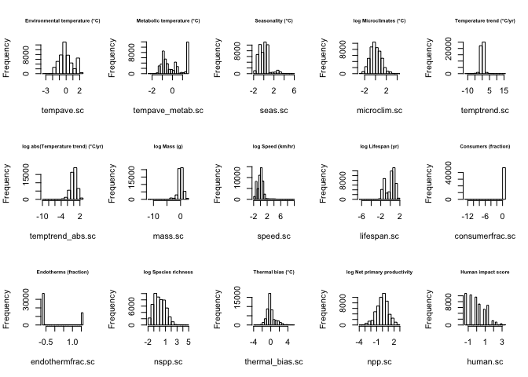
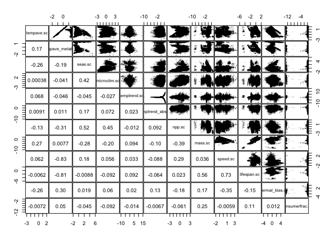
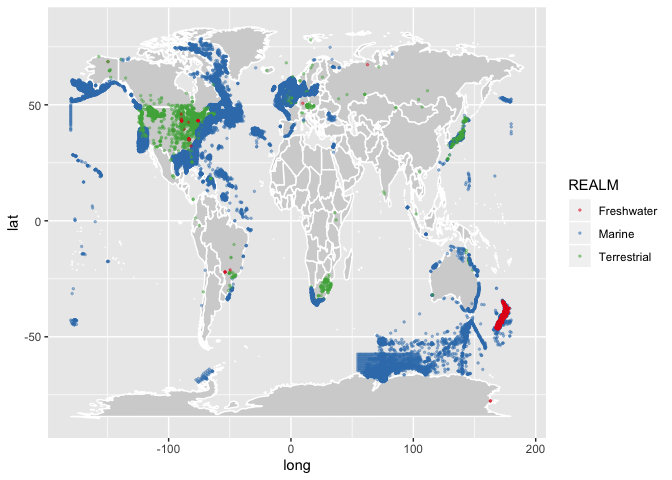

Drivers of variation in the community response to temperature change
across realms
================

Collaborators: Shane Blowes, Jon Chase, Helmut Hillebrand, Michael
Burrows, Amanda Bates, Uli Brose, Benoit Gauzens, Laura Antao
Assistance: Katherine Lew, Josef Hauser

# Introduction

  - Climate change is driving a widespread reorganization of ecological
    communities around the world (Parmsesan & Yohe 2003, Poloczanska et
    al. 2013),
  - but the impacts of climate change vary substantially from one
    location to another and among taxa (Molinos et al. 2016 NCC, Antao
    et al. 2020 NEE).
  - Community reorganization is substantially more common than an
    aggregate loss or gain of species (Dornelas et al. 2014 Science,
    Blowes et al. 2019 Science, Hillebrand et al. 2017 J Appl Ecol)
  - There are many hypotheses for why some communities are more
    sensitive to warming than others, including differences in
      - metabolic rates (Dillon et al. 2010 Nature),
      - thermal physiology (Deutsch et al. 2008 PNAS, Pinsky et al. 2019
        Nature),
      - microclimate availability (Burrows et al. 2019 NCC, Suggitt et
        al. 2018 NCC),
      - species mobility (Poloczanska et al. 2013 NCC, Burrows et
        al. 2011 Science, Sunday et al. 2012 NCC)
      - or generation time (Beaugrand et al. 2009 DSR II, Poloczanska et
        al. 2013 NCC),
      - consumers vs. producers (Petchey et al. 1999 Nature)
      - community composition (Stuart-Smith et al. 2015 Nature,
        Beaugrand et a. 2015 NCC, Trisos et al. 2020 Nature),
      - ecosystem productivity (Thomas et al. 2017 GCB, Brett 1971 Am
        Zoo),
      - exposure to human impacts (White & Kerr 2006 Ecography)
      - and among realms (Antao et al. 2020 NEE).
  - Scaling up from organismal effects to whole ecological communities
    is complex, and yet these scales are critical for ecosystem
    functioning and human well-being.
  - There is a need for a comprehensive test to understand where warming
    is driving and is likely to drive the most dramatic community
    turnover

# Methods

  - BioTime dataset, gridded to 96 km2 hexagons, summarized as temporal
    turnover (Blowes)
      - Temporal slope of Jaccard turnover compared to the first year
      - Same for Jaccard total
      - and Morisita-Horn turnover
  - Tested explanatory variables for differences in rate of turnover:
      - Temperature trend over the time-frame of each time-series (CRU
        TS 4.03 on land and in freshwater, ERSST v5 in the ocean)
      - Seasonality as a metric of thermal sensitivity (Deutsch et
        al. 2008 PNAS). Standard deviation of monthly temperatures.
      - Average temperature as a metric of metabolic rates (Dillon et
        al. 2010 Nature, Antao et al. 2020 Nat E\&E)
      - Mobility calculated from body mass and taxonomic group
        classifications of mobility mode (fly, run, swim, crawl,
        sessile). Fly/run/swim followed the allometric relationship in
        Hirt et al. 2017 Nat E\&E. Crawl set at 0.1 km/hr, sessile set
        to 0 km/hr. Then calculated averaged within each assemblage.
      - Net primary productivity (NPP) from the merged land/ocean
        product produced by the [Ocean
        Productivity](http://www.science.oregonstate.edu/ocean.productivity/)
        group at Oregon State using methods from Zhao et al. 2005 and
        Behrenfeld & Falkowski 1997.
  - TO DO:
      - Generation time calculated from body mass and endotherm
        vs. ectotherm classifications, following McCoy & Gillooly 2008
        ELE. Averaged across species within each assemblage.
      - Human impact calculated from Carsten Meyer’s ecosystem cube data
      - Thermal bias calculated from Species Temperature Indices (Mike
        Burrows)
      - Microclimates calculated from WorldClim and BioOracle (Laura
        Antao)
      - Consumer vs. producer classification
  - Maybe to do:
      - Species pool richness
  - Differences in temporal turnover (response variable) modeled with a
    linear mixed effects model (nlme package, lme() function). See below
    for details.

<!-- end list -->

``` r
library(data.table) # for handling large datasets
library(ggplot2) # for some plotting
#library(lme4)
library(nlme) # for ME models
library(beanplot) # for beanplots
library(maps) # for map
library(ggeffects) # marginal effect plots
```

    ## Warning: package 'ggeffects' was built under R version 3.6.2

``` r
library(gridExtra) # to combine ggplots together
library(grid) # to combine ggplots together
library(gridExtra)

# tell RStudio to use project root directory as the root for this notebook. Needed since we are storing code in a separate directory.
knitr::opts_knit$set(root.dir = rprojroot::find_rstudio_root_file()) 
```

``` r
# Turnover and covariates assembled by turnover_vs_temperature_prep.Rmd
trends <- fread('output/turnover_w_covariates.csv.gz')

# set realm order
trends[, REALM := factor(REALM, levels = c('Freshwater', 'Marine', 'Terrestrial'), ordered = FALSE)]

# group Marine invertebrates/plants in with All
trends[, taxa_mod2 := taxa_mod]
trends[taxa_mod == 'Marine invertebrates/plants', taxa_mod2 := 'All']
```

Log-transform some variables, then center and scale.

``` r
trends[, tempave.sc := scale(tempave)]
trends[, tempave_metab.sc := scale(tempave_metab)]
trends[, seas.sc := scale(seas)]
trends[, microclim.sc := scale(log(microclim))]
trends[, temptrend.sc := scale(temptrend)]
trends[, temptrend_abs.sc := scale(log(abs(temptrend)))]
trends[, npp.sc := scale(log(npp))]
trends[, mass.sc := scale(log(mass_geomean))]
trends[, speed.sc := scale(log(speed_geomean+1))]
trends[, lifespan.sc := scale(log(lifespan_geomean))]
trends[, thermal_bias.sc := scale(thermal_bias)]
trends[, consumerfrac.sc := scale(consfrac)]
```

Do the variables look ok?

``` r
# histograms to examine
par(mfrow = c(3,4))
invisible(trends[, hist(tempave.sc, main = 'Environmental temperature (°C)')])
invisible(trends[, hist(tempave_metab.sc, main = 'Metabolic temperature (°C)')])
invisible(trends[, hist(seas.sc, main = 'Seasonality (°C)')])
invisible(trends[, hist(microclim.sc, main = 'log Microclimates (°C)')])
invisible(trends[, hist(temptrend.sc, main = 'Temperature trend (°C/yr)')])
invisible(trends[, hist(temptrend_abs.sc, main = 'log abs(Temperature trend) (°C/yr)')])
invisible(trends[, hist(npp.sc, main = 'log Net primary productivity')])
invisible(trends[, hist(mass.sc, main = 'log Mass (g)')])
invisible(trends[, hist(speed.sc, main = 'log Speed (km/hr)')])
invisible(trends[, hist(lifespan.sc, main = 'log Lifespan (yr)')])
invisible(trends[, hist(thermal_bias.sc, main = 'Thermal bias (°C)')])
invisible(trends[, hist(consumerfrac.sc, main = 'Consumers (fraction)')])
```

<!-- -->

Check correlations among variables. Pearson’s r is on the lower
diagonal.

``` r
panel.cor <- function(x, y, digits = 2, prefix = "", cex.cor, ...)
{
    usr <- par("usr"); on.exit(par(usr))
    par(usr = c(0, 1, 0, 1))
    r <- cor(x, y, use = 'pairwise.complete.obs')
    txt <- format(c(r, 0.123456789), digits = digits)[1]
    txt <- paste0(prefix, txt)
    if(missing(cex.cor)) cex.cor <- 0.8/strwidth(txt)
    text(0.5, 0.5, txt) #, cex = cex.cor * r)
}
pairs(formula = ~ tempave.sc + tempave_metab.sc + seas.sc + microclim.sc + temptrend.sc + temptrend_abs.sc + npp.sc + mass.sc + speed.sc + lifespan.sc + thermal_bias.sc + consumerfrac.sc, data = trends, gap = 1/10, cex = 0.2, col = '#00000022', lower.panel = panel.cor)
```

<!-- -->
Mass and lifespan look tightly correlated, but r only 0.56…?
Tempave\_metab and lifespan don’t look tightly correlated, but r= -0.81
Tempave\_metab and speed don’t look tightly correlated, but r= -0.83
Lifespan and speed don’t look tightly correlated, but r = 0.73

Examine how many data points are available

``` r
# the cases we can compare
apply(trends[, .(Jtutrend, temptrend.sc, tempave_metab.sc, REALM, seas.sc, microclim.sc, npp.sc, mass.sc, speed.sc, lifespan.sc, consumerfrac.sc, thermal_bias.sc)], MARGIN = 2, FUN = function(x) sum(!is.na(x)))
```

    ##         Jtutrend     temptrend.sc tempave_metab.sc            REALM 
    ##            53467            50335            50335            53467 
    ##          seas.sc     microclim.sc           npp.sc          mass.sc 
    ##            50335            52262            53314            53078 
    ##         speed.sc      lifespan.sc  consumerfrac.sc  thermal_bias.sc 
    ##            52649            51797            47988            49624

``` r
i <- trends[, complete.cases(Jtutrend, temptrend.sc, tempave_metab.sc, REALM, seas.sc, microclim.sc, npp.sc, mass.sc, speed.sc, lifespan.sc, consumerfrac.sc, thermal_bias.sc)]
cat('Overall:\n')
```

    ## Overall:

``` r
sum(i)
```

    ## [1] 43559

### Choose the variance structure for mixed effects modles

Try combinations of

  - variance scaled to a power of the number of years in the community
    time-series
  - variance scaled to a power of the abs temperature trend
  - random intercept for taxa\_mod
  - random intercept for STUDY\_ID
  - random slope (abs temperature trend) for taxa\_mod
  - random slope (abs temperature trend) for STUDY\_ID
  - random intercept for rarefyID (for overdispersion)

And choose the one with lowest AIC (not run: takes a long time)

``` r
# fit models for variance structure
fixed <- formula(Jtutrend ~ REALM + tempave_metab.sc + seas.sc + microclim.sc + npp.sc + temptrend_abs.sc +
                     mass.sc + speed.sc + lifespan.sc + consumerfrac.sc + thermal_bias.sc)
i <- trends[, complete.cases(Jtutrend, REALM, tempave_metab.sc, seas.sc, microclim.sc, npp.sc, temptrend_abs.sc,
                             mass.sc, speed.sc, lifespan.sc, consumerfrac.sc, thermal_bias.sc)]
mods <- vector('list', 0)
mods[[1]] <- gls(fixed, data = trends[i,])
mods[[2]] <- gls(fixed, data = trends[i,], weights = varPower(-0.5, ~nyrBT))
mods[[3]] <- gls(fixed, data = trends[i,], weights = varPower(0.5, ~ abs(temptrend)))

mods[[4]] <- lme(fixed, data = trends[i,], random = ~1|taxa_mod2, control = lmeControl(opt = "optim"))
mods[[5]] <- lme(fixed, data = trends[i,], random = ~1|STUDY_ID, control = lmeControl(opt = "optim"))
mods[[6]] <- lme(fixed, data = trends[i,], random = ~1|taxa_mod2/STUDY_ID, control = lmeControl(opt = "optim"))
mods[[7]] <- lme(fixed, data = trends[i,], random = ~1|STUDY_ID/rarefyID, control = lmeControl(opt = "optim"))
mods[[8]] <- lme(fixed, data = trends[i,], random = ~1|taxa_mod2/STUDY_ID/rarefyID, control = lmeControl(opt = "optim"))

mods[[9]] <- lme(fixed, data = trends[i,], random = ~temptrend_abs.sc | taxa_mod)
mods[[10]] <- lme(fixed, data = trends[i,], random = ~temptrend_abs.sc | STUDY_ID)
mods[[11]] <- lme(fixed, data = trends[i,], random = ~temptrend_abs.sc | taxa_mod2/STUDY_ID, control = lmeControl(opt = "optim"))
mods[[12]] <- lme(fixed, data = trends[i,], random = list(STUDY_ID = ~ temptrend_abs.sc, rarefyID = ~1)) # includes overdispersion. new formula so that random slope is only for study level (not enough data to extend to rarefyID).
mods[[13]] <- lme(fixed, data = trends[i,], random = list(taxa_mod2 = ~ temptrend_abs.sc, STUDY_ID = ~ temptrend_abs.sc, rarefyID = ~1)) # 30+ min to fit

mods[[14]] <- lme(fixed, data = trends[i,], random = ~1|STUDY_ID, weights = varPower(-0.5, ~nyrBT))
mods[[15]] <- lme(fixed, data = trends[i,], random = ~1|taxa_mod2, weights = varPower(-0.5, ~nyrBT))
mods[[16]] <- lme(fixed, data = trends[i,], random = ~1|taxa_mod2/STUDY_ID, weights = varPower(-0.5, ~nyrBT))
mods[[17]] <- lme(fixed, data = trends[i,], random = ~1|STUDY_ID/rarefyID, weights = varPower(-0.5, ~nyrBT))
mods[[18]] <- lme(fixed, data = trends[i,], random = ~1|taxa_mod2/STUDY_ID/rarefyID, weights = varPower(-0.5, ~nyrBT))
mods[[19]] <- lme(fixed, data = trends[i,], random = ~temptrend_abs.sc|STUDY_ID, weights = varPower(-0.5, ~nyrBT))
mods[[20]] <- lme(fixed, data = trends[i,], random = list(STUDY_ID = ~ temptrend_abs.sc, rarefyID = ~1), weights = varPower(-0.5, ~nyrBT))
mods[[21]] <- lme(fixed, data = trends[i,], random = list(taxa_mod2 = ~ temptrend_abs.sc, STUDY_ID = ~ 1), weights = varPower(-0.5, ~nyrBT))
mods[[22]] <- lme(fixed, data = trends[i,], random = list(taxa_mod2 = ~ temptrend_abs.sc, STUDY_ID = ~ 1, rarefyID = ~1), weights = varPower(-0.5, ~nyrBT))
mods[[23]] <- lme(fixed, data = trends[i,], random = list(taxa_mod2 = ~ temptrend_abs.sc, STUDY_ID = ~ temptrend_abs.sc), weights = varPower(-0.5, ~nyrBT)) # singular precision warning with lmeControl(opt = 'optim') and convergence error without
mods[[24]] <- lme(fixed, data = trends[i,], random = list(taxa_mod2 = ~ temptrend_abs.sc, STUDY_ID = ~ temptrend_abs.sc, rarefyID = ~1), weights = varPower(-0.5, ~nyrBT)) # singular precision warning with lmeControl(opt = 'optim') and convergence error without

mods[[25]] <- lme(fixed, data = trends[i,], random = ~1|taxa_mod2, weights = varPower(-0.5, ~abs(temptrend)))
mods[[26]] <- lme(fixed, data = trends[i,], random = ~1|STUDY_ID, weights = varPower(-0.5, ~abs(temptrend)))
mods[[27]] <- lme(fixed, data = trends[i,], random = ~1|STUDY_ID/rarefyID, weights = varPower(-0.5, ~abs(temptrend)))
mods[[28]] <- lme(fixed, data = trends[i,], random = ~1|taxa_mod2/STUDY_ID/rarefyID, weights = varPower(-0.5, ~abs(temptrend)))
mods[[29]] <- lme(fixed, data = trends[i,], random = ~temptrend_abs.sc|STUDY_ID, weights = varPower(-0.5, ~abs(temptrend)))
mods[[30]] <- lme(fixed, data = trends[i,], random = ~temptrend_abs.sc|taxa_mod2/STUDY_ID, weights = varPower(-0.5, ~abs(temptrend)), control = lmeControl(opt = "optim"))
mods[[31]] <- lme(fixed, data = trends[i,], random = list(STUDY_ID = ~ temptrend_abs.sc, rarefyID = ~1), weights = varPower(-0.5, ~abs(temptrend)))
mods[[32]] <- lme(fixed, data = trends[i,], random = list(taxa_mod2 = ~ temptrend_abs.sc, STUDY_ID = ~ temptrend_abs.sc, rarefyID = ~1), weights = varPower(-0.5, ~abs(temptrend)), control = lmeControl(opt = "optim")) # singular precision warning

aics <- sapply(mods, AIC)
minaics <- aics - min(aics)
minaics
which.min(aics)
```

Chooses the random slopes (temptrend\_abs) & intercepts for STUDY\_ID,
overdispersion, and variance scaled to number of years. We haven’t dealt
with potential testing on the boundary issues here yet.

# Results

## Where do we have data?

``` r
world <- map_data('world')
ggplot(world, aes(x = long, y = lat, group = group)) +
    geom_polygon(fill = 'lightgray', color = 'white') +
    geom_point(data = trends, aes(rarefyID_x, rarefyID_y, group = REALM, color = REALM), size = 0.5, alpha = 0.4)  +
    scale_color_brewer(palette="Set1")
```

<!-- -->
Mostly northern hemisphere, but spread all over. No so much in Africa or
much of Asia.

## Plot turnover vs. temperature trends

Lines are ggplot smoother fits by realm.
<!-- -->
Strong trends with temperature change, but trends are pretty symmetric
around no trend in temperature, which implies warming or cooling drives
similar degree of community turnover. Some indication of less turnover
for larger organisms (mass) Higher turnover on land with higher
seasonality? More turnover for shorter-lived organisms? No really clear
differences among realms.

## Compare covariates across realms

``` r
i <- trends[, !duplicated(STUDY_ID)]; sum(i)
```

    ## [1] 332

``` r
par(mfrow=c(2,3))
beanplot(rarefyID_y ~ REALM, data = trends[i,], what = c(1,1,1,1), col = c("#CAB2D6", "#33A02C", "#B2DF8A"), border = "#CAB2D6", ylab = 'Latitude (degN)', ll = 0.05)
beanplot(tempave ~ REALM, data = trends[i,], what = c(1,1,1,1), col = c("#CAB2D6", "#33A02C", "#B2DF8A"), border = "#CAB2D6", ylab = 'Temperature (degC)', ll = 0.05)
beanplot(tempave_metab ~ REALM, data = trends[i,], what = c(1,1,1,1), col = c("#CAB2D6", "#33A02C", "#B2DF8A"), border = "#CAB2D6", ylab = 'Metabolic Temperature (degC)', ll = 0.05)
beanplot(seas ~ REALM, data = trends[i,], what = c(1,1,1,1), col = c("#CAB2D6", "#33A02C", "#B2DF8A"), border = "#CAB2D6", ylab = 'Seasonality (degC)', ll = 0.05)
beanplot(microclim ~ REALM, data = trends[i,], what = c(1,1,1,1), col = c("#CAB2D6", "#33A02C", "#B2DF8A"), border = "#CAB2D6", ylab = 'Microclimates (degC)', ll = 0.05)
```

    ## log="y" selected

``` r
beanplot(temptrend ~ REALM, data = trends[i,], what = c(1,1,1,1), col = c("#CAB2D6", "#33A02C", "#B2DF8A"), border = "#CAB2D6", ylab = 'Temperature trend (degC/yr)', ll = 0.05)
```

<!-- -->

``` r
beanplot(npp ~ REALM, data = trends[i,], what = c(1,1,1,1), col = c("#CAB2D6", "#33A02C", "#B2DF8A"), border = "#CAB2D6", ylab = 'NPP', ll = 0.05)
beanplot(mass_geomean ~ REALM, data = trends[i,], what = c(1,1,1,1), col = c("#CAB2D6", "#33A02C", "#B2DF8A"), border = "#CAB2D6", ylab = 'Mass (g)', ll = 0.05)
```

    ## log="y" selected

``` r
beanplot(speed_geomean ~ REALM, data = trends[i,], what = c(1,1,1,1), col = c("#CAB2D6", "#33A02C", "#B2DF8A"), border = "#CAB2D6", ylab = 'Speed (km/hr)', ll = 0.05, log = '')
beanplot(lifespan_geomean ~ REALM, data = trends[i,], what = c(1,1,1,1), col = c("#CAB2D6", "#33A02C", "#B2DF8A"), border = "#CAB2D6", ylab = 'Lifespan (yr)', ll = 0.05, log = '')
beanplot(thermal_bias ~ REALM, data = trends[i,], what = c(1,1,1,1), col = c("#CAB2D6", "#33A02C", "#B2DF8A"), border = "#CAB2D6", ylab = 'Thermal bias (degC)', ll = 0.05, log = '')
#beanplot(consfrac ~ REALM, data = trends[i,], what = c(1,1,1,1), col = c("#CAB2D6", "#33A02C", "#B2DF8A"), border = "#CAB2D6", ylab = 'Consumers (fraction)', ll = 0.05, log = '') # too sparse
```

<!-- -->
Marine are in generally warmer locations (seawater doesn’t freeze)
Marine have much lower seasonality. Marine and freshwater have some very
small masses (plankton), but much of dataset is similar to terrestrial.
Marine has a lot of slow, crawling organisms, but land has plants. Land
also has birds (fast).

## Jaccard turnover temporal trend vs. static covariates

  - realm
  - environmental temperature
  - average metabolic temperature
  - seasonality
  - microclimates
  - NPP
  - speed
  - mass
  - lifespan
  - consumer vs. producer \#\#\# Full model linear mixed
model

<!-- end list -->

``` r
i <- trends[, complete.cases(Jtutrend, REALM, tempave_metab.sc, seas.sc, microclim.sc, npp.sc,
                             mass.sc, speed.sc, lifespan.sc, consumerfrac.sc, thermal_bias.sc)]

randef <- list(STUDY_ID = ~ 1, rarefyID = ~1)
varef <- varPower(-0.5, ~nyrBT)

if(file.exists('temp/modfull1.rds')){
  modfull1 <- readRDS('temp/modfull1.rds')
} else {
  modfull1 <- lme(Jtutrend ~ REALM +
                    tempave.sc + 
                    tempave_metab.sc + 
                    seas.sc + 
                    microclim.sc + 
                    npp.sc + 
                    speed.sc + 
                    mass.sc + 
                    lifespan.sc + 
                    consumerfrac.sc,
                  random = randef, weights = varef, data = trends[i,], method = 'REML')
  
  saveRDS(modfull1, file = 'temp/modfull1.rds')
}

summary(modfull1)
```

    ## Linear mixed-effects model fit by REML
    ##  Data: trends[i, ] 
    ##         AIC     BIC   logLik
    ##   -125589.9 -125451 62810.94
    ## 
    ## Random effects:
    ##  Formula: ~1 | STUDY_ID
    ##         (Intercept)
    ## StdDev:  0.05680305
    ## 
    ##  Formula: ~1 | rarefyID %in% STUDY_ID
    ##         (Intercept)  Residual
    ## StdDev: 0.001205495 0.3460855
    ## 
    ## Variance function:
    ##  Structure: Power of variance covariate
    ##  Formula: ~nyrBT 
    ##  Parameter estimates:
    ##     power 
    ## -1.301201 
    ## Fixed effects: Jtutrend ~ REALM + tempave.sc + tempave_metab.sc + seas.sc +      microclim.sc + npp.sc + speed.sc + mass.sc + lifespan.sc +      consumerfrac.sc 
    ##                        Value   Std.Error    DF   t-value p-value
    ## (Intercept)       0.00109221 0.014537024 43367  0.075133  0.9401
    ## REALMMarine       0.05904776 0.015714482   180  3.757538  0.0002
    ## REALMTerrestrial  0.02738690 0.016432980   180  1.666581  0.0973
    ## tempave.sc       -0.00047176 0.000437328 43367 -1.078731  0.2807
    ## tempave_metab.sc  0.00310656 0.011299309 43367  0.274934  0.7834
    ## seas.sc          -0.00066637 0.000280740 43367 -2.373620  0.0176
    ## microclim.sc     -0.00079400 0.000164303 43367 -4.832543  0.0000
    ## npp.sc           -0.00198672 0.000247122 43367 -8.039413  0.0000
    ## speed.sc          0.00360299 0.000928345 43367  3.881084  0.0001
    ## mass.sc          -0.01227783 0.007830960 43367 -1.567858  0.1169
    ## lifespan.sc       0.00836918 0.013249402 43367  0.631664  0.5276
    ## consumerfrac.sc   0.00530385 0.001850153 43367  2.866708  0.0041
    ##  Correlation: 
    ##                  (Intr) REALMM REALMT tmpv.s tmpv_. ses.sc mcrcl. npp.sc
    ## REALMMarine      -0.919                                                 
    ## REALMTerrestrial -0.880  0.811                                          
    ## tempave.sc       -0.050  0.036  0.056                                   
    ## tempave_metab.sc  0.011 -0.017 -0.115 -0.138                            
    ## seas.sc          -0.031  0.033  0.002  0.580  0.063                     
    ## microclim.sc     -0.005  0.003 -0.021  0.264  0.255  0.242              
    ## npp.sc            0.023 -0.018 -0.038 -0.334  0.026 -0.255 -0.280       
    ## speed.sc          0.018 -0.010  0.017  0.051 -0.077 -0.032 -0.021 -0.045
    ## mass.sc           0.011  0.003  0.098  0.077 -0.987 -0.078 -0.254  0.011
    ## lifespan.sc       0.004 -0.013 -0.106 -0.080  0.996  0.086  0.263 -0.001
    ## consumerfrac.sc  -0.007  0.007  0.128 -0.116 -0.323 -0.101 -0.010 -0.098
    ##                  spd.sc mss.sc lfspn.
    ## REALMMarine                          
    ## REALMTerrestrial                     
    ## tempave.sc                           
    ## tempave_metab.sc                     
    ## seas.sc                              
    ## microclim.sc                         
    ## npp.sc                               
    ## speed.sc                             
    ## mass.sc           0.129              
    ## lifespan.sc      -0.066 -0.992       
    ## consumerfrac.sc   0.017  0.325 -0.329
    ## 
    ## Standardized Within-Group Residuals:
    ##         Min          Q1         Med          Q3         Max 
    ## -9.54732036 -0.24455613  0.09324922  0.60308663  6.51651903 
    ## 
    ## Number of Observations: 43559
    ## Number of Groups: 
    ##               STUDY_ID rarefyID %in% STUDY_ID 
    ##                    183                  43559

Try simplifying the model

``` r
if(file.exists('temp/modfull1simp.rds')){
  modfull1simp <- readRDS('temp/modfull1simp.rds')
} else {
  require(MASS) # for stepAIC()
  modfull1ml <- update(modfull1, method = 'ML')
  modfull1simp <- stepAIC(modfull1ml, direction = 'backward')
  saveRDS(modfull1simp, file = 'temp/modfull1simp.rds')
}
summary(modfull1simp)
```

    ## Linear mixed-effects model fit by maximum likelihood
    ##  Data: trends[i, ] 
    ##         AIC       BIC  logLik
    ##   -125729.8 -125608.3 62878.9
    ## 
    ## Random effects:
    ##  Formula: ~1 | STUDY_ID
    ##         (Intercept)
    ## StdDev:  0.05614629
    ## 
    ##  Formula: ~1 | rarefyID %in% STUDY_ID
    ##         (Intercept)  Residual
    ## StdDev: 0.001208012 0.3461003
    ## 
    ## Variance function:
    ##  Structure: Power of variance covariate
    ##  Formula: ~nyrBT 
    ##  Parameter estimates:
    ##     power 
    ## -1.301295 
    ## Fixed effects: Jtutrend ~ REALM + seas.sc + microclim.sc + npp.sc + speed.sc +      mass.sc + lifespan.sc + consumerfrac.sc 
    ##                        Value   Std.Error    DF   t-value p-value
    ## (Intercept)       0.00027222 0.014364944 43369  0.018950  0.9849
    ## REALMMarine       0.05962383 0.015534930   180  3.838049  0.0002
    ## REALMTerrestrial  0.02851431 0.016138229   180  1.766880  0.0789
    ## seas.sc          -0.00049512 0.000225008 43369 -2.200439  0.0278
    ## microclim.sc     -0.00075355 0.000150938 43369 -4.992440  0.0000
    ## npp.sc           -0.00207402 0.000232874 43369 -8.906180  0.0000
    ## speed.sc          0.00364614 0.000923865 43369  3.946610  0.0001
    ## mass.sc          -0.01064548 0.001174833 43369 -9.061269  0.0000
    ## lifespan.sc       0.00553166 0.000936651 43369  5.905792  0.0000
    ## consumerfrac.sc   0.00512151 0.001714754 43369  2.986733  0.0028
    ##  Correlation: 
    ##                  (Intr) REALMM REALMT ses.sc mcrcl. npp.sc spd.sc mss.sc
    ## REALMMarine      -0.919                                                 
    ## REALMTerrestrial -0.884  0.814                                          
    ## seas.sc          -0.004  0.017 -0.020                                   
    ## microclim.sc      0.008 -0.003 -0.005  0.063                            
    ## npp.sc            0.007 -0.007 -0.023 -0.078 -0.215                     
    ## speed.sc          0.021 -0.012  0.007 -0.065 -0.014 -0.031              
    ## mass.sc           0.130 -0.081 -0.083  0.164  0.117  0.120  0.366       
    ## lifespan.sc      -0.057  0.039  0.085 -0.201 -0.131 -0.126  0.123 -0.559
    ## consumerfrac.sc  -0.012  0.008  0.106  0.020  0.140 -0.163 -0.001 -0.027
    ##                  lfspn.
    ## REALMMarine            
    ## REALMTerrestrial       
    ## seas.sc                
    ## microclim.sc           
    ## npp.sc                 
    ## speed.sc               
    ## mass.sc                
    ## lifespan.sc            
    ## consumerfrac.sc   0.026
    ## 
    ## Standardized Within-Group Residuals:
    ##         Min          Q1         Med          Q3         Max 
    ## -9.54693493 -0.24455510  0.09326103  0.60331617  6.52418949 
    ## 
    ## Number of Observations: 43559
    ## Number of Groups: 
    ##               STUDY_ID rarefyID %in% STUDY_ID 
    ##                    183                  43559

Plot the coefficients

``` r
require(sjPlot)
```

    ## Loading required package: sjPlot

    ## Learn more about sjPlot with 'browseVignettes("sjPlot")'.

``` r
modfull1simpreml <- update(modfull1simp, method = 'REML')
p1 <- sjPlot::plot_model(modfull1simpreml, type = 'est', rm.terms = 'REALM [Marine,Terrestrial]') + ylim(-0.011, 0.01)
```

    ## Scale for 'y' is already present. Adding another scale for 'y', which
    ## will replace the existing scale.

``` r
p2<- sjPlot::plot_model(modfull1simpreml, type = 'est', terms = 'REALM [Terrestrial,Marine]') + ylim(-0.03, 0.1)
```

    ## Scale for 'y' is already present. Adding another scale for 'y', which
    ## will replace the existing scale.

``` r
grid.arrange(p1, p2, nrow = 1)
```

    ## Warning: Removed 1 rows containing missing values (geom_errorbar).

<!-- -->

Plot residuals against each predictor

``` r
resids <- resid(modfull1simpreml)
preds <- getData(modfull1simpreml)
col = '#00000033'
cex = 0.5
par(mfrow = c(3,3))
boxplot(resids ~ preds$REALM, cex = cex, col = col)
plot(preds$seas.sc, resids, cex = cex, col = col)
plot(preds$microclim.sc, resids, cex = cex, col = col)
plot(preds$npp.sc, resids, cex = cex, col = col)
plot(preds$speed.sc, resids, cex = cex, col = col)
plot(preds$mass.sc, resids, cex = cex, col = col)
plot(preds$lifespan.sc, resids, cex = cex, col = col)
plot(preds$consumerfrac.sc, resids, cex = cex, col = col)
```

<!-- -->

## Jaccard turnover temporal trend vs. temperature trend

Try interactions of abs temperature trend with each covariate:

  - realm
  - environmental temperature
  - average metabolic temperature
  - seasonality
  - microclimates
  - NPP
  - speed
  - mass
  - lifespan
  - consumer vs. producer
  - thermal bias

Except for thermal bias: interact with temperature trend (not
abs)

### Full model

``` r
i <- trends[, complete.cases(Jtutrend, REALM, temptrend.sc, temptrend_abs.sc, tempave.sc, tempave_metab.sc, seas.sc, microclim.sc, 
                             npp.sc, mass.sc, speed.sc, lifespan.sc, consumerfrac.sc, thermal_bias.sc)]

randef <- list(STUDY_ID = ~ temptrend_abs.sc, rarefyID = ~1)
varef <- varPower(-0.5, ~nyrBT)

if(file.exists('temp/modTfull1.rds')){
  modTfull1 <- readRDS('temp/modTfull1.rds')
} else {
  modTfull1 <- lme(Jtutrend ~ temptrend_abs.sc*REALM + 
                     temptrend_abs.sc*tempave.sc +
                     temptrend_abs.sc*tempave_metab.sc + 
                     temptrend_abs.sc*seas.sc + 
                     temptrend_abs.sc*microclim.sc + 
                     temptrend_abs.sc*npp.sc + 
                     temptrend_abs.sc*speed.sc + 
                     temptrend_abs.sc*mass.sc + 
                     temptrend_abs.sc*lifespan.sc + 
                     temptrend_abs.sc*consumerfrac.sc +
                     temptrend.sc*thermal_bias.sc,
                   random = randef, weights = varef, data = trends[i,], method = 'REML')
  saveRDS(modTfull1, file = 'temp/modTfull1.rds')
}

summary(modTfull1)
```

    ## Linear mixed-effects model fit by REML
    ##  Data: trends[i, ] 
    ##         AIC       BIC   logLik
    ##   -128857.8 -128571.4 64461.92
    ## 
    ## Random effects:
    ##  Formula: ~temptrend_abs.sc | STUDY_ID
    ##  Structure: General positive-definite, Log-Cholesky parametrization
    ##                  StdDev     Corr  
    ## (Intercept)      0.05264704 (Intr)
    ## temptrend_abs.sc 0.01839980 0.422 
    ## 
    ##  Formula: ~1 | rarefyID %in% STUDY_ID
    ##         (Intercept)  Residual
    ## StdDev: 0.001051067 0.3121778
    ## 
    ## Variance function:
    ##  Structure: Power of variance covariate
    ##  Formula: ~nyrBT 
    ##  Parameter estimates:
    ##     power 
    ## -1.256934 
    ## Fixed effects: Jtutrend ~ temptrend_abs.sc * REALM + temptrend_abs.sc * tempave.sc +      temptrend_abs.sc * tempave_metab.sc + temptrend_abs.sc *      seas.sc + temptrend_abs.sc * microclim.sc + temptrend_abs.sc *      npp.sc + temptrend_abs.sc * speed.sc + temptrend_abs.sc *      mass.sc + temptrend_abs.sc * lifespan.sc + temptrend_abs.sc *      consumerfrac.sc + temptrend.sc * thermal_bias.sc 
    ##                                         Value   Std.Error    DF   t-value
    ## (Intercept)                        0.01242124 0.013807977 43352  0.899570
    ## temptrend_abs.sc                   0.03226321 0.008360096 43352  3.859191
    ## REALMMarine                        0.05060674 0.014882763   180  3.400359
    ## REALMTerrestrial                   0.01419866 0.015661189   180  0.906614
    ## tempave.sc                        -0.00340078 0.000717832 43352 -4.737568
    ## tempave_metab.sc                  -0.00647509 0.012065479 43352 -0.536663
    ## seas.sc                           -0.00047932 0.000344533 43352 -1.391231
    ## microclim.sc                      -0.00067908 0.000183060 43352 -3.709598
    ## npp.sc                            -0.00068286 0.000290946 43352 -2.347014
    ## speed.sc                           0.00468956 0.000913307 43352  5.134705
    ## mass.sc                            0.00206909 0.008381298 43352  0.246869
    ## lifespan.sc                       -0.00945863 0.014202017 43352 -0.666006
    ## consumerfrac.sc                    0.00571249 0.001861960 43352  3.067996
    ## temptrend.sc                       0.00044994 0.000480501 43352  0.936403
    ## thermal_bias.sc                   -0.00191848 0.000480074 43352 -3.996222
    ## temptrend_abs.sc:REALMMarine      -0.01680674 0.008677345 43352 -1.936853
    ## temptrend_abs.sc:REALMTerrestrial -0.01439148 0.009882748 43352 -1.456222
    ## temptrend_abs.sc:tempave.sc       -0.00234390 0.000725115 43352 -3.232451
    ## temptrend_abs.sc:tempave_metab.sc -0.00776663 0.012111588 43352 -0.641256
    ## temptrend_abs.sc:seas.sc          -0.00010054 0.000535474 43352 -0.187751
    ## temptrend_abs.sc:microclim.sc     -0.00131520 0.000262552 43352 -5.009293
    ## temptrend_abs.sc:npp.sc           -0.00102225 0.000386302 43352 -2.646253
    ## temptrend_abs.sc:speed.sc         -0.00258143 0.000905188 43352 -2.851815
    ## temptrend_abs.sc:mass.sc           0.00588105 0.008554333 43352  0.687494
    ## temptrend_abs.sc:lifespan.sc      -0.00914981 0.014435440 43352 -0.633843
    ## temptrend_abs.sc:consumerfrac.sc   0.00312040 0.002197836 43352  1.419761
    ## temptrend.sc:thermal_bias.sc      -0.00098043 0.000347538 43352 -2.821064
    ##                                   p-value
    ## (Intercept)                        0.3684
    ## temptrend_abs.sc                   0.0001
    ## REALMMarine                        0.0008
    ## REALMTerrestrial                   0.3658
    ## tempave.sc                         0.0000
    ## tempave_metab.sc                   0.5915
    ## seas.sc                            0.1642
    ## microclim.sc                       0.0002
    ## npp.sc                             0.0189
    ## speed.sc                           0.0000
    ## mass.sc                            0.8050
    ## lifespan.sc                        0.5054
    ## consumerfrac.sc                    0.0022
    ## temptrend.sc                       0.3491
    ## thermal_bias.sc                    0.0001
    ## temptrend_abs.sc:REALMMarine       0.0528
    ## temptrend_abs.sc:REALMTerrestrial  0.1453
    ## temptrend_abs.sc:tempave.sc        0.0012
    ## temptrend_abs.sc:tempave_metab.sc  0.5214
    ## temptrend_abs.sc:seas.sc           0.8511
    ## temptrend_abs.sc:microclim.sc      0.0000
    ## temptrend_abs.sc:npp.sc            0.0081
    ## temptrend_abs.sc:speed.sc          0.0043
    ## temptrend_abs.sc:mass.sc           0.4918
    ## temptrend_abs.sc:lifespan.sc       0.5262
    ## temptrend_abs.sc:consumerfrac.sc   0.1557
    ## temptrend.sc:thermal_bias.sc       0.0048
    ##  Correlation: 
    ##                                   (Intr) tmpt_. REALMM REALMT tmpv.s
    ## temptrend_abs.sc                   0.276                            
    ## REALMMarine                       -0.920 -0.252                     
    ## REALMTerrestrial                  -0.876 -0.241  0.809              
    ## tempave.sc                        -0.015  0.000 -0.007  0.019       
    ## tempave_metab.sc                   0.012  0.002 -0.020 -0.121 -0.036
    ## seas.sc                           -0.036  0.001  0.044  0.002  0.217
    ## microclim.sc                      -0.010  0.002  0.007 -0.027  0.087
    ## npp.sc                             0.030  0.002 -0.020 -0.030 -0.342
    ## speed.sc                           0.014 -0.001 -0.009  0.017 -0.023
    ## mass.sc                            0.013  0.008  0.004  0.101 -0.010
    ## lifespan.sc                        0.004 -0.001 -0.015 -0.110 -0.003
    ## consumerfrac.sc                   -0.013 -0.006  0.013  0.126 -0.085
    ## temptrend.sc                      -0.007 -0.013  0.006  0.009 -0.057
    ## thermal_bias.sc                    0.025  0.006 -0.041 -0.025  0.765
    ## temptrend_abs.sc:REALMMarine      -0.263 -0.955  0.275  0.230  0.000
    ## temptrend_abs.sc:REALMTerrestrial -0.231 -0.850  0.215  0.270 -0.015
    ## temptrend_abs.sc:tempave.sc        0.005 -0.057 -0.005  0.008  0.140
    ## temptrend_abs.sc:tempave_metab.sc -0.001 -0.011 -0.003 -0.027  0.010
    ## temptrend_abs.sc:seas.sc           0.005 -0.019 -0.005 -0.029  0.120
    ## temptrend_abs.sc:microclim.sc     -0.001 -0.031 -0.001 -0.026  0.027
    ## temptrend_abs.sc:npp.sc            0.018 -0.026 -0.014 -0.012 -0.148
    ## temptrend_abs.sc:speed.sc         -0.028 -0.078  0.026  0.031  0.009
    ## temptrend_abs.sc:mass.sc           0.006  0.029  0.001  0.022 -0.010
    ## temptrend_abs.sc:lifespan.sc      -0.002 -0.022 -0.002 -0.024  0.007
    ## temptrend_abs.sc:consumerfrac.sc  -0.009 -0.030  0.009  0.010 -0.033
    ## temptrend.sc:thermal_bias.sc       0.007  0.010 -0.007 -0.011  0.080
    ##                                   tmpv_. ses.sc mcrcl. npp.sc spd.sc
    ## temptrend_abs.sc                                                    
    ## REALMMarine                                                         
    ## REALMTerrestrial                                                    
    ## tempave.sc                                                          
    ## tempave_metab.sc                                                    
    ## seas.sc                            0.081                            
    ## microclim.sc                       0.240  0.223                     
    ## npp.sc                            -0.046 -0.302 -0.278              
    ## speed.sc                          -0.054 -0.051 -0.012 -0.032       
    ## mass.sc                           -0.987 -0.088 -0.236  0.088  0.097
    ## lifespan.sc                        0.996  0.100  0.241 -0.073 -0.044
    ## consumerfrac.sc                   -0.331 -0.034 -0.007 -0.105  0.008
    ## temptrend.sc                      -0.003 -0.043 -0.015 -0.011  0.010
    ## thermal_bias.sc                    0.050 -0.179 -0.104 -0.159 -0.052
    ## temptrend_abs.sc:REALMMarine      -0.002  0.007  0.001 -0.009  0.003
    ## temptrend_abs.sc:REALMTerrestrial -0.049 -0.023 -0.038  0.018  0.005
    ## temptrend_abs.sc:tempave.sc       -0.009  0.051 -0.007 -0.032 -0.024
    ## temptrend_abs.sc:tempave_metab.sc  0.284  0.023  0.100  0.005 -0.025
    ## temptrend_abs.sc:seas.sc           0.104  0.210  0.072 -0.212 -0.027
    ## temptrend_abs.sc:microclim.sc      0.130  0.078  0.337 -0.180  0.038
    ## temptrend_abs.sc:npp.sc           -0.031 -0.185 -0.188  0.403  0.010
    ## temptrend_abs.sc:speed.sc         -0.024 -0.023  0.010  0.011  0.020
    ## temptrend_abs.sc:mass.sc          -0.276 -0.022 -0.092  0.000  0.020
    ## temptrend_abs.sc:lifespan.sc       0.285  0.027  0.092  0.003 -0.022
    ## temptrend_abs.sc:consumerfrac.sc  -0.156 -0.013 -0.015 -0.024 -0.024
    ## temptrend.sc:thermal_bias.sc       0.045  0.000 -0.019 -0.010  0.010
    ##                                   mss.sc lfspn. cnsmr. tmptr. thrm_.
    ## temptrend_abs.sc                                                    
    ## REALMMarine                                                         
    ## REALMTerrestrial                                                    
    ## tempave.sc                                                          
    ## tempave_metab.sc                                                    
    ## seas.sc                                                             
    ## microclim.sc                                                        
    ## npp.sc                                                              
    ## speed.sc                                                            
    ## mass.sc                                                             
    ## lifespan.sc                       -0.992                            
    ## consumerfrac.sc                    0.329 -0.335                     
    ## temptrend.sc                      -0.001 -0.001  0.017              
    ## thermal_bias.sc                   -0.063  0.050 -0.035  0.003       
    ## temptrend_abs.sc:REALMMarine      -0.003 -0.001  0.007  0.010 -0.004
    ## temptrend_abs.sc:REALMTerrestrial  0.043 -0.045  0.024  0.011 -0.030
    ## temptrend_abs.sc:tempave.sc        0.005 -0.001 -0.031 -0.077  0.043
    ## temptrend_abs.sc:tempave_metab.sc -0.289  0.292 -0.110 -0.002  0.029
    ## temptrend_abs.sc:seas.sc          -0.102  0.104  0.025 -0.024  0.090
    ## temptrend_abs.sc:microclim.sc     -0.123  0.121 -0.021  0.001 -0.017
    ## temptrend_abs.sc:npp.sc            0.050 -0.043 -0.053  0.000 -0.071
    ## temptrend_abs.sc:speed.sc          0.010 -0.017  0.007  0.038  0.030
    ## temptrend_abs.sc:mass.sc           0.287 -0.287  0.108  0.003 -0.018
    ## temptrend_abs.sc:lifespan.sc      -0.291  0.294 -0.113 -0.003  0.016
    ## temptrend_abs.sc:consumerfrac.sc   0.151 -0.157  0.341  0.010 -0.019
    ## temptrend.sc:thermal_bias.sc      -0.041  0.041 -0.030 -0.403 -0.006
    ##                                   t_.:REALMM t_.:REALMT tmptrnd_bs.sc:t.
    ## temptrend_abs.sc                                                        
    ## REALMMarine                                                             
    ## REALMTerrestrial                                                        
    ## tempave.sc                                                              
    ## tempave_metab.sc                                                        
    ## seas.sc                                                                 
    ## microclim.sc                                                            
    ## npp.sc                                                                  
    ## speed.sc                                                                
    ## mass.sc                                                                 
    ## lifespan.sc                                                             
    ## consumerfrac.sc                                                         
    ## temptrend.sc                                                            
    ## thermal_bias.sc                                                         
    ## temptrend_abs.sc:REALMMarine                                            
    ## temptrend_abs.sc:REALMTerrestrial  0.812                                
    ## temptrend_abs.sc:tempave.sc        0.028      0.138                     
    ## temptrend_abs.sc:tempave_metab.sc -0.019     -0.142      0.037          
    ## temptrend_abs.sc:seas.sc           0.040     -0.083      0.219          
    ## temptrend_abs.sc:microclim.sc      0.032     -0.018     -0.001          
    ## temptrend_abs.sc:npp.sc            0.010      0.010     -0.163          
    ## temptrend_abs.sc:speed.sc          0.075      0.110     -0.136          
    ## temptrend_abs.sc:mass.sc           0.010      0.120     -0.125          
    ## temptrend_abs.sc:lifespan.sc      -0.012     -0.116      0.125          
    ## temptrend_abs.sc:consumerfrac.sc   0.015      0.088     -0.005          
    ## temptrend.sc:thermal_bias.sc      -0.011     -0.010      0.112          
    ##                                   t_.:_. tmptrnd_bs.sc:ss.
    ## temptrend_abs.sc                                          
    ## REALMMarine                                               
    ## REALMTerrestrial                                          
    ## tempave.sc                                                
    ## tempave_metab.sc                                          
    ## seas.sc                                                   
    ## microclim.sc                                              
    ## npp.sc                                                    
    ## speed.sc                                                  
    ## mass.sc                                                   
    ## lifespan.sc                                               
    ## consumerfrac.sc                                           
    ## temptrend.sc                                              
    ## thermal_bias.sc                                           
    ## temptrend_abs.sc:REALMMarine                              
    ## temptrend_abs.sc:REALMTerrestrial                         
    ## temptrend_abs.sc:tempave.sc                               
    ## temptrend_abs.sc:tempave_metab.sc                         
    ## temptrend_abs.sc:seas.sc           0.092                  
    ## temptrend_abs.sc:microclim.sc      0.137  0.080           
    ## temptrend_abs.sc:npp.sc            0.029 -0.251           
    ## temptrend_abs.sc:speed.sc          0.038 -0.030           
    ## temptrend_abs.sc:mass.sc          -0.987 -0.089           
    ## temptrend_abs.sc:lifespan.sc       0.994  0.095           
    ## temptrend_abs.sc:consumerfrac.sc  -0.078 -0.060           
    ## temptrend.sc:thermal_bias.sc       0.036 -0.003           
    ##                                   tmptrnd_bs.sc:mc. tmptrnd_bs.sc:n.
    ## temptrend_abs.sc                                                    
    ## REALMMarine                                                         
    ## REALMTerrestrial                                                    
    ## tempave.sc                                                          
    ## tempave_metab.sc                                                    
    ## seas.sc                                                             
    ## microclim.sc                                                        
    ## npp.sc                                                              
    ## speed.sc                                                            
    ## mass.sc                                                             
    ## lifespan.sc                                                         
    ## consumerfrac.sc                                                     
    ## temptrend.sc                                                        
    ## thermal_bias.sc                                                     
    ## temptrend_abs.sc:REALMMarine                                        
    ## temptrend_abs.sc:REALMTerrestrial                                   
    ## temptrend_abs.sc:tempave.sc                                         
    ## temptrend_abs.sc:tempave_metab.sc                                   
    ## temptrend_abs.sc:seas.sc                                            
    ## temptrend_abs.sc:microclim.sc                                       
    ## temptrend_abs.sc:npp.sc           -0.249                            
    ## temptrend_abs.sc:speed.sc         -0.063            -0.002          
    ## temptrend_abs.sc:mass.sc          -0.134            -0.010          
    ## temptrend_abs.sc:lifespan.sc       0.142             0.015          
    ## temptrend_abs.sc:consumerfrac.sc   0.002            -0.009          
    ## temptrend.sc:thermal_bias.sc      -0.035            -0.014          
    ##                                   tmptrnd_bs.sc:sp. tmptrnd_bs.sc:ms.
    ## temptrend_abs.sc                                                     
    ## REALMMarine                                                          
    ## REALMTerrestrial                                                     
    ## tempave.sc                                                           
    ## tempave_metab.sc                                                     
    ## seas.sc                                                              
    ## microclim.sc                                                         
    ## npp.sc                                                               
    ## speed.sc                                                             
    ## mass.sc                                                              
    ## lifespan.sc                                                          
    ## consumerfrac.sc                                                      
    ## temptrend.sc                                                         
    ## thermal_bias.sc                                                      
    ## temptrend_abs.sc:REALMMarine                                         
    ## temptrend_abs.sc:REALMTerrestrial                                    
    ## temptrend_abs.sc:tempave.sc                                          
    ## temptrend_abs.sc:tempave_metab.sc                                    
    ## temptrend_abs.sc:seas.sc                                             
    ## temptrend_abs.sc:microclim.sc                                        
    ## temptrend_abs.sc:npp.sc                                              
    ## temptrend_abs.sc:speed.sc                                            
    ## temptrend_abs.sc:mass.sc           0.011                             
    ## temptrend_abs.sc:lifespan.sc       0.029            -0.994           
    ## temptrend_abs.sc:consumerfrac.sc   0.047             0.073           
    ## temptrend.sc:thermal_bias.sc      -0.003            -0.039           
    ##                                   tmptrnd_bs.sc:l. tmptrnd_bs.sc:c.
    ## temptrend_abs.sc                                                   
    ## REALMMarine                                                        
    ## REALMTerrestrial                                                   
    ## tempave.sc                                                         
    ## tempave_metab.sc                                                   
    ## seas.sc                                                            
    ## microclim.sc                                                       
    ## npp.sc                                                             
    ## speed.sc                                                           
    ## mass.sc                                                            
    ## lifespan.sc                                                        
    ## consumerfrac.sc                                                    
    ## temptrend.sc                                                       
    ## thermal_bias.sc                                                    
    ## temptrend_abs.sc:REALMMarine                                       
    ## temptrend_abs.sc:REALMTerrestrial                                  
    ## temptrend_abs.sc:tempave.sc                                        
    ## temptrend_abs.sc:tempave_metab.sc                                  
    ## temptrend_abs.sc:seas.sc                                           
    ## temptrend_abs.sc:microclim.sc                                      
    ## temptrend_abs.sc:npp.sc                                            
    ## temptrend_abs.sc:speed.sc                                          
    ## temptrend_abs.sc:mass.sc                                           
    ## temptrend_abs.sc:lifespan.sc                                       
    ## temptrend_abs.sc:consumerfrac.sc  -0.075                           
    ## temptrend.sc:thermal_bias.sc       0.036           -0.022          
    ## 
    ## Standardized Within-Group Residuals:
    ##         Min          Q1         Med          Q3         Max 
    ## -7.64654555 -0.27787247  0.08763851  0.58004724  6.92648150 
    ## 
    ## Number of Observations: 43559
    ## Number of Groups: 
    ##               STUDY_ID rarefyID %in% STUDY_ID 
    ##                    183                  43559

Try simplifying the model

``` r
if(file.exists('temp/modTfull1.rds')){
  modTfull1simp <- readRDS('temp/modTfull1simp.rds')
} else {
  require(MASS) # for stepAIC
  modTfull1ml <- update(modTfull1, method = 'ML')
  modTfull1simp <- stepAIC(modTfull1ml, direction = 'backward')
  saveRDS(modTfull1simp, file = 'temp/modTfull1simp.rds')
}
summary(modTfull1simp)
```

    ## Linear mixed-effects model fit by maximum likelihood
    ##  Data: trends[i, ] 
    ##         AIC       BIC   logLik
    ##   -129182.2 -128982.5 64614.09
    ## 
    ## Random effects:
    ##  Formula: ~temptrend_abs.sc | STUDY_ID
    ##  Structure: General positive-definite, Log-Cholesky parametrization
    ##                  StdDev     Corr  
    ## (Intercept)      0.05152866 (Intr)
    ## temptrend_abs.sc 0.01774682 0.449 
    ## 
    ##  Formula: ~1 | rarefyID %in% STUDY_ID
    ##         (Intercept)  Residual
    ## StdDev: 0.001043716 0.3124477
    ## 
    ## Variance function:
    ##  Structure: Power of variance covariate
    ##  Formula: ~nyrBT 
    ##  Parameter estimates:
    ##     power 
    ## -1.257584 
    ## Fixed effects: Jtutrend ~ temptrend_abs.sc + REALM + tempave.sc + microclim.sc +      npp.sc + speed.sc + mass.sc + consumerfrac.sc + temptrend.sc +      thermal_bias.sc + temptrend_abs.sc:tempave.sc + temptrend_abs.sc:microclim.sc +      temptrend_abs.sc:npp.sc + temptrend_abs.sc:speed.sc + temptrend.sc:thermal_bias.sc 
    ##                                     Value   Std.Error    DF   t-value
    ## (Intercept)                    0.00297614 0.012921045 43362  0.230333
    ## temptrend_abs.sc               0.01639607 0.002069174 43362  7.923971
    ## REALMMarine                    0.06026381 0.013895072   180  4.337063
    ## REALMTerrestrial               0.02331644 0.014480350   180  1.610213
    ## tempave.sc                    -0.00289679 0.000654040 43362 -4.429082
    ## microclim.sc                  -0.00060726 0.000172685 43362 -3.516564
    ## npp.sc                        -0.00086191 0.000263575 43362 -3.270067
    ## speed.sc                       0.00470723 0.000901763 43362  5.220025
    ## mass.sc                       -0.00367952 0.000986643 43362 -3.729334
    ## consumerfrac.sc                0.00444847 0.001633275 43362  2.723654
    ## temptrend.sc                   0.00044097 0.000479691 43362  0.919275
    ## thermal_bias.sc               -0.00197973 0.000463003 43362 -4.275842
    ## temptrend_abs.sc:tempave.sc   -0.00243592 0.000433815 43362 -5.615117
    ## temptrend_abs.sc:microclim.sc -0.00130232 0.000254021 43362 -5.126819
    ## temptrend_abs.sc:npp.sc       -0.00110993 0.000364336 43362 -3.046440
    ## temptrend_abs.sc:speed.sc     -0.00252851 0.000813945 43362 -3.106492
    ## temptrend.sc:thermal_bias.sc  -0.00097353 0.000346602 43362 -2.808776
    ##                               p-value
    ## (Intercept)                    0.8178
    ## temptrend_abs.sc               0.0000
    ## REALMMarine                    0.0000
    ## REALMTerrestrial               0.1091
    ## tempave.sc                     0.0000
    ## microclim.sc                   0.0004
    ## npp.sc                         0.0011
    ## speed.sc                       0.0000
    ## mass.sc                        0.0002
    ## consumerfrac.sc                0.0065
    ## temptrend.sc                   0.3580
    ## thermal_bias.sc                0.0000
    ## temptrend_abs.sc:tempave.sc    0.0000
    ## temptrend_abs.sc:microclim.sc  0.0000
    ## temptrend_abs.sc:npp.sc        0.0023
    ## temptrend_abs.sc:speed.sc      0.0019
    ## temptrend.sc:thermal_bias.sc   0.0050
    ##  Correlation: 
    ##                               (Intr) tmpt_. REALMM REALMT tmpv.s mcrcl.
    ## temptrend_abs.sc               0.080                                   
    ## REALMMarine                   -0.915  0.038                            
    ## REALMTerrestrial              -0.878 -0.003  0.813                     
    ## tempave.sc                     0.020 -0.007 -0.036 -0.025              
    ## microclim.sc                  -0.005 -0.003  0.003  0.004  0.061       
    ## npp.sc                         0.002 -0.012  0.003 -0.013 -0.225 -0.242
    ## speed.sc                       0.022  0.005 -0.015  0.001 -0.055  0.017
    ## mass.sc                        0.130  0.034 -0.078 -0.042 -0.086  0.017
    ## consumerfrac.sc               -0.013  0.012  0.009  0.114 -0.093  0.074
    ## temptrend.sc                  -0.003 -0.011  0.003  0.003 -0.062 -0.006
    ## thermal_bias.sc                0.022 -0.005 -0.036 -0.021  0.879 -0.095
    ## temptrend_abs.sc:tempave.sc   -0.004 -0.001  0.004  0.001  0.280  0.075
    ## temptrend_abs.sc:microclim.sc -0.006 -0.032 -0.006  0.003  0.063  0.318
    ## temptrend_abs.sc:npp.sc        0.015 -0.078 -0.015 -0.014 -0.076 -0.170
    ## temptrend_abs.sc:speed.sc     -0.004 -0.058 -0.001 -0.014 -0.018  0.028
    ## temptrend.sc:thermal_bias.sc   0.002  0.008 -0.002 -0.001  0.104 -0.033
    ##                               npp.sc spd.sc mss.sc cnsmr. tmptr. thrm_.
    ## temptrend_abs.sc                                                       
    ## REALMMarine                                                            
    ## REALMTerrestrial                                                       
    ## tempave.sc                                                             
    ## microclim.sc                                                           
    ## npp.sc                                                                 
    ## speed.sc                      -0.028                                   
    ## mass.sc                        0.133  0.472                            
    ## consumerfrac.sc               -0.136  0.007 -0.013                     
    ## temptrend.sc                  -0.020  0.005 -0.003  0.017              
    ## thermal_bias.sc               -0.204 -0.062 -0.084 -0.031 -0.006       
    ## temptrend_abs.sc:tempave.sc    0.002 -0.066 -0.008 -0.041 -0.106  0.197
    ## temptrend_abs.sc:microclim.sc -0.204  0.064 -0.068  0.013  0.010 -0.004
    ## temptrend_abs.sc:npp.sc        0.336  0.011  0.062 -0.060 -0.010 -0.090
    ## temptrend_abs.sc:speed.sc      0.013  0.020 -0.155 -0.002  0.035  0.024
    ## temptrend.sc:thermal_bias.sc  -0.022  0.017  0.006 -0.014 -0.403 -0.007
    ##                               tmptrnd_bs.sc:t. tmptrnd_bs.sc:m.
    ## temptrend_abs.sc                                               
    ## REALMMarine                                                    
    ## REALMTerrestrial                                               
    ## tempave.sc                                                     
    ## microclim.sc                                                   
    ## npp.sc                                                         
    ## speed.sc                                                       
    ## mass.sc                                                        
    ## consumerfrac.sc                                                
    ## temptrend.sc                                                   
    ## thermal_bias.sc                                                
    ## temptrend_abs.sc:tempave.sc                                    
    ## temptrend_abs.sc:microclim.sc -0.110                           
    ## temptrend_abs.sc:npp.sc       -0.056           -0.257          
    ## temptrend_abs.sc:speed.sc     -0.140           -0.075          
    ## temptrend.sc:thermal_bias.sc   0.185           -0.046          
    ##                               tmptrnd_bs.sc:n. tmptrnd_bs.sc:s.
    ## temptrend_abs.sc                                               
    ## REALMMarine                                                    
    ## REALMTerrestrial                                               
    ## tempave.sc                                                     
    ## microclim.sc                                                   
    ## npp.sc                                                         
    ## speed.sc                                                       
    ## mass.sc                                                        
    ## consumerfrac.sc                                                
    ## temptrend.sc                                                   
    ## thermal_bias.sc                                                
    ## temptrend_abs.sc:tempave.sc                                    
    ## temptrend_abs.sc:microclim.sc                                  
    ## temptrend_abs.sc:npp.sc                                        
    ## temptrend_abs.sc:speed.sc     -0.039                           
    ## temptrend.sc:thermal_bias.sc  -0.019            0.014          
    ## 
    ## Standardized Within-Group Residuals:
    ##        Min         Q1        Med         Q3        Max 
    ## -7.6785451 -0.2773977  0.0882173  0.5804884  6.9220637 
    ## 
    ## Number of Observations: 43559
    ## Number of Groups: 
    ##               STUDY_ID rarefyID %in% STUDY_ID 
    ##                    183                  43559

Plot the coefficients

``` r
modTfull1simpreml <- update(modTfull1simp, method = 'REML')

# fails at insight::model_info() in plot_model()... ugh
# require(sjPlot)
# p1 <- plot_model(modTfull1simpreml, type = 'est', terms = 'temptrends_abs.sc') + ylim(-0.011, 0.02)
# p2<- plot_model(modTfull1simpreml, type = 'est', terms = 'REALM [Terrestrial,Marine]') + ylim(-0.0, 0.1)
# grid.arrange(p1, p2, nrow = 1)

coefs <- summary(modTfull1simpreml)$tTable
par(mfrow=c(1,2), las = 1, mai = c(0.5, 2, 0.1, 0.1))
rows1 <- which(!grepl('Intercept|REALM', rownames(coefs)))
plot(0,0, col = 'white', xlim=c(-0.011, 0.02), ylim = c(1,length(rows1)), yaxt='n', xlab = '', ylab ='')
axis(2, at = length(rows1):1, labels = rownames(coefs)[rows1], cex.axis = 0.7)
abline(v = 0, col = 'grey')
for(i in 1:length(rows1)){
  x = coefs[rows1[i], 1]
  se = coefs[rows1[i], 2]
  points(x, length(rows1) + 1 - i, pch = 16)
  lines(x = c(x-se, x+se), y = c(length(rows1) + 1 - i, length(rows1) + 1 - i))
}

rows2 <- which(grepl('REALM', rownames(coefs)))
plot(0,0, col = 'white', xlim=c(-0.0, 0.1), ylim = c(1,length(rows2)), yaxt='n', xlab = '', ylab ='')
axis(2, at = length(rows2):1, labels = rownames(coefs)[rows2], cex.axis = 0.7)
abline(v = 0, col = 'grey')
for(i in 1:length(rows2)){
  x = coefs[rows2[i], 1]
  se = coefs[rows2[i], 2]
  points(x, length(rows2) + 1 - i, pch = 16)
  lines(x = c(x-se, x+se), y = c(length(rows2) + 1 - i, length(rows2) + 1 - i))
}
```

<!-- -->

To do: Plot residuals against each predictor

``` r
resids <- resid(modTfull1simpreml)
preds <- getData(modTfull1simpreml)
col = '#00000033'
cex = 0.5
par(mfrow = c(3,3))
boxplot(resids ~ preds$REALM, cex = cex, col = col)
plot(preds$seas.sc, resids, cex = cex, col = col)
plot(preds$microclim.sc, resids, cex = cex, col = col)
plot(preds$npp.sc, resids, cex = cex, col = col)
plot(preds$speed.sc, resids, cex = cex, col = col)
plot(preds$mass.sc, resids, cex = cex, col = col)
plot(preds$lifespan.sc, resids, cex = cex, col = col)
plot(preds$consumerfrac.sc, resids, cex = cex, col = col)
```

<!-- -->

# To do

  - other temporal turnover metrics (Jaccard total, M-H)
